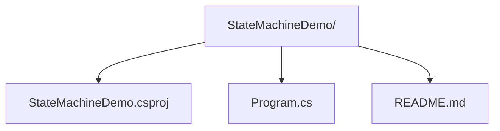
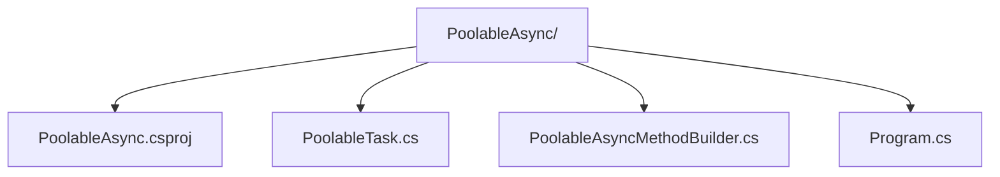

# async/await 状态机：从语法糖到执行模型的全景解析

## 前置知识

- [LINQ 延迟与立即执行](/csharp/029-LINQDeferredImmediate)：建议先完成前一篇的学习

## 学习目标

- 掌握「1. 历史动机与发展脉络」的核心机制、典型用法与常见陷阱
- 掌握「2. 形式化定义」的核心机制、典型用法与常见陷阱
- 掌握「3. 理论推导与原理解析」的核心机制、典型用法与常见陷阱
- 掌握「4. 代码示例」的核心机制、典型用法与常见陷阱
- 掌握「5. 对比分析」的核心机制、典型用法与常见陷阱


> 本章对标 MIT 6.1020（Software Construction）与 Stanford CS110L（Safety in Systems Programming）的异步教学深度，结合 ECMA-334 规范、CLR RFC 与 .NET Runtime 源码，将 `async/await` 的语法糖层层剥开，揭示编译器生成的状态机、`AsyncMethodBuilder`、`IAsyncStateMachine`、`MoveNext`、`SynchronizationContext`、`TaskScheduler` 与 `ConfigureAwait` 之间的协作机制。

## 1. 历史动机与发展脉络

### 1.1 异步编程的史前时代（.NET Framework 1.x，2002）

.NET 1.0 的异步模型基于 **APM（Asynchronous Programming Model）**，又称 `Begin/End` 模式。所有 `I/O` 类（如 `Stream`、`HttpWebRequest`、`Socket`）暴露成对的 `BeginXxx`/`EndXxx` 方法：

```csharp
// C# 1.0 APM 风格（2002）
Stream stream = File.OpenRead("data.bin");
IAsyncResult ar = stream.BeginRead(buffer, 0, buffer.Length,
    callback: asyncResult => {
        int bytesRead = stream.EndRead(asyncResult);
        // 处理数据...
    },
    state: null);
```

APM 的痛点：

- **回调地狱**：嵌套 `BeginXxx` 导致代码可读性急剧下降。
- **错误传播困难**：异常通过 `EndXxx` 重新抛出，调用者必须包裹 `try/catch`。
- **取消与进度支持缺失**：APM 没有内置取消令牌，需要自定义协议。
- **资源泄漏风险**：忘记调用 `EndXxx` 会导致 `IAsyncResult` 资源泄漏。

### 1.2 EAP：基于事件的异步模式（.NET Framework 2.0，2005）

为缓解 APM 的回调问题，.NET 2.0 引入 **EAP（Event-based Asynchronous Pattern）**：

```csharp
// C# 2.0 EAP 风格（2005）
var client = new WebClient();
client.DownloadStringCompleted += (sender, e) => {
    if (e.Error != null)
        Console.WriteLine($"Error: {e.Error.Message}");
    else
        Console.WriteLine($"Downloaded: {e.Result.Length} chars");
};
client.DownloadStringAsync(new Uri("https://example.com"));
```

EAP 的改进：

- 通过事件分离回调和异步发起。
- 内置 `CancelAsync` 与 `ProgressChanged` 事件。

EAP 的遗留问题：

- **事件订阅生命周期管理复杂**：容易遗忘 `-= ` 导致内存泄漏。
- **错误模型不一致**：错误在 `e.Error` 中而非异常。
- **组合性差**：无法像 `Task.WhenAll` 那样组合多个 EAP 操作。

### 1.3 TAP：任务异步模式（.NET Framework 4.0，2010）

`Task` 与 `Task<T>` 的引入（PFX 团队，Stephen Toub 主导）标志着 **TAP（Task-based Asynchronous Pattern）** 的诞生。`Task` 是一个表示异步操作的一等公民（first-class object），具备：

- **组合性**：`Task.WhenAll`、`Task.WhenAny`、`Task.ContinueWith`。
- **错误传播**：`Exception` 属性包装 `AggregateException`。
- **取消与进度**：`CancellationToken`、`IProgress<T>`。

```csharp
// C# 4.0 TAP 风格（2010，无 async/await）
Task<string> task = client.GetStringAsync(url);
task.ContinueWith(t => {
    if (t.IsFaulted)
        Console.WriteLine($"Error: {t.Exception}");
    else
        Console.WriteLine($"Result: {t.Result}");
});
```

TAP 解决了组合性问题，但仍然依赖显式 `ContinueWith`，回调嵌套依然存在。

### 1.4 async/await：异步的语法糖革命（C# 5.0，2012）

C# 5.0 引入 `async`/`await` 关键字，将异步代码以同步形式书写。这是 C# 历史上最重要的语言特性之一，由 Mads Torgersen、Stephen Toub、Lucian Wischik 等人设计。

核心思想：**编译器将 `async` 方法转换为状态机**，由 `AsyncMethodBuilder` 驱动 `MoveNext` 在 `await` 点之间的转移。开发者书写线性代码，编译器承担状态机展开。

```csharp
// C# 5.0 async/await 风格（2012）
async Task<string> FetchAsync(string url) {
    var response = await client.GetAsync(url);
    return await response.Content.ReadAsStringAsync();
}
```

### 1.5 后续演进：从 C# 5.0 到 C# 12

| 版本 | 年份 | 关键特性 | 对异步的影响 |
|------|------|----------|--------------|
| C# 5.0 | 2012 | `async`/`await` | 状态机生成，TAP 一等公民 |
| C# 6.0 | 2015 | `await` in `catch`/`finally` | 异常处理路径可异步等待 |
| C# 7.0 | 2017 | `ValueTask<T>`、`async` 返回类型自定义 | 减少 Task 分配，自定义 builder |
| C# 7.1 | 2017 | `default` 字面量 | 简化 `CancellationToken` 默认值 |
| C# 8.0 | 2019 | `IAsyncEnumerable<T>`、`await foreach`、`async using` | 异步流、异步释放 |
| C# 9.0 | 2020 | `async` 迭代器、`init` 属性 | 异步生成器更易编写 |
| C# 10.0 | 2021 | `AsyncMethodBuilder` 应用于任意类型 | 自定义异步返回类型更灵活 |
| C# 11.0 | 2022 | `required`、`file` 类型 | 与异步无直接关系 |
| C# 12.0 | 2023 | `async Task<T>` 主流化、`CollectionExpression` | 与异步无直接关系 |
| C# 13.0 | 2024 | `params ReadOnlySpan<T>`、`ref struct` 改进 | 间接影响异步内存模型 |

### 1.6 .NET Runtime 的演进

- **.NET Framework 4.5（2012）**：`async/await` 首次可用，`SynchronizationContext` 在 ASP.NET classic 中起关键作用。
- **.NET Core 1.0（2016）**：移除 `AspNetSynchronizationContext`，所有异步操作不再需要 `ConfigureAwait(false)`。
- **.NET Core 2.1（2018）**：`IAsyncEnumerable<T>` 雏形，`Span<T>` 加速异步 I/O。
- **.NET Core 3.0（2019）**：`ValueTask` 优化为可同时包装 `Task` 与 `T`，减少分配。
- **.NET 5（2020）**：性能优化，`AsyncIteratorMethodBuilder` 引入。
- **.NET 6（2021）**：`AsyncMethodBuilder` 支持泛型与属性，`PoolableAsyncMethodBuilder` 模式成熟。
- **.NET 7（2022）**：`AsyncMethodBuilder` 缓存优化，状态机结构体零装箱。
- **.NET 8（2023）**：`ConfigureAwait(ConfigureAwaitOptions)` 提供更细粒度控制。
- **.NET 9（2024）**：`Task.WaitAsync` 重载、`AsyncStream` 性能优化、AOT 场景下状态机代码体积压缩。

---

## 2. 形式化定义

### 2.1 ECMA-334 规范视角

ECMA-334（C# 语言规范）第 12 章将 `async` 修饰符定义为方法、Lambda 或匿名方法的可选修饰符。形式上：

$$
\textit{AsyncMethodDeclaration} ::= \texttt{async}\ \textit{Type}\ \textit{Identifier}\ (\textit{Parameters})\ \textit{Block}
$$

其中 `async` 关键字仅影响**方法内部**的语义，不影响方法签名（即调用者看不到 `async` 标记）。被 `async` 修饰的方法称为**异步函数**（async function），其返回类型必须是以下之一：

- `Task`
- `Task<T>`
- `ValueTask`
- `ValueTask<T>`
- 任何具有对应 `AsyncMethodBuilder` 的类型（C# 7+ 自定义返回类型）
- `void`（仅用于事件处理器，称为 `async void`）

### 2.2 await 表达式的形式语义

`await` 表达式形如：

$$
\textit{AwaitExpression} ::= \texttt{await}\ \textit{Expression}
$$

其中 `Expression` 必须是 **可等待（awaitable）** 类型。一个类型 $T$ 是可等待的，当且仅当满足以下条件之一：

1. $T$ 是 `dynamic` 类型；或
2. $T$ 具有可访问的 `GetAwaiter` 方法（实例或扩展），返回类型 $A$ 满足：
   - $A$ 实现了 `INotifyCompletion` 接口（必须有 `OnCompleted(Action)` 方法）；
   - $A$ 具有可访问的 `bool IsCompleted { get; }` 属性；
   - $A$ 具有可访问的 `GetResult()` 方法（可空参数列表）。

形式化定义可等待模式（Awaitable Pattern）：

$$
\textit{Awaitable}(T) \iff \exists A.\ \text{GetAwaiter}(T): A \land \text{IsCompleted}(A): \text{bool} \land \text{OnCompleted}(A, \text{Action}) \land \text{GetResult}(A): \tau
$$

### 2.3 状态机接口的形式化定义

CLR 通过 `IAsyncStateMachine` 接口（定义于 `System.Runtime.CompilerServices`）规范状态机行为：

```csharp
namespace System.Runtime.CompilerServices
{
    public interface IAsyncStateMachine
    {
        void MoveNext();            // 推进状态机到下一个 await 点
        void SetStateMachine(IAsyncStateMachine stateMachine);  // 装箱后用于回调
    }
}
```

`MoveNext` 是状态机的核心驱动函数，其语义可以形式化为一个有限状态自动机（FSA）：

$$
\textit{FSM} = (S, \Sigma, \delta, s_0, F)
$$

其中：

- $S$：状态集合 $\{-1, 0, 1, 2, \ldots, n\}$，$-1$ 表示已完成（或异常），$0$ 为初始状态，$n$ 为最大 await 点编号。
- $\Sigma$：输入字母表 $\{\text{Start}, \text{AwaitCompleted}, \text{AwaitSuspended}, \text{Resume}\}$。
- $\delta: S \times \Sigma \to S$：状态转移函数，由编译器生成的 `switch` 表实现。
- $s_0 = 0$：初始状态。
- $F = \{-1\}$：终止状态集。

### 2.4 AsyncMethodBuilder 接口

`AsyncMethodBuilder` 是编译器与运行时之间的契约。每个异步返回类型对应一个 builder 类型：

```csharp
// 简化版接口契约（实际包含更多内部成员）
public struct AsyncTaskMethodBuilder<T>
{
    public static AsyncTaskMethodBuilder<T> Create();
    public void Start<TStateMachine>(ref TStateMachine stateMachine)
        where TStateMachine : IAsyncStateMachine;
    public void SetStateMachine(IAsyncStateMachine stateMachine);
    public void SetException(Exception exception);
    public void SetResult(T result);
    public void AwaitOnCompleted<TAwaiter, TStateMachine>(
        ref TAwaiter awaiter, ref TStateMachine stateMachine)
        where TAwaiter : INotifyCompletion
        where TStateMachine : IAsyncStateMachine;
    public void AwaitUnsafeOnCompleted<TAwaiter, TStateMachine>(
        ref TAwaiter awaiter, ref TStateMachine stateMachine)
        where TAwaiter : ICriticalNotifyCompletion
        where TStateMachine : IAsyncStateMachine;
    public Task<T> Task { get; }
}
```

### 2.5 SynchronizationContext 的形式化角色

`SynchronizationContext` 是 .NET 对"执行上下文"的抽象。其核心方法：

```csharp
public class SynchronizationContext
{
    public virtual void Post(SendOrPostCallback d, object? state);  // 异步
    public virtual void Send(SendOrPostCallback d, object? state);  // 同步
    public static SynchronizationContext? Current { get; }
    public static void SetSynchronizationContext(SynchronizationContext? ctx);
}
```

`Post` 的语义可形式化为：

$$
\textit{Post}(ctx, f) : \text{将回调}\ f\ \text{调度到}\ ctx\ \text{关联的执行线程}
$$

在 WPF 中，`Post` 调用 `Dispatcher.BeginInvoke`；在 Windows Forms 中，`Post` 调用 `Control.BeginInvoke`；在 ASP.NET classic 中，`Post` 在请求上下文上恢复执行；在 ASP.NET Core 与 Console 应用中，`SynchronizationContext.Current == null`，`Post` 默认委托给 `ThreadPool.QueueUserWorkItem`。

### 2.6 类型系统约束

C# 7.0 起，`async` 方法的返回类型可以自定义，但必须满足：

1. 类型 $T$ 必须可访问。
2. 类型 $T$ 必须具有 `[AsyncMethodBuilder(typeof(B))]` 特性，其中 $B$ 是对应的 builder 类型。
3. Builder $B$ 必须满足上述 `AsyncMethodBuilder` 接口契约。

C# 10.0 进一步允许 `[AsyncMethodBuilder(...)]` 应用于属性、字段、参数，扩展了自定义场景。

---

## 3. 理论推导与原理解析

### 3.1 状态机生成的核心算法

编译器对 `async` 方法的转换遵循以下算法（简化版）：

```text
输入：async 方法 M，包含 await 点 a_1, a_2, ..., a_n
输出：状态机结构体 StateMachine_M，builder 方法 Builder_M

1. 创建结构体 StateMachine_M : IAsyncStateMachine
   - 字段：
     * int <>1__state: 当前状态，初始 0（或 -1 表示已启动）
     * TBuilder <>t__builder: AsyncMethodBuilder 实例
     * TAwaiter <>u__1, <>u__2, ...: 每个 await 的 awaiter
     * 局部变量提升为字段
   - 方法：
     * void MoveNext(): 状态转移逻辑
     * void SetStateMachine(IAsyncStateMachine): 装箱回调

2. 在原方法 M 中：
   - 创建 StateMachine_M 实例（栈分配）
   - 调用 <>t__builder.Start(ref stateMachine)
   - 返回 <>t__builder.Task
```

### 3.2 MoveNext 的状态转移逻辑

`MoveNext` 是状态机的核心。考虑以下原方法：

```csharp
async Task<int> SumAsync(Task<int> a, Task<int> b) {
    int x = await a;
    int y = await b;
    return x + y;
}
```

编译器生成（伪代码）：

```csharp
[CompilerGenerated]
[AsyncMethodBuilder(typeof(AsyncTaskMethodBuilder<int>))]
private struct SumAsync_StateMachine : IAsyncStateMachine
{
    public int <>1__state;
    public AsyncTaskMethodBuilder<int> <>t__builder;
    public TaskAwaiter<int> <>u__1;
    public Task<int> a, b;
    public int x, y;

    public void MoveNext()
    {
        int result;
        try
        {
            TaskAwaiter<int> awaiter;
            switch (this.<>1__state)
            {
                case 0:  // 第一次进入，等待 a
                    goto label_waitA;
                case 1:  // a 已完成，恢复
                    awaiter = this.<>u__1;
                    this.<>u__1 = default;
                    this.<>1__state = -1;
                    goto label_continueA;
                case 2:  // b 已完成，恢复
                    awaiter = this.<>u__1;
                    this.<>u__1 = default;
                    this.<>1__state = -1;
                    goto label_continueB;
                default:
                    // 不应到达
                    throw new InvalidOperationException();
            }

        label_waitA:
            this.<>1__state = 0;
            awaiter = this.a.GetAwaiter();
            if (!awaiter.IsCompleted)
            {
                this.<>u__1 = awaiter;
                this.<>t__builder.AwaitUnsafeOnCompleted(ref awaiter, ref this);
                return;  // 挂起，等待回调
            }
        label_continueA:
            this.x = awaiter.GetResult();

        label_waitB:
            this.<>1__state = 1;
            awaiter = this.b.GetAwaiter();
            if (!awaiter.IsCompleted)
            {
                this.<>u__1 = awaiter;
                this.<>t__builder.AwaitUnsafeOnCompleted(ref awaiter, ref this);
                return;  // 挂起
            }
        label_continueB:
            this.y = awaiter.GetResult();

            result = this.x + this.y;
        }
        catch (Exception ex)
        {
            this.<>1__state = -1;
            this.<>t__builder.SetException(ex);
            return;
        }

        this.<>1__state = -1;
        this.<>t__builder.SetResult(result);
    }

    public void SetStateMachine(IAsyncStateMachine stateMachine) =>
        this.<>t__builder.SetStateMachine(stateMachine);
}
```

### 3.3 状态转移图

将上述 `MoveNext` 抽象为状态转移图：

$$
\begin{aligned}
& s_0 \xrightarrow{\text{await } a\ (\text{pending})} s_0^{\text{susp}} \xrightarrow{\text{resume}} s_1 \\
& s_0 \xrightarrow{\text{await } a\ (\text{sync})} s_1 \\
& s_1 \xrightarrow{\text{await } b\ (\text{pending})} s_1^{\text{susp}} \xrightarrow{\text{resume}} s_2 \\
& s_1 \xrightarrow{\text{await } b\ (\text{sync})} s_2 \\
& s_2 \xrightarrow{\text{return } x+y} s_{\text{final}}
\end{aligned}
$$

其中 $s_i^{\text{susp}}$ 表示挂起状态，等待底层 I/O 完成后由 `AwaitUnsafeOnCompleted` 注册的回调触发 `MoveNext`。

### 3.4 AwaitUnsafeOnCompleted 的调用链

`AwaitUnsafeOnCompleted` 是状态机与 awaiter 之间的桥梁。其调用链：

1. 状态机调用 `builder.AwaitUnsafeOnCompleted(ref awaiter, ref this)`。
2. Builder 调用 `awaiter.UnsafeOnCompleted(continuation)`（要求 awaiter 实现 `ICriticalNotifyCompletion`）。
3. Awaiter 注册回调到其底层 Task（如 `TaskAwaiter` 调用 `Task.UnsafeOnCompleted`）。
4. Task 完成时，调用 continuation，即 `MoveNext`（通过 `IAsyncStateMachine.MoveNext`）。

形式化：

$$
\text{Complete}(T, v) \to \text{Invoke}(\text{Continuation}(T)) \to \text{MoveNext}(\text{StateMachine}) \to \text{Resume at } s_{i+1}
$$

### 3.5 同步完成 vs 异步完成的优化

当 `awaiter.IsCompleted == true` 时，状态机不挂起，直接调用 `GetResult()` 继续。这避免了：

- 注册回调的开销
- 上下文切换
- 异步恢复的延迟

这是 **fast path**。许多高性能场景（如内存缓存命中）会走 fast path，几乎无开销。

### 3.6 SynchronizationContext 捕获的时机

在 `AwaitUnsafeOnCompleted` 中，builder 会捕获当前 `SynchronizationContext`（如果有）：

```csharp
// 简化的 AsyncTaskMethodBuilder.AwaitUnsafeOnCompleted 内部
var syncCtx = SynchronizationContext.Current;
if (syncCtx != null && syncCtx.GetType() != typeof(SynchronizationContext))
{
    // 使用 SynchronizationContext 调度 continuation
    awaiter.UnsafeOnCompleted(() => syncCtx.Post(state => moveNext(), null));
}
else
{
    // 使用 TaskScheduler.Current 调度
    awaiter.UnsafeOnCompleted(moveNext);
}
```

`ConfigureAwait(false)` 的作用是**告诉 builder 不捕获 SynchronizationContext**，直接在底层 Task 完成的线程上继续执行 `MoveNext`。

### 3.7 状态机装箱的时机

状态机默认是 `struct`，避免堆分配。但有两种情况会触发装箱（boxing）：

1. **状态机需要跨方法边界**：当 `await` 挂起后，状态机必须存储在堆上，以便底层 I/O 完成后能找到它。Builder 通过 `SetStateMachine` 接收装箱后的状态机引用。
2. **状态机作为 `IAsyncStateMachine` 接口实例**：当 builder 调用 `stateMachine.MoveNext()` 时，会触发装箱。

.NET Runtime 通过"首次挂起时装箱"策略优化：状态机在第一次 `await` 挂起前不装箱，只有挂起时才在堆上分配。

形式化：

$$
\text{Box}(SM) = \begin{cases}
\text{栈分配} & \text{if no await suspended} \\
\text{堆分配 (装箱)} & \text{if any await suspends}
\end{cases}
$$

### 3.8 ValueTask 的优化原理

`ValueTask<T>` 是结构体，可以同时包装：

- `T`（同步完成结果）
- `Task<T>`（异步完成）
- `IValueTaskSource<T>`（可复用的异步源，如 `AsyncOperation<T>`）

当方法同步完成时，`ValueTask<T>` 直接持有 `T`，零堆分配。当异步完成时，`ValueTask<T>` 持有 `Task<T>` 或 `IValueTaskSource<T>`，与 `Task<T>` 开销相同。

`ValueTask` 的代价：

- 不能多次 await（除非转换为 `Task`）
- 不能并发 await
- API 设计复杂

### 3.9 性能模型

设 $N$ 为 `await` 点数，$P_{\text{susp}}$ 为挂起概率，则：

$$
\text{Allocations} \approx P_{\text{susp}} \cdot (\text{StateMachine}_{\text{box}} + \text{Task}_{\text{alloc}}) + (1 - P_{\text{susp}}) \cdot 0
$$

对于 `ValueTask`：

$$
\text{Allocations}_{\text{ValueTask}} \approx P_{\text{susp}} \cdot \text{StateMachine}_{\text{box}} + (1 - P_{\text{susp}}) \cdot 0
$$

即 `ValueTask` 在异步路径仍需装箱状态机，但避免了 `Task` 分配。

---

## 4. 代码示例

### 4.1 最小可复现：观察状态机字段

下面通过 `dotnet` 创建项目，反编译观察编译器生成的状态机。

#### 4.1.1 项目结构



#### 4.1.2 csproj 配置（.NET 9，C# 12）

```xml
<Project Sdk="Microsoft.NET.Sdk">

  <PropertyGroup>
    <OutputType>Exe</OutputType>
    <TargetFramework>net9.0</TargetFramework>
    <LangVersion>12</LangVersion>
    <Nullable>enable</Nullable>
    <ImplicitUsings>enable</ImplicitUsings>
    <!-- 允许查看编译器生成的状态机 -->
    <ServerGarbageCollection>true</ServerGarbageCollection>
    <TieredCompilation>true</TieredCompilation>
  </PropertyGroup>

  <ItemGroup>
    <!-- 引入 ILSpy 反编译工具的命令行版本 -->
    <PackageReference Include="ICSharpCode.Decompiler" Version="8.2.0.7535" />
  </ItemGroup>

</Project>
```

#### 4.1.3 源代码

```csharp
// Program.cs
using System;
using System.Threading.Tasks;

namespace StateMachineDemo;

public class Program
{
    /// <summary>
    /// 入口方法：演示一个包含两个 await 点的异步方法。
    /// 编译器会为该方法生成状态机结构体。
    /// </summary>
    public static async Task<int> Main(string[] args)
    {
        int a = await FetchAsync("https://example.com/a");
        int b = await FetchAsync("https://example.com/b");
        Console.WriteLine($"Sum: {a + b}");
        return a + b;
    }

    /// <summary>
    /// 模拟异步 I/O 操作。
    /// 该方法本身也是一个状态机，但 await Task.Delay 时会挂起。
    /// </summary>
    private static async Task<int> FetchAsync(string url)
    {
        await Task.Delay(Random.Shared.Next(10, 100));
        return url.Length;
    }
}
```

#### 4.1.4 反编译查看状态机

```bash
# 使用 ilspycmd 反编译
dotnet tool install -g ilspycmd
ilspycmd -p StateMachineDemo.dll > decompiled.cs
```

反编译后可以看到编译器生成的 `<Main>d__0` 结构体，包含 `<>1__state`、`<>t__builder`、`<>u__1`、`<>s__4` 等字段。

### 4.2 企业级示例：自定义 AsyncMethodBuilder

下面演示如何为自定义类型 `PoolableTask<T>` 实现 `AsyncMethodBuilder`，复用状态机对象。

#### 4.2.1 项目结构



#### 4.2.2 csproj 配置

```xml
<Project Sdk="Microsoft.NET.Sdk">

  <PropertyGroup>
    <OutputType>Exe</OutputType>
    <TargetFramework>net9.0</TargetFramework>
    <LangVersion>12</LangVersion>
    <Nullable>enable</Nullable>
    <AllowUnsafeBlocks>true</AllowUnsafeBlocks>
  </PropertyGroup>

</Project>
```

#### 4.2.3 自定义异步返回类型

```csharp
// PoolableTask.cs
using System;
using System.Runtime.CompilerServices;
using System.Threading;
using System.Threading.Tasks;

namespace PoolableAsync;

/// <summary>
/// 可池化复用的 Task 类型。
/// 通过 [AsyncMethodBuilder] 特性告知编译器使用 PoolableAsyncMethodBuilder。
/// </summary>
[AsyncMethodBuilder(typeof(PoolableAsyncMethodBuilder<>))]
public readonly struct PoolableTask<T>
{
    private readonly Task<T>? _task;
    private readonly T _value;
    private readonly bool _hasValue;

    /// <summary>
    /// 构造同步完成的结果。
    /// </summary>
    public PoolableTask(T value)
    {
        _value = value;
        _hasValue = true;
        _task = null;
    }

    /// <summary>
    /// 构造异步完成的 Task。
    /// </summary>
    public PoolableTask(Task<T> task)
    {
        _task = task ?? throw new ArgumentNullException(nameof(task));
        _hasValue = false;
        _value = default!;
    }

    /// <summary>
    /// 获取 awaiter。
    /// </summary>
    public TaskAwaiter<T> GetAwaiter()
    {
        if (_hasValue)
        {
            return Task.FromResult(_value).GetAwaiter();
        }
        return _task!.GetAwaiter();
    }

    /// <summary>
    /// 隐式转换为 Task，便于与其他 API 互操作。
    /// </summary>
    public Task<T> AsTask()
    {
        return _hasValue ? Task.FromResult(_value) : _task!;
    }
}
```

#### 4.2.4 自定义 AsyncMethodBuilder

```csharp
// PoolableAsyncMethodBuilder.cs
using System;
using System.Runtime.CompilerServices;
using System.Threading.Tasks;

namespace PoolableAsync;

/// <summary>
/// PoolableTask&lt;T&gt; 的 AsyncMethodBuilder 实现。
/// 编译器会为每个 async PoolableTask&lt;T&gt; 方法生成对以下成员的调用。
/// </summary>
public struct PoolableAsyncMethodBuilder<T>
{
    private AsyncTaskMethodBuilder<T> _inner;  // 委托给标准 builder

    /// <summary>
    /// 创建 builder 实例。
    /// </summary>
    public static PoolableAsyncMethodBuilder<T> Create()
    {
        return new PoolableAsyncMethodBuilder<T>
        {
            _inner = AsyncTaskMethodBuilder<T>.Create()
        };
    }

    /// <summary>
    /// 启动状态机。
    /// </summary>
    public void Start<TStateMachine>(ref TStateMachine stateMachine)
        where TStateMachine : IAsyncStateMachine
    {
        _inner.Start(ref stateMachine);
    }

    /// <summary>
    /// 设置已装箱的状态机引用。
    /// </summary>
    public void SetStateMachine(IAsyncStateMachine stateMachine)
    {
        _inner.SetStateMachine(stateMachine);
    }

    /// <summary>
    /// 设置异常结果。
    /// </summary>
    public void SetException(Exception exception)
    {
        _inner.SetException(exception);
    }

    /// <summary>
    /// 设置成功结果，封装为 PoolableTask。
    /// </summary>
    public void SetResult(T result)
    {
        _inner.SetResult(result);
    }

    /// <summary>
    /// 注册 awaiter 完成时的 continuation。
    /// </summary>
    public void AwaitOnCompleted<TAwaiter, TStateMachine>(
        ref TAwaiter awaiter, ref TStateMachine stateMachine)
        where TAwaiter : INotifyCompletion
        where TStateMachine : IAsyncStateMachine
    {
        _inner.AwaitOnCompleted(ref awaiter, ref stateMachine);
    }

    /// <summary>
    /// 注册 awaiter 完成时的 continuation（不捕获执行上下文）。
    /// </summary>
    public void AwaitUnsafeOnCompleted<TAwaiter, TStateMachine>(
        ref TAwaiter awaiter, ref TStateMachine stateMachine)
        where TAwaiter : ICriticalNotifyCompletion
        where TStateMachine : IAsyncStateMachine
    {
        _inner.AwaitUnsafeOnCompleted(ref awaiter, ref stateMachine);
    }

    /// <summary>
    /// 返回 PoolableTask。
    /// </summary>
    public PoolableTask<T> Task
    {
        get
        {
            var task = _inner.Task;
            return task.IsCompletedSuccessfully
                ? new PoolableTask<T>(task.Result)
                : new PoolableTask<T>(task);
        }
    }
}
```

#### 4.2.5 使用示例

```csharp
// Program.cs
using System;
using System.Threading.Tasks;
using PoolableAsync;

class Program
{
    static async Task Main()
    {
        // 使用自定义 PoolableTask 作为返回类型
        var result = await ComputeAsync(10, 20);
        Console.WriteLine($"Result: {result}");
    }

    /// <summary>
    /// 返回 PoolableTask 的异步方法。
    /// 编译器会使用 PoolableAsyncMethodBuilder&lt;int&gt; 驱动状态机。
    /// </summary>
    static async PoolableTask<int> ComputeAsync(int a, int b)
    {
        await Task.Delay(10);  // 异步等待
        return a + b;
    }
}
```

### 4.3 SynchronizationContext 捕获演示

#### 4.3.1 WPF 场景

```csharp
// WPF 中的死锁陷阱
public partial class MainWindow : Window
{
    public MainWindow()
    {
        InitializeComponent();
    }

    private void OnClick(object sender, RoutedEventArgs e)
    {
        // 错误示范：在 UI 线程调用 .Result，导致死锁
        // var data = GetDataBlocking();

        // 正确示范：异步等待
        var data = GetDataAsync();
    }

    /// <summary>
    /// 错误示范：阻塞 UI 线程，导致死锁。
    /// 原因：GetDataAsync 内部 await 捕获了 UI SynchronizationContext，
    ///      但 UI 线程被 .Result 阻塞，无法执行 continuation。
    /// </summary>
    private string GetDataBlocking()
    {
        return GetDataAsync().Result;  // 死锁！
    }

    /// <summary>
    /// 正确的异步调用。
    /// </summary>
    private async Task<string> GetDataAsync()
    {
        // ConfigureAwait(true) 默认：continuation 在 UI 线程执行
        await Task.Delay(100);
        return "data";
    }

    /// <summary>
    /// 库代码应使用 ConfigureAwait(false) 避免上下文捕获。
    /// </summary>
    private async Task<string> GetDataFromLibraryAsync()
    {
        await Task.Delay(100).ConfigureAwait(false);
        return "data";
    }
}
```

#### 4.3.2 ASP.NET Core 场景

```csharp
// ASP.NET Core 控制器
[ApiController]
[Route("api/[controller]")]
public class DataController : ControllerBase
{
    private readonly IHttpClientFactory _httpClientFactory;

    public DataController(IHttpClientFactory httpClientFactory)
    {
        _httpClientFactory = httpClientFactory;
    }

    /// <summary>
    /// ASP.NET Core 没有 SynchronizationContext，
    /// ConfigureAwait(false) 与 ConfigureAwait(true) 行为一致。
    /// </summary>
    [HttpGet]
    public async Task<IActionResult> Get()
    {
        var client = _httpClientFactory.CreateClient();
        // 不需要 ConfigureAwait(false)，但加上无副作用
        var response = await client.GetAsync("https://api.example.com/data");
        var content = await response.Content.ReadAsStringAsync();
        return Ok(content);
    }
}
```

### 4.4 ValueTask 性能基准

```csharp
// ValueTaskBenchmark.cs
using System;
using System.Collections.Generic;
using System.Threading.Tasks;
using BenchmarkDotNet.Attributes;
using BenchmarkDotNet.Running;

public class TaskVsValueTaskBenchmark
{
    private static readonly int[] Cache = new int[1000];

    static TaskVsValueTaskBenchmark()
    {
        var rng = new Random(42);
        for (int i = 0; i < Cache.Length; i++)
            Cache[i] = rng.Next();
    }

    /// <summary>
    /// Task 版本：每次都分配 Task&lt;int&gt;。
    /// </summary>
    [Benchmark(Baseline = true)]
    public async Task<int> TaskVersion()
    {
        return await GetWithTaskAsync(0);
    }

    /// <summary>
    /// ValueTask 版本：同步完成零分配。
    /// </summary>
    [Benchmark]
    public async Task<int> ValueTaskVersion()
    {
        return await GetWithValueTaskAsync(0);
    }

    private static async Task<int> GetWithTaskAsync(int index)
    {
        if (index >= 0 && index < Cache.Length)
            return Cache[index];  // 同步返回，但 Task.FromResult 仍分配
        await Task.Delay(10);
        return -1;
    }

    private static async ValueTask<int> GetWithValueTaskAsync(int index)
    {
        if (index >= 0 && index < Cache.Length)
            return Cache[index];  // 同步返回，零分配
        await Task.Delay(10);
        return -1;
    }
}

public class Program
{
    public static void Main()
    {
        BenchmarkRunner.Run<TaskVsValueTaskBenchmark>();
    }
}
```

### 4.5 完整的异步流水线示例

```csharp
// AsyncPipeline.cs
using System;
using System.Collections.Concurrent;
using System.Threading;
using System.Threading.Channels;
using System.Threading.Tasks;

public class AsyncPipeline<TInput, TOutput>
{
    private readonly Channel<TInput> _input;
    private readonly Channel<TOutput> _output;
    private readonly Func<TInput, CancellationToken, Task<TOutput>> _transform;
    private readonly int _degreeOfParallelism;
    private readonly CancellationTokenSource _cts;

    public AsyncPipeline(
        Func<TInput, CancellationToken, Task<TOutput>> transform,
        int degreeOfParallelism = 4,
        int inputCapacity = 100,
        int outputCapacity = 100)
    {
        _transform = transform ?? throw new ArgumentNullException(nameof(transform));
        _degreeOfParallelism = degreeOfParallelism;
        _input = Channel.CreateBounded<TInput>(inputCapacity);
        _output = Channel.CreateBounded<TOutput>(outputCapacity);
        _cts = new CancellationTokenSource();
    }

    /// <summary>
    /// 启动流水线，返回输出通道读取器。
    /// </summary>
    public ChannelReader<TOutput> Run()
    {
        var token = _cts.Token;
        var workers = new Task[_degreeOfParallelism];

        for (int i = 0; i < _degreeOfParallelism; i++)
        {
            workers[i] = WorkerAsync(token);
        }

        _ = Task.WhenAll(workers).ContinueWith(_ =>
        {
            _output.Writer.TryComplete();
        }, TaskContinuationOptions.None);

        return _output.Reader;
    }

    /// <summary>
    /// 工作者：从输入通道读取，处理，写入输出通道。
    /// </summary>
    private async Task WorkerAsync(CancellationToken ct)
    {
        try
        {
            await foreach (var item in _input.Reader.ReadAllAsync(ct))
            {
                var output = await _transform(item, ct);
                await _output.Writer.WriteAsync(output, ct);
            }
        }
        catch (OperationCanceledException) when (ct.IsCancellationRequested)
        {
            // 正常关闭
        }
        catch (Exception ex)
        {
            _output.Writer.TryComplete(ex);
        }
    }

    /// <summary>
    /// 写入输入。
    /// </summary>
    public async Task EnqueueAsync(TInput item, CancellationToken ct = default)
    {
        await _input.Writer.WriteAsync(item, ct);
    }

    /// <summary>
    /// 完成输入。
    /// </summary>
    public void Complete()
    {
        _input.Writer.TryComplete();
    }

    /// <summary>
    /// 停止流水线。
    /// </summary>
    public void Stop()
    {
        _cts.Cancel();
    }
}

public class Program
{
    public static async Task Main()
    {
        var pipeline = new AsyncPipeline<int, string>(
            async (n, ct) =>
            {
                await Task.Delay(10, ct);
                return $"Processed-{n}";
            },
            degreeOfParallelism: 4);

        _ = Task.Run(async () =>
        {
            for (int i = 0; i < 100; i++)
                await pipeline.EnqueueAsync(i);
            pipeline.Complete();
        });

        await foreach (var result in pipeline.Run().ReadAllAsync())
        {
            Console.WriteLine(result);
        }
    }
}
```

---

## 5. 对比分析

### 5.1 与 Java CompletableFuture 的对比

| 维度 | C# async/await | Java CompletableFuture |
|------|----------------|------------------------|
| 语法 | `async`/`await` 关键字（编译器转换） | 仅库支持，无语法糖 |
| 状态机 | 编译器生成，struct 或 class | 运行时对象，堆分配 |
| 类型 | `Task<T>`、`ValueTask<T>` | `CompletableFuture<T>`、`Future<T>` |
| 取消 | `CancellationToken` 一等公民 | `CompletableFuture.cancel(true)` |
| 异常 | `await` 重新抛出原始异常 | `CompletionException` 包装 |
| 上下文 | `SynchronizationContext` 自动捕获 | 显式指定 `Executor` |
| 阻塞 | `.Result` 死锁风险 | `.get()` 阻塞当前线程 |
| 虚拟线程 | 不需要（线程池轻量） | Java 21+ 虚拟线程替代 |

#### 5.1.1 Java 示例

```java
// Java 风格
CompletableFuture<Integer> future = CompletableFuture
    .supplyAsync(() -> fetchData("url"))
    .thenApply(data -> data.length())
    .thenCompose(len -> saveToDb(len));

// 显式 executor
ExecutorService executor = Executors.newFixedThreadPool(4);
CompletableFuture<Integer> withExecutor = CompletableFuture
    .supplyAsync(() -> fetchData("url"), executor);
```

#### 5.1.2 C# 等价

```csharp
// C# 风格
async Task<int> ProcessAsync()
{
    var data = await FetchDataAsync("url");
    var len = data.Length;
    return await SaveToDbAsync(len);
}
```

C# 的优势在于**线性书写**，编译器自动处理状态转移。

### 5.2 与 Kotlin Coroutines 的对比

| 维度 | C# async/await | Kotlin Coroutines |
|------|----------------|--------------------|
| 语法 | `async`/`await` 关键字 | `suspend` 函数 |
| 状态机 | 编译器生成 struct | 编译器生成 class |
| 调度器 | `SynchronizationContext`、`TaskScheduler` | `CoroutineDispatcher` |
| 上下文 | 隐式 `SynchronizationContext` | 显式 `CoroutineContext` |
| 取消 | `CancellationToken` | `CoroutineScope` 协作取消 |
| 结构化并发 | 无内置 | `coroutineScope`、`supervisorScope` |
| 多线程 | `Task.Run`、`ThreadPool` | `Dispatchers.IO`、`Dispatchers.Default` |

#### 5.2.1 Kotlin 示例

```kotlin
// Kotlin 风格
suspend fun fetchData(): String {
    delay(100)
    return "data"
}

// 结构化并发
suspend fun processAll() = coroutineScope {
    val deferred1 = async { fetchData() }
    val deferred2 = async { fetchData() }
    println("${deferred1.await()}, ${deferred2.await()}")
}
```

Kotlin 的优势：**结构化并发**（structured concurrency）是语言级特性，避免协程泄漏。

### 5.3 与 JavaScript async/await 的对比

| 维度 | C# async/await | JavaScript async/await |
|------|----------------|------------------------|
| 语法 | `async`/`await` | `async`/`await` |
| 单线程 | 多线程，线程池 | 单线程事件循环 |
| Promise | `Task` | `Promise` |
| 取消 | `CancellationToken` | `AbortController` |
| 错误 | `Exception` | `Error` 对象 |
| 微任务 | `SynchronizationContext` | `queueMicrotask` |
| Top-level | .NET 7+ 支持 | Node.js / 浏览器支持 |

JavaScript 的状态机由 V8 引擎在 JIT 阶段生成，无源码级可见性。

### 5.4 与 Go goroutine 的对比

| 维度 | C# async/await | Go goroutine |
|------|----------------|---------------|
| 并发模型 | 异步 I/O，状态机 | CSP，goroutine + channel |
| 线程 | 线程池 | 用户态调度器（M:N） |
| 语法 | `async`/`await` | `go func()` |
| 取消 | `CancellationToken` | `context.Context` |
| 通信 | `Channel<T>` | `chan T` |
| 堆分配 | `Task` 分配 | goroutine 栈（2KB 起步） |
| 学习成本 | 中（状态机概念） | 低（线性思维） |

Go 的优势：**goroutine 极轻量**，2KB 起步栈，可以轻松开百万级。

C# 的优势：**类型安全**、**异步取消**、**与 BCL 集成度高**。

### 5.5 综合对比表

| 特性 | C# 12 | Java 21 | Kotlin 1.9 | TS 5.x | Go 1.22 |
|------|-------|---------|------------|--------|---------|
| async/await 语法 | 有 | 无（虚拟线程） | suspend 函数 | 有 | 无（go） |
| 编译器状态机 | 有 | 无 | 有 | 有（JIT） | 无 |
| 取消令牌 | `CancellationToken` | `Future.cancel` | `CoroutineScope` | `AbortController` | `context.Context` |
| 结构化并发 | 第三方（CancelScope） | 无 | 语言级 | 无 | 语言级 |
| 异步流 | `IAsyncEnumerable` | `Flow`（响应式） | `Flow` | `AsyncIterator` | `chan` |
| 零分配优化 | `ValueTask` | 无 | 无 | 无 | goroutine 栈 |

---

## 6. 常见陷阱与最佳实践

### 6.1 陷阱一：async void

```csharp
// 错误：async void 异常无法被捕获
async void ProcessAsync()
{
    await Task.Delay(100);
    throw new InvalidOperationException("Boom");  // 崩溃进程
}

// 正确：返回 Task
async Task ProcessAsync()
{
    await Task.Delay(100);
    throw new InvalidOperationException("Boom");  // 调用者可 await 捕获
}
```

**例外**：事件处理器必须使用 `async void`，因为 .NET 事件签名要求 `void` 返回。

### 6.2 陷阱二：.Result / .Wait() 死锁

```csharp
// 错误：在 UI 线程或 ASP.NET classic 中死锁
public string GetData()
{
    return GetDataAsync().Result;  // 死锁
}

private async Task<string> GetDataAsync()
{
    await Task.Delay(100);  // 默认 ConfigureAwait(true)，等待 UI 上下文
    return "data";          // UI 线程被 .Result 阻塞，永远不返回
}
```

**修复**：

1. 全链路异步化（推荐）。
2. 库代码使用 `ConfigureAwait(false)`。
3. ASP.NET Core 无此问题（无 `SynchronizationContext`）。

### 6.3 陷阱三：未传递 CancellationToken

```csharp
// 错误：无法取消
async Task<string> FetchAsync(string url)
{
    var client = new HttpClient();
    return await client.GetStringAsync(url);
}

// 正确：支持取消
async Task<string> FetchAsync(string url, CancellationToken ct = default)
{
    using var client = new HttpClient();
    return await client.GetStringAsync(url, ct);
}
```

### 6.4 陷阱四：async 方法中未 await

```csharp
// 错误：fire-and-forget，异常丢失
async Task ProcessAllAsync(IEnumerable<string> urls)
{
    foreach (var url in urls)
    {
        FetchAsync(url);  // 未 await，异常丢失
    }
}

// 正确：并行 await
async Task ProcessAllAsync(IEnumerable<string> urls)
{
    var tasks = urls.Select(FetchAsync);
    await Task.WhenAll(tasks);
}
```

### 6.5 陷阱五：ValueTask 误用

```csharp
// 错误：ValueTask 不能多次 await
async ValueTask<int> GetAsync()
{
    await Task.Delay(10);
    return 42;
}

var vt = GetAsync();
int r1 = await vt;
int r2 = await vt;  // 未定义行为！

// 正确：转 Task
var task = vt.AsTask();
int r1 = await task;
int r2 = await task;  // OK
```

### 6.6 陷阱六：循环中的 async

```csharp
// 错误：串行执行
foreach (var url in urls)
{
    await FetchAsync(url);  // 串行
}

// 正确：并行执行
await Task.WhenAll(urls.Select(FetchAsync));

// 限制并发数
var semaphore = new SemaphoreSlim(10);
await Task.WhenAll(urls.Select(async url =>
{
    await semaphore.WaitAsync();
    try { await FetchAsync(url); }
    finally { semaphore.Release(); }
}));
```

### 6.7 陷阱七：在 lock 内 await

```csharp
// 错误：C# 不允许在 lock 内 await
lock (syncObj)
{
    await FetchAsync();  // 编译错误
}

// 正确：使用 SemaphoreSlim
private readonly SemaphoreSlim _sem = new(1, 1);

async Task ProcessAsync()
{
    await _sem.WaitAsync();
    try
    {
        await FetchAsync();
    }
    finally
    {
        _sem.Release();
    }
}
```

### 6.8 陷阱八：捕获循环变量

```csharp
// 错误：所有 Lambda 捕获同一个 i
var tasks = new List<Task>();
for (int i = 0; i < 10; i++)
{
    tasks.Add(Task.Run(() => Console.WriteLine(i)));  // 都打印 10
}

// 正确：循环内复制
for (int i = 0; i < 10; i++)
{
    int local = i;
    tasks.Add(Task.Run(() => Console.WriteLine(local)));
}
```

### 6.9 最佳实践总结

1. **库代码默认 `ConfigureAwait(false)`**（争议但被广泛采纳）。
2. **公共 API 返回 `Task<T>`**，仅内部热路径用 `ValueTask<T>`。
3. **传递 `CancellationToken`** 到每个 async 方法。
4. **避免 `async void`**（事件处理器除外）。
5. **避免 `.Result` / `.Wait()`**，全链路异步。
6. **使用 `Task.WhenAll` 并行执行**独立任务。
7. **使用 `Channel<T>`** 实现生产者-消费者。
8. **使用 `IAsyncEnumerable<T>`** 表示异步流。
9. **结构化取消**：父方法创建 `CancellationTokenSource`，子方法共享 Token。
10. **避免 `Task.Run` 包装同步代码**：这是假异步，不释放线程。

---

## 7. 工程实践

### 7.1 项目配置

#### 7.1.1 csproj 推荐

```xml
<Project Sdk="Microsoft.NET.Sdk">

  <PropertyGroup>
    <TargetFramework>net9.0</TargetFramework>
    <LangVersion>12</LangVersion>
    <Nullable>enable</Nullable>
    <ImplicitUsings>enable</ImplicitUsings>
    <!-- 异步优化 -->
    <ServerGarbageCollection>true</ServerGarbageCollection>
    <ConcurrentGarbageCollection>true</ConcurrentGarbageCollection>
    <TieredPGO>true</TieredPGO>
    <!-- AOT 场景 -->
    <PublishAot>false</PublishAot>
    <InvariantGlobalization>false</InvariantGlobalization>
  </PropertyGroup>

  <ItemGroup>
    <PackageReference Include="BenchmarkDotNet" Version="0.13.12" />
    <PackageReference Include="Microsoft.Extensions.Hosting" Version="9.0.0" />
    <PackageReference Include="Polly" Version="8.4.1" />
  </ItemGroup>

</Project>
```

### 7.2 异步诊断工具

#### 7.2.1 EventSource 监听状态机

```csharp
// AsyncEventListener.cs
using System.Diagnostics.Tracing;

public class AsyncEventListener : EventListener
{
    protected override void OnEventSourceCreated(EventSource source)
    {
        if (source.Name == "System.Threading.Tasks.TplEventSource")
        {
            EnableEvents(source, EventLevel.Verbose,
                EventKeywords.All |
                (EventKeywords)0x80);  // TaskTransfer
        }
        if (source.Name == "Microsoft-DotNETCore-SampleProfiler")
        {
            EnableEvents(source, EventLevel.Informational);
        }
    }

    protected override void OnEventWritten(EventWrittenEventArgs ev)
    {
        if (ev.EventName == "TaskWaitSend" || ev.EventName == "TaskWaitEnd")
        {
            Console.WriteLine($"[{DateTime.Now:HH:mm:ss.fff}] {ev.EventName}");
            foreach (var p in ev.Payload ?? Array.Empty<object?>())
                Console.WriteLine($"  {p}");
        }
    }
}
```

#### 7.2.2 dotnet-counters

```bash
# 实时监控 GC、ThreadPool、Task 指标
dotnet-counters monitor -p <pid> \
    --counters System.Runtime,System.Threading

# 关键指标
# - ThreadPool Thread Count
# - ThreadPool Queue Length
# - Monitor Lock Contention Rate
# - GC Gen 0/1/2 Count
```

#### 7.2.3 dotnet-trace 与 PerfView

```bash
# 抓取 30 秒异步事件
dotnet-trace collect -p <pid> --format speedscope \
    --providers Microsoft-DotNETCore-SampleProfiler,Microsoft-Windows-DotNETRuntime

# 分析
dotnet-trace report trace.nettrace
```

#### 7.2.4 async debugger（Visual Studio）

Visual Studio 2022 提供 **Async Call Stack** 窗口，可以查看异步调用链（而非物理线程调用栈）。在调试时打开 `Debug > Windows > Tasks`，可以看到所有 Task 状态。

### 7.3 性能基准

```csharp
// AsyncBenchmark.cs
using BenchmarkDotNet.Attributes;
using BenchmarkDotNet.Configs;
using BenchmarkDotNet.Diagnosers;
using BenchmarkDotNet.Running;

[MemoryDiagnoser]
[DisassemblyDiagnoser(maxDepth: 3)]
public class AsyncBenchmark
{
    private static readonly int[] Data = Enumerable.Range(0, 100).ToArray();

    [Benchmark]
    public async Task<int> TaskSerial()
    {
        int sum = 0;
        foreach (var n in Data)
        {
            sum += await Task.FromResult(n);
        }
        return sum;
    }

    [Benchmark]
    public async Task<int> ValueTaskSerial()
    {
        int sum = 0;
        foreach (var n in Data)
        {
            sum += await new ValueTask<int>(n);
        }
        return sum;
    }

    [Benchmark]
    public async Task<int> ParallelWhenAll()
    {
        var tasks = Data.Select(n => Task.FromResult(n));
        var results = await Task.WhenAll(tasks);
        return results.Sum();
    }
}

public class Program
{
    public static void Main()
    {
        var config = ManualConfig.CreateMinimumViable()
            .AddDiagnoser(MemoryDiagnoser.Default);
        BenchmarkRunner.Run<AsyncBenchmark>(config);
    }
}
```

### 7.4 调试技巧

#### 7.4.1 排查"卡住的" Task

```csharp
// 启用 Task 超时诊断
public static async Task<T> WithTimeoutAndDiag<T>(
    Task<T> task, TimeSpan timeout, string operationName)
{
    using var cts = new CancellationTokenSource(timeout);
    try
    {
        return await task.WaitAsync(cts.Token);
    }
    catch (TimeoutException)
    {
        // 打印 task 状态
        Console.WriteLine($"Task {operationName} timeout. " +
            $"Status: {task.Status}, " +
            $"CreationOptions: {task.CreationOptions}");
        throw;
    }
}
```

#### 7.4.2 检测未 await 的 Task

```csharp
// 在 Debug 模式下记录未 await 的 Task
[Conditional("DEBUG")]
public static void FireAndForget(Task task, [CallerMemberName] string caller = "")
{
    task.ContinueWith(t =>
    {
        if (t.IsFaulted)
        {
            Debug.WriteLine($"[FireAndForget] {caller}: {t.Exception}");
        }
    }, TaskContinuationOptions.OnlyOnFaulted);
}
```

### 7.5 NuGet 包管理

```xml
<!-- 异步相关常用包 -->
<ItemGroup>
  <!-- 重试策略 -->
  <PackageReference Include="Polly" Version="8.4.1" />
  <!-- 异步 LINQ -->
  <PackageReference Include="System.Linq.Async" Version="6.0.1" />
  <!-- Channel（已内置） -->
  <!-- <PackageReference Include="System.Threading.Channels" Version="8.0.0" /> -->
  <!-- 响应式扩展 -->
  <PackageReference Include="System.Reactive" Version="6.0.1" />
</ItemGroup>
```

---

## 8. 案例研究

### 8.1 .NET Runtime 中的状态机实现

源码位置：[dotnet/runtime/src/libraries/System.Private.CoreLib/src/System/Runtime/CompilerServices/AsyncTaskMethodBuilder.cs](https://github.com/dotnet/runtime)

关键代码片段（简化）：

```csharp
public struct AsyncTaskMethodBuilder<TResult>
{
    private Task<TResult>? m_task;
    private static readonly Task<TResult> s_defaultResultTask = Task.FromResult(default(TResult)!);

    public static AsyncTaskMethodBuilder<TResult> Create() => default;

    public void Start<TStateMachine>(ref TStateMachine stateMachine)
        where TStateMachine : IAsyncStateMachine
    {
        stateMachine.MoveNext();  // 首次推进
    }

    public void SetException(Exception exception)
    {
        if (m_task == null)
        {
            m_task = Task.FromException<TResult>(exception);
        }
        else
        {
            // 转换为 TaskCompletionSource
        }
    }

    public void SetResult(TResult result)
    {
        if (m_task == null)
        {
            m_task = Task.FromResult(result);
        }
        // 否则设置已存在的 TaskCompletionSource
    }

    public void AwaitUnsafeOnCompleted<TAwaiter, TStateMachine>(
        ref TAwaiter awaiter, ref TStateMachine stateMachine)
        where TAwaiter : ICriticalNotifyCompletion
        where TStateMachine : IAsyncStateMachine
    {
        var box = GetOrCreateBox(ref stateMachine);
        awaiter.UnsafeOnCompleted(box.MoveNextAction);
    }

    private StateMachineBox<TStateMachine> GetOrCreateBox<TStateMachine>(
        ref TStateMachine stateMachine)
        where TStateMachine : IAsyncStateMachine
    {
        if (m_task is StateMachineBox<TStateMachine> existing)
            return existing;
        var box = StateMachineBox<TStateMachine>.GetOrCreate();
        box.StateMachine = stateMachine;
        m_task = box.Task;
        return box;
    }
}
```

### 8.2 ASP.NET Core 中的异步中间件

```csharp
// ASP.NET Core 中间件：异步链
public class AsyncMiddleware
{
    private readonly RequestDelegate _next;

    public AsyncMiddleware(RequestDelegate next)
    {
        _next = next;
    }

    public async Task InvokeAsync(HttpContext context)
    {
        // 前置处理（同步）
        var sw = Stopwatch.StartNew();

        try
        {
            // 调用下一个中间件（异步）
            await _next(context);
        }
        finally
        {
            sw.Stop();
            context.Response.Headers["X-Elapsed-Ms"] = sw.ElapsedMilliseconds.ToString();
        }
    }
}

// 注册
app.UseMiddleware<AsyncMiddleware>();
```

ASP.NET Core 的请求管道是一个完整的异步链，每个中间件 `await` 下一个，状态机层层嵌套。

### 8.3 EF Core 中的异步查询

```csharp
public async Task<List<User>> GetUsersAsync(
    int minAge, CancellationToken ct = default)
{
    using var context = new AppDbContext();

    // IQueryable 异步执行
    return await context.Users
        .Where(u => u.Age >= minAge)
        .OrderBy(u => u.Name)
        .ToListAsync(ct);  // 异步枚举
}
```

EF Core 的 `ToListAsync` 内部使用 `DbDataReader.ReadAsync`，全程异步，避免阻塞数据库连接池线程。

### 8.4 Kestrel 的异步 I/O

Kestrel（ASP.NET Core 内置 HTTP 服务器）使用 `System.IO.Pipelines` 与 `PipeReader`/`PipeWriter`：

```csharp
public async Task ProcessConnectionAsync(ConnectionContext connection)
{
    var input = connection.Transport.Input;
    var output = connection.Transport.Output;

    while (true)
    {
        var result = await input.ReadAsync();
        var buffer = result.Buffer;

        if (result.IsCompleted) break;

        // 处理 buffer...
        ProcessRequest(buffer);

        input.AdvanceTo(buffer.End);
    }
}
```

Kestrel 的核心是异步流水线，每个连接占用的线程极少（通常 0-1 个线程，I/O 完全异步）。

### 8.5 Unity 中的异步

Unity 2017+ 支持 `async/await`，但有特殊注意事项：

```csharp
// Unity 协程转 async
public async Task FadeAsync(Image image, float duration)
{
    var color = image.color;
    var start = Time.time;
    while (Time.time - start < duration)
    {
        var t = (Time.time - start) / duration;
        color.a = 1 - t;
        image.color = color;
        await Task.Yield();  // 等待下一帧
    }
}
```

Unity 2023.1+ 内置 `Awaitable` 类型，更符合 Unity 主线程模型：

```csharp
// Unity 2023+
public async Awaitable FadeAsync(Image image, float duration)
{
    var color = image.color;
    var start = Time.time;
    while (Time.time - start < duration)
    {
        var t = (Time.time - start) / duration;
        color.a = 1 - t;
        image.color = color;
        await Awaitable.NextFrameAsync();
    }
}
```

---

### 填空题知识点讲解

**题目 4**：编译器为 `async` 方法生成的状态机结构体实现了 _________ 接口。

`IAsyncStateMachine`（包含 `MoveNext` 和 `SetStateMachine` 两个方法）

**题目 5**：`ValueTask<T>` 不能 _________，但 `Task<T>` 可以。

多次 await 或并发 await（`ValueTask<T>` 是单消费的，除非转换为 `Task`）

**题目 6**：在 `async` 方法中，`await` 表达式要求右侧操作数是 _________ 类型。

可等待的（awaitable）：具有 `GetAwaiter` 方法返回的对象，该对象有 `IsCompleted` 属性、`OnCompleted`（或 `UnsafeOnCompleted`）方法、`GetResult` 方法。

### 编程题知识点讲解

**题目 7**：实现一个异步限流器 `AsyncRateLimiter`，每秒最多允许 N 次操作。

```csharp
using System;
using System.Threading;
using System.Threading.Tasks;

public class AsyncRateLimiter : IDisposable
{
    private readonly SemaphoreSlim _semaphore;
    private readonly Timer _replenishTimer;
    private readonly int _maxPerSecond;
    private bool _disposed;

    /// <summary>
    /// 初始化限流器。
    /// </summary>
    /// <param name="maxPerSecond">每秒允许的最大操作数</param>
    public AsyncRateLimiter(int maxPerSecond)
    {
        _maxPerSecond = maxPerSecond;
        _semaphore = new SemaphoreSlim(maxPerSecond, maxPerSecond);
        // 每 1000/maxPerSecond 毫秒补充一个许可
        var interval = 1000.0 / maxPerSecond;
        _replenishTimer = new Timer(
            _ => _semaphore.Release(),
            null,
            TimeSpan.FromMilliseconds(interval),
            TimeSpan.FromMilliseconds(interval));
    }

    /// <summary>
    /// 异步等待许可。
    /// </summary>
    public async Task WaitAsync(CancellationToken ct = default)
    {
        ObjectDisposedException.ThrowIf(_disposed, this);
        await _semaphore.WaitAsync(ct);
    }

    /// <summary>
    /// 执行受限制的操作。
    /// </summary>
    public async Task<T> ExecuteAsync<T>(
        Func<CancellationToken, Task<T>> action,
        CancellationToken ct = default)
    {
        await WaitAsync(ct);
        try
        {
            return await action(ct);
        }
        finally
        {
            // 不释放，由定时器补充
        }
    }

    public void Dispose()
    {
        if (_disposed) return;
        _disposed = true;
        _replenishTimer.Dispose();
        _semaphore.Dispose();
    }
}

// 使用示例
public class Program
{
    public static async Task Main()
    {
        using var limiter = new AsyncRateLimiter(maxPerSecond: 5);
        using var client = new HttpClient();

        var tasks = Enumerable.Range(0, 20).Select(async i =>
        {
            return await limiter.ExecuteAsync(async ct =>
            {
                Console.WriteLine($"[{DateTime.Now:HH:mm:ss.fff}] Request {i} start");
                var result = await client.GetStringAsync("https://httpbin.org/delay/1", ct);
                Console.WriteLine($"[{DateTime.Now:HH:mm:ss.fff}] Request {i} done");
                return result.Length;
            });
        });

        var results = await Task.WhenAll(tasks);
        Console.WriteLine($"Total: {results.Sum()}");
    }
}
```

**题目 8**：实现一个 `RetryPolicy`，支持指数退避和抖动（jitter）。

```csharp
using System;
using System.Threading;
using System.Threading.Tasks;

public class RetryPolicy
{
    private readonly int _maxRetries;
    private readonly TimeSpan _initialDelay;
    private readonly TimeSpan _maxDelay;
    private readonly double _jitterFactor;
    private readonly Random _random = new();

    public RetryPolicy(
        int maxRetries = 3,
        TimeSpan? initialDelay = null,
        TimeSpan? maxDelay = null,
        double jitterFactor = 0.3)
    {
        _maxRetries = maxRetries;
        _initialDelay = initialDelay ?? TimeSpan.FromMilliseconds(100);
        _maxDelay = maxDelay ?? TimeSpan.FromSeconds(30);
        _jitterFactor = jitterFactor;
    }

    /// <summary>
    /// 计算第 attempt 次重试的延迟（指数退避 + 抖动）。
    /// </summary>
    public TimeSpan GetDelay(int attempt)
    {
        // 指数退避：base * 2^attempt
        var baseMs = _initialDelay.TotalMilliseconds * Math.Pow(2, attempt);
        // 抖动：±jitterFactor * base
        var jitterMs = baseMs * _jitterFactor * (_random.NextDouble() * 2 - 1);
        var delayMs = Math.Min(baseMs + jitterMs, _maxDelay.TotalMilliseconds);
        return TimeSpan.FromMilliseconds(Math.Max(0, delayMs));
    }

    /// <summary>
    /// 执行可重试的操作。
    /// </summary>
    public async Task<T> ExecuteAsync<T>(
        Func<CancellationToken, Task<T>> action,
        Func<Exception, int, bool>? shouldRetry = null,
        CancellationToken ct = default)
    {
        for (int attempt = 0; ; attempt++)
        {
            try
            {
                return await action(ct);
            }
            catch (Exception ex) when (attempt < _maxRetries)
            {
                if (shouldRetry != null && !shouldRetry(ex, attempt))
                    throw;

                var delay = GetDelay(attempt);
                Console.WriteLine($"Attempt {attempt + 1} failed: {ex.Message}. Retry in {delay.TotalMilliseconds:F0}ms");
                await Task.Delay(delay, ct);
            }
        }
    }
}

// 使用
public class Program
{
    public static async Task Main()
    {
        var policy = new RetryPolicy(
            maxRetries: 5,
            initialDelay: TimeSpan.FromMilliseconds(200),
            maxDelay: TimeSpan.FromSeconds(10));

        using var client = new HttpClient();
        var result = await policy.ExecuteAsync(
            async ct => await client.GetStringAsync("https://httpbin.org/status/500,200", ct),
            shouldRetry: (ex, attempt) => ex is HttpRequestException hre
                && hre.StatusCode == System.Net.HttpStatusCode.InternalServerError
                && attempt < 3);
        Console.WriteLine(result);
    }
}
```

### 10.1 规范与官方文档

[1] Ecma International. 2023. *ECMA-334: The C# Language Specification (6th edition)*. Geneva, Switzerland: Ecma International. https://www.ecma-international.org/wp-content/uploads/ECMA-334_6th_edition_december_2022.pdf

[2] Microsoft. 2024. *C# async/await documentation*. .NET documentation. https://learn.microsoft.com/dotnet/csharp/asynchronous-programming/

[3] Microsoft. 2024. *Asynchronous programming patterns*. .NET documentation. https://learn.microsoft.com/dotnet/standard/asynchronous-programming-patterns/

### 10.2 设计论文与博客

[4] Stephen Toub. 2011. *Task-based Asynchronous Pattern (TAP)*. MSDN Magazine. https://learn.microsoft.com/archive/msdn-magazine/2012/september/async-programming-task-based-asynchronous-pattern-tap

[5] Stephen Toub. 2017. *Understanding the Whys, Whats, and Whens of ValueTask*. .NET Blog. https://devblogs.microsoft.com/dotnet/understanding-the-whys-whats-and-whens-of-valuetask/

[6] Stephen Toub. 2019. *Async Await and the Generated State Machine*. .NET Blog. https://devblogs.microsoft.com/dotnet/async-await-and-the-generated-state-machine/

[7] Mads Torgersen. 2010. *Visual C# 2010 and the Async CTP*. Microsoft Build Conference.

[8] Lucian Wischik. 2012. *Async Causality Chain*. MSDN Magazine. https://learn.microsoft.com/archive/msdn-magazine/2013/march/async-await-faq

### 10.3 学术论文

[9] Gonzalez, A., Bhattacharya, S., Das, A., et al. 2015. *Asynclocks: Leveraging async/await for thread-safe concurrent programming*. In Proceedings of the 30th Annual ACM Symposium on Applied Computing (SAC '15). Association for Computing Machinery, New York, NY, USA, 2110–2115. https://doi.org/10.1145/2695664.2695929

[10] Heiden, S., Sridharan, M., Bodden, E. 2020. *Analyzing the async/await concurrency model in C#. In Proceedings of the 14th ACM / IEEE International Symposium on Empirical Software Engineering and Measurement (ESEM '20)*. https://doi.org/10.1145/3382494.3410677

[11] Lee, J., Servant, F. 2020. *Understanding Async/Await Pitfalls in C#*. In Proceedings of the IEEE International Conference on Software Maintenance and Evolution (ICSME). https://doi.org/10.1109/ICSME46990.2020.00035

[12] Okur, S., Hartveld, D. L., Dig, D., et al. 2014. *A study and toolkit for asynchronous programming in C#. In Proceedings of the 36th International Conference on Software Engineering (ICSE 2014)*. Association for Computing Machinery, New York, NY, USA, 1117–1127. https://doi.org/10.1145/2568225.2568267

### 10.4 书籍

[13] Albahari, J. 2020. *C# in a Nutshell: The Definitive Reference*. O'Reilly Media, Sebastopol, CA, USA. ISBN: 978-1492051017.

[14] Skeet, J. 2019. *C# in Depth (4th ed.)*. Manning Publications, Shelter Island, NY, USA. ISBN: 978-1617294532.

[15] Wagner, B. 2017. *Concurrency in C# Cookbook (2nd ed.)*. O'Reilly Media, Sebastopol, CA, USA. ISBN: 978-1491949572.

### 10.5 Runtime 源码

[16] Microsoft. 2024. *dotnet/runtime repository*. GitHub. https://github.com/dotnet/runtime

[17] Microsoft. 2024. *AsyncTaskMethodBuilder source*. https://github.com/dotnet/runtime/blob/main/src/libraries/System.Private.CoreLib/src/System/Runtime/CompilerServices/AsyncTaskMethodBuilder.cs

[18] Microsoft. 2024. *AsyncValueTaskMethodBuilder source*. https://github.com/dotnet/runtime/blob/main/src/libraries/System.Private.CoreLib/src/System/Runtime/CompilerServices/AsyncValueTaskMethodBuilder.cs

[19] Microsoft. 2024. *Roslyn compiler async rewrite source*. https://github.com/dotnet/roslyn/blob/main/src/Compilers/CSharp/Portable/Lowering/AsyncRewriter/AsyncRewriter.cs

---

### 11.1 进阶书籍

- **Stephen Cleary**. *Concurrency in C# Cookbook (2nd ed.)* — 全面覆盖 Task、async、并行、响应式编程。
- **Joe Duffy**. *Concurrent Programming on Windows* — 虽然年代较早，但对 .NET 底层并发模型有深入剖析。
- **Jeffrey Richter**. *CLR via C# (4th ed.)* — 第 27 章"Compute-Bound Asynchronous Operations"和第 28 章"I/O-Bound Asynchronous Operations"是经典章节。

### 11.2 学术资源

- **MIT 6.1020 Software Construction** — https://ocw.mit.edu/ — 异步与并发模块。
- **Stanford CS110L Safety in Systems Programming** — https://web.stanford.edu/class/cs110l/ — Rust/C++ 异步安全对比。
- **CMU 15-440 Distributed Systems** — http://www.cs.cmu.edu/~dga/15-440/ — 分布式异步通信。

### 11.4 相关源码

- **dotnet/runtime/src/libraries/System.Private.CoreLib/src/System/Threading/Tasks/** — Task、TaskScheduler、SynchronizationContext 实现。
- **dotnet/aspnetcore/src/Servers/Kestrel/** — Kestrel 异步 I/O 实现。
- **dotnet/efcore/src/EFCore/** — EF Core 异步查询实现。
- **dotnet/roslyn/src/Compilers/CSharp/Portable/Lowering/AsyncRewriter/** — 编译器状态机重写逻辑。

## 附录 A：状态机字段命名约定速查

编译器生成的状态机字段遵循以下命名约定（来自 Roslyn 源码 `AsyncRewriter.cs`）：

| 字段名模式 | 含义 | 示例 |
|------------|------|------|
| `<>1__state` | 当前状态值 | `-1`=完成，`0`=初始 |
| `<>t__builder` | AsyncMethodBuilder 实例 | `AsyncTaskMethodBuilder<int>` |
| `<>u__1`, `<>u__2` | awaiter 字段（按顺序） | `TaskAwaiter<int>` |
| `<>s__1`, `<>s__2` | 临时栈值（保存在 await 跨越时） | `int`, `string` |
| `<>5__u` | 通用 awaiter 联合（共用字段优化） | — |
| `<N>__field` | 提升的局部变量（N 为局部名） | `<x>5__1` |

## 附录 B：异步方法 IL 签名

```
.method private hidebysig
    instance class [System.Runtime]System.Threading.Tasks.Task`1<int32>
    SumAsync(
        class [System.Runtime]System.Threading.Tasks.Task`1<int32> a,
        class [System.Runtime]System.Threading.Tasks.Task`1<int32> b
    ) cil managed
{
    .custom instance void [System.Runtime]System.Runtime.CompilerServices.AsyncStateMachineAttribute::.ctor(class [System.Runtime]System.Type)
        = (type('<Main>d__0'))
    // 编译器生成的状态机类型在嵌套类 <Main>d__0 中
}
```

## 附录 C：调试状态机的 Visual Studio 技巧

1. **Async Call Stack 窗口**：`Debug > Windows > Tasks` 显示所有 Task 及其状态。
2. **Parallel Stacks 窗口**：`Debug > Windows > Parallel Stacks` 显示线程池状态。
3. **Tasks 窗口**：查看所有未完成的 Task，包括等待中的 continuation。
4. **Just My Code**：禁用可以查看编译器生成的状态机代码。
5. **Symbols**：加载 .NET Runtime PDB 可以单步进入 `MoveNext`。

## 附录 D：常见错误代码示例

### D.1 死锁复现

```csharp
// WPF / WinForms / ASP.NET classic 死锁
public string DeadlockExample()
{
    return Task.Run(async () =>
    {
        await Task.Delay(100);
        return "data";
    }).Result;  // 死锁！UI 线程等待 Result，而 continuation 想回到 UI 线程
}
```

### D.2 未传播 CancellationToken

```csharp
// 错误：Task.Delay 不响应 ct
async Task Wrong(CancellationToken ct)
{
    await Task.Delay(10000);  // 10 秒后才检查 ct
}

// 正确：传递 ct
async Task Right(CancellationToken ct)
{
    await Task.Delay(10000, ct);  // ct 触发立即抛出
}
```

### D.3 async Lambda 误用

```csharp
// 错误：List.ForEach 接受 Action，async void Lambda
var tasks = new List<Task>();
urls.ForEach(async url =>  // async void Lambda!
{
    await FetchAsync(url);  // 异常丢失
});

// 正确：使用 foreach + Task.WhenAll
var tasks = urls.Select(async url => await FetchAsync(url));
await Task.WhenAll(tasks);
```

---

> **本章小结**：`async/await` 是 C# 语言对状态机模式的语法糖封装。理解 `MoveNext` 状态转移、`AsyncMethodBuilder` 与 awaiter 的契约、`SynchronizationContext` 的捕获与 `ConfigureAwait` 的作用，是从"会写 async"到"写出高性能 async"的关键。在 .NET 9 时代，`ValueTask`、`IAsyncEnumerable`、`Channel` 构成了完整的异步工具箱，结合 `dotnet-trace`、`BenchmarkDotNet` 等工具，可以构建高吞吐、低延迟的企业级异步系统。
