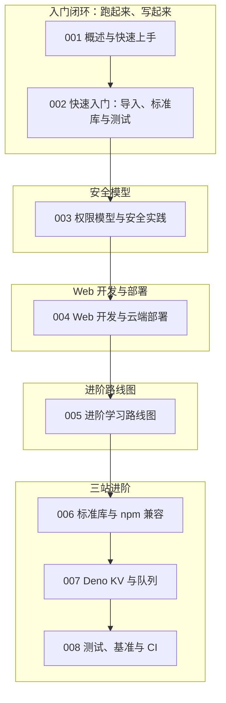

本篇是 deno 模块的收官总结。我们继续用"虚拟歌手音乐平台"做贯穿场景：为平台的打榜投票、应援色查询与演唱会报名写一个 Deno 服务——P 主提交歌曲（song）、歌姬（virtual singer）展示应援色、粉丝团（fan club）为歌曲投票。围绕这些需求，把前 8 篇文档的核心内容重新串一遍：安全模型、依赖管理、Web 开发、云端部署，以及路线图指向的三站进阶。读完请用自检清单核对掌握程度。回顾的方法是"按能力块自测"：安全模型、依赖管理、Web 服务、KV 存储、测试工具链五块相互独立，先在自检清单里挑出没把握的块，再定点回读。Deno 的 API 面不大，真正的分水岭在于是否形成"先想权限、再写代码"的本能——这也是它与 Node.js 开发习惯最大的分界线。

## 前置知识

- [Deno 概述与快速上手](/deno/001-DenoOverview)：运行时的安装、内置工具链与"无需配置文件"体验是全部内容的地基。
- [Deno 快速入门：导入、标准库与测试](/deno/002-DenoQuickStart)：npm、JSR、URL 三种导入方式与 `Deno.test` 是日常写代码的顺手工具，回顾前先跑通示例。

另外提醒：模块内 006-008 三篇当前是占位文档，主题已规划、正文待补全。先用本文与路线图搭好骨架、自行跑通三站的最小示例，等正文发布后再对照补齐，是当前阶段最实际的学法。

## 学习目标

1. 能说清 Deno"默认拒绝"的安全模型，并为一个真实项目列出所需的最小权限集合。
2. 能在 npm、JSR 与 URL 三种导入来源之间做出正确选型，并用 deno.json 锁定版本。
3. 能用 Hono 构建歌曲与演唱会 REST API，接入 Deno KV 存储，并部署到 Deno Deploy 边缘网络。
4. 能用内置的 `deno test`、`deno bench` 与 lint/fmt/check 建立零依赖的质量流水线。

在动手写代码之前，还有一条贯穿全部文档的主线值得单独点出：Deno 把"安全"当作第一公民，因此每一项能力都自带边界——文件读不出未授权的目录、网络连不上未放行的域名、环境变量取不到未声明的键。这些边界初看是束缚，用久了会发现它们把"最小权限原则"从安全团队的建议变成了每个开发者的日常习惯。回顾时不妨带着这条主线重读各节：依赖管理有版本边界，键值存储有事务边界，测试运行有权限边界，边界意识正是这个运行时教给我们的最重要一课，也是评估它是否适合下一个项目的判断依据。

## 知识地图



读图按编号推进：001、002 完成入门闭环，003 是安全主线，004 是应用主线，005 是承上启下的路线图，006 到 008 是路线图展开的三站。两条主线在 004 汇合——一个 Hono 服务里同时用到权限参数、KV 存储与部署目标，是检验前四篇学习成果的最佳试金石。

## 核心概念回顾

### 1. 运行时与内置工具链

Deno 是 Rust 编写的 JavaScript/TypeScript 运行时，TypeScript 开箱即用，格式化、lint、测试、编译全部内置，新项目几乎不需要写配置。两行命令即可从安装进入运行（见[概述与快速上手](/deno/001-DenoOverview)）：

```typescript
// hello.ts —— 平台工具脚本：按命令行参数输出歌姬应援色
const singer = Deno.args[0] ?? "miku" // 未传参数时给出兜底
const theme: Record<string, string> = { miku: "#39c5bb", teto: "#eba9ee" }

console.log(`歌姬 ${singer} 的应援色是 ${theme[singer] ?? "未收录"}`)
```

```bash
deno run hello.ts miku # 直接运行 TypeScript，无需任何编译配置
```

内置工具链的价值在持续集成里最明显：fmt、lint、check、test 全部随运行时而来，流水线里没有"安装一堆 devDependencies"这一步。工具行为由 Deno 版本统一保证，团队成员之间不会出现"你的格式化和我的不一样"的争论，代码评审也能把注意力留给真正的逻辑。

### 2. 依赖管理：三种导入来源

Deno 的依赖就是"网址或包名"，写在 import 顶部，首次运行自动下载缓存：`npm:` 兼容整个 npm 生态，`jsr:` 是官方推荐的新一代包仓库，URL 导入是 1.x 的经典风格。新项目优先 npm/JSR 并锁定版本（见[快速入门](/deno/002-DenoQuickStart)）：

```typescript
// deps.ts —— 平台依赖集中声明：Web 框架用 npm，文本工具用 JSR 标准库
import { Hono } from "npm:hono@4" // npm 生态，锁主版本
import { slugify } from "jsr:@std/text@1" // 官方标准库发布于 JSR

export { Hono, slugify }
```

三种来源的分工可以概括为"npm 求全、JSR 求新、URL 求快"：迁移老项目靠 npm 兼容零成本，新代码优先用带类型发布的 JSR，一次性验证用 URL 最省事。无论选哪种，都要在 deno.json 的 imports 映射里集中收敛，避免散落各处难以统一升级。

### 3. 权限模型：默认拒绝

Deno 的默认状态是"什么都不能做"：读文件、访问网络都要在运行命令里显式授权。即使第三方依赖被投毒，它也无法悄悄读走你的文件。授权参数按需给到最小范围（见[权限模型与安全实践](/deno/003-DenoPermissionsSecurity)）：

```typescript
// fanclub.ts —— 读取粉丝团名单需要 read 权限，否则运行即报 PermissionDenied
const members = await Deno.readTextFile("data/fanclub.txt")

console.log(`粉丝团成员 ${members.split(",").length} 人，主题色 #39c5bb`)
```

```bash
deno run --allow-read=data fanclub.ts # 只授权读 data 目录，而非整个磁盘
```

权限参数的粒度远比"给或不给"细：--allow-read 可以指定目录，--allow-net 可以指定域名与端口，--allow-env 可以只放行某几个变量名。写部署脚本时把这些清单固化进 deno.json 的 tasks 与 permissions 字段，权限就从口头约定变成了可审查、可复现的配置。

### 4. Hono 构建 Web 服务

Hono 是 Deno 生态最流行的 Web 框架，路由即函数，`Deno.serve` 一行启动。平台用它暴露歌曲与投票接口，配合类型化的请求参数让代码保持简洁（见[Web 开发与云端部署](/deno/004-DenoWebFrameworkDeploy)）：

```typescript
// main.ts —— 歌曲投票 API：Hono 路由 + Deno KV 持久化
import { Hono } from "npm:hono@4"

const app = new Hono()

app.post("/songs/:id/vote", async (c) => {
  const kv = await Deno.openKv() // 零配置打开内置 KV 数据库
  const key = ["votes", c.req.param("id")]
  const result = await kv.atomic().sum(key, 1n).commit() // 原子自增，防超卖票数
  return c.json({ votes: result.ok ? "ok" : "conflict" })
})

Deno.serve(app.fetch) // 一个端口服务全部路由
```

KV 的 key 设计决定查询能力：按 ["votes", songId] 建模能做计数与单点查询，按 ["singer"] 前缀建模能整表遍历，kv.watch 则能把分数变化实时推给页面。Deno Deploy 上 KV 与队列原生可用，不需要外挂数据库，这正是"边缘原生"一说的底气所在。

### 5. Deno KV 与边缘部署

Deno KV 是内置的零配置强一致键值存储，按 key 前缀建模即可覆盖打榜计数、报名名单等场景；同一份代码 `deployctl deploy` 就能推上 Deno Deploy 边缘网络，粉丝 wherever 投票都打到就近节点（见[Web 开发与云端部署](/deno/004-DenoWebFrameworkDeploy)）：

```typescript
// singers.ts —— 用 KV 前缀建模歌姬档案：["singer", id] 一格一位歌姬
const kv = await Deno.openKv()

// 写入歌姬档案：名字与应援色一起存
await kv.set(["singer", "miku"], { name: "初音未来", color: "#39c5bb" })

// 按前缀列出全部歌姬，渲染应援色一览页
for await (const entry of kv.list({ prefix: ["singer"] })) {
  console.log(entry.value.name, entry.value.color)
}
```

投票、抢票这类计数场景要养成"原子操作"的反射：读出、计算、写回三步在并发下必然出错，atomic().sum() 把三步压缩成一个服务端操作。写完功能先问自己"两个请求同时到达会怎样"，这一问能拦下大多数数据一致性事故。

### 6. 内置测试：业务代码旁的 Deno.test

测试即 `Deno.test`，与业务代码放在一起，断言来自标准库 `@std/assert`，运行命令是 `deno test`，无需安装任何测试框架（见[快速入门](/deno/002-DenoQuickStart)）：

```typescript
// vote_test.ts —— 投票函数的单元测试：与业务代码同目录
import { assertEquals } from "jsr:@std/assert@1"
import { nextRank } from "./vote.ts"

Deno.test("票数过 1000 应升入打榜区", () => {
  assertEquals(nextRank(999), "regular") // 未达标保持常规榜
  assertEquals(nextRank(1000), "hot") // 达到阈值进入热门打榜区
})
```

测试与业务同置是 Deno 的口味偏好：断言来自标准库，权限与运行参数和正式命令完全一致，测试环境与生产环境不会有隐性偏差。写测试时顺手跑一次 deno check 做类型检查，一套命令就覆盖了格式、类型、测试三件质量大事。

## 易混淆概念对比

权限模型是 Deno 与 Node.js 最本质的差异，也是"安全实践"一篇的核心：

| 维度 | Deno | Node.js |
| --- | --- | --- |
| 默认权限 | 默认拒绝，读写网络都需显式授权 | 默认全开，进程无所不能 |
| 授权方式 | `--allow-read/--allow-net` 等运行参数 | 长期依赖实验性 permission 模型 |
| 依赖可见性 | URL/npm/JSR 显式导入，无隐藏 node_modules | node_modules 就近解析，作用域宽泛 |
| 第三方投毒后果 | 未授权则直接失败，影响面可控 | 可静默读取文件、发起任意请求 |

三种导入来源同样容易纠结，选型错了会带来版本漂移：

| 维度 | npm: 前缀 | jsr: 前缀 | URL 导入 |
| --- | --- | --- | --- |
| 来源生态 | npm 全量包 | Deno 官方标准库与 JSR 包 | deno.land/std 旧版或任意网址 |
| 版本控制 | 跟随 npm registry | JSR 语义化版本 | 依赖 URL 中的版本号 |
| 推荐度 | 兼容现有生态时的首选 | 新项目优先 | 仅一次性实验或老代码维护 |

总结的落点是形成"条件反射"：看到读写文件就想到 --allow-read，看到第三方包就想到 imports 映射，看到计数就想到原子操作，看到上线就想到 deno check 与测试。把这些反射练成肌肉记忆，文档就可以从"必读"降级为"速查"，遇到新场景也能按安全模型自行推理出该申请哪些权限。

## 常见误区与排查

以下五条来自真实项目的踩坑记录，每条先给错误写法，再给修正代码。

1. 忘记给权限，运行即报 `PermissionDenied`。这不是 bug 而是安全模型在生效，按最小范围补授权即可：

```bash
# 错误：脚本要读文件却没授权，直接运行必然失败
# deno run fanclub.ts

# 正确：显式声明所需的最小权限集合
deno run --allow-read=data --allow-env fanclub.ts
```

2. URL 导入不锁版本，线上某天突然拉到不兼容的新版本。应把依赖收进 deno.json 的 imports 映射并生成 lockfile：

```json
{
  "imports": {
    "hono": "npm:hono@4",
    "@std/text": "jsr:@std/text@1"
  }
}
```

3. 把密钥硬编码进源码，推仓库即泄露。用 `Deno.env.get()` 读环境变量，并记得运行时需要 `--allow-env`：

```typescript
// 错误：密钥进代码库等于公开
// const API_KEY = "sk-fanclub-123456"

// 正确：从环境读取，配合 .env 与部署平台的环境注入
const apiKey = Deno.env.get("FANCLUB_API_KEY")!
```

4. `Deno.openKv()` 每次调用都新建连接，高频接口里反复 open 会让延迟与句柄双双飙升。进程级只 open 一次：

```typescript
// 错误：每个请求都 open 一遍 KV
// app.post("/vote", async (c) => { const kv = await Deno.openKv() })

// 正确：启动时打开一次，进程内复用
const kv = await Deno.openKv()
app.post("/vote", async (c) => {
  await kv.atomic().sum(["votes", c.req.param("id")], 1n).commit()
  return c.text("ok")
})
```

5. 测试里访问了网络或文件却没带权限标志，`deno test` 直接失败。测试命令与运行命令一样需要授权：

```bash
# 错误：被测代码调用了 Deno.env，测试却未授权
# deno test

# 正确：测试运行器同样接受 --allow 系列参数
deno test --allow-env
```

把权限、依赖、测试三块的自检全部通过后，可以再做一个综合练习：为平台加一个"演唱会座位锁定"接口——Hono 路由接请求、KV 原子操作防超卖、测试覆盖并发场景，一个需求把三条主线全部串起来，做完再看一遍权限参数，确认每个 --allow 都有存在的理由。

## 自检清单

- [ ] 能不查资料说出 Deno 安装与运行一个 TS 脚本需要的全部命令
- [ ] 能为一个真实项目列出最小权限集合，并解释为什么不用 `--allow-all`
- [ ] 能在 npm:、jsr:、URL 三种导入之间做出选型并说明理由
- [ ] 能用 Hono 写出带路径参数与 JSON 响应的 REST 路由
- [ ] 能用 Deno KV 的原子操作实现计数类需求，并用 key 前缀组织数据
- [ ] 能写出 `Deno.test` 单元测试并解释它与业务代码同置的约定
- [ ] 能说出 `deno fmt`、`deno lint`、`deno check` 在流水线中的位置
- [ ] 能把一个 Hono + KV 项目从本地推到 Deno Deploy 并验证边缘节点响应

自检不必一次全过：先勾选有把握的条目，反复不过的那几条，多半是示例没有亲手跑过——回到对应文档把代码敲一遍再回来验收，比反复阅读有效十倍。

## 后续学习路径

1. 安全先行：精读[权限模型与安全实践](/deno/003-DenoPermissionsSecurity)，把授权参数体系过一遍。
2. 动手上线：跟随[Web 开发与云端部署](/deno/004-DenoWebFrameworkDeploy)完成 Hono + KV + Deploy 的完整闭环。
3. 对照路线图：以[进阶学习路线图](/deno/005-AdvancedRoadmap)的三站为纲，依次攻克[标准库与 npm 兼容](/deno/006-DenoStdLibNpmCompatibility)、[Deno KV 与队列](/deno/007-DenoKVQueues)、[测试、基准与 CI](/deno/008-DenoTestingBenchCI)。
4. 每完成一站，回到本文自检清单勾选对应条目，确保没有欠账。
