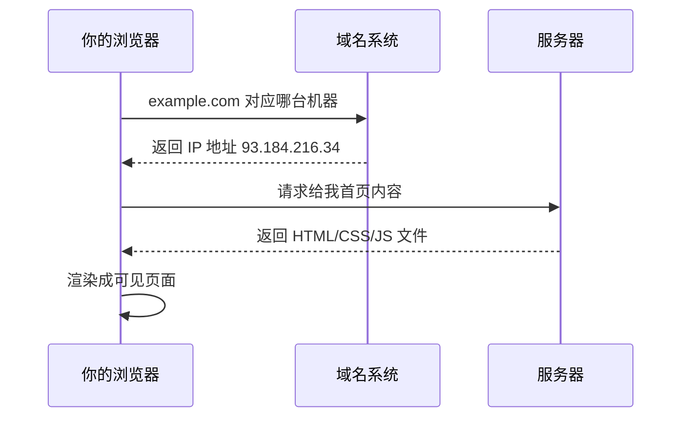

## 为什么要学这一课

前端三件套（HTML/CSS/JavaScript）与后端开发的全部知识，都挂在这张"互联网地图"上。先有地图，后面每学一个知识点你都知道自己在地图的哪个位置——这是避免学散、学断的关键。

## 一次访问网页的完整旅程

在浏览器地址栏输入 `https://example.com` 并回车后：

1. **域名解析**：`example.com` 是给人看的名字，机器只认 IP 地址。域名系统（DNS）像一本全球电话簿负责翻译。
2. **发起请求**：浏览器向目标服务器发送一个 HTTP 请求——"请给我首页"。
3. **返回资源**：服务器把 HTML（骨架）、CSS（样式）、JavaScript（行为）等文件发回来。
4. **浏览器渲染**：浏览器把 HTML 解析成文档树，应用 CSS 样式，执行 JavaScript，最终画出你看到的页面。

**前端开发的全部工作，就是控制第 4 步之前浏览器拿到什么、如何呈现；后端开发的全部工作，就是第 2 到第 3 步之间服务器如何响应。**

## 几个必须建立的概念

**客户端与服务器**：客户端是"发起请求的一方"（你的浏览器、手机 App），服务器是"响应请求的一方"（机房里 24 小时运行的计算机）。同一个程序可以既是客户端又是服务器。

**HTTP 协议**：双方约定的通信格式。请求有方法（GET 拿数据、POST 交数据）与状态码（200 成功、404 找不到、500 服务器出错）。看到 404 你就知道是"路径错了或资源不存在"。

**前端与后端**：前端代码下载到你的设备上运行（所以你能按 F12 看到它）；后端代码在远端服务器运行，你只能看到它返回的结果。本仓库 `html5 → css → javascript → typescript` 属于前端主线，`python/java/go + sql` 属于后端主线。

## 动手环节：亲眼看一次请求

1. 打开浏览器，按 `F12` 打开开发者工具，切到 Network（网络）标签；
2. 地址栏输入任意网站并回车；
3. 观察列表：每一行就是一次 HTTP 请求，点开第一条能看到响应头里的状态码 `200` 与返回的 HTML 内容。

你已经亲眼验证了上面那张时序图。

## 常见困惑

**"网址里的 https 是什么？"**——加密版的 HTTP，保证你与服务器之间的内容不被窃听篡改。现代网站应全部使用 https。

**"网页保存到本地为什么点不动？"**——保存的只是 HTML 骨架，JavaScript 逻辑与服务器接口请求离开了原始环境就无法工作。

**"App 和网页是什么关系？"**——很多 App 的界面就是一个内嵌的网页（套壳），另一部分是原生界面。两者都通过 HTTP 与后端通信，因此学完 Web 主线再看移动端会非常顺。

## 下一步

带着这张地图进入 [HTML5 模块的第一课：网页是什么](/html5/001-WhatIsWebpage)，开始亲手构建页面的骨架；环境未装好的读者先回到[开发环境搭建](/getting-started/004-DevEnvSetup)。
