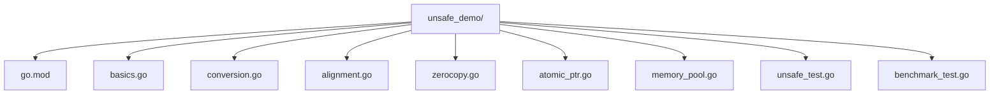

## 前置知识

- [Map 原理](/go/014-MapPrinciple)：建议先完成前一篇的学习

## 学习目标

- 掌握「1. 历史动机与发展脉络」的核心机制、典型用法与常见陷阱
- 掌握「1. 形式化定义」的核心机制、典型用法与常见陷阱
- 掌握「2. 理论推导与原理解析」的核心机制、典型用法与常见陷阱
- 掌握「3. 代码示例」的核心机制、典型用法与常见陷阱
- 掌握「4. 对比分析」的核心机制、典型用法与常见陷阱


## 1. 历史动机与发展脉络

### 1.1 unsafe 包的设计动机

Go 语言的设计哲学是"内存安全 + 垃圾回收",通过强类型系统与运行时检查,避免了 C/C++ 中常见的内存泄漏、悬垂指针、缓冲区溢出等问题。然而,在某些场景下,严格的安全保证会成为性能瓶颈或功能障碍:

- **与 C 代码互操作**(cgo):需要将 Go 指针转换为 C 指针,绕过类型系统。
- **高性能序列化**:直接操作内存布局,避免反射开销。
- **内存池实现**:自定义内存管理,绕过 GC。
- **底层运行时操作**:访问结构体未导出字段、操作字符串底层字节。

为此,Go 提供了 `unsafe` 包,作为"逃生舱"(escape hatch),允许开发者在必要时绕过类型系统。但 `unsafe` 包的使用不受 Go 1 兼容性保证约束:

> "Packages that import unsafe may depend on internal properties of the Go implementation and are not guaranteed to be compatible with future versions of Go."——Go Language Specification

### 1.2 关键版本演进

| Go 版本 | 发布日期 | unsafe 相关核心特性 |
|---------|---------|----------------|
| Go 1.0 | 2012-03 | `unsafe` 包定型:`Pointer`、`Sizeof`、`Alignof`、`Offsetof` |
| Go 1.3 | 2014-06 | 连续栈(continuous stack),栈拷贝影响 `uintptr` 持有栈地址 |
| Go 1.4 | 2014-12 | runtime 改用 Go 实现,`unsafe` 在 runtime 中大量使用 |
| Go 1.5 | 2015-08 | GC 重构,`unsafe.Pointer` 的 GC 追踪语义明确 |
| Go 1.7 | 2016-08 | `reflect.SliceHeader`、`reflect.StringHeader` 稳定 |
| Go 1.9 | 2017-08 | `atomic.Pointer` 类型(Go 1.19 泛型化前的雏形) |
| Go 1.13 | 2019-09 | `//go:linkname` 滥用限制,`unsafe` 使用更规范 |
| Go 1.14 | 2020-02 | 异步抢占,栈拷贝时机变化影响 `uintptr` |
| Go 1.17 | 2021-08 | 寄存器 ABI,结构体布局变化影响 `unsafe.Offsetof` 结果 |
| Go 1.18 | 2022-03 | 泛型引入,`unsafe` 可与泛型配合;`atomic.Pointer[T]` |
| Go 1.19 | 2022-08 | `atomic.Pointer[T]` 泛型版发布,`runtime.GCMEMLIMIT` |
| Go 1.20 | 2023-02 | **`unsafe.String`、`unsafe.Slice`、`unsafe.StringData`、`unsafe.SliceData`** 新增,替代 `reflect.Header` |
| Go 1.21 | 2023-08 | **`runtime.Pinner`** 引入,cgo 场景下固定 Go 对象避免 GC 回收 |
| Go 1.22 | 2024-02 | 循环变量语义变更,`unsafe` 在闭包中的使用更安全 |

### 1.3 Go 1.20 新 API 的意义

Go 1.20 之前,操作 `string` 和 `slice` 底层需借助 `reflect.StringHeader` 和 `reflect.SliceHeader`:

```go
// Go 1.19 及之前 - 已废弃
hdr := (*reflect.StringHeader)(unsafe.Pointer(&s))
data := hdr.Data
```

这种写法存在多个问题:
1. `reflect.Header` 类型可能随版本变化。
2. 直接操作 `Data` 字段绕过类型系统,容易出错。
3. `Data` 是 `uintptr`,不被 GC 追踪,危险。

Go 1.20 引入 `unsafe.String`、`unsafe.Slice` 等函数,提供更安全的抽象:

```go
// Go 1.20+ - 推荐
data := unsafe.StringData(s)  // 返回 *byte,GC 可追踪
str := unsafe.String(&b[0], len(b))  // 从 []byte 构造 string
slc := unsafe.Slice(ptr, n)  // 从 *T 构造 []T
```

### 1.4 Go 1.21 runtime.Pinner 的动机

在 cgo 场景下,Go 代码将 Go 对象指针传给 C 代码时,GC 可能提前回收该对象(因 C 代码的引用不被 Go GC 感知)。Go 1.21 之前,只能通过 `runtime.KeepAlive` 延长生命周期,但需精确控制时机。

`runtime.Pinner` 提供了显式"固定"机制:

```go
pinner := runtime.NewPinner()
defer pinner.Unpin()

ptr := &goObj
pinner.Pin(ptr)  // 固定,GC 不会回收
// 将 ptr 传给 C 代码
C.process((*C.T)(unsafe.Pointer(ptr)))
```

### 1.5 与其他语言的对比

| 语言 | 机制 | 安全保证 | 典型用途 |
|------|------|---------|---------|
| Go | `unsafe.Pointer`、`uintptr` | 无(开发者负责) | cgo、序列化、内存池 |
| C | `void*`、指针运算 | 无 | 通用底层操作 |
| C++ | `reinterpret_cast`、`void*` | 无(开发者负责) | 类型双关、底层操作 |
| Rust | `*const T`、`*mut T`(`unsafe` 块) | 编译期检查 + 运行时无 | FFI、内核、性能关键 |
| Java | `sun.misc.Unsafe`、`VarHandle` | 无(开发者负责) | JVM 内部、并发原语 |
| Python | `ctypes`、`cffi` | 无 | C 绑定 |
| Zig | `*` 指针、对齐属性 | 编译期对齐检查 | 系统编程 |

---

## 1. 形式化定义

### 1.1 unsafe.Pointer 的类型定义

依据 `go/src/unsafe/unsafe.go`:

```go
package unsafe

// ArbitraryType 是任意 Go 类型的占位符,仅用于文档目的
type ArbitraryType int

// IntegerType 是任意整数类型的占位符
type IntegerType int

// Pointer 是指向任意类型的指针,是 unsafe 包的核心
// 它可以与任意 *T 互转,但不保证类型安全
type Pointer *ArbitraryType

// Sizeof 返回 v 所占字节数(包含 padding)
func Sizeof(v ArbitraryType) uintptr

// Alignof 返回 v 的对齐要求(字节)
func Alignof(v ArbitraryType) uintptr

// Offsetof 返回结构体字段的偏移量
func Offsetof(v ArbitraryType) uintptr
```

### 1.2 unsafe.Pointer 的六种合法转换模式

Go 官方文档明确规定了 `unsafe.Pointer` 的六种合法使用模式,违反这些模式可能导致程序崩溃或未定义行为:

**模式 1:`*T1 -> Pointer -> *T2`(类型转换)**

```go
var x int = 42
p := unsafe.Pointer(&x)  // *int -> Pointer
px := (*int32)(p)         // Pointer -> *int32(假设 int 与 int32 同布局)
```

前提:`T1` 和 `T2` 必须具有相同的内存布局,且 `sizeof(T1) >= sizeof(T2)`。

**模式 2:`Pointer -> uintptr`(地址转换,不参与运算)**

```go
var x int = 42
addr := uintptr(unsafe.Pointer(&x))  // 仅用于显示或存储
_ = addr
```

注意:`uintptr` 不被 GC 追踪,不能跨 GC 使用。

**模式 3:`Pointer -> uintptr -> Pointer`(算术运算,立即)**

```go
var arr [10]int
p := unsafe.Pointer(&arr[0])
// 合法:在同一表达式中完成 uintptr 运算并转回 Pointer
p2 := unsafe.Pointer(uintptr(p) + unsafe.Sizeof(arr[0])*2)  // 指向 arr[2]
```

注意:`uintptr` 不能存储在变量中跨 GC 使用。

**模式 4:`Pointer -> syscall.Syscall`(系统调用)**

```go
p := unsafe.Pointer(&buf[0])
syscall.Syscall(SYS_WRITE, fd, uintptr(p), uintptr(len(buf)))
```

系统调用参数中的 `uintptr` 会被特殊处理,GC 不会回收 `p` 指向的对象。

**模式 5:`reflect.Value.Pointer/UnsafePointer -> Pointer**(反射转换)**

```go
v := reflect.ValueOf(&x)
p := unsafe.Pointer(v.Pointer())
```

**模式 6:`reflect.SliceHeader/StringHeader.Data -> Pointer**(Go 1.20 前)**

```go
// Go 1.19 及之前
hdr := (*reflect.SliceHeader)(unsafe.Pointer(&slice))
data := unsafe.Pointer(hdr.Data)  // Data 是 uintptr,但此处合法
```

Go 1.20+ 推荐使用 `unsafe.SliceData`/`unsafe.StringData` 替代。

### 1.3 uintptr 的本质

`uintptr` 是无符号整数类型,大小足以容纳指针:

```go
type uintptr uint  // 32 位平台为 uint32,64 位平台为 uint64
```

`uintptr` 的关键特性:
- **GC 不追踪**:GC 在标记阶段不会将 `uintptr` 视为指针,因此 `uintptr` 持有的地址不会被更新。
- **可参与算术运算**:支持加减乘除,用于指针偏移。
- **不可作为指针使用**:将 `uintptr` 转回 `Pointer` 时,原对象可能已被 GC 移动或回收。

### 1.4 Sizeof、Alignof、Offsetof 的形式化语义

设类型 $T$ 在 Go runtime 中的内存布局由以下属性决定:

- $\text{sizeof}(T)$:类型 $T$ 占用的总字节数(含 padding)。
- $\text{alignof}(T)$:类型 $T$ 的对齐要求(字节),即 $T$ 的地址必须是 $\text{alignof}(T)$ 的倍数。
- $\text{offsetof}(T, f)$:字段 $f$ 在结构体 $T$ 中的偏移量。

结构体 $T$ 的大小计算:

$$
\text{sizeof}(T) = \text{roundup}\left(\sum_{i=1}^{n} \text{sizeof}(f_i) + \text{padding}_i, \text{alignof}(T)\right)
$$

其中 $\text{alignof}(T) = \max_{i} \text{alignof}(f_i)$,$\text{padding}_i$ 是为满足 $f_{i+1}$ 对齐要求而插入的填充字节。

### 1.5 string 与 slice 的底层结构

依据 Go runtime 源码(`go/src/internal/abi/type.go`),Go 1.20+ 的底层结构:

```go
// string 的运行时表示
type StringHeader struct {
    Data uintptr  // 指向字节数组的指针
    Len  int      // 字节长度
}

// slice 的运行时表示
type SliceHeader struct {
    Data uintptr  // 指向数组的指针
    Len  int      // 长度
    Cap  int      // 容量
}
```

Go 1.20+ 推荐使用 `unsafe.StringData` 和 `unsafe.SliceData` 而非直接操作 Header:

```go
// Go 1.20+ API
func StringData(str string) *byte      // 返回 string 底层字节指针
func SliceData(slice []T) *T           // 返回 slice 底层元素指针
func String(ptr *byte, n int) string   // 从指针构造 string
func Slice(ptr *T, n int) []T          // 从指针构造 slice
```

---

## 2. 理论推导与原理解析

### 2.1 内存对齐的形式化分析

CPU 访问内存以字长(word size)为单位(64 位平台为 8 字节)。若数据地址是其大小的整数倍,称为对齐访问(aligned access);否则为非对齐访问(unaligned access)。

非对齐访问的代价:
- x86/x64:硬件处理,但有性能惩罚(1-3 倍延迟)。
- ARM:部分平台触发异常。
- RISC-V:取决于实现。

Go 的对齐规则:

| 类型 | 大小(字节) | 对齐(字节) |
|------|-------------|-------------|
| `bool`、`int8`、`uint8` | 1 | 1 |
| `int16`、`uint16` | 2 | 2 |
| `int32`、`uint32`、`float32` | 4 | 4 |
| `int64`、`uint64`、`float64` | 8 | 8(64 位)/ 4(32 位) |
| `int`、`uint`、`uintptr` | 平台字长 | 平台字长 |
| `string` | 16 | 8 |
| `slice` | 24 | 8 |
| `interface{}` | 16 | 8 |
| `complex128` | 16 | 8 |

### 2.2 结构体 padding 的形式化计算

设结构体 $T$ 包含字段 $f_1, f_2, \ldots, f_n$,各字段大小 $s_i$、对齐 $a_i$。字段 $f_i$ 的偏移量:

$$
\text{offset}(f_1) = 0
$$

$$
\text{offset}(f_i) = \text{roundup}(\text{offset}(f_{i-1}) + s_{i-1}, a_i), \quad i \geq 2
$$

其中 $\text{roundup}(x, a) = \lceil x / a \rceil \cdot a$。

结构体总大小:

$$
\text{sizeof}(T) = \text{roundup}(\text{offset}(f_n) + s_n, A)
$$

其中 $A = \max_i a_i$ 是结构体的对齐要求。

**示例**:以下结构体的内存布局分析:

```go
type Bad struct {
    a bool   // 1 byte, offset 0
            // 7 bytes padding
    b int64  // 8 bytes, offset 8
    c bool   // 1 byte, offset 16
            // 7 bytes padding
}
// sizeof(Bad) = 24
```

优化后的字段排列:

```go
type Good struct {
    b int64  // 8 bytes, offset 0
    a bool   // 1 byte, offset 8
    c bool   // 1 byte, offset 9
            // 6 bytes padding
}
// sizeof(Good) = 16
```

通过调整字段顺序,内存占用从 24 字节减少到 16 字节,节省 33%。

### 2.3 GC 对指针的追踪机制

Go GC 使用并发标记-清除(mark-sweep)算法,核心是"可达性分析":

1. **根集(root set)**:栈、全局变量、寄存器中的指针。
2. **标记阶段**:从根集出发,遍历所有可达对象,标记为活跃。
3. **清除阶段**:回收未标记的对象。

GC 如何识别指针?Go 编译器为每个类型生成"位图"(bitmap),指示哪些字段是指针:

```go
type Point struct {
    x int       // 非指针
    y *int      // 指针,GC 追踪
    z uintptr   // 整数,GC 不追踪
}
```

GC 的位图:`[non-pointer, pointer, non-pointer]`。

**`unsafe.Pointer` vs `uintptr` 的关键差异**:
- `unsafe.Pointer`:GC 视为指针,会追踪其指向的对象。
- `uintptr`:GC 视为整数,不追踪。

**陷阱**:将 `unsafe.Pointer` 转为 `uintptr` 后,若发生 GC,原对象可能被移动(栈拷贝)或回收(堆),`uintptr` 持有的地址失效。

```go
// 危险示例
ptr := unsafe.Pointer(&obj)
addr := uintptr(ptr)  // 转为 uintptr
// ... 发生 GC,obj 被移动或回收
newPtr := unsafe.Pointer(addr)  // 悬垂指针!
```

### 2.4 栈拷贝对 uintptr 的影响

Go 1.3+ 采用连续栈(continuous stack),goroutine 栈不足时会触发栈拷贝:

1. 分配新栈(2 倍大小)。
2. 拷贝旧栈内容到新栈。
3. 调整所有指向旧栈的指针(通过栈帧回溯)。

GC 和栈拷贝会更新 `unsafe.Pointer` 持有的栈地址,但不会更新 `uintptr`:

```go
func dangerous() {
    var x int = 42
    addr := uintptr(unsafe.Pointer(&x))  // x 在栈上
    // ... 调用其他函数,栈增长,x 被拷贝到新地址
    // addr 仍指向旧栈地址,已失效
    ptr := unsafe.Pointer(addr)
    *(*int)(ptr) = 100  // 写入已释放内存,崩溃
}
```

**修复**:使用 `runtime.KeepAlive` 保持对象存活,或避免将栈指针转为 `uintptr`。

### 2.5 零拷贝 string/[]byte 转换的原理

Go 的 `string` 和 `[]byte` 底层结构相似:

```go
// string: {Data *byte, Len int}
// []byte: {Data *byte, Len int, Cap int}
```

`string` 是不可变的,`[]byte` 是可变的。标准转换会复制数据:

```go
s := string([]byte("hello"))  // 复制
b := []byte("hello")          // 复制
```

零拷贝转换通过 `unsafe` 直接共享底层字节数组:

```go
func BytesToString(b []byte) string {
    // Go 1.20+
    if len(b) == 0 {
        return ""
    }
    return unsafe.String(&b[0], len(b))
}

func StringToBytes(s string) []byte {
    // Go 1.20+
    if len(s) == 0 {
        return nil
    }
    return unsafe.Slice(unsafe.StringData(s), len(s))
}
```

**风险**:转换后的 `[]byte` 若被修改,会破坏 `string` 的不可变性,导致未定义行为:

```go
s := "hello"
b := StringToBytes(s)
b[0] = 'H'  // 修改了字符串字面量!未定义行为,可能崩溃
```

**安全使用场景**:只读访问,如 JSON 解析、哈希计算。

### 2.6 atomic.Pointer 的实现原理

`atomic.Pointer[T]`(Go 1.19+)是类型安全的原子指针:

```go
type Pointer[T any] struct {
    v unsafe.Pointer
}

func (p *Pointer[T]) Load() *T {
    return (*T)(atomic.LoadPointer(&p.v))
}

func (p *Pointer[T]) Store(value *T) {
    atomic.StorePointer(&p.v, unsafe.Pointer(value))
}
```

相比直接使用 `atomic.LoadPointer`/`StorePointer`,`atomic.Pointer[T]` 提供:
- **类型安全**:编译期检查类型,避免运行时 panic。
- **泛型支持**:无需类型断言。
- **API 简洁**:链式调用。

底层仍使用 `unsafe.Pointer`,但封装后用户无需直接接触 `unsafe`。

---

## 3. 代码示例

### 3.1 项目结构



`go.mod`:

```go
module github.com/fandex/unsafe_demo

go 1.22
```

### 3.2 基础:Sizeof、Alignof、Offsetof

```go
// basics.go
package main

import (
    "fmt"
    "unsafe"
)

// DemoBasics 演示 unsafe 基础 API
func DemoBasics() {
    // Sizeof:获取类型大小(字节)
    fmt.Println("=== Sizeof ===")
    fmt.Printf("bool:    %d\n", unsafe.Sizeof(bool(false)))     // 1
    fmt.Printf("int8:    %d\n", unsafe.Sizeof(int8(0)))         // 1
    fmt.Printf("int16:   %d\n", unsafe.Sizeof(int16(0)))        // 2
    fmt.Printf("int32:   %d\n", unsafe.Sizeof(int32(0)))        // 4
    fmt.Printf("int64:   %d\n", unsafe.Sizeof(int64(0)))        // 8
    fmt.Printf("int:     %d\n", unsafe.Sizeof(int(0)))          // 8 (64位)
    fmt.Printf("uintptr: %d\n", unsafe.Sizeof(uintptr(0)))      // 8
    fmt.Printf("string:  %d\n", unsafe.Sizeof(""))              // 16
    fmt.Printf("[]int:   %d\n", unsafe.Sizeof([]int{}))         // 24
    fmt.Printf("map:     %d\n", unsafe.Sizeof(map[int]int{}))   // 8
    fmt.Printf("chan:    %d\n", unsafe.Sizeof(make(chan int)))  // 8

    // Alignof:获取对齐要求
    fmt.Println("\n=== Alignof ===")
    fmt.Printf("bool:    %d\n", unsafe.Alignof(bool(false)))    // 1
    fmt.Printf("int32:   %d\n", unsafe.Alignof(int32(0)))       // 4
    fmt.Printf("int64:   %d\n", unsafe.Alignof(int64(0)))       // 8
    fmt.Printf("string:  %d\n", unsafe.Alignof(""))             // 8

    // Offsetof:获取字段偏移量
    type User struct {
        Name string  // offset 0, size 16
        Age  int     // offset 16, size 8
        City string  // offset 24, size 16
    }
    fmt.Println("\n=== Offsetof ===")
    u := User{}
    fmt.Printf("Name offset: %d\n", unsafe.Offsetof(u.Name))  // 0
    fmt.Printf("Age offset:  %d\n", unsafe.Offsetof(u.Age))   // 16
    fmt.Printf("City offset: %d\n", unsafe.Offsetof(u.City))  // 24
    fmt.Printf("User size:   %d\n", unsafe.Sizeof(u))         // 40
}
```

### 3.3 类型转换:不同指针类型互转

```go
// conversion.go
package main

import (
    "fmt"
    "unsafe"
)

// Int64ToFloat64 通过 unsafe 实现整数与浮点数的位级转换
// 这比 math.Float64frombits 更直接,但破坏类型安全
func Int64ToFloat64(i int64) float64 {
    return *(*float64)(unsafe.Pointer(&i))
}

func Float64ToInt64(f float64) int64 {
    return *(*int64)(unsafe.Pointer(&f))
}

// BytesToUint64 将 8 字节切片转为 uint64(小端序)
func BytesToUint64(b []byte) uint64 {
    if len(b) < 8 {
        panic("slice too short")
    }
    return *(*uint64)(unsafe.Pointer(&b[0]))
}

// Uint64ToBytes 将 uint64 转为 8 字节切片(零拷贝)
func Uint64ToBytes(u uint64) []byte {
    var b [8]byte
    *(*uint64)(unsafe.Pointer(&b[0])) = u
    return b[:]
}

// DemoConversion 演示类型转换
func DemoConversion() {
    // int64 <-> float64 位级转换
    f := 3.14
    i := Float64ToInt64(f)
    fmt.Printf("float64 %v -> int64 %v (bits)\n", f, i)
    fmt.Printf("int64 %v -> float64 %v\n", i, Int64ToFloat64(i))

    // []byte <-> uint64
    b := []byte{0x78, 0x56, 0x34, 0x12, 0x00, 0x00, 0x00, 0x00}
    u := BytesToUint64(b)
    fmt.Printf("bytes %v -> uint64 %v (0x%x)\n", b, u, u)
}
```

### 3.4 内存对齐优化

```go
// alignment.go
package main

import (
    "fmt"
    "unsafe"
)

// BadLayout 字段排列糟糕,大量 padding
type BadLayout struct {
    a bool    // 1 byte, offset 0
    b int64   // 8 bytes, offset 8 (7 bytes padding)
    c bool    // 1 byte, offset 16
    d int64   // 8 bytes, offset 24 (7 bytes padding)
    e bool    // 1 byte, offset 32
}
// sizeof(BadLayout) = 40

// GoodLayout 字段排列优化,padding 最小
type GoodLayout struct {
    b int64   // 8 bytes, offset 0
    d int64   // 8 bytes, offset 8
    a bool    // 1 byte, offset 16
    c bool    // 1 byte, offset 17
    e bool    // 1 byte, offset 18
    // 5 bytes padding
}
// sizeof(GoodLayout) = 24

// DemoAlignment 演示内存对齐优化
func DemoAlignment() {
    fmt.Println("=== BadLayout ===")
    bad := BadLayout{}
    fmt.Printf("sizeof:  %d\n", unsafe.Sizeof(bad))
    fmt.Printf("a offset: %d\n", unsafe.Offsetof(bad.a))
    fmt.Printf("b offset: %d\n", unsafe.Offsetof(bad.b))
    fmt.Printf("c offset: %d\n", unsafe.Offsetof(bad.c))
    fmt.Printf("d offset: %d\n", unsafe.Offsetof(bad.d))
    fmt.Printf("e offset: %d\n", unsafe.Offsetof(bad.e))

    fmt.Println("\n=== GoodLayout ===")
    good := GoodLayout{}
    fmt.Printf("sizeof:  %d\n", unsafe.Sizeof(good))
    fmt.Printf("b offset: %d\n", unsafe.Offsetof(good.b))
    fmt.Printf("d offset: %d\n", unsafe.Offsetof(good.d))
    fmt.Printf("a offset: %d\n", unsafe.Offsetof(good.a))
    fmt.Printf("c offset: %d\n", unsafe.Offsetof(good.c))
    fmt.Printf("e offset: %d\n", unsafe.Offsetof(good.e))

    // 内存节省:(40 - 24) / 40 = 40%
    fmt.Printf("\n内存节省: %.0f%%\n", float64(unsafe.Sizeof(bad)-unsafe.Sizeof(good))/float64(unsafe.Sizeof(bad))*100)
}
```

### 3.5 零拷贝 string/[]byte 转换

```go
// zerocopy.go
package main

import (
    "unsafe"
)

// BytesToString 零拷贝 []byte -> string
// 注意:返回的 string 底层共享 b 的数据,不可修改 b
// Go 1.20+ 推荐使用 unsafe.String
func BytesToString(b []byte) string {
    if len(b) == 0 {
        return ""
    }
    return unsafe.String(&b[0], len(b))
}

// StringToBytes 零拷贝 string -> []byte
// 注意:返回的 []byte 底层共享 s 的数据,不可修改(字符串字面量在只读段)
// Go 1.20+ 推荐使用 unsafe.Slice + unsafe.StringData
func StringToBytes(s string) []byte {
    if len(s) == 0 {
        return nil
    }
    return unsafe.Slice(unsafe.StringData(s), len(s))
}

// BytesToStringLegacy Go 1.19 及之前的写法(已废弃)
// 通过 reflect.StringHeader,容易出错
/*
func BytesToStringLegacy(b []byte) string {
    return *(*string)(unsafe.Pointer(&b))
}
*/
```

### 3.6 原子指针操作

```go
// atomic_ptr.go
package main

import (
    "sync"
    "sync/atomic"
)

// AtomicConfig 使用 atomic.Pointer 实现无锁配置热更新
// Go 1.19+
type AtomicConfig struct {
    ptr atomic.Pointer[Config]
}

type Config struct {
    MaxConnections int
    Timeout        int
    LogLevel       string
}

// Load 原子加载配置
func (a *AtomicConfig) Load() *Config {
    return a.ptr.Load()
}

// Store 原子存储配置
func (a *AtomicConfig) Store(c *Config) {
    a.ptr.Store(c)
}

// UpdateConcurrent 并发更新配置
func UpdateConcurrent() {
    var cfg AtomicConfig
    cfg.Store(&Config{MaxConnections: 100, Timeout: 30, LogLevel: "info"})

    var wg sync.WaitGroup
    // 并发读
    for i := 0; i < 10; i++ {
        wg.Add(1)
        go func() {
            defer wg.Done()
            c := cfg.Load()
            _ = c.MaxConnections
        }()
    }
    // 并发写
    for i := 0; i < 5; i++ {
        wg.Add(1)
        go func(i int) {
            defer wg.Done()
            cfg.Store(&Config{MaxConnections: 100 + i, Timeout: 30, LogLevel: "info"})
        }(i)
    }
    wg.Wait()
}
```

### 3.7 内存池实现

```go
// memory_pool.go
package main

import (
    "sync"
    "unsafe"
)

// BytePool 利用 unsafe 重置 slice 长度,实现高效复用
type BytePool struct {
    pool sync.Pool
    size int
}

func NewBytePool(size int) *BytePool {
    return &BytePool{
        pool: sync.Pool{
            New: func() any {
                b := make([]byte, size)
                return &b
            },
        },
        size: size,
    }
}

// Get 获取一个 []byte,长度重置为 pool.size
func (p *BytePool) Get() []byte {
    bp := p.pool.Get().(*[]byte)
    // 利用 unsafe 直接修改 slice 的 Len 字段
    // 注意:这是 unsafe 的合法用法(在 Go runtime 中广泛使用)
    sh := (*[3]uintptr)(unsafe.Pointer(bp))
    // SliceHeader: {Data, Len, Cap}
    // 重置 Len 为 size
    sh[1] = uintptr(p.size)
    return *bp
}

// Put 归还 []byte
func (p *BytePool) Put(b []byte) {
    bp := &b
    p.pool.Put(bp)
}
```

### 3.8 访问未导出字段

```go
package main

import (
    "fmt"
    "unsafe"
)

// accessUnexported 演示访问其他包的未导出字段
// 注意:仅用于测试或调试,生产环境应避免
func accessUnexported() {
    // 假设有一个外部包的类型:
    // package secret
    // type User struct {
    //     name string  // 未导出
    //     Age  int     // 导出
    // }

    // 我们可以通过 unsafe 访问 name 字段
    // 这里用本地类型演示
    type localUser struct {
        name string
        Age  int
    }

    u := localUser{name: "Alice", Age: 30}

    // 通过 Offsetof 计算 name 的偏移量
    nameOffset := unsafe.Offsetof(u.name)
    // 通过指针偏移访问
    namePtr := (*string)(unsafe.Pointer(uintptr(unsafe.Pointer(&u)) + nameOffset))
    fmt.Printf("name: %s\n", *namePtr)  // Alice

    // 修改未导出字段(危险!)
    *namePtr = "Bob"
    fmt.Printf("after modify: name=%s, Age=%d\n", u.name, u.Age)
}
```

### 3.9 unsafe.Slice 和 unsafe.String(Go 1.20+)

```go
package main

import (
    "fmt"
    "unsafe"
)

// DemoGo120API 演示 Go 1.20 引入的 unsafe 新 API
func DemoGo120API() {
    // unsafe.String:从 *byte 和长度构造 string
    bytes := []byte{'h', 'e', 'l', 'l', 'o'}
    s := unsafe.String(&bytes[0], len(bytes))
    fmt.Println(s)  // hello

    // unsafe.StringData:获取 string 的底层字节指针
    str := "world"
    ptr := unsafe.StringData(str)
    fmt.Printf("first byte: %c\n", *ptr)  // w

    // unsafe.Slice:从 *T 和长度构造 slice
    arr := [5]int{1, 2, 3, 4, 5}
    slc := unsafe.Slice(&arr[0], len(arr))
    fmt.Println(slc)  // [1 2 3 4 5]

    // unsafe.SliceData:获取 slice 的底层指针
    data := unsafe.SliceData(slc)
    fmt.Printf("first element: %d\n", *data)  // 1
}
```

---

## 4. 对比分析

### 4.1 unsafe.Pointer vs uintptr

| 维度 | unsafe.Pointer | uintptr |
|------|----------------|---------|
| 类型本质 | 通用指针类型 | 无符号整数 |
| GC 追踪 | 是,GC 视为指针 | 否,GC 视为整数 |
| 算术运算 | 否,不支持加减 | 是,支持加减乘除 |
| 跨 GC 安全 | 是,GC 会更新 | 否,地址可能失效 |
| 跨栈拷贝安全 | 是,栈拷贝会更新 | 否,栈地址失效 |
| 合法用途 | 类型转换、原子操作 | 地址显示、立即运算 |
| 存储 | 可存储在变量中 | 不可跨 GC 存储 |

### 4.2 unsafe.Pointer vs reflect.Value

| 维度 | unsafe.Pointer | reflect.Value |
|------|----------------|---------------|
| 性能 | 零开销 | 有反射开销 |
| 类型安全 | 无 | 编译期检查 |
| 功能 | 内存操作、类型转换 | 字段访问、方法调用 |
| 适用场景 | 性能关键、底层操作 | 通用反射、序列化 |
| 复杂度 | 低(直接) | 高(多重间接) |

### 4.3 零拷贝转换 vs 标准转换

| 维度 | unsafe 零拷贝 | 标准转换 |
|------|---------------|----------|
| 性能 | O(1),无内存分配 | O(n),复制数据 |
| 内存 | 共享底层 | 独立副本 |
| 安全性 | 危险,可能破坏不可变性 | 安全,数据隔离 |
| 适用场景 | 只读、性能关键 | 通用场景 |
| 调试难度 | 高(问题难复现) | 低(数据独立) |

### 4.4 Go unsafe vs C void* vs Rust *const T

| 维度 | Go unsafe.Pointer | C void* | Rust *const T |
|------|-------------------|---------|----------------|
| 类型安全 | 无 | 无 | 无(unsafe 块内) |
| GC 集成 | 是,GC 追踪 | 无 GC | 无 GC(默认) |
| 算术运算 | 需转 uintptr | 直接支持 | 需 offset() |
| 生命周期 | GC 管理 | 手动管理 | unsafe 块内手动 |
| 跨语言 | cgo 桥接 | 通用 | FFI |
| 空指针 | nil | NULL | null |

---

## 5. 常见陷阱与最佳实践

### 5.1 uintptr 跨 GC 使用

**陷阱**:将 `uintptr` 存储在变量中,跨 GC 调用后使用。

```go
// 危险
func dangerous() {
    var x int = 42
    addr := uintptr(unsafe.Pointer(&x))  // 转为 uintptr
    runtime.GC()  // 触发 GC,x 可能被移动
    ptr := unsafe.Pointer(addr)  // 地址可能已失效
    fmt.Println(*(*int)(ptr))  // 未定义行为
}
```

**最佳实践**:在同一个表达式中完成 `uintptr` 运算,或使用 `runtime.KeepAlive`。

```go
// 安全:同一表达式
p := unsafe.Pointer(uintptr(unsafe.Pointer(&arr[0])) + offset)

// 安全:runtime.KeepAlive
func safe(ptr unsafe.Pointer) {
    addr := uintptr(ptr)
    // 使用 addr...
    runtime.KeepAlive(ptr)  // 确保 ptr 指向的对象在调用前不被回收
}
```

### 5.2 向 string 转换后的 []byte 写入

**陷阱**:零拷贝将 `string` 转为 `[]byte` 后修改,破坏字符串不可变性。

```go
s := "hello"
b := unsafe.Slice(unsafe.StringData(s), len(s))
b[0] = 'H'  // 修改字符串字面量!未定义行为
```

**最佳实践**:零拷贝转换仅用于只读场景,需要修改时复制数据。

```go
// 只读场景:零拷贝
func parseJSON(s string) {
    b := unsafe.Slice(unsafe.StringData(s), len(s))
    // 仅读取 b,不修改
    _ = b
}

// 需要修改:复制
func modifyBytes(s string) []byte {
    b := make([]byte, len(s))
    copy(b, s)
    return b
}
```

### 5.3 类型布局不匹配的转换

**陷阱**:不同内存布局的类型互转,读取垃圾数据。

```go
type A struct {
    x int
    y int
}

type B struct {
    x int
    z float64  // 与 A.y 布局不同
}

a := A{x: 1, y: 2}
b := (*B)(unsafe.Pointer(&a))  // 危险:b.z 是垃圾数据
```

**最佳实践**:仅在同布局类型间转换,或使用 `unsafe.Sizeof` 验证。

```go
if unsafe.Sizeof(A{}) != unsafe.Sizeof(B{}) {
    panic("layout mismatch")
}
```

### 5.4 栈变量地址的 unsafe 使用

**陷阱**:栈变量的 `uintptr` 在栈拷贝后失效。

```go
func dangerous() {
    var x int = 42
    addr := uintptr(unsafe.Pointer(&x))
    bigFunc()  // 可能触发栈增长,x 被移动
    *(*int)(unsafe.Pointer(addr)) = 100  // 写入旧地址,崩溃
}

func bigFunc() {
    var huge [1024 * 1024]byte  // 大栈帧
    _ = huge
}
```

**最佳实践**:避免对栈变量使用 `uintptr`,必要时用 `unsafe.Pointer` 直接持有。

### 5.5 悬垂指针

**陷阱**:被 `unsafe.Pointer` 指向的对象被 GC 回收。

```go
func dangle() unsafe.Pointer {
    x := 42
    return unsafe.Pointer(&x)  // x 在函数返回后被回收,悬垂指针
}
```

**最佳实践**:返回堆对象指针,或使用 `runtime.Pinner`(Go 1.21+)。

```go
func safe() *int {
    x := new(int)  // 堆分配
    *x = 42
    return x
}
```

### 5.6 修改字符串字面量

**陷阱**:通过 `unsafe` 修改字符串字面量,导致段错误。

```go
s := "hello"
ptr := unsafe.StringData(s)
*ptr = 'H'  // 字符串字面量在只读段,段错误
```

**最佳实践**:永远不修改字符串字面量,需要可变数据用 `[]byte`。

### 5.7 Go 1 兼容性破坏

**陷阱**:`unsafe` 代码依赖内部实现,Go 版本升级可能失效。

```go
// 依赖 reflect.StringHeader(可能被移除)
hdr := (*reflect.StringHeader)(unsafe.Pointer(&s))
data := hdr.Data
```

**最佳实践**:使用 Go 1.20+ 的 `unsafe.StringData`/`unsafe.SliceData`,避免直接操作 Header。

### 5.8 cgo 场景下的 GC 提前回收

**陷阱**:Go 对象指针传给 C 代码后,被 GC 回收。

```go
// 危险
func dangerousCgo() {
    obj := &MyObj{Data: 42}
    C.process((*C.MyObj)(unsafe.Pointer(obj)))
    // GC 可能在 C.process 执行期间回收 obj
}

// 修复 1:runtime.KeepAlive
func safeCgo1() {
    obj := &MyObj{Data: 42}
    C.process((*C.MyObj)(unsafe.Pointer(obj)))
    runtime.KeepAlive(obj)  // 确保 obj 在 C.process 期间不被回收
}

// 修复 2:runtime.Pinner (Go 1.21+)
func safeCgo2() {
    obj := &MyObj{Data: 42}
    pinner := runtime.NewPinner()
    defer pinner.Unpin()
    pinner.Pin(obj)
    C.process((*C.MyObj)(unsafe.Pointer(obj)))
}
```

---

## 6. 工程实践

### 6.1 unsafe 使用规范

1. **最小化使用**:仅在性能关键或功能必需时使用 `unsafe`。
2. **隔离封装**:将 `unsafe` 代码封装在内部包,对外提供安全 API。
3. **文档标注**:在 `unsafe` 代码处添加注释,说明风险与约束。
4. **测试覆盖**:`unsafe` 代码需更严格的测试,包括并发、边界条件。
5. **版本锁定**:升级 Go 版本时,重新验证 `unsafe` 代码的正确性。
6. **静态分析**:使用 `go vet`、`staticcheck` 检测 `unsafe` 滥用。

### 6.2 go vet 检测

```bash
# 检测 unsafe 的可疑用法
go vet -unsafeptr ./...

# 检测 printf 误用
go vet -printf ./...
```

### 6.3 staticcheck 深度检测

```bash
# 安装
go install honnef.co/go/tools/cmd/staticcheck@latest

# 检测 unsafe 相关问题
staticcheck -checks U1000 ./...
```

### 6.4 性能基准测试

```go
// benchmark_test.go
package main

import (
    "strings"
    "testing"
)

// 标准转换
func BenchmarkStandardConversion(b *testing.B) {
    src := []byte("hello world")
    for i := 0; i < b.N; i++ {
        _ = string(src)
    }
}

// 零拷贝转换
func BenchmarkUnsafeConversion(b *testing.B) {
    src := []byte("hello world")
    for i := 0; i < b.N; i++ {
        _ = BytesToString(src)
    }
}

// 标准字符串拼接
func BenchmarkStandardConcat(b *testing.B) {
    for i := 0; i < b.N; i++ {
        _ = strings.Join([]string{"hello", " ", "world"}, "")
    }
}
```

运行:

```bash
go test -bench=. -benchmem
```

### 6.5 unsafe 代码的版本兼容性

```go
// version_compat.go
package main

import (
    "unsafe"
)

// StringToBytesCompat 兼容不同 Go 版本的 string -> []byte 转换
// Go 1.20+ 使用 unsafe.Slice,旧版本使用 reflect.Header
func StringToBytesCompat(s string) []byte {
    if len(s) == 0 {
        return nil
    }
    // Go 1.20+
    return unsafe.Slice(unsafe.StringData(s), len(s))
}
```

---

## 7. 案例研究

### 7.1 标准库:sync.Pool

`sync.Pool` 内部大量使用 `unsafe` 实现高效的对象复用:

```go
// runtime/sync_pool.go 简化
type Pool struct {
    local     unsafe.Pointer  // 本地池,每个 P 一个
    localSize uintptr         // 本地池大小
    victim    unsafe.Pointer  // 上一个 GC 周期的池
    victimSize uintptr
    New       func() any
}

func (p *Pool) Get() any {
    // 通过 unsafe.Pointer + 偏移访问 P 本地的 poolLocal
    l, pid := p.pin()
    x := l.private
    l.private = nil
    if x == nil {
        // 从 shared 队列获取
        x, _ = l.shared.popTail()
    }
    // ...
}
```

### 7.2 标准库:atomic 包

`sync/atomic` 包的原子操作底层依赖 `unsafe.Pointer`:

```go
// sync/atomic/type.go 简化
func LoadPointer(p *unsafe.Pointer) unsafe.Pointer {
    return *p  // 底层是原子指令
}

func StorePointer(p *unsafe.Pointer, v unsafe.Pointer) {
    *p = v
}
```

### 7.3 Kubernetes:类型断言优化

Kubernetes 在性能关键路径使用 `unsafe` 优化类型断言:

```go
// k8s.io/apimachinery/pkg/runtime/scheme.go 简化
func (s *Scheme) ObjectKinds(obj Object) ([]schema.GroupVersionKind, error) {
    // 通过 unsafe 直接访问接口的底层类型,避免反射开销
    // ...
}
```

### 7.4 Docker:内存映射

Docker 在处理大文件时使用 `unsafe` 实现零拷贝:

```go
// github.com/docker/docker/pkg/archive 简化
func mmapZeroCopy(f *os.File, offset int64, size int) ([]byte, error) {
    // 通过 syscall.Mmap 获取内存映射
    // 通过 unsafe.Slice 转为 []byte
    // ...
}
```

### 7.5 TiDB:高性能序列化

TiDB 使用 `unsafe` 实现高性能序列化,避免反射:

```go
// github.com/pingcap/tidb/util/codec 简化
func EncodeInt(b []byte, v int64) []byte {
    // 通过 unsafe 直接写入字节,避免逐字节复制
    // ...
}
```

### 7.6 fasthttp:零拷贝字符串

fasthttp 大量使用 `unsafe` 实现零拷贝,提升 HTTP 解析性能:

```go
// github.com/valyala/fasthttp/string.go 简化
func b2s(b []byte) string {
    return unsafe.String(&b[0], len(b))
}

func s2b(s string) []byte {
    return unsafe.Slice(unsafe.StringData(s), len(s))
}
```

---

### 填空题知识点讲解

**1. `unsafe.Pointer` 的六种合法转换模式包括:`*T1 -> Pointer -> *T2`、`Pointer -> uintptr`、`______`、`Pointer -> syscall.Syscall`、`reflect.Value.Pointer -> Pointer`、`______`。**

- `Pointer -> uintptr -> Pointer`(立即算术运算)
- `reflect.SliceHeader/StringHeader.Data -> Pointer`(Go 1.20 前使用)

**2. 64 位平台上,`string` 的大小是 `______` 字节,`[]byte` 的大小是 `______` 字节,`interface{}` 的大小是 `______` 字节。**

- `string`:16 字节(Data 8 + Len 8)
- `[]byte`:24 字节(Data 8 + Len 8 + Cap 8)
- `interface{}`:16 字节(type 8 + value 8)

**3. Go 1.20 引入的四个 unsafe 新函数是 `______`、`______`、`______`、`______`。**

- `unsafe.String(ptr *byte, n int) string`
- `unsafe.StringData(s string) *byte`
- `unsafe.Slice(ptr *T, n int) []T`
- `unsafe.SliceData(slice []T) *T`

**4. 零拷贝 `string -> []byte` 转换的风险是 `______`,安全使用场景是 `______`。**

- 风险:修改 `[]byte` 会破坏 `string` 的不可变性,导致未定义行为
- 安全场景:只读访问(如 JSON 解析、哈希计算)

**5. `atomic.Pointer[T]` 是 Go `______` 版本引入的,底层使用 `______` 类型存储指针。**

- Go 1.19
- `unsafe.Pointer`

### 编程题知识点讲解

**1. 实现一个高性能的字段访问器,通过预计算偏移量,避免反射开销。**

```go
package main

import (
    "reflect"
    "unsafe"
)

// FieldAccessor 高性能字段访问器
// 预计算字段偏移量,避免每次反射
type FieldAccessor struct {
    typ    reflect.Type
    fields map[string]struct {
        offset uintptr
        typ    reflect.Type
    }
}

// NewFieldAccessor 创建字段访问器
func NewFieldAccessor(typ reflect.Type) *FieldAccessor {
    fa := &FieldAccessor{
        typ:    typ,
        fields: make(map[string]struct {
            offset uintptr
            typ    reflect.Type
        }),
    }
    for i := 0; i < typ.NumField(); i++ {
        f := typ.Field(i)
        fa.fields[f.Name] = struct {
            offset uintptr
            typ    reflect.Type
        }{
            offset: f.Offset,
            typ:    f.Type,
        }
    }
    return fa
}

// GetField 通过预计算偏移量访问字段
func (fa *FieldAccessor) GetField(obj any, name string) any {
    fi, ok := fa.fields[name]
    if !ok {
        panic("field not found: " + name)
    }
    // 获取 obj 的底层指针
    v := reflect.ValueOf(obj)
    if v.Kind() != reflect.Ptr {
        panic("obj must be pointer")
    }
    // 通过 unsafe.Pointer + offset 访问字段
    base := unsafe.Pointer(v.Pointer())
    fieldPtr := unsafe.Pointer(uintptr(base) + fi.offset)
    // 根据类型返回值
    switch fi.typ.Kind() {
    case reflect.Int:
        return *(*int)(fieldPtr)
    case reflect.String:
        return *(*string)(fieldPtr)
    case reflect.Bool:
        return *(*bool)(fieldPtr)
    case reflect.Float64:
        return *(*float64)(fieldPtr)
    default:
        // 复杂类型用 reflect
        return reflect.NewAt(fi.typ, fieldPtr).Elem().Interface()
    }
}

// 使用示例
type User struct {
    Name string
    Age  int
    Score float64
}

func main() {
    u := &User{Name: "Alice", Age: 30, Score: 95.5}
    fa := NewFieldAccessor(reflect.TypeOf(User{}))
    println(fa.GetField(u, "Name").(string))   // Alice
    println(fa.GetField(u, "Age").(int))       // 30
    println(fa.GetField(u, "Score").(float64)) // 95.5
}
```

**2. 实现一个 slab allocator,管理固定大小内存块,减少 GC 压力。**

```go
package main

import (
    "sync"
    "unsafe"
)

// SlabAllocator 内存块分配器
// 预分配大块内存,切分为固定大小的块,减少 GC 压力
type SlabAllocator struct {
    blockSize int
    blocksPerSlab int
    freeList []unsafe.Pointer  // 空闲块链表
    slabs    [][]byte          // 所有 slab,防止被 GC 回收
    mu       sync.Mutex
}

// NewSlabAllocator 创建分配器
// blockSize: 每个块的大小(字节)
// blocksPerSlab: 每个 slab 包含的块数
func NewSlabAllocator(blockSize, blocksPerSlab int) *SlabAllocator {
    return &SlabAllocator{
        blockSize:     blockSize,
        blocksPerSlab: blocksPerSlab,
        freeList:      make([]unsafe.Pointer, 0, blocksPerSlab),
    }
}

// Alloc 分配一个块
func (a *SlabAllocator) Alloc() unsafe.Pointer {
    a.mu.Lock()
    defer a.mu.Unlock()

    if len(a.freeList) == 0 {
        a.grow()
    }

    n := len(a.freeList)
    ptr := a.freeList[n-1]
    a.freeList = a.freeList[:n-1]
    return ptr
}

// Free 释放一个块
func (a *SlabAllocator) Free(ptr unsafe.Pointer) {
    a.mu.Lock()
    defer a.mu.Unlock()
    a.freeList = append(a.freeList, ptr)
}

// grow 扩容:分配新 slab,切分为块
func (a *SlabAllocator) grow() {
    slabSize := a.blockSize * a.blocksPerSlab
    slab := make([]byte, slabSize)

    // 将 slab 切分为块,加入空闲链表
    for i := 0; i < a.blocksPerSlab; i++ {
        offset := i * a.blockSize
        ptr := unsafe.Pointer(&slab[offset])
        a.freeList = append(a.freeList, ptr)
    }

    // 保留 slab 引用,防止被 GC 回收
    a.slabs = append(a.slabs, slab)
}

// Stats 返回统计信息
func (a *SlabAllocator) Stats() (totalSlabs, freeBlocks int) {
    a.mu.Lock()
    defer a.mu.Unlock()
    return len(a.slabs), len(a.freeList)
}
```

### 10.1 书籍

- **The Go Programming Language**(Alan Donovan, Brian Kernighan, Addison-Wesley, 2015):第 13 章"Low-Level Programming"详述 `unsafe` 包。
- **Go in Action**(William Kennedy et al., Manning, 2016):第 9 章涵盖 `unsafe` 与 cgo。
- **Concurrency in Go**(Katherine Cox-Buday, O'Reilly, 2016):第 6 章讨论 `unsafe` 在并发原语中的应用。
- **Programming Go**(Jon Bodner, O'Reilly, 2022):第 16 章"Generics"与 `unsafe` 配合使用。
- **Go Systems Programming**(Mihalis Tsoukalos, Packt, 2017):深入 Unix 系统编程与 `unsafe`。

### 10.2 论文与技术文档

- **The Go Memory Model**:理解 happens-before,避免 `unsafe` 导致的内存模型违反。
- **Go Garbage Collector Guide**:理解 GC 如何追踪指针,避免悬垂指针。
- **cgo Documentation**:Go 与 C 互操作的官方文档。
- **Package unsafe Source Code**:`go/src/unsafe/unsafe.go`,包源码。
- **Atomic Operations Proposal**:Go 1.19 `atomic.Pointer[T]` 的设计提案。

### 10.4 视频与演讲

- **Understanding Go's GC**(Rick Hudson, GopherCon 2018):GC 如何追踪指针。
- **Go Runtime Scheduler**(Dmitry Vyukov, 2014):runtime 中 `unsafe` 的使用。
- **Data Race Detector**(Dmitry Vyukov):与 `unsafe` 的交互。
- **Atomic Pointers in Go 1.19**:Go 官方介绍 `atomic.Pointer[T]`。

### 10.5 工具一览

| 工具 | 用途 | 链接 |
|------|------|------|
| `go vet -unsafeptr` | 检测 unsafe 用法 | https://pkg.go.dev/cmd/vet |
| `staticcheck` | 深度静态分析 | https://staticcheck.io/ |
| `go tool pprof` | 性能分析 | https://go.dev/blog/pprof |
| `go test -race` | 竞态检测 | https://go.dev/doc/articles/race_detector |
| `GODEBUG=gccheckmark=1` | GC 标记验证 | https://pkg.go.dev/runtime |
| `GODEBUG=gctrace=1` | GC 日志 | https://pkg.go.dev/runtime |
| `govet -shadow` | 变量遮蔽检测 | https://pkg.go.dev/cmd/vet |

---

## 11. 总结

本篇系统梳理了 Go `unsafe` 包的核心 API、底层原理、合法使用模式与工程实践。核心要点回顾:

1. **unsafe 是逃生舱**:`unsafe.Pointer` 绕过类型系统,用于 cgo、性能优化、底层操作,但破坏 Go 1 兼容性保证。
2. **六种合法模式**:Go 官方明确规定了 `unsafe.Pointer` 的六种合法转换模式,违反可能导致未定义行为。
3. **uintptr 不可跨 GC**:`uintptr` 不被 GC 追踪,跨 GC 使用会导致悬垂指针,需在表达式中立即转回 `Pointer`。
4. **内存对齐优化**:通过调整结构体字段顺序,减少 padding,可显著降低内存占用。
5. **零拷贝转换**:`string` 与 `[]byte` 的零拷贝转换提升性能,但破坏不可变性,仅限只读场景。
6. **Go 1.20 新 API**:`unsafe.String`/`unsafe.Slice`/`unsafe.StringData`/`unsafe.SliceData` 替代 `reflect.Header`,更安全简洁。
7. **Go 1.21 Pinner**:`runtime.Pinner` 解决 cgo 场景下 Go 对象被 GC 提前回收的问题。
8. **atomic.Pointer[T]**:Go 1.19+ 提供类型安全的原子指针,封装 `unsafe.Pointer`。
9. **工程实践**:`go vet`、`staticcheck`、`-race` 是检测 `unsafe` 滥用的必备工具。
10. **案例研究**:sync.Pool、atomic、Kubernetes、Docker、TiDB、fasthttp 展示了 `unsafe` 的实战应用。

掌握 `unsafe` 包后,读者应能在性能关键场景安全使用,避免常见陷阱(悬垂指针、破坏不可变性、GC 失效),并理解 Go 1.20+ 新 API 的优势。后续可深入学习 cgo 内存模型、Go runtime 内部实现、以及 `unsafe` 在泛型与 `atomic` 中的高级应用。
## unsafe.Pointer

**基本写法：获取指针**
`unsafe.Pointer(&<变量>)`
```go
// 获取变量的 unsafe.Pointer
x := 42;
p := unsafe.Pointer(&x);
```

**基本写法：指针转换回普通指针**
`(*<类型>)(unsafe.Pointer(&<变量>))`
```go
// 转换回 *int
pInt := (*int)(p);
```

---

## 指针类型转换

**基本写法：int 转 float64**
`*(*<目标类型>)(unsafe.Pointer(&<变量>))`
```go
// 将 int 的位模式解释为 float64
var i int64 = 0x400921FB54442D18;
f := *(*float64)(unsafe.Pointer(&i));
fmt.Println(f); // 3.141592653589793
```

**基本写法：float64 转 int**
`*(*<目标类型>)(unsafe.Pointer(&<变量>))`
```go
// 将 float64 的位模式解释为 int64
var f = 3.14;
i := *(*int64)(unsafe.Pointer(&f));
```

**基本写法：[]byte 转 string**
`*(*string)(unsafe.Pointer(&<切片>))`
```go
// 零拷贝将 []byte 转为 string
b := []byte("hello");
s := *(*string)(unsafe.Pointer(&b));
```

---

## unsafe.Sizeof

**基本写法：获取变量大小**
`unsafe.Sizeof(<变量>)`
```go
// 获取 int 类型大小
fmt.Println(unsafe.Sizeof(int(0))); // 8
```

**基本写法：获取结构体大小**
`unsafe.Sizeof(<结构体>{})`
```go
// 获取结构体大小
type Point struct{ X, Y int };
fmt.Println(unsafe.Sizeof(Point{})); // 16
```

---

## unsafe.Offsetof

**基本写法：获取字段偏移量**
`unsafe.Offsetof(<结构体>.<字段>)`
```go
// 获取字段在结构体中的偏移量
type User struct {
    ID   int;
    Name string;
}
fmt.Println(unsafe.Offsetof(User{}.ID));   // 0
fmt.Println(unsafe.Offsetof(User{}.Name)); // 8
```

---

## unsafe.Alignof

**基本写法：获取对齐边界**
`unsafe.Alignof(<变量>)`
```go
// 获取类型的对齐边界
fmt.Println(unsafe.Alignof(int64(0))); // 8
```

**基本写法：获取结构体对齐**
`unsafe.Alignof(<结构体>{})`
```go
// 获取结构体的对齐边界
type S struct {
    A bool;
    B int64;
}
fmt.Println(unsafe.Alignof(S{})); // 8
```

---

## 指针运算

**基本写法：指针加法**
`unsafe.Pointer(uintptr(<指针>) + <偏移>)`
```go
// 指针偏移访问数组元素
arr := [3]int{10, 20, 30};
p := unsafe.Pointer(&arr[0]);
p2 := unsafe.Pointer(uintptr(p) + unsafe.Sizeof(arr[0]));
fmt.Println(*(*int)(p2)); // 20
```

**基本写法：uintptr 转换**
`uintptr(unsafe.Pointer(&<变量>))`
```go
// 转换为 uintptr 用于指针运算
addr := uintptr(unsafe.Pointer(&x));
```

---

## SliceHeader

**基本写法：获取 SliceHeader**
`(*reflect.SliceHeader)(unsafe.Pointer(&<切片>))`
```go
// 获取切片的底层结构
s := []int{1, 2, 3};
header := (*reflect.SliceHeader)(unsafe.Pointer(&s));
fmt.Println(header.Len);    // 3
fmt.Println(header.Cap);    // 3
```

---

## StringHeader

**基本写法：获取 StringHeader**
`(*reflect.StringHeader)(unsafe.Pointer(&<字符串>))`
```go
// 获取字符串的底层结构
s := "hello";
header := (*reflect.StringHeader)(unsafe.Pointer(&s));
fmt.Println(header.Len); // 5
```

---

## 零拷贝转换

**基本写法：string 转 []byte**
`*(*[]byte)(unsafe.Pointer(&<字符串变量>))`
```go
// 零拷贝 string 转 []byte
s := "hello";
b := *(*[]byte)(unsafe.Pointer(&s));
```

**基本写法：[]byte 转 string**
`*(*string)(unsafe.Pointer(&<切片变量>))`
```go
// 零拷贝 []byte 转 string
b := []byte("hello");
s := *(*string)(unsafe.Pointer(&b));
```

---

## 内存操作

**基本写法：内存拷贝**
`unsafe.Pointer(<目标>)`
```go
// 指针内存拷贝
src := [4]byte{1, 2, 3, 4};
var dst [4]byte;
copy(dst[:], src[:]);
```

---

## unsafe.Add

**基本写法：指针加法（Go 1.17+）**
`unsafe.Add(<指针>, <偏移>)`
```go
// Go 1.17+ 指针加法
arr := [3]int{10, 20, 30};
p := unsafe.Pointer(&arr[0]);
p2 := unsafe.Add(p, unsafe.Sizeof(arr[0]));
fmt.Println(*(*int)(p2)); // 20
```

---

## unsafe.Slice

**基本写法：从指针创建切片（Go 1.17+）**
`unsafe.Slice(<指针>, <长度>)`
```go
// Go 1.17+ 从指针创建切片
arr := [3]int{10, 20, 30};
p := &arr[0];
s := unsafe.Slice(p, 3);
fmt.Println(s); // [10 20 30]
```

---

## 注意事项

**基本写法：uintptr 不能作为指针存储**
`uintptr(unsafe.Pointer(&<变量>))`
```go
// uintptr 只是一个数值，GC 不视为指针
// 仅用于临时指针运算
addr := uintptr(unsafe.Pointer(&x));
```
