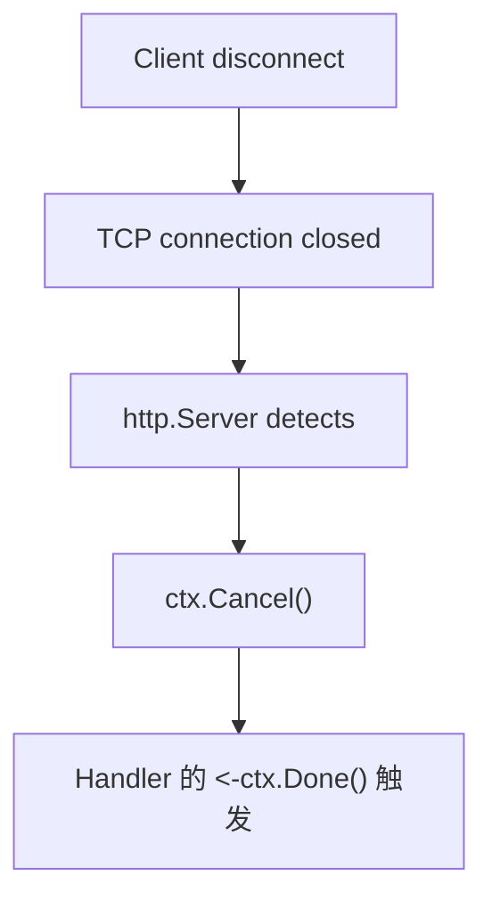

## 前置知识

- [Go 与 HTTP 客户端](/go/047-GoHTTPClient)：建议先完成前一篇的学习

## 学习目标

- 掌握「历史动机与发展脉络」的核心机制、典型用法与常见陷阱
- 掌握「形式化定义」的核心机制、典型用法与常见陷阱
- 掌握「理论推导与原理解析」的核心机制、典型用法与常见陷阱
- 掌握「代码示例」的核心机制、典型用法与常见陷阱
- 掌握「对比分析」的核心机制、典型用法与常见陷阱


## 历史动机与发展脉络

### Go 1.0（2012 年 3 月）：`net/http` 起步

Go 1.0 的 `net/http` 包已经具备了生产可用的 HTTP 服务器：

```go
http.HandleFunc("/", handler)
http.ListenAndServe(":8080", nil)
```

Go 1.0 的核心设计：

1. **goroutine-per-connection**：每个连接一个 goroutine，避免线程模型
2. **Handler 接口**：极简的 `ServeHTTP(w, *Request)` 接口
3. **零依赖**：标准库自带，无需第三方框架

### Go 1.1-1.5（2013-2015）：性能优化

- **Go 1.1**：引入 `net/http/httptest`，简化测试
- **Go 1.2**：`http.Server` 增加 `IdleTimeout`
- **Go 1.3**：`sync.Pool` 优化 `http.Request` 复用
- **Go 1.5**：HTTP/2 实验性支持

### Go 1.6（2016 年 2 月）：HTTP/2 默认启用

```go
// HTTPS 自动启用 HTTP/2
http.ListenAndServeTLS(":443", "cert.pem", "key.pem", nil)
```

### Go 1.7（2016 年 8 月）：`context.Context` 集成

`http.Request` 增加 `Context()` 方法：

```go
ctx := r.Context()
select {
case <-ctx.Done():
    // 客户端断开连接
case result := <-process():
    // 处理完成
}
```

### Go 1.8（2017 年 2 月）：优雅关闭

`http.Server` 增加 `Shutdown` 方法：

```go
server := &http.Server{Addr: ":8080", Handler: mux}
go server.ListenAndServe()

sigChan := make(chan os.Signal, 1)
signal.Notify(sigChan, syscall.SIGINT, syscall.SIGTERM)
<-sigChan

ctx, cancel := context.WithTimeout(context.Background(), 10*time.Second)
defer cancel()
server.Shutdown(ctx)
```

### Go 1.9（2017 年 8 月）：`http.RoundTripper` 优化

- `http.Transport` 引入连接池优化
- `http.Server` 增加 `ReadHeaderTimeout`

### Go 1.13（2019 年 9 月）：HTTP/2 优化

- 修复 HTTP/2 在大量并发流时的内存泄漏
- `http.Server` 增加 `TLSConfig` 字段
- `httputil.ReverseProxy` 增强

### Go 1.16（2021 年 2 月）：`io/fs` 集成

`http.FileServer` 支持 `fs.FS` 接口，可嵌入静态资源：

```go
//go:embed static
var staticFS embed.FS

fs, _ := fs.Sub(staticFS, "static")
mux.Handle("/static/", http.StripPrefix("/static/", http.FileServer(http.FS(fs))))
```

### Go 1.18（2022 年 3 月）：泛型与 `net/http`

- 泛型引入后，社区可编写类型安全的中间件
- `http.Handler` 接口保持稳定

### Go 1.22（2024 年 2 月）：增强路由（里程碑）

Go 1.22 引入了 `ServeMux` 的增强路由功能：

1. **方法匹配**：`mux.HandleFunc("GET /users", handler)`
2. **路径参数**：`mux.HandleFunc("GET /users/{id}", handler)`
3. **通配符**：`mux.HandleFunc("/files/{path...}", handler)`

```go
mux := http.NewServeMux()
mux.HandleFunc("GET /users/{id}", func(w http.ResponseWriter, r *http.Request) {
    id := r.PathValue("id")
    fmt.Fprintf(w, "用户ID: %s", id)
})
```

### Go 1.23（2025 年 2 月）：性能优化与调试增强

- `net/http` 内部使用 `sync.Pool` 进一步优化
- `http.Server` 增加 `ErrorLog *slog.Logger` 字段
- 引入 `http.Request.Pattern` 字段记录匹配的模式

### 演进时间线总结

| Go 版本 | 发布日期 | 关键变化 | 重要性 |
|---------|---------|---------|--------|
| 1.0 | 2012-03 | 基础 HTTP 服务器 | 基线 |
| 1.6 | 2016-02 | HTTP/2 默认启用 | 重要 |
| 1.7 | 2016-08 | Context 集成 | 重要 |
| 1.8 | 2017-02 | 优雅关闭 | 重要 |
| 1.13 | 2019-09 | HTTP/2 优化 | 中等 |
| 1.16 | 2021-02 | embed.FS 集成 | 中等 |
| 1.22 | 2024-02 | 增强路由 | 里程碑 |
| 1.23 | 2025-02 | slog 集成 | 中等 |

---

## 形式化定义

### HTTP 请求的形式化定义

定义以下概念：

- **HTTP Request**：一个六元组 $\text{Req} = (M, U, H, B, C, V)$，其中：
  - $M \in \{\text{GET}, \text{POST}, \text{PUT}, \text{DELETE}, \text{PATCH}, \text{HEAD}, \text{OPTIONS}\}$ 是 HTTP 方法
  - $U = (P, Q)$ 是 URL，包含路径 $P$ 与查询参数 $Q$
  - $H: \text{HeaderKey} \to \text{HeaderValue}$ 是请求头映射
  - $B \in \Sigma^*$ 是请求体
  - $C$ 是 context（携带 trace_id 等）
  - $V \in \{1.0, 1.1, 2.0, 3.0\}$ 是 HTTP 版本

- **HTTP Response**：一个三元组 $\text{Resp} = (S, H, B)$，其中：
  - $S \in [100, 599]$ 是状态码
  - $H$ 是响应头映射
  - $B \in \Sigma^*$ 是响应体

- **Handler**：一个函数 $f: \text{Req} \to \text{Resp}$

### ServeMux 模式匹配的形式化

`ServeMux` 的模式匹配规则：

$$
\text{match}(pattern, path) = \begin{cases}
\text{exact} & \text{if pattern 不含 } \{ \\
\text{param}(name) & \text{if pattern 含 } \{name\} \\
\text{wildcard} & \text{if pattern 含 } \{name...\}
\end{cases}
$$

模式优先级（Go 1.22+）：

1. **精确匹配**：`/users/login` 优先于 `/users/{id}`
2. **方法匹配**：`GET /users` 优先于 `/users`
3. **最长前缀**：`/users/` 优先于 `/`

形式化：若两个模式 $p_1$ 与 $p_2$ 都匹配 $path$，则选择 $p_i$ 满足：

$$
\text{specificity}(p_i) > \text{specificity}(p_j)
$$

其中 specificity 按以下顺序递增：
- 末尾斜杠的根模式（`/`）
- 末尾斜杠的模式（`/users/`）
- 普通模式（`/users`）
- 含路径参数的模式（`/users/{id}`）
- 精确路径（`/users/login`）

### Server 超时的形式化

`http.Server` 的三个超时构成完整生命周期：

$$
T_{\text{total}} = T_{\text{read-header}} + T_{\text{read-body}} + T_{\text{write}} + T_{\text{idle}}
$$

具体语义：

- `ReadHeaderTimeout`：读取请求头的最长时限
- `ReadTimeout`：读取完整请求（头+体）的最长时限
- `WriteTimeout`：从读完请求到写完响应的最长时限
- `IdleTimeout`：keep-alive 空闲连接的最长时限

慢客户端攻击防护：

$$
\text{attack mitigated} \iff T_{\text{read-header}} < \text{threshold}
$$

---

## 理论推导与原理解析

### 1. Goroutine-per-Connection 模型

Go `net/http` 的核心设计是每个连接一个 goroutine：

```go
// 简化的服务器主循环
for {
    conn, err := listener.Accept()
    if err != nil {
        continue
    }
    go c.serve(conn)  // 每个连接一个 goroutine
}
```

性能分析：

- **goroutine 开销**：约 2KB 栈初始大小，可动态伸缩
- **10万并发连接**：约 200MB 内存（2KB × 100k）
- **goroutine 切换**：约 100ns，远低于线程的 1-10μs

与线程模型对比：

| 维度 | Go goroutine-per-conn | Java Thread-per-conn | C epoll |
|------|----------------------|---------------------|---------|
| **内存/连接** | 2KB+ | 1MB（默认栈） | ~100B |
| **并发连接数** | 10万+ | 千级 | 百万级 |
| **代码复杂度** | 低 | 低 | 高（回调地狱） |
| **调试难度** | 低 | 低 | 高 |

### 1. HTTP/2 多路复用

HTTP/2 引入流（stream）的概念，单个 TCP 连接可承载多个请求：

$$
\text{stream}_{i} = (\text{id}_{i}, \text{headers}_{i}, \text{data}_{i}, \text{priority}_{i})
$$

HTTP/1.1 vs HTTP/2：

| 维度 | HTTP/1.1 | HTTP/2 |
|------|----------|--------|
| **连接复用** | keep-alive（串行） | 多路复用（并行） |
| **头压缩** | 无 | HPACK |
| **服务器推送** | 无 | 支持 |
| **二进制** | 文本协议 | 二进制帧 |

Go 的 HTTP/2 实现：

- **自动启用**：HTTPS 连接自动协商 HTTP/2
- **h2c 支持**：明文 HTTP/2，需要手动配置

```go
import "golang.org/x/net/http2/h2c"

h2s := &http2.Server{}
handler := h2c.NewHandler(mux, h2s)
server := &http.Server{Addr: ":8080", Handler: handler}
```

### 2. Context 取消传播

`r.Context()` 在客户端断开时自动取消：



性能开销：

- Context 取消是 O(1) 的 channel close 操作
- 子 context 的级联取消通过链表实现，O(n) 但 n 通常很小

### 3. 中间件链的代数性质

中间件是 Handler 的装饰器，构成代数结构：

```go
type Middleware func(http.Handler) http.Handler

func Logging(next http.Handler) http.Handler { ... }
func Auth(next http.Handler) http.Handler { ... }
func CORS(next http.Handler) http.Handler { ... }
```

组合律：

$$
(\text{Logging} \circ \text{Auth} \circ \text{CORS})(h) = \text{Logging}(\text{Auth}(\text{CORS}(h)))
$$

请求处理顺序：

- 外层中间件先进入
- 内层 Handler 先返回

### 4. ServeMux 的模式匹配复杂度

Go 1.22 之前，模式匹配是 $O(\text{patterns})$ 的线性扫描。

Go 1.22 之后，模式匹配优化：

- **基数树（radix tree）**：$O(\text{path\_length})$
- **方法索引**：先按方法过滤，再匹配路径

实测性能：

- 1.21 之前：1000 个路由模式，匹配耗时约 10μs
- 1.22+：1000 个路由模式，匹配耗时约 100ns

---

## 代码示例

### 示例 1：最简单的 HTTP 服务器

```go
package main

import (
    "fmt"
    "net/http"
)

func main() {
    // 注册路由和处理函数
    http.HandleFunc("/", func(w http.ResponseWriter, r *http.Request) {
        fmt.Fprintf(w, "欢迎访问！")
    })

    http.HandleFunc("/hello", func(w http.ResponseWriter, r *http.Request) {
        fmt.Fprintf(w, "你好，世界！")
    })

    // 启动服务器
    fmt.Println("服务器启动在 :8080")
    http.ListenAndServe(":8080", nil)
}
```

### 示例 2：Go 1.22+ 增强路由

```go
package main

import (
    "fmt"
    "net/http"
)

func main() {
    mux := http.NewServeMux()

    // 方法匹配：仅匹配 GET 请求
    mux.HandleFunc("GET /users", func(w http.ResponseWriter, r *http.Request) {
        fmt.Fprintf(w, "用户列表")
    })

    // 路径参数：提取 URL 中的动态部分
    mux.HandleFunc("GET /users/{id}", func(w http.ResponseWriter, r *http.Request) {
        id := r.PathValue("id") // 获取路径参数
        fmt.Fprintf(w, "用户ID: %s", id)
    })

    // 通配符：匹配 /files/ 后的所有内容
    mux.HandleFunc("GET /files/{path...}", func(w http.ResponseWriter, r *http.Request) {
        path := r.PathValue("path")
        fmt.Fprintf(w, "文件路径: %s", path)
    })

    // 方法匹配：POST 请求
    mux.HandleFunc("POST /users", func(w http.ResponseWriter, r *http.Request) {
        fmt.Fprintf(w, "创建用户")
    })

    http.ListenAndServe(":8080", mux)
}
```

### 示例 3：处理请求和响应

```go
func handleUser(w http.ResponseWriter, r *http.Request) {
    // 读取请求信息
    method := r.Method          // 请求方法
    path := r.URL.Path          // 请求路径
    query := r.URL.Query()      // 查询参数
    name := query.Get("name")   // 获取单个查询参数
    header := r.Header.Get("Content-Type") // 请求头

    // 读取请求体
    body, err := io.ReadAll(r.Body)
    defer r.Body.Close()

    // 解析 JSON 请求体
    var user User
    json.NewDecoder(r.Body).Decode(&user)

    // 设置响应头
    w.Header().Set("Content-Type", "application/json")
    w.WriteHeader(http.StatusOK) // 设置状态码

    // 写入 JSON 响应
    json.NewEncoder(w).Encode(map[string]string{
        "message": "成功",
        "name":    name,
    })
}
```

### 示例 4：自定义 Handler

实现 `http.Handler` 接口创建可复用的 Handler：

```go
package main

import (
    "encoding/json"
    "net/http"
)

type UserHandler struct {
    userService *UserService
}

// 实现 ServeHTTP 方法
func (h *UserHandler) ServeHTTP(w http.ResponseWriter, r *http.Request) {
    switch r.Method {
    case http.MethodGet:
        h.handleGet(w, r)
    case http.MethodPost:
        h.handlePost(w, r)
    default:
        http.Error(w, "方法不允许", http.StatusMethodNotAllowed)
    }
}

func (h *UserHandler) handleGet(w http.ResponseWriter, r *http.Request) {
    users := h.userService.GetAll()
    w.Header().Set("Content-Type", "application/json")
    json.NewEncoder(w).Encode(users)
}

func (h *UserHandler) handlePost(w http.ResponseWriter, r *http.Request) {
    var user User
    if err := json.NewDecoder(r.Body).Decode(&user); err != nil {
        http.Error(w, err.Error(), http.StatusBadRequest)
        return
    }
    if err := h.userService.Create(&user); err != nil {
        http.Error(w, err.Error(), http.StatusInternalServerError)
        return
    }
    w.WriteHeader(http.StatusCreated)
    json.NewEncoder(w).Encode(user)
}

// 注册
mux := http.NewServeMux()
mux.Handle("/users", &UserHandler{userService: svc})
```

### 示例 5：提供静态文件（embed.FS）

```go
package main

import (
    "embed"
    "io/fs"
    "net/http"
)

//go:embed static
var staticFS embed.FS

func main() {
    // 从 embed.FS 创建子文件系统
    subFS, _ := fs.Sub(staticFS, "static")
    fs := http.FileServer(http.FS(subFS))
    mux.Handle("/static/", http.StripPrefix("/static/", fs))

    http.ListenAndServe(":8080", mux)
}
```

### 示例 6：优雅关闭

确保服务器在关闭前处理完正在进行的请求：

```go
package main

import (
    "context"
    "fmt"
    "log"
    "net/http"
    "os"
    "os/signal"
    "syscall"
    "time"
)

func main() {
    mux := http.NewServeMux()
    mux.HandleFunc("/", handleRequest)

    server := &http.Server{
        Addr:    ":8080",
        Handler: mux,
    }

    // 在单独的 goroutine 中启动服务器
    go func() {
        if err := server.ListenAndServe(); err != nil && err != http.ErrServerClosed {
            log.Fatalf("服务器启动失败: %v", err)
        }
    }()
    fmt.Println("服务器启动在 :8080")

    // 等待中断信号
    sigChan := make(chan os.Signal, 1)
    signal.Notify(sigChan, syscall.SIGINT, syscall.SIGTERM)
    <-sigChan
    fmt.Println("接收到关闭信号，开始优雅关闭...")

    // 优雅关闭，给 10 秒时间处理剩余请求
    ctx, cancel := context.WithTimeout(context.Background(), 10*time.Second)
    defer cancel()

    if err := server.Shutdown(ctx); err != nil {
        log.Printf("强制关闭: %v", err)
    }
    fmt.Println("服务器已关闭")
}

func handleRequest(w http.ResponseWriter, r *http.Request) {
    time.Sleep(2 * time.Second) // 模拟处理耗时
    fmt.Fprintf(w, "请求处理完成")
}
```

### 示例 7：完整生产级服务器配置

```go
package main

import (
    "net/http"
    "time"
)

func main() {
    mux := http.NewServeMux()
    // 注册路由...

    server := &http.Server{
        Addr:              ":8080",
        Handler:           mux,
        ReadHeaderTimeout: 5 * time.Second,  // 读取请求头超时（防慢客户端攻击）
        ReadTimeout:       30 * time.Second, // 读取完整请求超时
        WriteTimeout:      30 * time.Second, // 写入响应超时
        IdleTimeout:       120 * time.Second, // 空闲连接超时
        MaxHeaderBytes:    1 << 20,           // 最大请求头大小（1MB）
        MaxAddrLen:        256,               // 最大地址长度
        // ErrorLog:       slog.NewLogLogger(...), // Go 1.23+ 支持 slog
    }

    if err := server.ListenAndServe(); err != nil {
        panic(err)
    }
}
```

### 示例 8：RESTful API

```go
package main

import (
    "encoding/json"
    "net/http"
    "strconv"
)

type User struct {
    ID    int    `json:"id"`
    Name  string `json:"name"`
    Email string `json:"email"`
}

type UserStore struct {
    users map[int]*User
    nextID int
}

func NewUserStore() *UserStore {
    return &UserStore{
        users:  make(map[int]*User),
        nextID: 1,
    }
}

func (s *UserStore) List() []*User {
    users := make([]*User, 0, len(s.users))
    for _, u := range s.users {
        users = append(users, u)
    }
    return users
}

func (s *UserStore) Get(id int) (*User, bool) {
    u, ok := s.users[id]
    return u, ok
}

func (s *UserStore) Create(u *User) *User {
    u.ID = s.nextID
    s.nextID++
    s.users[u.ID] = u
    return u
}

func (s *UserStore) Update(id int, u *User) (*User, bool) {
    if _, ok := s.users[id]; !ok {
        return nil, false
    }
    u.ID = id
    s.users[id] = u
    return u, true
}

func (s *UserStore) Delete(id int) bool {
    if _, ok := s.users[id]; !ok {
        return false
    }
    delete(s.users, id)
    return true
}

func SetupRoutes(mux *http.ServeMux, store *UserStore) {
    mux.HandleFunc("GET /api/users", func(w http.ResponseWriter, r *http.Request) {
        users := store.List()
        writeJSON(w, http.StatusOK, users)
    })

    mux.HandleFunc("GET /api/users/{id}", func(w http.ResponseWriter, r *http.Request) {
        id, err := strconv.Atoi(r.PathValue("id"))
        if err != nil {
            writeJSON(w, http.StatusBadRequest, map[string]string{"error": "无效的 ID"})
            return
        }
        user, ok := store.Get(id)
        if !ok {
            writeJSON(w, http.StatusNotFound, map[string]string{"error": "用户不存在"})
            return
        }
        writeJSON(w, http.StatusOK, user)
    })

    mux.HandleFunc("POST /api/users", func(w http.ResponseWriter, r *http.Request) {
        var user User
        if err := json.NewDecoder(r.Body).Decode(&user); err != nil {
            writeJSON(w, http.StatusBadRequest, map[string]string{"error": err.Error()})
            return
        }
        created := store.Create(&user)
        writeJSON(w, http.StatusCreated, created)
    })

    mux.HandleFunc("PUT /api/users/{id}", func(w http.ResponseWriter, r *http.Request) {
        id, err := strconv.Atoi(r.PathValue("id"))
        if err != nil {
            writeJSON(w, http.StatusBadRequest, map[string]string{"error": "无效的 ID"})
            return
        }
        var user User
        if err := json.NewDecoder(r.Body).Decode(&user); err != nil {
            writeJSON(w, http.StatusBadRequest, map[string]string{"error": err.Error()})
            return
        }
        updated, ok := store.Update(id, &user)
        if !ok {
            writeJSON(w, http.StatusNotFound, map[string]string{"error": "用户不存在"})
            return
        }
        writeJSON(w, http.StatusOK, updated)
    })

    mux.HandleFunc("DELETE /api/users/{id}", func(w http.ResponseWriter, r *http.Request) {
        id, err := strconv.Atoi(r.PathValue("id"))
        if err != nil {
            writeJSON(w, http.StatusBadRequest, map[string]string{"error": "无效的 ID"})
            return
        }
        if !store.Delete(id) {
            writeJSON(w, http.StatusNotFound, map[string]string{"error": "用户不存在"})
            return
        }
        writeJSON(w, http.StatusNoContent, nil)
    })
}

func writeJSON(w http.ResponseWriter, status int, data interface{}) {
    w.Header().Set("Content-Type", "application/json")
    w.WriteHeader(status)
    if data != nil {
        json.NewEncoder(w).Encode(data)
    }
}
```

### 示例 9：文件上传

```go
package main

import (
    "fmt"
    "io"
    "net/http"
    "os"
    "path/filepath"
)

func main() {
    mux := http.NewServeMux()

    mux.HandleFunc("POST /upload", func(w http.ResponseWriter, r *http.Request) {
        // 限制上传大小（10MB）
        if err := r.ParseMultipartForm(10 << 20); err != nil {
            http.Error(w, "文件过大", http.StatusRequestEntityTooLarge)
            return
        }

        file, header, err := r.FormFile("file")
        if err != nil {
            http.Error(w, "获取文件失败", http.StatusBadRequest)
            return
        }
        defer file.Close()

        // 安全地保存文件（防止路径遍历）
        filename := filepath.Base(header.Filename)
        dst, err := os.Create(filepath.Join("./uploads", filename))
        if err != nil {
            http.Error(w, "创建文件失败", http.StatusInternalServerError)
            return
        }
        defer dst.Close()

        if _, err := io.Copy(dst, file); err != nil {
            http.Error(w, "保存文件失败", http.StatusInternalServerError)
            return
        }

        fmt.Fprintf(w, "上传成功: %s (%d bytes)", filename, header.Size)
    })

    // 确保上传目录存在
    os.MkdirAll("./uploads", 0755)

    http.ListenAndServe(":8080", mux)
}
```

### 示例 10：Server-Sent Events (SSE)

```go
package main

import (
    "fmt"
    "net/http"
    "time"
)

func main() {
    mux := http.NewServeMux()

    mux.HandleFunc("GET /events", func(w http.ResponseWriter, r *http.Request) {
        // 设置 SSE 必需的响应头
        w.Header().Set("Content-Type", "text/event-stream")
        w.Header().Set("Cache-Control", "no-cache")
        w.Header().Set("Connection", "keep-alive")
        w.Header().Set("Access-Control-Allow-Origin", "*")

        flusher, ok := w.(http.Flusher)
        if !ok {
            http.Error(w, "不支持流式响应", http.StatusInternalServerError)
            return
        }

        // 发送事件
        ticker := time.NewTicker(1 * time.Second)
        defer ticker.Stop()

        for i := 0; ; i++ {
            select {
            case <-r.Context().Done():
                return // 客户端断开
            case <-ticker.C:
                fmt.Fprintf(w, "data: %s\n\n", fmt.Sprintf("事件 #%d at %s", i, time.Now().Format(time.RFC3339)))
                flusher.Flush()
            }
        }
    })

    http.ListenAndServe(":8080", mux)
}
```

### 示例 11：中间件链（企业级）

```go
package middleware

import (
    "log/slog"
    "net/http"
    "time"
)

type Middleware func(http.Handler) http.Handler

// Chain 将多个中间件组合成链
func Chain(handler http.Handler, middlewares ...Middleware) http.Handler {
    for i := len(middlewares) - 1; i >= 0; i-- {
        handler = middlewares[i](handler)
    }
    return handler
}

// Logging 请求日志中间件
func Logging(logger *slog.Logger) Middleware {
    return func(next http.Handler) http.Handler {
        return http.HandlerFunc(func(w http.ResponseWriter, r *http.Request) {
            start := time.Now()
            recorder := &statusRecorder{ResponseWriter: w, status: 200}
            next.ServeHTTP(recorder, r)
            logger.Info("请求完成",
                "method", r.Method,
                "path", r.URL.Path,
                "status", recorder.status,
                "duration_ms", time.Since(start).Milliseconds(),
                "remote_addr", r.RemoteAddr,
            )
        })
    }
}

// Recover panic 恢复中间件
func Recover(logger *slog.Logger) Middleware {
    return func(next http.Handler) http.Handler {
        return http.HandlerFunc(func(w http.ResponseWriter, r *http.Request) {
            defer func() {
                if err := recover(); err != nil {
                    logger.Error("panic recovered",
                        "error", err,
                        "method", r.Method,
                        "path", r.URL.Path,
                    )
                    http.Error(w, "内部服务器错误", http.StatusInternalServerError)
                }
            }()
            next.ServeHTTP(w, r)
        })
    }
}

// CORS 跨域中间件
func CORS(allowedOrigins []string) Middleware {
    return func(next http.Handler) http.Handler {
        return http.HandlerFunc(func(w http.ResponseWriter, r *http.Request) {
            origin := r.Header.Get("Origin")
            for _, allowed := range allowedOrigins {
                if origin == allowed {
                    w.Header().Set("Access-Control-Allow-Origin", origin)
                    w.Header().Set("Access-Control-Allow-Methods", "GET, POST, PUT, DELETE, OPTIONS")
                    w.Header().Set("Access-Control-Allow-Headers", "Content-Type, Authorization")
                    w.Header().Set("Access-Control-Allow-Credentials", "true")
                    break
                }
            }
            if r.Method == http.MethodOptions {
                w.WriteHeader(http.StatusNoContent)
                return
            }
            next.ServeHTTP(w, r)
        })
    }
}

// RateLimit 限流中间件
func RateLimit(rate int) Middleware {
    // 令牌桶实现（简化版）
    return func(next http.Handler) http.Handler {
        return http.HandlerFunc(func(w http.ResponseWriter, r *http.Request) {
            // 实际实现需要更复杂的逻辑
            next.ServeHTTP(w, r)
        })
    }
}

// RequestID 请求 ID 中间件
func RequestID(next http.Handler) http.Handler {
    return http.HandlerFunc(func(w http.ResponseWriter, r *http.Request) {
        requestID := r.Header.Get("X-Request-ID")
        if requestID == "" {
            requestID = generateUUID()
        }
        w.Header().Set("X-Request-ID", requestID)
        next.ServeHTTP(w, r)
    })
}

type statusRecorder struct {
    http.ResponseWriter
    status int
}

func (r *statusRecorder) WriteHeader(status int) {
    r.status = status
    r.ResponseWriter.WriteHeader(status)
}

func generateUUID() string {
    // 实际实现应使用 google/uuid 或类似库
    return "generated-uuid"
}
```

使用示例：

```go
func main() {
    mux := http.NewServeMux()
    mux.HandleFunc("GET /api/users", listUsers)

    handler := middleware.Chain(
        mux,
        middleware.RequestID,
        middleware.Logging(logger),
        middleware.Recover(logger),
        middleware.CORS([]string{"https://fandex.com"}),
        middleware.RateLimit(100),
    )

    server := &http.Server{
        Addr:    ":8080",
        Handler: handler,
    }
    server.ListenAndServe()
}
```

### 示例 12：HTTP/2 与 h2c

```go
package main

import (
    "fmt"
    "net/http"

    "golang.org/x/net/http2"
    "golang.org/x/net/http2/h2c"
)

func main() {
    mux := http.NewServeMux()
    mux.HandleFunc("/", func(w http.ResponseWriter, r *http.Request) {
        fmt.Fprintf(w, "Protocol: %s\n", r.Proto)
        fmt.Fprintf(w, "HTTP/2: %v\n", r.ProtoMajor == 2)
    })

    // h2c: 明文 HTTP/2（用于反向代理后端）
    h2s := &http2.Server{}
    handler := h2c.NewHandler(mux, h2s)

    server := &http.Server{
        Addr:    ":8080",
        Handler: handler,
    }

    // HTTPS + HTTP/2 自动启用
    // server.ListenAndServeTLS("cert.pem", "key.pem")

    // h2c 明文 HTTP/2
    server.ListenAndServe()
}
```

### 示例 13：WebSocket 升级

```go
package main

import (
    "log"
    "net/http"

    "github.com/gorilla/websocket"
)

var upgrader = websocket.Upgrader{
    CheckOrigin: func(r *http.Request) bool {
        return true // 生产环境应校验 Origin
    },
}

func handleWebSocket(w http.ResponseWriter, r *http.Request) {
    conn, err := upgrader.Upgrade(w, r, nil)
    if err != nil {
        log.Println("WebSocket 升级失败:", err)
        return
    }
    defer conn.Close()

    for {
        messageType, message, err := conn.ReadMessage()
        if err != nil {
            log.Println("读取消息失败:", err)
            break
        }
        log.Printf("收到消息: %s", message)

        // 回显消息
        if err := conn.WriteMessage(messageType, message); err != nil {
            log.Println("写入消息失败:", err)
            break
        }
    }
}

func main() {
    mux := http.NewServeMux()
    mux.HandleFunc("/ws", handleWebSocket)
    http.ListenAndServe(":8080", mux)
}
```

---

## 对比分析

### Go `net/http` 与其他 HTTP 服务器对比

| 维度 | Go `net/http` | nginx | Node.js Express | Python FastAPI | Java Spring Boot |
|------|--------------|-------|-----------------|----------------|------------------|
| **语言** | Go | C | JavaScript | Python | Java |
| **并发模型** | goroutine-per-conn | epoll | event loop | async/greenlet | thread-per-conn |
| **内存/连接** | 2KB+ | ~100B | ~50KB | ~50KB | ~1MB |
| **HTTP/2** | 原生支持 | 原生支持 | 需 http2 包 | 需配置 | 原生支持 |
| **HTTP/3** | 实验性 | 原生支持 | 不支持 | 不支持 | 不支持 |
| **路由** | 1.22+ 增强 | 配置文件 | Express 路由 | Starlette 路由 | Spring MVC |
| **中间件** | 函数包装 | Lua 脚本 | 函数链 | Depends 注入 | Filter/Interceptor |
| **生态** | 标准库+第三方 | 模块化 | npm 生态 | PyPI 生态 | Spring 生态 |

### Go 1.22 增强路由与第三方路由库对比

| 维度 | `net/http` 1.22 | chi | gorilla/mux | gin |
|------|------------------|-----|-------------|-----|
| **方法匹配** | 原生支持 | 原生支持 | 原生支持 | 原生支持 |
| **路径参数** | `{id}` | `{id}` | `{id}` | `:id` |
| **通配符** | `{path...}` | `*path` | `*path` | `*path` |
| **正则匹配** | 不支持 | 不支持 | 支持 | 不支持 |
| **路由组** | 不支持（需手动） | `r.Route` | `r.PathPrefix` | `r.Group` |
| **中间件** | 函数包装 | `r.Use` | `r.Use` | `r.Use` |
| **依赖** | 标准库 | 第三方 | 已归档 | 第三方 |
| **性能** | 极高 | 极高 | 高 | 极高 |

### 推荐选型

- **新项目（Go 1.22+）**：优先使用标准库 `net/http`，路由需求简单时无需第三方
- **复杂路由**：使用 `chi`（轻量、兼容 `net/http`）
- **快速开发**：使用 `gin`（生态丰富，但脱离标准库）
- **API 服务**：标准库 + `chi` + `slog` + OpenTelemetry

---

## 常见陷阱与最佳实践

### 陷阱 1：使用默认 ServeMux

**错误代码**：

```go
http.HandleFunc("/", handler)  // 使用全局默认 ServeMux
http.ListenAndServe(":8080", nil)
```

**问题**：任何第三方库都能注册路由到默认 ServeMux，存在安全风险。

**正确做法**：

```go
mux := http.NewServeMux()
mux.HandleFunc("/", handler)
http.ListenAndServe(":8080", mux)
```

### 陷阱 2：未读取并关闭请求体

**错误代码**：

```go
func handler(w http.ResponseWriter, r *http.Request) {
    // 不读 r.Body 就返回
    w.Write([]byte("ok"))
}
```

**问题**：连接可能无法复用（keep-alive 失败）。

**正确做法**：

```go
func handler(w http.ResponseWriter, r *http.Request) {
    defer r.Body.Close()
    // 至少消费请求体
    io.Copy(io.Discard, r.Body)
    w.Write([]byte("ok"))
}
```

### 陷阱 3：响应写入后修改 Header

**错误代码**：

```go
w.Write([]byte("hello"))      // 触发 WriteHeader(200)
w.Header().Set("X-Custom", "1")  // 不生效
```

**正确做法**：

```go
w.Header().Set("X-Custom", "1")  // 先设置 Header
w.Write([]byte("hello"))
```

### 陷阱 4：未设置超时

**错误代码**：

```go
http.ListenAndServe(":8080", nil)
```

**问题**：慢客户端攻击（Slowloris）会导致连接耗尽。

**正确做法**：

```go
server := &http.Server{
    Addr:              ":8080",
    ReadHeaderTimeout: 5 * time.Second,
    ReadTimeout:       30 * time.Second,
    WriteTimeout:      30 * time.Second,
    IdleTimeout:       120 * time.Second,
}
server.ListenAndServe()
```

### 陷阱 5：路径末尾斜杠混淆

Go 1.21 及之前版本：

- `/foo`：仅匹配 `/foo`
- `/foo/`：匹配 `/foo/` 及其子路径 `/foo/bar`

Go 1.22+：使用方法匹配语法后更清晰：

```go
mux.HandleFunc("GET /users", listUsers)      // 精确匹配
mux.HandleFunc("GET /users/", listUsers)     // 末尾斜杠（子路径）
mux.HandleFunc("GET /users/{id}", getUser)   // 路径参数
```

### 陷阱 6：忽略 Context 取消

**错误代码**：

```go
func handler(w http.ResponseWriter, r *http.Request) {
    result := expensiveCompute()  // 客户端已断开，仍继续计算
    w.Write(result)
}
```

**正确做法**：

```go
func handler(w http.ResponseWriter, r *http.Request) {
    ctx := r.Context()
    select {
    case <-ctx.Done():
        return // 客户端断开
    case result := <-expensiveComputeAsync(ctx):
        w.Write(result)
    }
}
```

### 陷阱 7：panic 未恢复

**错误代码**：

```go
func handler(w http.ResponseWriter, r *http.Request) {
    panic("意外错误")  // 整个服务器进程可能崩溃
}
```

**正确做法**：使用 `Recover` 中间件：

```go
func Recover(next http.Handler) http.Handler {
    return http.HandlerFunc(func(w http.ResponseWriter, r *http.Request) {
        defer func() {
            if err := recover(); err != nil {
                http.Error(w, "内部错误", http.StatusInternalServerError)
            }
        }()
        next.ServeHTTP(w, r)
    })
}
```

注：Go 1.22+ 的 `net/http` 会对每个连接的 goroutine 做 panic 恢复，但不会记录日志，建议显式使用中间件。

### 最佳实践总结

1. **始终使用 `http.NewServeMux()`**：避免全局污染
2. **设置完整超时**：`ReadHeaderTimeout`/`ReadTimeout`/`WriteTimeout`/`IdleTimeout`
3. **使用中间件链**：日志、恢复、CORS、限流、追踪
4. **Go 1.22+ 路由语法**：`GET /users/{id}` 优于手动解析
5. **优雅关闭**：监听 SIGINT/SIGTERM，调用 `server.Shutdown`
6. **Context 传播**：所有耗时操作检查 `r.Context().Done()`
7. **HTTPS 优先**：使用 Let's Encrypt + autocert

---

## 工程实践

### 1. 项目结构

```mermaid
flowchart TD
    T0["github.com/fandex/api/"]
    T1["cmd/"]
    T2["server/"]
    T3["main.go              # 入口"]
    T4["internal/"]
    T5["handler/                 # HTTP Handler"]
    T6["user.go"]
    T7["order.go"]
    T8["service/                 # 业务逻辑"]
    T9["user.go"]
    T10["order.go"]
    T11["repository/              # 数据访问"]
    T12["user.go"]
    T13["middleware/              # 中间件"]
    T14["logging.go"]
    T15["auth.go"]
    T16["cors.go"]
    T17["config/                  # 配置"]
    T18["config.go"]
    T19["pkg/                         # 可复用包"]
    T20["logger/"]
    T21["httpclient/"]
    T22["api/"]
    T23["openapi.yaml             # OpenAPI 规范"]
    T24["deployments/"]
    T25["docker/"]
    T26["k8s/"]
    T27["go.mod"]
    T0 --> T1
    T3 --> T4
    T18 --> T19
    T21 --> T22
    T23 --> T24
    T26 --> T27
```



### 1. 统一响应格式

```go
package handler

import (
    "encoding/json"
    "net/http"
)

// Response 统一响应结构
type Response struct {
    Code    int         `json:"code"`
    Message string      `json:"message"`
    Data    interface{} `json:"data,omitempty"`
    Error   string      `json:"error,omitempty"`
}

func WriteJSON(w http.ResponseWriter, status int, data interface{}) {
    w.Header().Set("Content-Type", "application/json; charset=utf-8")
    w.WriteHeader(status)
    json.NewEncoder(w).Encode(Response{
        Code:    status,
        Message: "success",
        Data:    data,
    })
}

func WriteError(w http.ResponseWriter, status int, message string) {
    w.Header().Set("Content-Type", "application/json; charset=utf-8")
    w.WriteHeader(status)
    json.NewEncoder(w).Encode(Response{
        Code:  status,
        Error: message,
    })
}
```

### 2. 健康检查端点

```go
package handler

import (
    "encoding/json"
    "net/http"
    "sync"
)

type HealthChecker interface {
    Check() error
}

type HealthHandler struct {
    checkers map[string]HealthChecker
    mu       sync.RWMutex
}

func NewHealthHandler() *HealthHandler {
    return &HealthHandler{
        checkers: make(map[string]HealthChecker),
    }
}

func (h *HealthHandler) Register(name string, checker HealthChecker) {
    h.mu.Lock()
    defer h.mu.Unlock()
    h.checkers[name] = checker
}

func (h *HealthHandler) ServeHTTP(w http.ResponseWriter, r *http.Request) {
    h.mu.RLock()
    defer h.mu.RUnlock()

    status := http.StatusOK
    results := make(map[string]string)

    for name, checker := range h.checkers {
        if err := checker.Check(); err != nil {
            status = http.StatusServiceUnavailable
            results[name] = "unhealthy: " + err.Error()
        } else {
            results[name] = "healthy"
        }
    }

    w.Header().Set("Content-Type", "application/json")
    w.WriteHeader(status)
    json.NewEncoder(w).Encode(results)
}
```

### 3. 与 OpenTelemetry 集成

```go
package main

import (
    "go.opentelemetry.io/otel"
    "go.opentelemetry.io/otel/propagation"
    otelhttp "go.opentelemetry.io/otel/contrib/instrumentation/net/http/otelhttp"
)

func main() {
    // 初始化 OpenTelemetry
    tp, _ := initTracer()
    defer tp.Shutdown(ctx)
    otel.SetTracerProvider(tp)
    otel.SetTextMapPropagator(propagation.TraceContext{})

    mux := http.NewServeMux()
    mux.HandleFunc("/api/users", listUsers)

    // 使用 otelhttp 包装，自动记录 span
    handler := otelhttp.NewHandler(mux, "api")

    server := &http.Server{
        Addr:    ":8080",
        Handler: handler,
    }
    server.ListenAndServe()
}
```

### 4. 与 Prometheus 指标集成

```go
package middleware

import (
    "net/http"
    "strconv"
    "time"

    "github.com/prometheus/client_golang/prometheus"
    "github.com/prometheus/client_golang/prometheus/promauto"
)

var (
    httpRequestsTotal = promauto.NewCounterVec(
        prometheus.CounterOpts{
            Name: "http_requests_total",
            Help: "Total HTTP requests",
        },
        []string{"method", "path", "status"},
    )
    httpRequestDuration = promauto.NewHistogramVec(
        prometheus.HistogramOpts{
            Name:    "http_request_duration_seconds",
            Help:    "HTTP request duration",
            Buckets: prometheus.DefBuckets,
        },
        []string{"method", "path"},
    )
)

func Metrics(next http.Handler) http.Handler {
    return http.HandlerFunc(func(w http.ResponseWriter, r *http.Request) {
        start := time.Now()
        recorder := &statusRecorder{ResponseWriter: w, status: 200}

        next.ServeHTTP(recorder, r)

        duration := time.Since(start).Seconds()
        path := normalizePath(r.URL.Path) // 避免高基数

        httpRequestsTotal.WithLabelValues(r.Method, path, strconv.Itoa(recorder.status)).Inc()
        httpRequestDuration.WithLabelValues(r.Method, path).Observe(duration)
    })
}

// normalizePath 将 /users/123 归一化为 /users/:id
func normalizePath(path string) string {
    // 实际实现需要更复杂的逻辑
    return path
}
```

### 5. 反向代理

```go
package main

import (
    "log"
    "net/http"
    "net/http/httputil"
    "net/url"
)

func main() {
    target, _ := url.Parse("http://localhost:3000")
    proxy := httputil.NewSingleHostReverseProxy(proxy)

    mux := http.NewServeMux()
    mux.Handle("/", proxy)

    log.Println("反向代理启动在 :8080，目标 :3000")
    http.ListenAndServe(":8080", mux)
}
```

---

## 案例研究

### 案例 1：Kubernetes API Server 的 HTTP 实现

Kubernetes API Server 基于 `net/http` 构建，关键设计：

- **APIService 路由聚合**：通过 `apiserver.go` 注册多个 APIGroup
- **认证授权链**：`Authentication` → `Authorization` → `Admission` 中间件
- **Watch 机制**：基于 HTTP/2 流的长连接

```go
// 简化的 K8s API Server 路由
mux.HandleFunc("/api/v1/pods", listPods)
mux.HandleFunc("/api/v1/pods/{name}", getPod)
mux.HandleFunc("/api/v1/watch/pods", watchPods)  // SSE 长连接
```

### 案例 2：Docker Registry 的 HTTP 实现

Docker Distribution（registry）使用 `net/http`：

- **大文件支持**：分块上传（chunked upload）
- **内容寻址**：SHA-256 作为路径
- **缓存控制**：`Cache-Control` 头与 CDN 集成

### 案例 3：TiDB 的 HTTP 端点

TiDB 作为分布式数据库，HTTP 端点用于：

- **状态查询**：`/tidb/status` 返回集群状态
- **慢日志查询**：`/tidb/slow-log`
- **监控指标**：`/metrics` 暴露 Prometheus 指标

```go
mux.HandleFunc("/tidb/status", statusHandler)
mux.HandleFunc("/tidb/slow-log", slowLogHandler)
mux.Handle("/metrics", promhttp.Handler())
```

### 案例 4：etcd 的 HTTP API

etcd v3 提供 gRPC 与 HTTP 双协议：

- **gRPC**：主要协议，性能高
- **HTTP/JSON**：通过 gRPC-Gateway 转换

```go
// etcd HTTP API 示例
mux.HandleFunc("/v3/kv/range", rangeHandler)
mux.HandleFunc("/v3/kv/put", putHandler)
mux.HandleFunc("/v3/kv/delete", deleteHandler)
```

### 案例 5：Prometheus 的 HTTP 服务

Prometheus 的 HTTP 端点包括：

- **`/api/v1/query`**：PromQL 即时查询
- **`/api/v1/query_range`**：范围查询
- **`/metrics`**：自身指标暴露
- **`/-/reload`**：配置热重载

```go
mux.HandleFunc("/api/v1/query", queryHandler)
mux.HandleFunc("/api/v1/query_range", queryRangeHandler)
mux.Handle("/metrics", promhttp.Handler())
mux.HandleFunc("/-/reload", reloadHandler)
```

### 案例 6：Caddy 的 HTTP/3 部署

Caddy 是最早支持 HTTP/3 的 Go 服务器：

- **QUIC 协议**：基于 UDP，0-RTT 握手
- **连接迁移**：IP 切换不中断连接
- **Go `net/http` 1.22+**：实验性支持 HTTP/3

```go
import "github.com/lucas-clemente/quic-go/http3"

server := &http3.Server{
    Addr:    ":8443",
    Handler: mux,
}
server.ListenAndServeTLS("cert.pem", "key.pem")
```

---

### 标准与规范

- [1] Fielding, R., et al. (1999). *Hypertext Transfer Protocol -- HTTP/1.1*. RFC 2616. https://www.rfc-editor.org/rfc/rfc2616

- [2] Belshe, M., et al. (2015). *Hypertext Transfer Protocol Version 2 (HTTP/2)*. RFC 7540. https://www.rfc-editor.org/rfc/rfc7540

- [3] Bishop, M. (2021). *Hypertext Transfer Protocol Version 3 (HTTP/3)*. RFC 9114. https://www.rfc-editor.org/rfc/rfc9114

### 学术论文

- [4] Welsh, M., et al. (2001). *SEDA: An Architecture for Well-Conditioned, Scalable Internet Services*. ACM SIGOPS Operating Systems Review, 35(5), 230-243. https://doi.org/10.1145/502059.502057

- [5] Pallis, G., et al. (2018). *A Survey on HTTP/2 and HTTP/3 Performance*. IEEE Communications Surveys & Tutorials. https://doi.org/10.1109/COMST.2018.2853142

### 官方文档

- [6] Go Team (2024). *net/http Package Documentation*. https://pkg.go.dev/net/http

- [7] Go Team (2024). *Go 1.22 Release Notes: Enhanced ServeMux*. https://go.dev/doc/go1.22

### 教学资源

- [8] MIT 6.172 (2024). *Performance Engineering of Software Systems*. Massachusetts Institute of Technology. https://ocw.mit.edu/courses/6-172-performance-engineering-of-software-systems-fall-2018

- [9] CMU 15-440 (2023). *Distributed Systems*. Carnegie Mellon University. https://www.cs.cmu.edu/~dga/15-440

### 工程实践

- [10] Kubernetes SIG API Machinery (2024). *API Server Architecture*. https://github.com/kubernetes/community/tree/master/sig-api-machinery

- [11] Prometheus Authors (2024). *HTTP API Reference*. https://prometheus.io/docs/prometheus/latest/querying/api

### 性能基准

- [12] Brad Fitzpatrick (2016). *Go HTTP Server Performance*. https://blog.gopheracademy.com/advent-2016/exposing-http-on-windows

- [13] Dave Cheney (2018). *Slowloris Attack and Go HTTP Server*. https://dave.cheney.net/2018/05/29/how-to-build-a-slowloris-attack-mitigation

---

### 第三方库文档

- **chi Documentation**：https://pkg.go.dev/github.com/go-chi/chi/v5
- **gorilla/mux Documentation**：https://pkg.go.dev/github.com/gorilla/mux
- **gin Documentation**：https://pkg.go.dev/github.com/gin-gonic/gin
- **echo Documentation**：https://pkg.go.dev/github.com/labstack/echo

### HTTP 协议

- **MDN: HTTP Overview**：https://developer.mozilla.org/en-US/docs/Web/HTTP
- **HTTP/2 Specification**：https://http2.github.io
- **HTTP/3 Specification**：https://quicwg.org

### 可观测性

- **OpenTelemetry Go HTTP Instrumentation**：https://opentelemetry.io/docs/instrumentation/go
- **Prometheus Client Go**：https://github.com/prometheus/client_golang

### 相关章节

- Go 与 JSON：请求/响应的 JSON 序列化
- Go 与 HTTP 客户端：客户端实现
- Go 与中间件：中间件模式详解
- Go 与 OAuth2：认证授权
- Go 与日志：请求日志集成

### 推荐书籍

- Bustamante, R. (2023). *Mastering Go*. Packt Publishing.（第 8 章：Network Programming）
- Sorahan, A. (2022). *Web Development with Go*. O'Reilly Media.
- Hughes, M. (2023). *Building Microservices with Go*. O'Reilly Media.
## 基本服务

**基本写法：启动 HTTP 服务**
`http.ListenAndServe(<地址>, <handler>)`
```go
// 启动 HTTP 服务
http.HandleFunc("/", func(w http.ResponseWriter, r *http.Request) {
    fmt.Fprintln(w, "hello")
})
http.ListenAndServe(":8080", nil)
```

**基本写法：注册路由**
`http.HandleFunc(<路径>, <处理函数>)`
```go
// 注册路由处理函数
http.HandleFunc("/api", func(w http.ResponseWriter, r *http.Request) {
    fmt.Fprintln(w, "API response")
})
```

**基本写法：使用 Handler 对象**
`http.Handle(<路径>, <handler>)`
```go
// 注册实现了 http.Handler 的对象
http.Handle("/static", http.FileServer(http.Dir("./public")))
```

**基本写法：带 TLS 启动**
`http.ListenAndServeTLS(<地址>, <证书>, <密钥>, <handler>)`
```go
// 启动 HTTPS 服务
http.ListenAndServeTLS(":443", "cert.pem", "key.pem", nil)
```

---

## 请求处理

**基本写法：获取请求方法**
`r.Method`
```go
// 获取 HTTP 方法
if r.Method == "GET" {
    // 处理 GET 请求
}
```

**基本写法：获取查询参数**
`r.URL.Query().Get(<参数名>)`
```go
// 获取 URL 查询参数
name := r.URL.Query().Get("name")
```

**基本写法：获取所有同名参数**
`r.URL.Query()[<参数名>]`
```go
// 获取同名参数列表
ids := r.URL.Query()["id"]
```

**基本写法：获取请求头**
`r.Header.Get(<头部名>)`
```go
// 获取请求头
ua := r.Header.Get("User-Agent")
```

**基本写法：获取路径参数**
`r.PathValue(<参数名>)`
```go
// Go 1.22+ 路径参数
http.HandleFunc("/user/{id}", func(w http.ResponseWriter, r *http.Request) {
    id := r.PathValue("id")
    fmt.Fprintln(w, id)
})
```

**基本写法：读取请求体**
`io.ReadAll(r.Body)`
```go
// 读取请求体内容
body, _ := io.ReadAll(r.Body)
defer r.Body.Close()
```

---

## 响应处理

**基本写法：写入文本响应**
`fmt.Fprintln(<writer>, <内容>)`
```go
// 写入纯文本响应
fmt.Fprintln(w, "hello world")
```

**基本写法：写入字节数据**
`w.Write(<字节>)`
```go
// 写入字节数据
w.Write([]byte("raw bytes"))
```

**基本写法：设置响应头**
`w.Header().Set(<名称>, <值>)`
```go
// 设置响应头
w.Header().Set("Content-Type", "application/json")
```

**基本写法：设置状态码**
`w.WriteHeader(<状态码>)`
```go
// 设置 HTTP 状态码
w.WriteHeader(http.StatusNotFound)
```

**基本写法：写入 JSON 响应**
`json.NewEncoder(w).Encode(<数据>)`
```go
// 返回 JSON 数据
w.Header().Set("Content-Type", "application/json")
json.NewEncoder(w).Encode(map[string]string{"msg": "ok"})
```

---

## Go 1.22+ 路由增强

**基本写法：方法路由**
`mux.HandleFunc("<方法> <路径>", <处理函数>)`
```go
// Go 1.22+ 支持方法前缀
mux := http.NewServeMux()
mux.HandleFunc("GET /users", listUsers)
mux.HandleFunc("POST /users", createUser)
```

**基本写法：路径通配符**
`mux.HandleFunc("/static/{path...}", <处理函数>)`
```go
// Go 1.22+ 捕获多级路径
mux.HandleFunc("/files/{path...}", func(w http.ResponseWriter, r *http.Request) {
    p := r.PathValue("path")
    fmt.Fprintln(w, p)
})
```

**基本写法：路由优先级**
`mux.HandleFunc("/api/v1/", <处理函数>)`
```go
// Go 1.22+ 更精确的路由匹配优先
mux.HandleFunc("/api/", apiHandler)
mux.HandleFunc("/api/users/", usersHandler)
```

---

## ServeMux

**基本写法：自定义 ServeMux**
`mux := http.NewServeMux()`
```go
// 使用自定义路由器
mux := http.NewServeMux()
mux.HandleFunc("/", rootHandler)
http.ListenAndServe(":8080", mux)
```

**基本写法：注册子路径**
`mux.Handle("/api/", <handler>)`
```go
// 注册带尾部斜杠的子路径
mux.Handle("/api/", http.StripPrefix("/api/", apiHandler))
```

---

## 中间件

**换行写法：编写中间件**
`func <中间件名>(next http.Handler) http.Handler`
```go
// 中间件包装 Handler
func logging(next http.Handler) http.Handler {
    return http.HandlerFunc(func(w http.ResponseWriter, r *http.Request) {
        start := time.Now()
        next.ServeHTTP(w, r)
        fmt.Printf("%s %s %v\n", r.Method, r.URL.Path, time.Since(start))
    })
}
```

**基本写法：应用中间件**
`mux.Use(<中间件>)`
```go
// Go 1.22+ ServeMux 支持 Use 方法链式中间件
mux := http.NewServeMux()
mux.HandleFunc("/", handler)
mux.Use(logging)
```

**换行写法：手动链式中间件**
`handler = middleware1(middleware2(handler))`
```go
// 手动组合多个中间件
handler := logging(auth(rateLimit(finalHandler)))
http.ListenAndServe(":8080", handler)
```

---

## 静态文件服务

**基本写法：文件服务器**
`http.FileServer(http.Dir(<目录>))`
```go
// 提供静态文件服务
fs := http.FileServer(http.Dir("./static"))
http.Handle("/static/", http.StripPrefix("/static/", fs))
```

**基本写法：嵌入静态文件**
`//go:embed <目录>`
```go
// Go 1.16+ 嵌入文件到二进制
//go:embed static/*
var staticFiles embed.FS
fs := http.FileServer(http.FS(staticFiles))
http.Handle("/assets/", fs)
```

---

## 服务端高级配置

**换行写法：自定义 Server**
`srv := &http.Server{ ... }`
```go
// 自定义超时等参数
srv := &http.Server{
    Addr:         ":8080",
    Handler:      mux,
    ReadTimeout:  5 * time.Second,
    WriteTimeout: 10 * time.Second,
    IdleTimeout:  120 * time.Second,
}
srv.ListenAndServe()
```

**换行写法：优雅关闭**
`srv.Shutdown(ctx)`
```go
// 接收信号后优雅关闭
go func() {
    if err := srv.ListenAndServe(); err != nil && err != http.ErrServerClosed {
        log.Fatal(err)
    }
}()
quit := make(chan os.Signal, 1)
signal.Notify(quit, os.Interrupt)
<-quit
ctx, cancel := context.WithTimeout(context.Background(), 30*time.Second)
defer cancel()
srv.Shutdown(ctx)
```

**基本写法：注入 Context**
`r.Context()`
```go
// 请求自带的 Context，客户端断开时自动取消
func handler(w http.ResponseWriter, r *http.Request) {
    ctx := r.Context()
    select {
    case <-ctx.Done():
        return
    case result := <-slowQuery():
        fmt.Fprintln(w, result)
    }
}
```

---

## HTTP 客户端

**基本写法：简单 GET 请求**
`http.Get(<URL>)`
```go
// 发送 GET 请求
resp, err := http.Get("https://example.com")
defer resp.Body.Close()
body, _ := io.ReadAll(resp.Body)
```

**基本写法：自定义请求**
`http.NewRequest(<方法>, <URL>, <body>)`
```go
// 创建自定义请求
req, _ := http.NewRequest("POST", "https://api.example.com", strings.NewReader(`{"k":"v"}`))
req.Header.Set("Content-Type", "application/json")
resp, _ := http.DefaultClient.Do(req)
defer resp.Body.Close()
```

**换行写法：自定义客户端**
`client := &http.Client{ ... }`
```go
// 自定义超时的 HTTP 客户端
client := &http.Client{
    Timeout: 30 * time.Second,
}
resp, _ := client.Get("https://example.com")
defer resp.Body.Close()
```

**基本写法：带 Context 的请求**
`http.NewRequestWithContext(<ctx>, <方法>, <URL>, <body>)`
```go
// 请求可被 Context 取消
ctx, cancel := context.WithTimeout(context.Background(), 5*time.Second)
defer cancel()
req, _ := http.NewRequestWithContext(ctx, "GET", "https://example.com", nil)
resp, _ := http.DefaultClient.Do(req)
```
