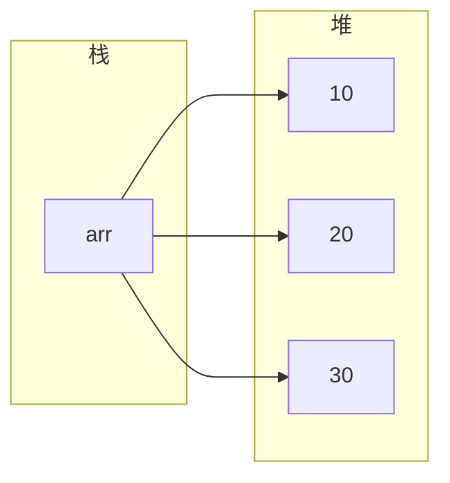
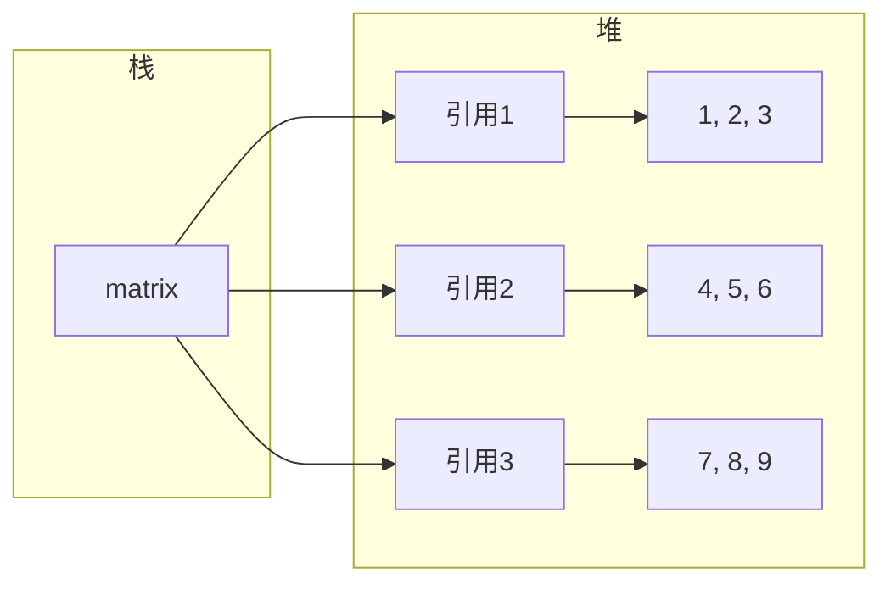

## 前置知识

- [方法详解](/java/010-MethodDetailed)：建议先完成前一篇的学习

## 学习目标

- 掌握「0. 本节阅读指引（先读这一节）」的核心机制、典型用法与常见陷阱
- 掌握「1. 一维数组 (One-Dimensional Arrays)」的核心机制、典型用法与常见陷阱
- 掌握「2. 多维数组 (Multidimensional Arrays)」的核心机制、典型用法与常见陷阱
- 掌握「3. 数组的内存布局」的核心机制、典型用法与常见陷阱
- 掌握「4. 数组的常见操作」的核心机制、典型用法与常见陷阱


## 0. 本节阅读指引（先读这一节）

本篇是「数组详解」，目标：会创建、遍历数组，理解数组与集合的区别。

零基础第一遍只读：

1. 第 1 节 一维数组、2. 多维数组、4. 数组的常见操作；
2. 第 5 节 Arrays 工具类当字典查阅。

可跳过：3. 数组的内存布局第一遍只看结论；6-9 节（集合关系、实践、最佳实践、陷阱）第二遍细读。

> 记住：数组长度固定、下标从 0 开始，越界抛 ArrayIndexOutOfBoundsException。


## 1. 一维数组 (One-Dimensional Arrays)

数组是一组相同类型数据的有序集合，大小固定，在Java中是引用类型。

### 1.1 数组的定义

```java
 // 方式1：数据类型[] 数组名
 int[] numbers;
 // 方式2：数据类型 数组名[]
 int numbers[]; // 不推荐，可读性较差
```

### 1.2 数组的初始化

#### 1.2.1 静态初始化

直接指定数组元素的值，数组长度由元素个数决定。

```java
 // 基本类型数组
 int[] arr1 = {1, 2, 3, 4, 5};
 // 引用类型数组
 String[] arr2 = {"Java", "Python", "C++"};
 // 使用 new 关键字的静态初始化
 int[] arr3 = new int[]{1, 2, 3};
```

#### 1.2.2 动态初始化

只指定数组长度，元素使用默认初始值。

| 数据类型                       | 默认初始值        |
| ------------------------------ | ----------------- |
| `byte`, `short`, `int`, `long` | 0                 |
| `float`, `double`              | 0.0               |
| `char`                         | '\u0000' (空字符) |
| `boolean`                      | false             |
| 引用类型                       | null              |

```java
 // 动态初始化
 int[] arr = new int[5]; // 元素默认值为 0
 // 动态初始化后赋值
 for (int i = 0; i < arr.length; i++) {
  arr[i] = i + 1;
 }
```

### 1.3 数组的访问与遍历

#### 1.3.1 元素访问

使用索引访问数组元素，索引从 0 开始。

```java
 int[] arr = {10, 20, 30};
 int first = arr[0]; // 获取第一个元素
 arr[1] = 25; // 修改第二个元素
```

#### 1.3.2 数组长度

使用 `length` 属性获取数组长度。

```java
 int[] arr = {1, 2, 3, 4, 5};
 int length = arr.length; // 5
```

#### 1.3.3 数组遍历

**方法1：普通 for 循环**

```java
 int[] arr = {1, 2, 3, 4, 5};
 for (int i = 0; i < arr.length; i++) {
  System.out.println(arr[i]);
 }
```

**方法2：增强型 for 循环 (for-each)**

```java
 int[] arr = {1, 2, 3, 4, 5};
 for (int num : arr) {
  System.out.println(num);
 }
```

**方法3：使用 Stream API (Java 8+)**

```java
 int[] arr = {1, 2, 3, 4, 5};
 Arrays.stream(arr).forEach(System.out::println);
```

## 2. 多维数组 (Multidimensional Arrays)

### 2.1 二维数组

二维数组是数组的数组，常用于表示矩阵、表格等数据结构。

#### 2.1.1 二维数组的初始化

**静态初始化**

```java
 int[][] matrix = {
  {1, 2, 3},
  {4, 5, 6},
  {7, 8, 9}
 }
```

**动态初始化**

```java
 // 方式1：指定行数和列数
 int[][] matrix = new int[3][3];
 // 方式2：先指定行数，后指定列数
 int[][] matrix = new int[3][];
 matrix[0] = new int[3];
 matrix[1] = new int[3];
 matrix[2] = new int[3];
```

#### 2.1.2 不规则数组 (Jagged Arrays)

二维数组的每行可以有不同的长度。

```java
 int[][] jagged = new int[3][];
 jagged[0] = new int[2]; // 第一行 2 个元素
 jagged[1] = new int[5]; // 第二行 5 个元素
 jagged[2] = new int[3]; // 第三行 3 个元素
```

#### 2.1.3 二维数组的遍历

**方法1：嵌套 for 循环**

```java
 int[][] matrix = {
  {1, 2, 3},
  {4, 5, 6},
  {7, 8, 9}
 }
 for (int i = 0; i < matrix.length; i++) {
  for (int j = 0; j < matrix[i].length; j++) {
  System.out.print(matrix[i][j] + " ");
  }
  System.out.println();
 }
```

**方法2：嵌套增强型 for 循环**

```java
 for (int[] row : matrix) {
  for (int num : row) {
  System.out.print(num + " ");
  }
  System.out.println();
 }
```

### 2.2 三维及以上数组

Java 支持三维及以上的多维数组，使用较少。

```java
 // 三维数组
 int[][][] cube = new int[2][3][4];
 // 初始化三维数组
 cube[0][0][0] = 1;
 cube[0][0][1] = 2;
 // ...
```

## 3. 数组的内存布局

### 3.1 一维数组的内存布局

- **栈 (Stack)**: 存放数组引用变量（如 `arr`）
- **堆 (Heap)**: 存放数组实体（连续的内存块，存储实际数据）



### 3.2 二维数组的内存布局

- **栈**: 存放二维数组引用变量
- **堆**: 存放数组的数组
- 第一级：存放指向每行数组的引用
- 第二级：存放每行的实际数据



## 4. 数组的常见操作

### 4.1 数组复制

**方法1：使用 `Arrays.copyOf()`**

```java
 int[] original = {1, 2, 3, 4, 5};
 int[] copy = Arrays.copyOf(original, original.length);
```

**方法2：使用 `System.arraycopy()`**

```java
 int[] original = {1, 2, 3, 4, 5};
 int[] copy = new int[original.length];
 System.arraycopy(original, 0, copy, 0, original.length);
```

**方法3：使用 `Arrays.copyOfRange()`**

```java
 int[] original = {1, 2, 3, 4, 5};
 int[] copy = Arrays.copyOfRange(original, 1, 4); // 复制索引 1-3 的元素
```

### 4.2 数组排序

**方法1：使用 `Arrays.sort()`**

```java
 int[] arr = {5, 2, 8, 1, 3};
 Arrays.sort(arr); // 升序排序
 System.out.println(Arrays.toString(arr)); // [1, 2, 3, 5, 8]
```

**方法2：使用 `Arrays.sort()` 自定义比较器**

```java
 String[] arr = {"banana", "apple", "orange"};
 Arrays.sort(arr, Comparator.reverseOrder()); // 降序排序
 System.out.println(Arrays.toString(arr)); // [orange, banana, apple]
```

### 4.3 数组查找

**方法1：线性查找**

```java
 public static int linearSearch(int[] arr, int target) {
  for (int i = 0; i < arr.length; i++) {
  if (arr[i] == target) {
  return i;
  }
  }
  return -1;
 }
```

**方法2：二分查找（数组必须已排序）**

```java
 int[] arr = {1, 2, 3, 4, 5, 6, 7, 8, 9};
 int index = Arrays.binarySearch(arr, 5); // 返回 4
```

### 4.4 数组填充

```java
 int[] arr = new int[5];
 Arrays.fill(arr, 10); // 填充所有元素为 10
 System.out.println(Arrays.toString(arr)); // [10, 10, 10, 10, 10]
 // 填充指定范围
 int[] arr2 = new int[5];
 Arrays.fill(arr2, 1, 4, 5); // 填充索引 1-3 的元素为 5
 System.out.println(Arrays.toString(arr2)); // [0, 5, 5, 5, 0]
```

### 4.5 数组比较

```java
 int[] arr1 = {1, 2, 3};
 int[] arr2 = {1, 2, 3};
 boolean equal = Arrays.equals(arr1, arr2); //
 // 多维数组比较
 int[][] matrix1 = {{1, 2}, {3, 4}};
 int[][] matrix2 = {{1, 2}, {3, 4}};
 boolean equal2 = Arrays.deepEquals(matrix1, matrix2); //
```

## 5. `Arrays` 工具类详解

### 5.1 常用方法

| 方法                                          | 描述                     |
| --------------------------------------------- | ------------------------ |
| `Arrays.toString(arr)`                        | 将数组转换为字符串       |
| `Arrays.deepToString(arr)`                    | 将多维数组转换为字符串   |
| `Arrays.sort(arr)`                            | 对数组进行升序排序       |
| `Arrays.sort(arr, comparator)`                | 使用自定义比较器排序     |
| `Arrays.binarySearch(arr, key)`               | 二分查找指定元素         |
| `Arrays.copyOf(arr, newLength)`               | 复制数组并指定新长度     |
| `Arrays.copyOfRange(arr, from, to)`           | 复制指定范围的数组       |
| `Arrays.fill(arr, value)`                     | 填充数组所有元素         |
| `Arrays.fill(arr, fromIndex, toIndex, value)` | 填充指定范围的元素       |
| `Arrays.equals(arr1, arr2)`                   | 比较两个数组是否相等     |
| `Arrays.deepEquals(arr1, arr2)`               | 比较两个多维数组是否相等 |
| `Arrays.hashCode(arr)`                        | 计算数组的哈希码         |
| `Arrays.stream(arr)`                          | 创建数组的流             |

### 5.2 示例

```java
 import java.util.Arrays;
 import java.util.Comparator;
 public class ArraysDemo {
  public static void main(String[] args) {
  // 数组转字符串
  int[] arr = {1, 2, 3, 4, 5};
  System.out.println(Arrays.toString(arr));
  // 排序
  int[] unsorted = {5, 2, 8, 1, 3};
  Arrays.sort(unsorted);
  System.out.println(Arrays.toString(unsorted));
  // 二分查找
  int index = Arrays.binarySearch(unsorted, 3);
  System.out.println("Index of 3: " + index);
  // 复制数组
  int[] copy = Arrays.copyOf(unsorted, 10);
  System.out.println(Arrays.toString(copy));
  // 填充数组
  Arrays.fill(copy, 5, 10, 99);
  System.out.println(Arrays.toString(copy));
  // 比较数组
  int[] arr1 = {1, 2, 3};
  int[] arr2 = {1, 2, 3};
  System.out.println(Arrays.equals(arr1, arr2));
  }
 }
```

## 6. 数组与集合的关系

### 6.1 数组转集合

```java
 // 基本类型数组转集合
 int[] arr = {1, 2, 3, 4, 5};
 List<Integer> list = Arrays.stream(arr)
  .boxed()
  .collect(Collectors.toList());
 // 引用类型数组转集合
 String[] arr2 = {"Java", "Python", "C++"};
 List<String> list2 = Arrays.asList(arr2);
```

### 6.2 集合转数组

```java
 List<Integer> list = Arrays.asList(1, 2, 3, 4, 5);
 // 方法1：指定数组大小
 integer[] arr = list.toArray(new Integer[list.size()]);
 // 方法2：使用 Stream API
 int[] arr2 = list.stream().mapToInt(Integer::intValue).toArray();
```

## 7. 实际应用案例

### 7.1 数组去重

```java
 public static int[] removeDuplicates(int[] arr) {
  return Arrays.stream(arr)
  .distinct()
  .toArray();
 }
 // 示例
 int[] arr = {1, 2, 2, 3, 4, 4, 5};
 int[] unique = removeDuplicates(arr);
 System.out.println(Arrays.toString(unique)); // [1, 2, 3, 4, 5]
```

### 7.2 数组最大值和最小值

```java
 public static int findMax(int[] arr) {
  return Arrays.stream(arr).max().orElse(Integer.MIN_VALUE);
 }
 public static int findMin(int[] arr) {
  return Arrays.stream(arr).min().orElse(Integer.MAX_VALUE);
 }
 // 示例
 int[] arr = {5, 2, 8, 1, 3};
 System.out.println("Max: " + findMax(arr)); // 8
 System.out.println("Min: " + findMin(arr)); // 1
```

### 7.3 数组反转

```java
 public static void reverse(int[] arr) {
  int left = 0;
  int right = arr.length - 1;
  while (left < right) {
  int temp = arr[left];
  arr[left] = arr[right];
  arr[right] = temp;
  left++;
  right--;
  }
 }
 // 示例
 int[] arr = {1, 2, 3, 4, 5};
 reverse(arr);
 System.out.println(Arrays.toString(arr)); // [5, 4, 3, 2, 1]
```

### 7.4 二维数组转置

```java
 public static int[][] transpose(int[][] matrix) {
  int rows = matrix.length;
  int cols = matrix[0].length;
  int[][] transposed = new int[cols][rows];
  for (int i = 0; i < rows; i++) {
  for (int j = 0; j < cols; j++) {
  transposed[j][i] = matrix[i][j];
  }
  }
  return transposed;
 }
 // 示例
 int[][] matrix = {{1, 2, 3}, {4, 5, 6}};
 int[][] transposed = transpose(matrix);
 for (int[] row : transposed) {
  System.out.println(Arrays.toString(row));
 }
 // 输出:
 // [1, 4]
 // [2, 5]
 // [3, 6]
```

## 8. 数组的最佳实践

### 8.1 编码规范

- **数组声明**：使用 `int[] arr` 而不是 `int arr[]`
- **初始化**：根据需要选择静态或动态初始化
- **命名**：数组变量名应使用复数形式（如 `numbers`、`names`）

### 8.2 性能考虑

- **数组大小**：根据实际需要确定数组大小，避免过大或过小
- **遍历方式**：对于大型数组，普通 for 循环可能比 for-each 循环更高效
- **排序**：对于基本类型数组，`Arrays.sort()` 使用双轴快速排序，性能较好

### 8.3 内存管理

- **及时释放**：不再使用的数组引用应设置为 `null`，以便垃圾回收
- **避免频繁创建**：对于需要重复使用的数组，考虑使用对象池

## 9. 常见陷阱

### 9.1 索引越界

- **问题**：访问超出数组范围的索引
- **解决方案**：使用前检查索引是否在有效范围内

### 9.2 空指针异常

- **问题**：访问 `null` 数组的元素
- **解决方案**：使用前检查数组是否为 `null`

### 9.3 数组大小固定

- **问题**：数组大小一旦确定就不能更改
- **解决方案**：对于需要动态调整大小的场景，使用集合类（如 `ArrayList`）

### 9.4 基本类型与包装类型

- **问题**：基本类型数组与包装类型集合之间的转换
- **解决方案**：使用 `Arrays.stream()` 和 `boxed()` 方法进行转换

### 9.5 多维数组的不规则性

- **问题**：二维数组的每行长度可能不同
- **解决方案**：遍历前检查每行的长度

---

## 数组声明

**基本写法：声明数组**
`<类型>[] <变量名>;`
```java
// 声明整型数组
int[] numbers;
```

---

**基本写法：C 风格声明**
`<类型> <变量名>[];`
```java
// C 风格声明数组
int numbers[];
```

---

## 数组创建

**基本写法：指定长度创建**
`<变量名> = new <类型>[<长度>];`
```java
// 创建长度为 5 的数组
numbers = new int[5];
```

---

**基本写法：声明并创建**
`<类型>[] <变量名> = new <类型>[<长度>];`
```java
// 声明并创建数组
int[] numbers = new int[5];
```

---

**基本写法：静态初始化**
`<类型>[] <变量名> = { <元素1>, <元素2>, ... };`
```java
// 声明并初始化数组
int[] numbers = {1, 2, 3, 4, 5};
```

---

**基本写法：new 关键字初始化**
`<类型>[] <变量名> = new <类型>[]{ <元素1>, <元素2> };`
```java
// 使用 new 关键字初始化
int[] numbers = new int[]{1, 2, 3};
```

---

## 数组访问

**基本写法：访问元素**
`<数组>[<索引>]`
```java
// 获取索引为 0 的元素
int first = numbers[0];
```

---

**基本写法：修改元素**
`<数组>[<索引>] = <值>;`
```java
// 修改索引为 0 的元素
numbers[0] = 100;
```

---

**基本写法：获取长度**
`<数组>.length`
```java
// 获取数组长度
int len = numbers.length;
```

---

## 数组遍历

**基本写法：for 循环遍历**
`for (int i = 0; i < <数组>.length; i++) { }`
```java
// 使用索引遍历数组
for (int i = 0; i < numbers.length; i++) {
    int num = numbers[i];
}
```

---

**基本写法：增强 for 循环遍历**
`for (<类型> <变量> : <数组>) { }`
```java
// 使用增强 for 循环遍历
for (int num : numbers) {
}
```

---

## 多维数组

**基本写法：二维数组声明**
`<类型>[][] <变量名> = new <类型>[<行>][<列>];`
```java
// 创建 3 行 4 列的二维数组
int[][] matrix = new int[3][4];
```

---

**基本写法：二维数组初始化**
`<类型>[][] <变量名> = { {<元素>}, {<元素>} };`
```java
// 静态初始化二维数组
int[][] matrix = {{1, 2, 3}, {4, 5, 6}, {7, 8, 9}};
```

---

**基本写法：访问二维数组元素**
`<数组>[<行>][<列>]`
```java
// 获取第二行第三列的元素
int element = matrix[1][2];
```

---

**基本写法：遍历二维数组**
`for (int i = 0; i < <数组>.length; i++) { for (int j = 0; j < <数组>[i].length; j++) { } }`
```java
// 嵌套循环遍历二维数组
for (int i = 0; i < matrix.length; i++) {
    for (int j = 0; j < matrix[i].length; j++) {
        int element = matrix[i][j];
    }
}
```

---

## 不规则数组

**基本写法：创建不规则数组**
`<类型>[][] <变量名> = new <类型>[<行>][];`
```java
// 创建不规则二维数组
int[][] jagged = new int[3][];
jagged[0] = new int[2];
jagged[1] = new int[3];
jagged[2] = new int[4];
```

---

## 数组排序

**基本写法：升序排序**
`Arrays.sort(<数组>);`
```java
// 对数组进行升序排序
int[] numbers = {5, 2, 8, 1, 9};
Arrays.sort(numbers);
```

---

**基本写法：部分排序**
`Arrays.sort(<数组>, <起始索引>, <结束索引>);`
```java
// 对数组指定范围排序
int[] numbers = {5, 2, 8, 1, 9};
Arrays.sort(numbers, 1, 4);
```

---

**基本写法：降序排序**
`Arrays.sort(<数组>, Collections.reverseOrder());`
```java
// 对 Integer 数组降序排序
Integer[] numbers = {5, 2, 8, 1, 9};
Arrays.sort(numbers, Collections.reverseOrder());
```

---

## 数组搜索

**基本写法：二分查找**
`Arrays.binarySearch(<数组>, <目标值>);`
```java
// 在已排序数组中二分查找
int[] numbers = {1, 2, 3, 4, 5};
int index = Arrays.binarySearch(numbers, 3);
```

---

## 数组复制

**基本写法：copyOf 复制**
`Arrays.copyOf(<原数组>, <新长度>);`
```java
// 复制数组并指定新长度
int[] original = {1, 2, 3};
int[] copy = Arrays.copyOf(original, 5);
```

---

**基本写法：copyOfRange 复制**
`Arrays.copyOfRange(<原数组>, <起始>, <结束>);`
```java
// 复制数组指定范围
int[] original = {1, 2, 3, 4, 5};
int[] copy = Arrays.copyOfRange(original, 1, 4);
```

---

**基本写法：System.arraycopy**
`System.arraycopy(<源数组>, <源位置>, <目标数组>, <目标位置>, <长度>);`
```java
// 系统级数组复制
int[] src = {1, 2, 3, 4, 5};
int[] dest = new int[3];
System.arraycopy(src, 1, dest, 0, 3);
```

---

## 数组转换

**基本写法：数组转字符串**
`Arrays.toString(<数组>);`
```java
// 将数组转换为字符串表示
int[] numbers = {1, 2, 3};
String str = Arrays.toString(numbers);
```

---

**基本写法：二维数组转字符串**
`Arrays.deepToString(<数组>);`
```java
// 将多维数组转换为字符串
int[][] matrix = {{1, 2}, {3, 4}};
String str = Arrays.deepToString(matrix);
```

---

**基本写法：数组转 List**
`Arrays.asList(<数组>);`
```java
// 将数组转换为固定大小的 List
String[] arr = {"a", "b", "c"};
List<String> list = Arrays.asList(arr);
```

---

**基本写法：数组转可变 List**
`new ArrayList<>(Arrays.asList(<数组>));`
```java
// 将数组转换为可修改的 ArrayList
String[] arr = {"a", "b", "c"};
List<String> list = new ArrayList<>(Arrays.asList(arr));
```

---

## 数组填充

**基本写法：填充所有元素**
`Arrays.fill(<数组>, <值>);`
```java
// 用指定值填充整个数组
int[] numbers = new int[5];
Arrays.fill(numbers, 0);
```

---

**基本写法：填充指定范围**
`Arrays.fill(<数组>, <起始>, <结束>, <值>);`
```java
// 用指定值填充数组指定范围
int[] numbers = new int[5];
Arrays.fill(numbers, 1, 3, 9);
```

---

## 数组比较

**基本写法：一维数组比较**
`Arrays.equals(<数组1>, <数组2>);`
```java
// 比较两个一维数组内容是否相同
int[] a = {1, 2, 3};
int[] b = {1, 2, 3};
boolean result = Arrays.equals(a, b);
```

---

**基本写法：多维数组比较**
`Arrays.deepEquals(<数组1>, <数组2>);`
```java
// 比较两个多维数组内容是否相同
int[][] a = {{1, 2}, {3, 4}};
int[][] b = {{1, 2}, {3, 4}};
boolean result = Arrays.deepEquals(a, b);
```
