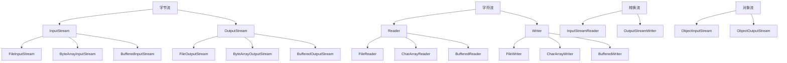

## 前置知识

- [现代文件读写救急锦囊： Files.readString / writeString](/java/027-ModernIOQuickstart)：建议先完成前一篇的学习

## 学习目标

- 掌握「0. 本节阅读指引（先读这一节）」的核心机制、典型用法与常见陷阱
- 掌握「1. I/O 流分类 (Classification)」的核心机制、典型用法与常见陷阱
- 掌握「2. 字节流 (Byte Stream)」的核心机制、典型用法与常见陷阱
- 掌握「3. 字符流 (Character Stream)」的核心机制、典型用法与常见陷阱
- 掌握「4. 转换流」的核心机制、典型用法与常见陷阱


## 0. 本节阅读指引（先读这一节）

本篇是「I/O 流与文件操作」，目标：会读写文件、理解字节流与字符流。

零基础第一遍只读：

1. 第 1 节 I/O 流分类、2. 字节流、3. 字符流、6. 文件操作（java.io.File）；
2. 每段代码亲手敲一遍。

可跳过：4. 转换流、5. 对象序列化、7. NIO 第一遍了解结论；8-10 节第二遍细读。

> 记住：字符流处理文本、字节流处理一切；用完后关闭资源（try-with-resources）。


## 1. I/O 流分类 (Classification)

### 1.1 按流向分类

- **输入流 (Input Stream)**: 从外部设备读取数据到程序
- **输出流 (Output Stream)**: 从程序写入数据到外部设备

### 1.2 按数据单位分类

- **字节流 (Byte Stream)**: 以字节为单位处理数据，可处理所有类型的文件
- 顶级类: `InputStream` (输入), `OutputStream` (输出)
- **字符流 (Character Stream)**: 以字符为单位处理数据，专门用于处理文本文件
- 顶级类: `Reader` (输入), `Writer` (输出)

### 1.3 按功能分类

- **节点流**: 直接与数据源相连，如 `FileInputStream`
- **处理流**: 对节点流进行包装，提供额外功能，如 `BufferedInputStream`

### 1.4 IO 流的层次结构



## 2. 字节流 (Byte Stream)

### 2.1 基本字节流

#### 2.1.1 FileInputStream

用于从文件读取字节数据。

```java
 // 读取文件
 try (FileInputStream fis = new FileInputStream("input.txt")) {
  int data;
  while ((data = fis.read()) != -1) {
  System.out.print((char) data);
  }
 }
  e.printStackTrace();
 }
```

#### 2.1.2 FileOutputStream

用于向文件写入字节数据。

```java
 // 写入文件
 try (FileOutputStream fos = new FileOutputStream("output.txt")) {
  String content = "Hello, FileOutputStream!";
  fos.write(content.getBytes());
 }
  e.printStackTrace();
 }
```

### 2.2 缓冲字节流

#### 2.2.1 BufferedInputStream

带缓冲区的输入流，提高读取性能。

```java
 // 使用缓冲流读取
 try (BufferedInputStream bis = new BufferedInputStream(new FileInputStream("input.txt"))) {
  byte[] buffer = new byte[1024];
  int bytesRead;
  while ((bytesRead = bis.read(buffer)) != -1) {
  System.out.print(new String(buffer, 0, bytesRead));
  }
 }
  e.printStackTrace();
 }
```

#### 2.2.2 BufferedOutputStream

带缓冲区的输出流，提高写入性能。

```java
 // 使用缓冲流写入
 try (BufferedOutputStream bos = new BufferedOutputStream(new FileOutputStream("output.txt"))) {
  String content = "Hello, BufferedOutputStream!";
  bos.write(content.getBytes());
  bos.flush(); // 刷新缓冲区
 }
  e.printStackTrace();
 }
```

## 3. 字符流 (Character Stream)

### 3.1 基本字符流

#### 3.1.1 FileReader

用于从文件读取字符数据。

```java
 // 读取文本文件
 try (FileReader fr = new FileReader("input.txt")) {
  int data;
  while ((data = fr.read()) != -1) {
  System.out.print((char) data);
  }
 }
  e.printStackTrace();
 }
```

#### 3.1.2 FileWriter

用于向文件写入字符数据。

```java
 // 写入文本文件
 try (FileWriter fw = new FileWriter("output.txt")) {
  String content = "Hello, FileWriter!";
  fw.write(content);
 }
  e.printStackTrace();
 }
```

### 3.2 缓冲字符流

#### 3.2.1 BufferedReader

带缓冲区的字符输入流，提供按行读取功能。

```java
 // 使用缓冲流按行读取
 try (BufferedReader br = new BufferedReader(new FileReader("input.txt"))) {
  String line;
  while ((line = br.readLine()) != null) {
  System.out.println(line);
  }
 }
  e.printStackTrace();
 }
```

#### 3.2.2 BufferedWriter

带缓冲区的字符输出流，提供写入换行功能。

```java
 // 使用缓冲流写入
 try (BufferedWriter bw = new BufferedWriter(new FileWriter("output.txt"))) {
  bw.write("Hello, BufferedWriter!");
  bw.newLine(); // 写入换行
  bw.write("This is a new line.");
  bw.flush(); // 刷新缓冲区
 }
  e.printStackTrace();
 }
```

## 4. 转换流

### 4.1 InputStreamReader

将字节流转换为字符流，指定字符编码。

```java
 // 使用转换流读取，指定编码
 try (InputStreamReader isr = new InputStreamReader(new FileInputStream("input.txt"), "UTF-8")) {
  int data;
  while ((data = isr.read()) != -1) {
  System.out.print((char) data);
  }
 }
  e.printStackTrace();
 }
```

### 4.2 OutputStreamWriter

将字符流转换为字节流，指定字符编码。

```java
 // 使用转换流写入，指定编码
 try (OutputStreamWriter osw = new OutputStreamWriter(new FileOutputStream("output.txt"), "UTF-8")) {
  String content = "Hello, OutputStreamWriter!";
  osw.write(content);
  osw.flush();
 }
  e.printStackTrace();
 }
```

## 5. 对象序列化 (Serialization)

### 5.1 序列化的概念

将对象的状态转换为字节序列，以便存储或传输。

### 5.2 序列化的条件

- 类必须实现 `Serializable` 接口
- 类的所有非瞬态字段必须可序列化

### 5.3 序列化示例

#### 5.3.1 可序列化的类

```java
 import java.io.Serializable;
 public class Person implements Serializable {
  private static final long serialVersionUID = 1L;
  private String name;
  private int age;
  private transient String password; // 不参与序列化
  // 构造器、getter、setter 方法
 }
```

#### 5.3.2 对象序列化

```java
 // 序列化对象到文件
 try (ObjectOutputStream oos = new ObjectOutputStream(new FileOutputStream("person.dat"))) {
  Person person = new Person("Alice", 25, "123456");
  oos.writeObject(person);
  System.out.println("对象序列化成功");
 }
  e.printStackTrace();
 }
```

#### 5.3.3 对象反序列化

```java
 // 从文件反序列化对象
 try (ObjectInputStream ois = new ObjectInputStream(new FileInputStream("person.dat"))) {
  Person person = (Person) ois.readObject();
  System.out.println("姓名: " + person.getName());
  System.out.println("年龄: " + person.getAge());
  System.out.println("密码: " + person.getPassword()); // 输出 null，因为 password 是 transient
  System.out.println("对象反序列化成功");
 }
  e.printStackTrace();
 }
```

### 5.4 序列化的注意事项

- **serialVersionUID**: 建议显式声明，确保版本兼容性
- **transient**: 标记不需要序列化的字段
- **静态字段**: 静态字段不会被序列化
- **循环引用**: 序列化会自动处理循环引用
- **安全性**: 序列化可能导致安全问题，需要注意

## 6. 文件操作 (java.io.File)

### 6.1 File 类的常用方法

#### 6.1.1 文件检查方法

- **exists()**: 检查文件或目录是否存在
- **isFile()**: 检查是否为文件
- **isDirectory()**: 检查是否为目录
- **canRead()**: 检查是否可读
- **canWrite()**: 检查是否可写
- **isHidden()**: 检查是否隐藏

#### 6.1.2 文件操作方法

- **createNewFile()**: 创建新文件
- **delete()**: 删除文件或目录
- **renameTo(File dest)**: 重命名文件或目录
- **mkdir()**: 创建目录
- **mkdirs()**: 创建多级目录
- **deleteOnExit()**: JVM 退出时删除文件

#### 6.1.3 文件信息方法

- **getName()**: 获取文件名
- **getPath()**: 获取文件路径
- **getAbsolutePath()**: 获取绝对路径
- **getCanonicalPath()**: 获取规范路径
- **length()**: 获取文件长度
- **lastModified()**: 获取最后修改时间

#### 6.1.4 目录操作方法

- **list()**: 获取目录下的文件和目录名
- **listFiles()**: 获取目录下的文件和目录对象
- **listFiles(FileFilter filter)**: 获取符合过滤条件的文件和目录

### 6.2 File 操作示例

#### 6.2.1 创建文件

```java
 File file = new File("test.txt");
 try {
  if (file.createNewFile()) {
  System.out.println("文件创建成功");
  } else {
  System.out.println("文件已存在");
  }
 }
  e.printStackTrace();
 }
```

#### 6.2.2 创建目录

```java
 // 创建单个目录
 File dir = new File("mydir");
 if (dir.mkdir()) {
  System.out.println("目录创建成功");
 }
  System.out.println("目录创建失败");
 }
 // 创建多级目录
 File multiDir = new File("dir1/dir2/dir3");
 if (multiDir.mkdirs()) {
  System.out.println("多级目录创建成功");
 }
  System.out.println("多级目录创建失败");
 }
```

#### 6.2.3 列出目录内容

```java
 File dir = new File(".");
 String[] files = dir.list();
 System.out.println("目录内容:");
 for (String file : files) {
  System.out.println(file);
 }
 // 使用 FileFilter
 File[] javaFiles = dir.listFiles((f) -> f.getName().endsWith(".java"));
 System.out.println("Java 文件:");
 for (File file : javaFiles) {
  System.out.println(file.getName());
 }
```

## 7. NIO (Non-blocking I/O)

### 7.1 NIO 的核心组件

- **Buffer**: 缓冲区，用于存储数据
- **Channel**: 通道，用于数据传输
- **Selector**: 选择器，用于监控多个通道的事件

### 7.2 Buffer

#### 7.2.1 Buffer 的类型

- **ByteBuffer**
- **CharBuffer**
- **ShortBuffer**
- **IntBuffer**
- **LongBuffer**
- **FloatBuffer**
- **DoubleBuffer**

#### 7.2.2 Buffer 的使用

```java
 // 创建缓冲区
 ByteBuffer buffer = ByteBuffer.allocate(1024);
 // 写入数据
 buffer.put("Hello, NIO!".getBytes());
 // 切换到读模式
 buffer.flip();
 // 读取数据
 byte[] data = new byte[buffer.limit()];
 buffer.get(data);
 System.out.println(new String(data));
 // 清空缓冲区
 buffer.clear();
```

### 7.3 Channel

#### 7.3.1 Channel 的类型

- **FileChannel**: 文件通道
- **SocketChannel**: 套接字通道
- **ServerSocketChannel**: 服务器套接字通道
- **DatagramChannel**: 数据报通道

#### 7.3.2 FileChannel 的使用

```java
 // 读取文件
 try (FileChannel channel = new FileInputStream("input.txt").getChannel()) {
  ByteBuffer buffer = ByteBuffer.allocate(1024);
  while (channel.read(buffer) != -1) {
  buffer.flip();
  byte[] data = new byte[buffer.limit()];
  buffer.get(data);
  System.out.print(new String(data));
  buffer.clear();
  }
 }
  e.printStackTrace();
 }
 // 写入文件
 try (FileChannel channel = new FileOutputStream("output.txt").getChannel()) {
  ByteBuffer buffer = ByteBuffer.wrap("Hello, FileChannel!".getBytes());
  channel.write(buffer);
 }
  e.printStackTrace();
 }
```

### 7.4 NIO 2.0 (Java 7+)

#### 7.4.1 Path 接口

```java
 // 创建 Path
 Path path = Paths.get("test.txt");
 // 获取路径信息
 System.out.println("文件名: " + path.getFileName());
 System.out.println("父路径: " + path.getParent());
 System.out.println("绝对路径: " + path.toAbsolutePath());
```

#### 7.4.2 Files 类

```java
 // 读取文件
 List<String> lines = Files.readAllLines(Paths.get("input.txt"), StandardCharsets.UTF_8);
 for (String line : lines) {
  System.out.println(line);
 }
 // 写入文件
 List<String> content = Arrays.asList("Hello, Files!", "This is a test.");
 Files.write(Paths.get("output.txt"), content, StandardCharsets.UTF_8);
 // 复制文件
 Files.copy(Paths.get("input.txt"), Paths.get("copy.txt"), StandardCopyOption.REPLACE_EXISTING);
 // 删除文件
 Files.deleteIfExists(Paths.get("temp.txt"));
```

## 8. 实际应用案例

### 8.1 文件复制

#### 8.1.1 使用字节流复制

```java
 public static void copyFileUsingStream(File source, File dest) throws IOException {
  try (InputStream is = new FileInputStream(source);
  OutputStream os = new FileOutputStream(dest)) {
  byte[] buffer = new byte[1024];
  int length;
  while ((length = is.read(buffer)) > 0) {
  os.write(buffer, 0, length);
  }
  }
 }
```

#### 8.1.2 使用缓冲流复制

```java
 public static void copyFileUsingBufferedStream(File source, File dest) throws IOException {
  try (BufferedInputStream bis = new BufferedInputStream(new FileInputStream(source));
  BufferedOutputStream bos = new BufferedOutputStream(new FileOutputStream(dest))) {
  byte[] buffer = new byte[1024];
  int length;
  while ((length = bis.read(buffer)) > 0) {
  bos.write(buffer, 0, length);
  }
  }
 }
```

#### 8.1.3 使用 NIO 复制

```java
 public static void copyFileUsingNIO(File source, File dest) throws IOException {
  try (FileChannel sourceChannel = new FileInputStream(source).getChannel();
  FileChannel destChannel = new FileOutputStream(dest).getChannel()) {
  destChannel.transferFrom(sourceChannel, 0, sourceChannel.size());
  }
 }
```

### 8.2 文本文件读写

#### 8.2.1 读取文本文件

```java
 public static List<String> readTextFile(String filePath) throws IOException {
  List<String> lines = new ArrayList<>();
  try (BufferedReader br = new BufferedReader(new FileReader(filePath))) {
  String line;
  while ((line = br.readLine()) != null) {
  lines.add(line);
  }
  }
  return lines;
 }
```

#### 8.2.2 写入文本文件

```java
 public static void writeTextFile(String filePath, List<String> lines) throws IOException {
  try (BufferedWriter bw = new BufferedWriter(new FileWriter(filePath))) {
  for (String line : lines) {
  bw.write(line);
  bw.newLine();
  }
  }
 }
```

### 8.3 目录遍历

```java
 public static void listFilesRecursively(File directory) {
  if (!directory.isDirectory()) {
  return;
  }
  File[] files = directory.listFiles();
  if (files != null) {
  for (File file : files) {
  if (file.isDirectory()) {
  System.out.println("目录: " + file.getAbsolutePath());
  listFilesRecursively(file);
  } else {
  System.out.println("文件: " + file.getAbsolutePath());
  }
  }
  }
 }
```

## 9. 最佳实践

### 9.1 资源管理

- **使用 try-with-resources**: 自动关闭资源，避免资源泄漏
- **显式关闭资源**: 在 try-with-resources 不可用的情况下，使用 finally 块关闭资源

### 9.2 性能优化

- **使用缓冲流**: 提高读写性能
- **合理设置缓冲区大小**: 根据实际情况调整缓冲区大小
- **使用 NIO**: 对于大文件操作，考虑使用 NIO 提高性能
- **批量操作**: 减少 I/O 操作次数

### 9.3 编码处理

- **指定字符编码**: 避免默认编码导致的问题
- **使用 UTF-8**: 推荐使用 UTF-8 编码
- **使用转换流**: 在字节流和字符流之间转换时指定编码

### 9.4 文件操作

- **检查文件存在性**: 在操作文件前检查文件是否存在
- **处理异常**: 妥善处理 I/O 异常
- **使用 Files 类**: Java 7+ 推荐使用 Files 类进行文件操作
- **路径处理**: 使用 Path 接口处理路径

### 9.5 序列化

- **显式声明 serialVersionUID**: 确保版本兼容性
- **谨慎使用 transient**: 只对不需要序列化的字段使用
- **注意序列化的安全性**: 避免序列化敏感信息

## 10. 常见陷阱

### 10.1 资源泄漏

- **忘记关闭资源**: 导致文件句柄泄漏
- **在 finally 块中关闭资源时发生异常**: 掩盖原始异常

### 10.2 编码问题

- **使用默认编码**: 可能导致跨平台问题
- **字节与字符转换错误**: 导致乱码

### 10.3 文件操作陷阱

- **路径分隔符**: 不同操作系统的路径分隔符不同
- **文件权限**: 没有足够的权限操作文件
- **文件名长度**: 超过系统限制

### 10.4 序列化陷阱

- **serialVersionUID 不匹配**: 导致反序列化失败
- **序列化循环引用**: 可能导致栈溢出
- **序列化大对象**: 可能导致内存问题

### 10.5 性能陷阱

- **频繁的小 I/O 操作**: 降低性能
- **不使用缓冲流**: 导致频繁的磁盘操作
- **大文件一次性读入内存**: 可能导致内存溢出

---

## 字节流

**基本写法：FileInputStream 创建**
`FileInputStream <变量> = new FileInputStream("<文件路径>");`
```java
// 创建字节输入流
FileInputStream fis = new FileInputStream("input.txt");
```

---

**基本写法：读取单字节**
`<fis>.read()`
```java
// 读取一个字节返回 -1 表示结束
int data = fis.read();
```

---

**基本写法：读取多字节**
`<fis>.read(byte[] <缓冲区>)`
```java
// 读取多个字节到缓冲区
byte[] buffer = new byte[1024];
int len = fis.read(buffer);
```

---

**基本写法：FileOutputStream 创建**
`FileOutputStream <变量> = new FileOutputStream("<文件路径>");`
```java
// 创建字节输出流
FileOutputStream fos = new FileOutputStream("output.txt");
```

---

**基本写法：写入字节**
`<fos>.write(<字节>)`
```java
// 写入单个字节
fos.write(65);
```

---

**基本写法：写入字节数组**
`<fos>.write(byte[] <数据>)`
```java
// 写入字节数组
fos.write(buffer);
```

---

**基本写法：关闭流**
`<流>.close();`
```java
// 关闭流释放资源
fis.close();
```

---

## 字符流

**基本写法：FileReader 创建**
`FileReader <变量> = new FileReader("<文件路径>");`
```java
// 创建字符输入流
FileReader fr = new FileReader("input.txt");
```

---

**基本写法：读取单字符**
`<fr>.read()`
```java
// 读取一个字符
int ch = fr.read();
```

---

**基本写法：读取多字符**
`<fr>.read(char[] <缓冲区>)`
```java
// 读取多个字符到缓冲区
char[] buffer = new char[1024];
int len = fr.read(buffer);
```

---

**基本写法：FileWriter 创建**
`FileWriter <变量> = new FileWriter("<文件路径>");`
```java
// 创建字符输出流
FileWriter fw = new FileWriter("output.txt");
```

---

**基本写法：写入字符串**
`<fw>.write("<字符串>")`
```java
// 写入字符串
fw.write("Hello, World!");
```

---

**基本写法：追加写入**
`FileWriter <变量> = new FileWriter("<文件路径>", true);`
```java
// 创建追加模式的 FileWriter
FileWriter fw = new FileWriter("log.txt", true);
```

---

## 缓冲流

**基本写法：BufferedReader 创建**
`BufferedReader <变量> = new BufferedReader(new FileReader("<文件>"));`
```java
// 创建带缓冲的字符输入流
BufferedReader br = new BufferedReader(new FileReader("input.txt"));
```

---

**基本写法：读取一行**
`<br>.readLine()`
```java
// 读取一行文本返回 null 表示结束
String line = br.readLine();
```

---

**基本写法：BufferedWriter 创建**
`BufferedWriter <变量> = new BufferedWriter(new FileWriter("<文件>"));`
```java
// 创建带缓冲的字符输出流
BufferedWriter bw = new BufferedWriter(new FileWriter("output.txt"));
```

---

**基本写法：写入并换行**
`<bw>.write("<字符串>"); <bw>.newLine();`
```java
// 写入字符串并换行
bw.write("Hello");
bw.newLine();
```

---

## try-with-resources

**基本写法：自动关闭资源**
`try (<资源声明>) { }`
```java
// 自动关闭实现 AutoCloseable 的资源
try (FileReader fr = new FileReader("file.txt")) {
}
```

---

**换行写法：多个资源自动关闭**
`try (<资源1>; <资源2>) { }`
```java
// 多个资源按声明逆序自动关闭
try (
    BufferedReader br = new BufferedReader(new FileReader("in.txt"));
    BufferedWriter bw = new BufferedWriter(new FileWriter("out.txt"))
) {
}
```

---

## File 类

**基本写法：创建 File 对象**
`File <变量> = new File("<路径>");`
```java
// 创建 File 对象
File file = new File("test.txt");
```

---

**基本写法：判断文件存在**
`<file>.exists()`
```java
// 判断文件或目录是否存在
boolean exists = file.exists();
```

---

**基本写法：判断是文件**
`<file>.isFile()`
```java
// 判断是否为文件
boolean isFile = file.isFile();
```

---

**基本写法：判断是目录**
`<file>.isDirectory()`
```java
// 判断是否为目录
boolean isDir = file.isDirectory();
```

---

**基本写法：创建文件**
`<file>.createNewFile()`
```java
// 创建新文件
boolean created = file.createNewFile();
```

---

**基本写法：创建目录**
`<file>.mkdir()`
```java
// 创建单层目录
boolean created = file.mkdir();
```

---

**基本写法：创建多层目录**
`<file>.mkdirs()`
```java
// 创建多层目录
boolean created = file.mkdirs();
```

---

**基本写法：删除文件**
`<file>.delete()`
```java
// 删除文件或目录
boolean deleted = file.delete();
```

---

**基本写法：获取文件名**
`<file>.getName()`
```java
// 获取文件名
String name = file.getName();
```

---

**基本写法：获取路径**
`<file>.getPath()`
```java
// 获取路径字符串
String path = file.getPath();
```

---

**基本写法：获取绝对路径**
`<file>.getAbsolutePath()`
```java
// 获取绝对路径
String absPath = file.getAbsolutePath();
```

---

**基本写法：获取文件大小**
`<file>.length()`
```java
// 获取文件字节数
long size = file.length();
```

---

**基本写法：列出目录文件**
`<file>.listFiles()`
```java
// 列出目录下的文件数组
File[] files = dir.listFiles();
```

---

## NIO Path

**基本写法：创建 Path**
`Path <变量> = Paths.get("<路径>");`
```java
// 创建 Path 对象
Path path = Paths.get("test.txt");
```

---

**基本写法：判断文件存在**
`Files.exists(<path>)`
```java
// 判断路径是否存在
boolean exists = Files.exists(path);
```

---

**基本写法：创建文件**
`Files.createFile(<path>)`
```java
// 创建新文件
Files.createFile(path);
```

---

**基本写法：创建目录**
`Files.createDirectory(<path>)`
```java
// 创建目录
Files.createDirectory(path);
```

---

**基本写法：删除文件**
`Files.delete(<path>)`
```java
// 删除文件不存在则抛异常
Files.delete(path);
```

---

**基本写法：复制文件**
`Files.copy(<源路径>, <目标路径>)`
```java
// 复制文件
Files.copy(source, target);
```

---

**基本写法：移动文件**
`Files.move(<源路径>, <目标路径>)`
```java
// 移动或重命名文件
Files.move(source, target);
```

---

## NIO 文件读写

**基本写法：读取所有字节**
`Files.readAllBytes(<path>)`
```java
// 读取文件所有字节
byte[] data = Files.readAllBytes(path);
```

---

**基本写法：读取所有行**
`Files.readAllLines(<path>)`
```java
// 读取文件所有行
List<String> lines = Files.readAllLines(path);
```

---

**基本写法：写入字节**
`Files.write(<path>, <字节数组>)`
```java
// 写入字节数组到文件
Files.write(path, data);
```

---

**基本写法：写入字符串**
`Files.writeString(<path>, "<字符串>")`
```java
// Java 11+ 写入字符串到文件
Files.writeString(path, "Hello");
```

---

**基本写法：读取字符串**
`Files.readString(<path>)`
```java
// Java 11+ 读取文件为字符串
String content = Files.readString(path);
```

---

## 对象序列化

**基本写法：实现 Serializable**
`class <类名> implements Serializable { }`
```java
// 类实现序列化接口
public class User implements Serializable {
}
```

---

**基本写法：序列化对象**
`new ObjectOutputStream(new FileOutputStream("<文件>")).writeObject(<对象>)`
```java
// 将对象写入文件
try (ObjectOutputStream oos = new ObjectOutputStream(new FileOutputStream("user.dat"))) {
    oos.writeObject(user);
}
```

---

**基本写法：反序列化对象**
`new ObjectInputStream(new FileInputStream("<文件>")).readObject()`
```java
// 从文件读取对象
try (ObjectInputStream ois = new ObjectInputStream(new FileInputStream("user.dat"))) {
    User user = (User) ois.readObject();
}
```

---

**基本写法：transient 关键字**
`transient <类型> <字段名>;`
```java
// 标记字段不参与序列化
private transient String password;
```

---

**基本写法：serialVersionUID**
`private static final long serialVersionUID = <值>L;`
```java
// 定义序列化版本号
private static final long serialVersionUID = 1L;
```
