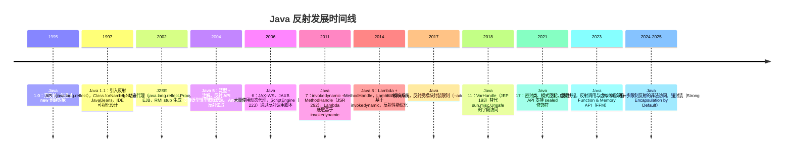

## 前置知识

- [Java 反射](/java/042-JavaReflection)：建议先完成前一篇的学习

## 学习目标

- 掌握「0. 本节阅读指引（先读这一节）」的核心机制、典型用法与常见陷阱
- 掌握「1. 历史动机与发展脉络」的核心机制、典型用法与常见陷阱
- 掌握「2. 形式化定义与规范基础」的核心机制、典型用法与常见陷阱
- 掌握「3. 理论推导与原理解析」的核心机制、典型用法与常见陷阱
- 掌握「4. 反射核心 API 详解」的核心机制、典型用法与常见陷阱


## 0. 本节阅读指引（先读这一节）

本篇是「反射与动态代理」进阶文档。

第一遍只读：4. 反射核心 API 详解、5. JDK 动态代理、6. CGLib 动态代理与附录 A/B 速查表。

可跳过：1-3 节（历史、形式化、理论推导）与 7-11 节（MethodHandle、对比、陷阱、工程、案例）第二遍细读。

前置：039 Java 反射。


## 1. 历史动机与发展脉络

### 1.1 反射机制的演进时间线



### 1.2 动态代理的三种范式

| 范式 | 代表 | 原理 | 引入版本 |
| ---- | ---- | ---- | -------- |
| **JDK Proxy** | `java.lang.reflect.Proxy` | 运行时生成实现接口的类 | Java 1.3 |
| **字节码生成** | CGLib、ByteBuddy、ASM | 运行时生成子类字节码 | 第三方 |
| **MethodHandle** | `java.lang.invoke` | 直接方法句柄，编译期优化 | Java 7 |

### 1.3 反射性能的演进

JVM 对反射的优化经历了三个阶段：

1. **Java 1.1—1.4**：纯反射，每次调用查找方法表，性能慢（比直接调用慢 10—50 倍）
2. **Java 5—7**：引入反射代理（Reflection Proxy），生成字节码缓存，性能提升 2—5 倍
3. **Java 8+**：方法内联（intrinsic），热点反射调用被 JIT 内联，性能接近直接调用（1.5—3 倍差距）

```java
// Java 8+ JIT 内联后的反射调用
Method m = String.class.getMethod("length");
// 热点调用后，JIT 将 invoke 优化为直接调用 length()
```

---

## 2. 形式化定义与规范基础

### 2.1 JLS 对反射的定义

JLS §13.1 规定：每个被加载的类都有一个 `Class` 对象，它是反射的入口。JLS §4.12.1 定义了类型擦除后，反射通过 `Type` 接口家族（`ParameterizedType`、`TypeVariable`、`GenericArrayType`）获取泛型信息。

### 2.2 Class 文件结构（JVMS §4）

反射的能力来源于 Class 文件的结构化元数据。Class 文件格式：

```
ClassFile {
    u4             magic;                 // 0xCAFEBABE
    u2             minor_version;
    u2             major_version;
    u2             constant_pool_count;
    cp_info        constant_pool[];       // 常量池
    u2             access_flags;          // 访问标志
    u2             this_class;
    u2             super_class;
    u2             interfaces_count;
    u2             interfaces[];
    u2             fields_count;
    field_info     fields[];              // 字段表
    u2             methods_count;
    method_info    methods[];             // 方法表
    u2             attributes_count;
    attribute_info attributes[];          // 属性表
}
```

### 2.3 Class 对象的形式化模型

设 $C$ 为一个已加载的类，则其 `Class` 对象 $\text{Class}(C)$ 包含：

$$
\text{Class}(C) = (F_C, M_C, I_C, S_C, A_C, P_C)
$$

其中：
- $F_C$：字段集合，$F_C = \{f_1, f_2, \ldots, f_n\}$，每个 $f_i = (\text{name}, \text{type}, \text{modifiers})$
- $M_C$：方法集合，$M_C = \{m_1, m_2, \ldots, m_k\}$
- $I_C$：接口集合
- $S_C$：父类（单继承，至多一个）
- $A_C$：注解集合
- $P_C$：包路径与模块信息

### 2.4 方法调用的形式化语义

反射方法调用 `Method.invoke(obj, args)` 的语义等价于：

$$
\text{invoke}(m, o, \text{args}) \equiv \text{dispatch}(o, m, \text{args})
$$

其中 `dispatch` 遵循 Java 的方法分派规则：

1. 若 $m$ 为静态方法，则 $\text{dispatch}(o, m, \text{args}) = m(\text{args})$，$o$ 被忽略
2. 若 $m$ 为实例方法，则 $\text{dispatch}(o, m, \text{args}) = o.m(\text{args})$，按 $o$ 的运行时类型分派（虚方法分派）
3. 若 $m$ 为 private 方法，则不进行虚分派，直接调用声明类的方法

### 2.5 动态代理的规范定义

JLS（Java 语言规范）不规定动态代理，但 `java.lang.reflect.Proxy` 的行为在 JDK 文档中定义：

> `Proxy` 类提供创建"在运行时实现一组接口"的对象的静态方法。代理实例的每个方法调用都会被转发到关联的 `InvocationHandler.invoke` 方法。

形式化地，设接口集合 $\mathcal{I} = \{I_1, I_2, \ldots, I_n\}$，`Proxy.newProxyInstance` 生成类 $P$ 满足：

$$
\forall I_i \in \mathcal{I}: P \text{ implements } I_i
$$

且对 $P$ 的实例 $p$ 的每个方法调用 $p.m(\text{args})$：

$$
p.m(\text{args}) \to h.\text{invoke}(p, m, \text{args})
$$

其中 $h$ 是构造时传入的 `InvocationHandler`。

---

## 3. 理论推导与原理解析

### 3.1 Class 对象的创建时机

JVM 在以下情况创建 `Class` 对象：

1. **类加载时**：首次使用类时（new、static 字段访问、static 方法调用）
2. **Class.forName**：显式加载
3. **ClassLoader.loadClass**：通过类加载器
4. **反射查找**：`Type.getClass()` 等

**延迟加载（Lazy Loading）**：JVM 规范允许实现自由选择加载时机，HotSpot 采用按需加载。

```java
// 类初始化的触发条件（JLS §12.4.1）
class Example {
    static {
        System.out.println("Initialized");
    }
}

// 以下情况不触发初始化：
Class<?> c = Example.class;           // 仅获取 Class 对象
Class<?> c = Class.forName("Example", false, loader);  // initialize=false

// 以下情况触发初始化：
new Example();                         // new
Example.staticField;                   // static 字段访问
Example.staticMethod();                // static 方法调用
Class.forName("Example");              // 默认 initialize=true
```

### 3.2 方法分派的字节码

Java 方法调用有 5 个字节码指令：

| 指令 | 语义 | 对应反射 |
| ---- | ---- | -------- |
| `invokevirtual` | 虚方法分派（实例方法） | `Method.invoke`（非 final、非 private） |
| `invokeinterface` | 接口方法分派 | `Method.invoke`（接口方法） |
| `invokespecial` | 构造器、private、super 调用 | `Constructor.newInstance`、private 方法 |
| `invokestatic` | 静态方法 | `Method.invoke`（静态方法） |
| `invokedynamic` | 动态调用（Lambda、MethodHandle） | `MethodHandle.invokeExact` |

**示例**：

```java
Object obj = "hello";
Method m = String.class.getMethod("length");
int len = (Integer) m.invoke(obj);
```

编译后字节码（简化）：

```
invokevirtual Method.invoke(Object, Object[]):Object
checkcast Integer
invokevirtual Integer.intValue():int
```

`Method.invoke` 内部根据方法修饰符选择对应的字节码指令。

### 3.3 动态代理的字节码生成

JDK Proxy 在运行时生成类 `com.sun.proxy.$ProxyN`，其结构：

```java
// 生成的代理类（简化）
public final class $Proxy0 extends Proxy implements UserService {
    private static final Method m3;  // getName 方法

    static {
        m3 = Class.forName("UserService").getMethod("getName", Integer.TYPE);
    }

    public $Proxy0(InvocationHandler h) {
        super(h);
    }

    public final String getName(int id) {
        try {
            // 将调用转发给 InvocationHandler
            return (String) super.h.invoke(this, m3, new Object[]{id});
        } catch (Throwable t) {
            throw new UndeclaredThrowableException(t);
        }
    }
}
```

**字节码生成过程**：

1. `Proxy.newProxyInstance` 调用 `ProxyGenerator.generateProxyClass`
2. 生成 byte[]（Class 文件二进制）
3. 调用 `ClassLoader.defineClass` 加载到 JVM
4. 通过反射调用构造器创建实例

### 3.4 MethodHandle 与 invokedynamic

#### 3.4.1 MethodHandle 基础

MethodHandle 是 Java 7 引入的"类型安全的函数指针"：

```java
import java.lang.invoke.MethodHandle;
import java.lang.invoke.MethodHandles;
import java.lang.invoke.MethodType;

MethodHandles.Lookup lookup = MethodHandles.lookup();
MethodType mt = MethodType.methodType(String.class, int.class);
MethodHandle mh = lookup.findVirtual(String.class, "substring", mt);

String result = (String) mh.invoke("hello world", 6);  // "world"
```

#### 3.4.2 invokedynamic 原理

`invokedynamic` 是 Java 7 引入的字节码指令，为动态语言设计。其工作流程：

1. **首次执行**：调用 `bootstrap method`（引导方法），返回 `CallSite`
2. `CallSite` 持有一个 `MethodHandle` 作为目标
3. **后续执行**：直接调用 `CallSite` 的 `MethodHandle`
4. `CallSite` 可以动态切换目标（实现动态分派）

**Lambda 表达式的底层**：

```java
// Java 代码
Function<String, Integer> f = String::length;

// 编译后字节码（简化）
invokedynamic apply(Ljava/lang/String;)Ljava/lang/Integer; \
    // bootstrap = LambdaMetafactory.metafactory
    // 方法引用 = String.length()
```

`LambdaMetafactory.metafactory` 在首次调用时生成一个实现 `Function` 的类，后续调用直接调用该类的方法。

#### 3.4.3 性能对比

| 调用方式 | 首次开销 | 稳态性能 | 备注 |
| -------- | -------- | -------- | ---- |
| 直接调用 | 0 | 1x（基准） | 编译期绑定 |
| 反射 invoke | 低 | 1.5—3x | JIT 内联后可优化 |
| MethodHandle | 中 | 1.2—1.5x | `invokeExact` 性能最优 |
| invokedynamic | 高 | 1.1—1.3x | JIT 完全优化 |

### 3.5 泛型与反射

Java 泛型采用类型擦除（Type Erasure），但反射可通过 `Type` 接口获取擦除前的类型信息：

```java
public class GenericExample<T extends Number> {
    private List<String> list;
    private Map<String, Integer> map;
    private T value;
}

// 获取泛型字段类型
Field listField = GenericExample.class.getDeclaredField("list");
Type genericType = listField.getGenericType();  // ParameterizedType
ParameterizedType pt = (ParameterizedType) genericType;
Type[] args = pt.getActualTypeArguments();  // [String.class]
```

**类型擦除的形式化**：

设泛型类 $G<T>$，擦除规则：

$$
\text{Erase}(G<T>) = G_{\text{raw}}
$$

其中 $G_{\text{raw}}$ 是将所有 $T$ 替换为 $T$ 的上界（默认 `Object`）后的原始类型。但签名信息（Signature attribute）保留在 Class 文件中，供反射读取。

---

## 4. 反射核心 API 详解

### 4.1 获取 Class 对象的四种方式

```java
// 方式 1：类字面量（编译期检查，推荐）
Class<String> c1 = String.class;

// 方式 2：实例的 getClass()
String s = "hello";
Class<?> c2 = s.getClass();

// 方式 3：Class.forName（运行时加载，可能抛 ClassNotFoundException）
Class<?> c3 = Class.forName("java.lang.String");

// 方式 4：ClassLoader.loadClass（不初始化）
Class<?> c4 = ClassLoader.getSystemClassLoader().loadClass("java.lang.String");
```

| 方式 | 初始化 | 编译检查 | 异常 | 适用场景 |
| ---- | ------ | -------- | ---- | -------- |
| 类字面量 | 否 | 是 | 无 | 已知类，推荐 |
| getClass() | 已初始化 | 是 | 无 | 运行时对象 |
| Class.forName | 是 | 否 | ClassNotFoundException | 动态加载 |
| loadClass | 否 | 否 | ClassNotFoundException | 自定义加载时机 |

### 4.2 创建实例

```java
Class<?> clazz = User.class;

// 方式 1：无参构造（已废弃，Java 9+）
User u1 = (User) clazz.newInstance();

// 方式 2：getDeclaredConstructor（推荐，Java 9+）
User u2 = clazz.getDeclaredConstructor().newInstance();

// 方式 3：有参构造
Constructor<?> ctor = clazz.getDeclaredConstructor(String.class, int.class);
User u3 = (User) ctor.newInstance("Alice", 30);

// 私有构造器（破坏单例）
Constructor<?> privateCtor = clazz.getDeclaredConstructor();
privateCtor.setAccessible(true);  // 突破 private 限制
User u4 = (User) privateCtor.newInstance();
```

### 4.3 字段访问

```java
class User {
    private String name;
    public int age;
    private static final String CONSTANT = "FIXED";
}

User user = new User();
Field nameField = User.class.getDeclaredField("name");
nameField.setAccessible(true);
nameField.set(user, "Bob");
String name = (String) nameField.get(user);

// 静态字段
Field constField = User.class.getDeclaredField("CONSTANT");
String value = (String) constField.get(null);  // 静态字段传 null
```

### 4.4 方法调用

```java
Method method = String.class.getMethod("substring", int.class, int.class);
String result = (String) method.invoke("hello world", 0, 5);  // "hello"

// 静态方法
Method valueOf = Integer.class.getMethod("valueOf", String.class);
Integer num = (Integer) valueOf.invoke(null, "123");

// 可变参数
Method printf = System.class.getMethod("out").getClass().getMethod("printf", String.class, Object[].class);
printf.invoke(System.out, "%s %d%n", new Object[]{new Object[]{"Hello", 42}});

// private 方法
Method privateMethod = SomeClass.class.getDeclaredMethod("secret");
privateMethod.setAccessible(true);
privateMethod.invoke(instance);
```

### 4.5 注解读取

```java
@Retention(RetentionPolicy.RUNTIME)
@Target({ElementType.TYPE, ElementType.METHOD})
@interface MyAnno {
    String value();
    int priority() default 0;
}

@MyAnno("TestClass", priority = 1)
class Annotated {
    @MyAnno("process")
    public void process() {}
}

// 类注解
MyAnno classAnno = Annotated.class.getAnnotation(MyAnno.class);
System.out.println(classAnno.value());  // "TestClass"

// 方法注解
Method m = Annotated.class.getMethod("process");
MyAnno methodAnno = m.getAnnotation(MyAnno.class);
System.out.println(methodAnno.value());  // "process"

// 所有注解
Annotation[] annos = Annotated.class.getAnnotations();
```

### 4.6 数组操作

```java
// 创建数组
int[] arr = (int[]) Array.newInstance(int.class, 10);
Array.set(arr, 0, 42);
int val = (int) Array.get(arr, 0);

// 多维数组
String[][] matrix = (String[][]) Array.newInstance(String.class, 3, 4);
```

### 4.7 泛型类型信息

```java
class Box<T> {
    T value;
}

class StringBox extends Box<String> {}

// 获取父类泛型参数
Type superclass = StringBox.class.getGenericSuperclass();
if (superclass instanceof ParameterizedType) {
    ParameterizedType pt = (ParameterizedType) superclass;
    Type[] args = pt.getActualTypeArguments();
    System.out.println(args[0]);  // class java.lang.String
}

// 方法返回类型泛型
Method m = ArrayList.class.getMethod("subList", int.class, int.class);
Type returnType = m.getGenericReturnType();  // List<E>
```

---

## 5. JDK 动态代理

### 5.1 基础示例

```java
import java.lang.reflect.InvocationHandler;
import java.lang.reflect.Method;
import java.lang.reflect.Proxy;

// 接口
interface UserService {
    String getName(int id);
    void save(String name);
}

// 实现类
class UserServiceImpl implements UserService {
    @Override
    public String getName(int id) {
        return "User-" + id;
    }

    @Override
    public void save(String name) {
        System.out.println("Saved: " + name);
    }
}

// 调用处理器
class LoggingHandler implements InvocationHandler {
    private final Object target;

    public LoggingHandler(Object target) {
        this.target = target;
    }

    @Override
    public Object invoke(Object proxy, Method method, Object[] args) throws Throwable {
        System.out.println("[Before] " + method.getName() + "(" + Arrays.toString(args) + ")");
        long start = System.nanoTime();
        Object result = method.invoke(target, args);
        long elapsed = System.nanoTime() - start;
        System.out.println("[After] " + method.getName() + " took " + elapsed + "ns, returned " + result);
        return result;
    }
}

// 使用
public class ProxyDemo {
    public static void main(String[] args) {
        UserService target = new UserServiceImpl();
        UserService proxy = (UserService) Proxy.newProxyInstance(
            UserService.class.getClassLoader(),
            new Class[]{UserService.class},
            new LoggingHandler(target)
        );

        proxy.getName(1);
        proxy.save("Alice");
    }
}
```

### 5.2 代理类的生成原理

`Proxy.newProxyInstance` 的内部流程：

1. **接口校验**：检查所有接口是否可被 ClassLoader 加载
2. **缓存查找**：从 `Proxy` 的缓存中查找已生成的代理类
3. **字节码生成**：缓存未命中时调用 `ProxyGenerator.generateProxyClass`
4. **类加载**：通过 `ClassLoader.defineClass` 加载生成的字节码
5. **实例化**：通过反射调用构造器，传入 `InvocationHandler`

**生成的代理类结构**：

```java
public final class $Proxy0 extends Proxy implements UserService {
    // 每个方法对应一个 Method 静态字段
    private static final Method m_getName;
    private static final Method m_save;
    private static final Method m_equals;
    private static final Method m_hashCode;
    private static final Method m_toString;

    static {
        try {
            m_getName = Class.forName("UserService").getMethod("getName", Integer.TYPE);
            m_save = Class.forName("UserService").getMethod("save", String.class);
            // ... 其他方法
        } catch (Exception e) {
            throw new NoSuchMethodError(e.getMessage());
        }
    }

    public $Proxy0(InvocationHandler h) {
        super(h);
    }

    public final String getName(int id) {
        try {
            return (String) super.h.invoke(this, m_getName, new Object[]{id});
        } catch (Throwable t) {
            throw new UndeclaredThrowableException(t);
        }
    }

    public final void save(String name) {
        try {
            super.h.invoke(this, m_save, new Object[]{name});
        } catch (Throwable t) {
            throw new UndeclaredThrowableException(t);
        }
    }

    // equals, hashCode, toString 也被代理
}
```

### 5.3 限制：只能代理接口

JDK Proxy 的根本限制：**只能代理接口，不能代理类**。

原因：Java 单继承，`Proxy` 已占据父类位置，代理类只能 `extends Proxy implements Interface[]`。

**解决方案**：使用 CGLib 等字节码生成库，通过生成子类代理类。

### 5.4 查看生成的代理类

通过设置系统属性，可将代理类字节码保存到磁盘：

```java
// JDK 8
System.setProperty("sun.misc.ProxyGenerator.saveGeneratedFiles", "true");

// JDK 9+
System.setProperty("jdk.proxy.ProxyGenerator.saveGeneratedFiles", "true");
```

生成的类位于 `com/sun/proxy/$Proxy0.class`，可用 `javap -v` 查看。

---

## 6. CGLib 动态代理

### 6.1 CGLib 简介

CGLib（Code Generation Library）是一个强大的字节码生成库，基于 ASM。Spring AOP 默认使用 CGLib 代理非接口类。

### 6.2 Maven 依赖

```xml
<dependency>
    <groupId>cglib</groupId>
    <artifactId>cglib</artifactId>
    <version>3.3.0</version>
</dependency>
```

### 6.3 基础示例

```java
import net.sf.cglib.proxy.Enhancer;
import net.sf.cglib.proxy.MethodInterceptor;
import net.sf.cglib.proxy.MethodProxy;
import java.lang.reflect.Method;

class UserServiceImpl {
    public String getName(int id) {
        return "User-" + id;
    }

    public void save(String name) {
        System.out.println("Saved: " + name);
    }
}

class LoggingInterceptor implements MethodInterceptor {
    @Override
    public Object intercept(Object obj, Method method, Object[] args, MethodProxy proxy) throws Throwable {
        System.out.println("[Before] " + method.getName());
        Object result = proxy.invokeSuper(obj, args);
        System.out.println("[After] " + method.getName());
        return result;
    }
}

public class CglibDemo {
    public static void main(String[] args) {
        Enhancer enhancer = new Enhancer();
        enhancer.setSuperclass(UserServiceImpl.class);
        enhancer.setCallback(new LoggingInterceptor());

        UserServiceImpl proxy = (UserServiceImpl) enhancer.create();
        proxy.getName(1);
        proxy.save("Alice");
    }
}
```

### 6.4 CGLib 生成原理

CGLib 通过 ASM 生成目标类的**子类**：

```java
// 生成的代理类（简化）
public class UserServiceImpl$$EnhancerByCGLIB$$12345678 extends UserServiceImpl {
    private MethodInterceptor interceptor;

    @Override
    public String getName(int id) {
        MethodProxy proxy = MethodProxy.create(
            UserServiceImpl.class,    // 被代理类
            this.getClass(),           // 代理类
            "(I)Ljava/lang/String;",  // 方法签名
            "getName",                 // 被代理方法
            "getName$$Super"           // 生成的 super 调用方法
        );
        return (String) interceptor.intercept(this, getName_Method, new Object[]{id}, proxy);
    }

    // 生成一个直接调用 super 的方法，避免反射
    public final String getName$$Super(int id) {
        return super.getName(id);
    }
}
```

**关键优化**：CGLib 生成一个 `getName$$Super` 方法，通过字节码直接调用 `super.getName()`，避免反射开销。

### 6.5 CallbackFilter：选择性代理

```java
Enhancer enhancer = new Enhancer();
enhancer.setSuperclass(UserServiceImpl.class);
enhancer.setCallbacks(new Callback[]{
    new LoggingInterceptor(),    // callback 0
    NoOp.INSTANCE                // callback 1，不拦截
});
enhancer.setCallbackFilter(method -> {
    // getName 用 callback 0，save 用 callback 1
    if (method.getName().equals("getName")) return 0;
    return 1;
});
```

### 6.6 限制

- **final 类不能代理**：无法继承
- **final 方法不能代理**：无法 override
- **private 方法不能代理**：子类不可见
- **构造器不能代理**：无法继承构造器

---

## 7. MethodHandle 与 invokedynamic

### 7.1 MethodHandle 基础

```java
import java.lang.invoke.MethodHandle;
import java.lang.invoke.MethodHandles;
import java.lang.invoke.MethodType;

public class MHDemo {
    public String greet(String name) {
        return "Hello, " + name;
    }

    public static void main(String[] args) throws Throwable {
        MethodHandles.Lookup lookup = MethodHandles.lookup();

        // 查找虚方法
        MethodType mt = MethodType.methodType(String.class, String.class);
        MethodHandle mh = lookup.findVirtual(MHDemo.class, "greet", mt);

        // 调用
        MHDemo obj = new MHDemo();
        String result = (String) mh.invoke(obj, "World");
        System.out.println(result);  // "Hello, World"

        // invokeExact：类型严格匹配，性能最优
        String result2 = (String) mh.invokeExact(obj, "World");
    }
}
```

### 7.2 MethodHandle 的优势

1. **类型安全**：编译期检查签名
2. **性能优**：JIT 可内联 `invokeExact`
3. **可组合**：支持 `filterArguments`、`collectArguments` 等变换

### 7.3 MethodHandle 变换

```java
MethodHandle mh = lookup.findVirtual(String.class, "length", MethodType.methodType(int.class));

// 绑定第一个参数（this）
MethodHandle bound = mh.bindTo("hello");
int len = (int) bound.invoke();  // 5

// 过滤参数
MethodHandle toUpper = lookup.findVirtual(String.class, "toUpperCase", MethodType.methodType(String.class));
MethodHandle filtered = MethodHandles.filterArguments(mh, 0, toUpper);
int len2 = (int) filtered.invoke("hello");  // 先 toUpperCase 再 length，结果是 5

// 收集参数为数组
MethodHandle collector = mh.asCollector(int[].class, 0);
```

### 7.4 invokedynamic 实战

```java
import java.lang.invoke.*;
import java.util.function.Function;

public class IndyDemo {
    // 引导方法
    public static CallSite bootstrap(MethodHandles.Lookup lookup, String name, MethodType type) {
        MethodHandle mh = lookup.findVirtual(String.class, "length", MethodType.methodType(int.class));
        LambdaMetafactory.metafactory(
            lookup, "apply", MethodType.methodType(Function.class),
            MethodType.methodType(Object.class, Object.class), mh,
            MethodType.methodType(int.class, String.class)
        );
        // 简化示例，实际返回 CallSite
        return null;
    }

    public static void main(String[] args) throws Throwable {
        // Lambda 表达式底层就是 invokedynamic
        Function<String, Integer> f = String::length;
        System.out.println(f.apply("hello"));  // 5
    }
}
```

### 7.5 性能基准测试（JMH）

```java
@State(Scope.Benchmark)
@BenchmarkMode(Mode.Throughput)
public class ReflectionBenchmark {

    private String str = "hello";
    private Method method;
    private MethodHandle methodHandle;

    @Setup
    public void setup() throws Throwable {
        method = String.class.getMethod("length");
        MethodHandles.Lookup lookup = MethodHandles.lookup();
        methodHandle = lookup.findVirtual(String.class, "length",
            MethodType.methodType(int.class));
    }

    @Benchmark
    public int directCall() {
        return str.length();
    }

    @Benchmark
    public int reflection() throws Exception {
        return (int) method.invoke(str);
    }

    @Benchmark
    public int methodHandle() throws Throwable {
        return (int) methodHandle.invoke(str);
    }

    @Benchmark
    public int methodHandleExact() throws Throwable {
        return methodHandle.invokeExact(str);
    }
}
```

**典型结果**（JDK 17，JMH）：

| 方式 | 吞吐 (ops/ms) | 相对性能 |
| ---- | -------------- | -------- |
| 直接调用 | 1000 | 1.0x |
| MethodHandle.invokeExact | 950 | 1.05x |
| MethodHandle.invoke | 800 | 1.25x |
| Method.invoke | 400 | 2.5x |

---

## 8. 对比分析

### 8.1 JDK Proxy vs CGLib vs MethodHandle

| 维度 | JDK Proxy | CGLib | MethodHandle |
| ---- | --------- | ----- | ------------ |
| 代理目标 | 接口 | 类（子类） | 任意方法 |
| 性能 | 中（反射） | 高（字节码） | 极高（编译期） |
| 依赖 | JDK 内置 | 第三方（ASM） | JDK 内置 |
| final 方法 | 不适用 | 无法代理 | 可调用 |
| private 方法 | 不适用 | 无法代理 | 可调用（setAccessible） |
| 生成时机 | 运行时 | 运行时 | 运行时查找，编译期优化 |
| 字节码开销 | 中 | 高 | 低 |
| Spring AOP | 接口优先 | 类回退 | N/A |
| 典型场景 | AOP、RPC | AOP、ORM | Lambda、动态语言 |

### 8.2 与其他语言对比

| 语言 | 反射机制 | 动态代理 | 性能 |
| ---- | -------- | -------- | ---- |
| Java | java.lang.reflect | Proxy/CGLib | 中（JIT 优化后高） |
| Kotlin | 基于 Java 反射 + KClass | 同 Java | 同 Java |
| Scala | 基于 Java + TypeTag | 同 Java | 同 Java |
| C# | System.Reflection | RealProxy/DynamicMethod | 中（CLR 优化） |
| Go | reflect 包 | 无标准动态代理 | 低（reflect 慢） |
| Python | __dict__、getattr | 鸭子类型 + 装饰器 | 低（动态语言） |
| Rust | 无运行时反射 | 过程宏（编译期） | 极高（零开销） |

### 8.3 字节码生成库对比

| 库 | 抽象级别 | 性能 | 易用性 | 典型用户 |
| -- | -------- | ---- | ------ | -------- |
| ASM | 低（直接字节码） | 极高 | 低 | CGLib、ByteBuddy 底层 |
| CGLib | 中（高级 API） | 高 | 中 | Spring（早期） |
| ByteBuddy | 高（DSL） | 高 | 高 | Spring（新版）、Mockito |
| Javassist | 中（源码字符串） | 中 | 中 | Hibernate、JBoss |

---

## 9. 常见陷阱与最佳实践

### 9.1 陷阱：反射访问性能慢

**反例**：

```java
// 每次调用都查找方法
for (int i = 0; i < 1_000_000; i++) {
    Method m = String.class.getMethod("length");
    m.invoke(s);
}
```

**最佳实践**：缓存 Method 对象

```java
private static final Method STRING_LENGTH;
static {
    try {
        STRING_LENGTH = String.class.getMethod("length");
    } catch (NoSuchMethodException e) {
        throw new RuntimeException(e);
    }
}

for (int i = 0; i < 1_000_000; i++) {
    STRING_LENGTH.invoke(s);
}
```

### 9.2 陷阱：模块系统下反射访问受限

**Java 9+ 问题**：

```java
// 访问 java.base 的非导出包
Field f = String.class.getDeclaredField("value");
f.setAccessible(true);
// Java 16+ 抛出 InaccessibleObjectException
```

**解决方案**：

```bash
# 启动时添加 --add-opens
java --add-opens java.base/java.lang=ALL-UNNAMED -jar app.jar

# 或在 manifest 中声明
Manifest-Version: 1.0
Add-Opens: java.base/java.lang
```

### 9.3 陷阱：反射破坏单例

```java
class Singleton {
    private static final Singleton INSTANCE = new Singleton();
    private Singleton() {}
    public static Singleton getInstance() { return INSTANCE; }
}

// 反射破坏
Constructor<Singleton> c = Singleton.class.getDeclaredConstructor();
c.setAccessible(true);
Singleton s = c.newInstance();  // 新实例！
```

**防护**：

```java
class Singleton {
    private static final Singleton INSTANCE = new Singleton();
    private Singleton() {
        if (INSTANCE != null) {
            throw new IllegalStateException("Already initialized");
        }
    }
}

// 或使用 enum 单例（推荐）
enum Singleton {
    INSTANCE;
}
```

### 9.4 陷阱：CGLib 代理 final 类

```java
final class FinalClass {
    public void method() {}
}

Enhancer enhancer = new Enhancer();
enhancer.setSuperclass(FinalClass.class);  // 运行时异常
```

**解决**：改用接口代理或重新设计类去掉 final。

### 9.5 陷阱：代理对象的方法分派

```java
class Target {
    public void a() {
        b();  // 内部调用，不走代理！
    }
    public void b() {
        System.out.println("b");
    }
}

// 代理 b()，但 a() 内部调用 b() 不经过代理
Target proxy = createProxy(new Target());
proxy.a();  // 不触发 b() 的代理逻辑
```

**解决**：通过 AopContext.currentProxy() 或自注入：

```java
@Service
public class MyService {
    @Autowired
    private MyService self;  // 注入代理对象

    public void a() {
        self.b();  // 走代理
    }

    @Transactional
    public void b() {}
}
```

### 9.6 陷阱：invoke 处理基本类型

```java
Method m = Integer.class.getMethod("parseInt", String.class);
// 错误：基本类型 int 不能直接作为 Object
// Method m = SomeClass.class.getMethod("set", int.class);

// 正确：装箱
Object result = m.invoke(null, "123");

// 基本类型参数
Method setter = SomeClass.class.getMethod("setValue", int.class);
setter.invoke(obj, 42);  // 自动装箱为 Integer
```

### 9.7 陷阱：可变参数方法

```java
class VarArgs {
    public void log(String... messages) {}
}

// 获取 Method
Method m = VarArgs.class.getMethod("log", String[].class);

// 调用：传入数组
m.invoke(instance, new Object[]{new String[]{"a", "b"}});
```

### 9.8 最佳实践清单

1. **缓存 Method/Field 对象**：避免重复查找
2. **优先用 MethodHandle**：性能更优
3. **JDK 9+ 注意模块封装**：使用 `--add-opens`
4. **避免反射破坏封装**：仅在框架场景使用
5. **CGLib 代理注意 final 限制**
6. **事务注解注意自调用问题**
7. **生产环境关闭 `-XX:+TraceClassLoading`**：避免代理类日志噪声
8. **使用 ByteBuddy 替代 CGLib**：API 更现代，维护更活跃

---

## 10. 工程实践

### 10.1 Maven 项目配置

```xml
<project>
    <properties>
        <maven.compiler.source>17</maven.compiler.source>
        <maven.compiler.target>17</maven.compiler.target>
    </properties>

    <dependencies>
        <!-- CGLib -->
        <dependency>
            <groupId>cglib</groupId>
            <artifactId>cglib</artifactId>
            <version>3.3.0</version>
        </dependency>

        <!-- ByteBuddy（推荐） -->
        <dependency>
            <groupId>net.bytebuddy</groupId>
            <artifactId>byte-buddy</artifactId>
            <version>1.14.18</version>
        </dependency>

        <!-- JMH 基准测试 -->
        <dependency>
            <groupId>org.openjdk.jmh</groupId>
            <artifactId>jmh-core</artifactId>
            <version>1.37</version>
        </dependency>
        <dependency>
            <groupId>org.openjdk.jmh</groupId>
            <artifactId>jmh-generator-annprocess</artifactId>
            <version>1.37</version>
            <scope>provided</scope>
        </dependency>
    </dependencies>
</project>
```

### 10.2 自定义 AOP 框架

```java
import java.lang.annotation.*;
import java.lang.reflect.*;
import java.util.*;

// 注解
@Retention(RetentionPolicy.RUNTIME)
@Target(ElementType.METHOD)
@interface Log {
}

@Retention(RetentionPolicy.RUNTIME)
@Target(ElementType.METHOD)
@interface Transactional {
}

// 切面接口
interface Aspect {
    Object around(ProceedingJoinPoint pjp) throws Throwable;
}

class LogAspect implements Aspect {
    @Override
    public Object around(ProceedingJoinPoint pjp) throws Throwable {
        System.out.println("[LOG] Before " + pjp.getMethod().getName());
        Object result = pjp.proceed();
        System.out.println("[LOG] After " + pjp.getMethod().getName() + " = " + result);
        return result;
    }
}

class TransactionAspect implements Aspect {
    @Override
    public Object around(ProceedingJoinPoint pjp) throws Throwable {
        System.out.println("[TX] Begin");
        try {
            Object result = pjp.proceed();
            System.out.println("[TX] Commit");
            return result;
        } catch (Throwable t) {
            System.out.println("[TX] Rollback");
            throw t;
        }
    }
}

// JoinPoint
class ProceedingJoinPoint {
    private final Object target;
    private final Method method;
    private final Object[] args;

    public ProceedingJoinPoint(Object target, Method method, Object[] args) {
        this.target = target;
        this.method = method;
        this.args = args;
    }

    public Object proceed() throws Throwable {
        return method.invoke(target, args);
    }

    public Method getMethod() { return method; }
    public Object[] getArgs() { return args; }
}

// AOP 容器
class AOPContainer {
    private final Map<Class<?>, List<Aspect>> aspectMap = new HashMap<>();

    public void registerAspect(Class<?> annotationType, Aspect aspect) {
        aspectMap.computeIfAbsent(annotationType, k -> new ArrayList<>()).add(aspect);
    }

    @SuppressWarnings("unchecked")
    public <T> T createProxy(T target) {
        return (T) Proxy.newProxyInstance(
            target.getClass().getClassLoader(),
            target.getClass().getInterfaces(),
            (proxy, method, args) -> {
                List<Aspect> aspects = new ArrayList<>();
                for (Map.Entry<Class<?>, List<Aspect>> entry : aspectMap.entrySet()) {
                    if (method.isAnnotationPresent((Class<? extends Annotation>) entry.getKey())) {
                        aspects.addAll(entry.getValue());
                    }
                }

                if (aspects.isEmpty()) {
                    return method.invoke(target, args);
                }

                ProceedingJoinPoint pjp = new ProceedingJoinPoint(target, method, args);
                // 链式调用
                return chainAspects(aspects, 0, pjp);
            }
        );
    }

    private Object chainAspects(List<Aspect> aspects, int index, ProceedingJoinPoint pjp) throws Throwable {
        if (index >= aspects.size()) {
            return pjp.proceed();
        }
        final int next = index + 1;
        ProceedingJoinPoint wrapped = new ProceedingJoinPoint(pjp.getMethod().getDeclaringClass(), pjp.getMethod(), pjp.getArgs()) {
            @Override
            public Object proceed() throws Throwable {
                return chainAspects(aspects, next, pjp);
            }
        };
        return aspects.get(index).around(wrapped);
    }
}

// 使用
class UserServiceImpl implements UserService {
    @Log
    @Override
    public String getName(int id) {
        return "User-" + id;
    }

    @Transactional
    @Log
    @Override
    public void save(String name) {
        System.out.println("Saving: " + name);
    }
}

public class AOPDemo {
    public static void main(String[] args) {
        AOPContainer container = new AOPContainer();
        container.registerAspect(Log.class, new LogAspect());
        container.registerAspect(Transactional.class, new TransactionAspect());

        UserService proxy = container.createProxy(new UserServiceImpl());
        proxy.getName(1);
        proxy.save("Alice");
    }
}
```

### 10.3 简易依赖注入容器

```java
import java.lang.annotation.*;
import java.lang.reflect.*;
import java.util.*;
import java.util.concurrent.ConcurrentHashMap;

@Retention(RetentionPolicy.RUNTIME)
@Target(ElementType.TYPE)
@interface Component {}

@Retention(RetentionPolicy.RUNTIME)
@Target(ElementType.FIELD)
@interface Autowired {}

class DIContainer {
    private final Map<Class<?>, Object> instances = new ConcurrentHashMap<>();
    private final Map<Class<?>, Class<?>> implementations = new ConcurrentHashMap<>();

    public void register(Class<?> interfaceType, Class<?> implType) {
        implementations.put(interfaceType, implType);
    }

    public <T> T getInstance(Class<T> type) {
        return type.cast(instances.computeIfAbsent(type, this::createInstance));
    }

    private Object createInstance(Class<?> type) {
        try {
            Class<?> implType = implementations.getOrDefault(type, type);
            Constructor<?> ctor = implType.getDeclaredConstructor();
            ctor.setAccessible(true);
            Object instance = ctor.newInstance();

            // 注入字段
            for (Field field : implType.getDeclaredFields()) {
                if (field.isAnnotationPresent(Autowired.class)) {
                    field.setAccessible(true);
                    Object dependency = getInstance(field.getType());
                    field.set(instance, dependency);
                }
            }
            return instance;
        } catch (Exception e) {
            throw new RuntimeException("Failed to create instance of " + type, e);
        }
    }
}

@Component
class UserRepository {
    public String findById(int id) { return "User-" + id; }
}

@Component
class UserService {
    @Autowired
    private UserRepository repo;

    public String getUser(int id) {
        return repo.findById(id);
    }
}

public class DIDemo {
    public static void main(String[] args) {
        DIContainer container = new DIContainer();
        UserService service = container.getInstance(UserService.class);
        System.out.println(service.getUser(42));
    }
}
```

### 10.4 JSON 序列化器（反射实现）

```java
import java.lang.reflect.*;
import java.util.*;

public class JsonSerializer {

    public String serialize(Object obj) throws IllegalAccessException {
        if (obj == null) return "null";
        Class<?> clazz = obj.getClass();

        if (clazz == String.class) return "\"" + escape(obj.toString()) + "\"";
        if (Number.class.isAssignableFrom(clazz) || clazz == Boolean.TYPE) return obj.toString();
        if (clazz == Boolean.class) return obj.toString();

        StringBuilder sb = new StringBuilder("{");
        Field[] fields = clazz.getDeclaredFields();
        for (int i = 0; i < fields.length; i++) {
            Field f = fields[i];
            f.setAccessible(true);
            if (Modifier.isStatic(f.getModifiers())) continue;

            sb.append("\"").append(f.getName()).append("\":");
            Object value = f.get(obj);
            sb.append(serialize(value));

            if (i < fields.length - 1) sb.append(",");
        }
        sb.append("}");
        return sb.toString();
    }

    private String escape(String s) {
        return s.replace("\\", "\\\\").replace("\"", "\\\"");
    }

    // 反序列化
    public <T> T deserialize(String json, Class<T> clazz) throws Exception {
        // 简化：仅演示原理
        Map<String, Object> map = parseJson(json);
        Constructor<T> ctor = clazz.getDeclaredConstructor();
        ctor.setAccessible(true);
        T instance = ctor.newInstance();

        for (Map.Entry<String, Object> entry : map.entrySet()) {
            try {
                Field f = clazz.getDeclaredField(entry.getKey());
                f.setAccessible(true);
                f.set(instance, entry.getValue());
            } catch (NoSuchFieldException ignored) {}
        }
        return instance;
    }

    private Map<String, Object> parseJson(String json) {
        // 简化实现
        return new HashMap<>();
    }
}
```

---

## 11. 案例研究

### 11.1 案例一：Spring AOP 实现原理

Spring AOP 是动态代理最典型的应用。其核心流程：

1. **BeanPostProcessor**：Spring 在 Bean 初始化后调用 `postProcessAfterInitialization`
2. **包装判断**：检查 Bean 是否匹配切面（Pointcut 匹配）
3. **生成代理**：
   - 若 Bean 实现接口，使用 JDK Proxy
   - 若 Bean 未实现接口，使用 CGLib
   - 可通过 `@EnableAspectJAutoProxy(proxyTargetClass=true)` 强制使用 CGLib
4. **拦截链**：多个 Advice 组成拦截器链，按顺序执行

```java
// Spring AOP 简化版核心逻辑
public class AspectJProxyFactory {
    private final Object target;
    private final List<Advice> advices = new ArrayList<>();

    public AspectJProxyFactory(Object target) {
        this.target = target;
    }

    public void addAdvice(Advice advice) {
        advices.add(advice);
    }

    public Object getProxy() {
        if (target.getClass().getInterfaces().length > 0) {
            return Proxy.newProxyInstance(
                target.getClass().getClassLoader(),
                target.getClass().getInterfaces(),
                new InvocationHandler() {
                    @Override
                    public Object invoke(Object proxy, Method method, Object[] args) throws Throwable {
                        for (Advice advice : advices) {
                            advice.before(method, args, target);
                        }
                        try {
                            Object result = method.invoke(target, args);
                            for (Advice advice : advices) {
                                advice.afterReturning(result, method, args, target);
                            }
                            return result;
                        } catch (Throwable t) {
                            for (Advice advice : advices) {
                                advice.afterThrowing(t, method, args, target);
                            }
                            throw t;
                        }
                    }
                }
            );
        } else {
            // CGLib 代理
            Enhancer enhancer = new Enhancer();
            enhancer.setSuperclass(target.getClass());
            enhancer.setCallback((MethodInterceptor) (obj, method, args, proxy) -> {
                for (Advice advice : advices) {
                    advice.before(method, args, target);
                }
                return proxy.invokeSuper(obj, args);
            });
            return enhancer.create();
        }
    }
}
```

### 11.2 案例二：MyBatis Mapper 代理

MyBatis 的 Mapper 接口无需实现类，通过动态代理在运行时生成实现：

```java
public class MapperProxy<T> implements InvocationHandler {
    private final SqlSession sqlSession;
    private final Class<T> mapperInterface;

    public MapperProxy(SqlSession sqlSession, Class<T> mapperInterface) {
        this.sqlSession = sqlSession;
        this.mapperInterface = mapperInterface;
    }

    @Override
    public Object invoke(Object proxy, Method method, Object[] args) throws Throwable {
        // Object 方法直接调用
        if (Object.class.equals(method.getDeclaringClass())) {
            return method.invoke(this, args);
        }

        // 根据 Mapper 接口方法注解，构建 MappedStatement
        String statementId = mapperInterface.getName() + "." + method.getName();
        Class<?> returnType = method.getReturnType();

        if (returnType == List.class) {
            return sqlSession.selectList(statementId, args);
        } else if (returnType == int.class || returnType == Integer.class) {
            return sqlSession.selectOne(statementId, args);
        }
        // ... 其他类型处理
        return null;
    }

    @SuppressWarnings("unchecked")
    public T newInstance() {
        return (T) Proxy.newProxyInstance(
            mapperInterface.getClassLoader(),
            new Class[]{mapperInterface},
            this
        );
    }
}

// 使用
public interface UserMapper {
    @Select("SELECT * FROM users WHERE id = #{id}")
    User findById(int id);
}

UserMapper mapper = new MapperProxy<>(sqlSession, UserMapper.class).newInstance();
User user = mapper.findById(1);
```

### 11.3 案例三：Hibernate 懒加载

Hibernate 通过代理实现关联关系的懒加载：

```java
@Entity
class Order {
    @Id Long id;

    @ManyToOne(fetch = FetchType.LAZY)
    @JoinColumn(name = "customer_id")
    private Customer customer;  // 代理对象
}

// 当调用 order.getCustomer().getName() 时：
// 1. 代理对象拦截方法调用
// 2. 执行 SQL: SELECT * FROM customers WHERE id = ?
// 3. 加载数据并返回
```

Hibernate 使用 ByteBuddy（或 CGLib）生成实体的子类代理，字段访问时触发 SQL 加载。

### 11.4 案例四：Retrofit 动态代理

Retrofit 用动态代理将 Java 接口转为 HTTP 请求：

```java
public interface GitHubService {
    @GET("users/{user}/repos")
    Call<List<Repo>> listRepos(@Path("user") String user);
}

Retrofit retrofit = new Retrofit.Builder()
    .baseUrl("https://api.github.com/")
    .build();

GitHubService service = retrofit.create(GitHubService.class);

// retrofit.create 内部：
public <T> T create(final Class<T> service) {
    return (T) Proxy.newProxyInstance(
        service.getClassLoader(),
        new Class<?>[] { service },
        new InvocationHandler() {
            @Override
            public Object invoke(Object proxy, Method method, Object[] args) throws Throwable {
                // 解析方法注解（@GET、@Path 等）
                // 构建 HTTP Request
                // 返回 Call 对象
                return loadServiceMethod(method).invoke(args);
            }
        }
    );
}
```

---

### 填空题知识点讲解

**题目 6**：反射中，`Method.invoke` 调用静态方法时，第一个参数应传入 _____。

**答案：`null`**

静态方法不依赖实例，`invoke` 的第一个参数（obj）被忽略，通常传 `null`。

**题目 7**：JDK Proxy 生成的代理类名前缀是 _____。

**答案：`com.sun.proxy.$Proxy`**

JDK Proxy 生成的类名为 `com.sun.proxy.$Proxy0`、`$Proxy1` 等，序号递增。可通过 `ProxyGenerator.saveGeneratedFiles` 保存到磁盘查看。

**题目 8**：Java 9 模块系统中，反射访问非导出包需使用 _____ 命令行参数。

**答案：`--add-opens`**

`--add-opens module/package=accessing-module` 声明模块的包对指定模块开放深度反射。如 `--add-opens java.base/java.lang=ALL-UNNAMED`。

### 编程题知识点讲解

**题目 9**：使用反射实现一个通用的 `toString` 方法，输出对象的所有字段及其值。

```java
import java.lang.reflect.Field;
import java.lang.reflect.Modifier;
import java.util.ArrayList;
import java.util.List;

public class ReflectionToString {

    public static String toString(Object obj) throws IllegalAccessException {
        if (obj == null) return "null";
        Class<?> clazz = obj.getClass();

        // 处理基本类型和 String
        if (clazz.isPrimitive() || clazz == String.class
                || Number.class.isAssignableFrom(clazz)
                || clazz == Boolean.class) {
            return obj.toString();
        }

        StringBuilder sb = new StringBuilder(clazz.getSimpleName()).append("{");
        List<String> parts = new ArrayList<>();

        // 遍历所有字段（包括继承的）
        Class<?> current = clazz;
        while (current != null && current != Object.class) {
            for (Field f : current.getDeclaredFields()) {
                int mods = f.getModifiers();
                if (Modifier.isStatic(mods)) continue;

                f.setAccessible(true);
                Object value = f.get(obj);
                parts.add(f.getName() + "=" + (value == null ? "null" : toString(value)));
            }
            current = current.getSuperclass();
        }

        sb.append(String.join(", ", parts)).append("}");
        return sb.toString();
    }

    public static void main(String[] args) throws Exception {
        class User {
            private String name = "Alice";
            private int age = 30;
            private boolean active = true;
        }
        System.out.println(toString(new User()));
        // User{name=Alice, age=30, active=true}
    }
}
```

**题目 10**：使用 JDK 动态代理实现一个缓存代理：对相同参数的方法调用，返回缓存结果。

```java
import java.lang.reflect.*;
import java.util.*;
import java.util.concurrent.ConcurrentHashMap;

public class CacheProxy {

    interface Calculator {
        @Cacheable
        long fibonacci(int n);

        long factorial(int n);  // 不缓存
    }

    static class CalculatorImpl implements Calculator {
        @Override
        public long fibonacci(int n) {
            if (n <= 1) return n;
            return fibonacci(n - 1) + fibonacci(n - 2);
        }

        @Override
        public long factorial(int n) {
            if (n <= 1) return 1;
            return n * factorial(n - 1);
        }
    }

    @interface Cacheable {}

    static class CacheHandler implements InvocationHandler {
        private final Object target;
        private final Map<String, Object> cache = new ConcurrentHashMap<>();

        public CacheHandler(Object target) {
            this.target = target;
        }

        @Override
        public Object invoke(Object proxy, Method method, Object[] args) throws Throwable {
            if (method.isAnnotationPresent(Cacheable.class)) {
                String key = method.getName() + Arrays.toString(args);
                return cache.computeIfAbsent(key, k -> {
                    try {
                        return method.invoke(target, args);
                    } catch (Exception e) {
                        throw new RuntimeException(e);
                    }
                });
            }
            return method.invoke(target, args);
        }
    }

    public static void main(String[] args) {
        Calculator calc = (Calculator) Proxy.newProxyInstance(
            CacheProxy.class.getClassLoader(),
            new Class[]{Calculator.class},
            new CacheHandler(new CalculatorImpl())
        );

        long start = System.nanoTime();
        System.out.println(calc.fibonacci(40));  // 首次计算
        long first = System.nanoTime() - start;

        start = System.nanoTime();
        System.out.println(calc.fibonacci(40));  // 命中缓存
        long second = System.nanoTime() - start;

        System.out.println("首次: " + first + "ns");
        System.out.println("缓存: " + second + "ns");
    }
}
```

**题目 11**：使用 MethodHandle 实现一个简单的策略模式，根据输入动态切换方法。

```java
import java.lang.invoke.*;

public class StrategyPattern {

    public int add(int a, int b) { return a + b; }
    public int subtract(int a, int b) { return a - b; }
    public int multiply(int a, int b) { return a * b; }

    public static void main(String[] args) throws Throwable {
        MethodHandles.Lookup lookup = MethodHandles.lookup();
        MethodType mt = MethodType.methodType(int.class, int.class, int.class);

        MethodHandle add = lookup.findVirtual(StrategyPattern.class, "add", mt);
        MethodHandle sub = lookup.findVirtual(StrategyPattern.class, "subtract", mt);
        MethodHandle mul = lookup.findVirtual(StrategyPattern.class, "multiply", mt);

        StrategyPattern obj = new StrategyPattern();

        // 动态切换策略
        String op = "+";
        MethodHandle strategy = switch (op) {
            case "+" -> add;
            case "-" -> sub;
            case "*" -> mul;
            default -> throw new IllegalArgumentException();
        };

        int result = (int) strategy.invoke(obj, 10, 3);
        System.out.println("Result: " + result);  // 13
    }
}
```

### 14.1 书籍

1. **《Java Reflection in Action》**
   - 作者：Ira R. Forman, Nate Forman
   - 出版：Manning Publications, 2004
   - ISBN：978-1932394185
   - 评价：反射领域最权威书籍，虽老但原理不变

2. **《Java Language Tour》**（Java 21 Edition）
   - 作者：Raoul-Gabriel Urma, Richard Warburton
   - 出版：Oracle, 2023
   - 评价：涵盖 invokedynamic、MethodHandle 等现代特性

3. **《Spring in Action》**（6th Edition）
   - 作者：Craig Walls
   - 出版：Manning Publications, 2022
   - ISBN：978-1617299007
   - 评价：Spring AOP 实战权威

4. **《Bytecode: The JVM Specification for Java Developers》**
   - 作者：Ben Evans, James Gough
   - 出版：O'Reilly Media, 2018
   - 评价：Class 文件结构与字节码详解

5. **《The Java Module System》**
   - 作者：Nicolai Parlog
   - 出版：Manning Publications, 2019
   - ISBN：978-1617294293
   - 评价：模块系统迁移权威指南

### 14.2 论文

1. **Rose, J. (2009). "Bytecode Meet Combinators: invokedynamic and the Future of JVM Languages." ICOOOLPS '09.**
   - invokedynamic 的设计动机

2. **Rose, J. (2011). "JEP 160: Library-Friendly VM C."**
   - JVM 对动态语言的支持

3. **Rose, J. (2017). "JEP 261: Module System."**
   - 模块系统对反射的限制

### 14.4 视频课程

1. **MIT 6.031: Software Construction**
   - https://ocw.mit.edu/courses/6-031-software-construction-fall-2017/
   - 含抽象数据类型与反射章节

2. **Stanford CS 143: Compilers**
   - https://web.stanford.edu/class/cs143/
   - 含字节码与运行时系统

3. **Java Reflection Video Tutorial**
   - https://www.youtube.com/playlist?list=PLhs1urmduZ2A0U9FBNuyQ-k5zZ3C2_LJp
   - 反射 API 视频教程

4. **Spring Framework Guru: AOP**
   - https://www.springframework.guru/spring-aop/
   - Spring AOP 实战教程

---

## 附录 A：反射 API 速查表

### A.1 Class 操作

| 方法 | 说明 |
| ---- | ---- |
| `Class.forName(String)` | 加载类（触发初始化） |
| `clazz.newInstance()` | 创建实例（已废弃） |
| `clazz.getDeclaredConstructor().newInstance()` | 创建实例（推荐） |
| `clazz.getField(name)` | 获取 public 字段 |
| `clazz.getDeclaredField(name)` | 获取任意字段（含 private） |
| `clazz.getMethod(name, types...)` | 获取 public 方法 |
| `clazz.getDeclaredMethod(name, types...)` | 获取任意方法 |
| `clazz.getFields()` | 获取所有 public 字段 |
| `clazz.getDeclaredFields()` | 获取所有声明字段 |
| `clazz.getSuperclass()` | 获取父类 |
| `clazz.getInterfaces()` | 获取接口数组 |
| `clazz.getAnnotations()` | 获取所有注解 |
| `clazz.isAnnotationPresent(A)` | 检查注解是否存在 |

### A.2 Method 操作

| 方法 | 说明 |
| ---- | ---- |
| `method.invoke(obj, args...)` | 调用方法 |
| `method.setAccessible(true)` | 突破访问控制 |
| `method.getParameterTypes()` | 获取参数类型 |
| `method.getReturnType()` | 获取返回类型 |
| `method.getGenericReturnType()` | 获取泛型返回类型 |
| `method.getAnnotation(A)` | 获取注解 |
| `method.getDeclaringClass()` | 获取声明类 |

### A.3 Field 操作

| 方法 | 说明 |
| ---- | ---- |
| `field.get(obj)` | 获取字段值 |
| `field.set(obj, value)` | 设置字段值 |
| `field.setAccessible(true)` | 突破访问控制 |
| `field.getType()` | 获取字段类型 |
| `field.getGenericType()` | 获取泛型类型 |

---

## 附录 B：动态代理对比速查表

| 特性 | JDK Proxy | CGLib | ByteBuddy |
| ---- | --------- | ----- | --------- |
| 代理目标 | 接口 | 类（子类） | 类或接口 |
| 依赖 | JDK 内置 | ASM | ASM |
| final 类 | 不适用 | 不适用 | 不适用 |
| final 方法 | 不适用 | 不适用 | 不适用 |
| private 方法 | 不适用 | 不适用 | 不适用 |
| 性能 | 中 | 高 | 高 |
| API 易用性 | 简单 | 中 | 高（DSL） |
| Spring 使用 | 默认（接口） | 默认（类） | 备选 |
| 字节码可见性 | `saveGeneratedFiles` | `setDebug` | `withDebugging` |
| 生成类名前缀 | `com.sun.proxy.$Proxy` | `$$EnhancerByCGLIB$$` | `$$ByteBuddy$$` |

---

## 获取 Class 对象

**基本写法：三种获取 Class 的方式**
`<类名>.class | <对象>.getClass() | Class.forName("<全限定名>")`
```java
// 三种方式获取 Class 对象
Class<String> c1 = String.class;
Class<?> c2 = "hello".getClass();
Class<?> c3 = Class.forName("java.lang.String");
```

---

## 反射创建实例

**基本写法：通过 Class 创建对象**
`<class>.getDeclaredConstructor().newInstance();`
```java
// 反射方式创建实例
Object obj = String.class.getDeclaredConstructor().newInstance();
```

---

**基本写法：带参构造**
`<class>.getDeclaredConstructor(<参数类型>...).newInstance(<参数>...);`
```java
// 通过带参构造创建实例
Object obj = String.class.getDeclaredConstructor(byte[].class).newInstance(new byte[]{65});
```

---

## 反射获取字段

**基本写法：获取声明字段**
`<class>.getDeclaredField("<字段名>");`
```java
// 获取私有字段
Field f = Person.class.getDeclaredField("name");
f.setAccessible(true);
```

---

**基本写法：读取字段值**
`<field>.get(<对象>);`
```java
// 读取对象字段值
Object value = f.get(person);
```

---

**基本写法：设置字段值**
`<field>.set(<对象>, <值>);`
```java
// 设置对象字段值
f.set(person, "Alice");
```

---

## 反射获取方法

**基本写法：获取声明方法**
`<class>.getDeclaredMethod("<方法名>", <参数类型>...);`
```java
// 获取私有方法
Method m = Person.class.getDeclaredMethod("greet", String.class);
m.setAccessible(true);
```

---

**基本写法：反射调用方法**
`<method>.invoke(<对象>, <参数>...);`
```java
// 反射调用方法
Object result = m.invoke(person, "World");
```

---

## 反射操作泛型

**基本写法：获取泛型返回类型**
`<method>.getGenericReturnType();`
```java
// 获取方法的泛型返回类型
Type type = method.getGenericReturnType();
```

---

**基本写法：获取参数泛型**
`<method>.getGenericParameterTypes();`
```java
// 获取方法参数的泛型类型数组
Type[] types = method.getGenericParameterTypes();
```

---

## JDK 动态代理

**基本写法：创建 JDK 动态代理**
`Proxy.newProxyInstance(<类加载器>, <接口数组>, <调用处理器>);`
```java
// 为 List 接口创建代理
List<String> proxy = (List<String>) Proxy.newProxyInstance(
    List.class.getClassLoader(),
    new Class[]{List.class},
    (proxyObj, method, args) -> {
        System.out.println("调用: " + method.getName());
        return null;
    }
);
```

---

**基本写法：实现 InvocationHandler**
`class <类名> implements InvocationHandler { public Object invoke(Object p, Method m, Object[] a) {} }`
```java
// 自定义调用处理器
class LogHandler implements InvocationHandler {
    private final Object target;
    public LogHandler(Object target) { this.target = target; }
    public Object invoke(Object proxy, Method method, Object[] args) throws Throwable {
        System.out.println("before: " + method.getName());
        Object r = method.invoke(target, args);
        System.out.println("after: " + method.getName());
        return r;
    }
}
```

---

## CGLIB 风格代理（子类代理）

**基本写法：创建子类代理（需第三方库 cglib）**
`Enhancer.create(<类>, <回调>);`
```java
// cglib 创建子类代理
Enhancer enhancer = new Enhancer();
enhancer.setSuperclass(Person.class);
enhancer.setCallback((MethodInterceptor) (obj, method, args, proxy) -> {
    System.out.println("before");
    Object r = proxy.invokeSuper(obj, args);
    System.out.println("after");
    return r;
});
Person proxy = (Person) enhancer.create();
```

---

## 反射获取注解

**基本写法：获取类上注解**
`<class>.getAnnotation(<注解类型>);`
```java
// 获取类上的注解
Deprecated d = MyClass.class.getAnnotation(Deprecated.class);
```

---

**基本写法：判断注解存在**
`<class>.isAnnotationPresent(<注解类型>);`
```java
// 判断注解是否存在
boolean has = MyClass.class.isAnnotationPresent(Deprecated.class);
```

---

## 反射获取数组信息

**基本写法：创建数组实例**
`Array.newInstance(<元素类型>, <长度>);`
```java
// 反射创建数组
Object arr = Array.newInstance(int.class, 5);
```

---

**基本写法：反射读写数组**
`Array.get(<数组>, <索引>); | Array.set(<数组>, <索引>, <值>);`
```java
// 反射方式读写数组元素
Array.set(arr, 0, 42);
int v = (int) Array.get(arr, 0);
```

---

## Module 反射（Java 9+）

**基本写法：获取模块**
`<class>.getModule();`
```java
// 获取类所属模块
Module module = String.class.getModule();
System.out.println(module.getName());
```

---

**基本写法：导出包到指定模块**
`<module>.addExports("<包名>", <目标模块>);`
```java
// 反射方式导出包
module.addExports("com.example.internal", OtherModule);
```

---

## Record 反射（Java 16+）

**基本写法：判断是否为 Record**
`<class>.isRecord();`
```java
// 判断 Class 是否为 Record
boolean isRec = Point.class.isRecord();
```

---

**基本写法：获取 Record 组件**
`<class>.getRecordComponents();`
```java
// 获取 Record 的组件
RecordComponent[] comps = Point.class.getRecordComponents();
```
