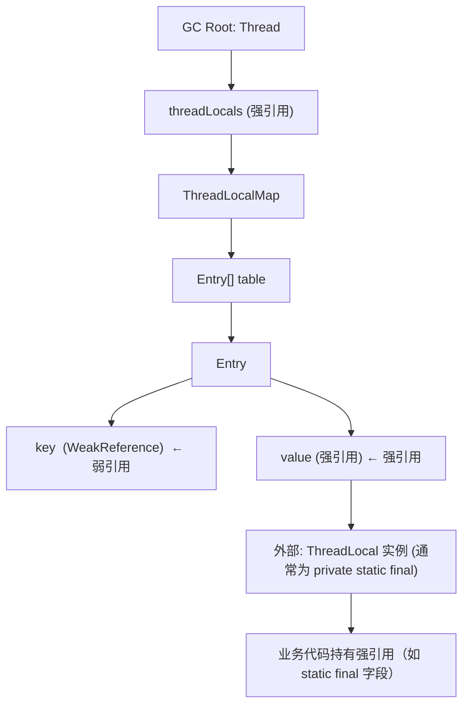

## 前置知识

- [CompletableFuture 异步编排](/java/054-CompletableFutureAsync)：建议先完成前一篇的学习

## 学习目标

- 掌握「0. 本节阅读指引（先读这一节）」的核心机制、典型用法与常见陷阱
- 掌握「引言：从"安全"到"陷阱"」的核心机制、典型用法与常见陷阱
- 掌握「1. 历史动机与技术演进」的核心机制、典型用法与常见陷阱
- 掌握「2. 形式化定义」的核心机制、典型用法与常见陷阱
- 掌握「3. 理论推导」的核心机制、典型用法与常见陷阱


## 0. 本节阅读指引（先读这一节）

本篇是「ThreadLocal 与内存泄漏」进阶文档。

第一遍只读：引言、4. 代码示例与文末速查小节（创建、读写、内存泄漏原理与排查）；重点理解「用完 remove」。

可跳过：1-3 节与 5-9 节第二遍细读。

前置：047 多线程基础。


## 引言：从"安全"到"陷阱"

`ThreadLocal` 在 1998 年随 JDK 1.2 发布时，被设计为 "线程私有的变量容器"，用以解决 SimpleDateFormat 非线程安全、JDBC Connection 复用等问题。Joshua Bloch 在《Effective Java》第 9 条明确建议：

> "Prefer try-with-resources to try-finally... 但 ThreadLocal 是少数必须用 try-finally 的场景。"

然而，ThreadLocal 在生产环境中是 Java 内存泄漏的高频元凶。淘宝、美团、Netflix 都公开过 ThreadLocal 导致 OOM 的案例分析。问题的根源不在 ThreadLocal 本身，而在其与线程池、长生命周期线程、弱引用 GC 的交互。

更值得关注的是，JEP 446（Scoped Values）在 JDK 21 Preview 中明确指出：

> "It is unsafe to use thread-local variables in a large virtual-thread-intensive program."
>
> —— OpenJDK JEP 446

这标志着 ThreadLocal 在虚拟线程时代正被官方"劝退"。本模块以 MIT 6.5840 Distributed Systems、Stanford CS149 与 CMU 15-440 的标准，系统讲解：

1. **ThreadLocal 的内部数据结构**：Thread → ThreadLocalMap → Entry[WeakReference, value]；
2. **内存泄漏的形式化推导**：基于 GC Roots 可达性分析，证明 value 为何无法回收；
3. **线程池场景的特殊风险**：线程复用导致 ThreadLocalMap 累积；
4. **生产级防御方案**：try-finally、remove()、TransmittableThreadLocal、Reactor Context；
5. **JEP 446 Scoped Values**：未来替代方案的设计哲学与迁移路径；
6. **真实案例分析**：Tomcat、Spring、Netty 中的 ThreadLocal 陷阱。

## 1. 历史动机与技术演进

### 1.1 时间线

| 年份 | 事件 | 主要贡献者 |
| ---- | ---- | ---------- |
| 1978 | Baker 提出 Weak Reference 概念 | Henry Baker |
| 1995 | POSIX pthread_key_create 标准化 TLS | IEEE |
| 1998 | JDK 1.2 引入 ThreadLocal 与 WeakReference | Joshua Bloch |
| 2000 | InheritableThreadLocal 用于父子线程传递 | Sun Microsystems |
| 2005 | JSR 133 Java Memory Model 重写 | Manson, Pugh, Adve |
| 2006 | 《Java Concurrency in Practice》出版 | Brian Goetz 等 |
| 2013 | 阿里 TransmittableThreadLocal（TTL）开源 | Alibaba |
| 2018 | Project Loom 原型发布，提出虚拟线程 | Ron Pressler |
| 2020 | Reactor 3.4 引入 ContextPropagation | Reactor Team |
| 2021 | JEP 444 虚拟线程 Preview | OpenJDK |
| 2023 | JDK 21 LTS 发布，虚拟线程 GA，JEP 446 Scoped Values Preview | OpenJDK |
| 2024 | JEP 462 Scoped Values Second Preview | OpenJDK |

### 1.2 设计动机

**ThreadLocal 的原始设计**：Joshua Bloch 在 JDK 1.2 设计 ThreadLocal 时，主要解决两个问题：

1. **非线程安全对象的复用**：如 `SimpleDateFormat`、`MessageDigest` 在多线程下不安全，每次 new 代价高；
2. **隐式上下文传递**：如事务管理、用户会话，避免在方法签名中层层传递。

Bloch 选择 "线程私有 Map" 而非 "ThreadLocal 持有 Map" 的设计，是为了：

- **避免 ThreadLocal 本身成为同步点**：数据存在 Thread 上，无需锁；
- **支持 ThreadLocal 对象回收**：Entry 用 WeakReference 作 key，ThreadLocal 对象无外部强引用时可被 GC。

**弱引用 key 的设计权衡**：

| 设计 | 优势 | 劣势 |
| ---- | ---- | ---- |
| 强引用 key | 无泄漏 | ThreadLocal 对象本身无法回收，长期泄漏 |
| 弱引用 key（实际） | ThreadLocal 对象可回收 | value 泄漏 |
| 弱引用 key + value | 无泄漏 | value 在使用中可能被意外回收 |

JDK 选择第二种方案：通过 `set()`/`get()`/`remove()` 中的 `expungeStaleEntry` 探测，主动清理 key 为 null 的 Entry。但这一被动清理机制在线程长期存活且不再调用上述方法时失效。

**Project Loom 与 Scoped Values**：Ron Pressler 在 2018 年提出虚拟线程时，意识到 ThreadLocal 的可变性与线程生命周期解耦会导致大规模泄漏。Scoped Values 的设计哲学是：

1. **不可变**：一旦设定不能修改，避免脏读；
2. **有界作用域**：值仅在 `run()` 调用栈内有效，自动销毁；
3. **JVM 原生支持**：不依赖 ThreadLocalMap，避免内存开销。

## 2. 形式化定义

### 2.1 ThreadLocal 的内部数据结构

ThreadLocal 的核心数据结构是 `ThreadLocalMap`，它存储在每个 Thread 实例上：

```java
// Thread.java（JDK 21 简化）
public class Thread implements Runnable {
    ThreadLocal.ThreadLocalMap threadLocals = null;
    ThreadLocal.ThreadLocalMap inheritableThreadLocals = null;
}

// ThreadLocal.java（JDK 21 简化）
public class ThreadLocal<T> {
    static class ThreadLocalMap {
        static class Entry extends WeakReference<ThreadLocal<?>> {
            Object value;
            Entry(ThreadLocal<?> k, Object v) {
                super(k);  // key 作为 WeakReference 引用
                value = v;  // value 为强引用
            }
        }
        private Entry[] table;
    }
}
```

### 2.2 引用关系图



### 2.3 引用强度的形式化定义

Java 定义四种引用强度，按可达性递减：

$$
\text{Strong} \succ \text{Soft} \succ \text{Weak} \succ \text{Phantom}
$$

GC 行为：

$$
\text{Reachability}(o) = \begin{cases}
\text{Strong reachable} & \text{存在强引用路径} \\
\text{Soft reachable} & \text{仅 SoftReference 路径，内存不足时回收} \\
\text{Weak reachable} & \text{仅 WeakReference 路径，下次 GC 即回收} \\
\text{Phantom reachable} & \text{仅 PhantomReference 路径，finalize 后回收} \\
\text{Unreachable} & \text{无引用，立即可回收}
\end{cases}
$$

### 2.4 ThreadLocal 内存泄漏的形式化条件

设：
- $T$ 为 Thread 对象（GC Root）
- $M$ 为 ThreadLocalMap
- $E$ 为 Entry
- $L$ 为 ThreadLocal 对象
- $V$ 为 value 对象

引用链：

$$
T \xrightarrow{\text{strong}} M \xrightarrow{\text{strong}} E \xrightarrow{\text{strong}} V
$$

$$
E \xrightarrow{\text{weak}} L
$$

**泄漏条件**：

$$
\text{Leak}(V) \iff \left( T \text{ alive} \right) \land \left( L \text{ collected} \right) \land \left( E \text{ not removed} \right)
$$

即：线程存活、ThreadLocal 对象被回收（外部无强引用）、Entry 未被显式 remove。

### 2.5 EBNF：ThreadLocal 生命周期

```ebnf
ThreadLocalLifecycle ::= 
    "new" "(" Supplier<T>? ")" 
    | "withInitial" "(" Supplier<T> ")"
    
ThreadLocalOps ::= 
    "get" "(" ")" 
    | "set" "(" T ")" 
    | "remove" "(" ")"
    
SafeUsagePattern ::= 
    "try" Block 
    "finally" "remove" "(" ")"
    
UnsafeUsagePattern ::= 
    "set" "(" T ")" Block
    -- 缺少 finally remove
```

## 3. 理论推导

### 3.1 GC Roots 可达性分析

JVM GC 从 GC Roots 出发，沿**强引用链**搜索可达对象。GC Roots 包括：

1. **活动线程的栈帧中的局部变量**（线程本身就是 GC Root）；
2. **类的静态字段**；
3. **JNI 全局引用**；
4. **同步监视器持有的对象**。

对于 ThreadLocal 的 value，可达路径为：

$$
\text{Thread (GC Root)} \to \text{threadLocals} \to \text{Entry[]} \to \text{Entry.value}
$$

只要线程存活，value 即可达，不会被 GC。即使 ThreadLocal 对象本身被回收（key 变 null），value 仍被强引用。

### 3.2 弱引用 Key 的回收时机

WeakReference 的语义是：**下一次 GC 时，若对象仅剩弱引用，则被回收**。Entry 继承 WeakReference<ThreadLocal<?>>，因此：

- 当 ThreadLocal 对象在业务代码中无强引用（如局部变量 ThreadLocal），下次 GC 时 ThreadLocal 被回收；
- Entry 的 `get()` 返回 null，即 key 为 null；
- 但 Entry.value 仍非 null。

**证明**：设 ThreadLocal $L$ 的强引用计数为 $S(L)$，弱引用计数为 $W(L)$。

$$
\text{GC}(L) \iff S(L) = 0
$$

回收后，Entry.key 为 null，但 Entry.value 仍被 Entry 引用。ThreadLocalMap 不主动清理（除非 `set`/`get`/`remove` 触发 `expungeStaleEntry`）。

### 3.3 线程池场景的累积效应

线程池中线程 $T$ 存活时间长（与 JVM 同生命周期），每个任务可能 `set` 新 value：

$$
\text{LeakedMemory}(t) = \sum_{i=1}^{N(t)} |V_i|
$$

其中 $N(t)$ 为 $t$ 时刻累积的未清理 Entry 数，$|V_i|$ 为第 $i$ 个 value 大小。

设每秒处理 1000 请求，每个请求 set 1KB 上下文，1 小时后：

$$
\text{LeakedMemory}(3600\text{s}) = 1000 \times 3600 \times 1\text{KB} = 3.6\text{GB}
$$

实际生产中，泄漏更隐蔽：

- 每个线程的 ThreadLocalMap 累积多个不同 ThreadLocal 的 Entry；
- value 可能是 Connection、Statement、List 等大对象；
- 线程池有 N 个线程，泄漏 ×N。

### 3.4 expungeStaleEntry 的被动清理

ThreadLocalMap 在 `set`/`get`/`remove` 操作时会触发 `expungeStaleEntry`，清理 key 为 null 的 Entry：

```java
// ThreadLocal.ThreadLocalMap 简化
private int expungeStaleEntry(int staleSlot) {
    Entry[] tab = table;
    tab[staleSlot].value = null;  // 清理 value
    tab[staleSlot] = null;          // 清理 Entry
    size--;
    // 重新探测相邻 slot，清理链上其他 stale entry
    Entry e;
    int i;
    for (i = nextIndex(staleSlot, len); (e = tab[i]) != null; i = nextIndex(i, len)) {
        ThreadLocal<?> k = e.get();
        if (k == null) {
            e.value = null;
            tab[i] = null;
            size--;
        } else {
            // rehash
        }
    }
    return i;
}
```

**局限性**：

1. **被动触发**：只有调用 `set`/`get`/`remove` 才触发；
2. **局部清理**：仅清理 staleSlot 及其相邻链上的 stale entry；
3. **无效场景**：若线程长期不调用上述方法（如线程池中空闲线程），泄漏持续。

### 3.5 弱引用 Key 的设计悖论

JDK 选择弱引用 key 而非强引用 key，是一个权衡：

**强引用 key 的泄漏模型**：

$$
\text{Leak}(L) \iff T \text{ alive}
$$

即 ThreadLocal 对象本身在线程存活期间永不回收（即使业务代码已无引用）。

**弱引用 key 的泄漏模型**：

$$
\text{Leak}(V) \iff T \text{ alive} \land L \text{ collected} \land E \text{ not removed}
$$

即 value 泄漏，但 ThreadLocal 对象本身可回收。

JDK 选择后者，因为：

- ThreadLocal 通常声明为 `private static final`，本身不泄漏；
- value 泄漏可通过 `remove()` 主动避免；
- 反之若用强引用 key，开发者无法通过任何方式避免 ThreadLocal 泄漏。

**Bloch 在《Effective Java》Item 9 的论述**：

> "Thread-local variables are prone to memory leaks... The java.lang.ThreadLocal class provides a way to ameliorate this problem, but it is not a complete solution."

## 4. 代码示例

### 4.1 ThreadLocal 基础用法

```java
import java.text.SimpleDateFormat;
import java.util.Date;

/**
 * ThreadLocal 基础用法：线程安全的 SimpleDateFormat
 *
 * SimpleDateFormat 非线程安全，传统做法是每次 new，性能差；
 * ThreadLocal 为每个线程提供独立实例
 */
public class DateFormatHelper {

    // 推荐：声明为 private static final，避免 ThreadLocal 对象本身被回收
    private static final ThreadLocal<SimpleDateFormat> DATE_FORMAT =
        ThreadLocal.withInitial(() -> new SimpleDateFormat("yyyy-MM-dd HH:mm:ss"));

    public static String format(Date date) {
        return DATE_FORMAT.get().format(date);
    }

    // 注意：SimpleDateFormat 本身较大（约 1KB），线程池场景仍建议 remove
    public static void cleanup() {
        DATE_FORMAT.remove();
    }
}
```

### 4.2 try-finally 安全模式

```java
import java.sql.Connection;

/**
 * ThreadLocal 安全使用模式：try-finally + remove
 *
 * 这是 Bloch《Effective Java》Item 9 与 Goetz《JCIP》推荐的范式
 */
public class ConnectionHolder {

    private static final ThreadLocal<Connection> CONN = new ThreadLocal<>();

    public static Connection getConnection() {
        Connection c = CONN.get();
        if (c == null) {
            c = createConnection();
            CONN.set(c);
        }
        return c;
    }

    /**
     * 在请求处理入口调用，确保异常路径也清理
     */
    public static void withConnection(Runnable task) {
        try {
            task.run();
        } finally {
            // 关键：无论是否抛异常都清理
            Connection c = CONN.get();
            if (c != null) {
                try {
                    c.close();
                } catch (Exception e) {
                    // 记录日志，但不影响清理
                }
            }
            CONN.remove();
        }
    }

    private static Connection createConnection() {
        // 实际实现：从 DataSource 获取
        return null;
    }
}
```

### 4.3 AutoCloseable 封装

```java
/**
 * ThreadLocal 资源封装：实现 AutoCloseable，支持 try-with-resources
 */
public class ThreadLocalScope<T> implements AutoCloseable {

    private final ThreadLocal<T> threadLocal;
    private final T value;
    private final boolean owned;  // 是否由本 scope 创建（决定是否 remove）

    public ThreadLocalScope(ThreadLocal<T> tl, T value, boolean owned) {
        this.threadLocal = tl;
        this.value = value;
        this.owned = owned;
        threadLocal.set(value);
    }

    @Override
    public void close() {
        if (owned) {
            threadLocal.remove();
        }
    }

    public T get() {
        return value;
    }

    /**
     * 使用示例
     */
    public static void main(String[] args) {
        ThreadLocal<String> userId = new ThreadLocal<>();

        try (ThreadLocalScope<String> scope = new ThreadLocalScope<>(userId, "u123", true)) {
            // 在此作用域内，userId.get() 返回 "u123"
            doBusiness();
        }  // 自动 remove

        // 此处 userId.get() 返回 null
    }

    static void doBusiness() { /* ... */ }
}
```

### 4.4 InheritableThreadLocal 父子传递

```java
/**
 * InheritableThreadLocal：子线程继承父线程的值
 *
 * 注意：仅在线程 NEW 时传递，线程池场景无效
 */
public class ParentChildContext {

    public static final InheritableThreadLocal<String> REQUEST_ID = new InheritableThreadLocal<>();

    public static void main(String[] args) {
        REQUEST_ID.set("req-001");

        // 子线程继承父线程的值
        new Thread(() -> {
            System.out.println("子线程: " + REQUEST_ID.get());  // req-001
        }).start();

        // 线程池场景：不传递
        ExecutorService pool = Executors.newFixedThreadPool(2);
        pool.submit(() -> {
            System.out.println("线程池: " + REQUEST_ID.get());  // null
        });
        pool.shutdown();
    }
}
```

### 4.5 TransmittableThreadLocal（阿里 TTL）

```java
import com.alibaba.ttl.TransmittableThreadLocal;
import com.alibaba.ttl.threadpool.TtlExecutors;

/**
 * TransmittableThreadLocal：在线程池中传递
 *
 * 阿里开源，解决 InheritableThreadLocal 在线程池场景失效的问题
 * 通过装饰 Runnable/Callable，在任务提交时捕获、执行时重放
 */
public class TtlExample {

    public static final TransmittableThreadLocal<String> USER_ID = new TransmittableThreadLocal<>();

    public static void main(String[] args) throws Exception {
        USER_ID.set("u123");

        ExecutorService pool = Executors.newFixedThreadPool(2);
        // 关键：用 TtlExecutors 包装
        ExecutorService ttlPool = TtlExecutors.getTtlExecutorService(pool);

        ttlPool.submit(() -> {
            System.out.println("线程池: " + USER_ID.get());  // u123
        }).get();

        ttlPool.shutdown();
    }
}
```

### 4.6 Reactor Context 传播

```java
import reactor.core.publisher.Mono;
import reactor.util.context.Context;

/**
 * Reactor Context：反应式编程中的上下文传播
 *
 * 替代 ThreadLocal，因 Reactor 在线程切换时 ThreadLocal 失效
 */
public class ReactorContextExample {

    public static void main(String[] args) {
        Mono.deferContextual(ctx -> {
                String userId = ctx.get("userId");
                System.out.println("线程 " + Thread.currentThread().getName() + ": " + userId);
                return Mono.just(userId);
            })
            .contextWrite(Context.of("userId", "u123"))
            .subscribe();

        // 配合 Micrometer ContextPropagation 可与 ThreadLocal 互转
    }
}
```

### 4.7 Scoped Values（JEP 446 Preview）

```java
// 需要 --enable-preview --release 21
import java.lang.ScopedValue;

/**
 * Scoped Values：JDK 21+ 的 ThreadLocal 替代品
 *
 * 不可变、有界作用域、自动清理，虚拟线程友好
 */
public class ScopedValueExample {

    // 声明为 static final，无 initialValue
    private static final ScopedValue<String> USER_ID = ScopedValue.newInstance();

    public static void main(String[] args) {
        // 通过 where().run() 设定值并执行
        ScopedValue.where(USER_ID, "u123").run(() -> {
            doBusiness();
        });
        // run() 结束后自动清理，USER_ID.isBound() 为 false
    }

    static void doBusiness() {
        // 在 run() 调用栈内的任何位置都可访问
        if (USER_ID.isBound()) {
            System.out.println("User: " + USER_ID.get());
        }
    }

    // 支持嵌套：内层覆盖外层
    static void nested() {
        ScopedValue.where(USER_ID, "outer").run(() -> {
            // USER_ID.get() == "outer"
            ScopedValue.where(USER_ID, "inner").run(() -> {
                // USER_ID.get() == "inner"
            });
            // USER_ID.get() == "outer"
        });
    }
}
```

### 4.8 线程池泄漏复现

```java
import java.util.concurrent.*;
import java.util.*;

/**
 * 复现 ThreadLocal 在线程池中的泄漏
 */
public class ThreadLocalLeakDemo {

    // 故意声明为非 static final，加速 ThreadLocal 对象本身回收
    private ThreadLocal<List<byte[]>> leakyTl = new ThreadLocal<>();

    public void leak() {
        ExecutorService pool = Executors.newFixedThreadPool(4);
        for (int i = 0; i < 10000; i++) {
            pool.submit(() -> {
                // 每次分配 1MB
                List<byte[]> data = new ArrayList<>();
                data.add(new byte[1024 * 1024]);
                leakyTl.set(data);
                // 故意不 remove
            });
        }
        pool.shutdown();
    }

    /**
     * 修复版
     */
    public void noLeak() {
        ThreadLocal<List<byte[]>> safeTl = new ThreadLocal<>();
        ExecutorService pool = Executors.newFixedThreadPool(4);
        for (int i = 0; i < 10000; i++) {
            pool.submit(() -> {
                try {
                    List<byte[]> data = new ArrayList<>();
                    data.add(new byte[1024 * 1024]);
                    safeTl.set(data);
                } finally {
                    safeTl.remove();  // 关键
                }
            });
        }
        pool.shutdown();
    }
}
```

## 5. 对比分析

### 5.1 ThreadLocal vs InheritableThreadLocal vs TransmittableThreadLocal

| 特性 | ThreadLocal | InheritableThreadLocal | TransmittableThreadLocal |
| ---- | ----------- | --------------------- | ------------------------ |
| 父子线程传递 | 不支持 | 仅 new Thread() 时支持 | 线程池也支持 |
| 线程池复用 | 不传递 | 不传递 | 传递（需 TTL 包装） |
| 虚拟线程 | 可用但不推荐 | 可用但不推荐 | 可用 |
| 内存泄漏 | 高风险 | 高风险 | 中风险（自动清理机制） |
| 性能开销 | 低 | 低 | 中（任务提交时捕获） |
| 推荐场景 | 单线程内 | 简单父子 | 线程池 + 上下文传递 |

### 5.2 ThreadLocal vs Scoped Values

| 特性 | ThreadLocal | Scoped Values |
| ---- | ----------- | -------------- |
| 可变性 | 可变（set/remove） | 不可变 |
| 作用域 | 显式 remove | 自动随 run() 结束 |
| 内存泄漏 | 高风险 | 无风险 |
| 虚拟线程友好 | 否 | 是 |
| 父子传递 | 需 InheritableThreadLocal | 自动（run() 调用栈） |
| 性能 | 中（ThreadLocalMap） | 高（JVM 原生） |
| 可用性 | JDK 1.2+ | JDK 21+ Preview |
| 推荐场景 | 平台线程 + 兼容老代码 | 虚拟线程 + 新项目 |

### 5.3 Java ThreadLocal vs C# ThreadStatic vs Go goroutine-local

| 特性 | Java ThreadLocal | C# [ThreadStatic] | Go goroutine-local |
| ---- | ---------------- | ----------------- | ------------------ |
| 作用域 | 线程 | 线程 | goroutine |
| 初始化 | withInitial | 默认值（需手动初始化） | 不支持（已废弃） |
| 清理 | 手动 remove | 线程结束自动 | 线程结束自动 |
| 内存泄漏 | 风险高 | 风险中 | 无（已移除） |
| 跨线程传递 | 需 InheritableThreadLocal | 不支持 | 不支持 |
| 设计哲学 | 显式管理 | 注解驱动 | 显式参数传递 |

Go 在 1.4 移除了 goroutine-local storage，理由是"可变性导致隐式耦合，应通过显式参数传递"——这与 Scoped Values 的不可变哲学一致。

### 5.4 ThreadLocal vs Reactor Context

| 特性 | ThreadLocal | Reactor Context |
| ---- | ----------- | ----------------- |
| 同步/异步 | 同步 | 异步 |
| 线程切换 | 失效 | 自动传播 |
| 内存泄漏 | 高风险 | 无（随 Mono 生命周期） |
| 可变性 | 可变 | 不可变（contextWrite 创建新 Context） |
| 适用场景 | 命令式 | 反应式 |
| 与 ThreadLocal 互转 | 原生 | Micrometer ContextPropagation |

## 6. 常见陷阱

### 6.1 陷阱：使用 `set(null)` 而非 `remove()`

:::danger
**错误代码**：

```java
ThreadLocal<User> tl = new ThreadLocal<>();
try {
    tl.set(user);
    doBusiness();
} finally {
    tl.set(null);  // 错误：仅清空 value，未删除 Entry
}
```

**错误原因**：`set(null)` 将 value 置为 null，但 Entry 仍存在于 ThreadLocalMap 中，key 仍指向 ThreadLocal。这既不节省内存，也无法阻止后续 `get()` 触发 `initialValue` 重新分配。

**修正方案**：

```java
try {
    tl.set(user);
    doBusiness();
} finally {
    tl.remove();  // 真正从 ThreadLocalMap 中删除 Entry
}
```

`remove()` 内部调用 `ThreadLocalMap.remove(ThreadLocal)`，会触发 `expungeStaleEntry`，彻底清除 Entry 及相邻 stale entry。
:::

### 6.2 陷阱：ThreadLocal 声明为实例字段

:::danger
**错误代码**：

```java
public class UserService {
    private ThreadLocal<User> ctx = new ThreadLocal<>();  // 非 static
}
```

**错误原因**：每次 new UserService 都创建新的 ThreadLocal 对象，旧的 ThreadLocal 对象失去强引用后被 GC，Entry key 变 null，但 value 仍泄漏。同时大量 ThreadLocal 实例导致 ThreadLocalMap 膨胀。

**修正方案**：

```java
public class UserService {
    private static final ThreadLocal<User> ctx = new ThreadLocal<>();  // static final
}
```

`static final` 保证 ThreadLocal 对象本身不回收，Entry key 永远非 null，避免 key 为 null 的 stale entry 累积。
:::

### 6.3 陷阱：线程池中 InheritableThreadLocal 失效

:::danger
**错误代码**：

```java
public static final InheritableThreadLocal<String> USER_ID = new InheritableThreadLocal<>();

ExecutorService pool = Executors.newFixedThreadPool(4);
USER_ID.set("u123");
pool.submit(() -> {
    System.out.println(USER_ID.get());  // null！
});
```

**错误原因**：InheritableThreadLocal 仅在线程 NEW 时复制父线程的值；线程池线程在创建时（submit 之前）可能父线程尚未 set，或线程被复用、新任务时父线程已变。

**修正方案**：

```java
public static final TransmittableThreadLocal<String> USER_ID = new TransmittableThreadLocal<>();
ExecutorService pool = TtlExecutors.getTtlExecutorService(Executors.newFixedThreadPool(4));
USER_ID.set("u123");
pool.submit(() -> {
    System.out.println(USER_ID.get());  // u123
});
```

或使用 Scoped Values（JDK 21+）：

```java
private static final ScopedValue<String> USER_ID = ScopedValue.newInstance();
ScopedValue.where(USER_ID, "u123").run(() -> {
    pool.submit(() -> {
        // 注意：ScopedValue 在跨线程时仍需特别处理
    });
});
```
:::

### 6.4 陷阱：虚拟线程 + ThreadLocal 导致内存爆炸

:::danger
**错误代码**：

```java
try (ExecutorService pool = Executors.newVirtualThreadPerTaskExecutor()) {
    for (int i = 0; i < 1_000_000; i++) {
        pool.submit(() -> {
            CONTEXT.set(largeObject);  // 每个虚拟线程都有自己的 ThreadLocalMap
            // ...
            CONTEXT.remove();  // 即使 remove，瞬时内存峰值极高
        });
    }
}
```

**错误原因**：虚拟线程极轻量（KB 级栈），单 JVM 可创建数百万；每个虚拟线程都有 ThreadLocalMap，1M 虚拟线程 × 1KB context = 1GB 瞬时内存。

**修正方案**：使用 Scoped Values：

```java
try (ExecutorService pool = Executors.newVirtualThreadPerTaskExecutor()) {
    for (int i = 0; i < 1_000_000; i++) {
        pool.submit(() -> {
            ScopedValue.where(CONTEXT, largeObject).run(() -> {
                // CONTEXT 仅在此调用栈内有效，无 ThreadLocalMap 开销
            });
        });
    }
}
```
:::

### 6.5 陷阱：ThreadLocal + ForkJoinPool 在 Stream 中失效

:::danger
**错误代码**：

```java
ThreadLocal<String> ctx = new ThreadLocal<>();
ctx.set("user-123");

list.parallelStream().map(x -> {
    String user = ctx.get();  // 可能 null！
    return transform(x, user);
}).collect(Collectors.toList());
```

**错误原因**：`parallelStream` 使用 ForkJoinPool.commonPool()，工作线程在任务拆分时不继承主线程的 ThreadLocal。

**修正方案**：

1. 不使用 `parallelStream`，改用顺序流；
2. 显式将 context 作为参数传递：

```java
String user = ctx.get();
list.stream().map(x -> transform(x, user)).collect(Collectors.toList());
```

3. 使用 Reactor Context 或 TTL。
:::

### 6.6 陷阱：以为 GC 会自动清理 value

:::danger
**误解**：

> "ThreadLocalMap 用 WeakReference，所以 GC 会自动清理。"

**真相**：

- WeakReference 仅作用于 **key**（ThreadLocal 对象）；
- **value** 是普通强引用字段，GC 不会回收；
- 即使 key 被回收（变 null），value 仍被 Entry 引用、Entry 被 ThreadLocalMap 引用、ThreadLocalMap 被 Thread 引用，形成强引用链。

**正确认识**：

```
Thread (GC Root)
  → threadLocals (strong)
    → Entry[] (strong)
      → Entry (strong)
        → value (strong) ← 永远不会自动回收，除非 remove() 或 Thread 死亡
```
:::

## 7. 工程实践

### 7.1 ThreadLocal 使用规范

1. **声明为 `private static final`**：避免 ThreadLocal 对象本身泄漏；
2. **必须 try-finally + remove()**：异常路径也清理；
3. **不使用 set(null)**：用 remove() 彻底删除 Entry；
4. **线程池场景慎用**：考虑 TTL 或显式参数传递；
5. **虚拟线程场景避免**：迁移到 Scoped Values；
6. **框架层封装**：业务代码通过 AutoCloseable 资源使用，不直接操作 ThreadLocal。

### 7.2 监控与诊断

```java
/**
 * ThreadLocal 监控工具：统计每个线程的 ThreadLocalMap 大小
 */
public class ThreadLocalMonitor {

    public static void printAllThreadLocals() {
        // 通过反射获取所有线程的 ThreadLocalMap
        for (Thread t : Thread.getAllStackTraces().keySet()) {
            try {
                Field field = Thread.class.getDeclaredField("threadLocals");
                field.setAccessible(true);
                Object map = field.get(t);
                if (map != null) {
                    Field size = map.getClass().getDeclaredField("size");
                    size.setAccessible(true);
                    int s = (int) size.get(map);
                    System.out.println("Thread " + t.getName() + " TL size: " + s);
                }
            } catch (Exception e) {
                // ignore
            }
        }
    }
}
```

### 7.3 堆转储分析流程

1. **触发堆转储**：`jmap -dump:live,format=b,file=heap.hprof <pid>` 或 `jcmd <pid> GC.heap_dump heap.hprof`；
2. **MAT 分析**：打开 hprof，运行 "Leak Suspects Report"；
3. **定位 ThreadLocal**：搜索 `ThreadLocalMap`，查看每个 Entry 的 value；
4. **引用链分析**：右键 value → "Path to GC Roots" → "exclude weak/soft references"；
5. **修复**：根据引用链定位未 remove 的代码路径。

### 7.4 Tomcat 场景的最佳实践

Tomcat 等容器使用线程池处理请求，ThreadLocal 泄漏高频场景：

1. **Filter 中 set，Filter 中 remove**：

```java
public class ContextFilter implements Filter {
    private static final ThreadLocal<RequestContext> CTX = new ThreadLocal<>();

    @Override
    public void doFilter(ServletRequest req, ServletResponse resp, FilterChain chain)
            throws IOException, ServletException {
        try {
            CTX.set(new RequestContext((HttpServletRequest) req));
            chain.doFilter(req, resp);
        } finally {
            CTX.remove();  // 关键
        }
    }
}
```

2. **避免在 Servlet/Controller 中 set**：业务代码只 get，不 set，避免遗漏 remove。

3. **Tomcat 的 ThreadLocalLeakPreventionListener**：Tomcat 自带监听器，在请求结束后主动清理 ThreadLocal（但仅清理 Tomcat 已知的）。

## 8. 案例研究

### 8.1 案例一：某电商平台 OOM 排查

**背景**：某电商平台订单服务在促销期间 OOM，重启后正常，每日累积。

**排查过程**：

1. **JFR 分析**：JDK Mission Control 显示 `byte[]` 占用 70% 堆；
2. **堆转储**：MAT 显示 1000+ 线程，每个线程的 ThreadLocalMap 含 50+ Entry，每个 value 是 1MB 的 List；
3. **引用链**：value ← Entry ← ThreadLocalMap ← Thread（pool-1-thread-N）；
4. **代码定位**：在拦截器中发现：

```java
public class LogInterceptor {
    private ThreadLocal<List<LogEntry>> logs = new ThreadLocal<>();  // 非 static！

    public void intercept(Request req) {
        logs.set(new ArrayList<>());
        // 收集日志...
        // 缺少 remove
    }
}
```

**修复**：

1. 声明为 `static final`；
2. finally 中 remove；
3. 改用 MDC（SLF4J）替代自实现的日志上下文。

**结果**：内存占用从 8GB 降至 1.5GB，OOM 消失。

### 8.2 案例二：Spring 框架的 ThreadLocal 管理

**背景**：Spring 在 TransactionSynchronizationManager、RequestContextHolder、LocaleContextHolder 中大量使用 ThreadLocal。

**设计模式**：

```java
// Spring 简化：RequestContextHolder
public abstract class RequestContextHolder {
    private static final ThreadLocal<RequestAttributes> requestAttributesHolder = new NamedThreadLocal<>("Request attributes");

    public static void setRequestAttributes(RequestAttributes attributes) {
        if (attributes == null) {
            requestAttributesHolder.remove();
        } else {
            requestAttributesHolder.set(attributes);
        }
    }

    public static RequestAttributes getRequestAttributes() {
        RequestAttributes attributes = requestAttributesHolder.get();
        return attributes;
    }

    // 关键：resetRequestAttributes 在请求结束时调用
    public static void resetRequestAttributes() {
        requestAttributesHolder.remove();
    }
}
```

**经验**：Spring 通过 `DispatcherServlet` 与 `RequestContextFilter` 在请求结束时统一调用 `resetRequestAttributes()`，避免业务代码遗漏。

### 8.3 案例三：Netty 的 FastThreadLocal

**背景**：Netty 发现 JDK ThreadLocal 在高频访问场景下性能瓶颈（ThreadLocalMap 探测慢），自研 FastThreadLocal。

**设计**：

```java
// Netty 简化：FastThreadLocal
public class FastThreadLocal<V> {
    private final int index;  // 每个 FastThreadLocal 唯一索引

    public FastThreadLocal() {
        index = InternalThreadLocalMap.nextVariableIndex();
    }

    public V get() {
        // O(1) 数组访问，无 hash 探测
        return (V) InternalThreadLocalMap.get().indexedVariable(index);
    }
}
```

**对比**：

| 特性 | JDK ThreadLocal | Netty FastThreadLocal |
| ---- | --------------- | --------------------- |
| 存储 | ThreadLocalMap（hash 探测） | InternalThreadLocalMap（数组索引） |
| 访问复杂度 | O(1) amortized, hash 探测 | O(1) direct index |
| 内存开销 | Entry[] + hash | Object[] |
| 适用场景 | 通用 | 高频访问（如 Netty pipeline） |
| 内存泄漏 | 同 JDK | 同 JDK（仍需 remove） |

### 8.4 案例四：从 ThreadLocal 迁移到 Scoped Values

**背景**：某项目从 JDK 17 升级到 JDK 21，引入虚拟线程后 ThreadLocal 出现内存问题。

**迁移前**：

```java
private static final ThreadLocal<User> CURRENT_USER = new ThreadLocal<>();

public void handle(Request req) {
    CURRENT_USER.set(extractUser(req));
    try {
        businessLogic();
    } finally {
        CURRENT_USER.remove();
    }
}

public User currentUser() {
    return CURRENT_USER.get();
}
```

**迁移后**：

```java
private static final ScopedValue<User> CURRENT_USER = ScopedValue.newInstance();

public void handle(Request req) {
    ScopedValue.where(CURRENT_USER, extractUser(req)).run(() -> {
        businessLogic();
    });
    // 无需 remove，自动清理
}

public User currentUser() {
    return CURRENT_USER.get();  // 仅在 run() 调用栈内可用
}
```

**权衡**：

- **优势**：自动清理、虚拟线程友好、不可变；
- **劣势**：仅 JDK 21+ Preview，需 `--enable-preview`；
- **过渡策略**：保留 ThreadLocal 用于平台线程，新增代码用 ScopedValue；JDK 24+ GA 后全面迁移。

## 9. 未来演进

### 9.1 JEP 446 Scoped Values 路线

Scoped Values 在 JDK 21 Preview（JEP 446）、JDK 22 Second Preview（JEP 462）、JDK 23 Third Preview（JEP 480），预计 JDK 24+ GA。

未来增强：

1. **结构化并发集成**：与 JEP 453（Structured Concurrency）配合，自动传播作用域；
2. **动态作用域**：支持在调用栈中间读取（类似 Common Lisp 的 special variables）；
3. **性能优化**：JVM 内部存储，避免 ThreadLocalMap 开销。

### 9.2 虚拟线程的全面影响

JEP 444（JDK 21 GA）后，虚拟线程成为推荐的高并发模型。ThreadLocal 在虚拟线程场景下：

1. **可用但劝退**：JEP 446 明确指出大规模虚拟线程 + ThreadLocal 不安全；
2. **迁移压力**：框架（Spring、Quarkus、Micronaut）需适配 Scoped Values；
3. **过渡期**：JDK 21-23 期间，ThreadLocal 仍广泛使用；JDK 24+ 后 Scoped Values 成为主流。

### 9.3 反应式编程与上下文传播

Reactor 3.4+ 与 Micrometer ContextPropagation 提供了反应式与命令式互转：

```java
// ThreadLocal → Reactor Context
ContextPropagation.forThreadLocal("userId", USER_ID_TL);

// Reactor 自动在 subscribe 时捕获、在 onNext 时恢复
Mono.fromCallable(() -> USER_ID_TL.get())
    .contextWrite(Context.of("userId", "u123"))
    .subscribe();
```

未来 Scoped Values 将与 Reactor Context 深度集成，形成统一的上下文传播层。

### 13.1 关联模块

- Java 并发编程详解（`/java/concurrency/`）— ThreadLocal 是并发编程的基础工具
- Java CompletableFuture异步编排（`/java/completable-future/`）— 异步任务中的上下文传播
- Java JVM 内存模型（`/java/jmm/`）— GC Roots、可达性分析、弱引用
- Java 反射与动态代理（`/java/reflection/`）— 通过反射分析 ThreadLocalMap

### 13.2 进阶书籍

- *Java Concurrency in Practice* — Brian Goetz 等 (2006)
- *The Art of Multiprocessor Programming* — Maurice Herlihy, Nir Shavit (2012)
- *Designing Data-Intensive Applications* — Martin Kleppmann (2017)

### 13.3 权威文章与论文

- JEP 446: Scoped Values — https://openjdk.org/jeps/446
- JEP 444: Virtual Threads — https://openjdk.org/jeps/444
- JSR 133: Java Memory Model — https://jcp.org/en/jsr/detail?id=133
- Pugh, B. "The Java Memory Model is Causally Correct" (1999)
- Bloch, J. "Effective Java Item 9: try-with-resources"

### 13.4 社区与生态

- OpenJDK Project Loom：https://openjdk.org/projects/loom/
- Alibaba TransmittableThreadLocal：https://github.com/alibaba/transmittable-thread-local
- Reactor Context：https://projectreactor.io/docs/core/release/reference/
- Micrometer ContextPropagation：https://github.com/micrometer-metrics/context-propagation

### 13.5 工具速查

| 工具 | 用途 | 入门成本 | 推荐场景 |
| ---- | ---- | -------- | -------- |
| ThreadLocal | 线程私有变量 | 低 | 平台线程 + 短作用域 |
| InheritableThreadLocal | 父子传递 | 低 | 简单 new Thread 场景 |
| TransmittableThreadLocal | 线程池传递 | 中 | 线程池 + 上下文 |
| ScopedValue（Preview） | 不可变作用域值 | 中 | 虚拟线程 + JDK 21+ |
| Reactor Context | 反应式上下文 | 中 | WebFlux / Reactor |
| Micrometer ContextPropagation | 跨范式传播 | 中 | 混合编程模型 |
| MAT | 堆转储分析 | 中 | 泄漏排查 |
| JFR | 飞行记录器 | 中 | 生产监控 |

### 13.6 在线课程

- MIT 6.5840 Distributed Systems：https://pdos.csail.mit.edu/6.824/
- Stanford CS149 Parallel Computing：https://cs149.stanford.edu/
- CMU 15-440 Distributed Systems：https://www.cs.cmu.edu/~dga/15-440/F12/
- Doug Lea's concurrency tutorials：http://gee.cs.oswego.edu/
## 创建 ThreadLocal

**基本写法：创建 ThreadLocal**
`ThreadLocal.<类型>withInitial(() -> <初始值>);`
```java
// 创建带初始值的 ThreadLocal
ThreadLocal<Integer> counter = ThreadLocal.withInitial(() -> 0);
```

---

**基本写法：匿名内部类创建**
`new ThreadLocal<<类型>>() { protected <类型> initialValue() {} }`
```java
// 重写 initialValue 创建
ThreadLocal<List<String>> ctx = new ThreadLocal<>() {
    @Override
    protected List<String> initialValue() { return new ArrayList<>(); }
};
```

---

## 读写操作

**基本写法：设置值**
`<threadLocal>.set(<值>);`
```java
// 为当前线程设置值
counter.set(10);
```

---

**基本写法：获取值**
`<threadLocal>.get();`
```java
// 获取当前线程的值
int v = counter.get();
```

---

**基本写法：移除值**
`<threadLocal>.remove();`
```java
// 移除当前线程的值，防止内存泄漏
counter.remove();
```

---

## InheritableThreadLocal 子线程继承

**基本写法：创建可继承 ThreadLocal**
`new InheritableThreadLocal<<类型>>();`
```java
// 子线程可继承父线程的值
InheritableThreadLocal<String> itl = new InheritableThreadLocal<>();
itl.set("parent");
```

---

**基本写法：自定义子线程值**
`new InheritableThreadLocal<<类型>>() { protected <类型> childValue(<类型> p) {} }`
```java
// 子线程继承时对值做转换
InheritableThreadLocal<String> itl = new InheritableThreadLocal<>() {
    @Override
    protected String childValue(String parent) { return parent + "-child"; }
};
```

---

## TransmittableThreadLocal 跨线程池传递

**基本写法：使用 TransmittableThreadLocal（阿里 TTL 库）**
`new TransmittableThreadLocal<<类型>>();`
```java
// 线程池场景下传递上下文
TransmittableThreadLocal<String> ttl = new TransmittableThreadLocal<>();
ttl.set("ctx");
```

---

**基本写法：包装 Runnable**
`TtlRunnable.get(<runnable>);`
```java
// 提交任务时包装以传递上下文
executor.submit(TtlRunnable.get(() -> doWork(ttl.get())));
```

---

## ScopedValue（Java 21+ 预览）

**基本写法：创建 ScopedValue**
`private static final ScopedValue<<类型>> NAME = ScopedValue.newInstance();`
```java
// 创建不可变作用域值
static final ScopedValue<String> USER = ScopedValue.newInstance();
```

---

**基本写法：绑定并执行**
`ScopedValue.where(<sv>, <值>).run(() -> <方法>);`
```java
// 在作用域内绑定值并执行
ScopedValue.where(USER, "Alice").run(() -> {
    System.out.println(USER.get());
});
```

---

**基本写法：返回结果**
`ScopedValue.where(<sv>, <值>).call(() -> <表达式>);`
```java
// 作用域内执行并返回值
String r = ScopedValue.where(USER, "Alice").call(() -> "hello " + USER.get());
```

---

## 内存泄漏原理与排查

**基本写法：try-finally 清理**
`try { <tl>.set(<值>); ... } finally { <tl>.remove(); }`
```java
// 标准清理模式防止线程池泄漏
try {
    ctx.set(request);
    handle();
} finally {
    ctx.remove();
}
```

---

## 与线程池配合

**基本写法：装饰 Runnable 自动清理**
`Runnable wrapped = () -> { try { <tl>.set(v); run(); } finally { <tl>.remove(); } };`
```java
// 线程池任务包装自动清理 ThreadLocal
Runnable task = () -> {
    try { counter.set(1); doWork(); }
    finally { counter.remove(); }
};
```

---

## ThreadLocalRandom 随机数

**基本写法：获取当前线程随机数**
`ThreadLocalRandom.current().nextInt(<上界>);`
```java
// 线程本地随机数生成器
int n = ThreadLocalRandom.current().nextInt(100);
```

---

**基本写法：指定范围**
`ThreadLocalRandom.current().nextInt(<起>, <止>);`
```java
// 生成区间内随机数
int n = ThreadLocalRandom.current().nextInt(10, 20);
```

---

## ThreadLocal 与虚拟线程

**基本写法：虚拟线程下使用 ThreadLocal**
`Thread.ofVirtual().start(() -> { <tl>.set(v); ... });`
```java
// 虚拟线程下使用 ThreadLocal（不推荐大量使用）
Thread.ofVirtual().start(() -> {
    ctx.set("v");
    try { work(); } finally { ctx.remove(); }
});
```
