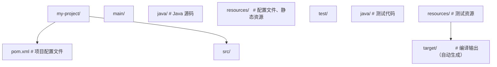
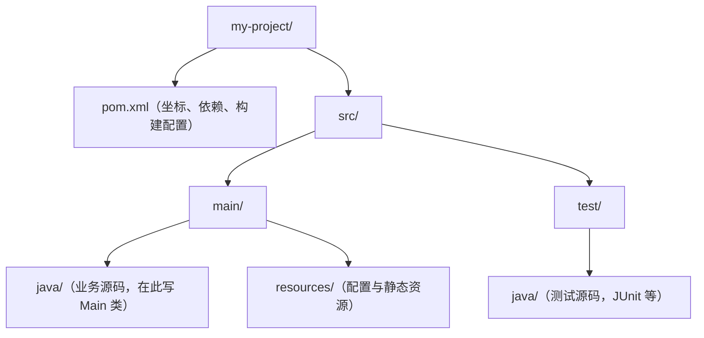

## 前置知识

- [Java JDBC 数据库连接](/java/075-JDBCDatabaseConnection)：建议先完成前一篇的学习

## 学习目标

- 掌握「0. 本节阅读指引（先读这一节）」的核心机制、典型用法与常见陷阱
- 掌握「概述」的核心机制、典型用法与常见陷阱
- 掌握「基础概念」的核心机制、典型用法与常见陷阱
- 掌握「快速上手」的核心机制、典型用法与常见陷阱
- 掌握「详细用法」的核心机制、典型用法与常见陷阱


## 0. 本节阅读指引（先读这一节）

本篇是「构建工具（Maven / Gradle）」，目标：会用 Maven 创建、编译、运行项目。

零基础第一遍只读：概述、基础概念、快速上手、详细用法；文末速查小节（Maven 常用命令、依赖 Scope、Gradle 常用命令等）当字典。

可跳过：进阶用法与多模块、发布构件等场景第二遍再看。

用 IDEA 图形化新建 Maven 项目的步骤在「快速上手 → 用 IDEA 新建 Maven 项目」，零基础第一遍建议直接按步骤操作一遍。

前置：001 Java 概述与开发环境。


## 概述

Java 构建工具负责管理项目的依赖、编译源码、运行测试、打包发布等一系列任务。没有构建工具时，你需要手动下载 jar 包、手动编译、手动组织目录结构，效率极低。构建工具把这些重复性工作自动化，让你专注于编写代码。

Java 生态中有两个主流构建工具：Maven 和 Gradle。Maven 是老牌工具，使用 XML 配置，约定严格，社区资源丰富；Gradle 是后起之秀，使用 Groovy/Kotlin DSL 配置，更灵活，构建速度更快。新项目可以根据团队偏好选择，两者都能胜任。

## 基础概念

### 依赖管理

Java 项目通常依赖大量第三方库（如 Spring、Jackson、MySQL 驱动等）。构建工具通过坐标（groupId、artifactId、version）从仓库（Maven Central 或私有仓库）自动下载这些依赖，并处理依赖之间的传递关系。

### 仓库

仓库是存放 jar 包的地方。Maven Central 是最大的公共仓库，几乎所有开源 Java 库都发布在这里。企业通常还会搭建私有仓库（如 Nexus、Artifactory）来存放内部组件。

### 生命周期

Maven 定义了标准的构建生命周期：validate -> compile -> test -> package -> verify -> install -> deploy。每个阶段由插件的具体目标（goal）实现。执行某个阶段时，它之前的所有阶段会自动执行。

### 多模块项目

大型项目通常拆分为多个模块（如 api、service、common），每个模块有独立的 pom.xml 或 build.gradle，但由父项目统一管理依赖版本和构建流程。

## 快速上手

### Maven 项目结构

Maven 约定了标准的目录结构：



### 用 IDEA 新建 Maven 项目（图形化步骤）

零基础卡住最多的地方不是 Maven 语法，而是"项目到底怎么建出来"。以下以 IntelliJ IDEA（2024+ 社区版/旗舰版均适用）为例：

1. 打开 IDEA，点击 **File → New → Project**；
2. 左侧选择 **New Project**，生成器选择 **Maven**（不要选 Maven Archetype，除非你明确知道要哪个模板）；
3. **Project SDK** 选择已安装的 JDK（如 21），Language 选 Java；
4. 填写 **Name**（项目名）与 **Location**（保存路径）；
5. 展开 **Advanced Settings**，填写坐标：**GroupId**（一般用反写域名，如 `com.example`）、**ArtifactId**（一般与项目名一致）；
6. 点击 **Create**，等待右下角 Maven 自动导入与依赖下载完成（首次可能需要几分钟）；
7. 在 `src/main/java` 下新建包与 `Main` 类，写 `main` 方法后，点击类名左侧绿色箭头直接 **Run**。

创建后的标准结构：



如果依赖下载慢/失败，或代码里报 `Cannot resolve symbol`：

1. 先点 Maven 工具窗口的 **Reload All Maven Projects**（刷新按钮）；
2. 下载慢就配置国内镜像（见本文件"常见场景 → 使用国内镜像加速"）；
3. 仍不行就 **File → Invalidate Caches → Invalidate and Restart**。

### 最简 pom.xml

```xml
<?xml version="1.0" encoding="UTF-8"?>
<project xmlns="http://maven.apache.org/POM/4.0.0"
         xmlns:xsi="http://www.w3.org/2001/XMLSchema-instance"
         xsi:schemaLocation="http://maven.apache.org/POM/4.0.0
         http://maven.apache.org/xsd/maven-4.0.0.xsd">
    <modelVersion>4.0.0</modelVersion>

    <!-- 项目坐标 -->
    <groupId>com.example</groupId>
    <artifactId>my-project</artifactId>
    <version>1.0.0</version>
    <packaging>jar</packaging>

    <!-- 继承 Spring Boot 父项目，获得默认配置和依赖版本管理 -->
    <parent>
        <groupId>org.springframework.boot</groupId>
        <artifactId>spring-boot-starter-parent</artifactId>
        <version>3.2.0</version>
    </parent>

    <dependencies>
        <!-- Spring Boot Web Starter -->
        <dependency>
            <groupId>org.springframework.boot</groupId>
            <artifactId>spring-boot-starter-web</artifactId>
        </dependency>
    </dependencies>
</project>
```

### 常用 Maven 命令

```bash
# 编译项目
mvn compile

# 运行测试
mvn test

# 打包（编译 + 测试 + 生成 jar）
mvn package

# 清理之前的构建结果
mvn clean

# 清理并打包（最常用）
mvn clean package

# 安装到本地仓库（供其他项目引用）
mvn install

# 跳过测试打包（紧急发布时使用）
mvn clean package -DskipTests

# 查看依赖树（排查依赖冲突）
mvn dependency:tree
```

## 详细用法

### 1. Maven 依赖管理

```xml
<dependencies>
    <!-- 基本依赖：groupId + artifactId + version -->
    <dependency>
        <groupId>com.google.guava</groupId>
        <artifactId>guava</artifactId>
        <version>33.0.0-jre</version>
    </dependency>

    <!-- scope 控制依赖的作用范围 -->
    <dependency>
        <groupId>junit</groupId>
        <artifactId>junit</artifactId>
        <version>5.10.0</version>
        <scope>test</scope>  <!-- 只在测试时使用，不会打包到最终 jar -->
    </dependency>

    <dependency>
        <groupId>javax.servlet</groupId>
        <artifactId>javax.servlet-api</artifactId>
        <version>4.0.1</version>
        <scope>provided</scope>  <!-- 由运行环境提供（如 Tomcat），不打包 -->
    </dependency>

    <!-- 排除传递依赖 -->
    <dependency>
        <groupId>com.example</groupId>
        <artifactId>some-library</artifactId>
        <version>1.0.0</version>
        <exclusions>
            <exclusion>
                <groupId>org.slf4j</groupId>
                <artifactId>slf4j-log4j12</artifactId>
                <!-- 排除这个传递依赖，避免与项目使用的日志框架冲突 -->
            </exclusion>
        </exclusions>
    </dependency>
</dependencies>
```

### 2. Maven 依赖版本管理

在多模块项目中，统一管理依赖版本很重要：

```xml
<!-- 在父 pom.xml 中使用 dependencyManagement 管理版本 -->
<dependencyManagement>
    <dependencies>
        <dependency>
            <groupId>com.google.guava</groupId>
            <artifactId>guava</artifactId>
            <version>33.0.0-jre</version>
        </dependency>
        <dependency>
            <groupId>org.apache.commons</groupId>
            <artifactId>commons-lang3</artifactId>
            <version>3.14.0</version>
        </dependency>
    </dependencies>
</dependencyManagement>

<!-- 子模块中不需要指定版本，统一使用父项目定义的版本 -->
<dependencies>
    <dependency>
        <groupId>com.google.guava</groupId>
        <artifactId>guava</artifactId>
        <!-- 不需要写 version，由父项目管理 -->
    </dependency>
</dependencies>
```

### 3. Maven 多模块项目

```xml
<!-- 父项目 pom.xml -->
<groupId>com.example</groupId>
<artifactId>my-project-parent</artifactId>
<version>1.0.0</version>
<packaging>pom</packaging>  <!-- 父项目的打包类型是 pom -->

<modules>
    <module>api</module>      <!-- API 模块 -->
    <module>service</module>  <!-- 业务逻辑模块 -->
    <module>common</module>   <!-- 公共工具模块 -->
</modules>
```

子模块的 pom.xml：

```xml
<!-- api/pom.xml -->
<parent>
    <groupId>com.example</groupId>
    <artifactId>my-project-parent</artifactId>
    <version>1.0.0</version>
</parent>

<artifactId>my-project-api</artifactId>

<dependencies>
    <!-- 依赖同项目的 common 模块 -->
    <dependency>
        <groupId>com.example</groupId>
        <artifactId>my-project-common</artifactId>
        <version>${project.version}</version>
    </dependency>
</dependencies>
```

### 4. Gradle 项目结构

Gradle 的项目结构与 Maven 相同，但配置文件是 build.gradle：

```groovy
// build.gradle
plugins {
    id 'java'
    id 'org.springframework.boot' version '3.2.0'
    id 'io.spring.dependency-management' version '1.1.4'
}

group = 'com.example'
version = '1.0.0'

java {
    sourceCompatibility = '17'  // Java 版本
}

// 仓库配置
repositories {
    mavenCentral()  // Maven Central 仓库
    // maven { url 'https://maven.aliyun.com/repository/public' }  // 阿里云镜像
}

// 依赖配置
dependencies {
    implementation 'org.springframework.boot:spring-boot-starter-web'
    implementation 'com.google.guava:guava:33.0.0-jre'
    testImplementation 'org.springframework.boot:spring-boot-starter-test'
}
```

### 5. Gradle 依赖范围

Gradle 的依赖范围比 Maven 更细粒度：

```groovy
dependencies {
    // implementation：编译和运行时都需要，但不会传递给依赖此模块的其他模块
    implementation 'com.google.guava:guava:33.0.0-jre'

    // api：编译和运行时都需要，且会传递给依赖此模块的其他模块
    api 'com.example:my-common-lib:1.0.0'

    // compileOnly：只在编译时需要，运行时由环境提供
    compileOnly 'org.projectlombok:lombok:1.18.30'

    // runtimeOnly：只在运行时需要，编译时不需要（如数据库驱动）
    runtimeOnly 'com.mysql:mysql-connector-j:8.3.0'

    // testImplementation：只在测试编译和运行时需要
    testImplementation 'org.junit.jupiter:junit-jupiter:5.10.0'

    // annotationProcessor：注解处理器（如 Lombok）
    annotationProcessor 'org.projectlombok:lombok:1.18.30'
}
```

### 6. Gradle 常用命令

```bash
# 编译项目
gradle build

# 清理构建结果
gradle clean

# 运行测试
gradle test

# 查看依赖树
gradle dependencies

# 刷新依赖（强制重新下载）
gradle build --refresh-dependencies

# 不运行测试打包
gradle build -x test
```

### 7. Gradle 多模块项目

```groovy
// settings.gradle（根目录）
rootProject.name = 'my-project'
include 'api', 'service', 'common'
```

```groovy
// api/build.gradle
dependencies {
    implementation project(':common')  // 依赖同项目的 common 模块
}
```

### 8. Maven 私有仓库配置

企业项目通常需要发布到私有仓库：

```xml
<!-- pom.xml 中配置分发管理 -->
<distributionManagement>
    <repository>
        <id>company-releases</id>
        <url>https://nexus.company.com/repository/releases/</url>
    </repository>
    <snapshotRepository>
        <id>company-snapshots</id>
        <url>https://nexus.company.com/repository/snapshots/</url>
    </snapshotRepository>
</distributionManagement>
```

```bash
# 发布到私有仓库
mvn deploy
```

## 常见场景

### 场景一：解决依赖冲突

当多个库间接依赖同一个库的不同版本时，会产生冲突：

```bash
# Maven：查看依赖树找到冲突
mvn dependency:tree -Dincludes=com.fasterxml.jackson.core:jackson-databind

# 找到冲突后，用 exclusion 排除不需要的版本
# 或者在 dependencyManagement 中强制指定版本
```

```groovy
// Gradle：查看依赖冲突
gradle dependencies --configuration runtimeClasspath

// 强制指定版本
configurations.all {
    resolutionStrategy {
        force 'com.fasterxml.jackson.core:jackson-databind:2.16.0'
    }
}
```

### 场景二：使用国内镜像加速

国内访问 Maven Central 较慢，可以配置阿里云镜像：

```xml
<!-- ~/.m2/settings.xml -->
<mirrors>
    <mirror>
        <id>aliyun</id>
        <mirrorOf>central</mirrorOf>
        <url>https://maven.aliyun.com/repository/public</url>
    </mirror>
</mirrors>
```

## 注意事项与常见错误

### 依赖范围不要搞错

Maven 的 scope 和 Gradle 的 configuration 容易混淆。最常见的错误是把应该用 implementation 的依赖写成了 api，导致依赖泄露，其他模块无意中依赖了不应该看到的内部库。

### SNAPSHOT 版本的风险

SNAPSHOT 版本是不稳定的开发版本，每次构建可能获取到不同的代码。生产环境绝不能依赖 SNAPSHOT 版本，应该使用正式发布的版本。

### 不要把构建工具的配置文件提交时忽略

target/ 和 build/ 目录应该加入 .gitignore，但 pom.xml、build.gradle、settings.gradle 必须提交到版本控制。

### Gradle Wrapper

使用 Gradle Wrapper 可以确保所有开发者使用相同的 Gradle 版本：

```bash
# 生成 Wrapper
gradle wrapper

# 使用 Wrapper 代替本地 Gradle
./gradlew build  # Linux/Mac
gradlew.bat build  # Windows
```

## 进阶用法

### Maven BOM 依赖管理

BOM（Bill of Materials）是一种特殊的 pom，只包含 dependencyManagement，用于统一管理一组相关依赖的版本：

```xml
<!-- 导入 Spring Cloud BOM -->
<dependencyManagement>
    <dependencies>
        <dependency>
            <groupId>org.springframework.cloud</groupId>
            <artifactId>spring-cloud-dependencies</artifactId>
            <version>2023.0.0</version>
            <type>pom</type>
            <scope>import</scope>
        </dependency>
    </dependencies>
</dependencyManagement>
```

### Gradle 构建缓存

Gradle 支持构建缓存，可以显著加快构建速度：

```groovy
// gradle.properties
org.gradle.caching=true        // 启用构建缓存
org.gradle.parallel=true       // 并行构建模块
org.gradle.jvmargs=-Xmx2g     // 增加 Gradle 的 JVM 内存
```

### 自定义 Maven 插件

当标准插件不满足需求时，可以编写自定义插件：

```xml
<!-- 使用 exec-maven-plugin 在构建时执行自定义命令 -->
<plugin>
    <groupId>org.codehaus.mojo</groupId>
    <artifactId>exec-maven-plugin</artifactId>
    <executions>
        <execution>
            <phase>generate-sources</phase>
            <goals>
                <goal>exec</goal>
            </goals>
            <configuration>
                <executable>npm</executable>
                <arguments>
                    <argument>run</argument>
                    <argument>build</argument>
                </arguments>
            </configuration>
        </execution>
    </executions>
</plugin>
```
## Maven 常用命令

**基本写法：清理构建产物**
`mvn clean`
```java
// 删除 target 目录，确保全新构建
mvn clean
```

---

**基本写法：编译主代码**
`mvn compile`
```java
// 编译 src/main/java 到 target/classes
mvn compile
```

---

**基本写法：编译测试代码**
`mvn test-compile`
```java
// 编译 src/test/java 到 target/test-classes
mvn test-compile
```

---

**基本写法：运行测试**
`mvn test`
```java
// 执行所有单元测试，报告输出到 target/surefire-reports
mvn test
```

---

**基本写法：打包**
`mvn package`
```java
// 打包为 jar/war，输出到 target/
mvn package
```

---

**基本写法：安装到本地仓库**
`mvn install`
```java
// 安装到 ~/.m2/repository 供其他本地项目依赖
mvn install
```

---

**基本写法：部署到远程仓库**
`mvn deploy`
```java
// 上传构件到 Nexus/Artifactory 等远程仓库
mvn deploy
```

---

**基本写法：跳过测试打包**
`mvn package -DskipTests`
```java
// 编译测试代码但不执行测试
mvn clean package -DskipTests
```

---

**基本写法：完全跳过测试**
`mvn package -Dmaven.test.skip=true`
```java
// 既不编译也不执行测试
mvn clean package -Dmaven.test.skip=true
```

---

**基本写法：激活 Profile**
`mvn package -P<profileId>`
```java
// 激活指定 profile 进行打包
mvn clean package -Pprod
```

---

**基本写法：离线构建**
`mvn -o <goal>`
```java
// 不访问远程仓库，仅使用本地依赖
mvn -o clean package
```

---

**基本写法：多线程构建**
`mvn -T <threads> <goal>`
```java
// 使用 4 线程并行构建
mvn -T 4 clean install
```

---

**基本写法：查看依赖树**
`mvn dependency:tree`
```java
// 排查依赖冲突必备
mvn dependency:tree
```

---

**基本写法：过滤依赖**
`mvn dependency:tree -Dincludes=<groupId>:<artifactId>`
```java
// 只查看指定依赖的引入路径
mvn dependency:tree -Dincludes=org.springframework:spring-core
```

---

**基本写法：分析依赖**
`mvn dependency:analyze`
```java
// 检查未使用与未声明依赖
mvn dependency:analyze
```

---

**基本写法：查看有效 POM**
`mvn help:effective-pom`
```java
// 输出合并父 POM 后的最终 POM
mvn help:effective-pom
```

---

**基本写法：创建项目骨架**
`mvn archetype:generate`
```java
// 交互式生成 Maven 项目结构
mvn archetype:generate -DgroupId=com.example -DartifactId=my-app -DarchetypeArtifactId=maven-archetype-quickstart -DinteractiveMode=false
```

---

**基本写法：Spring Boot 运行**
`mvn spring-boot:run`
```java
// 直接从源码启动 Spring Boot 应用
mvn spring-boot:run
```

---

**基本写法：多模块构建**
`mvn -pl <module> -am <goal>`
```java
// 只构建指定模块及其依赖模块
mvn -pl my-module -am clean install
```

---

## Maven 依赖 Scope

**基本写法：编译期依赖**
`<scope>compile</scope>`
```java
// 默认 scope，全阶段可用
<dependency>
    <groupId>org.springframework</groupId>
    <artifactId>spring-core</artifactId>
    <scope>compile</scope>
</dependency>
```

---

**基本写法：测试期依赖**
`<scope>test</scope>`
```java
// 仅测试阶段可用
<dependency>
    <groupId>junit</groupId>
    <artifactId>junit</artifactId>
    <scope>test</scope>
</dependency>
```

---

**基本写法：已提供依赖**
`<scope>provided</scope>`
```java
// 编译测试可用，打包时不包含（由容器提供）
<dependency>
    <groupId>jakarta.servlet</groupId>
    <artifactId>jakarta.servlet-api</artifactId>
    <scope>provided</scope>
</dependency>
```

---

**基本写法：运行时依赖**
`<scope>runtime</scope>`
```java
// 编译不需要，运行时需要
<dependency>
    <groupId>mysql</groupId>
    <artifactId>mysql-connector-java</artifactId>
    <scope>runtime</scope>
</dependency>
```

---

## Gradle 常用命令

**基本写法：列出所有任务**
`./gradlew tasks`
```java
// 查看项目可用的所有 Gradle 任务
./gradlew tasks
```

---

**基本写法：清理构建**
`./gradlew clean`
```java
// 删除 build 目录
./gradlew clean
```

---

**基本写法：编译代码**
`./gradlew build`
```java
// 完整构建（编译、测试、打包）
./gradlew build
```

---

**基本写法：跳过测试构建**
`./gradlew build -x test`
```java
// 排除 test 任务
./gradlew build -x test
```

---

**基本写法：运行测试**
`./gradlew test`
```java
// 执行所有测试
./gradlew test
```

---

**基本写法：运行指定测试类**
`./gradlew test --tests <类名>`
```java
// 只运行某个测试类
./gradlew test --tests com.example.UserServiceTest
```

---

**基本写法：运行 Spring Boot**
`./gradlew bootRun`
```java
// 启动 Spring Boot 应用
./gradlew bootRun
```

---

**基本写法：打包**
`./gradlew bootJar`
```java
// 生成可执行 fat jar
./gradlew bootJar
```

---

**基本写法：查看依赖树**
`./gradlew dependencies`
```java
// 打印项目依赖树
./gradlew dependencies
```

---

**基本写法：查看指定配置的依赖**
`./gradlew dependencies --configuration <配置>`
```java
// 只查看 runtimeClasspath 的依赖
./gradlew dependencies --configuration runtimeClasspath
```

---

**基本写法：依赖分析**
`./gradlew dependencyInsight --dependency <名称>`
```java
// 查看某个依赖的详细解析过程
./gradlew dependencyInsight --dependency spring-core
```

---

**基本写法：刷新依赖**
`./gradlew --refresh-dependencies build`
```java
// 强制重新下载依赖
./gradlew --refresh-dependencies build
```

---

**基本写法：并行构建**
`./gradlew build --parallel`
```java
// 多模块并行构建
./gradlew build --parallel
```

---

**基本写法：构建缓存**
`./gradlew build --build-cache`
```java
// 启用 Gradle 构建缓存
./gradlew build --build-cache
```

---

**基本写法：查看任务详情**
`./gradlew help --task <任务名>`
```java
// 查看某任务的描述与依赖
./gradlew help --task build
```

---

**基本写法：初始化 Wrapper**
`gradle wrapper --gradle-version <版本>`
```java
// 生成 gradlew 脚本，统一团队 Gradle 版本
gradle wrapper --gradle-version 8.5
```

---

## build.gradle 关键配置

**基本写法：插件声明**
`plugins { id '<plugin>' version '<version>' }`
```java
// Groovy DSL 声明插件
plugins {
    id 'org.springframework.boot' version '3.2.0'
    id 'java'
}
```

---

**基本写法：依赖声明**
`implementation '<group>:<name>:<version>'`
```java
// Groovy DSL 添加依赖
dependencies {
    implementation 'org.springframework.boot:spring-boot-starter-web:3.2.0'
    testImplementation 'org.junit.jupiter:junit-jupiter:5.12.1'
}
```

---

**基本写法：Kotlin DSL 依赖**
`implementation("<group>:<name>:<version>")`
```java
// build.gradle.kts 写法
dependencies {
    implementation("org.springframework.boot:spring-boot-starter-web:3.2.0")
    testImplementation("org.junit.jupiter:junit-jupiter:5.12.1")
}
```

---

**基本写法：Java 版本配置**
`java { sourceCompatibility = JavaVersion.VERSION_17 }`
```java
// 指定编译目标版本
java {
    sourceCompatibility = JavaVersion.VERSION_17
    targetCompatibility = JavaVersion.VERSION_17
}
```

---

**基本写法：仓库配置**
`repositories { mavenCentral() }`
```java
// 配置依赖仓库
repositories {
    mavenCentral()
    maven { url 'https://maven.aliyun.com/repository/public' }
}
```

---

**基本写法：自定义任务**
`task <name> { doLast { ... } }`
```java
// Groovy DSL 定义任务
task printVersion {
    doLast {
        println "Project version: ${project.version}"
    }
}
```

---

## 仓库镜像配置

**基本写法：Maven 阿里云镜像**
`<mirror>` in settings.xml
```java
// ~/.m2/settings.xml 配置镜像加速
<mirror>
    <id>aliyun</id>
    <mirrorOf>central</mirrorOf>
    <url>https://maven.aliyun.com/repository/public</url>
</mirror>
```

---

**基本写法：Gradle 阿里云镜像**
`repositories { maven { url '...' } }`
```java
// settings.gradle 或 build.gradle 配置
repositories {
    maven { url 'https://maven.aliyun.com/repository/public' }
    mavenCentral()
}
```

---

## 版本管理

**基本写法：Maven 版本号约定**
`<major>.<minor>.<patch>-<qualifier>`
```java
// 语义化版本号约定
// 1.0.0-SNAPSHOT 快照版本
// 1.0.0-RELEASE 正式版本
```

---

**基本写法：Maven 版本更新检查**
`mvn versions:display-dependency-updates`
```java
// 列出可用的依赖新版本
mvn versions:display-dependency-updates
```

---

**基本写法：Gradle 版本目录**
`libs.versions.toml`
```java
// gradle/libs.versions.toml 集中管理版本
[versions]
junit = "5.12.1"
[libraries]
junit = { module = "org.junit.jupiter:junit-jupiter", version.ref = "junit" }
```

---

## 发布构件

**基本写法：Maven 发布到远程仓库**
`<distributionManagement>`
```java
// pom.xml 配置发布目标
<distributionManagement>
    <repository>
        <id>releases</id>
        <url>https://repo.example.com/releases</url>
    </repository>
</distributionManagement>
```

---

**基本写法：Gradle 发布**
`maven-publish` 插件
```java
// build.gradle 配置发布
publishing {
    publications {
        maven(MavenPublication) {
            from components.java
            groupId = 'com.example'
            artifactId = 'my-lib'
            version = '1.0.0'
        }
    }
}
```
