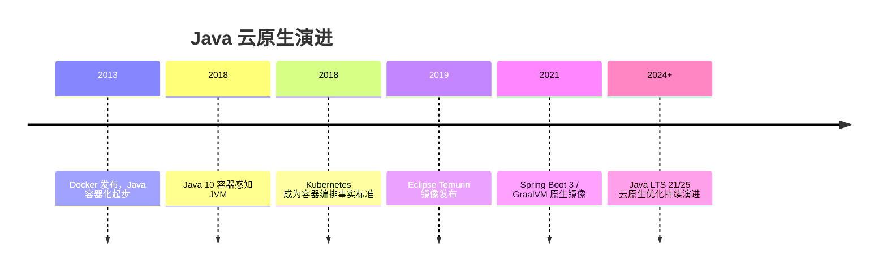

## 前置知识

- [Java 与 Docker](/java/095-JavaDocker)：建议先完成前一篇的学习

## 学习目标

- 掌握「0. 本节阅读指引（先读这一节）」的核心机制、典型用法与常见陷阱
- 掌握「1. 历史动机与发展脉络」的核心机制、典型用法与常见陷阱
- 掌握「2. 形式化定义」的核心机制、典型用法与常见陷阱
- 掌握「3. 理论推导与原理解析」的核心机制、典型用法与常见陷阱
- 掌握「4. 代码示例（带详尽注释）」的核心机制、典型用法与常见陷阱


## 0. 本节阅读指引（先读这一节）

本篇是「Java 与 Kubernetes」进阶文档。

第一遍只读：4. 代码示例（多阶段 Dockerfile、Deployment 清单）与 9. 知识要点总结；理解探针、优雅停机、滚动更新即可。

可跳过：1-3 节（历史、形式化、理论推导）与 5-8 节第二遍细读。

前置：092 Java 与 Docker。


## 1. 历史动机与发展脉络

Java 的“一次编写、到处运行”理念依赖 JVM，但传统部署中 Java 应用以 WAR 包部署到应用服务器（Tomcat、Jetty），环境差异与依赖冲突普遍存在。2013 年 Docker 兴起后，Java 应用开始容器化，但早期遇到两个典型问题：JVM 不感知容器 CPU/内存限制（导致 OOM 或被 cgroup 杀死），以及镜像体积过大（数百 MB 的 JDK 镜像）。

Java 10（2018）引入容器感知（`-XX:+UseContainerSupport` 默认开启），JVM 自动读取 cgroup 限制；Java 8 的 8u191+ 也通过 backport 支持。2019 年 Eclipse Adoptium 项目接管 OpenJDK 构建，发布 Eclipse Temurin 镜像。随后 jlink（Java 9+）支持定制最小运行时，Distroless 镜像与 GraalVM Native Image 进一步压缩体积。Kubernetes 2015 年开源后，Java 微服务成为其最典型的工作负载，Spring Boot 与 Spring Cloud Kubernetes 生态随之成熟。



## 2. 形式化定义

### 2.1 容器化定义

Java 应用的容器化是把 JVM 与应用程序封装进镜像，使其在任何符合 OCI 规范的运行时中一致运行。形式化表述：镜像 = 基础运行时（JRE）+ 应用制品（JAR）+ 启动配置（ENTRYPOINT）+ 元数据（ENV/EXPOSE/LABEL）。

### 2.2 Kubernetes 核心资源

Pod：调度与运行的最小单位，一个 Pod 可包含一个主容器与若干 sidecar 容器；

Deployment：声明式管理 Pod 副本、滚动更新与回滚；

Service：为 Pod 组提供稳定的虚拟 IP 与 DNS 负载均衡；

ConfigMap 与 Secret：把配置与敏感数据从镜像中剥离，挂载为环境变量或文件；

Ingress：七层 HTTP 路由，把外部流量分发到 Service；

HorizontalPodAutoscaler（HPA）：按 CPU/内存/自定义指标调整副本数。

### 2.3 探针定义

readinessProbe：就绪探针，失败时从 Service 端点摘除，但不重启容器；

livenessProbe：存活探针，失败时按 restartPolicy 重启容器；

startupProbe：启动探针，用于 JVM 冷启动较慢的应用，成功前不执行其他探针。


## 3. 理论推导与原理解析

### 3.1 JVM 与 cgroup 内存模型

JVM 的堆大小默认按物理内存的 1/4 计算。容器中物理内存是宿主机内存，若不感知 cgroup 限制，堆可能远超容器限额，触发 OOMKilled。容器感知开启后，JVM 读取 cgroup 内存上限，`-XX:MaxRAMPercentage=75` 表示堆上限为容器内存的 75%，为元空间、线程栈、直接内存等留出余量。

推导公式：容器内存限制 M，堆上限 H = M × MaxRAMPercentage。若 M=512Mi，H≈384Mi。应用实际使用中还应考虑：JVM 非堆（元空间、代码缓存）与 GC 开销通常占 25%-30%，因此 75% 是平衡值。

### 3.2 优雅停机推导

Kubernetes 滚动更新时向旧 Pod 发送 SIGTERM，等待 terminationGracePeriodSeconds（默认 30s）后发送 SIGKILL。Spring Boot 注册 shutdown hook，收到 SIGTERM 后停止接收新请求、完成进行中的请求（`server.shutdown=graceful` + `spring.lifecycle.timeout-per-shutdown-phase`）。若应用在期限内未退出，会被强杀，导致请求中断或数据不一致。

### 3.3 滚动更新推导

Deployment 的 RollingUpdate 策略：`maxSurge`（更新期间超出期望副本数的最大增量）与 `maxUnavailable`（允许不可用的最大副本数）共同控制更新速率。例如期望 3 副本、maxSurge=1、maxUnavailable=1：先起 1 个新 Pod，再停 1 个旧 Pod，交替直到全部更新。readinessProbe 决定新 Pod 是否加入 Service，从而避免流量打到未就绪实例。

## 4. 代码示例（带详尽注释）

### 4.1 多阶段 Dockerfile

```dockerfile
# 第一阶段：构建环境（包含完整 JDK 与构建工具）
FROM eclipse-temurin:21-jdk AS builder
WORKDIR /app

# 先复制构建描述文件，利用 Docker 层缓存
COPY pom.xml .
RUN mvn dependency:go-offline

# 复制源码并打包
COPY src ./src
RUN mvn package -DskipTests

# 第二阶段：运行环境（只包含 JRE，镜像更小）
FROM eclipse-temurin:21-jre
WORKDIR /app

# 从构建阶段复制 JAR 制品
COPY --from=builder /app/target/*.jar app.jar

# 容器感知 JVM 参数：堆上限为容器内存 75%
ENV JAVA_OPTS="-XX:MaxRAMPercentage=75 -XX:+UseContainerSupport"

# 非 root 用户运行，降低安全风险
RUN useradd -m appuser
USER appuser

EXPOSE 8080
ENTRYPOINT ["sh", "-c", "java $JAVA_OPTS -jar app.jar"]
```

讲解：多阶段构建把构建工具链与运行环境分离，最终镜像只含 JRE 与 JAR。`dependency:go-offline` 预下载依赖以利用缓存层；`USER appuser` 避免以 root 运行；`MaxRAMPercentage` 是容器 Java 的核心参数。

### 4.2 Deployment 清单

```yaml
apiVersion: apps/v1
kind: Deployment
metadata:
  name: order-service
  labels:
    app: order-service
spec:
  # 期望副本数
  replicas: 3
  selector:
    matchLabels:
      app: order-service
  strategy:
    type: RollingUpdate
    rollingUpdate:
      maxSurge: 1
      maxUnavailable: 1
  template:
    metadata:
      labels:
        app: order-service
    spec:
      containers:
        - name: order-service
          image: registry.example.com/order-service:1.4.2
          ports:
            - containerPort: 8080
          # 资源请求与限制：调度依据与上限保护
          resources:
            requests:
              cpu: 500m
              memory: 512Mi
            limits:
              cpu: "1"
              memory: 768Mi
          env:
            # 环境变量注入配置中心地址
            - name: SPRING_PROFILES_ACTIVE
              value: prod
            - name: CONFIG_SERVER_URL
              valueFrom:
                configMapKeyRef:
                  name: app-config
                  key: config-server-url
          # 就绪探针：/actuator/health 返回 200 才接收流量
          readinessProbe:
            httpGet:
              path: /actuator/health
              port: 8080
            initialDelaySeconds: 20
            periodSeconds: 10
          # 存活探针：健康检查持续失败则重启
          livenessProbe:
            httpGet:
              path: /actuator/health/liveness
              port: 8080
            initialDelaySeconds: 60
            periodSeconds: 15
          # 启动探针：JVM 冷启动慢，先放宽等待
          startupProbe:
            httpGet:
              path: /actuator/health/readiness
              port: 8080
            failureThreshold: 30
            periodSeconds: 5
```

讲解：该清单是 Java 服务的标准模板。resources 的 limits 与 JVM 的 `MaxRAMPercentage` 必须联动（内存限制 768Mi 时 JVM 堆约 576Mi）；三个探针分工明确，避免滚动更新期间流量中断与故障实例无法恢复。

### 4.3 Service 与 Ingress

```yaml
apiVersion: v1
kind: Service
metadata:
  name: order-service
spec:
  # 选择器与 Deployment 的 Pod 标签一致
  selector:
    app: order-service
  ports:
    - port: 80
      targetPort: 8080
  type: ClusterIP
---
apiVersion: networking.k8s.io/v1
kind: Ingress
metadata:
  name: order-service
spec:
  rules:
    - host: orders.example.com
      http:
        paths:
          - path: /
            pathType: Prefix
            backend:
              service:
                name: order-service
                port:
                  number: 80
```

讲解：Service 提供集群内稳定的访问入口；Ingress 负责外部 HTTP 路由、TLS 终止与路径转发。`targetPort` 指向容器端口 8080，Service 端口 80 是集群内虚拟端口。

### 4.4 ConfigMap 与 Secret

```yaml
apiVersion: v1
kind: ConfigMap
metadata:
  name: app-config
data:
  config-server-url: http://config-server:8888
  log-level: INFO
---
apiVersion: v1
kind: Secret
metadata:
  name: db-secret
type: Opaque
stringData:
  db-password: change-me
```

讲解：配置与敏感信息从镜像剥离，镜像因此可在多环境复用。Secret 的 value 以 base64 存储（并非加密），生产环境应配合外部密钥管理（如 External Secrets Operator、Vault）。

### 4.5 HPA 自动扩缩容

```yaml
apiVersion: autoscaling/v2
kind: HorizontalPodAutoscaler
metadata:
  name: order-service
spec:
  scaleTargetRef:
    apiVersion: apps/v1
    kind: Deployment
    name: order-service
  minReplicas: 2
  maxReplicas: 10
  metrics:
    - type: Resource
      resource:
        name: cpu
        target:
          type: Utilization
          averageUtilization: 60
```

讲解：HPA 按平均 CPU 利用率 60% 调整副本数。Java 应用扩缩容时注意：JVM 冷启动慢，建议配合 startupProbe 与就绪探针，避免扩容期间流量损失。

### 4.6 Spring Boot 优雅停机配置

```yaml
# application.yml
server:
  shutdown: graceful

spring:
  lifecycle:
    timeout-per-shutdown-phase: 20s
```

讲解：`server.shutdown=graceful` 让 Web 容器停止接收新请求并等待进行中请求完成；`timeout-per-shutdown-phase` 限制最长等待，避免无限挂起。该配置必须与 Pod 的 `terminationGracePeriodSeconds`（默认 30s）协调：停机等待应小于终止宽限期。

### 4.7 Java 代码中的优雅停机

```java
// 应用关闭时执行清理：释放连接、保存状态
@Component
public class GracefulShutdownListener {

    // Spring Boot 关闭前回调
    @PreDestroy
    public void onShutdown() {
        System.out.println("收到停机信号，清理资源...");
        // 关闭数据库连接池、取消定时任务等
    }
}
```

讲解：`@PreDestroy` 回调在 Spring 容器关闭时执行。配合 SIGTERM，Pod 删除时应用先清理资源再退出，避免强制杀死导致的数据损坏。

## 5. 对比分析

### 5.1 部署形态对比

| 维度 | 传统虚拟机部署 | Docker 容器 | Kubernetes |
| --- | --- | --- | --- |
| 环境一致性 | 依赖配置管理 | 镜像级一致 | 镜像 + 声明式清单 |
| 扩缩容 | 手工/脚本 | 单机编排 | 自动调度与 HPA |
| 故障恢复 | 手工重启 | 单机守护 | 自愈与滚动更新 |
| 运维成本 | 高 | 中 | 需要集群管理 |

### 5.2 镜像方案对比

| 方案 | 体积 | 启动速度 | 适用 |
| --- | --- | --- | --- |
| 完整 JDK 镜像 | 大（300MB+） | 一般 | 开发调试 |
| JRE + jlink 定制 | 中（80-150MB） | 一般 | 生产常规 |
| Distroless | 小（50-100MB） | 一般 | 安全敏感生产 |
| GraalVM Native | 极小（30-60MB） | 极快（毫秒级） | 无反射/低内存场景 |

### 5.3 探针组合对比

只配 liveness 不配 readiness：滚动更新时新 Pod 未就绪就接收流量，导致 502；只配 readiness 不配 liveness：死锁应用永远不被重启。三探针齐备是生产基线。

## 6. 常见陷阱与最佳实践

陷阱一：JVM 堆按宿主机内存计算，容器内 OOM。最佳实践：`-XX:MaxRAMPercentage=75` 并保持 resources.limits.memory 与之一致。

陷阱二：镜像以 root 运行。最佳实践：创建专用用户，最小权限运行。

陷阱三：探针路径使用应用默认端点而非专门的健康端点。Spring Boot 应引入 actuator 并区分 liveness/readiness 端点。

陷阱四：terminationGracePeriodSeconds 小于 Spring 优雅停机时间，导致请求被强杀。最佳实践：停机宽限 > 请求最大处理时间。

陷阱五：把数据库密码写进镜像或 ConfigMap 明文。最佳实践：Secret + 外部密钥管理。

陷阱六：滚动更新时 maxUnavailable=0 且 maxSurge=0，更新被卡死。最佳实践：至少允许一个额外 Pod。

陷阱七：HPA 与 JVM 堆固定值冲突（堆按启动时容器限制计算，扩缩容后实例规格不变则无问题；但限制变化需重启）。理解 HPA 只调副本数，不调整单实例规格。

## 7. 工程实践

### 7.1 CI/CD 流水线

```yaml
# .github/workflows/deploy.yml 片段
jobs:
  build:
    steps:
      - uses: actions/checkout@v4
      # 构建镜像并推送
      - run: docker build -t registry.example.com/order-service:${{ github.sha }} .
      - run: docker push registry.example.com/order-service:${{ github.sha }}
      # 更新清单中的镜像版本并部署
      - run: kubectl set image deployment/order-service order-service=registry.example.com/order-service:${{ github.sha }}
```

讲解：镜像 tag 使用 commit SHA 保证可追溯；`kubectl set image` 触发滚动更新。生产环境应增加镜像签名、漏洞扫描与金丝雀验证阶段。

### 7.2 可观测性接入

```xml
<!-- pom.xml：Micrometer 指标与 Prometheus 暴露 -->
<dependency>
    <groupId>io.micrometer</groupId>
    <artifactId>micrometer-registry-prometheus</artifactId>
</dependency>
```

```yaml
# Prometheus 抓取配置
annotations:
  prometheus.io/scrape: "true"
  prometheus.io/path: "/actuator/prometheus"
  prometheus.io/port: "8080"
```

讲解：Java 应用通过 Micrometer 输出 JVM 指标（堆内存、GC、线程），Prometheus 按注解抓取。配合 Grafana 仪表盘与告警规则，形成完整可观测性。

## 8. 案例研究：订单服务的云原生改造

需求：把单体订单服务改造为 Kubernetes 部署，要求：滚动更新零中断、自动扩缩容、配置外置、优雅停机。

改造步骤：

第一步，Spring Boot 引入 actuator 并配置健康端点与优雅停机；

第二步，编写多阶段 Dockerfile（Temurin 21 JRE，非 root）；

第三步，编写 Deployment/Service/Ingress 清单，配置三探针与资源限制；

第四步，配置 ConfigMap/Secret，把配置与密码移出镜像；

第五步，创建 HPA（CPU 60%，2-10 副本）；

第六步，接入 Prometheus 指标与告警；

第七步，CI 构建镜像、冒烟测试、滚动发布。

验证要点：滚动发布期间压测观察错误率（应为 0）；模拟 Pod 崩溃观察自动重启；模拟流量高峰观察 HPA 扩容；删除 Pod 观察优雅停机日志与连接清理。

## 9. 知识要点总结与深入讲解

Java 上 Kubernetes 的三个关键数字：`MaxRAMPercentage=75`（堆占容器内存比例）、`terminationGracePeriodSeconds > 优雅停机超时`、`readiness 先行、liveness 兜底`。理解这三个数字，就掌握了 Java 容器化的主线。

镜像分层与多阶段构建解决体积与安全问题；ConfigMap/Secret 解决配置外置；探针解决流量与自愈；HPA 解决弹性。每一层都对应一个明确的运维问题。

### 概述

Kubernetes 是容器编排的事实标准，Java 应用的云原生部署需要关注资源限制、健康检查、优雅停机和自动伸缩等方面。本文介绍 Java 应用在 Kubernetes 上的部署最佳实践，包括 Deployment 配置、服务发现、配置管理和监控集成。

### 基础概念

#### Kubernetes 核心资源

| 资源       | 说明                            |
| ---------- | ------------------------------- |
| Deployment | 管理无状态应用，控制 Pod 副本数 |
| Service    | 为 Pod 提供稳定的访问入口       |
| ConfigMap  | 存储非敏感配置信息              |
| Secret     | 存储敏感信息（密码、密钥）      |
| HPA        | 水平 Pod 自动伸缩器             |
| Ingress    | HTTP 路由和 TLS 终止            |

#### Java 容器化关键点

- JVM 需要正确识别容器的 CPU 和内存限制
- 合理设置堆内存，避免 OOM Killed
- 配置健康检查端点
- 实现优雅停机，确保请求处理完成

### 快速上手

#### Deployment 配置

```yaml
apiVersion: apps/v1
kind: Deployment
metadata:
  name: myapp
  labels:
    app: myapp
spec:
  replicas: 3
  selector:
    matchLabels:
      app: myapp
  template:
    metadata:
      labels:
        app: myapp
    spec:
      containers:
        - name: myapp
          image: registry.example.com/myapp:1.0
          ports:
            - containerPort: 8080
          resources:
            requests:
              memory: '512Mi'
              cpu: '500m'
            limits:
              memory: '1Gi'
              cpu: '1000m'
          env:
            - name: JAVA_OPTS
              value: '-XX:MaxRAMPercentage=75.0 -XX:+UseG1GC'
            - name: SPRING_PROFILES_ACTIVE
              value: 'prod'
```

#### Service 与 Ingress

```yaml
# Service：集群内部访问
apiVersion: v1
kind: Service
metadata:
  name: myapp-service
spec:
  selector:
    app: myapp
  ports:
    - port: 80
      targetPort: 8080
  type: ClusterIP

---
# Ingress：外部访问入口
apiVersion: networking.k8s.io/v1
kind: Ingress
metadata:
  name: myapp-ingress
  annotations:
    nginx.ingress.kubernetes.io/ssl-redirect: 'true'
spec:
  tls:
    - hosts:
        - myapp.example.com
      secretName: myapp-tls
  rules:
    - host: myapp.example.com
      http:
        paths:
          - path: /
            pathType: Prefix
            backend:
              service:
                name: myapp-service
                port:
                  number: 80
```

### 详细用法

#### 健康检查

```yaml
# 配置存活和就绪探针
apiVersion: apps/v1
kind: Deployment
metadata:
  name: myapp
spec:
  template:
    spec:
      containers:
        - name: myapp
          image: myapp:latest
          # 存活探针：检测应用是否卡死
          livenessProbe:
            httpGet:
              path: /actuator/health/liveness
              port: 8080
            initialDelaySeconds: 60
            periodSeconds: 30
            failureThreshold: 3
          # 就绪探针：检测应用是否就绪
          readinessProbe:
            httpGet:
              path: /actuator/health/readiness
              port: 8080
            initialDelaySeconds: 30
            periodSeconds: 10
```

```java
// Spring Boot 健康检查端点
@RestController
@RequestMapping("/actuator/health")
public class HealthController {
    @GetMapping("/liveness")
    public Map<String, String> liveness() {
        return Map.of("status", "UP");
    }

    @GetMapping("/readiness")
    public Map<String, String> readiness() {
        // 检查数据库连接等依赖是否就绪
        boolean dbReady = dataSource.getConnection().isValid(1);
        return Map.of("status", dbReady ? "UP" : "DOWN");
    }
}
```

#### 配置管理

```yaml
# ConfigMap：存储配置
apiVersion: v1
kind: ConfigMap
metadata:
  name: myapp-config
data:
  application.yml: |
    server:
      port: 8080
    spring:
      datasource:
        url: jdbc:postgresql://db-service:5432/mydb
    logging:
      level:
        com.example: DEBUG

---
# Secret：存储敏感信息
apiVersion: v1
kind: Secret
metadata:
  name: myapp-secret
type: Opaque
data:
  db-password: c2VjcmV0 # base64 编码
  api-key: YXBpLWtleQ==
```

```yaml
# 在 Deployment 中引用配置
spec:
  containers:
    - name: myapp
      envFrom:
        - configMapRef:
            name: myapp-config
        - secretRef:
            name: myapp-secret
      volumeMounts:
        - name: config-volume
          mountPath: /config
  volumes:
    - name: config-volume
      configMap:
        name: myapp-config
```

#### 优雅停机

```yaml
# 配置优雅停机
spec:
  template:
    spec:
      terminationGracePeriodSeconds: 60 # 最多等待 60 秒
      containers:
        - name: myapp
          lifecycle:
            preStop:
              exec:
                command: ['sh', '-c', 'sleep 10'] # 等待 Service 摘除
```

```yaml
# Spring Boot 优雅停机配置
# application.yml
server:
  shutdown: graceful # 启用优雅停机
spring:
  lifecycle:
    timeout-per-shutdown-phase: 30s # 最多等待 30 秒
```

### 常见场景

#### HPA 自动伸缩

```yaml
# 基于 CPU 使用率自动伸缩
apiVersion: autoscaling/v2
kind: HorizontalPodAutoscaler
metadata:
  name: myapp-hpa
spec:
  scaleTargetRef:
    apiVersion: apps/v1
    kind: Deployment
    name: myapp
  minReplicas: 2
  maxReplicas: 10
  metrics:
    - type: Resource
      resource:
        name: cpu
        target:
          type: Utilization
          averageUtilization: 70
    - type: Resource
      resource:
        name: memory
        target:
          type: Utilization
          averageUtilization: 80
  behavior:
    scaleDown:
      stabilizationWindowSeconds: 300 # 缩容冷却期 5 分钟
    scaleUp:
      stabilizationWindowSeconds: 60
```

#### Spring Cloud Kubernetes 服务发现

```yaml
# 使用 Kubernetes 原生服务发现替代 Eureka
# pom.xml 添加依赖
# spring-cloud-starter-kubernetes-client

# application.yml
spring:
  cloud:
    kubernetes:
      discovery:
        enabled: true
      config:
        enabled: true
        sources:
          - name: myapp-config
```

### 注意事项

- JVM 内存设置必须小于容器内存限制，留出堆外内存空间
- 使用 MaxRAMPercentage 代替硬编码 Xmx，适配不同规格的 Pod
- 初始延迟（initialDelaySeconds）应大于应用启动时间
- 优雅停机的超时时间应小于 terminationGracePeriodSeconds
- ConfigMap 更新后需要重启 Pod 才能生效，或使用 Spring Cloud Kubernetes 动态刷新
- 生产环境建议使用 PodDisruptionBudget 保证最小可用副本数

### 进阶用法

#### Init Container 初始化

```yaml
# 使用 Init Container 等待依赖服务就绪
spec:
  initContainers:
    - name: wait-for-db
      image: busybox
      command: ['sh', '-c', 'until nc -z db-service 5432; do echo waiting for db; sleep 2; done']
    - name: wait-for-redis
      image: busybox
      command:
        ['sh', '-c', 'until nc -z redis-service 6379; do echo waiting for redis; sleep 2; done']
  containers:
    - name: myapp
      image: myapp:latest
```

#### PodPreset 与 PodTemplate

```yaml
# 使用 PodDisruptionBudget 保证服务可用性
apiVersion: policy/v1
kind: PodDisruptionBudget
metadata:
  name: myapp-pdb
spec:
  minAvailable: 2 # 至少保持 2 个 Pod 可用
  selector:
    matchLabels:
      app: myapp
```

#### GraalVM Native Image 部署

```yaml
# Native Image 镜像部署，资源需求更低
spec:
  containers:
    - name: myapp-native
      image: myapp-native:latest
      resources:
        requests:
          memory: '64Mi' # Native Image 内存需求极低
          cpu: '100m'
        limits:
          memory: '128Mi'
          cpu: '500m'
      # Native Image 启动极快，缩短初始延迟
      livenessProbe:
        httpGet:
          path: /actuator/health/liveness
          port: 8080
        initialDelaySeconds: 5
```
