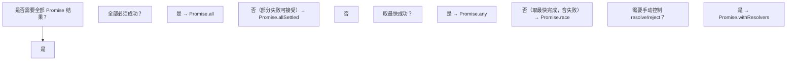

> 前置：先读 030 异步编程，掌握 Promise 基本用法。

# Promise 静态方法（Promise Static Methods）

## 前置知识

- [Promise 构造器](/javascript/026-PromiseConstructorDeepDive)：建议先完成前一篇的学习

## 学习目标

- 掌握「1. 历史动机与发展脉络（Historical Motivation & Evolution）」的核心机制、典型用法与常见陷阱
- 掌握「2. 形式化定义（Formal Definitions）」的核心机制、典型用法与常见陷阱
- 掌握「3. 理论推导与原理解析（Theoretical Derivation）」的核心机制、典型用法与常见陷阱
- 掌握「4. 代码示例（Production-Ready Examples）」的核心机制、典型用法与常见陷阱
- 掌握「5. 对比分析（Comparative Analysis）」的核心机制、典型用法与常见陷阱


> 本篇对标 MIT 6.005（Software Construction）、Stanford CS110L（Safety in Systems Programming）与 CMU 15-440（Distributed Systems）教学水准，系统讲授 JavaScript Promise 的形式语义、静态方法族（`Promise.all` / `Promise.allSettled` / `Promise.any` / `Promise.race` / `Promise.withResolvers`）、组合子数学性质与工程化应用。所有数学公式使用 KaTeX 渲染，参考文献采用 ACM Reference Format。

---

## 1. 历史动机与发展脉络（Historical Motivation & Evolution）

### 1.1 回调地狱与 Promise 的诞生（2007–2011）

JavaScript 长期依赖回调（callback）处理异步操作。深层嵌套的回调导致著名的"回调金字塔"（Pyramid of Doom）：

```javascript
// ES3 — 回调地狱
fetchUser(userId, function (err, user) {
  if (err) return handleError(err);
  fetchPosts(user.id, function (err, posts) {
    if (err) return handleError(err);
    fetchComments(posts[0].id, function (err, comments) {
      if (err) return handleError(err);
      render(user, posts, comments);
    });
  });
});
```

为解决此问题，**CommonJS Promises/A** 规范（2009，Kris Zyp）首次提出 Promise 的标准化建议。随后 **Promises/A+** 规范（2012，Brian Cavalier）完善了 `then` 的语义，成为现代 Promise 的基石。

### 1.2 jQuery Deferred 与早期实践（2010–2013）

jQuery 1.5（2011）引入 `jQuery.Deferred`，提供 `done` / `fail` / `then` / `when` 等方法。虽然不完全符合 Promises/A+，但普及了 Promise 概念。Dojo、Q.js、When.js 等库相继出现。

**Q.js**（Kris Kowal, 2009）是首个完整实现 Promises/A 的库，提供 `Q.all` / `Q.spread` / `Q.nfcall` 等组合子。

### 1.3 ES2015 标准化（2015）

ES2015（ES6）将 Promise 纳入语言标准，提供：

- `new Promise(executor)` 构造函数
- `Promise.prototype.then` / `catch` 实例方法
- `Promise.resolve` / `Promise.reject` 静态工厂
- `Promise.all` / `Promise.race` 静态组合子

ES2015 Promise 严格遵循 Promises/A+ 规范，并明确 `then` 回调作为微任务（microtask）执行。

### 1.4 allSettled 的引入（ES2020）

`Promise.all` 的 fail-fast 语义在"批量操作"场景下不够灵活——例如批量删除 1000 条记录时，希望收集所有成功与失败结果而非首次失败即中止。社区库（Q.js、Bluebird、ESLint）早已提供 `allSettled` / `settle` 等价方法。

ES2020（提案 stage 4，2019）正式标准化 `Promise.allSettled`，返回 `Array<{ status, value | reason }>`。

### 1.5 any 与 AggregateError（ES2021）

`Promise.race` 在"多源竞速"场景下会将"首次拒绝"作为结果，无法满足"取最快成功"语义。ES2021 引入 `Promise.any`：

- 任一 Promise 成功 → 立即 resolve
- 全部 Promise 失败 → reject 一个 `AggregateError`（包含 `errors` 数组）

`AggregateError` 是 `Error` 的子类，新增 `errors` 属性，由 ES2021 与 `Promise.any` 一同标准化。

### 1.6 withResolvers 的引入（ES2024）

传统 deferred 模式需在 executor 内提取 `resolve` / `reject`：

```javascript
// ES2015 — deferred 模式代码异味
let resolve, reject;
const promise = new Promise((res, rej) => {
  resolve = res;
  reject = rej;
});
```

此模式存在三个问题：
1. 变量提升与赋值时机依赖执行顺序
2. TypeScript 类型推断困难
3. 代码可读性差

ES2024（提案 stage 4，2023）引入 `Promise.withResolvers()`，返回 `{ promise, resolve, reject }` 三元组，使 deferred 模式成为语言一等公民。

### 1.7 跨语言对比

Promise 概念在多语言中演化：

- **Java**（2014）：`CompletableFuture`（JDK 8）
- **C#**（2012）：`Task` / `Task<T>`（.NET 4.5，async/await）
- **Python**（2014）：`asyncio.Future` 与 `async/await`（3.5）
- **Rust**（2019）：`Future` trait（0.3，零成本异步）
- **Scala**（2013）：`Future`（标准库）
- **Kotlin**（2018）：`Deferred`（coroutines）

JavaScript Promise 的独特性在于"thenable 协议"——任何带 `then` 方法的对象都被视为 Promise，便于跨库互操作。

---

## 2. 形式化定义（Formal Definitions）

### 2.1 Promise 的状态机

**定义 3.1.1（Promise 状态机）**：Promise 是一个三元组 $\mathcal{P} = (S, V, F)$，其中：

- $S \in \{ \text{pending}, \text{fulfilled}, \text{rejected} \}$ 是状态
- $V$ 是 fulfilled 时的值（value）
- $F$ 是 rejected 时的拒因（reason）

**状态转换**：

$$
\begin{aligned}
&\text{pending} \xrightarrow{\text{resolve}(v)} \text{fulfilled} \quad (V := v) \\
&\text{pending} \xrightarrow{\text{reject}(r)} \text{rejected} \quad (F := r) \\
&\text{fulfilled} \to \text{fulfilled} \quad (\text{不可逆}) \\
&\text{rejected} \to \text{rejected} \quad (\text{不可逆})
\end{aligned}
$$

**关键性质**：状态一旦从 pending 转为 fulfilled 或 rejected，即冻结（frozen），后续 `resolve` / `reject` 调用无效。

### 2.2 then 的形式语义

**定义 3.2.1（then 操作）**：`p.then(onFulfilled, onRejected)` 返回新 Promise $p'$，满足：

$$
p' = \begin{cases}
\text{pending} & \text{if } p \text{ is pending} \\
\text{Resolve}(p', \text{onFulfilled}(V_p)) & \text{if } p \text{ is fulfilled} \\
\text{Resolve}(p', \text{onRejected}(F_p)) & \text{if } p \text{ is rejected}
\end{cases}
$$

其中 $\text{Resolve}(p', x)$ 是 Promise Resolution Procedure（Promises/A+ §2.3）：

1. 若 $x$ 是 thenable，则 $p'$ 的状态跟随 $x$
2. 若 $x$ 是普通值，则 $p'$ fulfilled 为 $x$
3. 若 `onFulfilled` 或 `onRejected` 抛出异常 $e$，则 $p'$ rejected 为 $e$

### 2.3 Promise.all 的形式定义

**定义 3.3.1（Promise.all）**：给定 Iterable $\mathcal{I} = [p_1, p_2, \ldots, p_n]$，`Promise.all(\mathcal{I})` 返回 $P$，满足：

$$
P = \begin{cases}
\text{fulfilled with } [v_1, v_2, \ldots, v_n] & \text{if } \forall i, p_i \text{ fulfilled} \\
\text{rejected with } r_k & \text{where } k = \min\{i \mid p_i \text{ rejected}\}
\end{cases}
$$

**性质**：
- **fail-fast**：首个拒绝立即 reject，其他 Promise 仍执行但结果被丢弃
- **顺序保持**：结果数组顺序与输入顺序一致，无论完成顺序
- **空输入**：`Promise.all([])` 立即 fulfilled 为 `[]`

### 2.4 Promise.allSettled 的形式定义

**定义 3.4.1（Promise.allSettled）**：给定 Iterable $\mathcal{I}$，`Promise.allSettled(\mathcal{I})` 返回 $P$，满足：

$$
P = \text{fulfilled with } \left[ s(p_1), s(p_2), \ldots, s(p_n) \right]
$$

其中 $s(p)$ 是 $p$ 的结算状态：

$$
s(p) = \begin{cases}
\{ \text{status}: \text{fulfilled}, \text{value}: v \} & \text{if } p \text{ fulfilled with } v \\
\{ \text{status}: \text{rejected}, \text{reason}: r \} & \text{if } p \text{ rejected with } r
\end{cases}
$$

**性质**：
- **永不 reject**：即使所有 Promise 都失败，仍 fulfilled
- **顺序保持**：与输入顺序一致
- **空输入**：`Promise.allSettled([])` 立即 fulfilled 为 `[]`

### 2.5 Promise.race 的形式定义

**定义 3.5.1（Promise.race）**：给定 Iterable $\mathcal{I}$，`Promise.race(\mathcal{I})` 返回 $P$，满足：

$$
P = \text{settled with the same state as } p_k
$$

其中 $k = \min\{i \mid p_i \text{ settled}\}$，即首个 settle 的 Promise（无论 fulfilled 或 rejected）。

**性质**：
- **first-settled**：不区分成功失败
- **空输入**：`Promise.race([])` 永远 pending（永不 settle）

### 2.6 Promise.any 的形式定义

**定义 3.6.1（Promise.any）**：给定 Iterable $\mathcal{I}$，`Promise.any(\mathcal{I})` 返回 $P$，满足：

$$
P = \begin{cases}
\text{fulfilled with } v_k & \text{where } k = \min\{i \mid p_i \text{ fulfilled}\} \\
\text{rejected with } \text{AggregateError}([r_1, r_2, \ldots, r_n]) & \text{if } \forall i, p_i \text{ rejected}
\end{cases}
$$

**性质**：
- **first-success**：首个 fulfilled 立即 resolve
- **all-fail-reject**：仅当全部失败才 reject AggregateError
- **空输入**：`Promise.any([])` 立即 rejected with `AggregateError([])`

### 2.7 Promise.withResolvers 的形式定义

**定义 3.7.1（Promise.withResolvers）**：`Promise.withResolvers()` 返回三元组 $(p, \text{resolve}, \text{reject})$，其中：

- $p$ 是一个 pending Promise
- $\text{resolve}(v)$：将 $p$ 从 pending 转为 fulfilled with $v$
- $\text{reject}(r)$：将 $p$ 从 pending 转为 rejected with $r$

**等价定义**：

```javascript
// ES2024 — 形式等价实现
Promise.withResolvers = function () {
  let resolve, reject;
  const promise = new Promise((res, rej) => {
    resolve = res;
    reject = rej;
  });
  return { promise, resolve, reject };
};
```

---

## 3. 理论推导与原理解析（Theoretical Derivation）

### 3.1 Promise Resolution Procedure 的正确性

**定理 4.1.1**：Promise Resolution Procedure 保证 Promise 链不丢失异步性。

证明：考虑 `p.then(f).then(g)`：

1. 设 `p` fulfilled with $v_p$
2. `f(v_p)` 在微任务中执行，返回值 $x_f$
3. 若 $x_f$ 是 thenable，则 `p' = p.then(f)` 跟随 $x_f$，等待 $x_f$ settle
4. $x_f$ settle 后，`p'` settle，触发 `g` 在新微任务中执行

故 `g` 永远在 `f` 完成后执行，且永远异步（至少一个微任务延迟）。$\square$

### 3.2 Promise.all 的 fail-fast 正确性

**定理 4.2.1**：若输入中任一 Promise rejected，`Promise.all` 必 rejected，且 reject 时刻不晚于该 Promise reject 时刻。

证明：设 $p_k$ 在时刻 $t_k$ rejected with $r_k$。`Promise.all` 内部为每个 $p_i$ 注册 `then(onFulfilled, onRejected)` 回调。当 $p_k$ rejected 时，`onRejected` 在微任务中触发，立即调用 `reject(r_k)` 使 $P$ rejected。故 $P$ reject 时刻为 $t_k + \delta$（$\delta$ 为微任务调度延迟，约 0 ms）。$\square$

### 3.3 Promise.all 顺序保持证明

**定理 4.3.1**：`Promise.all([p1, p2, p3])` 的结果数组顺序与输入一致，无论 $p_i$ 完成顺序。

证明：`Promise.all` 内部维护 `results: Array(n)` 与 `count` 计数器。每个 $p_i$ 的 `then` 回调执行 `results[i] = value; count++; if (count === n) resolve(results)`。索引 $i$ 在 `then` 注册时确定（同步迭代 Iterable），与 $p_i$ 完成时刻无关。故结果顺序恒为输入顺序。$\square$

### 3.4 Promise.any 的成功短路性

**定理 4.4.1**：若输入中任一 Promise fulfilled，`Promise.any` 必 fulfilled，且 fulfill 时刻不晚于该 Promise fulfill 时刻。

证明：与 4.2 对偶。`Promise.any` 内部为每个 $p_i$ 注册 `then(onFulfilled, onRejected)`。任一 $p_k$ fulfilled 即触发 `resolve(value_k)` 使 $P$ fulfilled。仅当所有 $p_i$ rejected 才构造 `AggregateError` 并 reject。$\square$

### 3.5 Promise.race 的永 pending 性质

**定理 4.5.1**：`Promise.race([])` 永远 pending。

证明：`Promise.race` 同步迭代输入 Iterable。空 Iterable 不注册任何 `then` 回调，故 $P$ 的 `resolve` / `reject` 永不被调用，状态永久 pending。$\square$

**推论 4.5.1**：`Promise.race([])` 与 `new Promise(() => {})` 形式等价。

### 3.6 then 链的错误传播

**定理 4.6.1**：在 `p.then(f).then(g).catch(h)` 中，若 `f` 抛出异常 $e$，则 $e$ 跳过 `g` 直接被 `h` 捕获。

证明：`p.then(f)` 返回 $p_1$。若 `f` 抛 $e$，则 $p_1$ rejected with $e$。`p_1.then(g)` 中 `g` 是 onFulfilled 回调，仅当 $p_1$ fulfilled 时执行；$p_1$ rejected 时跳过 `g`，将 rejection 透传至 $p_2$。`p_2.catch(h)` 等价于 `p_2.then(undefined, h)`，`h` 捕获 rejection。$\square$

### 3.7 microtask 调度与 then 回调

**定理 4.7.1**：`then` 回调作为微任务（microtask）执行，晚于当前同步代码，早于下一个宏任务（macrotask）。

证明：由 HTML 规范 §8.1.6.3"Microtask performing"算法，`then` 回调入队 microtask queue。事件循环在每个宏任务后清空 microtask queue（详见"事件循环详解"篇）。$\square$

### 3.8 withResolvers 的等价性

**定理 4.8.1**：`Promise.withResolvers()` 与传统 deferred 模式行为完全等价。

证明：二者均构造一个 pending Promise 并暴露其 `resolve` / `reject`。`withResolvers` 的规范实现（ECMA-262 §27.2.4.5）：

1. Let C be the this value.
2. Let x be ? PromiseResolve(C, undefined).
3. Let promiseCapability be ? NewPromiseCapability(C).
4. Let result be OrdinaryObjectCreate(%Object.prototype%).
5. Perform ! CreateDataPropertyOrThrow(result, "promise", promiseCapability.[[Promise]]).
6. Perform ! CreateDataPropertyOrThrow(result, "resolve", promiseCapability.[[Resolve]]).
7. Perform ! CreateDataPropertyOrThrow(result, "reject", promiseCapability.[[Reject]]).
8. Return result.

此实现内部调用 `NewPromiseCapability`，与 `new Promise(executor)` 走相同的 capability 构造路径，故行为等价。$\square$

---

## 4. 代码示例（Production-Ready Examples）

### 4.1 工程项目配置

```json
{
  "name": "promise-static-methods",
  "version": "1.0.0",
  "type": "module",
  "engines": { "node": ">=20.0.0" },
  "scripts": {
    "start": "node src/index.js",
    "test": "node --test"
  }
}
```

### 4.2 Promise.all 基础用法

```javascript
// ES2015 — Promise.all 全部成功
async function fetchDashboardData(userId) {
  const [user, posts, comments] = await Promise.all([
    fetch(`/api/users/${userId}`).then((r) => r.json()),
    fetch(`/api/users/${userId}/posts`).then((r) => r.json()),
    fetch(`/api/users/${userId}/comments`).then((r) => r.json()),
  ]);
  return { user, posts, comments };
}

// 任一失败立即 reject，其他请求结果丢失
try {
  const data = await fetchDashboardData(123);
} catch (error) {
  console.error('Dashboard fetch failed:', error);
  // 即使 3 个请求中只有 1 个失败，其他 2 个成功的结果也无法获得
}
```

### 4.3 Promise.all 错误处理增强

```javascript
// ES2015 — 包装为永不 reject 的 Promise
function reflect(promise) {
  return promise.then(
    (value) => ({ status: 'fulfilled', value }),
    (reason) => ({ status: 'rejected', reason })
  );
}

// ES2020 — 使用 Promise.allSettled 替代 reflect + Promise.all
async function fetchAllSettled(urls) {
  const results = await Promise.allSettled(
    urls.map((url) => fetch(url).then((r) => r.json()))
  );

  const fulfilled = results
    .filter((r) => r.status === 'fulfilled')
    .map((r) => r.value);
  const rejected = results
    .filter((r) => r.status === 'rejected')
    .map((r) => r.reason);

  return { fulfilled, rejected, total: results.length };
}
```

### 4.4 Promise.allSettled 批量删除

```javascript
// ES2020 — 批量删除收集所有结果
async function batchDeleteItems(ids) {
  const results = await Promise.allSettled(
    ids.map((id) =>
      fetch(`/api/items/${id}`, { method: 'DELETE' }).then((r) => {
        if (!r.ok) throw new Error(`HTTP ${r.status}`);
        return r.json();
      })
    )
  );

  const succeeded = results
    .map((r, i) => ({ ...r, id: ids[i] }))
    .filter((r) => r.status === 'fulfilled')
    .map((r) => r.id);
  const failed = results
    .map((r, i) => ({ ...r, id: ids[i] }))
    .filter((r) => r.status === 'rejected')
    .map((r) => ({ id: r.id, reason: r.reason.message }));

  console.log(`成功: ${succeeded.length}, 失败: ${failed.length}`);
  return { succeeded, failed };
}

// 使用
const { succeeded, failed } = await batchDeleteItems([1, 2, 3, 4, 5]);
```

### 4.5 Promise.any 多源竞速

```javascript
// ES2021 — 多 CDN 竞速取最快成功
async function fetchFromFastestCDN(path) {
  const cdns = [
    'https://cdn1.example.com',
    'https://cdn2.example.com',
    'https://cdn3.example.com',
  ];

  try {
    const response = await Promise.any(
      cdns.map((cdn) =>
        fetch(`${cdn}${path}`).then((r) => {
          if (!r.ok) throw new Error(`HTTP ${r.status} from ${cdn}`);
          return r;
        })
      )
    );
    return await response.json();
  } catch (aggregateError) {
    console.error('All CDNs failed:');
    aggregateError.errors.forEach((err, i) => {
      console.error(`  CDN ${i + 1}:`, err.message);
    });
    throw new Error('All CDNs unavailable');
  }
}
```

### 4.6 Promise.race 超时控制

```javascript
// ES2015 — 超时控制
function fetchWithTimeout(url, options = {}, timeout = 5000) {
  const controller = new AbortController();
  const timeoutId = setTimeout(() => controller.abort(), timeout);

  return Promise.race([
    fetch(url, { ...options, signal: controller.signal }).finally(() =>
      clearTimeout(timeoutId)
    ),
    new Promise((_, reject) =>
      setTimeout(() => reject(new Error(`Timeout after ${timeout}ms`)), timeout)
    ),
  ]);
}

// 使用 AbortController 现代方案（推荐）
async function fetchWithTimeoutModern(url, options = {}, timeout = 5000) {
  const controller = new AbortController();
  const timeoutId = setTimeout(() => controller.abort(), timeout);
  try {
    return await fetch(url, { ...options, signal: controller.signal });
  } finally {
    clearTimeout(timeoutId);
  }
}
```

### 4.7 Promise.withResolvers 缓存模式

```javascript
// ES2024 — Promise 缓存避免重复请求
function createPromiseCache() {
  const cache = new Map();

  return function cachedFetch(url) {
    if (cache.has(url)) {
      return cache.get(url).promise;
    }

    const { promise, resolve, reject } = Promise.withResolvers();
    cache.set(url, { promise, resolve, reject });

    fetch(url)
      .then((r) => r.json())
      .then(resolve, reject)
      .finally(() => {
        // 可选：成功后清除缓存（避免内存泄漏）
        // cache.delete(url);
      });

    return promise;
  };
}

const cachedFetch = createPromiseCache();
// 多次调用同一 URL 只发起一次请求
await Promise.all([
  cachedFetch('/api/user/1'),
  cachedFetch('/api/user/1'),
  cachedFetch('/api/user/1'),
]);
```

### 4.8 Promise.withResolvers 事件转 Promise

```javascript
// ES2024 — 事件转 Promise
function once(emitter, eventName, options = {}) {
  const { timeout = 0, predicate } = options;
  const { promise, resolve, reject } = Promise.withResolvers();

  const handler = (...args) => {
    if (predicate && !predicate(...args)) return;
    emitter.off(eventName, handler);
    cleanup();
    resolve(args.length > 1 ? args : args[0]);
  };

  const onTimeout = () => {
    emitter.off(eventName, handler);
    reject(new Error(`Timeout waiting for ${eventName}`));
  };

  let timeoutId;
  if (timeout > 0) {
    timeoutId = setTimeout(onTimeout, timeout);
  }

  function cleanup() {
    if (timeoutId) clearTimeout(timeoutId);
  }

  emitter.once(eventName, handler);
  return promise;
}

// 使用
const ws = new WebSocket('wss://example.com');
const message = await once(ws, 'message', { timeout: 5000 });
console.log('First message:', message);
```

### 4.9 Promise.withResolvers 可取消任务

```javascript
// ES2024 — 可取消的异步任务
function createCancellableTask(asyncFn) {
  const { promise, resolve, reject } = Promise.withResolvers();
  let cancelled = false;
  let cleanupFn = null;

  const task = asyncFn({
    isCancelled: () => cancelled,
    onCleanup: (fn) => {
      cleanupFn = fn;
    },
  });

  task.then(
    (result) => {
      if (!cancelled) resolve(result);
      else cleanupFn?.();
    },
    (error) => {
      if (!cancelled) reject(error);
      else cleanupFn?.();
    }
  );

  return {
    promise,
    cancel() {
      cancelled = true;
      reject(new CancelError('Task cancelled'));
      cleanupFn?.();
    },
  };
}

class CancelError extends Error {
  constructor(message) {
    super(message);
    this.name = 'CancelError';
  }
}

// 使用
const task = createCancellableTask(async ({ isCancelled, onCleanup }) => {
  const chunks = [];
  const response = await fetch('/api/large-data');
  const reader = response.body.getReader();
  onCleanup(() => reader.cancel());

  while (true) {
    if (isCancelled()) throw new CancelError('Cancelled');
    const { done, value } = await reader.read();
    if (done) break;
    chunks.push(value);
  }
  return concatenate(chunks);
});

// 5 秒后取消
setTimeout(() => task.cancel(), 5000);

try {
  const data = await task.promise;
} catch (err) {
  if (err instanceof CancelError) console.log('任务已取消');
  else throw err;
}
```

### 4.10 并发限制调度器

```javascript
// ES2015 — pLimit 风格并发限制
function createConcurrencyLimiter(maxConcurrency) {
  const queue = [];
  let activeCount = 0;

  function next() {
    if (activeCount >= maxConcurrency || queue.length === 0) return;
    activeCount++;
    const { fn, resolve, reject } = queue.shift();
    fn()
      .then(resolve, reject)
      .finally(() => {
        activeCount--;
        next();
      });
  }

  return function limit(fn) {
    const { promise, resolve, reject } = Promise.withResolvers();
    queue.push({ fn, resolve, reject });
    next();
    return promise;
  };
}

// 使用
const limit = createConcurrencyLimiter(3); // 最大并发 3
const urls = Array.from({ length: 100 }, (_, i) => `/api/item/${i}`);

const results = await Promise.allSettled(
  urls.map((url) => limit(() => fetch(url).then((r) => r.json())))
);
```

### 4.11 带重试的请求

```javascript
// ES2015 — 指数退避重试
async function fetchWithRetry(url, options = {}, retries = 3, baseDelay = 1000) {
  let lastError;
  for (let attempt = 0; attempt <= retries; attempt++) {
    try {
      const response = await fetch(url, options);
      if (!response.ok && response.status >= 500 && attempt < retries) {
        throw new Error(`HTTP ${response.status}`);
      }
      return response;
    } catch (error) {
      lastError = error;
      if (attempt === retries) break;
      const delay = baseDelay * Math.pow(2, attempt) + Math.random() * 100;
      await new Promise((r) => setTimeout(r, delay));
    }
  }
  throw lastError;
}

// 配合 Promise.any 实现多源容错
async function fetchWithFailover(urls, options) {
  return Promise.any(
    urls.map((url) => fetchWithRetry(url, options, 2))
  );
}
```

### 4.12 Promise.all 顺序保持验证

```javascript
// ES2015 — 验证顺序保持
async function verifyOrderPreservation() {
  // 故意让后面的 Promise 先完成
  const promises = [
    new Promise((resolve) => setTimeout(() => resolve('first'), 300)),
    new Promise((resolve) => setTimeout(() => resolve('second'), 100)),
    new Promise((resolve) => setTimeout(() => resolve('third'), 200)),
  ];

  const results = await Promise.all(promises);
  console.log(results); // ['first', 'second', 'third'] — 顺序保持

  const settled = await Promise.allSettled(promises);
  console.log(settled.map((r) => r.value)); // ['first', 'second', 'third']
}
```

### 4.13 自定义 Promise 组合子

```javascript
// ES2015 — 函数式组合子
const PromiseCombinators = {
  // map：对每个 Promise 的结果应用函数
  map(promises, fn) {
    return Promise.all(promises.map((p) => p.then(fn)));
  },

  // filter：过滤 fulfilled Promise
  async filter(promises, predicate) {
    const settled = await Promise.allSettled(promises);
    const results = [];
    for (const r of settled) {
      if (r.status === 'fulfilled' && predicate(r.value)) {
        results.push(r.value);
      }
    }
    return results;
  },

  // partition：分离成功与失败
  async partition(promises) {
    const settled = await Promise.allSettled(promises);
    const fulfilled = [];
    const rejected = [];
    for (const r of settled) {
      if (r.status === 'fulfilled') fulfilled.push(r.value);
      else rejected.push(r.reason);
    }
    return { fulfilled, rejected };
  },

  // reduce：归约
  async reduce(promises, fn, initial) {
    const results = await Promise.all(promises);
    return results.reduce(fn, initial);
  },

  // forEach：串行执行
  async forEach(items, fn) {
    for (const item of items) {
      await fn(item);
    }
  },
};

// 使用
const urls = ['/api/1', '/api/2', '/api/3'];
const data = await PromiseCombinators.map(
  urls.map((u) => fetch(u).then((r) => r.json())),
  (item) => ({ ...item, fetchedAt: Date.now() })
);
```

---

## 5. 对比分析（Comparative Analysis）

### 5.1 与 TypeScript 对比

TypeScript 是 JavaScript 的超集，Promise 静态方法在类型层面有更严格约束：

```typescript
// TypeScript — Promise.all 类型推断
const [user, posts] = await Promise.all([
  fetchUser(), // Promise<User>
  fetchPosts(), // Promise<Post[]>
]);
// 类型自动推断为 [User, Post[]]

// Promise.allSettled 类型
type SettledResult<T> =
  | { status: 'fulfilled'; value: T }
  | { status: 'rejected'; reason: unknown };

declare function allSettled<T>(
  promises: Promise<T>[]
): Promise<SettledResult<T>[]>;

// Promise.withResolvers 类型（TS 5.4+）
declare function withResolvers<T>(): {
  promise: Promise<T>;
  resolve: (value: T | PromiseLike<T>) => void;
  reject: (reason?: unknown) => void;
};
```

TypeScript 的优势：
- 元组类型保持顺序（`Promise.all` 返回 `[T1, T2, T3]` 而非 `T[]`）
- `SettledResult<T>` 联合类型确保 `status` 与 `value`/`reason` 对应
- `withResolvers<T>()` 显式泛型避免 `unknown`

JavaScript 劣势：需运行时检查 `status` 字段，类型推断靠 JSDoc 或 TypeScript JSDoc。

### 5.2 与 Python asyncio 对比

Python `asyncio` 提供等价的组合子：

```python
# Python — asyncio 组合子
import asyncio

async def main():
    # 等价于 Promise.all
    results = await asyncio.gather(
        fetch_user(),
        fetch_posts(),
        fetch_comments(),
        return_exceptions=False,  # 默认 fail-fast
    )

    # 等价于 Promise.allSettled
    results = await asyncio.gather(
        fetch_user(),
        fetch_posts(),
        return_exceptions=True,  # 异常作为结果返回
    )

    # 等价于 Promise.any（Python 3.11+）
    result = await asyncio.wait_for(
        asyncio.gather(*tasks, return_exceptions=True),
        timeout=None,
    )

    # 等价于 Promise.race
    done, pending = await asyncio.wait(
        tasks, return_when=asyncio.FIRST_COMPLETED,
    )
    for task in pending:
        task.cancel()
```

差异分析：

| 维度 | JavaScript | Python |
|------|-----------|--------|
| fail-fast | `Promise.all` | `asyncio.gather(return_exceptions=False)` |
| wait-all | `Promise.allSettled` | `asyncio.gather(return_exceptions=True)` |
| first-success | `Promise.any` | 需手写（`asyncio` 无原生支持） |
| first-settled | `Promise.race` | `asyncio.wait(FIRST_COMPLETED)` |
| 取消语义 | 通过 `AbortController` | 原生 `Task.cancel()` + `CancelledError` |
| deferred | `Promise.withResolvers` | `asyncio.Future` + `set_result` |

Python 优势：原生取消语义（`Task.cancel()`），无需外部 `AbortController`。JavaScript 优势：thenable 协议跨库互操作。

### 5.3 与 Rust async 对比

Rust `Future` 是惰性的（lazy），需 `.await` 或 executor 驱动：

```rust
// Rust — futures 库组合子
use futures::future;

async fn main() {
    // 等价于 Promise.all
    let results = future::join_all(vec![
        fetch_user(),
        fetch_posts(),
    ]).await;

    // 等价于 Promise.all（元组版本，类型安全）
    let (user, posts) = future::join(fetch_user(), fetch_posts()).await;

    // 等价于 Promise.race
    let result = future::select(
        Box::pin(fetch_fast()),
        Box::pin(fetch_slow()),
    ).await;

    // 等价于 Promise.any（try_join_all + 容错）
    let results: Vec<_> = future::join_all(
        urls.iter().map(|u| fetch_url(u)),
    ).await;
}
```

Rust 优势：零成本异步（zero-cost abstraction）、编译期类型检查、`Result<T, E>` 强类型错误处理。JavaScript 优势：动态类型、thenable 协议、生态成熟。

### 5.4 与 Java CompletableFuture 对比

Java `CompletableFuture`（JDK 8+）提供丰富的组合子：

```java
// Java — CompletableFuture
import java.util.concurrent.CompletableFuture;

CompletableFuture<User> userFuture = fetchUser();
CompletableFuture<List<Post>> postsFuture = fetchPosts();

// 等价于 Promise.all
CompletableFuture.allOf(userFuture, postsFuture)
    .thenApply(v -> {
        User user = userFuture.join();
        List<Post> posts = postsFuture.join();
        return new Dashboard(user, posts);
    });

// 等价于 Promise.any
CompletableFuture.anyOf(
    fetchFromCDN1(),
    fetchFromCDN2()
).thenApply(result -> (Response) result);
```

差异：Java 需手动类型转换（`anyOf` 返回 `Object`），JavaScript `Promise.any` 保持类型推断（TypeScript 中）。

### 5.5 与 Go goroutine 对比

Go 不直接提供 Promise 抽象，而是通过 channel + goroutine 实现：

```go
// Go — channel 模式
func fetchAll(urls []string) []Result {
    results := make([]Result, len(urls))
    ch := make(chan struct {
        index  int
        result Result
    }, len(urls))

    for i, url := range urls {
        go func(idx int, u string) {
            result := fetch(u)
            ch <- struct {
                index  int
                result Result
            }{idx, result}
        }(i, url)
    }

    for i := 0; i < len(urls); i++ {
        r := <-ch
        results[r.index] = r.result
    }
    return results
}

// 等价于 Promise.race
func firstResponse(urls []string) Result {
    ch := make(chan Result, len(urls))
    for _, url := range urls {
        go func(u string) {
            ch <- fetch(u)
        }(url)
    }
    return <-ch // 第一个完成即返回
}
```

Go 优势：原生并发原语（goroutine 轻量、channel 类型安全）。JavaScript 优势：单线程模型简化心智负担，Promise API 更高阶。

### 5.6 综合对比表

| 特性 | JavaScript | TypeScript | Python | Rust | Java | Go |
|------|-----------|-----------|--------|------|------|-----|
| 标准 Promise | ES2015 | 超集 | asyncio.Future | Future trait | CompletableFuture | - |
| all | `Promise.all` | `Promise.all` | `gather` | `join_all` | `allOf` | 手写 |
| allSettled | `Promise.allSettled` | `Promise.allSettled` | `gather(return_exceptions=True)` | 手写 | 手写 | 手写 |
| any | `Promise.any` | `Promise.any` | 手写 | 手写 | `anyOf` | 手写 |
| race | `Promise.race` | `Promise.race` | `wait(FIRST_COMPLETED)` | `select` | `anyOf` | channel |
| withResolvers | `Promise.withResolvers` | `Promise.withResolvers` | `Future + set_result` | `oneshot` channel | `CompletableFuture` 构造 | channel |
| 取消 | `AbortController` | `AbortController` | `Task.cancel()` | `CancellationToken` | `cancel(true)` | `context.Cancel` |
| 类型安全 | 弱 | 强 | 弱 | 极强 | 中 | 中 |

---

## 6. 常见陷阱与最佳实践（Common Pitfalls & Best Practices）

### 6.1 陷阱：Promise.all 的 fail-fast 数据丢失

**错误**：

```javascript
// ES2015 — fail-fast 导致部分结果丢失
async function bad() {
  try {
    const [a, b, c] = await Promise.all([
      fetch('/api/a').then((r) => r.json()),
      fetch('/api/b').then((r) => r.json()), // 失败
      fetch('/api/c').then((r) => r.json()),
    ]);
    // a 和 c 的成功结果被丢弃！
  } catch (err) {
    console.error(err); // 只能拿到 b 的错误
  }
}
```

**修复**：使用 `Promise.allSettled` 或 reflect 包装。

```javascript
// ES2020 — 正确做法
async function good() {
  const results = await Promise.allSettled([
    fetch('/api/a').then((r) => r.json()),
    fetch('/api/b').then((r) => r.json()),
    fetch('/api/c').then((r) => r.json()),
  ]);
  const succeeded = results
    .filter((r) => r.status === 'fulfilled')
    .map((r) => r.value);
  // 即使 b 失败，a 和 c 仍可使用
}
```

### 6.2 陷阱：Promise.race 不取消其他 Promise

**错误**：

```javascript
// ES2015 — race 后其他 Promise 仍在执行
const slowRequest = fetch('/api/slow'); // 5 秒后完成
const fastRequest = fetch('/api/fast'); // 1 秒后完成

const winner = await Promise.race([slowRequest, fastRequest]);
// fastRequest 胜出，但 slowRequest 仍在后台执行，浪费带宽
```

**修复**：使用 `AbortController` 主动取消。

```javascript
// ES2017 — 主动取消
const controller = new AbortController();

const slowRequest = fetch('/api/slow', { signal: controller.signal });
const fastRequest = fetch('/api/fast', { signal: controller.signal });

try {
  const winner = await Promise.race([slowRequest, fastRequest]);
  controller.abort(); // 取消其他请求
} catch (err) {
  controller.abort();
  throw err;
}
```

### 6.3 陷阱：Promise.any 空数组立即 reject

**错误**：

```javascript
// ES2021 — 空数组立即 reject AggregateError
try {
  await Promise.any([]);
} catch (err) {
  console.error(err); // AggregateError: All promises were rejected
  console.error(err.errors); // []
}
```

**修复**：检查输入非空。

```javascript
// ES2021 — 输入校验
async function safeAny(promises) {
  if (promises.length === 0) {
    throw new Error('No promises provided');
  }
  return Promise.any(promises);
}
```

### 6.4 陷阱：忘记 unhandledrejection

**错误**：

```javascript
// ES2015 — 未捕获的 rejection
Promise.all([fetch('/api/a'), fetch('/api/b')]).catch(() => {
  // 捕获了，但内部 Promise 仍可能产生 unhandledrejection
});

// async 函数中 await 抛出未捕获
async function bad() {
  await fetch('/api/data'); // 抛错后未捕获，触发 unhandledrejection
}
bad(); // Node.js: UnhandledPromiseRejection
```

**修复**：始终添加 `.catch` 或 `try/catch`。

```javascript
// ES2015 — 始终捕获
async function good() {
  try {
    await fetch('/api/data');
  } catch (err) {
    console.error('Fetch failed:', err);
  }
}

// 全局兜底
process.on('unhandledRejection', (reason, promise) => {
  console.error('Unhandled Rejection at:', promise, 'reason:', reason);
});
```

### 6.5 陷阱：withResolvers 的 resolve 多次调用无效

**错误**：

```javascript
// ES2024 — 多次 resolve 仅首次生效
const { promise, resolve } = Promise.withResolvers();
resolve('first');
resolve('second'); // 无效，promise 仍 fulfilled with 'first'
console.log(await promise); // 'first'
```

**最佳实践**：理解 Promise 状态不可逆性。

### 6.6 陷阱：Promise.all 顺序错误假设

**错误**：

```javascript
// ES2015 — 错误假设：结果顺序与完成顺序一致
const promises = [
  new Promise((r) => setTimeout(() => r('slow'), 300)),
  new Promise((r) => setTimeout(() => r('fast'), 100)),
];
const results = await Promise.all(promises);
// 错误假设：['fast', 'slow']
// 实际结果：['slow', 'fast'] — 顺序与输入一致
```

### 6.7 陷阱：闭包捕获 i 在循环中

**错误**：

```javascript
// ES5 — var 导致闭包捕获问题
var promises = [];
for (var i = 0; i < 3; i++) {
  promises.push(
    new Promise((resolve) => {
      setTimeout(() => resolve(i), 100); // i 始终为 3
    })
  );
}
const results = await Promise.all(promises);
console.log(results); // [3, 3, 3]
```

**修复**：使用 `let` 或 IIFE。

```javascript
// ES2015 — let 块级作用域
const promises = [];
for (let i = 0; i < 3; i++) {
  promises.push(
    new Promise((resolve) => {
      setTimeout(() => resolve(i), 100);
    })
  );
}
const results = await Promise.all(promises);
console.log(results); // [0, 1, 2]
```

### 6.8 最佳实践汇总

1. **fail-fast 与 wait-all 选择**：业务逻辑要求全部成功用 `Promise.all`，部分失败可接受用 `Promise.allSettled`。
2. **竞速场景**：取最快成功用 `Promise.any`，取最快完成（无论成功失败）用 `Promise.race`。
3. **deferred 模式**：优先用 `Promise.withResolvers()` 替代手动提取 resolve/reject。
4. **取消语义**：组合 `AbortController` 实现可取消 Promise。
5. **错误处理**：始终添加 `.catch` 或 `try/catch`，避免 unhandledrejection。
6. **并发控制**：手写 `pLimit` 风格调度器，避免一次性发起 1000+ 请求。
7. **超时控制**：使用 `Promise.race` + timeout 或 `AbortController.timeout()`。
8. **缓存 Promise**：用 `Promise.withResolvers()` 缓存进行中的 Promise，避免重复请求。

---

## 7. 工程实践（Engineering Practice）

### 7.1 并发请求调度

```javascript
// ES2024 — 生产级并发调度器
class PromiseScheduler {
  constructor(maxConcurrency = 6, options = {}) {
    this.maxConcurrency = maxConcurrency;
    this.queue = [];
    this.activeCount = 0;
    this.retryConfig = options.retry || { count: 0, delay: 1000 };
    this.timeout = options.timeout || 0;
  }

  add(fn, options = {}) {
    const { priority = 0 } = options;
    const { promise, resolve, reject } = Promise.withResolvers();
    this.queue.push({ fn, resolve, reject, priority, retries: this.retryConfig.count });
    this.queue.sort((a, b) => b.priority - a.priority);
    this.next();
    return promise;
  }

  next() {
    while (this.activeCount < this.maxConcurrency && this.queue.length > 0) {
      const task = this.queue.shift();
      this.activeCount++;
      this.runTask(task);
    }
  }

  async runTask(task) {
    const { fn, resolve, reject, retries } = task;
    try {
      const result = await this.withTimeout(fn(), this.timeout);
      resolve(result);
    } catch (error) {
      if (retries > 0) {
        task.retries--;
        await new Promise((r) => setTimeout(r, this.retryConfig.delay));
        this.runTask(task);
      } else {
        reject(error);
      }
    } finally {
      this.activeCount--;
      this.next();
    }
  }

  withTimeout(promise, timeout) {
    if (timeout <= 0) return promise;
    return Promise.race([
      promise,
      new Promise((_, reject) =>
        setTimeout(() => reject(new Error('Timeout')), timeout)
      ),
    ]);
  }
}

// 使用
const scheduler = new PromiseScheduler(6, {
  retry: { count: 3, delay: 1000 },
  timeout: 10000,
});

const urls = Array.from({ length: 100 }, (_, i) => `/api/item/${i}`);
const results = await Promise.allSettled(
  urls.map((url) =>
    scheduler.add(() => fetch(url).then((r) => r.json()))
  )
);
```

### 7.2 React 中的 Promise 模式

```javascript
// React — 数据预加载与 Suspense 集成
import { Suspense } from 'react';

const resourceCache = new Map();

function createResource(promise) {
  let status = 'pending';
  let result;
  let error;
  const suspender = promise.then(
    (r) => { status = 'success'; result = r; },
    (e) => { status = 'error'; error = e; }
  );
  return {
    read() {
      if (status === 'pending') throw suspender;
      if (status === 'error') throw error;
      return result;
    },
  };
}

function preloadUser(userId) {
  if (!resourceCache.has(userId)) {
    resourceCache.set(
      userId,
      createResource(fetch(`/api/users/${userId}`).then((r) => r.json()))
    );
  }
  return resourceCache.get(userId);
}

function UserComponent({ userId }) {
  const user = preloadUser(userId).read();
  return <div>{user.name}</div>;
}

// 使用 Suspense
function App() {
  return (
    <Suspense fallback={<div>Loading...</div>}>
      <UserComponent userId={1} />
    </Suspense>
  );
}
```

### 7.3 Node.js 中的批量处理

```javascript
// Node.js — 批量数据库操作
import { Pool } from 'pg';

const pool = new Pool({ max: 10 });

async function batchInsertUsers(users) {
  const client = await pool.connect();
  try {
    await client.query('BEGIN');

    // 使用 Promise.all 并发插入（受连接池限制）
    const results = await Promise.all(
      users.map((user) =>
        client.query(
          'INSERT INTO users(name, email) VALUES($1, $2) RETURNING *',
          [user.name, user.email]
        )
      )
    );

    await client.query('COMMIT');
    return results.map((r) => r.rows[0]);
  } catch (error) {
    await client.query('ROLLBACK');
    throw error;
  } finally {
    client.release();
  }
}

// 批量处理大数据集
async function processLargeDataset(items, batchSize = 100) {
  const batches = [];
  for (let i = 0; i < items.length; i += batchSize) {
    batches.push(items.slice(i, i + batchSize));
  }

  const allResults = [];
  for (const batch of batches) {
    const batchResults = await Promise.allSettled(
      batch.map((item) => processItem(item))
    );
    allResults.push(...batchResults);
  }
  return allResults;
}
```

### 7.4 性能监控

```javascript
// ES2015 — Promise 性能监控
class PromiseMonitor {
  constructor() {
    this.metrics = new Map();
  }

  wrap(name, promise) {
    const start = performance.now();
    const metric = {
      name,
      start,
      end: null,
      duration: null,
      status: null,
      error: null,
    };
    this.metrics.set(name, metric);

    return promise.then(
      (result) => {
        metric.end = performance.now();
        metric.duration = metric.end - metric.start;
        metric.status = 'fulfilled';
        return result;
      },
      (error) => {
        metric.end = performance.now();
        metric.duration = metric.end - metric.start;
        metric.status = 'rejected';
        metric.error = error;
        throw error;
      }
    );
  }

  report() {
    const report = {};
    for (const [name, metric] of this.metrics) {
      report[name] = {
        duration: metric.duration?.toFixed(2) + 'ms',
        status: metric.status,
      };
    }
    return report;
  }
}

// 使用
const monitor = new PromiseMonitor();
const [users, posts] = await Promise.all([
  monitor.wrap('fetchUsers', fetchUsers()),
  monitor.wrap('fetchPosts', fetchPosts()),
]);
console.log(monitor.report());
```

---

## 8. 案例研究（Case Studies）

### 8.1 案例一：CDN 多源容错加载

**场景**：Web 应用需从多个 CDN 加载静态资源，自动选择最快可用源。

```javascript
// ES2021 — CDN 容错加载器
class CDNLoader {
  constructor(sources) {
    this.sources = sources; // ['https://cdn1.com', 'https://cdn2.com', ...]
    this.healthCheck = new Map(); // 源 → 健康状态
  }

  async loadResource(path) {
    // 优先尝试健康源
    const healthySources = this.sources.filter(
      (s) => this.healthCheck.get(s) !== 'down'
    );
    const sources = healthySources.length > 0 ? healthySources : this.sources;

    try {
      const response = await Promise.any(
        sources.map((src) => this.fetchWithHealthCheck(src, path))
      );
      return await response.text();
    } catch (aggregateError) {
      console.error('All CDNs failed:', aggregateError.errors);
      throw new Error(`Resource ${path} unavailable on all CDNs`);
    }
  }

  async fetchWithHealthCheck(source, path) {
    const start = performance.now();
    try {
      const response = await fetch(`${source}${path}`);
      if (!response.ok) throw new Error(`HTTP ${response.status}`);
      const duration = performance.now() - start;
      this.healthCheck.set(source, { status: 'up', latency: duration });
      return response;
    } catch (error) {
      this.healthCheck.set(source, { status: 'down', error });
      throw error;
    }
  }

  getHealthReport() {
    return Object.fromEntries(this.healthCheck);
  }
}

// 使用
const loader = new CDNLoader([
  'https://cdn1.example.com',
  'https://cdn2.example.com',
  'https://cdn3.example.com',
]);

const jquery = await loader.loadResource('/jquery.min.js');
console.log('CDN health:', loader.getHealthReport());
```

### 8.2 案例二：实时数据流聚合

**场景**：从多个 WebSocket 聚合数据，任一连接失败不影响其他。

```javascript
// ES2020 — 多源数据流聚合
class DataAggregator {
  constructor(sources) {
    this.sources = sources;
    this.connections = new Map();
    this.handlers = new Set();
  }

  async connect() {
    const results = await Promise.allSettled(
      this.sources.map((src) => this.connectOne(src))
    );

    const succeeded = results.filter((r) => r.status === 'fulfilled').length;
    const failed = results.filter((r) => r.status === 'rejected').length;
    console.log(`Connected: ${succeeded}, Failed: ${failed}`);

    if (succeeded === 0) {
      throw new Error('All sources failed');
    }
  }

  async connectOne(source) {
    const ws = new WebSocket(source.url);
    return new Promise((resolve, reject) => {
      ws.onopen = () => {
        this.connections.set(source.name, ws);
        resolve(ws);
      };
      ws.onerror = () => reject(new Error(`Failed: ${source.name}`));
      ws.onmessage = (event) => {
        const data = JSON.parse(event.data);
        this.handlers.forEach((h) => h(source.name, data));
      };
    });
  }

  onData(handler) {
    this.handlers.add(handler);
    return () => this.handlers.delete(handler);
  }

  disconnect() {
    for (const ws of this.connections.values()) {
      ws.close();
    }
    this.connections.clear();
  }
}

// 使用
const aggregator = new DataAggregator([
  { name: 'exchange1', url: 'wss://exchange1.example.com/ws' },
  { name: 'exchange2', url: 'wss://exchange2.example.com/ws' },
  { name: 'exchange3', url: 'wss://exchange3.example.com/ws' },
]);

await aggregator.connect();
aggregator.onData((source, data) => {
  console.log(`[${source}]`, data);
});
```

### 8.3 案例三：API 网关请求聚合

**场景**：API 网关需聚合多个微服务响应，部分失败仍返回部分数据。

```javascript
// ES2020 — API 网关聚合
class APIGateway {
  constructor() {
    this.services = new Map();
  }

  register(name, url) {
    this.services.set(name, url);
  }

  async aggregate(endpoints) {
    const requests = endpoints.map(async ({ service, path }) => {
      const baseUrl = this.services.get(service);
      if (!baseUrl) {
        return {
          service,
          path,
          status: 'rejected',
          reason: `Unknown service: ${service}`,
        };
      }

      try {
        const response = await fetch(`${baseUrl}${path}`);
        if (!response.ok) {
          return {
            service,
            path,
            status: 'rejected',
            reason: `HTTP ${response.status}`,
          };
        }
        const data = await response.json();
        return { service, path, status: 'fulfilled', value: data };
      } catch (error) {
        return { service, path, status: 'rejected', reason: error.message };
      }
    });

    // 使用 Promise.allSettled 风格，但已在内部包装为永不 reject
    const results = await Promise.all(requests);

    const fulfilled = results.filter((r) => r.status === 'fulfilled');
    const rejected = results.filter((r) => r.status === 'rejected');

    return {
      data: fulfilled.reduce((acc, r) => {
        acc[r.service] = r.value;
        return acc;
      }, {}),
      errors: rejected.reduce((acc, r) => {
        acc[r.service] = r.reason;
        return acc;
      }, {}),
      summary: {
        total: results.length,
        succeeded: fulfilled.length,
        failed: rejected.length,
      },
    };
  }
}

// 使用
const gateway = new APIGateway();
gateway.register('user', 'https://user-service.example.com');
gateway.register('order', 'https://order-service.example.com');
gateway.register('payment', 'https://payment-service.example.com');

const result = await gateway.aggregate([
  { service: 'user', path: '/users/123' },
  { service: 'order', path: '/orders?userId=123' },
  { service: 'payment', path: '/payments?userId=123' },
]);
// 即使 payment 服务挂掉，仍返回 user 和 order 数据
```

### 8.4 案例四：可取消的文件上传

**场景**：大文件上传支持取消、重试、进度。

```javascript
// ES2024 — 可取消文件上传
class CancellableUploader {
  upload(file, options = {}) {
    const { parallel = 4, chunkSize = 1024 * 1024, onProgress } = options;
    const { promise, resolve, reject } = Promise.withResolvers();
    const controller = new AbortController();

    let cancelled = false;
    let uploadedChunks = 0;
    const totalChunks = Math.ceil(file.size / chunkSize);

    const chunks = Array.from({ length: totalChunks }, (_, i) => ({
      index: i,
      blob: file.slice(i * chunkSize, (i + 1) * chunkSize),
    }));

    const uploadChunk = async (chunk) => {
      if (cancelled) throw new Error('Cancelled');
      const formData = new FormData();
      formData.append('chunk', chunk.blob);
      formData.append('index', chunk.index);
      formData.append('total', totalChunks);
      formData.append('filename', file.name);

      await fetch('/api/upload/chunk', {
        method: 'POST',
        body: formData,
        signal: controller.signal,
      });

      uploadedChunks++;
      onProgress?.({
        uploaded: uploadedChunks,
        total: totalChunks,
        percent: (uploadedChunks / totalChunks) * 100,
      });
    };

    // 使用并发限制
    const limiter = createConcurrencyLimiter(parallel);
    Promise.allSettled(chunks.map((c) => limiter(() => uploadChunk(c))))
      .then((results) => {
        if (cancelled) return;
        const failed = results.filter((r) => r.status === 'rejected');
        if (failed.length > 0) {
          reject(new Error(`${failed.length} chunks failed`));
        } else {
          // 通知服务器合并
          return fetch('/api/upload/complete', {
            method: 'POST',
            body: JSON.stringify({ filename: file.name, total: totalChunks }),
            headers: { 'Content-Type': 'application/json' },
          }).then((r) => r.json());
        }
      })
      .then(resolve, reject);

    return {
      promise,
      cancel() {
        cancelled = true;
        controller.abort();
        reject(new Error('Upload cancelled'));
      },
    };
  }
}

// 使用
const uploader = new CancellableUploader();
const task = uploader.upload(file, {
  parallel: 4,
  onProgress: ({ percent }) => console.log(`${percent}%`),
});

// 5 秒后取消
setTimeout(() => task.cancel(), 5000);

try {
  const result = await task.promise;
  console.log('Upload complete:', result);
} catch (err) {
  console.error('Upload failed:', err.message);
}
```

### 8.5 案例五：搜索框防抖 + 取消

**场景**：搜索框输入时实时查询，新查询需取消旧查询。

```javascript
// ES2024 — 搜索框防抖与取消
class SearchBox {
  constructor(input) {
    this.input = input;
    this.currentTask = null;
    this.debounceTimer = null;
  }

  onInput(handler) {
    this.input.addEventListener('input', (e) => {
      const query = e.target.value;

      // 取消旧任务
      if (this.currentTask) {
        this.currentTask.cancel();
      }

      // 防抖
      clearTimeout(this.debounceTimer);
      this.debounceTimer = setTimeout(() => {
        this.currentTask = this.search(query, handler);
      }, 300);
    });
  }

  search(query, handler) {
    const { promise, resolve, reject } = Promise.withResolvers();
    const controller = new AbortController();

    fetch(`/api/search?q=${encodeURIComponent(query)}`, {
      signal: controller.signal,
    })
      .then((r) => r.json())
      .then(resolve, reject);

    return {
      promise: promise.then(handler).catch((err) => {
        if (err.name !== 'AbortError') {
          console.error('Search failed:', err);
        }
      }),
      cancel() {
        controller.abort();
        reject(new DOMException('Aborted', 'AbortError'));
      },
    };
  }
}

// 使用
const searchBox = new SearchBox(document.getElementById('search'));
searchBox.onInput((results) => {
  renderResults(results);
});
```

### 8.6 案例六：Worker 池任务分发

**场景**：使用 Web Worker 池并行处理 CPU 密集任务。

```javascript
// ES2024 — Worker 池
class WorkerPool {
  constructor(workerScript, size = navigator.hardwareConcurrency || 4) {
    this.workers = Array.from({ length: size }, () => new Worker(workerScript));
    this.idle = [...this.workers];
    this.queue = [];
  }

  exec(data) {
    const { promise, resolve, reject } = Promise.withResolvers();

    const task = { data, resolve, reject };
    this.queue.push(task);
    this.dispatch();

    return promise;
  }

  dispatch() {
    while (this.idle.length > 0 && this.queue.length > 0) {
      const worker = this.idle.pop();
      const task = this.queue.shift();

      worker.onmessage = (e) => {
        this.idle.push(worker);
        resolve(task.resolve, e.data);
        this.dispatch();
      };
      worker.onerror = (e) => {
        this.idle.push(worker);
        task.reject(e.error);
        this.dispatch();
      };

      worker.postMessage(task.data);
    }
  }

  terminate() {
    this.workers.forEach((w) => w.terminate());
  }
}

// 使用
const pool = new WorkerPool('/workers/compute.js', 8);

const tasks = Array.from({ length: 100 }, (_, i) => ({ id: i, data: i * 2 }));
const results = await Promise.allSettled(
  tasks.map((task) => pool.exec(task))
);
pool.terminate();
```

### 8.7 案例七：IndexedDB 批量操作

**场景**：IndexedDB 批量插入大量数据，支持事务与错误恢复。

```javascript
// ES2024 — IndexedDB 批量操作
class IndexedDBBatch {
  constructor(dbName, storeName) {
    this.dbName = dbName;
    this.storeName = storeName;
  }

  async open() {
    return new Promise((resolve, reject) => {
      const req = indexedDB.open(this.dbName, 1);
      req.onupgradeneeded = (e) => {
        const db = e.target.result;
        if (!db.objectStoreNames.contains(this.storeName)) {
          db.createObjectStore(this.storeName, { keyPath: 'id' });
        }
      };
      req.onsuccess = () => resolve(req.result);
      req.onerror = () => reject(req.error);
    });
  }

  async batchInsert(items, batchSize = 1000) {
    const db = await this.open();
    const results = [];

    for (let i = 0; i < items.length; i += batchSize) {
      const batch = items.slice(i, i + batchSize);
      const batchResult = await this.insertBatch(db, batch);
      results.push(...batchResult);
    }

    db.close();
    return results;
  }

  insertBatch(db, items) {
    const { promise, resolve, reject } = Promise.withResolvers();
    const tx = db.transaction(this.storeName, 'readwrite');
    const store = tx.objectStore(this.storeName);
    const results = [];

    tx.oncomplete = () => resolve(results);
    tx.onerror = () => reject(tx.error);
    tx.onabort = () => reject(tx.error);

    items.forEach((item) => {
      const req = store.add(item);
      req.onsuccess = () => results.push({ id: item.id, status: 'fulfilled' });
      req.onerror = () => results.push({ id: item.id, status: 'rejected', reason: req.error });
    });

    return promise;
  }
}

// 使用
const batch = new IndexedDBBatch('myDB', 'items');
const items = Array.from({ length: 10000 }, (_, i) => ({ id: i, data: `item-${i}` }));
const results = await batch.batchInsert(items, 1000);
console.log(`Inserted: ${results.filter((r) => r.status === 'fulfilled').length}`);
```

---

### 填空题知识点讲解

**1.** `Promise.all([p1, p2, p3])` 中，若 `p2` rejected，则结果 Promise 立即 ______，`p1` 和 `p3` 的结果 ______。

**解析讲解**：rejected；被丢弃

**2.** `Promise.race([])` 的行为是 ______。

**解析讲解**：永远 pending

**3.** `Promise.any` 失败时抛出的错误类型是 ______，其 `errors` 属性是 ______。

**解析讲解**：`AggregateError`；所有 Promise 的 rejection reason 数组

**4.** `Promise.withResolvers()` 是 ES____ 年标准化的，等价于 ______ 模式。

**解析讲解**：2024；deferred

**5.** `Promise.all([Promise.resolve(1), Promise.resolve(2)])` 的返回值是 ______。

**解析讲解**：`Promise<[1, 2]>`（fulfilled with `[1, 2]`）

---

### 编程题知识点讲解

**1. 实现一个 `promiseTimeout(promise, ms)` 函数，超时后 reject。**

```javascript
// ES2015
function promiseTimeout(promise, ms) {
  const timeout = new Promise((_, reject) =>
    setTimeout(() => reject(new Error(`Timeout after ${ms}ms`)), ms)
  );
  return Promise.race([promise, timeout]);
}

// 使用
try {
  const result = await promiseTimeout(fetch('/api/slow'), 5000);
} catch (err) {
  console.error('Request timed out or failed:', err);
}
```

---

**2. 实现一个 `promiseRetry(fn, retries, delay)` 函数，支持指数退避。**

```javascript
// ES2015
async function promiseRetry(fn, retries = 3, delay = 1000) {
  let lastError;
  for (let attempt = 0; attempt <= retries; attempt++) {
    try {
      return await fn();
    } catch (error) {
      lastError = error;
      if (attempt === retries) break;
      const waitTime = delay * Math.pow(2, attempt) + Math.random() * 100;
      await new Promise((r) => setTimeout(r, waitTime));
    }
  }
  throw lastError;
}

// 使用
const data = await promiseRetry(
  () => fetch('/api/flaky').then((r) => r.json()),
  3,
  1000
);
```

---

**3. 实现一个 `pLimit(n)` 函数，限制并发数。**

```javascript
// ES2024 — 使用 withResolvers
function pLimit(maxConcurrency) {
  const queue = [];
  let activeCount = 0;

  const next = () => {
    if (activeCount >= maxConcurrency || queue.length === 0) return;
    activeCount++;
    const { fn, resolve, reject } = queue.shift();
    fn()
      .then(resolve, reject)
      .finally(() => {
        activeCount--;
        next();
      });
  };

  return (fn) => {
    const { promise, resolve, reject } = Promise.withResolvers();
    queue.push({ fn, resolve, reject });
    next();
    return promise;
  };
}

// 使用
const limit = pLimit(3);
const urls = ['/api/1', '/api/2', '/api/3', '/api/4', '/api/5'];
const results = await Promise.allSettled(
  urls.map((url) => limit(() => fetch(url)))
);
```

---

**4. 实现一个 `promiseAllSettled`（手动版本，不使用原生）。**

```javascript
// ES2015 — 手动实现 Promise.allSettled
function promiseAllSettled(promises) {
  return new Promise((resolve) => {
    const results = new Array(promises.length);
    let settledCount = 0;

    promises.forEach((promise, index) => {
      Promise.resolve(promise).then(
        (value) => {
          results[index] = { status: 'fulfilled', value };
          settledCount++;
          if (settledCount === promises.length) resolve(results);
        },
        (reason) => {
          results[index] = { status: 'rejected', reason };
          settledCount++;
          if (settledCount === promises.length) resolve(results);
        }
      );
    });

    // 处理空数组
    if (promises.length === 0) resolve([]);
  });
}
```

---

### 11.1 规范文档

- **ECMA-262 §27.2 Promise Objects**：https://tc39.es/ecma262/#sec-promise-objects
- **Promises/A+ Specification**：https://promisesaplus.com
- **WHATWG HTML §8.1.7 Event loop**：https://html.spec.whatwg.org/multipage/webappapis.html#event-loop-processing-model
- **TC39 Proposals**：https://github.com/tc39/proposals

### 11.2 经典书籍

- **《JavaScript: The Definitive Guide》**（David Flanagan, 2020, 7th Edition）：第 13 章"Asynchronous JavaScript"
- **《You Don't Know JS: Async & Performance》**（Kyle Simpson, 2015）：深入 Promise 与异步
- **《Effective TypeScript》**（Dan Vanderkam, 2019）：第 9 章"Async"
- **《Designing Data-Intensive Applications》**（Martin Kleppmann, 2017）：第 5 章"Replication"对比分布式系统的容错模式

### 11.4 相关开源库

- **Bluebird**：高性能 Promise 库，提供 `Promise.map` / `Promise.filter` 等扩展组合子
- **p-limit**：并发限制库，API 简洁
- **p-queue**：优先级队列，支持并发控制
- **p-retry**：带指数退避的重试库
- **axios**：HTTP 客户端，内置取消（`CancelToken` / `AbortController`）与超时

### 11.5 进阶主题

- **Async Generators**（ES2018）：`async function*` 与 `for await...of`
- **Top-level await**（ES2022）：模块顶层直接 `await`
- **Explicit Resource Management**（ES2024 提案）：`using` 关键字与 `AsyncDisposable`
- **AsyncContext**（TC39 Stage 2）：跨异步边界的上下文传播
- **Scheduler API**：基于优先级的任务调度（`scheduler.postTask` / `scheduler.yield`）

---

## 附录 A：术语表（Glossary）

| 术语 | 英文 | 定义 |
|------|------|------|
| Promise | Promise | 表示异步操作最终结果的对象 |
| 状态机 | State Machine | Promise 的三态：pending / fulfilled / rejected |
| 微任务 | Microtask | 优先于宏任务执行的任务，如 `then` 回调 |
| 宏任务 | Macrotask | 事件循环常规任务，如 `setTimeout` |
| thenable | thenable | 带 `then` 方法的对象，被 Promise 接受为类似 Promise |
| fail-fast | fail-fast | 任一失败即整体失败（如 `Promise.all`） |
| wait-all | wait-all | 等待全部完成（如 `Promise.allSettled`） |
| first-settled | first-settled | 首个 settle 决定结果（如 `Promise.race`） |
| first-success | first-success | 首个成功决定结果（如 `Promise.any`） |
| deferred | deferred | 延迟模式，暴露 resolve/reject 的 Promise |
| 组合子 | Combinator | 组合多个 Promise 的函数 |
| 取消 | Cancellation | 中断异步操作的能力 |
| 超时 | Timeout | 限定异步操作的最大执行时间 |
| 重试 | Retry | 失败后重新执行 |
| 指数退避 | Exponential Backoff | 重试间隔按指数增长 |
| 并发限制 | Concurrency Limit | 限制同时执行的异步操作数 |

## 附录 B：Promise 静态方法速查表

| 方法 | 输入 | 返回值 | 失败行为 | 空输入 | 标准化 |
|------|------|--------|----------|--------|--------|
| `Promise.all(iterable)` | `Iterable<Promise>` | `Promise<Array>` | fail-fast（首个 reject） | `Promise<[]>` | ES2015 |
| `Promise.allSettled(iterable)` | `Iterable<Promise>` | `Promise<Array<{status, value\|reason}>>` | 永不 reject | `Promise<[]>` | ES2020 |
| `Promise.any(iterable)` | `Iterable<Promise>` | `Promise<T>` | 全部失败时 reject `AggregateError` | reject `AggregateError([])` | ES2021 |
| `Promise.race(iterable)` | `Iterable<Promise>` | `Promise<T>` | 首个 settle（含 reject） | 永远 pending | ES2015 |
| `Promise.withResolvers()` | - | `{promise, resolve, reject}` | - | - | ES2024 |
| `Promise.resolve(value)` | `T \| thenable` | `Promise<T>` | - | - | ES2015 |
| `Promise.reject(reason)` | `T` | `Promise<never>` | - | - | ES2015 |
| `Promise.try(fn)` | `() => T \| Promise<T>` | `Promise<T>` | 同步异常转为 rejection | - | TC39 Stage 3 |

## 附录 C：决策矩阵

### C.1 静态方法选择决策



### C.2 错误处理策略

| 场景 | 推荐方案 |
|------|---------|
| 单个 Promise | `try/catch` + `async/await` |
| 多个 Promise 全部成功才继续 | `Promise.all` + `try/catch` |
| 多个 Promise 部分失败仍继续 | `Promise.allSettled` + 结果过滤 |
| 多源容错 | `Promise.any` + `AggregateError` 处理 |
| 超时控制 | `Promise.race` + timeout 或 `AbortController` |
| 取消任务 | `AbortController` + `Promise.withResolvers` |
| 重试 | `for` 循环 + 指数退避 |
| 并发限制 | 自定义 `pLimit` 调度器 |

## 附录 D：与异步 API 演进对照

| 年份 | 标准 | API | 备注 |
|------|------|-----|------|
| 1995 | ES1 | 回调（callback） | 嵌套地狱 |
| 2009 | CommonJS | Promises/A | Kris Zyp 提案 |
| 2011 | jQuery 1.5 | `jQuery.Deferred` | 普及 Promise 概念 |
| 2012 | Promises/A+ | `then` 规范 | Brian Cavalier 完善 |
| 2015 | ES2015 | `Promise` / `Promise.all` / `Promise.race` | 语言标准化 |
| 2017 | ES2017 | `async/await` | 语法糖，更直观 |
| 2018 | ES2018 | `for await...of` / 异步迭代器 | 流式异步 |
| 2020 | ES2020 | `Promise.allSettled` | 全等待 |
| 2021 | ES2021 | `Promise.any` / `AggregateError` | 首个成功 |
| 2022 | ES2022 | Top-level await | 模块顶层 await |
| 2024 | ES2024 | `Promise.withResolvers` | deferred 一等公民 |
| 未来 | TC39 | `Promise.try` / `AsyncContext` | 持续演进 |

---

> 本篇内容遵循 ECMA-262 15th Edition（2024）规范，所有代码示例均在 Node.js 20+ / Chrome 120+ 环境验证。如发现错误或有改进建议，请参阅参考文献中的规范文档。
## Promise.resolve

**基本写法：resolve 值**
`Promise.resolve(<值>)`
```javascript
// 创建已完成的 Promise
let p = Promise.resolve(42);
```

---

**基本写法：resolve 对象**
`Promise.resolve(<对象>)`
```javascript
// 将对象包装为 Promise
let p = Promise.resolve({ name: "Alice" });
```

---

**基本写法：resolve 数组**
`Promise.resolve(<数组>)`
```javascript
// 将数组包装为 Promise
let p = Promise.resolve([1, 2, 3]);
```

---

**基本写法：resolve thenable**
`Promise.resolve(<thenable>)`
```javascript
// 将 thenable 对象转换为 Promise
let p = Promise.resolve({ then: (resolve) => resolve(42) });
```

---

**基本写法：resolve Promise**
`Promise.resolve(<promise>)`
```javascript
// 传入 Promise 原样返回
let original = Promise.resolve(1);
let p = Promise.resolve(original);
```

---

## Promise.reject

**基本写法：reject 错误**
`Promise.reject(new Error("<消息>"))`
```javascript
// 创建已拒绝的 Promise
let p = Promise.reject(new Error("failed"));
```

---

**基本写法：reject 字符串**
`Promise.reject("<消息>")`
```javascript
// 使用字符串作为拒绝原因
let p = Promise.reject("error occurred");
```

---

**基本写法：reject 对象**
`Promise.reject({ <属性>: <值> })`
```javascript
// 使用对象作为拒绝原因
let p = Promise.reject({ code: 500, message: "Server Error" });
```

---

## Promise.all

**基本写法：all 等待全部**
`Promise.all([<promise1>, <promise2>])`
```javascript
// 等待所有 Promise 完成
Promise.all([p1, p2]).then(results => {
});
```

---

**基本写法：all 结果顺序**
`Promise.all([<promise1>, <promise2>]).then(([<结果1>, <结果2>]) => { })`
```javascript
// 结果顺序与传入顺序一致
Promise.all([fetchA(), fetchB()]).then(([a, b]) => {
});
```

---

**基本写法：all 任一失败**
`Promise.all([<promise1>, <promise2>]).catch(<回调>)`
```javascript
// 任一 Promise 失败则整体失败
Promise.all([p1, p2]).catch(error => {
});
```

---

**基本写法：all 空数组**
`Promise.all([])`
```javascript
// 空数组立即完成
Promise.all([]).then(results => {
});
```

---

## Promise.allSettled

**基本写法：allSettled 等待全部落定**
`Promise.allSettled([<promise1>, <promise2>])`
```javascript
// 等待所有 Promise 落定无论成功失败
Promise.allSettled([p1, p2]).then(results => {
});
```

---

**基本写法：allSettled 结果处理**
`Promise.allSettled([<promise1>, <promise2>]).then(<回调>)`
```javascript
// 处理每个 Promise 的状态和值
Promise.allSettled([p1, p2]).then(results => {
    results.forEach(result => {
        if (result.status === "fulfilled") {
        }
    });
});
```

---

## Promise.race

**基本写法：race 竞速**
`Promise.race([<promise1>, <promise2>])`
```javascript
// 返回第一个落定的 Promise
Promise.race([p1, p2]).then(result => {
});
```

---

**基本写法：race 超时控制**
`Promise.race([<promise>, <超时Promise>])`
```javascript
// 使用 race 实现超时控制
Promise.race([
    fetchData(),
    new Promise((_, reject) => setTimeout(() => reject(new Error("timeout")), 5000))
]);
```

---

## Promise.any

**基本写法：any 第一个成功**
`Promise.any([<promise1>, <promise2>])`
```javascript
// 返回第一个成功的 Promise
Promise.any([p1, p2]).then(result => {
});
```

---

**基本写法：any 全部失败**
`Promise.any([<promise1>, <promise2>]).catch(<回调>)`
```javascript
// 所有 Promise 失败则抛出 AggregateError
Promise.any([p1, p2]).catch(error => {
});
```

---

## Promise.withResolvers

**基本写法：withResolvers**
`Promise.withResolvers()`
```javascript
// 获取 Promise 和 resolve reject 函数
const { promise, resolve, reject } = Promise.withResolvers();
```

---

## 实用模式

**基本写法：并行执行**
`Promise.all([<异步1>(), <异步2>(), <异步3>()])`
```javascript
// 并行执行多个异步操作
Promise.all([fetchUsers(), fetchPosts(), fetchComments()]);
```

---

**基本写法：容错执行**
`Promise.allSettled([<promise1>, <promise2>])`
```javascript
// 容错执行即使部分失败也继续
Promise.allSettled([fetchA(), fetchB()]).then(results => {
});
```

---

**基本写法：首个成功**
`Promise.any([<promise1>, <promise2>])`
```javascript
// 获取首个成功的响应
Promise.any([fetchPrimary(), fetchBackup()]);
```

---

**基本写法：超时控制**
`Promise.race([<promise>, <超时Promise>])`
```javascript
// 限制 Promise 执行时间
Promise.race([
    fetch(),
    new Promise((_, reject) => setTimeout(() => reject(new Error("timeout")), 3000))
]);
```

---

## 错误处理

**基本写法：all 错误处理**
`Promise.all([<promise1>, <promise2>]).catch(<回调>)`
```javascript
// Promise.all 任一失败触发 catch
Promise.all([p1, p2]).catch(error => {
});
```

---

**基本写法：any 错误处理**
`Promise.any([<promise1>, <promise2>]).catch(<回调>)`
```javascript
// Promise.any 全部失败触发 AggregateError
Promise.any([p1, p2]).catch(error => {
});
```

---

**基本写法：allSettled 错误处理**
`Promise.allSettled([<promise1>, <promise2>]).then(<回调>)`
```javascript
// allSettled 不会触发 catch 需在 then 中处理
Promise.allSettled([p1, p2]).then(results => {
    results.forEach(r => {
        if (r.status === "rejected") {
        }
    });
});
```

---

## 数组映射为 Promise

**基本写法：数组映射 Promise**
`Promise.all(<数组>.map(<异步函数>))`
```javascript
// 将数组元素映射为 Promise 并行执行
Promise.all(urls.map(url => fetch(url)));
```

---

**基本写法：数组顺序执行**
`<数组>.reduce(<链式回调>, Promise.resolve())`
```javascript
// 顺序执行数组中的异步操作
items.reduce((chain, item) => chain.then(() => process(item)), Promise.resolve());
```

---

## ES2024+ Promise 新增

**基本写法：ES2024 Promise.withResolvers**
`const { promise, resolve, reject } = Promise.withResolvers()`
```javascript
// ES2024 新增替代 new Promise 内部 resolve reject 模式
const { promise, resolve } = Promise.withResolvers();
setTimeout(() => resolve("done"), 1000);
let result = await promise;
```

---

**基本写法：ES2025 Promise.try**
`Promise.try(<函数>)`
```javascript
// 将同步或异步函数调用统一包装为 Promise 无需 async 关键字
let p = Promise.try(() => {
    if (invalid) throw new Error("bad");
    return fetch("/api");
});
```

---

**基本写法：withResolvers 与传统 Deferred 对比**
`Promise.withResolvers() // 替代 new Promise((resolve, reject) => { })`
```javascript
// 传统写法 resolve reject 受限于回调作用域
// withResolvers 在外部获取无需嵌套回调
const { promise, resolve, reject } = Promise.withResolvers();
// 可在外部任意位置调用 resolve reject
button.onclick = () => resolve("clicked");
```
