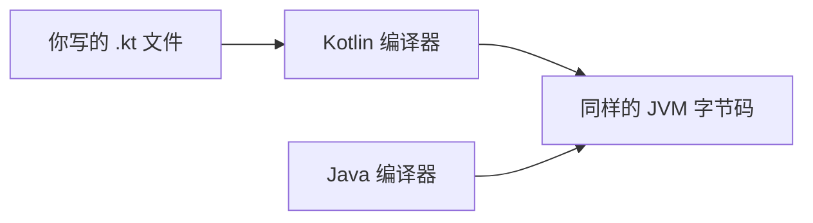

## Kotlin 在技术版图中的位置

Kotlin 是运行在 **JVM 上的现代语言**——与 Java 同一个运行平台，但语法更简洁、更安全。两个标志性事实：**Android 官方首选语言**（Google 于 2019 年宣布）、Spring 官方全面支持的服务端语言之一。

## 与 Java 的关系：同平台、可互操作



Kotlin 与 Java 编译成同一种字节码，**同一个项目里两种语言可以互相调用**——企业可以在存量 Java 代码上逐步引入 Kotlin，这是它在业界快速铺开的关键。

看一段对比。Java 版：

```java
if (name != null) {
    System.out.println(name.length());
}
```

Kotlin 版：

```kotlin
println(name?.length)
```

`?.`（安全调用）一行完成"判空再取值"——**空指针是 Java 世界最高频的崩溃来源，Kotlin 直接把"可能为空"做进了类型系统**。

## 空安全：初学者最容易体会到的优点

Kotlin 把类型分成"可为空"与"不可为空"两种：`String` 保证永远不为空，`String?` 才允许为空。编译器强制你在使用可空值前处理 null 情况，把一类整站崩溃消灭在编译期。零基础阶段只需要记住这个直觉：**编译器逼你处理的，都是未来线上会炸的。**

## 动手环节：第一次运行

无需安装任何东西——打开浏览器访问 [Kotlin Playground](https://play.kotlinlang.org)，输入：

```kotlin
fun main() {
    val name = "学习者"
    println("你好，$name")
    println("1 到 100 的和是 ${sumUp()}")
}

fun sumUp(): Int {
    var total = 0
    for (i in 1..100) total += i
    return total
}
```

点击运行。两个语法点先记住：`val` 定义不可变变量（优先用它），`var` 定义可变变量；`$name` 与 `${...}` 是字符串模板，可以直接把值嵌进文本。本地环境安装见 [Kotlin 概述与环境搭建](/kotlin/002-KotlinOverviewEnvSetup)。

## 常见困惑

**"先学 Java 还是 Kotlin？"**——本仓库建议：按 java 模块学完面向对象基础后进入 kotlin，两者互相印证，JVM 与集合等知识完全共用。

**"Kotlin 只能写 Android 吗？"**——不。服务端（Ktor、Spring）、多平台（Kotlin Multiplatform）、脚本都在用它。

## 下一步

进入 [Kotlin 概述与环境搭建](/kotlin/002-KotlinOverviewEnvSetup) 开始语法主线；写 Android 应用时，kotlin 模块与移动端开发知识将直接派上用场。
