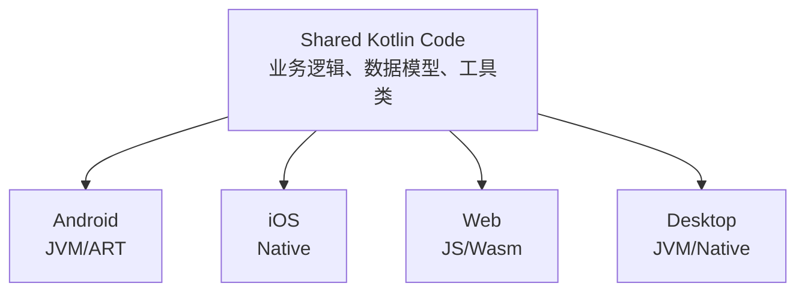

## 前置知识

- [Kotlin 协程进阶](/kotlin/009-KotlinCoroutineAdvanced)：建议先完成前一篇的学习

## 学习目标

- 掌握「1. KMP 架构概述」的核心机制、典型用法与常见陷阱
- 掌握「2. expect/actual 声明」的核心机制、典型用法与常见陷阱
- 掌握「3. 共享代码实践」的核心机制、典型用法与常见陷阱
- 掌握「4. Compose Multiplatform」的核心机制、典型用法与常见陷阱
- 掌握「5. iOS 集成」的核心机制、典型用法与常见陷阱


## 1. KMP 架构概述

Kotlin Multiplatform (KMP) 是 JetBrains 推出的多平台开发方案，允许在平台间共享 Kotlin 代码，同时保留平台特定实现的能力。2024 年 Kotlin 2.1 正式将 KMP 标记为稳定版。

### 1.1 核心理念



### 1.2 代码共享策略

| 策略     | 共享内容                 | 适用场景                         |
| -------- | ------------------------ | -------------------------------- |
| 共享逻辑 | 网络层、数据层、业务逻辑 | 最常见，推荐入门                 |
| 共享 UI  | Compose Multiplatform UI | 2024+ 逐渐成熟                   |
| 完全共享 | 逻辑 + UI + 平台适配     | Compose Multiplatform 全平台应用 |

### 1.3 源集结构

```mermaid
flowchart TD
    T0["shared/"]
    T1["src/"]
    T2["commonMain/          # 所有平台共享"]
    T3["kotlin/"]
    T4["commonTest/          # 共享测试"]
    T5["kotlin/"]
    T6["androidMain/         # Android 特定"]
    T7["kotlin/"]
    T8["androidUnitTest/"]
    T9["iosMain/             # iOS 特定"]
    T10["kotlin/"]
    T11["jsMain/              # JS 特定"]
    T12["kotlin/"]
    T13["jvmMain/             # JVM 特定"]
    T14["kotlin/"]
    T15["nativeMain/          # 所有 Native 平台共享"]
    T16["kotlin/"]
    T17["appleMain/           # Apple 平台共享"]
    T18["kotlin/"]
    T19["wasmJsMain/          # Wasm/JS 特定"]
    T20["kotlin/"]
    T0 --> T1
```



## 2. expect/actual 声明

`expect/actual` 是 KMP 的核心机制，用于声明平台差异化的 API：

### 2.1 expect 声明（共享代码中）

```kotlin
// commonMain/kotlin/platform/Logger.kt
expect class Logger() {
    fun debug(message: String)
    fun error(message: String)
}

// expect 函数
expect fun getPlatformName(): String

// expect 属性
expect val currentTimestamp: Long

// expect 对象
expect object FileSystem {
    fun read(path: String): ByteArray
    fun write(path: String, data: ByteArray)
}
```

### 2.2 actual 实现（平台代码中）

```kotlin
// androidMain/kotlin/platform/Logger.kt
actual class Logger actual constructor() {
    actual fun debug(message: String) {
        Log.d("App", message)
    }
    actual fun error(message: String) {
        Log.e("App", message)
    }
}

actual fun getPlatformName(): String = "Android"
actual val currentTimestamp: Long = System.currentTimeMillis()

// iosMain/kotlin/platform/Logger.kt
actual class Logger actual constructor() {
    actual fun debug(message: String) {
        NSLog("App: $message")
    }
    actual fun error(message: String) {
        NSLog("App ERROR: $message")
    }
}

actual fun getPlatformName(): String = "iOS"
actual val currentTimestamp: Long = NSDate().timeIntervalSince1970.toLong() * 1000
```

### 2.3 expect/actual 规则

- `expect` 声明不能有默认实现
- `actual` 实现必须与 `expect` 声明完全匹配
- 每个 `expect` 必须在所有目标平台有对应的 `actual`
- `actual` 类的构造函数也需 `actual constructor()`

## 3. 共享代码实践

### 3.1 网络层共享

```kotlin
// commonMain
interface ApiClient {
    suspend fun <T> request(endpoint: String): Result<T>
}

class Repository(private val api: ApiClient) {
    suspend fun fetchUsers(): Result<List<User>> =
        api.request("/api/users")
}

// 使用 Ktor 实现跨平台网络
// build.gradle.kts (shared)
kotlin {
    sourceSets {
        commonMain {
            dependencies {
                implementation("io.ktor:ktor-client-core:3.0.0")
                implementation("io.ktor:ktor-client-content-negotiation:3.0.0")
                implementation("io.ktor:ktor-serialization-kotlinx-json:3.0.0")
            }
        }
        androidMain {
            dependencies {
                implementation("io.ktor:ktor-client-okhttp:3.0.0")
            }
        }
        iosMain {
            dependencies {
                implementation("io.ktor:ktor-client-darwin:3.0.0")
            }
        }
    }
}
```

### 3.2 数据存储共享

```kotlin
// commonMain
expect class DataStoreFactory {
    fun create(name: String): DataStore<Preferences>
}

// 使用多平台设置库
// commonMain
class SettingsRepository(private val settings: Settings) {
    var theme: String by settings.stringBinding("theme", "system")
    var fontSize: Int by settings.intBinding("fontSize", 14)
}
```

### 3.3 日期时间共享

```kotlin
// 使用 kotlinx-datetime（跨平台日期时间库）
import kotlinx.datetime.*

fun getCurrentDate(): LocalDate = Clock.System.todayIn(TimeZone.currentSystemDefault())

fun formatInstant(instant: Instant): String {
    return instant.toString()
}
```

## 4. Compose Multiplatform

Compose Multiplatform 是基于 Jetpack Compose 的跨平台 UI 框架：

### 4.1 项目配置

```kotlin
// build.gradle.kts (shared)
plugins {
    kotlin("multiplatform")
    id("org.jetbrains.compose")
    id("org.jetbrains.kotlin.plugin.compose")
}

kotlin {
    androidTarget()
    iosX64()
    iosArm64()
    iosSimulatorArm64()
    jvm("desktop")
    wasmJs { browser() }

    sourceSets {
        commonMain {
            dependencies {
                implementation(compose.runtime)
                implementation(compose.foundation)
                implementation(compose.material3)
                implementation(compose.components.resources)
            }
        }
    }
}
```

### 4.2 共享 UI 组件

```kotlin
// commonMain
@Composable
fun App() {
    var selectedTab by remember { mutableIntStateOf(0) }

    MaterialTheme {
        Scaffold(
            bottomBar = {
                NavigationBar {
                    NavigationBarItem(
                        selected = selectedTab == 0,
                        onClick = { selectedTab = 0 },
                        icon = { Icon(Icons.Default.Home, "Home") },
                        label = { Text("Home") }
                    )
                    NavigationBarItem(
                        selected = selectedTab == 1,
                        onClick = { selectedTab = 1 },
                        icon = { Icon(Icons.Default.Settings, "Settings") },
                        label = { Text("Settings") }
                    )
                }
            }
        ) { padding ->
            when (selectedTab) {
                0 -> HomeScreen(Modifier.padding(padding))
                1 -> SettingsScreen(Modifier.padding(padding))
            }
        }
    }
}

@Composable
fun HomeScreen(modifier: Modifier = Modifier) {
    LazyColumn(modifier = modifier.fillMaxSize()) {
        items(getItems()) { item ->
            Card(
                modifier = Modifier.fillMaxWidth().padding(8.dp),
                elevation = CardDefaults.cardElevation(4.dp)
            ) {
                Text(item.title, modifier = Modifier.padding(16.dp))
            }
        }
    }
}
```

### 4.3 平台入口

```kotlin
// Android — MainActivity.kt
class MainActivity : ComponentActivity() {
    override fun onCreate(savedInstanceState: Bundle?) {
        super.onCreate(savedInstanceState)
        setContent { App() }
    }
}

// iOS — MainViewController.kt
fun MainViewController() = ComposeUIViewController { App() }

// Desktop — Main.kt
fun main() = application {
    Window(onCloseRequest = ::exitApplication, title = "My App") {
        App()
    }
}

// Web — Main.kt
@OptIn(ExperimentalComposeUiApi::class)
fun main() {
    CanvasBasedWindow("My App") { App() }
}
```

## 5. iOS 集成

### 5.1 导出框架

```kotlin
kotlin {
    iosX64()
    iosArm64()
    iosSimulatorArm64()

    listOf(iosX64(), iosArm64(), iosSimulatorArm64()).forEach {
        it.binaries.framework {
            baseName = "shared"
            isStatic = true  // 推荐，避免动态库问题
        }
    }
}
```

### 5.2 Swift 互操作

```swift
// Swift 中使用 Kotlin 共享代码
let repository = Repository(apiClient: ApiClient())
let users = try await repository.fetchUsers()

// Kotlin 的 suspend 函数自动转为 Swift async/await
// Result 类型自动映射
```

### 5.3 ObjC 兼容性

```kotlin
// 使用 @ObjCName 自定义 ObjC 名称
@ObjCName("KMPLogger")
class Logger {
    @ObjCName("logMessage")
    fun log(message: String) { /* ... */ }
}
```

## 6. Gradle 配置

### 6.1 完整 KMP 项目配置

```kotlin
// build.gradle.kts (项目根)
plugins {
    kotlin("multiplatform") version "2.2.0" apply false
    id("org.jetbrains.compose") version "1.8.0" apply false
    id("org.jetbrains.kotlin.plugin.compose") version "2.2.0" apply false
}

// build.gradle.kts (shared module)
plugins {
    kotlin("multiplatform")
    id("org.jetbrains.compose")
    id("org.jetbrains.kotlin.plugin.compose")
}

kotlin {
    // 目标平台
    androidTarget {
        compilations.all {
            kotlinOptions {
                jvmTarget = "17"
            }
        }
    }

    iosX64()
    iosArm64()
    iosSimulatorArm64()

    jvm("desktop")

    wasmJs {
        browser()
    }

    // 源集依赖
    sourceSets {
        commonMain.dependencies {
            implementation("io.ktor:ktor-client-core:3.0.0")
            implementation("org.jetbrains.kotlinx:kotlinx-coroutines-core:1.10.1")
            implementation("org.jetbrains.kotlinx:kotlinx-serialization-json:1.7.0")
            implementation("org.jetbrains.kotlinx:kotlinx-datetime:0.6.0")
            implementation(compose.runtime)
            implementation(compose.foundation)
            implementation(compose.material3)
        }
        commonTest.dependencies {
            implementation(kotlin("test"))
            implementation("org.jetbrains.kotlinx:kotlinx-coroutines-test:1.10.1")
        }
        androidMain.dependencies {
            implementation("io.ktor:ktor-client-okhttp:3.0.0")
        }
        iosMain.dependencies {
            implementation("io.ktor:ktor-client-darwin:3.0.0")
        }
        desktopMain.dependencies {
            implementation("io.ktor:ktor-client-okhttp:3.0.0")
            implementation(compose.desktop.currentOs)
        }
    }
}
```

### 6.2 版本目录（Version Catalog）

```kotlin
// gradle/libs.versions.toml
[versions]
kotlin = "2.2.0"
compose = "1.8.0"
ktor = "3.0.0"
coroutines = "1.10.1"
serialization = "1.7.0"

[libraries]
kotlinx-coroutines-core = { group = "org.jetbrains.kotlinx", name = "kotlinx-coroutines-core", version.ref = "coroutines" }
kotlinx-serialization-json = { group = "org.jetbrains.kotlinx", name = "kotlinx-serialization-json", version.ref = "serialization" }
ktor-client-core = { group = "io.ktor", name = "ktor-client-core", version.ref = "ktor" }
```

## 7. 常用 KMP 库

| 领域   | 库                     | 说明                      |
| ------ | ---------------------- | ------------------------- |
| 网络   | Ktor                   | 跨平台 HTTP 客户端/服务端 |
| 序列化 | kotlinx.serialization  | JSON/ProtoBuf/CBOR        |
| 日期   | kotlinx-datetime       | 跨平台日期时间            |
| 协程   | kotlinx-coroutines     | 跨平台协程                |
| 存储   | multiplatform-settings | 跨平台键值存储            |
| 数据库 | SQLDelight             | 类型安全跨平台 SQL        |
| 日志   | Kermit                 | 跨平台日志库              |
| DI     | Koin                   | 跨平台依赖注入            |
| UI     | Compose Multiplatform  | 跨平台 UI 框架            |
| 导航   | Decompose              | 跨平台导航/状态管理       |

## 8. KMP 项目最佳实践

1. **从共享逻辑开始**：先共享网络层和数据层，UI 层各平台原生实现
2. **使用 expect/actual 最小化**：尽量使用跨平台库，减少平台特定代码
3. **API 设计考虑互操作**：注意 Kotlin 与 Swift/JS 的类型映射差异
4. **利用版本目录**：统一管理依赖版本
5. **CI/CD 多平台构建**：iOS 构建需要 macOS 运行环境
## 项目结构

**基本写法：build.gradle.kts 配置**
`kotlin { androidTarget(); jvm(); iosX64(); iosArm64() }`
```kotlin
// 声明多平台目标
kotlin {
    androidTarget()
    jvm()
    iosX64(); iosArm64(); iosSimulatorArm64()
}
```

---

**基本写法：层级 sourceSets**
`val commonMain by getting; val androidMain by getting`
```kotlin
// 公共代码与平台代码目录
kotlin {
    sourceSets {
        val commonMain by getting
        val androidMain by getting
        val iosMain by creating { dependsOn(commonMain) }
    }
}
```

---

## expect/actual 机制

**基本写法：声明 expect**
`expect fun <方法>(): <类型>`
```kotlin
// commonMain 中声明平台差异函数
expect fun currentTimeMillis(): Long
```

---

**基本写法：实现 actual**
`actual fun <方法>(): <类型> { }`
```kotlin
// androidMain 中实现
actual fun currentTimeMillis(): Long = System.currentTimeMillis()
```

---

**基本写法：expect 类**
`expect class <类名>()`
```kotlin
// common 声明平台类
expect class DateFormatter() {
    fun format(millis: Long): String
}
```

---

**基本写法：actual 类**
`actual class <类名> { }`
```kotlin
// 平台实现具体类
actual class DateFormatter {
    actual fun format(millis: Long): String = java.text.SimpleDateFormat().format(Date(millis))
}
```

---

**基本写法：expect 属性**
`expect val <属性>: <类型>`
```kotlin
// 声明平台相关常量
expect val platformName: String
```

---

## 跨平台依赖

**基本写法：commonMain 依赖**
`commonMain { dependencies { implementation("<坐标>") } }`
```kotlin
// 公共代码使用跨平台库
commonMain.dependencies {
    implementation("org.jetbrains.kotlinx:kotlinx-coroutines-core:1.9.0")
    implementation("org.jetbrains.kotlinx:kotlinx-serialization-json:1.7.0")
}
```

---

**基本写法：平台专属依赖**
`androidMain { dependencies { implementation("<坐标>") } }`
```kotlin
// 仅 Android 平台依赖
androidMain.dependencies {
    implementation("androidx.core:core-ktx:1.13.0")
}
```

---

## 平台特定调用

**基本写法：Android 调用**
`import android.util.Log; Log.d(...)`
```kotlin
// androidMain 中调用 Android API
android.util.Log.d("tag", "msg")
```

---

**基本写法：iOS 调用**
`import platform.Foundation.NSDate`
```kotlin
// iosMain 中调用 Objective-C API
import platform.Foundation.NSDate
val now = NSDate()
```

---

**基本写法：JVM 调用**
`import java.io.File`
```kotlin
// jvmMain 中调用 JVM API
import java.io.File
val f = File("a.txt")
```

---

## 跨平台 IO

**基本写法：使用 okio 跨平台 IO**
`okio.FileSystem.SYSTEM.read(<path>) { }`
```kotlin
// okio 提供跨平台文件 IO
import okio.FileSystem
FileSystem.SYSTEM.read(path) { readUtf8() }
```

---

## kotlinx 库

**基本写法：kotlinx-datetime**
`Clock.System.now()`
```kotlin
// 跨平台日期时间
import kotlinx.datetime.Clock
val now = Clock.System.now()
```

---

**基本写法：kotlinx.coroutines 协程**
`runBlocking { }`
```kotlin
// 跨平台协程
import kotlinx.coroutines.runBlocking
runBlocking { doWork() }
```

---

**基本写法：kotlinx-serialization**
`@Serializable class <类>`
```kotlin
// 跨平台序列化
import kotlinx.serialization.Serializable
@Serializable
data class User(val name: String)
```

---

## expect/actual 扩展函数

**基本写法：扩展 expect**
`expect fun <<T>> <类型>.<方法>(): <返回>`
```kotlin
// 声明跨平台扩展函数
expect fun Long.toDateString(): String
```

---

## 共享业务逻辑

**基本写法：commonMain 编写业务**
`class <仓库> { suspend fun <方法>() = <实现> }`
```kotlin
// 共享业务代码不依赖平台
class UserRepository {
    suspend fun load(): User = api.fetch()
}
```

---

## 构建与运行

**基本写法：构建所有目标**
`./gradlew build`
```bash
# 编译所有平台目标
./gradlew build
```

---

**基本写法：构建特定目标**
`./gradlew :shared:assembleAndroid`
```bash
# 仅构建 Android 目标
./gradlew :shared:assembleAndroid
```

---

**基本写法：发布 iOS Framework**
`./gradlew :shared:linkDebugFrameworkIosArm64`
```bash
# 生成 iOS Framework
./gradlew :shared:linkDebugFrameworkIosArm64
```

---

## CocoaPods 集成

**基本写法：cocoapods 配置**
`cocoapods { summary = "<描述>"; version = "1.0" }`
```kotlin
// 配置 iOS CocoaPods 集成
kotlin {
    cocoapods {
        summary = "Shared Library"
        version = "1.0"
        ios.deploymentTarget = "14.0"
    }
}
```

---

## 目标简写

**基本写法：iOS 目标简写**
`ios() // 等价 iosX64 + iosArm64 + iosSimulatorArm64`
```kotlin
// 一行配置所有 iOS 目标
kotlin { ios() }
```

---

**基本写法：macos 目标**
`macosX64(); macosArm64()`
```kotlin
// macOS 目标
kotlin { macosX64(); macosArm64() }
```

---

## 中间层 sourceSet

**基本写法：iOS 共享代码**
`val iosMain by creating { dependsOn(commonMain) }`
```kotlin
// iOS 多架构共享代码
val iosMain by creating { dependsOn(commonMain) }
val iosX64Main by getting { dependsOn(iosMain) }
val iosArm64Main by getting { dependsOn(iosMain) }
```
