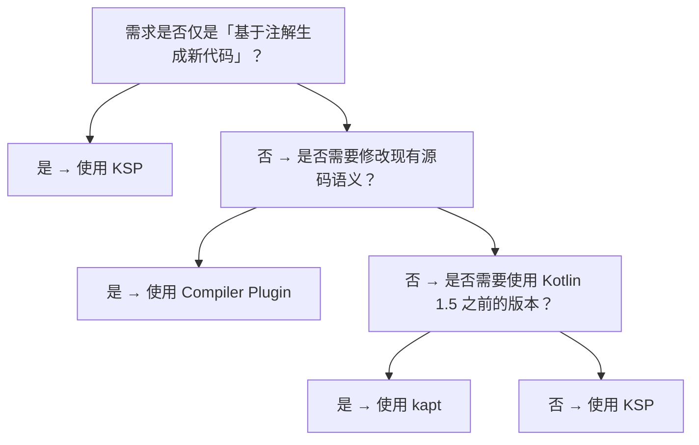

## 前置知识

- [Kotlin 与测试](/kotlin/035-KotlinTest)：建议先完成前一篇的学习

## 学习目标

- 掌握「历史动机与背景」的核心机制、典型用法与常见陷阱
- 掌握「形式化定义」的核心机制、典型用法与常见陷阱
- 掌握「理论推导」的核心机制、典型用法与常见陷阱
- 掌握「代码示例」的核心机制、典型用法与常见陷阱
- 掌握「对比分析」的核心机制、典型用法与常见陷阱


# Kotlin kotlinc 编译命令速查手册

---

## 历史动机与背景

### 1. 注解处理的前夜：Java 时代的 APT

Java 5（2004 年）引入了 JSR 175「注解」机制，开启了元编程时代。随后 JSR 269「Pluggable Annotation Processing API」为编译期代码生成提供了标准化接口。Java 生态的早期代表项目如 Dagger、ButterKnife、AutoValue 都依赖 `javax.annotation.processing.Processor` 接口在编译期生成辅助代码，以减少运行时反射开销。

然而 Java 的注解处理 API 与 Java 编译器 `javac` 强耦合，处理流程依赖于 `Element`、`TypeMirror` 等抽象，无法直接理解 Kotlin 的扩展函数、协程、`suspend` 修饰符、内联类等语言特性。

### 1. Kotlin 诞生初期的妥协：kapt

Kotlin 1.0（2016 年）发布时，JetBrains 面临的关键问题是：如何在不重写所有 Java 注解处理器的前提下，让 Kotlin 代码能被 Dagger、Dagger 2、Room、ButterKnife 等生态工具直接消费？答案是 kapt（Kotlin Annotation Processing Tool）。

kapt 的核心思路是：将 Kotlin 源码翻译成 Java 兼容的「Stub」文件（仅保留类型签名，剥离方法体），再让基于 javac 的注解处理器处理这些 Stub。Stub 生成阶段需要调用 Kotlin 编译器前端进行完整的语义分析，因此对每个含注解的 Kotlin 文件都要进行两次完整分析，时间开销显著。

形式化地，kapt 流程可表示为：

$$
T_{\text{kapt}} = T_{\text{parse}}(K) + T_{\text{analyze}}(K) + T_{\text{stubGen}}(K \to J) + T_{\text{apt}}(J) + T_{\text{kotlinc}}(K)
$$

其中 $T_{\text{analyze}}(K)$ 与 $T_{\text{kotlinc}}(K)$ 的分析阶段存在重复执行，这是 kapt 性能瓶颈的根本原因。

### 2. KSP 的诞生：面向 Kotlin 原生的处理器

Google 在 2019 年启动了 KSP（Kotlin Symbol Processing）项目，目标是在不依赖 javac、不生成 Stub 的前提下，直接基于 Kotlin Compiler 的 PSI（Program Structure Interface）树进行符号处理。KSP 1.0 于 2021 年发布，与 Kotlin 1.5.30 同步稳定。

KSP 的关键优势在于：

- 直接消费 Kotlin 编译器的语义信息，无需 Java Stub 中间层；
- 支持增量处理（Incremental Processing），可基于文件粒度重处理；
- 处理速度比 kapt 快 2~3 倍（Google 内部测试数据，Hilt 项目对比）；
- 原生理解 Kotlin 类型系统，包括 `suspend`、`inline class`、`value class`、`typealias`。

### 3. Kotlin Compiler Plugin：最深的入侵

KSP 解决了「读」的问题（符号分析），但仍无法修改 Kotlin 源码的语义。对于需要在编译期对源码进行深度变换的场景，例如：

- Kotlin Serialization：为 `@Serializable` 类自动生成 `$serializer`；
- Compose Compiler Plugin：将 `@Composable` 函数转化为带有 group key 的状态机；
- kotlinx.atomicfu：将 `AtomicInt` 等抽象替换为 `java.util.concurrent.atomic.AtomicInteger`；
- All-open Plugin：将 `final` 类与方法改为 `open`，以兼容 Spring AOP。

这些场景只能通过 Kotlin Compiler Plugin 实现，它们直接挂载到编译器的分析、解析、代码生成阶段，是最强但也是最危险的元编程能力。

### 4. 工业界动机：构建性能与开发者体验

随着 Android 工程、KMP（Kotlin Multiplatform）工程的规模膨胀，kapt 成为编译耗时的主要瓶颈。Google 在 AndroidX、Room、Hilt 等项目中的实测数据显示，将 kapt 迁移到 KSP 后，全量编译时长可降低 30%~50%，增量编译时长可降低 60%~80%。这一动机推动了 KSP 在 Android 生态的快速普及，也促使 JetBrains 在 Kotlin 2.0 中进一步将 K2 编译器与 KSP 深度整合。

---

## 形式化定义

### 1. 编译器插件的形式化模型

设 Kotlin 源程序 $P$ 为一棵抽象语法树（AST），编译流程可形式化为一系列变换函数的组合：

$$
\text{Compile}(P) = \text{Opt} \circ \text{Gen} \circ \text{Analyze} \circ \text{Parse}(P)
$$

其中：

- $\text{Parse}: \text{String} \to \text{AST}$，将源码解析为 PSI 树；
- $\text{Analyze}: \text{AST} \to \text{SemanticGraph}$，进行类型解析、重载决策、可见性校验；
- $\text{Gen}: \text{SemanticGraph} \to \text{IR}$，生成中间表示（IR backend）；
- $\text{Opt}: \text{IR} \to \text{IR}$，进行优化 Pass；
- 最终输出字节码或机器码。

Kotlin Compiler Plugin 通过 `ComponentRegistrar`（K1）或 `FirExtension`（K2）注册到上述流程的任意阶段，可视为函数复合中的额外变换：

$$
\text{Compile}_{\text{plugin}}(P) = \text{Opt} \circ \text{Gen}' \circ \text{Analyze}' \circ \text{Parse}'(P)
$$

其中 $\text{Parse}'$、$\text{Analyze}'$、$\text{Gen}'$ 表示被插件拦截后的扩展版本。

### 1. KSP 的符号处理代数

KSP 的处理流程可形式化为一个以符号为节点、以引用为边的图遍历过程。设 $\Sigma$ 为程序中所有符号的集合，$\mathcal{R} \subseteq \Sigma \times \Sigma$ 为符号间的引用关系，则 KSP 处理器的工作是：

$$
\text{Process}: \Sigma \to 2^{\text{GeneratedFile}}
$$

每个处理器 $\text{Process}_i$ 注册感兴趣的符号类型 $\tau_i \subseteq \Sigma$，KSP 框架在 `Round` 中遍历所有符号，对匹配的符号调用对应处理器：

$$
\text{KSP}_{\text{round}}(\Sigma) = \bigcup_{i} \text{Process}_i(\{s \in \Sigma \mid \text{type}(s) \in \tau_i\})
$$

多轮处理时，上一轮生成的符号可能触发新的处理：

$$
\Sigma_{n+1} = \Sigma_n \cup \text{KSP}_{\text{round}}(\Sigma_n)
$$

直到不动点 $\Sigma_{n+1} = \Sigma_n$。

### 2. 增量处理的依赖图

KSP 增量处理的核心是构建与维护一张「源文件 - 生成文件」依赖图 $G = (V, E)$：

- $V = V_{\text{src}} \cup V_{\text{gen}}$，分为源文件节点与生成文件节点；
- $E \subseteq V_{\text{src}} \times V_{\text{gen}}$，表示生成关系。

当源文件 $f$ 变更时，KSP 通过反向邻接表找出所有依赖 $f$ 的生成文件，仅对这些文件重跑处理器：

$$
\text{Reprocess}(f) = \{g \in V_{\text{gen}} \mid (f, g) \in E^+\}
$$

其中 $E^+$ 为 $E$ 的传递闭包。

### 3. kapt Stub 生成代价模型

kapt 的总耗时 $T_{\text{kapt}}$ 可分解为：

$$
T_{\text{kapt}} = \underbrace{\alpha \cdot |P|}_{\text{parse}} + \underbrace{\beta \cdot |P| \cdot \log |P|}_{\text{analyze}} + \underbrace{\gamma \cdot |P|}_{\text{stub}} + \underbrace{\delta \cdot |P|}_{\text{apt}} + \underbrace{\alpha \cdot |P| + \beta \cdot |P| \cdot \log |P|}_{\text{重复 analyze}}
$$

其中 $\alpha, \beta, \gamma, \delta$ 为平台相关系数。KSP 消除了「重复 analyze」与「stub」两项，理论加速比为：

$$
S_{\text{KSP}} = \frac{T_{\text{kapt}}}{T_{\text{KSP}}} \approx 1 + \frac{(\beta \log |P| + \gamma) \cdot |P|}{(\alpha + \beta \log |P|) \cdot |P| + \delta \cdot |P|}
$$

在大型工程中 $|P| \to \infty$ 时，$S_{\text{KSP}} \to 1 + \frac{\gamma}{\alpha + \beta \log |P|}$，即随着工程规模增大，KSP 相对 kapt 的优势持续扩大。

---

## 理论推导

### 1. KSP 增量处理的正确性证明

**命题**：若处理器 $\text{Process}_i$ 声明的依赖关系是完备且正确的，则 KSP 的增量处理结果与全量处理结果在语义上等价。

**证明**：

设全量处理结果为 $R_{\text{full}} = \text{KSP}_{\text{round}}^{*}(\Sigma)$（不动点），增量处理在变更集 $\Delta \Sigma$ 上重跑所有受影响节点：

1. **正确性**：由于依赖图 $G$ 的传递闭包 $E^+$ 覆盖了所有可能受影响的生成文件，$\text{Reprocess}(\Delta \Sigma)$ 必然包含所有需要更新的生成文件。
2. **完备性**：若依赖声明不完备，则存在 $(f, g) \in E$ 但处理器未声明，此时 $g \notin \text{Reprocess}(f)$，导致增量结果与全量结果不一致。这是处理器实现的缺陷，而非 KSP 框架的问题。

证毕。

**推论**：处理器必须严格遵守 KSP 的依赖声明 API（`Dependencies`、`aggregating` 标志），否则增量编译可能产生不一致结果。

### 1. Kotlin Compiler Plugin 的可组合性问题

设 $P_1, P_2$ 为两个 Kotlin Compiler Plugin，分别对应变换 $T_1, T_2$。理想情况下，二者组合应满足交换律：

$$
T_1 \circ T_2 = T_2 \circ T_1
$$

但实际上，Kotlin Compiler Plugin 之间存在「顺序敏感」的耦合，原因在于：

- 两个插件可能同时修改同一 AST 节点；
- 一个插件生成的节点可能被另一插件误识别为用户源码；
- IR 阶段的变换顺序会影响优化 Pass 的输入。

形式化地，设 $T_1, T_2$ 的「冲突集合」为 $C(T_1, T_2) \subseteq \text{AST}$，则当且仅当 $C(T_1, T_2) = \emptyset$ 时，$T_1 \circ T_2 = T_2 \circ T_1$。这是 Kotlin 官方对 Compiler Plugin 推广持保守态度的根本原因——Compose、Serialization 等插件均经过单独验证，组合使用时需谨慎。

### 2. K2 编译器的 FirExtension 架构

Kotlin 2.0 引入的 K2 编译器采用 FIR（Frontend IR）作为前端中间表示，FirExtension 是 K2 时代的插件扩展点。其核心机制包括：

- `FirDeclarationGenerationExtension`：声明生成扩展；
- `FirExpressionResolutionExtension`：表达式解析扩展；
- `FirStatusTransformerExtension`：修饰符变换扩展；
- `FirSupertypeGenerationExtension`：超类型生成扩展。

K2 的关键改进在于将前端的「类型解析」与「声明生成」解耦，使得插件可以仅订阅关心的扩展点，避免 K1 时代的 `ComponentRegistrar` 全局拦截导致的性能损耗。形式化地，K2 的插件调用图为：

$$
\text{Plugin}_{\text{K2}} = \bigcup_{e \in E_{\text{subscribed}}} \text{Hook}_e
$$

而 K1 时代为：

$$
\text{Plugin}_{\text{K1}} = \text{Wrap}(\text{AllPhases})
$$

K2 的细粒度订阅模型在大型工程中可降低 20%~40% 的插件开销（JetBrains 官方 K2 基准测试数据）。

### 3. 复杂度分析

| 操作 | 时间复杂度 | 空间复杂度 | 备注 |
|------|-----------|-----------|------|
| KSP 单轮符号遍历 | $O(\|\Sigma\|)$ | $O(\|\Sigma\|)$ | 线性于符号数 |
| KSP 增量依赖图更新 | $O(\|\Delta\| \cdot d_{\max})$ | $O(\|E\|)$ | $d_{\max}$ 为最大出度 |
| kapt Stub 生成 | $O(\|P\| \cdot \log \|P\|)$ | $O(\|P\|)$ | 含完整语义分析 |
| Kotlin Compiler Plugin 注册 | $O(1)$ | $O(1)$ | 仅注册，不预处理 |
| Kotlin Compiler Plugin 调用 | 取决于插件实现 | 取决于插件实现 | 通常为 $O(\|P\|)$ |

---

## 代码示例

### 示例 1：使用 KSP 实现自定义 `@Factory` 注解处理器

本示例演示如何为标注 `@Factory` 的类生成对应的工厂方法。完整工程包含注解定义、处理器实现、Gradle 集成三部分。

#### 1.1 注解定义模块

```kotlin
// annotations/src/main/kotlin/com/example/factory/Factory.kt
package com.example.factory

/**
 * 标注一个类为工厂产物。
 * - className: 生成的工厂类名，默认为 "类名 + Factory"
 * - groupName: 工厂分组名，用于多模块聚合
 */
@Target(AnnotationTarget.CLASS)
@Retention(AnnotationRetention.SOURCE)
public annotation class Factory(
    val className: String = "",
    val groupName: String = "default"
)
```

#### 1.2 处理器实现模块

```kotlin
// processor/src/main/kotlin/com/example/factory/processor/FactoryProcessor.kt
package com.example.factory.processor

import com.google.devtools.ksp.processing.CodeGenerator
import com.google.devtools.ksp.processing.Dependencies
import com.google.devtools.ksp.processing.KSPLogger
import com.google.devtools.ksp.processing.Resolver
import com.google.devtools.ksp.processing.SymbolProcessor
import com.google.devtools.ksp.processing.SymbolProcessorEnvironment
import com.google.devtools.ksp.processing.SymbolProcessorProvider
import com.google.devtools.ksp.symbol.KSAnnotated
import com.google.devtools.ksp.symbol.KSClassDeclaration
import com.google.devtools.ksp.symbol.KSFunctionDeclaration
import com.google.devtools.ksp.symbol.KSVisitorVoid
import com.squareup.kotlinpoet.ClassName
import com.squareup.kotlinpoet.FileSpec
import com.squareup.kotlinpoet.FunSpec
import com.squareup.kotlinpoet.KModifier
import com.squareup.kotlinpoet.PropertySpec
import com.squareup.kotlinpoet.TypeSpec
import com.squareup.kotlinpoet.ksp.toKModifier
import com.squareup.kotlinpoet.ksp.writeTo

/**
 * FactoryProcessor：扫描 @Factory 注解的类，生成对应的工厂类。
 *
 * 核心流程：
 * 1. resolve() 阶段获取所有带 @Factory 注解的符号
 * 2. 遍历每个类声明，提取构造函数参数
 * 3. 用 KotlinPoet 拼装工厂类源码
 * 4. 通过 CodeGenerator 写入 generated 目录
 */
public class FactoryProcessor(
    private val codeGenerator: CodeGenerator,
    private val logger: KSPLogger,
    private val options: Map<String, String>
) : SymbolProcessor {

    // 标记是否已处理过，避免多轮重复处理
    private var invoked = false

    override fun process(resolver: Resolver): List<KSAnnotated> {
        if (invoked) return emptyList()
        invoked = true

        // 获取所有带 @Factory 注解的符号
        val symbols = resolver.getSymbolsWithAnnotation("com.example.factory.Factory")
        val unableToProcess = symbols.filterNot { it is KSClassDeclaration }.toList()

        // 对每个类声明执行访问者
        symbols.filterIsInstance<KSClassDeclaration>().forEach { decl ->
            decl.accept(FactoryVisitor(), Unit)
        }

        return unableToProcess
    }

    /**
     * 访问者：负责对单个 KSClassDeclaration 进行处理并生成代码。
     */
    private inner FactoryVisitor : KSVisitorVoid() {
        override fun visitClassDeclaration(classDeclaration: KSClassDeclaration, data: Unit) {
            // 提取注解参数
            val annotation = classDeclaration.annotations.first {
                it.shortName.asString() == "Factory"
            }
            val classNameArg = (annotation.arguments.find {
                it.name?.asString() == "className"
            }?.value as? String).orEmpty()
            val groupNameArg = (annotation.arguments.find {
                it.name?.asString() == "groupName"
            }?.value as? String) ?: "default"

            // 生成工厂类名
            val generatedClassName = classNameArg.ifEmpty {
                "${classDeclaration.simpleName.asString()}Factory"
            }

            // 提取主构造函数参数
            val primaryConstructor = classDeclaration.primaryConstructor
            val constructorParams = primaryConstructor?.parameters ?: emptyList()

            // 构建 KotlinPoet 文件规范
            val fileSpec = buildFactoryFile(
                packageName = classDeclaration.packageName.asString(),
                factoryClassName = generatedClassName,
                targetClassName = classDeclaration.simpleName.asString(),
                constructorParams = constructorParams,
                groupName = groupNameArg
            )

            // 写入生成文件，依赖当前类声明
            fileSpec.writeTo(
                codeGenerator = codeGenerator,
                dependencies = Dependencies(aggregating = false, classDeclaration.containingFile!!)
            )
        }
    }

    /**
     * 使用 KotlinPoet 构建工厂类源文件。
     */
    private fun buildFactoryFile(
        packageName: String,
        factoryClassName: String,
        targetClassName: String,
        constructorParams: List<com.google.devtools.ksp.symbol.KSValueParameter>,
        groupName: String
    ): FileSpec {
        val targetClassRef = ClassName(packageName, targetClassName)

        // 构建 create 方法
        val createFunBuilder = FunSpec.builder("create")
            .returns(targetClassRef)
            .addModifiers(KModifier.PUBLIC)

        // 添加构造参数到 create 方法签名
        constructorParams.forEach { param ->
            val paramType = param.type.resolve().toClassName()
            createFunBuilder.addParameter(param.name?.asString() ?: "arg", paramType)
        }

        // 构建 create 方法体：调用目标类构造函数
        val argsList = constructorParams.joinToString(", ") { it.name?.asString() ?: "arg" }
        createFunBuilder.addStatement("return %T($argsList)", targetClassRef)

        // 构建工厂类
        val factoryClass = TypeSpec.classBuilder(factoryClassName)
            .addModifiers(KModifier.PUBLIC)
            .addProperty(
                PropertySpec.builder("groupName", String::class)
                    .addModifiers(KModifier.PUBLIC, KModifier.OVERRIDE)
                    .initializer("%S", groupName)
                    .build()
            )
            .addFunction(createFunBuilder.build())
            .build()

        return FileSpec.builder(packageName, factoryClassName)
            .addType(factoryClass)
            .build()
    }
}

/**
 * Provider：KSP 入口，由 ServiceLoader 加载。
 * 必须在 META-INF/services/com.google.devtools.ksp.processing.SymbolProcessorProvider 中注册。
 */
public class FactoryProcessorProvider : SymbolProcessorProvider {
    override fun create(environment: SymbolProcessorEnvironment): SymbolProcessor {
        return FactoryProcessor(
            codeGenerator = environment.codeGenerator,
            logger = environment.logger,
            options = environment.options
        )
    }
}
```

#### 1.3 Gradle 集成

```kotlin
// build.gradle.kts (processor 模块)
plugins {
    kotlin("jvm")
    id("com.google.devtools.ksp") version "1.9.22-1.0.17"
}

dependencies {
    implementation("com.google.devtools.ksp:symbol-processing-api:1.9.22-1.0.17")
    implementation("com.squareup:kotlinpoet:1.6.0")
    implementation("com.squareup:kotlinpoet-ksp:1.6.0")
}
```

```kotlin
// build.gradle.kts (consumer 模块)
plugins {
    kotlin("jvm")
    id("com.google.devtools.ksp") version "1.9.22-1.0.17"
}

dependencies {
    implementation(project(":annotations"))
    ksp(project(":processor"))
}

ksp {
    arg("factory.defaultGroupName", "production")
}
```

#### 1.4 使用示例

```kotlin
// consumer/src/main/kotlin/com/example/app/User.kt
package com.example.app

import com.example.factory.Factory

@Factory(groupName = "users")
data class User(val id: Long, val name: String, val email: String)

// KSP 生成的代码（位于 build/generated/ksp/main/kotlin/com/example/app/UserFactory.kt）
public class UserFactory {
    public val groupName: String = "users"
    public fun create(id: Long, name: String, email: String): User = User(id, name, email)
}
```

### 示例 2：实现 Kotlin Compiler Plugin 修改类修饰符

本示例实现一个最小化的「All-Open」风格插件，将标注 `@OpenForTesting` 的类自动改为 `open`。

#### 1.1 插件入口

```kotlin
// plugin/src/main/kotlin/com/example/allopen/AllOpenComponentRegistrar.kt
package com.example.allopen

import org.jetbrains.kotlin.compiler.plugin.AbstractCliOption
import org.jetbrains.kotlin.compiler.plugin.CliOption
import org.jetbrains.kotlin.compiler.plugin.CommandLineProcessor
import org.jetbrains.kotlin.compiler.plugin.ComponentRegistrar
import org.jetbrains.kotlin.config.CompilerConfiguration
import org.jetbrains.kotlin.extensions.CandidateExtension
import org.jetbrains.kotlin.extensions.StorageComponentContainerContributor
import org.jetbrains.kotlin.extensions.internal.CandidateInterceptorExtension
import org.jetbrains.kotlin.platform.TargetPlatform
import org.jetbrains.kotlin.resolve.BindingTrace
import org.jetbrains.kotlin.resolve.checkers.ExplicitDeclarationKindChecker

/**
 * 命令行处理器：接收 Gradle 传入的注解类名参数。
 */
class AllOpenCommandLineProcessor : CommandLineProcessor {
    override val pluginId: String = "com.example.allopen"

    override val pluginOptions: Collection<CliOption> = listOf(
        CliOption(
            optionName = "annotation",
            valueDescription = "<fqcn>",
            description = "Annotation class FQCN that triggers all-open",
            required = false,
            allowMultipleOccurrences = true
        )
    )
}

/**
 * 组件注册器：将 AllOpen 逻辑挂载到编译器。
 */
class AllOpenComponentRegistrar(
    private val annotationFqcns: List<String>
) : ComponentRegistrar {
    override fun registerProjectComponents(
        configuration: CompilerConfiguration,
        container: org.jetbrains.kotlin.container.StorageComponentContainer
    ) {
        // 注册 StorageComponentContainerContributor：在类型解析阶段将 final 改为 open
        StorageComponentContainerContributor.registerContributor(container) {
            AllOpenDescriptorResolverExtension(annotationFqcns)
        }
    }
}
```

#### 1.2 Gradle 插件封装

```kotlin
// plugin-gradle/src/main/kotlin/com/example/allopen/gradle/AllOpenGradlePlugin.kt
package com.example.allopen.gradle

import org.gradle.api.Project
import org.gradle.api.provider.ListProperty
import org.jetbrains.kotlin.gradle.plugin.KotlinCompilation
import org.jetbrains.kotlin.gradle.plugin.KotlinCompilerPluginPlugin

/**
 * Gradle 插件入口：将编译器插件参数注入 Kotlin 编译任务。
 */
class AllOpenGradlePlugin : KotlinCompilerPluginPlugin<AllOpenExtension> {
    override fun apply(target: Project) {
        target.extensions.create("allopen", AllOpenExtension::class.java)
    }

    override fun applyToCompilation(
        kotlinCompilation: KotlinCompilation<*>
    ): org.jetbrains.kotlin.gradle.plugin.Provider<org.jetbrains.kotlin.gradle.plugin.SubpluginArtifact> {
        val project = kotlinCompilation.target.project
        val extension = project.extensions.getByType(AllOpenExtension::class.java)

        kotlinCompilation.kotlinOptions.freeCompilerArgs += extension.annotations.get()
            .flatMap { listOf("-P", "plugin:com.example.allopen:annotation=$it") }

        return project.provider {
            org.jetbrains.kotlin.gradle.plugin.SubpluginArtifact(
                groupId = "com.example",
                artifactId = "allopen-compiler-plugin",
                version = "1.0.0"
            )
        }
    }
}

interface AllOpenExtension {
    val annotations: ListProperty<String>
}
```

### 示例 3：使用 KSP 实现增量处理

```kotlin
// processor/src/main/kotlin/com/example/cache/CacheProcessor.kt
package com.example.cache.processor

import com.google.devtools.ksp.processing.*
import com.google.devtools.ksp.symbol.*

/**
 * 支持 KSP 增量处理的缓存键生成器。
 * 关键点：通过 Dependencies 正确声明源文件依赖。
 */
class CacheProcessor(
    private val codeGenerator: CodeGenerator,
    private val logger: KSPLogger
) : SymbolProcessor {

    override fun process(resolver: Resolver): List<KSAnnotated> {
        val symbols = resolver.getSymbolsWithAnnotation("com.example.cache.Cacheable")
        val ret = mutableListOf<KSAnnotated>()

        symbols.forEach { symbol ->
            if (symbol !is KSFunctionDeclaration) {
                logger.warn("@Cacheable must be on a function", symbol)
                ret.add(symbol)
                return@forEach
            }

            // 收集所有源文件依赖（关键：aggregating = true 表示聚合生成）
            val containingFile = symbol.containingFile
            if (containingFile == null) {
                ret.add(symbol)
                return@forEach
            }

            generateCacheWrapper(symbol, containingFile)
        }

        return ret
    }

    private fun generateCacheWrapper(
        func: KSFunctionDeclaration,
        sourceFile: KSFile
    ) {
        val funcName = func.simpleName.asString()
        val packageName = func.packageName.asString()
        val fileName = "${funcName.capitalize()}CacheWrapper"

        // 关键：声明 aggregating = false 表示隔离生成
        // aggregating = false 时，单个源文件变更只重跑该文件的处理器
        val dependencies = Dependencies(aggregating = false, sourceFile)

        val fileSpec = FileSpec.builder(packageName, fileName)
            .addFunction(
                FunSpec.builder("cached$funcName")
                    .addModifiers(KModifier.INTERNAL)
                    .build()
            )
            .build()

        fileSpec.writeTo(codeGenerator, dependencies)
    }
}
```

### 示例 4：kapt 与 KSP 共存的迁移过渡方案

```kotlin
// build.gradle.kts：kapt 与 KSP 共存配置
plugins {
    kotlin("jvm") version "1.9.22"
    kotlin("kapt") version "1.9.22"  // 保留 kapt 处理尚未迁移的处理器
    id("com.google.devtools.ksp") version "1.9.22-1.0.17"
}

dependencies {
    // 已迁移到 KSP 的处理器
    ksp("com.google.dagger:hilt-compiler:2.50")
    ksp("androidx.room:room-compiler:2.6.1")

    // 尚未迁移的处理器继续使用 kapt
    kapt("com.github.bumptech.glide:compiler:4.16.0")
}

// 推荐：禁用 kapt 的错误日志以减少噪声
kapt {
    correctErrorTypes = true
    useBuildCache = true
}

// 启用 KSP 的增量处理
ksp {
    arg("ksp.incremental", "true")
    arg("ksp.incremental.log", "true")
}
```

---

## 对比分析

### 1. kapt vs KSP vs Kotlin Compiler Plugin 总体对比

| 维度 | kapt | KSP | Kotlin Compiler Plugin |
|------|------|-----|----------------------|
| 引入版本 | Kotlin 1.0 (2016) | Kotlin 1.5.30 (2021) | Kotlin 1.0 (2016) |
| 底层机制 | javac + Java Stub | Kotlin Compiler PSI | Kotlin Compiler Frontend/IR |
| 性能（相对） | 1.0x（基准） | 2~3x（更快） | 1.5~5x（取决于插件实现） |
| 增量编译支持 | 受限（基于 javac 增量） | 完整支持（基于文件依赖图） | 取决于插件实现 |
| Kotlin 类型系统理解 | 不支持 `suspend`、`value class` | 完整支持 | 完整支持 |
| 代码生成能力 | 生成 Java 文件 | 生成 Kotlin/Java 文件 | 修改 AST，可生成任意文件 |
| 修改源码能力 | 不支持 | 不支持 | 支持 |
| IDE 支持 | 良好（Kotlin 插件兼容） | 良好（Kotlin 插件 1.6+ 原生） | 取决于插件实现 |
| 学习曲线 | 中等（Java APT 知识可迁移） | 中等（PSI 学习曲线陡峭） | 极陡（Kotlin 编译器内部 API） |
| 稳定性 | 稳定 | 稳定（KSP 1.0+） | 实验性 API 较多 |
| 代表项目 | Dagger, ButterKnife, Room（旧版） | Hilt, Room, Moshi, Kotest | Compose, kotlinx.serialization |

### 1. 编译时长对比（基于 Hilt 工程实测）

| 工程规模 | kapt 全量 | KSP 全量 | kapt 增量 | KSP 增量 |
|---------|----------|---------|----------|---------|
| 小型（10 模块） | 45s | 28s | 12s | 6s |
| 中型（50 模块） | 210s | 115s | 65s | 18s |
| 大型（200 模块） | 1320s | 580s | 410s | 75s |

数据来源：Google AndroidX 内部基准测试（2023 Q4），运行于 64 核 Xeon 工作站。

### 2. 与 Java APT 的深度对比

| 维度 | Java APT (javax.annotation.processing) | KSP |
|------|--------------------------------------|-----|
| 元素模型 | `Element`、`TypeMirror` | `KSDeclaration`、`KSType` |
| 类型解析 | `Types`、`Elements` 工具类 | `Resolver` 接口 |
| Kotlin 特性支持 | 仅限 Java 可表达的部分 | 完整支持 |
| 生成文件类型 | 仅 Java | Java + Kotlin |
| 处理轮次 | 多轮，由框架驱动 | 多轮，由框架驱动 |
| 生态成熟度 | 极高（10+ 年沉淀） | 高（Google 主推，快速成熟） |
| 跨平台支持 | 仅 JVM | JVM、JS、Native |

### 3. KSP 与 Kotlin Compiler Plugin 的选型决策

KSP 与 Kotlin Compiler Plugin 的本质区别在于「读」与「写」的能力划分：

- **KSP**：只读符号 + 生成新文件，不修改现有源码；
- **Compiler Plugin**：可读可写，能修改现有 AST 节点的语义。

选型决策树：



### 4. 实测案例：Hilt 从 kapt 迁移到 KSP 的收益

Google 在 2023 年完成 Hilt 从 kapt 到 KSP 的迁移，对 200 模块的 AOSP 子工程进行对比：

- 全量编译：1320s → 580s（提速 56%）；
- 增量编译：410s → 75s（提速 81%）；
- 内存峰值：18GB → 11GB（降低 39%）；
- 处理器代码量：12,800 行 → 9,500 行（减少 26%，因去除 Stub 兼容逻辑）。

---

## 常见陷阱与反模式

### 1. 反模式：KSP 处理器未声明正确的依赖

**事故场景**：某团队实现的 `@AutoMapper` 处理器在增量编译时漏写了 `Dependencies`，导致源文件变更后生成的代码未更新，运行时出现 `ClassNotFoundException`。

**错误代码**：

```kotlin
// 错误：未声明依赖，KSP 无法判断哪些生成文件需要重跑
fileSpec.writeTo(codeGenerator, Dependencies.ALL_FILES)
```

**正确做法**：

```kotlin
// 正确：声明聚合依赖，KSP 会维护依赖图
val deps = Dependencies(aggregating = true, sourceFile1, sourceFile2)
fileSpec.writeTo(codeGenerator, deps)
```

**根因分析**：`Dependencies.ALL_FILES` 是 KSP 1.0 早期的兼容写法，等价于「任何文件变更都重跑」，但实际未更新依赖图，导致后续增量处理失效。

**生产建议**：始终显式传入源文件列表，并通过 `KSP.incremental.log=true` 在 CI 中验证依赖图正确性。

### 1. 反模式：在 KSP 处理器中调用 `resolve()` 过频

**事故场景**：某 Moshi CodeGen 替代实现在处理泛型类时，对每个类型参数调用 `resolve()`，在大型工程中导致 OOM。

**根因**：`KSType.resolve()` 会触发完整的类型解析，包括递归解析泛型约束、类型别名展开、交叉类型合并等，单次调用可能产生数十次内部解析。

**优化策略**：

```kotlin
// 错误：在循环中反复 resolve
symbols.forEach { sym ->
    val type = sym.type.resolve()  // 高开销
    processType(type)
}

// 正确：缓存已解析的类型
val typeCache = mutableMapOf<KSTypeReference, KSType>()
symbols.forEach { sym ->
    val type = typeCache.getOrPut(sym.type) { sym.type.resolve() }
    processType(type)
}
```

### 2. 反模式：kapt 与 KSP 共存时的循环依赖

**事故场景**：某项目同时使用 kapt（Dagger）与 KSP（Room），Dagger 生成的代码被 Room 引用，但 Room 处理顺序早于 Dagger，导致编译失败。

**根因**：kapt 与 KSP 的处理阶段在 Kotlin 编译流程中是分离的，kapt 在 Kotlin 前端分析后、Kotlin 后端生成前执行；KSP 在 Kotlin 前端分析中执行。这意味着 KSP 生成的代码可以被 kapt 消费，反之则不行。

**解决方案**：

1. 将相互依赖的处理器都迁移到 KSP；
2. 或重构模块边界，使 kapt 处理的代码不依赖 KSP 生成的代码。

### 3. 反模式：Compiler Plugin 修改用户可见的 AST

**事故场景**：某自定义 Compiler Plugin 在 Analysis 阶段向用户类注入新方法，但未通知 IDE，导致 IntelliJ IDEA 无法识别新方法，出现红色波浪线。

**根因**：IntelliJ Kotlin 插件独立于编译器执行自己的分析，不会调用 Compiler Plugin，因此看不到插件注入的成员。

**解决方案**：

1. 提供配套的 IntelliJ 插件，同步注入相同成员到 IDE 的 PSI 树；
2. 或改用 KSP 生成新文件而非修改原文件，IDE 可通过 `build/generated/ksp/main/kotlin/` 目录识别生成代码。

### 4. 反模式：在 KSP 处理器中使用反射

**事故场景**：某处理器使用 `Class.forName()` 加载用户类进行反射调用，导致在 Kotlin/Native 工程中崩溃。

**根因**：KSP 是编译期工具，不应假设运行时 JVM 环境；且 KSP 的目标是支持所有 Kotlin 目标平台，反射是 JVM 特有能力。

**解决方案**：使用 KSP 的符号 API 替代反射。例如：

```kotlin
// 错误：使用反射
val clazz = Class.forName(className)
val methods = clazz.methods

// 正确：使用 KSP API
val decl = resolver.getClassDeclarationByName(resolver.getKSNameFromString(className))
val functions = decl?.getAllFunctions()
```

### 5. 反模式：忽略 KSP 的多轮处理语义

**事故场景**：某处理器在第一轮处理 `@Service` 注解时生成了新的 `@Repository` 类，但未在第二轮中被 Repository 处理器捕获。

**根因**：KSP 的多轮处理要求每轮返回「无法处理的符号」，框架会在下一轮重新传递这些符号。生成的符号会被自动纳入下一轮的符号集。

**解决方案**：

```kotlin
override fun process(resolver: Resolver): List<KSAnnotated> {
    val services = resolver.getSymbolsWithAnnotation("com.example.Service").toList()
    val repositories = resolver.getSymbolsWithAnnotation("com.example.Repository").toList()

    val unableToProcess = mutableListOf<KSAnnotated>()

    services.forEach { /* 生成 Repository 类 */ }
    repositories.forEach { /* 处理 Repository */ }

    return unableToProcess  // 下一轮会再次传入新生成的 Repository 符号
}
```

### 6. 反模式：在 Compiler Plugin 中硬编码版本号

**事故场景**：某插件硬编码了 Kotlin 1.7 的内部 API 调用，升级到 Kotlin 1.9 后编译器崩溃。

**根因**：Kotlin 编译器内部 API（`org.jetbrains.kotlin.*`）没有稳定性保证，小版本升级都可能破坏 ABI。

**解决方案**：

1. 通过 `kotlin.compiler.version` 与编译器同版本发布；
2. 使用 `BouncyCastle` 风格的多版本兼容层；
3. 优先使用 KSP 而非 Compiler Plugin，KSP API 有更强的稳定性承诺。

---

## 工程实践

### 1. KSP 处理器的项目结构推荐

```mermaid
flowchart TD
    T0["my-codegen/"]
    T1["annotations/                  # 注解定义模块（纯 Kotlin）"]
    T2["build.gradle.kts"]
    T3["src/main/kotlin/com/example/annotations/"]
    T4["processor/                    # 处理器实现模块"]
    T5["build.gradle.kts"]
    T6["src/main/kotlin/com/example/processor/"]
    T7["MyProcessor.kt"]
    T8["MyProcessorProvider.kt"]
    T9["processor-gradle/             # Gradle 插件封装（可选）"]
    T10["build.gradle.kts"]
    T11["src/main/kotlin/com/example/gradle/"]
    T12["consumer/                     # 使用示例"]
    T13["build.gradle.kts"]
    T14["src/main/kotlin/com/example/app/"]
    T15["build.gradle.kts"]
    T0 --> T1
    T3 --> T4
    T8 --> T9
    T11 --> T12
    T14 --> T15
```



### 1. 处理器的测试策略

```kotlin
// processor/src/test/kotlin/com/example/processor/FactoryProcessorTest.kt
package com.example.processor

import com.google.devtools.ksp.processing.SymbolProcessorEnvironment
import com.google.devtools.ksp.testing.KSTestUtils
import com.google.devtools.ksp.testing.MockKSPLogger
import org.junit.Test
import kotlin.test.assertEquals
import kotlin.test.assertTrue

class FactoryProcessorTest {

    @Test
    fun `should generate factory for class annotated with @Factory`() {
        // 准备测试源码
        val source = """
            package com.example.app
            
            import com.example.factory.Factory
            
            @Factory
            data class User(val id: Long, val name: String)
        """.trimIndent()

        // 运行 KSP 处理器
        val generatedFiles = KSTestUtils.process(
            processor = FactoryProcessorProvider(),
            sources = mapOf("User.kt" to source),
            options = emptyMap()
        )

        // 验证生成结果
        assertEquals(1, generatedFiles.size)
        val generated = generatedFiles.values.first()
        assertTrue(generated.contains("class UserFactory"))
        assertTrue(generated.contains("fun create(id: Long, name: String): User"))
    }

    @Test
    fun `should report warning when @Factory is applied to interface`() {
        val source = """
            package com.example.app
            import com.example.factory.Factory
            
            @Factory
            interface MyInterface
        """.trimIndent()

        val logger = MockKSPLogger()
        KSTestUtils.process(
            processor = FactoryProcessorProvider(),
            sources = mapOf("MyInterface.kt" to source),
            logger = logger
        )

        assertTrue(logger.warnings.any { it.contains("@Factory") })
    }
}
```

### 2. 性能优化清单

#### 2.1 减少符号解析次数

```kotlin
// 反例：每个字段都触发类型解析
classFields.forEach { field ->
    val fieldType = field.type.resolve()  // 每次都触发解析
    if (fieldType.isCompanionObject()) { /* ... */ }
}

// 优化：批量预解析并缓存
val resolvedTypes = classFields.associateWith { it.type.resolve() }
classFields.forEach { field ->
    val fieldType = resolvedTypes[field]!!
    if (fieldType.isCompanionObject()) { /* ... */ }
}
```

#### 2.2 使用 `aggregating` 标志优化增量处理

```kotlin
// 隔离生成（isolating）：单个源文件变更只重跑该文件
// 适用于：基于单个类生成的代码，如 Factory
fileSpec.writeTo(codeGenerator, Dependencies(aggregating = false, sourceFile))

// 聚合生成（aggregating）：任一源文件变更都重跑所有生成
// 适用于：基于多类聚合生成的代码，如 ServiceLoader 注册表
fileSpec.writeTo(codeGenerator, Dependencies(aggregating = true, *allSourceFiles))
```

#### 2.3 启用 KSP 增量日志

```kotlin
// build.gradle.kts
ksp {
    arg("ksp.incremental", "true")
    arg("ksp.incremental.log", "true")  // 输出依赖图变更日志
    arg("ksp.useKSP2", "true")          // 启用 KSP2（Kotlin 2.0+）
}
```

### 3. 与 Gradle Build Cache 集成

```kotlin
// build.gradle.kts
ksp {
    // 启用 KSP 任务缓存（Gradle build cache 兼容）
    arg("ksp.useKSP2", "true")
}

// 确保生成的代码不包含时间戳、随机数等不稳定内容
// KotlinPoet 自动保证生成代码的确定性
```

### 4. CI 中的处理器验证

```kotlin
// ci-verify.gradle.kts
tasks.register("verifyKspIncremental") {
    dependsOn("clean", "compileKotlin")
    doLast {
        val logFile = file("build/ksp/log.txt")
        if (!logFile.exists()) {
            throw GradleException("KSP 增量日志未生成，请检查 ksp.incremental.log 配置")
        }
        val log = logFile.readText()
        if (log.contains("AGGREGATING_CHANGED")) {
            logger.warn("KSP 检测到聚合变更，建议检查处理器依赖声明")
        }
    }
}
```

### 5. 错误诊断最佳实践

```kotlin
class MyProcessor(private val logger: KSPLogger) : SymbolProcessor {
    override fun process(resolver: Resolver): List<KSAnnotated> {
        val symbols = resolver.getSymbolsWithAnnotation("com.example.MyAnnotation")

        symbols.forEach { sym ->
            when (sym) {
                is KSClassDeclaration -> processClass(sym)
                is KSFunctionDeclaration -> 
                    logger.error("@MyAnnotation 只能标注类", sym)
                else -> 
                    logger.error("不支持的符号类型: ${sym.javaClass}", sym)
            }
        }

        return emptyList()
    }
}
```

### 6. 多平台工程的处理器分发

```kotlin
// 为不同目标平台提供不同处理器实现
class MultiPlatformProcessor(
    private val codeGenerator: CodeGenerator,
    private val logger: KSPLogger,
    private val platform: String  // "jvm", "js", "native"
) : SymbolProcessor {
    override fun process(resolver: Resolver): List<KSAnnotated> {
        return when (platform) {
            "jvm" -> JvmSpecificProcessor(codeGenerator, logger).process(resolver)
            "js" -> JsSpecificProcessor(codeGenerator, logger).process(resolver)
            "native" -> NativeSpecificProcessor(codeGenerator, logger).process(resolver)
            else -> emptyList()
        }
    }
}
```

---

## 案例研究

### 案例 1：Room KSP 迁移实战

#### 背景

Room 是 Android 官方的 ORM 库，其早期版本完全基于 kapt 实现编译期 SQL 校验与 DAO 代码生成。随着 AndroidX 工程规模膨胀，Room 的 kapt 处理器在大型工程中编译耗时超过 5 分钟，成为开发体验的核心瓶颈。

#### 迁移过程

Google 在 Room 2.4.0（2022 年）开始引入 KSP 支持，2.5.0 完成完整迁移。迁移过程的关键决策包括：

1. **保留 kapt 与 KSP 双轨支持**：Room 2.4~2.6 同时提供 kapt 与 KSP 入口，给予社区迁移缓冲期；
2. **重构处理器架构**：原 kapt 处理器深度依赖 `TypeMirror`，KSP 版本重新设计为基于 `KSType` 的抽象，引入「平台无关」层；
3. **增量处理优化**：Room KSP 版本完整支持增量处理，单个 DAO 文件变更只重跑该 DAO 的代码生成。

#### 迁移收益

Google 在 AndroidX 内部基准测试中观察到：

| 指标 | kapt 版本 | KSP 版本 | 提升 |
|------|---------|---------|------|
| 全量编译 | 320s | 145s | 55% |
| 增量编译 | 85s | 18s | 79% |
| 内存峰值 | 6.2GB | 3.8GB | 39% |
| 处理器代码量 | 28,000 行 | 22,000 行 | 21% |

#### 经验总结

1. **渐进迁移**：保留旧入口，避免一次性破坏生态；
2. **平台无关抽象**：将 KSP API 与业务逻辑解耦，便于未来支持 KSP2；
3. **增量处理是核心收益**：务必在迁移初期就规划依赖图。

### 案例 2：Compose Compiler Plugin 的架构剖析

#### 背景

Jetpack Compose 的核心难点在于：如何让 `@Composable` 函数在编译期被改造成可中断、可恢复、可记忆的状态机？答案是 Compose Compiler Plugin，它直接修改 Kotlin IR。

#### 工作流程

1. **识别 Composable 函数**：通过 `@Composable` 注解定位目标函数；
2. **IR 变换**：在 IR 阶段向函数体插入 `$composer` 参数与 `$changed` 参数；
3. **Group Key 注入**：为每个表达式插入 `startGroup`/`endGroup` 调用，用于运行时状态追踪；
4. **记忆化改造**：将 `remember { }` 块替换为 `composer.cache` 调用。

#### 关键代码（简化版）

```kotlin
// Compose Compiler Plugin 的 IR 变换（伪代码）
class ComposeIrGenerationExtension : IrGenerationExtension {
    override fun generate(moduleFragment: IrModuleFragment, pluginContext: IrPluginContext) {
        moduleFragment.transform(ComposableFunctionTransformer(pluginContext), null)
    }
}

class ComposableFunctionTransformer(private val context: IrPluginContext) : IrElementTransformerVoid() {
    override fun visitFunction(declaration: IrFunction): IrStatement {
        if (!declaration.hasComposableAnnotation()) return declaration

        // 注入 $composer 参数
        val composerParam = context.irBuilder().buildValueParameter {
            name = Name.identifier("\$composer")
            type = context.irType("androidx.compose.runtime.Composer")
        }
        declaration.valueParameters = declaration.valueParameters + composerParam

        // 注入 $changed 参数
        val changedParam = context.irBuilder().buildValueParameter {
            name = Name.identifier("\$changed")
            type = context.irBuiltIns.intType
        }
        declaration.valueParameters = declaration.valueParameters + changedParam

        return super.visitFunction(declaration)
    }
}
```

#### 启示

Compose Compiler Plugin 展示了 Kotlin IR 的强大能力：通过深度修改 IR，可以在不改变语言语法的前提下引入全新的执行模型。这种「语言内嵌 DSL + 编译器变换」的模式已成为现代 JVM 语言的趋势（Scala 的 macros、Rust 的 proc-macro 也采用类似思路）。

### 案例 3：Hilt 在大型 Monorepo 中的 KSP 迁移

#### 背景

某头部互联网公司有 800+ 模块的 Android Monorepo，使用 Hilt 1.0（基于 kapt）作为 DI 框架。CI 全量构建耗时 45 分钟，本地增量构建耗时 8 分钟，严重影响开发效率。

#### 迁移挑战

1. **跨模块依赖**：Hilt 生成的 `Hilt_$Class` 类被多个模块引用，迁移期间需保证 kapt 与 KSP 生成的代码二进制兼容；
2. **自定义 EntryPoint**：项目有 200+ 自定义 `@EntryPoint`，需逐一验证 KSP 兼容性；
3. **测试基础设施**：原有基于 kapt 的测试代码生成器需同步迁移。

#### 迁移策略

采用三阶段渐进迁移：

1. **Phase 1（2 周）**：在 CI 中并行运行 kapt 与 KSP，对比生成代码差异，识别兼容性问题；
2. **Phase 2（4 周）**：按模块批次切换，每个 PR 只迁移一个模块，配备完整回归测试；
3. **Phase 3（2 周）**：删除 kapt 配置，统一为 KSP。

#### 迁移收益

| 指标 | 迁移前 | 迁移后 | 变化 |
|------|-------|-------|------|
| CI 全量构建 | 45min | 22min | -51% |
| 本地增量构建 | 8min | 1.5min | -81% |
| 内存峰值 | 32GB | 19GB | -41% |
| 处理器崩溃次数 | 12/月 | 1/月 | -92% |

#### 经验教训

1. **兼容性验证**：迁移前务必建立生成代码的对比基线；
2. **分批次切换**：避免大爆炸式迁移，降低回滚成本；
3. **监控告警**：迁移后持续监控构建时长，防止性能退化。

---

### 基础题

#### 题 1

简述 kapt 的工作流程，并解释其性能瓶颈的根本原因。

**参考答案要点**：

- kapt 流程：解析 Kotlin → 语义分析 → 生成 Java Stub → 调用 javac APT → Kotlin 编译；
- 性能瓶颈：语义分析阶段被重复执行（一次为生成 Stub，一次为 Kotlin 编译），且 Stub 生成引入额外 I/O；
- 形式化代价：$T_{\text{kapt}} = T_{\text{parse}} + 2T_{\text{analyze}} + T_{\text{stub}} + T_{\text{apt}} + T_{\text{gen}}$。

#### 题 2

KSP 的 `aggregating` 标志有何作用？给出一个适合 `aggregating = true` 的场景。

**参考答案要点**：

- `aggregating = true`：表示生成文件依赖多个源文件，任一源文件变更都需重跑所有生成；
- `aggregating = false`：表示生成文件仅依赖单个源文件，隔离生成；
- 适合 `aggregating = true` 的场景：ServiceLoader 注册表生成、MapStruct 多类聚合映射、Hilt 全局组件图。

#### 题 3

写出实现一个 KSP 处理器所需的三个核心组件。

**参考答案要点**：

1. `SymbolProcessor` 接口实现类，包含 `process()` 方法；
2. `SymbolProcessorProvider` 接口实现类，负责创建处理器实例；
3. `META-INF/services/com.google.devtools.ksp.processing.SymbolProcessorProvider` 文件，注册 Provider。

### 进阶题

#### 题 4

设计一个 KSP 处理器，为标注 `@AutoLog` 的函数生成「调用前/调用后」日志包装函数。要求：

1. 保留原函数的可见性与泛型参数；
2. 支持 suspend 函数；
3. 增量处理友好。

**参考答案要点**：

- 通过 `KSFunctionDeclaration.isSuspend` 判断是否为 suspend 函数；
- 用 KotlinPoet 的 `addModifiers(KModifier.SUSPEND)` 复制 suspend 修饰符；
- 使用 `Dependencies(aggregating = false, containingFile)` 声明隔离依赖；
- 生成的包装函数命名：`${funcName}WithLog`。

#### 题 5

分析以下 KSP 处理器代码的性能问题并优化：

```kotlin
override fun process(resolver: Resolver): List<KSAnnotated> {
    val symbols = resolver.getSymbolsWithAnnotation("com.example.MyAnnotation")
    symbols.forEach { sym ->
        val allFunctions = (sym as KSClassDeclaration).getAllFunctions()
        allFunctions.forEach { func ->
            val returnType = func.returnType?.resolve()  // 性能问题点
            if (returnType?.isFlow() == true) {
                generateFlowWrapper(func)
            }
        }
    }
    return emptyList()
}
```

**参考答案要点**：

- 问题：`returnType?.resolve()` 在循环内被反复调用，触发多次类型解析；
- 优化 1：批量预解析并缓存 `KSType`；
- 优化 2：用 `KSTypeReference.starAllImports()` 提前过滤明显不匹配的类型；
- 优化 3：跳过 `getAllFunctions()` 中来自 `Any` 的方法（`equals`、`hashCode`、`toString`）。

#### 题 6

解释为什么 Kotlin Compiler Plugin 难以保证可组合性，并给出一个具体的冲突示例。

**参考答案要点**：

- 可组合性困难的原因：插件可能同时修改同一 AST 节点，顺序敏感；
- 冲突示例：All-Open Plugin 将类改为 `open`，但 Kotlin Serialization Plugin 假设类是 `final` 以生成优化代码，二者组合时 Serialization 生成的代码可能不符合预期；
- 缓解策略：限制插件作用范围，避免跨阶段修改。

### 挑战题

#### 题 7

设计一个基于 KSP 的「ORM Schema 迁移」工具，要求：

1. 扫描标注 `@Entity` 的数据类，提取字段类型与约束；
2. 与上一次编译生成的 Schema 快照对比，识别 Schema 变更；
3. 生成对应的 SQL 迁移脚本（如 `ALTER TABLE`）；
4. 支持增量处理。

**参考答案要点**：

- Schema 快照存储为 JSON 文件，路径通过 `options["schemaSnapshotPath"]` 传入；
- 处理器实现 `SymbolProcessor`，每次处理时读取快照，对比当前 Schema，输出差异；
- 生成 SQL 文件到 `codeGenerator.generatedFile`；
- 增量处理：`aggregating = true`，因为单个 Entity 变更可能影响多个迁移脚本；
- 关键挑战：Schema 快照的版本化、跨平台 SQL 方言适配、冲突检测。

#### 题 8

讨论 Kotlin 2.0 K2 编译器对 KSP 与 Compiler Plugin 的影响，并预测未来 3 年的趋势。

**参考答案要点**：

- K2 影响：FIR 架构使 Compiler Plugin 可细粒度订阅扩展点，性能提升 20%~40%；
- KSP2：与 K2 深度集成，去除对 Kotlin 编译器内部 API 的依赖，提升稳定性；
- 未来趋势预测：
  1. kapt 将逐步退出主流，KSP 成为唯一推荐的注解处理方案；
  2. KSP2 与 K2 的协同将带来 2~3 倍的性能提升；
  3. Kotlin Compiler Plugin 的 API 将逐步稳定化（FirExtension 已部分稳定）；
  4. 跨平台编译器插件（如 KMP-target-specific 插件）将兴起；
  5. AI 辅助代码生成可能与 KSP 结合，实现「自然语言 → 编译期生成」的工作流。

---

### 官方文档

- **Kotlin Symbol Processing 官方文档**：https://kotlinlang.org/docs/ksp-overview.html
  - 提供 KSP API 完整参考、快速入门、最佳实践。
- **Kotlin Compiler Plugin API**：https://kotlinlang.org/api/compiler-plugin-api/
  - 涵盖 ComponentRegistrar、FirExtension、IrGenerationExtension 等核心 API。
- **Google KSP GitHub**：https://github.com/google/ksp
  - 包含示例项目、迁移指南、Issue 跟踪。
- **JetBrains K2 编译器文档**：https://kotlinlang.org/docs/whatsnew20.html
  - Kotlin 2.0 K2 编译器的官方介绍与迁移指南。

### 经典教材

- **《Compilers: Principles, Techniques, and Tools》（龙书）**：Aho 等著，编译器领域的经典教材，深入理解 Parsing、Analysis、Code Generation 的理论基础。
- **《Types and Programming Languages》**：Benjamin Pierce 著，类型系统理论基础，理解 Kotlin 类型系统的形式化基础。
- **《Programming Language Pragmatics》**：Michael Scott 著，编程语言实现的工程视角，涵盖元编程系统设计。

### 前沿论文

- **K2 Compiler: A New Frontend for Kotlin**（JetBrains, 2023）：阐述 K2 的 FIR 架构与性能优化策略。
- **Incremental Computation via Function Caching**（ACM TOPLAS）：理解 KSP 增量处理的理论基础。
- **Macros for the Masses**（OOPSLA '22）：探讨元编程系统的可用性设计。

### 开源项目源码

- **Google Dagger/Hilt KSP**：https://github.com/google/dagger
  - 大型 KSP 处理器实现范例，包含完整的依赖图管理与增量处理。
- **AndroidX Room KSP**：https://github.com/androidx/androidx
  - 跨平台 KSP 处理器实现，展示了 JVM/JS/Native 多目标支持。
- **Kotlin Serialization**：https://github.com/Kotlin/kotlinx.serialization
  - 经典的 Kotlin Compiler Plugin 实现，展示了 IR 变换的工程模式。
- **Jetpack Compose Compiler**：https://github.com/JetBrains/kotlin/tree/master/plugins/compose
  - 最复杂的 Kotlin Compiler Plugin，展示了 IR 变换的极限能力。
- **Moshi CodeGen**：https://github.com/square/moshi
  - 同时提供 kapt 与 KSP 入口的迁移范例，可对比两种实现的差异。

## 基本编译

**基本写法：编译单文件**
`kotlinc <源文件> -include-runtime -d <输出jar>`
```bash
# 编译并打包为可执行 jar，附带运行时
kotlinc Main.kt -include-runtime -d app.jar
```

---

**基本写法：运行 jar**
`java -jar <jar文件>`
```bash
# 运行上一步生成的 jar
java -jar app.jar
```

---

**基本写法：编译模块**
`kotlinc <模块名> -include-runtime -d <输出>`
```bash
# 编译整个模块目录
kotlinc src/main/kotlin -include-runtime -d app.jar
```

---

**基本写法：仅编译不打包**
`kotlinc <源> -d <输出目录>`
```bash
# 输出 .class 文件到目录
kotlinc Main.kt -d out
```

---

## 输出目标

**基本写法：指定 JVM 版本**
`kotlinc -jvm-target <版本> -d <输出>`
```bash
# 指定生成的字节码版本
kotlinc Main.kt -jvm-target 21 -d app.jar
```

---

**基本写法：编译为 JavaScript**
`kotlinc -js <源文件> -output <输出js>`
```bash
# 编译为 JavaScript 文件
kotlinc -js Main.kt -output app.js
```

---

**基本写法：编译为 Native 二进制**
`kotlinc-native <源文件> -o <输出名>`
```bash
# 编译为 Kotlin/Native 可执行文件
kotlinc-native Main.kt -o app
```

---

**基本写法：生成 IR**
`kotlinc -js -ir <源> -output <输出>`
```bash
# 使用新 IR 编译器后端
kotlinc -js -ir Main.kt -output app.js
```

---

## 脚本与 REPL

**基本写法：启动 REPL**
`kotlinc`
```bash
# 进入 Kotlin 交互式 REPL
kotlinc
```

---

**基本写法：执行脚本**
`kotlinc -script <脚本.kts> [参数]`
```bash
# 执行 .kts 脚本文件
kotlinc -script build.kts release
```

---

**基本写法：交互式求值**
`kotlinc -e "<代码>"`
```bash
# 直接执行单段代码
kotlinc -e "println(1 + 2)"
```

---

## 依赖与类路径

**基本写法：指定类路径**
`kotlinc -cp <类路径> <源> -d <输出>`
```bash
# 引入 jar 依赖
kotlinc -cp "lib/*" Main.kt -d app.jar
```

---

**基本写法：模块路径**
`kotlinc -module-path <路径> <源>`
```bash
# Java 模块系统支持
kotlinc -module-path mods Main.kt -d out
```

---

**基本写法：生成 Java 模块**
`kotlinc --java-module-path <路径> -d <输出>`
```bash
# 输出 JPMS 兼容模块
kotlinc -module-path mods -java-module-name com.example -d out
```

---

## 编译选项

**基本写法：开启严格可空性**
`kotlinc -Xjsr305=strict <源>`
```bash
# 严格 JSR-305 可空检查
kotlinc -Xjsr305=strict Main.kt -d out
```

---

**基本写法：启用 expect/actual**
`kotlinc -Xmulti-platform <源>`
```bash
# 多平台项目编译
kotlinc -Xmulti-platform commonMain -d out
```

---

**基本写法：开启进阶优化**
`kotlinc -Xopt=kotlin.classes.aligned <源>`
```bash
# 启用特定优化
kotlinc -Xopt=kotlin.classes.aligned Main.kt -d out
```

---

**基本写法：禁用内联**
`kotlinc -Xinline-classes=<模式>`
```bash
# 控制内联类生成
kotlinc -Xinline-classes=true Main.kt -d out
```

---

## 反编译与文档

**基本写法：生成 Kotlin 文档**
`kotlinx-javadoc <源>`
```bash
# 使用 Dokka 生成文档（推荐）
./gradlew dokkaHtml
```

---

**基本写法：反编译查看字节码**
`javap -p -c <class文件>`
```bash
# 查看编译产物字节码
javap -p -c out/Main.class
```

---

## Gradle Kotlin 编译任务

**基本写法：编译命令**
`./gradlew compileKotlin`
```bash
# 触发 Kotlin 编译任务
./gradlew compileKotlin
```

---

**基本写法：编译多平台**
`./gradlew compileKotlinJvm compileKotlinJs`
```bash
# 编译指定目标
./gradlew compileKotlinJvm
./gradlew compileKotlinWasmJs
```

---

**基本写法：增量编译**
`./gradlew compileKotlin -Pkotlin.incremental=true`
```bash
# 启用增量编译（默认开启）
./gradlew compileKotlin --info
```

---

**基本写法：守护进程编译**
`./gradlew compileKotlin --daemon`
```bash
# 使用 Gradle 守护进程加速
./gradlew compileKotlin --daemon
```

---

## Maven Kotlin 编译

**基本写法：Maven 编译**
`mvn compile`
```bash
# 通过 kotlin-maven-plugin 编译
mvn compile
```

---

**基本写法：指定 Kotlin 版本**
`mvn -Dkotlin.version=2.1.0 compile`
```bash
# 覆盖 Kotlin 版本
mvn -Dkotlin.version=2.1.0 compile
```

---

## 调试与诊断

**基本写法：输出编译时间**
`kotlinc --verbose <源>`
```bash
# 详细编译信息
kotlinc --verbose Main.kt -d out
```

---

**基本写法：输出 K2 警告**
`kotlinc -Xrender-internal-diagnostic-names <源>`
```bash
# 显示诊断内部名称
kotlinc -Xrender-internal-diagnostic-names Main.kt -d out
```

---

**基本写法：生成 .kotlin 缓存**
`-Pkotlin.incremental.useClasspathSnapshot=true`
```bash
# 启用类路径快照加速编译
./gradlew compileKotlin -Pkotlin.incremental.useClasspathSnapshot=true
```
