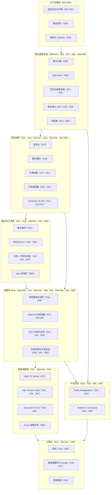

## 前置知识

本文是 Kotlin 模块的全局总结，阅读前建议已经过一遍以下内容：

- [Kotlin 是什么：现代 JVM 语言的起点](/kotlin/001-WhatIsKotlin)：理解 Kotlin 与 Java 同平台、可互操作的关系，以及空安全的设计动机。
- [Kotlin 类与对象](/kotlin/005-KotlinClassObject)：类定义、构造函数、数据类与密封类是本模块类型体系的主干。
- [协程基础](/kotlin/018-CoroutineBasics)：协程是 Kotlin 并发与 Flow 的地基，也是理解服务端框架的前提。

## 学习目标

1. 用一张知识地图串联模块全部文档，形成"基础语法 -> 类与类型系统 -> 语言特性 -> 集合 -> 协程与 Flow -> 平台与框架"的完整学习脉络。
2. 能用自己的话复述每个主题的核心概念，并写出对应主题的惯用 Kotlin 代码。
3. 能准确区分 `lateinit` 与 `by lazy`、`==` 与 `===` 等易混淆概念，并说明各自的适用场景。
4. 能识别平台类型误用、`GlobalScope` 滥用、冷流副作用重复执行等高频陷阱，并给出修正方案。
5. 能基于自检清单定位薄弱环节，规划下一段进阶学习路径。

## 知识地图

下图把模块全部文档按主题分组，箭头大致表示推荐的学习顺序。每个节点标注了对应的文档主题与编号，可以按图索骥回查原文。



## 核心概念回顾

为了让所有示例互相连贯，本文沿用本仓库示例的一贯领域：一个"虚拟歌手音乐平台"，围绕 P 主（producer）、歌姬（virtual singer）、歌曲（song）、演唱会（concert）、应援色（theme color）与粉丝团（fan club）展开。所有代码均可独立运行（协程示例需添加 kotlinx-coroutines 依赖），注释中的编号对应"定义"与"演示"两个阶段。

### 1. 基础语法与空安全

Kotlin 与 Java 编译成同样的 JVM 字节码，可以互相调用，因此企业项目可以在存量 Java 代码上渐进引入。语法上最标志性的变化有两点：其一，`val` 与 `var` 显式区分只读与可变，配合类型推断消除了大量样板；其二，可空性进入了类型系统——`String` 保证非空，`String?` 才允许为 null，编译器强制开发者用安全调用 `?.`、Elvis 运算符 `?:` 或非空断言 `!!` 显式处理 null 情况，把一类运行时崩溃提前到编译期（对应文档 001-003、014）。

```kotlin
// 1. data class 一行定义歌姬：自动生成 equals/hashCode/copy/toString
data class Vsinger(val name: String, val themeColor: String?, val debutYear: Int)

fun main() {
    // 2. 应援色可能缺失：用可空类型显式声明这一事实
    val miku = Vsinger(name = "初音未来", themeColor = "#39C5BB", debutYear = 2007)
    // 3. 安全调用 ?. 与 Elvis ?: 组合：为空时给默认值，编译器强制处理可空值
    val color = miku.themeColor?.uppercase() ?: "#CCCCCC"
    // 4. copy 与具名参数：只修改出道年份，其余字段原样保留（非破坏性更新）
    val miku2027 = miku.copy(debutYear = 2017)
    println("${miku.name} 的应援色是 $color，十周年纪念版出道于 ${miku2027.debutYear} 年")
}
```

### 2. 数据类与密封类：领域建模的两块基石

`data class` 面向"数据载体"：自动生成按值比较的 `equals`、`copy` 与解构声明，适合 DTO 与值对象。`sealed class`（或 `sealed interface`）面向"封闭的状态集合"：它把子类限制在同一编译单元内，使 `when` 表达式可以做编译期穷举检查——漏写一个分支就是编译错误，而不是运行时 bug。两者组合能直接表达函数式编程中的代数数据类型，例如"购票结果要么成功、要么售罄、要么失败"（对应文档 006、015、049）。

```kotlin
// 1. 密封接口：限定"购票结果"的可能状态，类型集合是封闭的
sealed interface TicketResult {
    data class Success(val seat: String) : TicketResult   // 2. 成功：携带座位信息
    data class SoldOut(val song: String) : TicketResult   // 3. 售罄：携带场次信息
    data class Error(val message: String) : TicketResult  // 4. 失败：携带失败原因
}

// 5. when 对密封类型必须穷举：漏写分支直接编译失败，重构新增状态时尤其安全
fun describe(result: TicketResult): String = when (result) {
    is TicketResult.Success -> "购票成功，座位 ${result.seat}"
    is TicketResult.SoldOut -> "《${result.song}》场次已售罄"
    is TicketResult.Error   -> "购票失败：${result.message}"
}
```

### 3. 扩展函数与作用域函数

扩展函数让你在"不改类定义"的前提下为既有类型追加能力，编译成静态方法，调用时却像成员方法一样自然；这也是 Kotlin 标准库 `filter`、`map` 等集合操作的组织方式。作用域函数（`let`、`run`、`with`、`apply`、`also`）则消除"初始化-配置-使用"模式里的重复变量名：`apply` 返回接收者本身，适合集中配置；`let` 返回 Lambda 结果，常与安全调用组合成"非空才执行"（对应文档 017、020、051-052）。

```kotlin
// 1. 扩展函数：不改动 Concert 类，就能追加"开场倒计时"能力
fun Concert.countdown(from: Int): String =
    (from downTo 1).joinToString(" ") { "$it" } + " ${singerName} 登场！"

// 2. 演唱会：部分属性可变，便于用作用域函数集中配置
class Concert(var singerName: String = "初音未来") {
    var venue: String = "待定"
    var lightStickColor: String = "#CCCCCC"
    fun summary() = "${singerName} @ $venue（应援棒 $lightStickColor）"
}

fun main() {
    // 3. apply：在对象作用域内完成集中配置，返回对象本身
    val concert = Concert().apply {
        venue = "东京武道馆"
        lightStickColor = "#39C5BB" // 应援色统一为初音绿
    }
    // 4. 像调用成员方法一样调用扩展函数
    println(concert.summary())
    println(concert.countdown(3))
}
```

### 4. 集合操作

Kotlin 集合分只读与可变两个体系：`List` 与 `MutableList` 是不同接口，只读集合默认不可变，天然利于并发安全。标准库用扩展函数提供了丰富的声明式操作：`filter` 筛选、`map` 转换、`groupBy` 分组、`associateBy` 建索引、`sortedBy` 排序等，链式组合即可完成原本需要多层循环的数据加工（对应文档 021、008）。

```kotlin
fun main() {
    // 1. 不可变列表：Kotlin 集合默认只读，天然线程友好；Pair 携带歌名与 BPM
    val songs = listOf(
        "千本樱" to 154,
        "Melt" to 82,
        "Tell Your World" to 162)

    // 2. filter + sortedByDescending + map：声明式数据流水线
    val fastSongs = songs.filter { it.second >= 150 }
        .sortedByDescending { it.second }
        .map { it.first }

    // 3. groupBy：按 BPM 段位分组，一步得到 Map<String, List<String>>
    val byTempo = songs.groupBy(
        keySelector = { if (it.second >= 120) "快歌" else "慢歌" },
        valueTransform = { it.first })

    println(fastSongs)        // [Tell Your World, 千本樱]
    println(byTempo["快歌"])   // [千本樱, Tell Your World]
}
```

### 5. 委托属性

委托属性把"属性的读写逻辑"交给一个代理对象统一实现：`by lazy` 延迟到首次访问才计算并缓存结果，适合开销大的派生数据；`Delegates.observable` 在值变化时发出通知，适合做表单联动与状态刷新；`by Delegates.vetoable` 还能拦截非法赋值。委托把横切的属性逻辑（缓存、通知、校验）从每个 getter/setter 中抽离出来，正是本模块"委托与扩展"主题的核心思想（对应文档 016）。

```kotlin
import kotlin.properties.Delegates

class VoteCounter {
    // 1. lazy：首次访问才计算并缓存，后续访问直接命中结果
    val slogan: String by lazy {
        println("(计算一次)")
        "初音未来，世界第一歌姬殿下！"
    }
    // 2. observable：每次赋值自动收到新旧值通知，适合实时刷新榜单
    var votes: Int by Delegates.observable(0) { _, old, new ->
        println("票数 $old -> $new")
    }
}

fun main() {
    val counter = VoteCounter()
    println(counter.slogan) // 3. 此刻才执行 lazy 块并缓存
    counter.votes = 1       // 4. 每次赋值触发回调
    counter.votes = 2
}
```

### 6. 协程与结构化并发

协程用"看起来同步"的挂起函数表达异步，避免了回调地狱。`suspend` 函数只能在协程或其他挂起函数中调用；`launch` 启动不返回结果的协程，`async` 启动可返回结果的协程并用 `await` 取值。结构化并发是核心纪律：协程必须在一个 `CoroutineScope` 中启动，作用域结束时自动等待或取消全部子协程，异常也会沿父子关系传播，杜绝"孤儿协程"（对应文档 018、009、046、053）。

```kotlin
import kotlinx.coroutines.*

fun main() = runBlocking {
    // 1. async 并发两个任务：查歌姬资料、查演唱会排期，二者在时间上重叠
    val singer = async(Dispatchers.IO) {
        delay(100)              // 模拟网络耗时
        "初音未来"
    }
    val concert = async(Dispatchers.IO) {
        delay(150)              // 模拟数据库查询
        "Magical Mirai 2026"
    }
    // 2. await 取回结果：总耗时约等于最慢者，而不是两者之和
    println("${singer.await()} 将出演 ${concert.await()}")
    // 3. runBlocking 作用域结束前自动等待全部子协程：结构化并发，无孤儿任务
}
```

### 7. Flow 与响应式数据流

Flow 是协程生态的响应式原语，对标 Reactive Streams 但 API 面积小得多。默认的 `flow` 构建器创建冷流：每次 `collect` 都独立执行一次生产逻辑，`emit` 与 `collect` 都是挂起函数，天然具备背压语义。数据加工用 `map`、`filter`、`debounce` 等操作符链完成；当多个订阅者需要共享同一次计算时，用 `stateIn` 或 `shareIn` 把冷流转换为热流（对应文档 019、047、055）。

```kotlin
import kotlinx.coroutines.*
import kotlinx.coroutines.flow.*

// 1. flow 构建器创建冷流：每次 collect 都独立执行一遍生产逻辑
fun liveVotes(): Flow<Int> = flow {
    var count = 0
    repeat(3) {
        delay(100)      // 模拟观众持续投票
        emit(++count)   // 发射最新票数
    }
}

fun main() = runBlocking {
    // 2. 操作符链：转换、过滤，最终由 collect 触发执行
    liveVotes()
        .map { "当前票数：$it" }
        .collect { println(it) } // 冷流：没有 collect 就什么都不发生
}
```

### 8. 服务端框架与工程化

Kotlin 的服务端有两条主流路线：Spring 官方全面支持 Kotlin（配合 Coroutines 与 WebFlux），Ktor 则是 JetBrains 出品、基于协程的轻量插件化框架，用 DSL 直接声明路由。数据层有 Exposed 这样的 Kotlin ORM；测试有 kotlinx-coroutines-test 与 Kotest；构建用 Gradle Kotlin DSL。Kotlin 的 DSL 能力（接收者 Lambda + 扩展函数）正是这些框架 API 风格的来源（对应文档 027、031-033、011、012、035、037）。

```kotlin
import io.ktor.server.application.*
import io.ktor.server.engine.*
import io.ktor.server.netty.*
import io.ktor.server.response.*
import io.ktor.server.routing.*

fun main() {
    // 1. embeddedServer 内嵌 Netty：无需外部容器，main 函数直接启动服务
    embeddedServer(Netty, port = 8080) {
        routing {
            // 2. DSL 风格路由：路径即代码，花括号内是处理函数
            get("/vsinger/{name}") {
                // 3. 读取路径参数并挂起式返回文本：阻塞感消失
                val name = call.parameters["name"] ?: "unknown"
                call.respondText("$name 的应援色是 #39C5BB")
            }
        }
    }.start(wait = true)
}
```

## 易混淆概念对比

### `lateinit` 与 `by lazy`

| 对比项 | `lateinit var` | `by lazy` |
| --- | --- | --- |
| 适用类型 | 不可空的引用类型（不能是基本类型） | 任意类型 |
| 初始化时机 | 由使用方在合适时机手动赋值 | 首次访问时自动计算并缓存 |
| 线程安全 | 不保证 | 默认 synchronized，可配置 |
| 附加能力 | `::x.isInitialized` 检查 | 天然非空，无未初始化问题 |
| 典型场景 | 依赖注入字段、框架回调前注入 | 昂贵的派生数据、配置缓存 |
| 未初始化访问 | 抛 `UninitializedPropertyAccessException` | 不存在该问题 |

### `==`（结构相等）与 `===`（引用相等）

| 对比项 | `==` | `===` |
| --- | --- | --- |
| 语义 | 编译为 `equals` 调用，比较内容 | 比较是否为同一对象实例 |
| data class | 按属性值逐项比较 | 仅同一实例才返回 true |
| 基本类型 | 直接比较数值 | 装箱后受缓存机制影响 |
| 与 Java 的对应 | `equals()` | `==` |
| 典型场景 | 业务对象、DTO 的内容比较 | 枚举、对象身份判断 |

## 常见误区与排查

1. **把 Java 平台类型当非空用**。Java 方法未标注可空性时，Kotlin 视其为平台类型 `String!`，编译器不强制判空，null 一旦混入就会在运行时抛 NPE。

```kotlin
// 错误：Java 方法返回 String!（平台类型），编译器放行但值可能为 null
val producer = legacyApi.producer
println(producer.length) // 运行时 NullPointerException
// 修正：主动声明可空类型，并用 Elvis 提供兜底
val safeProducer: String? = legacyApi.producer
println(safeProducer?.length ?: 0)
```

2. **访问未初始化的 `lateinit` 属性**。`lateinit` 的初始化时机由使用方负责，注入流程被跳过时访问即崩溃。

```kotlin
class ConcertPage {
    lateinit var banner: String // 延迟到框架回调时注入
}
// 错误：注入尚未发生就访问，抛 UninitializedPropertyAccessException
fun show(page: ConcertPage) = println(page.banner)
// 修正 1：访问前用反射引用检查初始化状态
fun showSafe(page: ConcertPage) {
    if (::page.banner.isInitialized) println(page.banner)
}
// 修正 2：若初始化不依赖外部注入，改用 lazy 自动管理
val banner2: String by lazy { "初音未来演唱会" }
```

3. **滥用 `GlobalScope`**。它脱离结构化并发的父子关系，协程生命周期无人管理，页面销毁后仍在运行，既泄漏资源又难以取消。

```kotlin
// 错误：孤儿协程，随页面销毁继续运行并泄漏
GlobalScope.launch { fetchSetlist() }
// 修正：绑定到与生命周期同长的作用域，页面关闭时自动取消
lifecycleScope.launch { fetchSetlist() }        // Android 场景
// 非 Android 场景：在调用方作用域内 launch，异常与取消沿父子关系传播
coroutineScope { launch { fetchSetlist() } }
```

4. **误以为 `data class` 的 `copy` 是深拷贝**。`copy` 只复制属性值，集合与可变对象成员仍指向同一个实例，"复制"后修改会互相污染。

```kotlin
data class Setlist(val songs: MutableList<String>)
val a = Setlist(mutableListOf("千本樱"))
val b = a.copy()      // 错误：只复制了引用，a.songs 与 b.songs 是同一个列表
b.songs.add("Melt")   // 连带污染 a 的数据
// 修正：copy 时显式重建可变成员
val c = a.copy(songs = a.songs.toMutableList())
```

5. **在生产代码里用 `runBlocking` 补链路**。`runBlocking` 会阻塞当前线程直到内部协程结束，出现在挂起函数内部会破坏非阻塞语义与取消传播。

```kotlin
// 错误：挂起函数内部再起阻塞桥，白白占用一个线程
suspend fun loadVotes(): Int = runBlocking { api.fetchVotes() }
// 修正：保持 suspend 链路，直接调用其他挂起函数
suspend fun loadVotesFixed(): Int = api.fetchVotes()
```

6. **冷流的副作用被重复执行**。冷流在每个订阅者 `collect` 时独立运行，若流内包含数据库查询等副作用，多订阅者会放大成本。

```kotlin
// 错误：每个订阅者都会触发一次 loadSongs，重复查询数据库
val setlist = flow { emit(repository.loadSongs()) }
// 修正：用 stateIn 转为热流，让所有订阅者共享同一次计算
val shared = repository.songFlow()
    .stateIn(viewModelScope, SharingStarted.WhileSubscribed(5_000), emptyList())
```

## 自检清单

- [ ] 能说明 Kotlin 与 Java 编译产物相同、可互相调用，以及迁移存量项目的渐进策略。
- [ ] 能正确使用可空类型、安全调用与 Elvis 运算符消除判空样板。
- [ ] 能用 `data class` 与 `copy` 实现数据的非破坏性更新，并说出其自动生成的成员。
- [ ] 能用密封类与 `when` 构建编译期穷举的状态机，并解释穷举检查的价值。
- [ ] 能说出 `let`/`run`/`with`/`apply`/`also` 的返回值与接收者差异并按场景选择。
- [ ] 能用 `filter`/`map`/`groupBy` 等集合操作完成常见数据加工。
- [ ] 能解释 `by lazy` 与 `lateinit` 的初始化时机差异并正确选用。
- [ ] 能用 `async`/`await` 并发执行任务，并解释结构化并发的取消与异常传播规则。
- [ ] 能区分冷流与热流，并说明 `stateIn`/`shareIn` 的适用场景。
- [ ] 能用 Ktor 或 Spring 暴露一个最简单的 HTTP 接口并配置协程调度器。

## 后续学习路径

如果自检中发现薄弱环节，建议按以下顺序回到模块文档回炉，再向进阶主题推进：

1. **夯实协程体系**：[Kotlin 协程进阶](/kotlin/009-KotlinCoroutineAdvanced)、[协程调度器与上下文](/kotlin/046-CoroutineDispatcherContext) 与 [协程异常处理](/kotlin/053-CoroutineExceptionHandling)，建立完整的并发心智模型。
2. **深入 Flow**：[Flow 与响应式流](/kotlin/019-FlowReactiveStream) 与 [Flow 进阶](/kotlin/055-FlowAdvanced)，掌握背压、共享状态与热流转换。
3. **打通服务端全链路**：[Kotlin 与 Ktor](/kotlin/031-KotlinKtor) 搭配 [Kotlin 与 Spring](/kotlin/027-KotlinSpring)，再以 [Kotlin Exposed](/kotlin/032-KotlinExposed) 落地数据层。
4. **扩展到多平台**：[Kotlin Multiplatform](/kotlin/010-KotlinMultiplatform) 与 [Kotlin Compose](/kotlin/029-KotlinCompose)，把同一套业务逻辑复用到多端。
5. **强化工程能力**：[Kotlin 测试](/kotlin/035-KotlinTest)、[Kotlin Gradle](/kotlin/037-KotlinGradle) 与 [Kotlin 与 Java 互操作](/kotlin/056-KotlinJavaInterop)，保证代码质量与平滑迁移。
