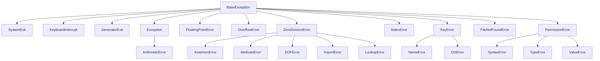

## 前置知识

- [装饰器进阶](/python/065-DecoratorAdvanced)：建议先完成前一篇的学习

## 学习目标

- 掌握「1. 异常体系 (Exception Hierarchy)」的核心机制、典型用法与常见陷阱
- 掌握「2. 捕获处理 (Try-Except)」的核心机制、典型用法与常见陷阱
- 掌握「3. 抛出异常 (Raise)」的核心机制、典型用法与常见陷阱
- 掌握「4. 断言 (Assert)」的核心机制、典型用法与常见陷阱
- 掌握「5. 自定义异常 (Custom Exception)」的核心机制、典型用法与常见陷阱


## 1. 异常体系 (Exception Hierarchy)

Python 中的所有异常都派生自 `BaseException` 类，形成了一个层次结构。

### 1.1 异常层次结构



### 1.2 常见异常类型

| 异常类型            | 描述         | 示例                          |
| ------------------- | ------------ | ----------------------------- |
| `ZeroDivisionError` | 除数为零     | `1 / 0`                       |
| `TypeError`         | 类型错误     | `"2" + 2`                     |
| `ValueError`        | 值错误       | `int("abc")`                  |
| `IndexError`        | 索引越界     | `[1, 2, 3][5]`                |
| `KeyError`          | 字典键不存在 | `{"a": 1}["b"]`               |
| `FileNotFoundError` | 文件未找到   | `open("non_existent.txt")`    |
| `PermissionError`   | 权限错误     | `open("/etc/passwd", "w")`    |
| `NameError`         | 名称未定义   | `print(undefined_variable)`   |
| `SyntaxError`       | 语法错误     | `if  print("Hello")`          |
| `AttributeError`    | 属性不存在   | `"string".undefined_method()` |

## 2. 捕获处理 (Try-Except)

### 2.1 基本语法

```python
 try:
  # 可能引发异常的代码
  result = 10 / 0
 except ZeroDivisionError as e:
  # 捕获特定异常
  print(f"Error: {e}")
 else:
  # 无异常时执行
  print("Success!")
 finally:
  # 无论是否有异常都执行
  print("Cleanup done.")
```

### 2.2 捕获多种异常

```python
 try:
  # 可能引发多种异常的代码
  value = int(input("Enter a number: "))
  result = 10 / value
 except ValueError as e:
  # 捕获值错误
  print(f"Invalid input: {e}")
 except ZeroDivisionError as e:
  # 捕获除零错误
  print(f"Cannot divide by zero: {e}")
 except Exception as e:
  # 捕获其他所有异常
  print(f"An error occurred: {e}")
```

### 2.3 捕获异常的元组

```python
 try:
  # 可能引发异常的代码
  value = int(input("Enter a number: "))
  result = 10 / value
 except (ValueError, ZeroDivisionError) as e:
  # 捕获多种异常
  print(f"Error: {e}")
```

### 2.4 无异常时执行 (else 子句)

```python
 try:
  # 可能引发异常的代码
  result = 10 / 2
 except ZeroDivisionError:
  print("Cannot divide by zero")
 else:
  # 无异常时执行
  print(f"Result: {result}")
 finally:
  print("Execution completed")
```

### 2.5 无论是否有异常都执行 (finally 子句)

```python
 try:
  # 可能引发异常的代码
  file = open("data.txt", "r")
  content = file.read()
 except FileNotFoundError:
  print("File not found")
 finally:
  # 无论是否有异常都执行，用于清理资源
  if 'file' in locals():
  file.close()
  print("File handling completed")
```

## 3. 抛出异常 (Raise)

### 3.1 基本用法

```python
 def divide(a, b):
  if b == 0:
  raise ZeroDivisionError("Cannot divide by zero")
  return a / b
 # 使用
 try:
  result = divide(10, 0)
 except ZeroDivisionError as e:
  print(f"Error: {e}")
```

### 3.2 重新抛出异常

```python
 try:
  # 可能引发异常的代码
  result = 10 / 0
 except ZeroDivisionError as e:
  print(f"Caught an error: {e}")
  # 重新抛出异常
  raise
```

### 3.3 抛出异常并指定原因

```python
 try:
  # 可能引发异常的代码
  value = int("abc")
 except ValueError as e:
  # 抛出新异常并指定原因
  raise ValueError("Invalid input") from e
```

## 4. 断言 (Assert)

断言用于调试和内部检查，当条件为 False 时会引发 `AssertionError` 异常。

### 4.1 基本用法

```python
 def calculate_discount(price, discount):
  # 断言折扣必须在 0 到 1 之间
  assert 0 <= discount < 1, "Discount must be between 0 and 1"
  return price * (1 - discount)
 # 使用
 print(calculate_discount(100, 0.2)) # 输出: 80.0
 # print(calculate_discount(100, 1.5)) # 引发 AssertionError: Discount must be between 0 and 1
```

### 4.2 断言的使用场景

- **调试**：在开发阶段检查条件是否满足
- **代码文档**：明确函数的前置条件
- **内部检查**：确保代码逻辑的正确性

### 4.3 注意事项

- 断言可以通过 `-O` 选项禁用，因此不应该用于处理运行时错误
- 断言失败会直接终止程序，因此应该只用于开发和测试阶段

## 5. 自定义异常 (Custom Exception)

### 5.1 基本自定义异常

```python
 class MyError(Exception):
  """自定义异常类"""
  pass
 # 使用
 try:
  raise MyError("This is a custom error")
 except MyError as e:
  print(f"Caught custom error: {e}")
```

### 5.2 带额外属性的自定义异常

```python
 class BusinessError(Exception):
  """业务异常类"""
  def __init__(self, message, error_code):
  super().__init__(message)
  self.error_code = error_code
 # 使用
 try:
  raise BusinessError("Insufficient funds", 4001)
 except BusinessError as e:
  print(f"Error: {e}")
  print(f"Error code: {e.error_code}")
```

### 5.3 异常层次结构

```python
 class BaseError(Exception):
  """基础异常类"""
  pass
 class AuthenticationError(BaseError):
  """认证异常"""
  pass
 class AuthorizationError(BaseError):
  """授权异常"""
  pass
 class NotFoundError(BaseError):
  """资源未找到异常"""
  pass
 # 使用
 try:
  raise AuthenticationError("Invalid credentials")
 except BaseError as e:
  print(f"Base error: {e}")
 except Exception as e:
  print(f"Other error: {e}")
```

## 6. 异常处理的最佳实践

### 6.1 只捕获必要的异常

```python
 # 不好的做法
 try:
  # 可能引发多种异常的代码
  value = int(input("Enter a number: "))
  result = 10 / value
 except:
  # 捕获所有异常，包括系统退出等
  print("An error occurred")
 # 好的做法
 try:
  value = int(input("Enter a number: "))
  result = 10 / value
 except ValueError:
  print("Invalid input")
 except ZeroDivisionError:
  print("Cannot divide by zero")
```

### 6.2 提供具体的错误信息

```python
 # 不好的做法
 try:
  file = open("data.txt", "r")
 except FileNotFoundError:
  print("Error")
 # 好的做法
 try:
  file = open("data.txt", "r")
 except FileNotFoundError as e:
  print(f"Error opening file: {e}")
```

### 6.3 使用 finally 或 with 语句清理资源

```python
 # 使用 finally
 try:
  file = open("data.txt", "r")
  content = file.read()
 except FileNotFoundError:
  print("File not found")
 finally:
  if 'file' in locals():
  file.close()
 # 使用 with 语句（更简洁）
 try:
  with open("data.txt", "r") as file:
  content = file.read()
 except FileNotFoundError:
  print("File not found")
 # 文件会自动关闭
```

### 6.4 避免过度使用异常

```python
 # 不好的做法
 try:
  value = int(input("Enter a number: "))
 except ValueError:
  print("Invalid input")
 # 好的做法（对于简单的输入验证）
 user_input = input("Enter a number: ")
 if user_input.isdigit():
  value = int(user_input)
 else:
  print("Invalid input")
```

### 6.5 合理使用异常层次结构

```python
 def process_data(data):
  try:
  # 处理数据
  pass
  except AuthenticationError:
  # 处理认证错误
  pass
  except AuthorizationError:
  # 处理授权错误
  pass
  except BaseError as e:
  # 处理其他业务错误
  pass
  except Exception as e:
  # 处理系统错误
  pass
```

## 7. 上下文管理器与异常处理

### 7.1 使用 `with` 语句

`with` 语句用于管理资源，确保资源在使用后被正确释放，即使发生异常。

```python
 # 使用 with 语句打开文件
 with open("data.txt", "r") as file:
  content = file.read()
  print(content)
 # 文件会自动关闭
 # 使用 with 语句处理多个资源
 with open("input.txt", "r") as infile, open("output.txt", "w") as outfile:
  content = infile.read()
  outfile.write(content)
 # 两个文件都会自动关闭
```

### 7.2 自定义上下文管理器

```python
 class MyContextManager:
  def __enter__(self):
  """进入上下文时执行"""
  print("Entering context")
  return self
  def __exit__(self, exc_type, exc_val, exc_tb):
  """退出上下文时执行"""
  print("Exiting context")
  if exc_type:
  print(f"An exception occurred: {exc_val}")
  # 返回  表示异常已处理，返回 False 表示异常需要继续传播
  return False
 # 使用自定义上下文管理器
 with MyContextManager() as cm:
  print("Inside context")
  # 引发异常
  raise ValueError("Test error")
 # 输出:
 # Entering context
 # Inside context
 # Exiting context
 # An exception occurred: Test error
 # Traceback (most recent call last):
 # ...
 # ValueError: Test error
```

## 8. 实际应用示例

### 8.1 文件操作

```python
 def read_file(file_path):
  """读取文件内容"""
  try:
  with open(file_path, "r", encoding="utf-8") as file:
  content = file.read()
  return content
  except FileNotFoundError:
  print(f"Error: File '{file_path}' not found")
  return None
  except PermissionError:
  print(f"Error: Permission denied for '{file_path}'")
  return None
  except UnicodeDecodeError:
  print(f"Error: Unable to decode file '{file_path}'")
  return None
 # 使用
 content = read_file("data.txt")
 if content:
  print(f"File content: {content[:100]}...")
```

### 8.2 网络请求

```python
 import requests
 def fetch_data(url):
  """获取网络数据"""
  try:
  response = requests.get(url, timeout=5)
  response.raise_for_status() # 引发 HTTP 错误
  return response.json()
  except requests.exceptions.Timeout:
  print("Error: Request timed out")
  return None
  except requests.exceptions.HTTPError as e:
  print(f"Error: HTTP error - {e}")
  return None
  except requests.exceptions.ConnectionError:
  print("Error: Connection error")
  return None
  except ValueError:
  print("Error: Invalid JSON response")
  return None
 # 使用
 data = fetch_data("https://api.example.com/data")
 if data:
  print(f"Data received: {data}")
```

### 8.3 数据库操作

```python
 import sqlite3
 def get_user(user_id):
  """从数据库获取用户信息"""
  try:
  conn = sqlite3.connect("users.db")
  cursor = conn.cursor()
  cursor.execute("SELECT * FROM users WHERE id = ?", (user_id,))
  user = cursor.fetchone()
  return user
  except sqlite3.Error as e:
  print(f"Database error: {e}")
  return None
  finally:
  if 'conn' in locals():
  conn.close()
 # 使用
 user = get_user(1)
 if user:
  print(f"User: {user}")
```

### 8.4 业务逻辑

```python
 class InsufficientFundsError(Exception):
  """余额不足异常"""
  pass
 class Account:
  def __init__(self, balance):
  self.balance = balance
  def withdraw(self, amount):
  if amount > self.balance:
  raise InsufficientFundsError(f"Insufficient funds. Balance: {self.balance}, Requested: {amount}")
  self.balance -= amount
  return self.balance
 # 使用
 try:
  account = Account(1000)
  new_balance = account.withdraw(1500)
  print(f"New balance: {new_balance}")
 except InsufficientFundsError as e:
  print(f"Error: {e}")
```

## 9. 异常处理的性能考虑

### 9.1 异常的开销

异常处理会带来一定的性能开销，尤其是在频繁发生异常的情况下。因此，对于预期可能发生的情况，应该使用条件检查而不是异常处理。

```python
 # 性能较差的做法（频繁引发异常）
 def process_values(values):
  results = []
  for value in values:
  try:
  results.append(1 / value)
  except ZeroDivisionError:
  results.append(0)
  return results
 # 性能较好的做法（使用条件检查）
 def process_values(values):
  results = []
  for value in values:
  if value != 0:
  results.append(1 / value)
  else:
  results.append(0)
  return results
```

### 9.2 异常处理的最佳实践

- 只在真正意外的情况下使用异常
- 对于预期的错误情况，使用条件检查
- 保持异常处理代码简洁
- 避免在循环中频繁引发异常
- 合理使用异常层次结构，便于维护

---

## try-except 语句

**基本写法：基本 try-except**
`try: <语句> except <异常>: <处理>`

```python
# 基本 try-except 异常处理
try:
    result = 10 / 0
except ZeroDivisionError:
    print("除零错误")
```

---

**基本写法：捕获异常信息**
`try: <语句> except <异常> as <变量>: <处理>`

```python
# 捕获异常信息到变量
try:
    result = 10 / 0
except ZeroDivisionError as e:
    print(f"错误: {e}")
```

---

**基本写法：捕获多种异常**
`try: <语句> except (<异常1>, <异常2>): <处理>`

```python
# 捕获多种异常类型
try:
    value = int("abc")
except (ValueError, TypeError) as e:
    print(f"转换错误: {e}")
```

---

**换行写法：多 except 块**
`try: <语句>`
`except <异常1>: <处理1>`
`except <异常2>: <处理2>`

```python
# 多个 except 块分别处理不同异常
try:
    value = int(input("请输入数字: "))
    result = 10 / value
except ValueError:
    print("输入不是有效数字")
except ZeroDivisionError:
    print("不能除以零")
```

---

## try-except-else 语句

**基本写法：try-except-else**
`try: <语句> except <异常>: <处理> else: <无异常时执行>`

```python
# try-except-else 语句
try:
    value = int("123")
except ValueError:
    print("转换失败")
else:
    print(f"转换成功: {value}")
```

---

## try-finally 语句

**基本写法：try-finally**
`try: <语句> finally: <无论是否异常都执行>`

```python
# try-finally 语句
try:
    file = open("test.txt", "r")
    content = file.read()
finally:
    file.close()
```

---

## try-except-finally 语句

**换行写法：完整的异常处理结构**
`try: <语句>`
`except <异常>: <处理>`
`else: <无异常时执行>`
`finally: <清理>`

```python
# 完整的 try-except-else-finally 结构
try:
    file = open("test.txt", "r")
    content = file.read()
except FileNotFoundError:
    print("文件不存在")
    content = ""
else:
    print("文件读取成功")
finally:
    file.close()
```

---

## 抛出异常

**基本写法：使用 raise 抛出异常**
`raise <异常>(<消息>)`

```python
# 使用 raise 抛出异常
def check_age(age):
    if age < 0:
        raise ValueError("年龄不能为负数")
    return age
```

---

**基本写法：重新抛出当前异常**
`raise`

```python
# 重新抛出当前捕获的异常
try:
    result = 10 / 0
except ZeroDivisionError:
    print("记录错误日志")
    raise
```

---

**基本写法：抛出异常链**
`raise <新异常> from <原异常>`

```python
# 抛出异常链（保留原始异常）
try:
    result = 10 / 0
except ZeroDivisionError as e:
    raise RuntimeError("计算失败") from e
```

---

## 自定义异常

**换行写法：定义自定义异常类**
`class <异常类>(Exception):`
`    def __init__(self, <参数>): <语句>`

```python
# 定义自定义异常类
class InvalidAgeError(Exception):
    def __init__(self, age, message="年龄无效"):
        self.age = age
        self.message = message
        super().__init__(self.message)
```

---

**换行写法：定义带额外属性的自定义异常**
`class <异常类>(Exception):`
`    def __init__(self, <参数>):`
`        self.<属性> = <值>`
`        super().__init__(<消息>)`

```python
# 定义带额外属性的自定义异常
class DatabaseError(Exception):
    def __init__(self, query, error_code):
        self.query = query
        self.error_code = error_code
        super().__init__(f"Database error {error_code}: {query}")
```

---

**基本写法：使用自定义异常**
`raise <自定义异常>(<参数>)`

```python
# 使用自定义异常
def set_age(age):
    if age < 0 or age > 150:
        raise InvalidAgeError(age)
    return age
```

---

**基本写法：捕获自定义异常**
`try: <语句> except <自定义异常> as <变量>: <处理>`

```python
# 捕获自定义异常
try:
    set_age(-5)
except InvalidAgeError as e:
    print(f"错误: {e.message}, 年龄: {e.age}")
```

---

## 异常层次结构

**基本写法：捕获 Exception 基类**
`try: <语句> except Exception: <处理>`

```python
# 捕获 Exception 基类（捕获所有非系统退出异常）
try:
    result = 10 / 0
except Exception as e:
    print(f"发生异常: {e}")
```

---

**基本写法：捕获 BaseException**
`try: <语句> except BaseException: <处理>`

```python
# 捕获 BaseException（包括 KeyboardInterrupt 等）
try:
    result = 10 / 0
except BaseException as e:
    print(f"发生异常: {e}")
```

---

## 常见内置异常

**基本写法：ValueError 值错误**
`raise ValueError(<消息>)`

```python
# 抛出 ValueError
def parse_int(value):
    if not value.isdigit():
        raise ValueError(f"无法转换为整数: {value}")
    return int(value)
```

---

**基本写法：TypeError 类型错误**
`raise TypeError(<消息>)`

```python
# 抛出 TypeError
def add(a, b):
    if not isinstance(a, (int, float)) or not isinstance(b, (int, float)):
        raise TypeError("参数必须是数字")
    return a + b
```

---

**基本写法：KeyError 键错误**
`raise KeyError(<键>)`

```python
# 抛出 KeyError
def get_value(dictionary, key):
    if key not in dictionary:
        raise KeyError(f"键不存在: {key}")
    return dictionary[key]
```

---

**基本写法：IndexError 索引错误**
`raise IndexError(<消息>)`

```python
# 抛出 IndexError
def get_item(lst, index):
    if index >= len(lst):
        raise IndexError(f"索引超出范围: {index}")
    return lst[index]
```

---

**基本写法：AttributeError 属性错误**
`raise AttributeError(<消息>)`

```python
# 抛出 AttributeError
class MyClass:
    pass

obj = MyClass()
if not hasattr(obj, "name"):
    raise AttributeError("对象没有 name 属性")
```

---

**基本写法：FileNotFoundError 文件未找到错误**
`raise FileNotFoundError(<文件路径>)`

```python
# 抛出 FileNotFoundError
import os

def read_file(path):
    if not os.path.exists(path):
        raise FileNotFoundError(f"文件不存在: {path}")
    with open(path, "r") as f:
        return f.read()
```

---

## 异常处理最佳实践

**基本写法：捕获具体异常**
`try: <语句> except <具体异常>: <处理>`

```python
# 捕获具体异常而非通用异常
try:
    value = int("abc")
except ValueError:
    print("值错误")
```

---

**基本写法：使用上下文管理器替代 try-finally**
`with <资源> as <变量>: <语句>`

```python
# 使用 with 语句替代 try-finally
with open("test.txt", "r") as f:
    content = f.read()
```

---

## 异常断言

**基本写法：使用 assert 断言**
`assert <条件>, <消息>`

```python
# 使用 assert 断言条件
def calculate_average(numbers):
    assert len(numbers) > 0, "列表不能为空"
    return sum(numbers) / len(numbers)
```

---

**基本写法：禁用 assert 优化**
`python -O <脚本>`

```python
# 使用 -O 选项运行时，assert 语句会被忽略
# 命令行执行：python -O script.py
```

---

## 异常组（Python 3.11+）

**基本写法：使用 ExceptionGroup**
`raise ExceptionGroup(<消息>, [<异常1>, <异常2>])`

```python
# 抛出异常组
errors = [
    ValueError("第一个错误"),
    TypeError("第二个错误"),
]
raise ExceptionGroup("多个错误发生", errors)
```

---

**基本写法：使用 except* 捕获异常组**
`try: <语句> except* <异常>: <处理>`

```python
# 使用 except* 捕获异常组中的特定类型
try:
    raise ExceptionGroup("错误组", [ValueError("值错误"), TypeError("类型错误")])
except* ValueError:
    print("捕获到 ValueError")
except* TypeError:
    print("捕获到 TypeError")
```

---

## 异常上下文

**基本写法：访问异常上下文**
`<异常>.__context__`

```python
# 访问异常的上下文（隐式链）
try:
    try:
        result = 10 / 0
    except ZeroDivisionError:
        raise RuntimeError("处理失败")
except RuntimeError as e:
    print(f"异常: {e}")
    print(f"上下文: {e.__context__}")
```

---

**基本写法：访问异常原因**
`<异常>.__cause__`

```python
# 访问异常的原因（显式链）
try:
    try:
        result = 10 / 0
    except ZeroDivisionError as e:
        raise RuntimeError("处理失败") from e
except RuntimeError as e:
    print(f"异常: {e}")
    print(f"原因: {e.__cause__}")
```

---

## 自定义异常处理

**换行写法：定义带异常处理的基类**
`class <基类>:`
`    def <方法>(self):`
`        try: <语句>`
`        except <异常>: <处理>`

```python
# 定义带异常处理的基类
class Repository:
    def find_by_id(self, entity_id):
        try:
            return self._fetch(entity_id)
        except KeyError:
            return None
        except Exception as e:
            raise DatabaseError(f"查询失败: {e}")
```

---

**换行写法：定义异常处理装饰器**
`def <装饰器名>(func):`
`    def wrapper(*args, **kwargs):`
`        try: return func(*args, **kwargs)`
`        except <异常>: <处理>`
`    return wrapper`

```python
# 定义异常处理装饰器
def handle_errors(default=None):
    def decorator(func):
        def wrapper(*args, **kwargs):
            try:
                return func(*args, **kwargs)
            except Exception as e:
                print(f"错误: {e}")
                return default
        return wrapper
    return decorator
```

---

## 异常日志记录

**基本写法：使用 logging 记录异常**
`import logging`
`logging.exception(<消息>)`

```python
# 使用 logging 记录异常
import logging

try:
    result = 10 / 0
except ZeroDivisionError:
    logging.exception("发生除零错误")
```

---

**基本写法：使用 traceback 记录异常**
`import traceback`
`traceback.print_exc()`

```python
# 使用 traceback 打印异常堆栈
import traceback

try:
    result = 10 / 0
except ZeroDivisionError:
    traceback.print_exc()
```

---

## 上下文管理器异常处理

**换行写法：自定义上下文管理器处理异常**
`class <上下文管理器>:`
`    def __enter__(self): <语句>`
`    def __exit__(self, exc_type, exc_val, exc_tb): <处理>`

```python
# 自定义上下文管理器处理异常
class SafeOperation:
    def __enter__(self):
        print("开始操作")
        return self

    def __exit__(self, exc_type, exc_val, exc_tb):
        if exc_type is not None:
            print(f"捕获异常: {exc_val}")
            return True
        print("操作完成")
        return False
```

---

**基本写法：使用 contextlib.suppress 抑制异常**
`with suppress(<异常>): <语句>`

```python
# 使用 contextlib.suppress 抑制特定异常
from contextlib import suppress

with suppress(FileNotFoundError):
    with open("nonexistent.txt", "r") as f:
        content = f.read()
```

---

## 异常重试机制

**换行写法：实现重试装饰器**
`def <装饰器>(retries=<n>):`
`    def decorator(func):`
`        def wrapper(*args, **kwargs):`
`            for i in range(retries):`
`                try: return func(*args, **kwargs)`
`                except <异常>: <处理>`
`        return wrapper`
`    return decorator`

```python
# 实现重试装饰器
import time

def retry(max_retries=3, delay=1):
    def decorator(func):
        def wrapper(*args, **kwargs):
            for attempt in range(max_retries):
                try:
                    return func(*args, **kwargs)
                except Exception as e:
                    if attempt == max_retries - 1:
                        raise
                    time.sleep(delay)
        return wrapper
    return decorator
```
