## 前置知识

- [性能优化](/react/008-PerformanceOptimization)：建议先完成前一篇的学习

## 学习目标

- 掌握「1. Vitest 与 Testing Library」的核心机制、典型用法与常见陷阱
- 掌握「2. E2E 测试（Playwright）」的核心机制、典型用法与常见陷阱
- 掌握「3. Storybook」的核心机制、典型用法与常见陷阱
- 掌握「4. ESLint / Prettier」的核心机制、典型用法与常见陷阱
- 掌握「5. CI/CD」的核心机制、典型用法与常见陷阱


## 1. Vitest 与 Testing Library

### 1.1 安装配置

```bash
npm install -D vitest @testing-library/react @testing-library/jest-dom @testing-library/user-event jsdom
```

```ts
// vitest.config.ts
import { defineConfig } from 'vitest/config';
import react from '@vitejs/plugin-react';

export default defineConfig({
  plugins: [react()],
  test: {
    environment: 'jsdom',
    globals: true,
    setupFiles: ['./src/test/setup.ts'],
    css: true,
  },
});
```

```ts
// src/test/setup.ts
import '@testing-library/jest-dom/vitest';
```

```json
// package.json
{
  "scripts": {
    "test": "vitest",
    "test:ui": "vitest --ui",
    "test:coverage": "vitest --coverage"
  }
}
```

### 1.2 组件测试

```tsx
// src/components/Counter.tsx
import { useState } from 'react';

export function Counter({ initialValue = 0 }: { initialValue?: number }) {
  const [count, setCount] = useState(initialValue);

  return (
    <div>
      <span data-testid="count">{count}</span>
      <button onClick={() => setCount((c) => c + 1)}>增加</button>
      <button onClick={() => setCount((c) => c - 1)}>减少</button>
    </div>
  );
}
```

```tsx
// src/components/__tests__/Counter.test.tsx
import { describe, it, expect } from 'vitest';
import { render, screen } from '@testing-library/react';
import userEvent from '@testing-library/user-event';
import { Counter } from '../Counter';

describe('Counter', () => {
  it('渲染初始值', () => {
    render(<Counter initialValue={5} />);
    expect(screen.getByTestId('count')).toHaveTextContent('5');
  });

  it('点击增加按钮', async () => {
    const user = userEvent.setup();
    render(<Counter />);

    await user.click(screen.getByText('增加'));
    expect(screen.getByTestId('count')).toHaveTextContent('1');
  });

  it('点击减少按钮', async () => {
    const user = userEvent.setup();
    render(<Counter initialValue={3} />);

    await user.click(screen.getByText('减少'));
    expect(screen.getByTestId('count')).toHaveTextContent('2');
  });
});
```

### 1.3 异步组件测试

```tsx
// 组件
function UserList() {
  const [users, setUsers] = useState<User[]>([]);
  const [loading, setLoading] = useState(true);

  useEffect(() => {
    fetch('/api/users')
      .then((res) => res.json())
      .then((data) => {
        setUsers(data);
        setLoading(false);
      });
  }, []);

  if (loading) return <p>加载中...</p>;

  return (
    <ul>
      {users.map((u) => (
        <li key={u.id}>{u.name}</li>
      ))}
    </ul>
  );
}
```

```tsx
// 测试
import { describe, it, expect, beforeEach, afterEach } from 'vitest';
import { render, screen, waitFor } from '@testing-library/react';
import { UserList } from '../UserList';

describe('UserList', () => {
  beforeEach(() => {
    // 模拟 fetch
    globalThis.fetch = vi.fn(() =>
      Promise.resolve({
        json: () =>
          Promise.resolve([
            { id: 1, name: '张三' },
            { id: 2, name: '李四' },
          ]),
      } as Response)
    );
  });

  afterEach(() => {
    vi.restoreAllMocks();
  });

  it('显示加载状态', () => {
    render(<UserList />);
    expect(screen.getByText('加载中...')).toBeInTheDocument();
  });

  it('加载完成后显示用户列表', async () => {
    render(<UserList />);
    await waitFor(() => {
      expect(screen.getByText('张三')).toBeInTheDocument();
      expect(screen.getByText('李四')).toBeInTheDocument();
    });
  });
});
```

### 1.4 Hook 测试

```tsx
// src/hooks/useCounter.ts
import { useState, useCallback } from 'react';

export function useCounter(initialValue = 0) {
  const [count, setCount] = useState(initialValue);
  const increment = useCallback(() => setCount((c) => c + 1), []);
  const decrement = useCallback(() => setCount((c) => c - 1), []);
  const reset = useCallback(() => setCount(initialValue), [initialValue]);

  return { count, increment, decrement, reset };
}
```

```tsx
// src/hooks/__tests__/useCounter.test.ts
import { renderHook, act } from '@testing-library/react';
import { useCounter } from '../useCounter';

describe('useCounter', () => {
  it('初始值', () => {
    const { result } = renderHook(() => useCounter(5));
    expect(result.current.count).toBe(5);
  });

  it('增加', () => {
    const { result } = renderHook(() => useCounter());
    act(() => result.current.increment());
    expect(result.current.count).toBe(1);
  });

  it('重置', () => {
    const { result } = renderHook(() => useCounter(10));
    act(() => result.current.increment());
    act(() => result.current.reset());
    expect(result.current.count).toBe(10);
  });
});
```

## 2. E2E 测试（Playwright）

### 2.1 安装配置

```bash
npm install -D @playwright/test
npx playwright install
```

```ts
// playwright.config.ts
import { defineConfig } from '@playwright/test';

export default defineConfig({
  testDir: './e2e',
  fullyParallel: true,
  retries: process.env.CI ? 2 : 0,
  use: {
    baseURL: 'http://localhost:5173',
    trace: 'on-first-retry',
  },
  webServer: {
    command: 'npm run dev',
    url: 'http://localhost:5173',
    reuseExistingServer: !process.env.CI,
  },
});
```

### 2.2 编写 E2E 测试

```tsx
// e2e/auth.spec.ts
import { test, expect } from '@playwright/test';

test.describe('认证流程', () => {
  test('登录成功后跳转到首页', async ({ page }) => {
    await page.goto('/login');

    await page.fill('[name="email"]', 'test@example.com');
    await page.fill('[name="password"]', 'password123');
    await page.click('button[type="submit"]');

    await expect(page).toHaveURL('/');
    await expect(page.locator('h1')).toContainText('欢迎');
  });

  test('登录失败显示错误信息', async ({ page }) => {
    await page.goto('/login');

    await page.fill('[name="email"]', 'wrong@example.com');
    await page.fill('[name="password"]', 'wrong');
    await page.click('button[type="submit"]');

    await expect(page.locator('.error')).toBeVisible();
  });
});
```

```tsx
// e2e/todo.spec.ts
import { test, expect } from '@playwright/test';

test.describe('待办事项', () => {
  test.beforeEach(async ({ page }) => {
    await page.goto('/todos');
  });

  test('添加待办事项', async ({ page }) => {
    await page.fill('[name="todo"]', '学习 React 19');
    await page.click('button[type="submit"]');

    await expect(page.locator('li')).toContainText('学习 React 19');
  });

  test('完成待办事项', async ({ page }) => {
    await page.fill('[name="todo"]', '学习 React 19');
    await page.click('button[type="submit"]');

    const item = page.locator('li').last();
    await item.click();

    await expect(item).toHaveClass(/completed/);
  });
});
```

## 3. Storybook

### 3.1 安装

```bash
npx storybook@latest init
```

### 3.2 编写 Story

```tsx
// src/components/Button/Button.tsx
interface ButtonProps {
  variant: 'primary' | 'secondary' | 'danger';
  size: 'sm' | 'md' | 'lg';
  children: React.ReactNode;
  onClick?: () => void;
  disabled?: boolean;
}

export function Button({ variant, size, children, onClick, disabled }: ButtonProps) {
  return (
    <button className={`btn btn-${variant} btn-${size}`} onClick={onClick} disabled={disabled}>
      {children}
    </button>
  );
}
```

```tsx
// src/components/Button/Button.stories.tsx
import type { Meta, StoryObj } from '@storybook/react';
import { Button } from './Button';

const meta: Meta<typeof Button> = {
  title: 'Components/Button',
  component: Button,
  tags: ['autodocs'],
  argTypes: {
    variant: { control: 'select', options: ['primary', 'secondary', 'danger'] },
    size: { control: 'select', options: ['sm', 'md', 'lg'] },
  },
};

export default meta;
type Story = StoryObj<typeof Button>;

export const Primary: Story = {
  args: { variant: 'primary', size: 'md', children: '主要按钮' },
};

export const Secondary: Story = {
  args: { variant: 'secondary', size: 'md', children: '次要按钮' },
};

export const Danger: Story = {
  args: { variant: 'danger', size: 'md', children: '危险操作' },
};

export const Disabled: Story = {
  args: { variant: 'primary', size: 'md', children: '禁用', disabled: true },
};
```

### 3.3 组件测试（交互测试）

```tsx
// src/components/Button/Button.test.tsx
import { test, expect } from '@storybook/test';
import { within, userEvent } from '@storybook/test';
import { Primary } from './Button.stories';

test('按钮点击交互', async () => {
  const canvas = within(Primary as any);
  await userEvent.click(canvas.getByRole('button'));
  // 验证交互结果
});
```

## 4. ESLint / Prettier

### 4.1 安装配置

```bash
npm install -D eslint @eslint/js typescript-eslint eslint-plugin-react-hooks eslint-plugin-react-refresh prettier eslint-config-prettier
```

```js
// eslint.config.js
import js from '@eslint/js';
import tseslint from 'typescript-eslint';
import reactHooks from 'eslint-plugin-react-hooks';
import reactRefresh from 'eslint-plugin-react-refresh';

export default tseslint.config(
  { ignores: ['dist'] },
  {
    extends: [js.configs.recommended, ...tseslint.configs.recommended],
    files: ['**/*.{ts,tsx}'],
    plugins: {
      'react-hooks': reactHooks,
      'react-refresh': reactRefresh,
    },
    rules: {
      ...reactHooks.configs.recommended.rules,
      'react-refresh/only-export-components': ['warn', { allowConstantExport: true }],
    },
  }
);
```

```json
// .prettierrc
{
  "semi": true,
  "singleQuote": true,
  "trailingComma": "all",
  "printWidth": 100,
  "tabWidth": 2
}
```

## 5. CI/CD

### 5.1 GitHub Actions

```yaml
# .github/workflows/ci.yml
name: CI

on:
  push:
    branches: [main]
  pull_request:
    branches: [main]

jobs:
  test:
    runs-on: ubuntu-latest
    steps:
      - uses: actions/checkout@v4
      - uses: pnpm/action-setup@v2
      - uses: actions/setup-node@v4
        with:
          node-version: 20
          cache: 'pnpm'

      - run: pnpm install
      - run: pnpm lint
      - run: pnpm test:coverage
      - run: pnpm build

  e2e:
    runs-on: ubuntu-latest
    steps:
      - uses: actions/checkout@v4
      - uses: pnpm/action-setup@v2
      - uses: actions/setup-node@v4
        with:
          node-version: 20
          cache: 'pnpm'

      - run: pnpm install
      - run: pnpm exec playwright install --with-deps
      - run: pnpm exec playwright test
```

### 5.2 质量门禁

```json
// package.json
{
  "scripts": {
    "lint": "eslint src --ext .ts,.tsx",
    "typecheck": "tsc --noEmit",
    "test": "vitest run",
    "test:coverage": "vitest run --coverage",
    "test:e2e": "playwright test",
    "build": "vite build",
    "check-all": "npm run lint && npm run typecheck && npm run test && npm run build"
  }
}
```

## 6. 项目结构最佳实践

### 6.1 功能模块化结构（推荐）

```mermaid
flowchart TD
    T0["src/"]
    T1["app/                    # 路由页面"]
    T2["layout.tsx"]
    T3["page.tsx"]
    T4["users/"]
    T5["page.tsx"]
    T6["[id]/"]
    T7["page.tsx"]
    T8["settings/"]
    T9["page.tsx"]
    T10["components/             # 共享组件"]
    T11["ui/                 # 基础 UI 组件"]
    T12["Button.tsx"]
    T13["Input.tsx"]
    T14["Modal.tsx"]
    T15["layout/             # 布局组件"]
    T16["Header.tsx"]
    T17["Sidebar.tsx"]
    T18["features/               # 功能模块"]
    T19["auth/"]
    T20["components/"]
    T21["hooks/"]
    T22["api.ts"]
    T23["types.ts"]
    T24["todos/"]
    T25["components/"]
    T26["hooks/"]
    T27["api.ts"]
    T28["types.ts"]
    T29["hooks/                  # 共享 Hook"]
    T30["useDebounce.ts"]
    T31["useLocalStorage.ts"]
    T32["lib/                    # 工具库"]
    T33["api.ts"]
    T34["utils.ts"]
    T35["stores/                 # 全局状态"]
    T36["useAuthStore.ts"]
    T37["types/                  # 全局类型"]
    T38["index.ts"]
    T39["test/                   # 测试工具"]
    T40["setup.ts"]
    T0 --> T1
    T9 --> T10
    T17 --> T18
    T28 --> T29
    T31 --> T32
    T34 --> T35
    T36 --> T37
    T38 --> T39
    T39 --> T40
```



### 6.2 命名规范

| 类型       | 命名规范              | 示例                 |
| :--------- | :-------------------- | :------------------- |
| 组件文件   | PascalCase            | `UserProfile.tsx`    |
| Hook 文件  | camelCase 以 use 开头 | `useAuth.ts`         |
| 工具函数   | camelCase             | `formatDate.ts`      |
| 类型文件   | camelCase             | `types.ts`           |
| 测试文件   | 组件名.test.tsx       | `Button.test.tsx`    |
| Story 文件 | 组件名.stories.tsx    | `Button.stories.tsx` |
| 常量       | UPPER_SNAKE_CASE      | `API_BASE_URL`       |

### 6.3 导入顺序

```tsx
// 1. React 核心库
import { useState, useEffect } from 'react';

// 2. 第三方库
import { useQuery } from '@tanstack/react-query';
import { motion } from 'framer-motion';

// 3. 内部模块 — 组件
import { Button } from '@/components/ui/Button';
import { Header } from '@/components/layout/Header';

// 4. 内部模块 — Hook
import { useAuth } from '@/hooks/useAuth';

// 5. 内部模块 — 工具
import { formatDate } from '@/lib/utils';

// 6. 类型
import type { User } from '@/types';

// 7. 样式
import './styles.css';
```
