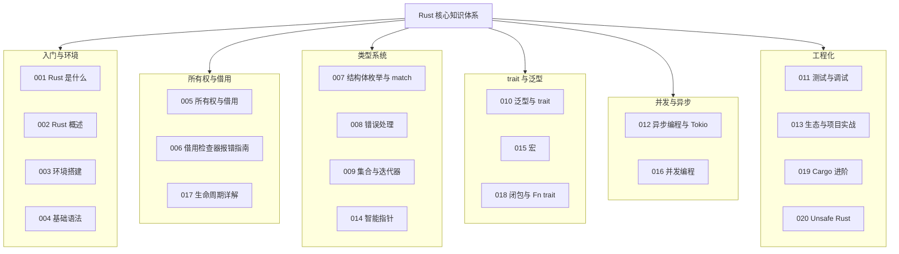

本文是对 Rust 模块全部 20 篇文档的收束与回顾。我们继续沿用贯穿系列的"虚拟歌手音乐平台"案例——P 主（producer）投稿、歌姬（virtual singer）开演唱会、粉丝团（fan club）统计应援票数——把所有权、类型系统、trait 抽象、并发与工程化五条主线串成一张知识网。Rust 的学习曲线集中在前期编译期报错，因此本文特别强调"读懂报错并系统性修正"的能力，把编译器当作最严格的导师。

## 前置知识

- [Rust 是什么：安全与性能兼得的系统语言](/rust/001-WhatIsRust)：理解所有权思想的直觉版与 Cargo 工作流。
- [所有权与借用](/rust/005-RustOwnershipBorrowing)：所有权三规则、移动与借用、切片。
- [结构体、枚举与模式匹配](/rust/007-RustStructEnumMatch)：自定义类型与 match 穷尽检查。

## 学习目标

1. 串联模块全部 20 篇文档，形成"入门语法、所有权与借用、类型系统、trait 与泛型、并发与异步、工程化"六层知识骨架。
2. 用统一的"虚拟歌手音乐平台"案例复述 Rust 的惯用写法：Result 与 `?`、模式匹配、迭代器链、trait 约束泛型与 Arc/Mutex 共享。
3. 辨析 String 与 &str、Rc 与 Arc、move 与 Copy 等易混淆概念。
4. 能读懂借用检查器（E0382、E0502、E0106 等）的报错信息，并按系统方法修正。
5. 明确进阶方向：异步 Tokio、宏编程、生命周期详解与 Cargo 工程化。

## 知识地图

模块 20 篇文档按主题分为六组，组内编号即学习顺序：



## 核心概念回顾

### 1. 变量、不可变性与遮蔽

Rust 的变量默认不可变，需要修改时显式声明 `mut`，"默认不改、声明才改"从源头减少了状态突变的 bug。变量遮蔽（shadowing）允许用 `let` 重新声明同名变量，甚至改变类型，它创建的是新变量而非修改旧值；`const` 与 `static` 则承担编译期常量与全局静态两种角色。

```rust
fn main() {
    // 1. let 默认不可变，显式 mut 才允许修改
    let concert_city = "上海";
    let mut ticket_count = 100;
    ticket_count += 500;

    // 2. 遮蔽：声明同名新变量，甚至可以改变类型
    let ticket_count = ticket_count.to_string();
    println!("{concert_city} 售出 {ticket_count} 张");

    // 3. const 必须标注类型，编译期内联进使用处
    const VIP_SEATS: u32 = 50;
    println!("VIP 席 {VIP_SEATS} 个");
}
```

### 2. 所有权与借用

所有权三规则——每个值有唯一所有者、所有者离开作用域时值被 drop、值可以移动给新所有者——让 Rust 在编译期完成内存管理，既无 GC 停顿也无手动释放。借用（`&` 与 `&mut`）允许"借阅而不夺取"，但同一时刻要么多个不可变借用、要么一个可变借用，这条约束在编译期消灭了数据竞争；报错排查见[借用检查器报错指南](/rust/006-RustBorrowCheckerErrorGuide)，生命周期标注的深水区见[生命周期详解](/rust/017-RustLifetimesDeepDive)。

```rust
// 1. 结构体持有 String，拥有堆上的歌名数据
struct VirtualSinger {
    name: String,
}

fn main() {
    let song = String::from("星屑");

    // 2. 赋值即移动：所有权交给结构体字段，song 随之失效
    let singer = VirtualSinger { name: song };
    // println!("{song}"); // 编译错误：值已被移动

    // 3. 不可变借用：只读访问，原所有者仍然有效
    let title = &singer.name;
    println!("{title} 长度 {}", singer.name.len());
} // 4. singer 离开作用域，drop 自动释放堆内存
```

### 3. 枚举与模式匹配

Rust 的枚举是"带数据的代数类型"：每个变体可以携带不同形状的数据，配合 match 的穷尽性检查（漏一个分支编译不过），可以把业务状态机表达得既精确又安全。`Option<T>` 就是"值可能不存在"的标准枚举，取代了其他语言的 null。

```rust
// 1. 枚举建模演出状态，每个变体携带不同数据
enum ShowState {
    Scheduled(String),      // 携带城市
    Live { viewers: u32 },  // 携带在线人数
    Ended,
}

// 2. match 必须穷尽所有变体，漏写一个分支编译不过
fn announce(state: &ShowState) -> String {
    match state {
        ShowState::Scheduled(city) => format!("{city} 场次待开票"),
        ShowState::Live { viewers } => format!("直播中，{viewers} 人在线"),
        ShowState::Ended => "演出已结束".to_string(),
    }
}

fn main() {
    let states = vec![ShowState::Live { viewers: 1024 }, ShowState::Ended];
    for s in &states {
        println!("{}", announce(s));
    }
}
```

### 4. 错误处理：Result 与 `?` 运算符

Rust 把错误分成两类：不可恢复错误用 `panic!`（越界、断言失败），可恢复错误用 `Result<T, E>` 枚举在类型层面表达。函数签名里的 `Result` 就是文档，调用方被迫处理每一条失败路径；`?` 运算符在遇错时提前返回并自动转换错误类型，配合自定义错误枚举可以搭出清晰的错误传播链，详见[错误处理](/rust/008-RustErrorHandling)。

```rust
// 1. 自定义错误枚举，配合 Result 表达可恢复失败
#[derive(Debug)]
enum VoteError {
    NotANumber,
    TooLarge(u32),
}

// 2. 函数签名中的 Result 就是文档：调用方必须处理失败路径
fn parse_votes(raw: &str) -> Result<u32, VoteError> {
    let n: u32 = raw.trim().parse().map_err(|_| VoteError::NotANumber)?;
    if n > 1_000_000 {
        return Err(VoteError::TooLarge(n)); // 超出应援上限
    }
    Ok(n)
}

fn main() {
    // 3. match 拆包 Result，Ok 与 Err 两条路径都必须写
    match parse_votes(" 1314 ") {
        Ok(n) => println!("《极光》收到 {n} 票"),
        Err(e) => println!("投票失败: {e:?}"),
    }
}
```

### 5. 集合与迭代器

Vec、HashMap、HashSet 是最常用的三大堆上集合；索引越界会 panic，用 `get()` 则返回 Option 安全访问。迭代器是零成本抽象的典范：`map/filter/collect` 等适配器链在编译后与手写循环等价，`entry().or_insert()` 则是"不存在则初始化"的统计惯用法，详见[集合与迭代器](/rust/009-RustCollectionsIterators)。

```rust
use std::collections::HashMap;

fn main() {
    // 1. Vec 保存 P 主投稿记录：(P 主, 歌曲名)
    let posts = vec![
        ("星轨", "星屑"),
        ("星轨", "回声"),
        ("夜航", "极光"),
    ];

    // 2. entry 惯用法统计每位 P 主的投稿数
    let mut count: HashMap<&str, u32> = HashMap::new();
    for (producer, _) in &posts {
        *count.entry(*producer).or_insert(0) += 1;
    }

    // 3. collect 把迭代器直接收成 Vec
    let names: Vec<&str> = posts.iter().map(|(p, _)| *p).collect();
    println!("{:?} -> {:?}", count, names);
}
```

### 6. trait 与泛型

trait 定义共享行为，是 Rust 的接口机制；泛型函数通过 trait 约束限定类型参数的能力，编译期单态化为具体类型的专用代码，运行时零开销。静态分发用泛型（编译期生成），动态分发用 `dyn Trait`（虚表跳转），两者取舍与宏编程见[泛型与 trait](/rust/010-RustGenericTrait)与[宏](/rust/015-RustMacros)。

```rust
// 1. trait 定义共享行为：任何“可应援”的对象都能计票
trait Supportable {
    fn vote(&self) -> u32;
}

// 2. 泛型函数 + trait 约束：编译期单态化，零运行时开销
fn total_votes<T: Supportable>(items: &[T]) -> u32 {
    items.iter().map(|it| it.vote()).sum()
}

struct Song(String);
struct Singer(String);

// 3. 为不同类型实现同一 trait
impl Supportable for Song {
    fn vote(&self) -> u32 { 520 }
}
impl Supportable for Singer {
    fn vote(&self) -> u32 { 1314 }
}

fn main() {
    let songs = vec![Song("星屑".into()), Song("极光".into())];
    let singers = vec![Singer("初霜".into())];
    println!("歌曲 {} 票，歌姬 {} 票", total_votes(&songs), total_votes(&singers));
}
```

### 7. 智能指针与共享所有权

`Box<T>` 把数据放上堆、栈上只留指针；`Rc<T>` 用引用计数实现单线程内的多所有者共享；`RefCell<T>` 提供"编译期不可变、运行时可变"的内部可变性。三者的组合覆盖了树、图等所有权规则不好直接表达的结构；循环引用要用 `Weak` 打破，跨线程版本见下节的 Arc，详见[智能指针](/rust/014-RustSmartPointers)。

```rust
use std::rc::Rc;

// 1. Box 把可能很长的歌词放上堆，结构体只留指针
struct Song {
    title: String,
    lyrics: Box<str>,
}

fn main() {
    let song = Rc::new(Song { title: "极光".into(), lyrics: "……".into() });

    // 2. Rc::clone 只增加引用计数，不拷贝数据
    let club_a = Rc::clone(&song); // 粉丝团 A 引用同一份手册
    let club_b = Rc::clone(&song); // 粉丝团 B 引用同一份手册

    // 3. 计数为 3（本体 + 两个克隆），归零时数据才释放
    println!("引用计数 = {}", Rc::strong_count(&song));
    println!("{} / {} / {}", song.title, club_a.title, club_b.title);
}
```

### 8. 并发与异步

线程侧：`Arc<Mutex<T>>` 是"共享可变状态"的标准答案——Arc 管跨线程所有权，Mutex 管互斥访问，违反规则的代码直接编译不过，Send/Sync 语义详见[并发编程](/rust/016-RustConcurrency)。异步侧：`async fn` 返回惰性 Future，必须由 tokio 等运行时驱动，`join!` 并发等待、`spawn` 交给运行时调度，详见[异步编程与 Tokio](/rust/012-RustAsyncTokio)。

```rust
use std::sync::{Arc, Mutex};
use std::thread;

fn main() {
    // 1. Arc 让三个售票渠道共享票数，Mutex 保证互斥写入
    let tickets = Arc::new(Mutex::new(100_u32));

    let mut handles = vec![];
    for _ in 1..=3 {
        let tickets = Arc::clone(&tickets); // 引用计数 +1
        handles.push(thread::spawn(move || {
            let mut t = tickets.lock().unwrap();
            *t -= 10; // 每个渠道售出 10 张
        }));
    }
    for h in handles {
        h.join().unwrap();
    }

    // 2. 数据竞争在编译期被 Send/Sync 规则挡住，而非运行期
    println!("剩余票数: {:?}", tickets.lock().unwrap());
}
```

```rust
use std::time::Duration;
use tokio::time::sleep;

// 1. async fn 返回惰性 Future，只有被驱动才执行
async fn upload(song: &str) -> String {
    sleep(Duration::from_millis(100)).await; // 模拟网络等待
    format!("{song} 上传完成")
}

#[tokio::main]
async fn main() {
    // 2. join! 并发驱动两个 Future，总耗时约等于最慢者
    let (a, b) = tokio::join!(upload("星屑"), upload("极光"));
    println!("{a}\n{b}");

    // 3. spawn 把独立任务交给运行时后台调度
    let bg = tokio::spawn(async { "后台生成歌单完成" });
    println!("{}", bg.await.unwrap());
}
```

### 9. 测试与 Cargo 工程化

Cargo 是 Rust 工程的中枢：`cargo new/check/test/build --release` 覆盖日常全流程，`Cargo.toml` 声明依赖与特性开关；单元测试直接写在被测文件里，`#[cfg(test)]` 模块加 `#[test]` 函数即可被 `cargo test` 发现，调试与集成测试见[测试与调试](/rust/011-RustTestingDebugging)与[Cargo 进阶](/rust/019-RustCargoAdvanced)。

```rust
// 1. 被测函数：根据点赞与转发计算歌曲应援指数
fn support_index(likes: u32, shares: u32) -> u32 {
    likes * 2 + shares * 3
}

// 2. 单元测试写在同一文件，仅测试构建时编译
#[cfg(test)]
mod tests {
    use super::*;

    #[test]
    fn calculates_support_index() {
        assert_eq!(support_index(10, 0), 20); // 只有点赞
        assert_eq!(support_index(1, 1), 5);   // 点赞 + 转发
    }
}
```

## 易混淆概念对比

Rust 同一领域的类型往往只有细微差别，但语义差异直接决定编译结果。下面两组对比覆盖了日常开发中最常撞见的三对类型，建议结合报错信息反复咀嚼：判断一个类型看三件事——它是否拥有数据、数据放在哪里、能否跨线程传递。

String 与 &str 是 Rust 新手遇到的第一对"长得像但本质不同"的类型：

| 对比维度 | `String` | `&str` |
| --- | --- | --- |
| 本质 | 拥有所有权的堆上缓冲区 | 字符串切片：指向 UTF-8 字节的只读视图 |
| 内存布局 | 指针、长度、容量三词组 | 指针与长度二词组（胖引用） |
| 可变性 | 可 push、insert、截断（需 mut） | 不能通过它修改底层数据 |
| 所有权语义 | move 转移、clone 深拷贝 | 轻量引用，随借用规则复用 |
| 典型用途 | 结构体字段、需要拼接修改的场景 | 函数参数、只读文本处理 |
| 相互转换 | `&s` 或 `s.as_str()` 得到 &str | `s.to_string()` 得到 String |

Rc 与 Arc 决定了共享所有权的线程边界：

| 对比维度 | `Rc<T>` | `Arc<T>` |
| --- | --- | --- |
| 引用计数 | 非原子计数 | 原子计数，线程安全 |
| 线程间共享 | 不可以（未实现 Send/Sync） | 可以 |
| 性能开销 | 普通加减计数，近乎零成本 | 原子操作带轻量同步开销 |
| 内部可变性 | 常与 `RefCell` 组合（单线程） | 常与 `Mutex`/`RwLock` 组合（多线程） |
| 典型场景 | 单线程内的树、图与共享只读数据 | 跨线程共享配置、计数器 |
| 循环引用 | 都需 `Weak` 打破 | 同左 |

选择的经验法则：单线程优先 Rc 加 RefCell，跨线程一律 Arc 加 Mutex；只读共享也可以考虑 Arc 换取更低的锁成本。拿不准时先写 Rc，编译器提示线程安全错误再升级为 Arc，这条路径能把类型差异变成可操作的迁移步骤。

## 常见误区与排查

**误区一：移动后继续使用。** String 等持有堆数据的类型赋值即移动，原变量随之失效，这是 E0382 报错的主因。

```rust
// 错误：s1 的所有权已移动给 s2，再读 s1 报错
let s1 = String::from("星屑");
let s2 = s1;
println!("{s1}"); // error[E0382]: borrow of moved value: `s1`
```

```rust
// 修正一：确实需要两份时显式 clone
let s2 = s1.clone();
// 修正二：只需要读时全程用借用 &s1，不发生移动
```

**误区二：返回临时值的引用。** 函数结束时局部值被销毁，返回它的引用是悬垂引用，编译器直接拒绝。

```rust
// 错误：值随函数结束销毁，引用悬垂
fn title() -> &String {
    let t = String::from("极光");
    &t // error[E0106]: missing lifetime specifier
}
```

```rust
// 修正：直接返回所有权，让调用方接管
fn title() -> String {
    String::from("极光")
}
```

**误区三：生产代码里到处 unwrap。** unwrap 在 None/Err 时 panic，把可恢复错误变成线上事故。

```rust
// 错误：解析失败直接 panic，整条服务线程被击穿
let votes: u32 = input.trim().parse().unwrap();
```

```rust
// 修正：用 ? 向上层传播，或 match 给出兜底值
let votes: u32 = match input.trim().parse() {
    Ok(n) => n,
    Err(_) => 0, // 非法输入按 0 票处理
};
```

**误区四：按字节索引字符串。** String 按字节存储 UTF-8，不支持 `s[0]`，切到字符边界之外会 panic。

```rust
// 错误：切在多字节字符中间
let title = String::from("星屑");
let half = &title[0..1]; // panic：byte index 1 is not a char boundary
```

```rust
// 修正：用 chars() 按字符访问，得到 Option 安全解包
let first = title.chars().next(); // Some('星')
println!("{first:?}");
```

**误区五：可变借用与不可变借用并存。** 只要不可变借用还在被使用，可变借用（push、insert 等）就会被拒绝，这是 E0502 报错的典型来源。

```rust
// 错误：first 在 push 之后仍被使用，借用区间重叠
let mut v = vec!["星屑".to_string()];
let first = &v[0];
v.push("极光".to_string()); // error[E0502]
println!("{first}");
```

```rust
// 修正：让不可变借用先结束（NLL 规则按最后使用点判定）
let first = &v[0];
println!("{first}");
v.push("极光".to_string());
```

**误区六：跨线程共享数据缺 Arc。** `move` 闭包会把值移进线程，第二个线程再用同一值就报错；共享必须显式表达。

```rust
// 错误：votes 已被第一个线程移走
let votes = vec![520u32];
let h1 = std::thread::spawn(move || println!("{:?}", votes));
let h2 = std::thread::spawn(move || println!("{:?}", votes)); // error[E0382]
h1.join().unwrap();
h2.join().unwrap();
```

```rust
// 修正：Arc 共享所有权；需要写入时再包一层 Mutex
let votes = std::sync::Arc::new(vec![520u32]);
let data = std::sync::Arc::clone(&votes);
let h = std::thread::spawn(move || println!("{:?}", data));
h.join().unwrap();
```

## 自检清单

- [ ] 能背出所有权三规则，并解释 move 与 Copy 语义的分工
- [ ] 能区分 `&` 与 `&mut`，说出"多读一写"借用约束的内容
- [ ] 能读懂 E0382、E0502、E0106 报错并按系统方法修正
- [ ] 能用枚举加 match 穷尽建模业务状态，并解释 Option 取代 null 的意义
- [ ] 能用 Result、自定义错误枚举与 `?` 组合编写错误传播链
- [ ] 能用迭代器适配器（map/filter/collect/entry）替代手写循环
- [ ] 能为自定义类型实现 trait，并写出带约束的泛型函数
- [ ] 能解释 Box、Rc、Arc、RefCell 各自的适用场景与线程边界
- [ ] 能用 `std::thread` 加 Arc/Mutex 或 tokio 的 join/spawn 实现并发任务
- [ ] 会用 cargo new/check/test/build --release 完成日常开发闭环

## 后续学习路径

1. [异步编程与 Tokio](/rust/012-RustAsyncTokio)：系统掌握 Future、运行时与异步并发模式。
2. [Rust 宏](/rust/015-RustMacros)：学习声明宏与过程宏，进入元编程领域。
3. [生命周期详解](/rust/017-RustLifetimesDeepDive)：攻克结构体标注与复杂借用场景的生命周期问题。
4. [Cargo 进阶](/rust/019-RustCargoAdvanced)：工作区、特性开关、发布与依赖治理。
5. [生态与项目实战](/rust/013-RustEcosystemProject)：把语言能力落成真实项目。
