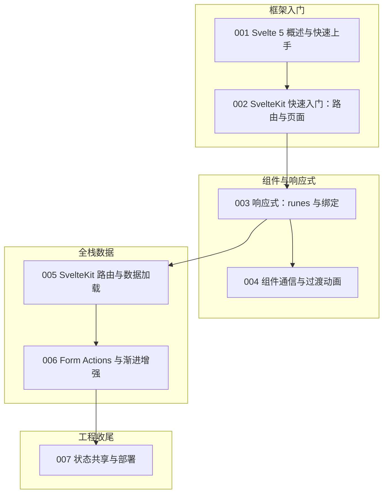

本篇是 svelte 模块的收官总结。我们继续用"虚拟歌手音乐平台"做贯穿场景：做一个歌姬主页与打榜应用——歌姬（virtual singer）展示应援色，P 主（producer）的曲目列表按热度排序，粉丝团（fan club）通过表单报名，演唱会（concert）页有倒计时。围绕这些场景，把前 7 篇文档的内容重新串一遍：编译时框架、runes 响应式、SvelteKit 的加号文件体系、Form Actions 渐进增强与部署收尾。读完请用自检清单核对掌握程度。回顾建议采用"双主线"：组件主线（001、003、004）练语言，应用主线（002、005、006、007）练框架，两条线最后在部署汇合。Svelte 的概念总量不大，难点在于把"编译时"的思维方式从虚拟 DOM 的习惯里切换过来——很多"直觉"在这里恰好是反的。

## 前置知识

- [Svelte 5 概述与快速上手](/svelte/001-SvelteOverview)：编译时框架的定位与 runes 语法的出现背景，是一切讨论的前提。
- [SvelteKit 快速入门：路由与页面](/svelte/002-SvelteKitQuickStart)：加号文件约定是 SvelteKit 的骨架，回顾前先确认能独立建出两个页面。

提醒：本模块七篇均为完整正文，没有占位文档，可以放心按顺序通读；对照本文回看时，优先补 005 与 006 两篇信息量最大的内容。

## 学习目标

1. 能解释"编译时框架"与运行时框架的差异，说出 Svelte 体积小、性能好的原因。
2. 能熟练使用 `$state`、`$derived`、`$effect` 与 `bind:` 组织组件内响应式，并用 `.svelte.ts` 模块实现跨组件状态。
3. 能说清 SvelteKit 每种加号文件的职责，为页面选对通用 load 或 server load。
4. 能用 Form Actions 完成不写 fetch 的表单闭环，并解释渐进增强的价值。

还有一条贯穿性的观察值得先说：Svelte 把"少写代码"当作设计目标，本模块里几乎每个特性都能用"省掉了什么"来概括——省掉虚拟 DOM、省掉状态管理库、省掉手写的请求胶水、省掉单独的过渡动画类库。这种克制让学习曲线格外平缓，但也意味着约束更依赖约定：加号文件是约定，服务端校验优先是约定，请求级状态不落模块顶层也是约定。回顾时把"每个特性替你做了什么决定"想清楚，约定就从背诵变成了常识，写起新页面时自然不会越界。

## 知识地图



读图按编号推进：001、002 分别是语言与框架的入口，003、004 深入组件层，005、006 进入全栈数据，007 收尾交付。两条主线在 005 汇合——load 函数产出的数据，最终要由 runes 驱动的组件消费，学到那里建议做一次"取数到渲染"的串联练习。

## 核心概念回顾

### 1. 编译时框架

React、Vue 在浏览器里带着运行时做虚拟 DOM diff；Svelte 则在构建时把组件编译成直接操作 DOM 的原生 JavaScript，运行时几乎零开销。Svelte 5 用 runes 语法显式声明响应式，取代旧版 `let` 隐式响应与 store 体系（见[Svelte 5 概述与快速上手](/svelte/001-SvelteOverview)）：

```svelte
<!-- src/routes/+page.svelte —— 首页：应援色展示牌 -->
<script>
  let singer = $state({ name: "初音未来", color: "#39c5bb" })

  function switchSinger() {
    // 直接赋值即触发更新：编译器已把这句话编译成 DOM 操作
    singer = { name: "重音テト", color: "#eba9ee" }
  }
</script>

<p style="border-left: 4px solid {singer.color}; padding-left: 12px">
  {singer.name} 的应援色：{singer.color}
</p>
<button onclick={switchSinger}>切换歌姬</button>
```

切换思维的关键是相信编译器：赋值语句会变成精确的 DOM 更新，不需要 setState，也不需要 diff。rune 名称里的美元符号不是装饰，它是编译器识别响应式的标记，写错位置（例如在普通 .ts 文件里直接使用）会直接编译报错，报错信息往往就是最好的老师。

### 2. runes 三件套与绑定

`$state` 存数据、`$derived` 算派生值、`$effect` 做副作用，三者构成最小响应式闭环；`bind:` 让表单与状态双向同步。打榜页的票数合计就是典型组合（见[响应式：runes 与绑定](/svelte/003-ReactivityRunes)）：

```svelte
<script>
  let price = $state(30) // 单张打榜券价格
  let qty = $state(1) // 购买数量，由输入框双向绑定

  let total = $derived(price * qty) // 派生值：任一依赖变化自动重算

  // 副作用：票数变化时同步到页面标题
  $effect(() => {
    document.title = `已选 ${qty} 张，合计 ${total} 元`
  })
</script>

<input type="number" min="1" bind:value={qty} />
<p>合计：{total} 元</p>
```

$derived 与 $effect 的分工要刻在心里：能用派生表达的绝不写副作用，effect 只留给"影响外部世界"的动作，例如更新标题、写日志、打埋点。双向绑定 bind: 的本质是"属性加回调"的语法糖，理解了这一点，双向同步就不再神秘，排查数据回流问题时也多了下手处。

### 3. 组件通信与过渡动画

父子通信两条路：`$props` 从父到子，回调函数从子到父；过渡动画是 Svelte 的招牌，一条 `transition:` 指令即可让元素进出自带动效（见[组件通信与过渡动画](/svelte/004-ComponentsTransitions)）：

```svelte
<!-- src/lib/SingerCard.svelte —— 歌姬卡片：props 进、事件出 -->
<script>
  import { fade } from "svelte/transition"

  let { name, color, onVote } = $props() // 属性从父传入，onVote 是回调
</script>

<article transition:fade={{ duration: 200 }}>
  <h2 style="border-left: 4px solid {color}">{name}</h2>
  <button onclick={() => onVote(name)}>为她打榜</button>
</article>
```

SvelteKit 的 load 函数有两个入口：通用 load 两端都可能执行，server load 只在服务端执行、能安全接触数据库与密钥。判断标准只有一条——数据是否需要保密或依赖服务端能力；公开且不依赖服务端的数据，用通用 load 即可，还能享受客户端导航的复用。

### 4. SvelteKit 路由与数据加载

加号文件构成页面的数据骨架：`+page.svelte` 是 UI，`+page.server.ts` 是只在服务端跑的 load（可以安全访问密钥与数据库），`+page.ts` 是通用 load（两端都跑），`+server.ts` 直接导出 API 端点。动态路由用 `[id]` 目录（见[SvelteKit 路由与数据加载](/svelte/005-SvelteKitRoutingLoading)）：

```typescript
// src/routes/singers/[id]/+page.server.ts —— 歌姬详情的 server load
import { error } from "@sveltejs/kit"
import { db } from "$lib/server/db"

export async function load({ params }) {
  // 只在服务端执行：可安全查询数据库，密钥不会进浏览器
  const singer = await db.singer.findUnique({ where: { id: params.id } })

  if (!singer) error(404, "歌姬不存在")
  return { singer } // 返回值自动成为页面的 data 属性
}
```

use:enhance 的价值常被低估：它不只是"无刷新提交"，还会接管 loading 状态、回填 form 属性、处理 redirect，禁用 JavaScript 时表单退化成原生提交依旧可用——这正是渐进增强的字面意思：先保证能用，再锦上添花。业务校验永远写在服务端 action 里，客户端提示只是体验层。

### 5. Form Actions 与渐进增强

Form Actions 的哲学是：`<form>` 是原生 HTML 元素，不依赖 JavaScript 就能工作，框架在其上叠加增强。服务端把结论用 `fail(400)` 或 `redirect(303)` 表达，`form` 属性回填结果，`use:enhance` 把整页刷新升级为无刷新交互（见[Form Actions 与渐进增强](/svelte/006-FormActionsProgressive)）：

```typescript
// src/routes/fanclub/+page.server.ts —— 粉丝团报名：服务端唯一真相
import { fail } from "@sveltejs/kit"
import { db } from "$lib/server/db"

export const actions = {
  default: async ({ request }) => {
    const data = await request.formData()
    const name = data.get("name") as string

    if (!name?.trim()) return fail(400, { error: "粉丝名不能为空" })
    await db.fanClub.create({ data: { name, grade: 1 } })
    return { success: true } // 回填给页面，无 JS 也能收到结果
  }
}
```

SSR 串号问题的根源是模块级可变状态在服务端被所有请求共享：A 用户的登录态可能渲染进 B 用户的页面。规避规则有两条：跨组件状态放进 .svelte.ts 并理解其边界，请求级数据永远通过 load 与 locals 传递，绝不落到模块顶层变量上。

### 6. 状态共享与部署

跨组件状态用 `.svelte.ts` 模块：文件名带 `.svelte` 后缀，runes 即可在普通模块中使用；环境变量分 `$env/static/private` 与 `static/public` 两层；部署按场景选 adapter，Node 服务器、静态托管与容器化各有对应开关（见[状态共享与部署](/svelte/007-StateSharingDeployment)）：

```typescript
// src/lib/stores/player.svelte.ts —— 全站播放器状态：跨组件共享
export const player = $state({
  current: null as null | { song: string; producer: string },
  playing: false,
  // getter 也能参与响应式：显示文案随状态自动变化
  get label() {
    return this.playing ? `正在播放 ${this.current?.song}` : "播放器待机"
  },
  play(song: string, producer: string) {
    this.current = { song, producer }
    this.playing = true
  }
})
```

部署是最后一步，也是最容易出幺蛾子的一步：adapter-node 适合自有服务器与容器，adapter-static 只支持纯预渲染站点；切换 ssr 与 prerender 开关前，先想清楚每个页面依赖的是请求级数据还是静态内容，再决定它的渲染策略。

## 易混淆概念对比

Svelte 与运行时框架的本质差异，决定了它的体积与性能特性：

| 维度 | Svelte（编译时） | React/Vue（运行时） |
| --- | --- | --- |
| 更新时机 | 构建期编译为直接 DOM 操作 | 浏览器内虚拟 DOM diff |
| 响应式声明 | runes 显式声明（$state 等） | 状态钩子/响应式对象 |
| 运行时体积 | 接近零，只随用到的特性增长 | 框架本体常驻 |
| 心智模型 | 写"会被编译的 JS" | 写"运行时调度的 JS" |

SvelteKit 的两种 load 也很容易选错，差别在于"跑在哪、能碰什么"：

| 维度 | 通用 load（+page.ts） | server load（+page.server.ts） |
| --- | --- | --- |
| 执行位置 | 服务端与客户端都可能 | 仅服务端 |
| 可访问能力 | fetch、params、url | 密钥、数据库、session |
| 序列化 | 结果会暴露给浏览器 | 返回值经序列化下发给页面 |
| 典型场景 | 依赖运行时环境的公开数据 | 查询歌姬档案、校验粉丝团资格 |

总结的落点是建立"何时用什么"的反射：跨组件状态用 .svelte.ts，请求级数据用 load，表单提交用 action，副作用只留给 effect，权限校验放进 hooks 的 locals。这组"自动选型"一旦形成，SvelteKit 的日常写法就很少再纠结。

## 常见误区与排查

以下五条是社区与实战里最常见的翻车姿势，每条先给错误写法，再给修正代码。

1. 给 `$derived` 赋值，编译器直接报错——派生值是只读的，源头改了它才会变：

```svelte
<script>
  let qty = $state(1)
  let total = $derived(qty * 30)

  // 错误：派生值只读，赋值即编译报错
  // total = 90

  // 正确：修改源头状态，派生值自动跟上
  qty = 3
</script>
```

2. 在模块顶层用可变的普通变量当"全局状态"，SSR 下所有请求共享同一份内存，用户数据会串号。跨组件状态必须放进 `.svelte.ts`（见[状态共享与部署](/svelte/007-StateSharingDeployment)）：

```typescript
// 错误：普通模块级变量在 SSR 下被所有请求共享
// let currentFanClub: string | null = null

// 正确：文件名带 .svelte，runes 状态按框架语义管理
export const session = $state({ fanClub: null as string | null })
```

3. `<form>` 忘写 `method="POST"`，点击提交被当成 GET，action 永远不触发：

```svelte
<!-- 错误：默认 GET，进不了 action -->
<!-- <form> <input name="name" /> </form> -->

<!-- 正确：POST 才会路由到 +page.server.ts 的 actions -->
<form method="POST" use:enhance>
  <input name="name" required />
  <button type="submit">加入粉丝团</button>
</form>
```

4. 以为 Form Actions 必须自己写 fetch 接住结果，于是绕开框架手搓请求，丢掉了渐进增强与自动回填：

```svelte
<script>
  let { form } = $props() // 框架把 action 的返回值回填到 form
</script>

<!-- 错误：另写 fetch 再 setState，整页刷新与增强两头落空 -->
<!-- 正确：直接消费 form 属性，JS 被禁用时页面照样工作 -->
{#if form?.error}<p>{form.error}</p>{/if}
{#if form?.success}<p>报名成功，应援色已点亮</p>{/if}
```

5. server load 里返回了带函数的复杂对象，序列化直接失败。load 的返回值要能跨网络传输，只放纯数据：

```typescript
// 错误：函数无法序列化，运行时报 Devalue 错误
// return { singer, play: () => console.log(singer.theme) }

// 正确：只返回纯数据，交互留给组件
return { singer, themeColor: singer.themeColor }
```

全部自检通过后，可以做一个把两条主线拧在一起的综合练习：实现"粉丝团报名 + 应援色换肤"页面——action 处理报名、fail 校验回填、.svelte.ts 共享歌姬主题、adapter-node 部署，一个页面覆盖四个主题，做完再检查一遍有没有把请求级数据写进模块顶层。

## 自检清单

- [ ] 能向别人解释"编译时框架"为什么体积小、更新快
- [ ] 能用 $state、$derived、$effect 完成一个带派生与副作用的计数场景
- [ ] 能用 $props 与回调完成一次完整的父子通信
- [ ] 能说出每种加号文件的职责，并为一个页面选对 load 类型
- [ ] 能写出一个含 fail(400) 校验的 default action，并解释 use:enhance 做了什么
- [ ] 能用 .svelte.ts 模块实现跨组件共享状态，并说出 SSR 串号的原理
- [ ] 能区分四类环境变量模块，说清密钥应该放在哪里
- [ ] 能为项目选对 adapter，并切换 ssr/prerender 完成一次部署

自检不必一次全过：先勾选有把握的条目，反复不过的那几条，多半是示例没有亲手跑过——回到对应文档把代码敲一遍再回来验收，比反复阅读有效十倍。

## 后续学习路径

1. 响应式吃透：重读[响应式：runes 与绑定](/svelte/003-ReactivityRunes)，把 store 与 runes 的对比自己推一遍。
2. 数据骨架：按[路由与数据加载](/svelte/005-SvelteKitRoutingLoading)补齐嵌套布局、布局组与 hooks.server.ts 中间层。
3. 表单哲学：跟随[Form Actions 与渐进增强](/svelte/006-FormActionsProgressive)落地一个无 fetch 的增删改小站。
4. 收尾上生产：以[状态共享与部署](/svelte/007-StateSharingDeployment)为纲完成 adapter 选型与三种部署演练，并回顾[组件通信与过渡动画](/svelte/004-ComponentsTransitions)补上动效细节。
