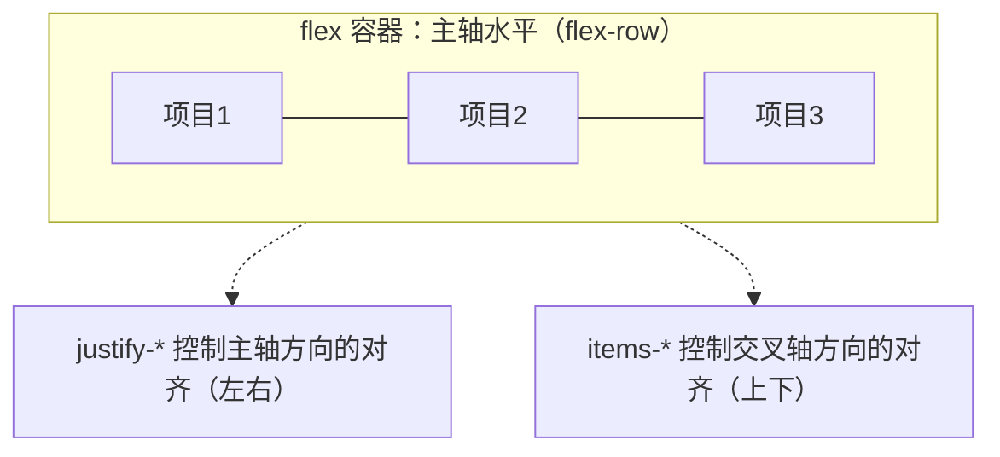
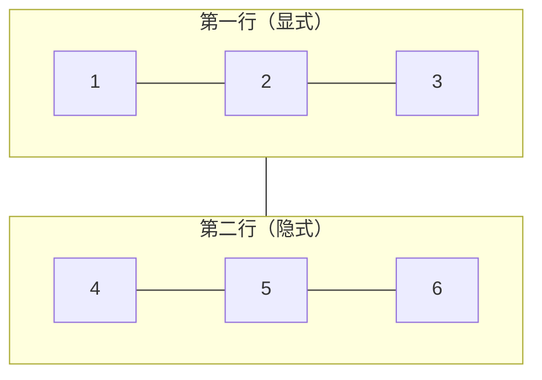

## 前置知识

- [Tailwind CSS 核心概念与工具类](/tailwind/003-UtilityCore)：建议先完成前一篇的学习

## 学习目标

- 掌握「0. 摆积木的排布学问」的核心机制、典型用法与常见陷阱
- 掌握「1. 布局的起点：文档流与盒模型」的核心机制、典型用法与常见陷阱
- 掌握「2. Flex 原理：一维排布的串珠」的核心机制、典型用法与常见陷阱
- 掌握「3. Grid 原理：二维排布的底板」的核心机制、典型用法与常见陷阱
- 掌握「4. 间距与居中：布局的"呼吸感"」的核心机制、典型用法与常见陷阱


## 0. 摆积木的排布学问

儿童玩具桌上有两盒积木。第一盒是"串珠"：一根绳子，把珠子一颗颗穿进去，顺序固定、方向单一，只能排成一列或一串——这是**一维**排布。第二盒是"底板"：一块带凸点的塑料板，积木可以横着放、竖着放、跨两格、占满一行——这是**二维**排布。

网页布局和摆积木是同一件事：决定"谁在谁旁边、谁占多大地方、空间多了怎么办"。CSS 为此提供了两套排布系统：**Flex（弹性盒子）**像串珠，擅长一维排布（一行或一列）；**Grid（网格）**像底板，擅长二维排布（行列同时控制）。Tailwind 把这套原理翻译成了 `flex`、`grid`、`justify-between`、`col-span-2` 等工具类。

本篇采用"原理驱动"的写法：先讲清每套布局系统的底层原理（主轴与交叉轴、网格线与网格区域），再映射到对应的 Tailwind 工具类，最后用大量布局示例串联全篇。

## 1. 布局的起点：文档流与盒模型

在认识 Flex 和 Grid 之前，先理解它们出现之前的世界——普通文档流（normal flow）。

### 1.1 块级与行内

HTML 元素天然分两类：

- **块级元素**（div、p、h1、section）：独占一行，宽度默认占满父容器，从上到下堆叠。
- **行内元素**（span、a、strong）：随文本从左到右排列，一行放不下才换行，宽度由内容决定。

```html
<!-- 三个块级元素：上下堆叠 -->
<div class="bg-blue-100 p-2">块一：独占一行</div>
<div class="bg-blue-100 p-2">块二：独占一行</div>

<!-- 三个行内元素：从左到右流动 -->
<span class="bg-green-100 px-2">行内一</span>
<span class="bg-green-100 px-2">行内二</span>
<span class="bg-green-100 px-2">行内三</span>
```

普通文档流的问题是：**无法精确控制排布方向与对齐方式**。想让两个块并排、让元素垂直居中、让某块占剩余空间——靠文档流都做不到。于是 CSS 引入了两套"主动布局"方案：一维的 Flex 与二维的 Grid。

### 1.2 一切布局的前提：display

`display` 属性决定元素以何种身份参与布局。Tailwind 提供了对应的工具类：

| 类名 | CSS 值 | 用途 |
| --- | --- | --- |
| `block` | display: block | 强制块级 |
| `inline` | display: inline | 强制行内 |
| `inline-block` | display: inline-block | 行内但可设宽高 |
| `flex` | display: flex | 开启弹性布局 |
| `grid` | display: grid | 开启网格布局 |
| `hidden` | display: none | 从页面移除元素 |

```html
<!-- span 变成块级：独占一行 -->
<span class="block bg-gray-100 p-2">我是 span，但显示为块级</span>

<!-- div 变成行内块：可设宽度，又随文本排列 -->
<div class="inline-block w-24 bg-gray-100 p-2">行内块</div>

<!-- 响应式显隐：移动端隐藏，桌面端显示 -->
<div class="hidden md:block bg-gray-100 p-2">桌面端才显示</div>
```

讲解：`hidden` 配合断点前缀（`md:block`）是"移动端隐藏/桌面端显示"的常用手段，无需手写媒体查询。

## 2. Flex 原理：一维排布的串珠

Flex（Flexible Box，弹性盒子）解决的是**一维**排布：元素沿一条"主轴"排列，辅以一条"交叉轴"控制对齐。

### 2.1 两个核心概念

第一，**主轴与交叉轴**。Flex 容器里有两条轴：主轴（main axis）决定元素的排列方向，默认水平向右；交叉轴（cross axis）垂直于主轴。设置 `flex-row`（默认）主轴为水平，`flex-col` 主轴为垂直——两条轴随之互换。

第二，**容器与项目**。给父元素加 `flex`，它就是"容器"（flex container），直接子元素成为"项目"（flex item）。**容器管整体排布，项目管自身伸缩**。这是 Flex 最重要的心智模型：对齐类（`justify-*`、`items-*`）写在容器上，伸缩类（`flex-1`、`grow`、`shrink`）写在项目上。



### 2.2 容器类：控制整体排布

| 工具类 | CSS 属性 | 效果 |
| --- | --- | --- |
| `flex-row` | flex-direction: row | 主轴水平（默认） |
| `flex-col` | flex-direction: column | 主轴垂直 |
| `flex-wrap` | flex-wrap: wrap | 空间不足时换行 |
| `justify-center` | justify-content: center | 主轴居中 |
| `justify-between` | justify-content: space-between | 主轴两端对齐，中间均匀留白 |
| `justify-end` | justify-content: flex-end | 主轴末尾对齐 |
| `items-center` | align-items: center | 交叉轴居中（垂直居中神器） |
| `items-start` / `items-end` | align-items: flex-start/end | 交叉轴顶部 / 底部 |
| `gap-4` | gap: 1rem | 项目之间的间距 |

```html
<!-- 导航栏标准布局：左 logo、右按钮，垂直居中 -->
<nav class="flex items-center justify-between bg-gray-900 px-6 py-4 text-white">
  <span class="text-lg font-bold">FANDEX</span>
  <button class="rounded-md bg-blue-600 px-4 py-2 text-sm">登录</button>
</nav>

<!-- 三张卡片水平排列，间距 16px，换行时自动折行 -->
<div class="flex flex-wrap gap-4">
  <div class="w-48 rounded-lg border border-gray-200 p-4">卡片一</div>
  <div class="w-48 rounded-lg border border-gray-200 p-4">卡片二</div>
  <div class="w-48 rounded-lg border border-gray-200 p-4">卡片三</div>
</div>

<!-- 垂直布局：纵向排列 + 居中 -->
<div class="flex flex-col items-center gap-2">
  
  <p class="text-sm text-gray-500">居中排列的头像与说明</p>
</div>
```

讲解：`justify-between` + `items-center` 是导航栏的"黄金组合"——主轴两端各放一端内容，交叉轴垂直居中。`flex-col items-center` 则是"纵向堆叠 + 水平居中"的标配，几乎每个页面都有。

### 2.3 项目类：控制自身伸缩

| 工具类 | CSS 值 | 效果 |
| --- | --- | --- |
| `flex-1` | flex: 1 | 等分剩余空间（可伸展可收缩） |
| `flex-none` | flex: none | 不伸缩，保持固有尺寸 |
| `shrink-0` | flex-shrink: 0 | 禁止收缩（固定宽度元素） |
| `grow` | flex-grow: 1 | 允许伸展 |
| `basis-1/3` | flex-basis: 33.33% | 项目基础宽度 |
| `order-1` | order: 1 | 调整项目顺序 |

```html
<!-- 经典三栏：左右固定，中间弹性 -->
<div class="flex gap-4">
  <aside class="w-48 shrink-0 bg-gray-100 p-4">侧边栏（固定 192px）</aside>
  <main class="flex-1 bg-white p-4">主内容区（占满剩余空间）</main>
  <aside class="w-40 shrink-0 bg-gray-100 p-4">广告栏（固定 160px）</aside>
</div>

<!-- 三个 flex-1 项目：等分宽度 -->
<div class="flex gap-4">
  <div class="flex-1 rounded bg-blue-100 p-4">33.3%</div>
  <div class="flex-1 rounded bg-blue-100 p-4">33.3%</div>
  <div class="flex-1 rounded bg-blue-100 p-4">33.3%</div>
</div>

<!-- order 调整顺序：视觉上把第二项移到最前 -->
<div class="flex gap-2">
  <div class="order-2 rounded bg-gray-200 p-4">视觉第二</div>
  <div class="order-1 rounded bg-gray-200 p-4">视觉第一</div>
</div>
```

讲解：`flex-1` 是"均分剩余空间"的速记（等价于 `flex: 1 1 0%`），用在三栏布局的中间栏；`shrink-0` 保护固定宽度元素不被压缩。`order-*` 只改变视觉顺序，不改 DOM 结构，移动端适配时常用于"内容优先、视觉后置"。

### 2.4 一句话总结 Flex

**容器定方向与对齐，项目定伸缩与占比**——记住这一句，Flex 已掌握八成。

## 3. Grid 原理：二维排布的底板

Grid（网格）解决的是**二维**排布：同时控制行与列。如果说 Flex 是"一串珠子"，Grid 就是"一块带网格线的底板"。

### 3.1 三个核心概念

第一，**网格线与网格轨道**。网格由水平与垂直两组"网格线"划分成一个个单元格。两列三行的网格有 3 条竖线、4 条横线。列线之间是"列轨道"，行线之间是"行轨道"。

第二，**显式网格与隐式网格**。你显式声明了 3 列（`grid-cols-3`），第 4 个及之后的子元素会自动"挤"到下一行——这新出现的一行是"隐式网格行"，高度由内容决定（`auto`）。

第三，**网格区域**。通过 `col-span-2`、`row-span-2` 可以让一个元素横跨多列/多行，占据一块矩形"区域"。



### 3.2 容器类：定义网格骨架

| 工具类 | CSS 值 | 效果 |
| --- | --- | --- |
| `grid-cols-2` | grid-template-columns: repeat(2, minmax(0, 1fr)) | 两列等宽 |
| `grid-cols-4` | 同上，4 列 | 四列等宽 |
| `grid-rows-2` | grid-template-rows: repeat(2, ...) | 两行 |
| `gap-4` | gap: 1rem | 行列间距 |
| `gap-x-4` / `gap-y-2` | column-gap / row-gap | 仅列距 / 仅行距 |
| `grid-flow-col` | grid-auto-flow: column | 子元素沿列方向填充 |

```html
<!-- 六张卡片，三列等宽，自动排成两行 -->
<div class="grid grid-cols-3 gap-4">
  <div class="rounded-lg bg-gray-100 p-4">1</div>
  <div class="rounded-lg bg-gray-100 p-4">2</div>
  <div class="rounded-lg bg-gray-100 p-4">3</div>
  <div class="rounded-lg bg-gray-100 p-4">4</div>
  <div class="rounded-lg bg-gray-100 p-4">5</div>
  <div class="rounded-lg bg-gray-100 p-4">6</div>
</div>

<!-- 响应式网格：移动端 1 列，md 2 列，lg 3 列 -->
<div class="grid grid-cols-1 gap-6 md:grid-cols-2 lg:grid-cols-3">
  <div class="rounded-xl border border-gray-200 p-6">课程卡片</div>
  <!-- 重复多张卡片 -->
</div>

<!-- 照片墙：子元素沿列方向填充，两列 -->
<div class="grid grid-flow-col grid-cols-2 gap-2">
  <div class="h-24 rounded bg-gray-200">照片 1</div>
  <div class="h-24 rounded bg-gray-200">照片 2</div>
  <div class="h-24 rounded bg-gray-200">照片 3</div>
</div>
```

讲解：`grid-cols-3` 中的 3 直接生成"repeat(3, minmax(0, 1fr))"，即三列等宽、列宽自适应。响应式只需叠加断点前缀：`grid-cols-1 md:grid-cols-2 lg:grid-cols-3` 一条链完成"手机 1 列、平板 2 列、桌面 3 列"。

### 3.3 项目类：控制跨列跨行

| 工具类 | CSS 值 | 效果 |
| --- | --- | --- |
| `col-span-2` | grid-column: span 2 | 横跨两列 |
| `col-span-full` | grid-column: 1 / -1 | 占满整行 |
| `row-span-2` | grid-row: span 2 | 横跨两行 |
| `col-start-2` | grid-column-start: 2 | 从第 2 列线开始 |
| `row-start-1` | grid-row-start: 1 | 从第 1 行线开始 |

```html
<!-- 通栏横幅：col-span-full 占满整行 -->
<div class="grid grid-cols-4 gap-4">
  <div class="col-span-2 rounded-lg bg-gray-100 p-4">占两列</div>
  <div class="col-span-2 rounded-lg bg-gray-100 p-4">占两列</div>
  <div class="col-span-full rounded-lg bg-blue-100 p-4">通栏横幅</div>
</div>

<!-- 侧边栏 + 主内容：经典后台骨架 -->
<div class="grid grid-cols-1 gap-6 md:grid-cols-3">
  <aside class="md:col-span-1 rounded-lg bg-gray-100 p-6">侧边栏导航</aside>
  <main class="md:col-span-2 rounded-lg bg-white p-6">主内容区</main>
</div>
```

讲解：`col-span-*` 让元素跨越指定数量的列轨道，配合 `grid-cols-*` 即可拼出任意版面。"侧边栏 + 主内容"（1:2 或 1:3）是后台系统最常用的骨架，改动数字即调整比例。

### 3.4 一句话总结 Grid

**容器定行列轨道，项目定跨列跨行**——二维版面用 Grid，一维排列用 Flex，两者各有分工、经常嵌套使用。

## 4. 间距与居中：布局的"呼吸感"

布局不止于排列，还包括间距与居中两大细节。

### 4.1 gap：替代 margin 的现代间距

`gap-*` 是 Flex 和 Grid 容器共有的间距类，作用于项目之间，不产生"外边距合并"问题，是 v4 布局的首选：

```html
<!-- 行列间距一致：gap-4（16px） -->
<div class="grid grid-cols-3 gap-4">...</div>

<!-- 行距列距不同：gap-x-2 gap-y-4 -->
<div class="flex flex-wrap gap-x-2 gap-y-4">
  <span class="rounded bg-gray-100 px-3 py-1">标签一</span>
  <span class="rounded bg-gray-100 px-3 py-1">标签二</span>
  <span class="rounded bg-gray-100 px-3 py-1">标签三</span>
</div>
```

口诀：**兄弟之间用 gap，自己与外部用 margin**。

### 4.2 居中三兄弟

元素居中有三种情况，对应三个工具类：

| 需求 | 工具类 | 说明 |
| --- | --- | --- |
| 文字居中 | `text-center` | 文本水平居中 |
| 块级元素水平居中 | `mx-auto` + 定宽 | 左右外边距自动平分 |
| Flex 内垂直水平居中 | `flex items-center justify-center` | 双轴居中 |

```html
<!-- 文字居中 -->
<h1 class="text-center text-2xl font-bold">居中标题</h1>

<!-- 块级容器水平居中：max-w 限宽 + mx-auto -->
<main class="mx-auto max-w-7xl px-6">
  <p>内容在 1280px 以内水平居中，两侧保留 24px 内边距</p>
</main>

<!-- 双轴居中：弹窗内容 -->
<div class="flex h-64 items-center justify-center rounded-xl bg-gray-50">
  <p class="text-sm text-gray-500">上下左右完全居中</p>
</div>
```

讲解：`max-w-7xl`（1280px）是页面级内容区的常见宽度。v4 中旧式 `container` 类已改为用 `@utility` 定义，官方推荐直接用 `max-w-*` + `mx-auto` 组合，更直观可控。

## 5. 定位：让元素"飞"起来

布局解决"正常位置"，定位解决"特殊位置"：吸顶导航、悬浮徽标、弹窗遮罩。

| 类名 | 属性值 | 说明 |
| --- | --- | --- |
| `relative` | position: relative | 相对自身原位偏移，常作为子元素定位基准 |
| `absolute` | position: absolute | 相对最近的定位祖先定位 |
| `fixed` | position: fixed | 相对视口定位，不随滚动 |
| `sticky` | position: sticky | 滚动到阈值后"吸"住 |
| `inset-0` | top/right/bottom/left: 0 | 四边贴齐父容器 |

```html
<!-- 头像上的未读徽标：父 relative + 子 absolute -->
<div class="relative inline-block">
  
  <span class="absolute -top-1 -right-1 flex h-5 w-5 items-center justify-center rounded-full bg-red-500 text-xs text-white">3</span>
</div>

<!-- 吸顶导航：sticky + z 层级 -->
<nav class="sticky top-0 z-50 bg-white/80 backdrop-blur">
  滚动页面，本导航会吸在顶部
</nav>

<!-- 弹窗遮罩：fixed + inset-0 铺满视口 -->
<div class="fixed inset-0 z-40 flex items-center justify-center bg-black/50">
  <div class="w-96 rounded-xl bg-white p-6 shadow-xl">弹窗内容</div>
</div>
```

讲解：定位三件套是 `relative` + `absolute` + `z-*`：父元素加 `relative` 成为定位基准，子元素 `absolute` 精确定位到角落，`z-50` 保证悬浮层盖在其他内容之上。`sticky top-0` 让导航滚动后固定，配合 `backdrop-blur`（毛玻璃）与半透明背景是流行做法。

## 6. 布局综合示例

把本篇文章的能力组合起来，完成三个真实页面场景。

### 6.1 完整导航栏

```html
<nav class="sticky top-0 z-50 flex items-center justify-between bg-white/80 px-6 py-3 shadow-sm backdrop-blur">
  <!-- 左侧：logo + 菜单 -->
  <div class="flex items-center gap-8">
    <span class="text-lg font-bold text-gray-900">FANDEX</span>
    <ul class="hidden items-center gap-6 text-sm text-gray-600 md:flex">
      <li class="hover:text-blue-600">课程</li>
      <li class="hover:text-blue-600">题库</li>
      <li class="hover:text-blue-600">社区</li>
    </ul>
  </div>
  <!-- 右侧：操作按钮 -->
  <div class="flex items-center gap-3">
    <button class="rounded-md px-3 py-2 text-sm text-gray-600 hover:bg-gray-100">登录</button>
    <button class="rounded-md bg-blue-600 px-4 py-2 text-sm text-white hover:bg-blue-700">注册</button>
  </div>
</nav>
```

### 6.2 课程卡片墙

```html
<section class="grid grid-cols-1 gap-6 p-6 md:grid-cols-2 lg:grid-cols-3">
  <!-- 卡片：纵向 flex 布局 + flex-1 让按钮贴底 -->
  <article class="flex flex-col overflow-hidden rounded-xl border border-gray-200 bg-white shadow-sm transition-shadow hover:shadow-md">
    
    <div class="flex flex-1 flex-col p-5">
      <h3 class="text-base font-semibold text-gray-900">JavaScript 入门</h3>
      <p class="mt-1 flex-1 text-sm text-gray-500">从零开始掌握变量、函数与对象，最终完成一个小项目。</p>
      <div class="mt-4 flex items-center justify-between">
        <span class="rounded bg-blue-50 px-2 py-1 text-xs text-blue-700">初级</span>
        <button class="rounded-md bg-gray-900 px-4 py-2 text-sm text-white hover:bg-gray-700">开始学习</button>
      </div>
    </div>
  </article>
  <!-- 其余卡片结构相同，省略 -->
</section>
```

### 6.3 后台页面骨架

```html
<div class="grid min-h-screen grid-cols-1 md:grid-cols-4">
  <!-- 侧边栏 -->
  <aside class="hidden bg-gray-900 p-6 text-white md:block">
    <p class="mb-6 text-lg font-bold">管理后台</p>
    <ul class="space-y-3 text-sm text-gray-300">
      <li class="hover:text-white">课程管理</li>
      <li class="hover:text-white">用户管理</li>
      <li class="hover:text-white">数据统计</li>
    </ul>
  </aside>
  <!-- 主区域：顶部栏 + 内容 -->
  <div class="flex flex-col md:col-span-3">
    <header class="flex items-center justify-between border-b border-gray-200 bg-white px-6 py-3">
      <h1 class="text-lg font-semibold">课程管理</h1>
      <button class="rounded-md bg-blue-600 px-4 py-2 text-sm text-white">新建课程</button>
    </header>
    <main class="grid flex-1 grid-cols-1 gap-4 bg-gray-50 p-6 lg:grid-cols-2">
      <div class="rounded-lg bg-white p-4 shadow-sm">课程列表</div>
      <div class="rounded-lg bg-white p-4 shadow-sm">统计数据</div>
    </main>
  </div>
</div>
```

三个示例展示了核心套路：**横向一排用 flex + justify/items，整块版面用 grid + 断点，弹性占位用 flex-1，悬浮层用定位三件套**。

## 7. 常见错误与对策

| 错误场景 | 表现 | 原因 | 解决办法 |
| --- | --- | --- | --- |
| justify 与 items 混淆 | 想垂直居中却水平居中了 | 主轴与交叉轴概念不清 | 先确定方向：flex-row 时 justify 管左右、items 管上下；flex-col 时相反 |
| 垂直居中失效 | `items-center` 无效果 | 容器没有高度，交叉轴无从居中 | 给容器显式高度（如 `h-screen`、`h-64`）再居中 |
| 宽度失效 | 子元素设了 `w-24` 仍占满 | 块级元素宽度受父容器约束，且未设 flex 上下文 | 需要行内排列时先设 `flex`/`inline-block` |
| 项目被压缩 | 固定宽度元素被挤压 | 默认 `flex-shrink: 1` | 固定元素加 `shrink-0` |
| 网格溢出 | 卡片挤到网格外 | 内容最小宽度超过列轨道宽度 | 给项目加 `min-w-0` 或改用 `minmax(0,1fr)` 思路（Tailwind 默认已是） |
| 忘了 gap | 项目紧贴没有间距 | margin 与 gap 混用导致不一致 | 容器用 `gap-*` 统一管理兄弟间距 |
| 定位基准错误 | absolute 元素"飞"到页面角落 | 祖先没有 `relative`，absolute 定位到更外层 | 在最近的定位父元素上加 `relative` |
| 响应式断点写反 | 移动端也显示多列 | 忘记"移动优先"：基础类先写移动端样式 | 基础写单列，`md:`/`lg:` 前缀逐级增强 |

## 9. 一句话记忆

一维排布用 Flex（容器管方向与对齐、项目管伸缩），二维排布用 Grid（容器管行列轨道、项目管跨列跨行），兄弟间距用 `gap`、块级居中用 `mx-auto`、悬浮层用 `relative + absolute + z-*`。
