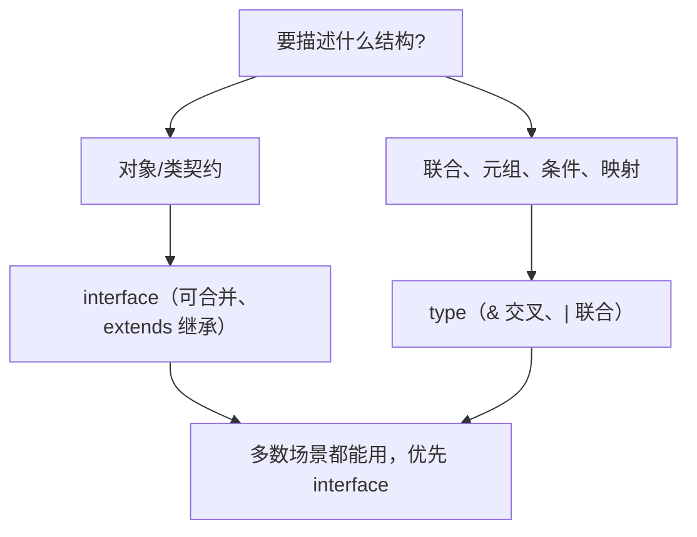

## 前置知识

- [基础类型系统](/typescript/008-BasicTypeSystem)：建议先完成前一篇的学习

## 学习目标

- 掌握「1. 接口 (Interface)」的核心机制、典型用法与常见陷阱
- 掌握「2. 接口继承」的核心机制、典型用法与常见陷阱
- 掌握「3. 类型别名 (Type Aliases)」的核心机制、典型用法与常见陷阱
- 掌握「4. 接口与类型别名的对比」的核心机制、典型用法与常见陷阱
- 掌握「5. 最佳实践」的核心机制、典型用法与常见陷阱


## 1. 接口 (Interface)

接口是 TypeScript 中用于定义对象结构的重要工具，它描述了对象应该具有的属性和方法。

### 1.1 基本接口定义

```typescript
// 基本接口定义
interface Person {
  name: string;
  age: number;
}
// 使用接口
const person: Person = {
  name: 'Alice',
  age: 30,
};
// 错误示例：缺少属性
// const invalidPerson: Person = {
// name: "Bob" // 缺少 age 属性
// };
```

**讲解：**

1. `interface Person` 定义对象结构：`name: string` 与 `age: number` 是必填属性。
2. 接口只在编译期存在，编译后不会生成任何 JavaScript 代码，它只约束写法。
3. 使用接口的变量如果少写属性或写错类型，编辑器会立刻报错——这就是类型安全的第一道防线。


### 1.2 可选属性

使用 `?` 标记可选属性。

```typescript
interface User {
  id: number;
  name: string;
  age?: number; // 可选属性
  email?: string; // 可选属性
}
// 正确：只提供必需属性
const user1: User = {
  id: 1,
  name: 'Alice',
};
// 正确：提供所有属性
const user2: User = {
  id: 2,
  name: 'Bob',
  age: 25,
  email: 'bob@example.com',
};
```

**讲解：**

1. 这个接口比上一个多了 `id: number`，用来对比“接口字段是统一的约束”。
2. 给对象标注 `: User` 后，字段顺序无关紧要，数量与类型必须一致。
3. 多出来的字段也会报错（除非用变量而非字面量赋值），初学者最常见的错误就是多写字段。


### 1.3 只读属性

使用 `readonly` 标记只读属性，这些属性只能在初始化时赋值，之后不能修改。

```typescript
interface Product {
  readonly id: number;
  name: string;
  price: number;
}
const product: Product = {
  id: 1001,
  name: 'Laptop',
  price: 999.99,
};
// 错误：不能修改只读属性
// product.id = 1002; // 编译错误
product.price = 899.99; // 可以修改非只读属性
```

**讲解：**

1. `readonly id: number` 表示 id 只能在创建对象时赋值，之后不能修改。
2. readonly 是编译期约束：运行时的对象其实还是可写的，它防的是“不小心改主键”这类编码错误。
3. 与 `const` 的区别：const 管变量引用，readonly 管对象属性。


### 1.4 函数接口

接口可以定义函数的类型。

> 衔接说明：函数类型有三种等价写法（interface 调用签名、type 箭头签名、直接标注），004 的"函数声明/函数类型"速查区会对比展示；这里先掌握"接口能描述函数"这一事实。

```typescript
// 函数接口
interface GreetFunction {
  (name: string, age?: number): string;
  ;
}
// 实现函数接口
const greet: GreetFunction = (name, age) => {
  if (age) {
    return `Hello, ${name}! You are ${age} years old.`;
  }
  return `Hello, ${name}!`;
  ;
};
console.log(greet('Alice')); // Hello, Alice!
console.log(greet('Bob', 25)); // Hello, Bob! You are 25 years old.
```

**讲解：**

1. 接口的写法 `(name: string, age?: number): string` 描述一个函数类型：两个参数、返回字符串。
2. `age?: number` 表示 age 可选，调用时可以不传。
3. 这种接口适合声明回调、处理函数等“长得很像”的函数集合。


### 1.5 索引签名

使用索引签名定义任意属性。

```typescript
// 字符串索引签名
interface StringMap {
  [key: string]: string;
}
const colors: StringMap = {
  red: '#FF0000',
  green: '#00FF00',
  blue: '#0000FF',
};
// 数字索引签名
interface NumberArray {
  [index: number]: number;
}
const numbers: NumberArray = [1, 2, 3, 4, 5];
// 混合索引签名
interface MixedMap {
  [key: string]: string | number;
  length: number; // 具体属性类型必须与索引签名兼容
}
const mixed: MixedMap = {
  name: 'Alice',
  age: 30,
  length: 2,
};
```

**讲解：**

1. `[key: string]: string` 表示“任意字符串键都对应字符串值”，即字典/映射结构。
2. 典型场景：错误码表、翻译表、配置对象。
3. 注意：一旦声明索引签名，所有属性都必须符合值的类型，否则报错。


### 1.6 类实现接口

类可以实现一个或多个接口。

```typescript
interface Printable {
  print(): void;
  ;
}
interface Loggable {
  log(message: string): void;
  ;
}
// 实现单个接口
class Document implements Printable {
  print(): void {
    console.log('Printing document...');
  }
  ;
}
// 实现多个接口
class AdvancedDocument implements Printable, Loggable {
  print(): void {
    console.log('Printing advanced document...');
  }
  log(message: string): void {
    console.log(`Logging: ${message}`);
  }
  ;
}
const doc = new AdvancedDocument();
doc.print(); // Printing advanced document...
doc.log('Document created'); // Logging: Document created
```

**讲解：**

1. `print(): void` 定义无参数、无返回值的类方法签名。
2. 类用 `implements Printable` 时，必须提供 print 方法，否则编译失败。
3. 这是“契约”思想：接口规定有什么，实现类保证做到。


## 2. 接口继承

接口可以继承其他接口，实现代码复用。

### 2.1 单继承

```typescript
interface Person {
  name: string;
  age: number;
}
interface Employee extends Person {
  employeeId: number;
  department: string;
}
const employee: Employee = {
  name: 'Alice',
  age: 30,
  employeeId: 1001,
  department: 'Engineering',
};
```

**讲解：**

1. 这个 Person 是后续继承示例的父接口，包含姓名与年龄两个字段。
2. 父接口的字段会被子接口继承，子接口只需声明自己的新字段。
3. 继承让公共字段只写一次，避免重复定义。


### 2.2 多继承

接口可以同时继承多个接口。

```typescript
interface Readable {
  read(): string;
  ;
}
interface Writeable {
  write(content: string): void;
  ;
}
interface ReadWriteable extends Readable, Writeable {
  readWrite(): void;
  ;
}
class File implements ReadWriteable {
  read(): string {
    return 'File content';
  }
  write(content: string): void {
    console.log(`Writing: ${content}`);
  }
  readWrite(): void {
    console.log('Reading and writing...');
  }
  ;
}
const file = new File();
console.log(file.read()); // File content
file.write('Hello'); // Writing: Hello
file.readWrite(); // Reading and writing...
```

**讲解：**

1. `read(): string` 是返回字符串的方法签名，作为多继承的第二个父接口。
2. 多继承示例演示 TypeScript 接口可以同时继承多个接口（用逗号分隔）。
3. 类只能单继承，但接口可以多继承——这是接口灵活性的体现。


### 2.3 继承与扩展

接口继承后可以添加新的属性和方法。

```typescript
interface BaseConfig {
  host: string;
  port: number;
}
interface DatabaseConfig extends BaseConfig {
  database: string;
  username: string;
  password: string;
  ssl?: boolean; // 新增可选属性
}
const dbConfig: DatabaseConfig = {
  host: 'localhost',
  port: 5432,
  database: 'mydb',
  username: 'admin',
  password: 'password',
};
```

**讲解：**

1. `BaseConfig` 定义配置的公共字段：host 与 port。
2. 继承后可以扩展出带用户名密码的子配置，而不用重写公共字段。
3. 这种“基础配置 + 扩展配置”是接口继承最常见的业务场景。


## 3. 类型别名 (Type Aliases)

类型别名使用 `type` 关键字定义，可以为任何类型创建别名，包括原始类型、联合类型、元组等。

### 3.1 基本类型别名

```typescript
// 原始类型别名
type Age = number;
type Name = string;
type IsActive = boolean;
// 使用类型别名
const age: Age = 30;
const name: Name = 'Alice';
const isActive: IsActive = true;
// 对象类型别名
type Person = {
  name: string;
  age: number;
  email?: string;
};
const person: Person = {
  name: 'Bob',
  age: 25,
};
```

**讲解：**

1. `type Age = number` 给原始类型起别名，让代码读起来像业务语言。
2. 类型别名与接口的关键区别之一：别名可以给原始类型、联合、元组起名，接口只能描述对象/函数。
3. 别名不产生新类型，`Age` 与 `number` 完全等价，可以互相赋值。


### 3.2 联合类型别名

```typescript
// 联合类型别名
type Status = 'active' | 'inactive' | 'pending';
type Result = string | number | boolean;
// 使用联合类型
const userStatus: Status = 'active';
const result1: Result = 'Success';
const result2: Result = 42;
const result3: Result = true;
// 错误示例：不在联合类型中
// const invalidStatus: Status = "deleted"; // 编译错误
```

**讲解：**

1. `'active' | 'inactive' | 'pending'` 是字面量联合：Status 只能取这三个字符串之一。
2. `string | number | boolean` 表示“三选一”，比 any 精确得多。
3. 联合类型是 TypeScript 表达“多选一”的标准方式。


### 3.3 元组类型别名

```typescript
// 元组类型别名
type Coordinates = [number, number];
type RGB = [number, number, number];
type PersonInfo = [string, number, boolean];
// 使用元组类型
const point: Coordinates = [10, 20];
const color: RGB = [255, 0, 0];
const personInfo: PersonInfo = ['Alice', 30, true];
// 访问元组成员
console.log(point[0]); // 10
console.log(color[1]); // 0
console.log(personInfo[2]); //
```

**讲解：**

1. `[number, number]` 是元组：长度固定、每个位置类型固定的数组。
2. `Coordinates` 表示坐标（x, y），`RGB` 表示三通道颜色。
3. 与普通数组 `number[]` 的区别：普通数组长度不限、元素类型相同。


### 3.4 函数类型别名

```typescript
// 函数类型别名
type AddFunction = (a: number, b: number) => number;
type Callback = () => void;
type ProcessFunction = (data: any, callback: Callback) => void;
// 使用函数类型别名
const add: AddFunction = (a, b) => a + b;
const greet: Callback = () => console.log('Hello!');
const process: ProcessFunction = (data, callback) => {
  console.log('Processing data...', data);
  callback();
};
console.log(add(5, 3)); // 8
greet(); // Hello!
process({ id: 1 }, greet); // Processing data... { id: 1 }
// Hello!
```

**讲解：**

1. `type AddFunction = (a: number, b: number) => number` 描述“两数相加”的函数类型。
2. `type Callback = () => void` 描述无参无返回值的回调。
3. 函数类型别名适合多处复用的回调签名，避免重复书写参数列表。


### 3.5 交叉类型

使用 `&` 创建交叉类型，组合多个类型的特性。

```typescript
// 交叉类型
type Person = {
  name: string;
  age: number;
};
type Employee = {
  employeeId: number;
  department: string;
};
// 交叉类型：同时具有 Person 和 Employee 的属性
type EmployeePerson = Person & Employee;
const employee: EmployeePerson = {
  name: 'Alice',
  age: 30,
  employeeId: 1001,
  department: 'Engineering',
};
```

**讲解：**

1. `&` 是交叉运算符：`A & B` 表示同时满足 A 和 B 的全部字段。
2. 示例把 Person 的字段与 Employee 的字段合并成一个新类型。
3. 交叉类型是类型别名“扩展”的主要手段，类似接口继承但写法不同。


### 3.6 条件类型

> 进阶预览（第一遍可跳过）：条件类型是"类型层面的三目运算"（`T extends X ? A : B`），本节能感知语法即可；它在 004-7.2 展开，完整体系在 023 条件类型分发中讲解。

使用条件类型根据其他类型创建新类型。

```typescript
 // 条件类型
 type IsString<T> = T extends string ?  : false;
 type IsNumber<T> = T extends number ?  : false;
 // 使用条件类型
 type A = IsString<string>; //
 type B = IsString<number>; // false
 type C = IsNumber<number>; //
 type D = IsNumber<string>; // false
 // 复杂条件类型
 type ExtractString<T> = T extends string ? T : never;
 type StringsOnly<T> = T extends Array<infer U> ? ExtractString<U>[] : ExtractString<T>;
 // 使用复杂条件类型
 type E = StringsOnly<string>; // string
 type F = StringsOnly<number>; // never
 type G = StringsOnly<string[]>; // string[]
 type H = StringsOnly<(string | number)[]>; // string[]
```

**讲解：**

1. `T extends string ? true : false` 是条件类型：根据 T 是否满足约束返回不同分支。
2. 这里的两行拼起来是一个简化版 `IsString/IsNumber` 工具，TS 内置的 `Extract/Exclude` 原理相同。
3. 条件类型是高级类型体操的基础，初学先理解“三目运算符作用于类型”即可。


## 4. 接口与类型别名的对比



**结构解析：** 决策顺序是"先看用途，再选工具"：描述对象契约优先 interface，表达联合/元组/条件等组合类型只能用 type。两条路最终殊途同归，团队统一即可。

### 4.1 核心差异

| 特性         | Interface                      | Type Alias                                     |
| :----------- | :----------------------------- | :--------------------------------------------- |
| **定义范围** | 主要用于定义对象结构           | 可以定义任何类型（原始类型、联合类型、元组等） |
| **声明合并** | 支持（多个同名接口会自动合并） | 不支持（同名类型别名会导致编译错误）           |
| **扩展方式** | 使用 `extends` 关键字          | 使用交叉类型 `&`                               |
| **计算属性** | 不支持                         | 支持                                           |
| **类型参数** | 支持泛型                       | 支持泛型                                       |
| **使用场景** | 定义对象结构、类接口           | 定义联合类型、元组类型、复杂类型组合           |

### 4.2 声明合并

接口支持声明合并，多个同名接口会自动合并为一个。

```typescript
// 声明合并示例
interface User {
  id: number;
  name: string;
}
// 自动合并到上面的 User 接口
interface User {
  age?: number;
  email?: string;
}
// 使用合并后的接口
const user: User = {
  id: 1,
  name: 'Alice',
  age: 30,
  email: 'alice@example.com',
};
```

**讲解：**

1. 同名的两个 `interface User` 会自动合并成一个接口，字段取并集。
2. 声明合并常用于给第三方库的类型补充字段（模块增强）。
3. 这是接口独有能力，类型别名不支持。


类型别名不支持声明合并。

```typescript
// 错误：类型别名不能重复声明
// type User = {
// id: number;
// name: string;
// };
// 编译错误：重复的标识符 'User'
// type User = {
// age?: number;
// };
```

**讲解：**

1. 注释里的代码演示错误写法：`type User` 重复声明会编译报错。
2. 类型别名的名字必须唯一，这与接口的声明合并形成鲜明对比。
3. 记住结论：需要合并用 interface，需要组合用 type。


### 4.3 扩展方式

接口使用 `extends` 扩展。

```typescript
interface Person {
  name: string;
  age: number;
  ;
}
interface Employee extends Person {
  employeeId: number;
  department: string;
  ;
}
```

**讲解：**

1. 这是扩展方式对比的第一组：接口用 `extends` 继承。
2. `interface Employee extends Person` 之后，Employee 自动拥有 name 与 age。
3. 对比下一块的 `type ... & ...`，两种扩展方式效果等价，风格不同。


类型别名使用交叉类型 `&` 扩展。

```typescript
type Person = {
  name: string;
  age: number;
  ;
};
type Employee = Person & {
  employeeId: number;
  department: string;
  ;
};
```

**讲解：**

1. 这是类型别名的扩展方式：用交叉类型 `Person & { 新字段 }`。
2. 交叉得到的新类型与接口继承得到的结构一致。
3. 选择建议：对象结构优先 interface（报错信息更友好），需要联合/元组/条件时用 type。


### 4.4 计算属性

类型别名支持计算属性。

```typescript
// 计算属性示例
type Keys = 'a' | 'b' | 'c';
type StringMap = {
  [K in Keys]: string;
};
// 等价于
// type StringMap = {
// a: string;
// b: string;
// c: string;
// };
const map: StringMap = {
  a: 'value1',
  b: 'value2',
  c: 'value3',
};
```

**讲解：**

1. `type Keys = 'a' | 'b' | 'c'` 定义键的联合类型。
2. `type StringMap = { [K in Keys]: string }` 用映射语法为每个键生成 string 属性。
3. 结果等价于 `{ a: string; b: string; c: string }`——这就是类型级别的“循环”。


接口不支持计算属性。

### 4.5 泛型支持

两者都支持泛型。

> 衔接说明：泛型的完整体系（约束、默认值、泛型类、工具类型）在 `008-FunctionGeneric` 讲解；本节的泛型接口只需记住"T 在使用时替换"。

```typescript
// 泛型接口
interface GenericInterface<T> {
  value: T;
  getValue(): T;
}
// 泛型类型别名
type GenericType<T> = {
  value: T;
  getValue(): T;
};
// 使用泛型
const numInterface: GenericInterface<number> = {
  value: 42,
  getValue: () => 42,
};
const stringType: GenericType<string> = {
  value: 'Hello',
  getValue: () => 'Hello',
};
```

**讲解：**

1. `interface GenericInterface<T>` 是泛型接口：T 是占位类型，使用时才确定。
2. `value: T` 表示值的类型跟随调用方传入的类型。
3. 泛型让一个接口服务多种类型，避免为每种类型复制一份定义。


## 5. 最佳实践

### 5.1 选择原则

- **优先使用接口**：当定义对象结构、类接口时，优先使用 `interface`。
- **使用类型别名**：当需要定义联合类型、元组类型、交叉类型或其他复杂类型时，使用 `type`。

### 5.2 具体场景

| 场景             | 推荐使用    | 原因                             |
| :--------------- | :---------- | :------------------------------- |
| 定义对象结构     | `interface` | 支持声明合并，更符合面向对象思维 |
| 定义类接口       | `interface` | 类可以使用 `implements` 实现接口 |
| 定义联合类型     | `type`      | 接口不支持联合类型               |
| 定义元组类型     | `type`      | 接口不支持元组类型               |
| 定义交叉类型     | `type`      | 使用 `&` 更简洁                  |
| 定义条件类型     | `type`      | 接口不支持条件类型               |
| 定义原始类型别名 | `type`      | 接口只能定义对象结构             |

### 5.3 实际应用建议

1. **保持一致性**：在项目中保持使用接口和类型别名的一致性。
2. **清晰命名**：为接口和类型别名使用清晰、描述性的名称。
3. **合理使用**：根据具体场景选择合适的方式，不要过度使用其中一种。
4. **文档化**：对于复杂的类型定义，添加注释说明其用途。

## 6. 代码示例

### 6.1 接口的综合使用

```typescript
// 基本接口
interface User {
  readonly id: number;
  name: string;
  age?: number;
  email?: string;
  ;
}
// 函数接口
interface UserService {
  getUser(id: number): User;
  createUser(user: Omit<User, 'id'>): User;
  updateUser(id: number, user: Partial<User>): User;
  deleteUser(id: number): boolean;
  ;
}
// 实现接口
class UserServiceImpl implements UserService {
  private users: User[] = [
    { id: 1, name: 'Alice', age: 30, email: 'alice@example.com' },
    { id: 2, name: 'Bob', age: 25 },
  ];
  getUser(id: number): User {
    const user = this.users.find((u) => u.id === id);
    if (!user) {
      throw new Error(`User with id ${id} not found`);
    }
    return user;
  }
  createUser(user: Omit<User, 'id'>): User {
    const newUser: User = {
      id: this.users.length + 1,
      ...user,
    };
    this.users.push(newUser);
    return newUser;
  }
  updateUser(id: number, user: Partial<User>): User {
    const index = this.users.findIndex((u) => u.id === id);
    if (index === -1) {
      throw new Error(`User with id ${id} not found`);
    }
    this.users[index] = { ...this.users[index], ...user };
    return this.users[index];
  }
  deleteUser(id: number): boolean {
    const initialLength = this.users.length;
    this.users = this.users.filter((u) => u.id !== id);
    return this.users.length < initialLength;
  }
  ;
}
// 使用示例
const userService = new UserServiceImpl();
console.log('Get user 1:', userService.getUser(1));
const newUser = userService.createUser({ name: 'Charlie', age: 35 });
console.log('Created user:', newUser);
const updatedUser = userService.updateUser(1, { age: 31, email: 'alice.updated@example.com' });
console.log('Updated user:', updatedUser);
const deleted = userService.deleteUser(2);
console.log('Deleted user 2:', deleted);
console.log('All users:', userService);
```

**讲解：**

1. 这是综合示例的起点：`readonly id` + name + age 的用户接口。
2. 综合示例把本章知识串起来：接口定义、只读、可选、函数与数组。
3. 先读类型声明，再读使用代码，是理解综合示例的正确顺序。


### 6.2 类型别名的综合使用

```typescript
// 基本类型别名
type UserId = number;
type UserName = string;
type Email = string;
// 联合类型
type UserRole = 'admin' | 'user' | 'guest';
type Status = 'active' | 'inactive' | 'pending';
// 元组类型
type UserCredentials = [UserName, string]; // [username, password]
type Coordinates = [number, number]; // [x, y]
// 对象类型
type User = {
  id: UserId;
  name: UserName;
  email: Email;
  role: UserRole;
  status: Status;
  lastLogin?: Date;
  ;
};
// 交叉类型
type AdminPermissions = {
  canManageUsers: boolean;
  canManageSettings: boolean;
  ;
};
type AdminUser = User & AdminPermissions;
// 函数类型
type UserValidator = (user: User) => boolean;
type AsyncCallback = (error: Error | null, result: any) => void;
// 使用示例
const validateUser: UserValidator = (user) => {
  return !!user.name && !!user.email && !!user.role;
  ;
};
const adminUser: AdminUser = {
  id: 1,
  name: 'Alice',
  email: 'alice@example.com',
  role: 'admin',
  status: 'active',
  canManageUsers: true,
  canManageSettings: True,
};
const credentials: UserCredentials = ['alice', 'password123'];
const position: Coordinates = [10, 20];
console.log('Admin user:', adminUser);
console.log('Credentials:', credentials);
console.log('Position:', position);
console.log('Is valid user:', validateUser(adminUser));
```

**讲解：**

1. `type UserId = number` 与 `type UserName = string` 是业务化命名。
2. 好处：函数签名里写 `UserId` 比写 `number` 更容易读懂。
3. 注意别名只是“另一个名字”，不阻止你把 UserId 赋成负数等非法业务值。


### 6.3 接口与类型别名的混合使用

```typescript
// 接口定义核心结构
interface BaseEntity {
  id: number;
  createdAt: Date;
  updatedAt: Date;
}
// 类型别名定义复杂类型
type EntityType = 'user' | 'product' | 'order';
type EntityStatus = 'active' | 'inactive' | 'deleted';
// 接口继承并使用类型别名
interface User extends BaseEntity {
  name: string;
  email: string;
  type: Extract<EntityType, 'user'>;
  status: EntityStatus;
}
interface Product extends BaseEntity {
  name: string;
  price: number;
  type: Extract<EntityType, 'product'>;
  status: EntityStatus;
}
// 类型别名创建联合类型
type Entity = User | Product;
// 类型守卫函数
type EntityGuard<T extends EntityType> = (entity: Entity) => entity is Extract<Entity, { type: T }>;
const isUser: EntityGuard<'user'> = (entity): entity is User => {
  return entity.type === 'user';
};
const isProduct: EntityGuard<'product'> = (entity): entity is Product => {
  return entity.type === 'product';
};
// 使用示例
const user: User = {
  id: 1,
  name: 'Alice',
  email: 'alice@example.com',
  type: 'user',
  status: 'active',
  createdAt: new Date(),
  updatedAt: new Date(),
};
const product: Product = {
  id: 1001,
  name: 'Laptop',
  price: 999.99,
  type: 'product',
  status: 'active',
  createdAt: new Date(),
  updatedAt: new Date(),
};
const processEntity = (entity: Entity) => {
  console.log(`Processing entity ${entity.id} (${entity.type})`);
  if (isUser(entity)) {
    console.log(`User: ${entity.name}, Email: ${entity.email}`);
  } else if (isProduct(entity)) {
    console.log(`Product: ${entity.name}, Price: $${entity.price}`);
  }
};
processEntity(user);
processEntity(product);
```

**讲解：**

1. `BaseEntity` 定义所有实体的公共字段：id 与创建时间。
2. 其他实体接口继承它，就自动拥有这两个公共字段。
3. 这是“基类思想”在类型层面的应用。


---

## 7. 常见错误与修正（错-对对比）

### 7.1 少写必填属性

```typescript
// 错误：Person 有 name 和 age，只给 name 会报错
const p: { name: string; age: number } = { name: "Alice" }

// 正确：补全必填字段
const p2: { name: string; age: number } = { name: "Alice", age: 30 }
```

**讲解：** 接口/对象类型的所有非可选属性都必须出现，这是 TS 结构检查的第一课。

### 7.2 类型别名重复声明

```typescript
// 错误：type 不能重复声明
type User = { name: string }
// type User = { age: number } // 报错：重复标识符

// 正确：同名 interface 可以合并（声明合并）
interface User2 { name: string }
interface User2 { age: number }
```

**讲解：** 需要"多次追加字段"的场景用 interface；type 的合并通过交叉类型 `&` 完成。

### 7.3 多继承时同名方法冲突

```typescript
// 场景：两个父接口有同名方法，签名必须互相兼容
interface A { read(): string }
interface B { read(): string }
interface C extends A, B { write(): void } // 合法：read 签名一致

// 若签名不一致会报错，解决办法是子接口显式重写兼容签名
interface D extends A, B { read(): string }
```

**讲解：** 多继承遇到同名成员时，TS 要求签名兼容；先看父接口声明，再决定子接口是否重写。

### 7.4 索引签名限制了普通属性

```typescript
// 错误：声明了 [key: string]: string 后，number 属性不合法
// interface Bad { [key: string]: string; count: number } // 报错

// 正确：让值类型包含所有可能性
interface Ok { [key: string]: string | number; count: number }
```

**讲解：** 索引签名是"字典的总规则"，所有具名属性都必须服从该规则；需要混合值时把值类型写成联合。

## 接口定义

> 速查索引：从这里到文件末尾与正文内容重复，按需查阅，第一遍阅读可以跳过。

**换行写法：定义基本接口**
`interface <接口名> {`
`    <属性1>: <类型1>`
`    <属性2>: <类型2>`
`}`

```typescript
// 定义基本接口
interface User {
    name: string
    age: number
}
```

**讲解：**

1. 这里用更简洁的写法定义 User：name 必填、age 可选。
2. 与前面的完整示例对比，可以看出接口语法只有一种，示例详略不同。
3. 可选属性用 `?` 标记，使用前需要判断是否存在。


---

**基本写法：使用接口**
`let <变量>: <接口名> = { <属性>: <值> }`

```typescript
// 使用接口定义对象
let user: User = { name: "Alice", age: 30 }
```

**讲解：**

1. `let user: User = { name: "Alice", age: 30 }` 声明对象并标注类型。
2. 编译器会检查字面量是否满足接口：缺字段、多字段、类型错都会报错。
3. 这是接口最基础也最常用的场景：给对象“贴类型标签”。


---

## 可选属性

**换行写法：接口可选属性**
`interface <接口名> {`
`    <属性1>: <类型1>`
`    <属性2>?: <类型2>`
`}`

```typescript
// 接口可选属性（使用 ? 标记）
interface User {
    name: string
    age?: number
}
```

**讲解：**

1. `age?: number` 让 age 可有可无。
2. 使用时 `user.age` 的类型是 `number | undefined`，直接做算术运算前要判空。
3. 可选属性适合“部分场景才有的字段”，如备注、头像。


---

## 只读属性

**换行写法：接口只读属性**
`interface <接口名> {`
`    readonly <属性>: <类型>`
`}`

```typescript
// 接口只读属性
interface User {
    readonly id: number
    name: string
}
```

**讲解：**

1. `readonly id: number` 声明只读：初始化后不可重新赋值。
2. 适合主键、创建时间等“一旦生成不再变化”的字段。
3. 再次强调：readonly 是编译期检查，不影响运行时行为。


---

## 接口继承

**基本写法：单继承**
`interface <子接口> extends <父接口> { <属性>: <类型> }`

```typescript
// 接口单继承
interface Animal {
    name: string
}

interface Dog extends Animal {
    breed: string
}
```

**讲解：**

1. `interface Dog extends Animal` 让 Dog 获得 Animal 的全部字段。
2. 单继承：一个接口只继承一个父接口，用 extends 关键字。
3. 继承让公共字段集中定义，子接口只写差异化内容。


---

**基本写法：多继承**
`interface <子接口> extends <父接口1>, <父接口2> { <属性>: <类型> }`

```typescript
// 接口多继承
interface Flyable {
    fly(): void
}

interface Swimmable {
    swim(): void
}

interface Duck extends Flyable, Swimmable {
    name: string
}
```

**讲解：**

1. `interface Dog extends Animal, Flyable` 用逗号同时继承两个接口。
2. 多继承会把两个父接口的字段与方法全部并入 Dog。
3. 类不能多继承，但接口可以——这是接口设计的重要优势。


---

## 函数类型接口

**换行写法：定义函数类型接口**
`interface <接口名> {`
`    (<参数>: <类型>): <返回类型>`
`}`

```typescript
// 定义函数类型接口
interface SearchFunc {
    (source: string, sub: string): boolean
}
```

**讲解：**

1. `interface SearchFunc { (source: string, sub: string): boolean }` 用接口描述函数。
2. 语法上括号直接跟在接口体里，看起来像方法声明但没有名字。
3. 函数类型接口适合“约定一类处理函数”的场景。


---

**基本写法：使用函数类型接口**
`let <变量>: <接口名> = (<参数>) => <表达式>`

```typescript
// 使用函数类型接口
let search: SearchFunc = (src, sub) => src.includes(sub)
```

**讲解：**

1. `let search: SearchFunc = (src, sub) => src.includes(sub)` 用接口约束箭头函数。
2. 参数类型由接口推断，实现里不需要重复标注（也可标注，更清晰）。
3. `src.includes(sub)` 判断是否包含子串，返回布尔值，符合接口约定。


---

## 可索引类型接口

**换行写法：字符串索引签名**
`interface <接口名> {`
`    [key: string]: <类型>`
`}`

```typescript
// 字符串索引签名
interface StringArray {
    [index: string]: string
}
```

**讲解：**

1. `[index: string]: string` 允许用任意字符串下标访问，值为字符串。
2. 适合字典、Map 替代场景：`map["key"]` 直接取值。
3. 索引签名限制了值的类型统一，想存不同类型需要联合类型。


---

**换行写法：数字索引签名**
`interface <接口名> {`
`    [index: number]: <类型>`
`}`

```typescript
// 数字索引签名
interface NumberArray {
    [index: number]: string
}
```

**讲解：**

1. `[index: number]: string` 类似数组：数字下标对应字符串值。
2. 与字符串索引的区别：数字索引用于类数组结构。
3. 实际项目中对象更常用字符串索引，数字索引较少见。


---

## 类类型接口

**换行写法：类实现接口**
`interface <接口名> {`
`    <方法>(<参数>): <返回类型>`
`}`
`class <类名> implements <接口名> { <语句> }`

```typescript
// 类实现接口
interface Clock {
    current_time: Date
    set_time(d: Date): void
}

class DigitalClock implements Clock {
    current_time = new Date()
    set_time(d: Date) {
        this.current_time = d
    }
}
```

**讲解：**

1. `class Clock implements ClockInterface` 表示类承诺满足接口的全部要求。
2. `current_time: Date` 是属性要求，`alert(): void` 是方法要求，类里都必须实现。
3. 漏实现任何一项都会编译报错——implements 把“口头承诺”变成“强制契约”。


---

## 类型别名

**基本写法：定义类型别名**
`type <别名> = <类型>`

```typescript
// 定义类型别名
type Name = string
type Age = number
```

**讲解：**

1. `type Name = string` 与 `type Age = number` 给基础类型起别名。
2. 一行定义多个别名是允许的，但工程上建议一行一个更清晰。
3. 别名主要提升可读性，不改变类型本身。


---

**换行写法：对象类型别名**
`type <别名> = {`
`    <属性1>: <类型1>`
`    <属性2>: <类型2>`
`}`

```typescript
// 对象类型别名
type User = {
    name: string
    age: number
}
```

**讲解：**

1. `type User = { name: string; age: number }` 用别名描述对象结构。
2. 与 interface 写法几乎一样，效果也几乎等价。
3. 差异在扩展方式与合并行为上，前面的对比已说明。


---

**基本写法：联合类型别名**
`type <别名> = <类型1> | <类型2>`

```typescript
// 联合类型别名
type ID = string | number
```

**讲解：**

1. `type ID = string | number` 表示 id 可能是字符串也可能是数字。
2. 这是接口做不到的：接口不能直接表达“二选一”。
3. 使用这种值时先做类型收窄（typeof 判断）再操作。


---

**基本写法：交叉类型别名**
`type <别名> = <类型1> & <类型2>`

```typescript
// 交叉类型别名
type Person = { name: string }
type Employee = { id: number }
type Staff = Person & Employee
```

**讲解：**

1. `type Employee = Person & { id: number }` 用 & 合并两个结构。
2. 结果对象必须同时满足 Person 的字段与新增的 id 字段。
3. & 与 extends 的选择：接口优先 extends，别名用 & 更自然。


---

## 接口与类型别名对比

**换行写法：接口扩展**
`interface <接口名> extends <父接口> { <属性>: <类型> }`

```typescript
// 接口扩展（使用 extends）
interface Animal {
    name: string
}

interface Dog extends Animal {
    breed: string
}
```

**讲解：**

1. `interface Dog extends Animal` 是接口的标准扩展写法。
2. 扩展后 Dog 拥有 Animal 的 name 字段与自己的 breed 字段。
3. 与 type 的 & 交叉对比：语义相同，报错信息略有差异。


---

**基本写法：类型别名交叉**
`type <别名> = <类型1> & <类型2>`

```typescript
// 类型别名交叉（使用 &）
type Animal = { name: string }
type Dog = Animal & { breed: string }
```

**讲解：**

1. `type Dog = Animal & { breed: string }` 用交叉类型实现同样的效果。
2. 对比上一块的 extends，两者得到兼容的结构。
3. 团队内二选一即可，关键是不要混用造成阅读负担。


---

## 函数类型

**基本写法：使用 type 定义函数类型**
`type <函数类型> = (<参数>: <类型>) => <返回类型>`

```typescript
// 使用 type 定义函数类型
type Callback = (data: string) => void
```

**讲解：**

1. `type Callback = (data: string) => void` 是函数类型的别名写法。
2. 适合回调、事件处理器等签名复用。
3. 箭头语法直观，是社区主流写法。


---

**基本写法：使用 interface 定义函数类型**
`interface <函数类型> { (<参数>: <类型>): <返回类型> }`

```typescript
// 使用 interface 定义函数类型
interface Callback {
    (data: string): void
}
```

**讲解：**

1. 同一签名用 interface 也能表达：`(data: string): void`。
2. 两种写法功能等价，type 更简洁、interface 更“对象化”。
3. 混合项目里按既有风格保持一致。


---

## 合并接口

**换行写法：接口声明合并**
`interface <接口名> { <属性1>: <类型1> }`
`interface <接口名> { <属性2>: <类型2> }`

```typescript
// 接口声明合并（同名接口自动合并）
interface Box {
    width: number
}

interface Box {
    height: number
}
```

**讲解：**

1. 两个同名 `interface Box` 声明会合并：width 与 height 同时生效。
2. 适合分文件补充类型：A 文件定义基础结构，B 文件扩展字段。
3. 注意：合并的字段不能冲突（同一属性不同类型会报错）。


---

## 描述对象

**换行写法：描述复杂对象**
`interface <接口名> {`
`    <属性>: <类型>`
`    <嵌套对象>: {`
`        <子属性>: <类型>`
`    }`
`}`

```typescript
// 描述复杂嵌套对象
interface User {
    name: string
    address: {
        street: string
        city: string
    }
}
```

**讲解：**

1. `address: { city: string; street: string }` 在接口里内嵌对象结构。
2. 嵌套类型让复杂数据结构的类型描述与数据形状一一对应。
3. 嵌套过深时可拆成独立接口，用名字引用，可读性更好。


---

## 数组类型接口

**换行写法：描述对象数组**
`interface <接口名> {`
`    <属性>: <类型>`
`}`
`let <变量>: <接口名>[] = [<对象>]`

```typescript
// 描述对象数组
interface Product {
    name: string
    price: number
}

let products: Product[] = [
    { name: "Apple", price: 1.5 },
    { name: "Banana", price: 0.5 },
]
```

**讲解：**

1. `products: Product[]` 表示元素为 Product 的数组。
2. 数组的每个元素都要符合 Product 接口，否则编译报错。
3. 这是列表页数据的标准类型写法。


---

## readonly 与 Readonly

**基本写法：使用 readonly 修饰符**
`interface <接口名> { readonly <属性>: <类型> }`

```typescript
// 使用 readonly 修饰符
interface Point {
    readonly x: number
    readonly y: number
}
```

**讲解：**

1. `readonly x: number` 的字段初始化后不可改。
2. 适合坐标、配置等不可变数据。
3. 再次提醒：这仅是编译期约束。


---

**基本写法：使用 Readonly 工具类型**
`type <别名> = Readonly<<接口>>`

```typescript
// 使用 Readonly 工具类型
type ReadonlyUser = Readonly<User>
```

**讲解：**

1. `Readonly<User>` 把 User 的所有属性一次性变成只读，无需逐个写 readonly。
2. 工具类型是类型层面的函数：输入一个类型，输出一个新类型。
3. 常见工具还有 Partial、Required、Pick、Omit、Record，见后几块。


---

## Partial 与 Required

**基本写法：使用 Partial 工具类型**
`type <别名> = Partial<<接口>>`

```typescript
// 使用 Partial 使所有属性可选
type PartialUser = Partial<User>
```

**讲解：**

1. `Partial<User>` 把每个属性都变成可选，适合“编辑表单只传改动的字段”。
2. 与 Required 互为逆操作。
3. 注意：Partial 后的类型丢失了“必填”信息，更新场景要小心空值。


---

**基本写法：使用 Required 工具类型**
`type <别名> = Required<<接口>>`

```typescript
// 使用 Required 使所有属性必填
type RequiredUser = Required<User>
```

**讲解：**

1. `Required<User>` 把可选属性全部变成必填。
2. 适合“从草稿到提交”的校验场景：草稿可缺字段，提交必须完整。
3. 与 Partial 配合使用能精确控制不同阶段的状态类型。


---

## Pick 与 Omit

**基本写法：使用 Pick 工具类型**
`type <别名> = Pick<<接口>, "<属性1>" | "<属性2>">`

```typescript
// 使用 Pick 选取部分属性
type UserBasic = Pick<User, "name" | "age">
```

**讲解：**

1. `Pick<User, "name" | "age">` 从 User 中挑选指定字段组成新类型。
2. 第二个参数是键的联合，可以理解为“白名单”。
3. 适合列表页只展示部分字段的场景。


---

**基本写法：使用 Omit 工具类型**
`type <别名> = Omit<<接口>, "<属性>">`

```typescript
// 使用 Omit 排除部分属性
type UserWithoutAge = Omit<User, "age">
```

**讲解：**

1. `Omit<User, "age">` 从 User 中剔除指定字段，其余保留。
2. 与 Pick 相反：Pick 留谁，Omit 删谁。
3. 适合“创建时不传 id”这类场景：用 Omit 去掉服务端生成的字段。


---

## Record 类型

**基本写法：使用 Record 工具类型**
`type <别名> = Record<<键类型>, <值类型>>`

```typescript
// 使用 Record 创建键值对类型
type UserMap = Record<string, User>
```

**讲解：**

1. `Record<string, User>` 表示“字符串键映射到 User 值”的字典。
2. 等价于手写索引签名，但可读性更好、还能限制键的联合。
3. `Record<'a' | 'b', number>` 可以精确限定键集合。


---

## 函数参数类型

**换行写法：描述函数参数对象**
`interface <参数接口> {`
`    <属性1>: <类型1>`
`    <属性2>: <类型2>`
`}`
`function <函数>(<参数>: <参数接口>): <返回类型> { <语句> }`

```typescript
// 描述函数参数对象
interface Config {
    host: string
    port: number
    timeout?: number
}

function connect(config: Config): void {
    console.log(`${config.host}:${config.port}`)
}
```

**讲解：**

1. `interface Config` 描述一个配置对象，函数参数用它标注。
2. 调用 `connect(config)` 时，编译器检查传入对象是否符合全部字段。
3. 参数对象接口化后，调用点可读性大幅提升。


---

## 可调用接口

**换行写法：可调用对象接口**
`interface <接口名> {`
`    (<参数>: <类型>): <返回类型>`
`    <属性>: <类型>`
`}`

```typescript
// 可调用对象接口（既是函数又有属性）
interface Counter {
    (start: number): void
    count: number
}
```

**讲解：**

1. `interface Counter { (start: number): void; count: number }` 描述“可调用且有属性”的对象。
2. 这种对象既是函数又能挂属性，是 JS 函数对象特性的类型表达。
3. 使用前需要类型断言或构造实现，属于进阶写法。


---

## 构造器类型

**换行写法：构造器接口**
`interface <接口名> {`
`    new (<参数>: <类型>): <对象类型>`
`}`

```typescript
// 构造器接口
interface ClockConstructor {
    new (hour: number, minute: number): ClockInterface
}

interface ClockInterface {
    tick(): void
}
```

**讲解：**

1. `new (hour: number, minute: number): ClockInterface` 描述构造签名。
2. 它描述“能 new 出 ClockInterface 的类构造函数”，用于工厂函数约束。
3. 这是依赖注入、工厂模式中常见的类型设计。

## 8. 自测（小测验）

**第 1 题（单选）**：想让"任意字符串键都对应字符串值"的字典结构，应该用哪种语法？

**第 2 题（判断）**：`interface` 与 `type` 都能表达联合类型，这句话对吗？

**第 3 题（填空）**：两个同名 `interface Box` 会怎样？这是 interface 独有的什么能力？

<details>
<summary>点击查看答案</summary>

1. 索引签名：`interface X { [key: string]: string }`（或 `Record<string, string>`）。
2. 不对。联合类型只能用 `type` 表达，`interface` 只能描述对象/函数结构。
3. 自动合并（声明合并），所有字段取并集；这是 type 不具备的能力。

</details>
