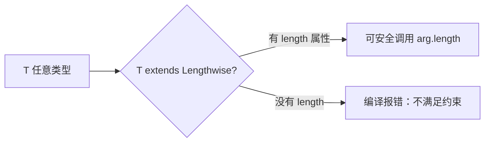

## 前置知识

- [keyof、typeof 与索引访问类型](/typescript/010-KeyofTypeofIndexedAccessTypes)：建议先完成前一篇的学习

## 学习目标

- 掌握「1. 函数重载 (Function Overloading)」的核心机制、典型用法与常见陷阱
- 掌握「2. 泛型 (Generics)」的核心机制、典型用法与常见陷阱
- 掌握「3. 泛型约束 (Generic Constraints)」的核心机制、典型用法与常见陷阱
- 掌握「4. 泛型类 (Generic Classes)」的核心机制、典型用法与常见陷阱
- 掌握「5. 泛型方法」的核心机制、典型用法与常见陷阱


## 1. 函数重载 (Function Overloading)

函数重载允许为同一个函数提供多个类型定义，根据传入的参数类型和数量来选择合适的类型定义。

### 1.1 基本函数重载

```typescript
// 函数重载声明
function add(a: number, b: number): number;
function add(a: string, b: string): string;
function add(a: number, b: string): string;
function add(a: string, b: number): string;
// 函数实现
function add(a: any, b: any): any {
  return a + b;
}
// 使用示例
const sum1 = add(1, 2); // 类型为 number，值为 3
const sum2 = add('Hello, ', 'World'); // 类型为 string，值为 "Hello, World"
const sum3 = add(1, ' apples'); // 类型为 string，值为 "1 apples"
const sum4 = add('You have ', 5); // 类型为 string，值为 "You have 5"
```

**讲解：**

1. 函数重载先写多个“签名声明”（只有类型、没有函数体），再写一个通用实现。
2. 调用 `add(1, 2)` 时编译器根据参数类型选择第一个签名（number 版），`add("a", "b")` 选择第二个。
3. 重载让同一个函数名对不同参数类型给出精确的返回类型。


### 1.2 函数重载与可选参数

```typescript
// 函数重载声明
function greet(name: string): string;
function greet(name: string, age: number): string;
function greet(name: string, age?: number): string;
// 函数实现
function greet(name: string, age?: number): string {
  if (age !== undefined) {
    return `Hello, ${name}! You are ${age} years old.`;
  }
  return `Hello, ${name}!`;
}
// 使用示例
const greeting1 = greet('Alice'); // 类型为 string，值为 "Hello, Alice!"
const greeting2 = greet('Bob', 25); // 类型为 string，值为 "Hello, Bob! You are 25 years old."
```

**讲解：**

1. 这是“参数个数不同”的重载：一个参数或两个参数两种签名。
2. 调用 `greet("Tom")` 返回 string，`greet("Tom", 30)` 也返回 string。
3. 重载的意义：把可选参数的不同语义用类型写清楚，调用方获得准确提示。


### 1.3 函数重载与联合类型

```typescript
// 函数重载声明
function process(value: string): string;
function process(value: number): number;
function process(value: boolean): boolean;
// 函数实现
function process(value: string | number | boolean): string | number | boolean {
  if (typeof value === 'string') {
    return value.toUpperCase();
  } else if (typeof value === 'number') {
    return value * 2;
  } else {
    return !value;
  }
}
// 使用示例
const result1 = process('hello'); // 类型为 string，值为 "HELLO"
const result2 = process(5); // 类型为 number，值为 10
const result3 = process(true); // 类型为 boolean，值为 false
```

**讲解：**

1. 这是“参数类型不同、返回类型也不同”的重载：string 进 string 出，number 进 number 出。
2. 如果不用重载而写 `(value: string | number): string | number`，返回类型会丢失精确性。
3. 重载是“输入输出联动”的类型表达方式。


### 1.4 函数重载的最佳实践

- **明确类型签名**: 为不同的参数组合提供清晰的类型签名。
- **实现类型兼容**: 实现函数的参数类型和返回类型必须与所有重载签名兼容。
- **从具体到一般**: 重载签名应该从最具体的到最一般的顺序排列。
- **避免过度使用**: 只在确实需要不同类型处理逻辑时使用函数重载。

## 2. 泛型 (Generics)

泛型是 TypeScript 中一种强大的类型系统特性，允许我们编写可以处理多种类型的代码，而不是仅限于单一类型。

### 2.1 基本泛型函数

```typescript
// 基本泛型函数
function identity<T>(arg: T): T {
  return arg;
}
// 使用示例
const stringOutput = identity<string>('myString'); // 类型为 string
const numberOutput = identity<number>(42); // 类型为 number
const booleanOutput = identity<boolean>(true); // 类型为 boolean
// 类型推断
const inferredString = identity('Hello'); // 类型自动推断为 string
const inferredNumber = identity(123); // 类型自动推断为 number
```

**讲解：**

1. `function identity<T>(arg: T): T` 中 `<T>` 是类型占位符：调用时 T 被具体类型替换。
2. 返回类型 `T` 与参数类型相同，保证“传什么类型就返回什么类型”。
3. 泛型函数适合“输入输出类型一致”的工具函数，如包装、缓存、克隆。


### 2.2 多个泛型参数

```typescript
// 多个泛型参数
function pair<T, U>(first: T, second: U): [T, U] {
  return [first, second];
}
// 使用示例
const stringNumberPair = pair('hello', 42); // 类型为 [string, number]
const booleanArrayPair = pair(true, [1, 2, 3]); // 类型为 [boolean, number[]]
const objectFunctionPair = pair({ name: 'Alice' }, () => console.log('Hello')); // 类型为 [{ name: string }, () => void]
```

**讲解：**

1. `<T, U>` 声明两个类型参数，分别对应两个入参的类型。
2. 返回 `[T, U]` 是元组：第一个元素类型为 T，第二个为 U。
3. 多泛型让函数能同时保持多个值的类型信息。


### 2.3 泛型接口

```typescript
// 泛型接口
interface Container<T> {
  value: T;
  getValue(): T;
  setValue(value: T): void;
  ;
}
// 实现泛型接口
class NumberContainer implements Container<number> {
  value: number;
  constructor(value: number) {
    this.value = value;
  }
  getValue(): number {
    return this.value;
  }
  setValue(value: number): void {
    this.value = value;
  }
  ;
}
class StringContainer implements Container<string> {
  value: string;
  constructor(value: string) {
    this.value = value;
  }
  getValue(): string {
    return this.value;
  }
  setValue(value: string): void {
    this.value = value;
  }
  ;
}
// 使用示例
const numberContainer = new NumberContainer(42);
console.log(numberContainer.getValue()); // 42
numberContainer.setValue(100);
console.log(numberContainer.getValue()); // 100
const stringContainer = new StringContainer('Hello');
console.log(stringContainer.getValue()); // Hello
stringContainer.setValue('World');
console.log(stringContainer.getValue()); // World
```

**讲解：**

1. `interface Container<T>` 是泛型接口：`value: T` 的类型由使用方指定。
2. 使用时写 `Container<string>`，接口里的 T 就被替换成 string。
3. 泛型接口是“容器类”结构的标准写法（盒子、列表、响应体）。


### 2.4 泛型类型别名

```typescript
// 泛型类型别名
type Pair<T, U> = [T, U];
type Callback<T> = (value: T) => void;
type Transform<T, U> = (value: T) => U;
// 使用示例
const stringNumberPair: Pair<string, number> = ['age', 30];
const numberCallback: Callback<number> = (value) => console.log(`Value: ${value}`);
const stringToNumber: Transform<string, number> = (value) => parseInt(value);
numberCallback(42); // 输出: Value: 42
console.log(stringToNumber('123')); // 输出: 123
```

**讲解：**

1. `type Pair<T, U> = [T, U]` 给元组类型起名并参数化。
2. `type Callback<T> = (value: T) => void` 参数化回调签名。
3. 类型别名与接口都能用泛型，区别仍是扩展方式与合并能力。


## 3. 泛型约束 (Generic Constraints)

泛型约束允许我们限制泛型类型参数的范围，确保它们具有某些特定的属性或方法。



**结构解析：** 约束（`extends`）是泛型的"准入条件"：只有满足约束的类型能替换 T，换来的是函数体内可以安全使用约束提供的能力（如 `.length`）。

### 3.1 基本泛型约束

```typescript
// 定义约束接口
interface Lengthwise {
  length: number;
  ;
}
// 使用约束
function logLength<T extends Lengthwise>(arg: T): T {
  console.log(`Length: ${arg.length}`);
  return arg;
  ;
}
// 使用示例
logLength('Hello'); // 输出: Length: 5
logLength([1, 2, 3]); // 输出: Length: 3
logLength({ length: 10, value: 'test' }); // 输出: Length: 10
// 错误示例：数字没有 length 属性
// logLength(42); // 编译错误
```

**讲解：**

1. `interface Lengthwise { length: number }` 定义“有 length 属性”的约束。
2. `<T extends Lengthwise>` 表示 T 必须满足该约束，函数内才能安全访问 `arg.length`。
3. 没有约束时，编译器不允许对任意 T 调用 length——泛型不是 any。


### 3.2 多个泛型约束

```typescript
// 定义多个约束接口
interface Lengthwise {
  length: number;
}
interface HasName {
  name: string;
}
// 多个约束
function processItem<T extends Lengthwise & HasName>(item: T): T {
  console.log(`Name: ${item.name}, Length: ${item.length}`);
  return item;
}
// 使用示例
const item = {
  name: 'Test',
  length: 5,
  value: 42,
};
processItem(item); // 输出: Name: Test, Length: 5
```

**讲解：**

1. 多个约束接口用交叉类型组合：`T extends Lengthwise & Printable`。
2. 这样 T 既要有 length，也要能 toString。
3. 约束越多，函数体内能用的能力越多，但能传入的类型越少——需要权衡。


### 3.3 泛型约束与 keyof

```typescript
// 使用 keyof 约束
function getProperty<T, K extends keyof T>(obj: T, key: K): T[K] {
  return obj[key];
}
// 使用示例
const person = {
  name: 'Alice',
  age: 30,
  email: 'alice@example.com',
};
const name = getProperty(person, 'name'); // 类型为 string
const age = getProperty(person, 'age'); // 类型为 number
const email = getProperty(person, 'email'); // 类型为 string
// 错误示例：不存在的属性
// const invalid = getProperty(person, "invalid"); // 编译错误
```

**讲解：**

1. `K extends keyof T` 表示 K 必须是 T 的键之一。
2. `obj[key]` 的返回类型是 `T[K]`：按传入的键精确返回对应值的类型。
3. 这是最经典的安全取值函数：拼错键名在编译期就报错。


### 3.4 泛型约束与默认值

```typescript
// 带默认值的泛型约束
function createArray<T extends number | string = string>(length: number, defaultValue: T): T[] {
  return Array(length).fill(defaultValue);
}
// 使用示例
const numberArray = createArray(5, 0); // 类型为 number[]
const stringArray = createArray(3, 'hello'); // 类型为 string[]
const defaultArray = createArray(2, 'test'); // 类型为 string[]（使用默认类型）
```

**讲解：**

1. `<T extends number | string = string>`：约束 T 只能是 number 或 string，默认取 string。
2. 调用时不写类型参数，T 就按默认值 string 处理。
3. 默认值让泛型“开箱即用”，需要特殊类型时再显式指定。


## 4. 泛型类 (Generic Classes)

泛型类允许我们创建可以处理不同类型数据的类。

### 4.1 基本泛型类

```typescript
// 基本泛型类
class Box<T> {
  private data: T;
  constructor(data: T) {
    this.data = data;
  }
  getData(): T {
    return this.data;
  }
  setData(data: T): void {
    this.data = data;
  }
}
// 使用示例
const numberBox = new Box<number>(42);
console.log(numberBox.getData()); // 42
numberBox.setData(100);
console.log(numberBox.getData()); // 100
const stringBox = new Box<string>('Hello');
console.log(stringBox.getData()); // Hello
stringBox.setData('World');
console.log(stringBox.getData()); // World
```

**讲解：**

1. `class Box<T>` 是泛型类：`private data: T` 的类型由实例化时决定。
2. `new Box<number>()` 创建存数字的盒子，`new Box<string>()` 存字符串。
3. 泛型类的字段、方法、构造参数都可以使用 T。


### 4.2 泛型类与约束

```typescript
 // 带约束的泛型类
 interface Printable {
  toString(): string;
 }
 class Printer<T extends Printable> {
  print(item: T): void {
  console.log(item.toString());
  }
 }
 // 使用示例
 const numberPrinter = new Printer<number>();
 numberPrinter.print(42); // 输出: 42
 const stringPrinter = new Printer<string>();
 stringPrinter.print("Hello"); // 输出: Hello
 const objPrinter = new Printer<{ name: string; toString(): string }>();
 objPrinter.print({
  name: "Test",
  toString() { return `Object: ${this.name}`; }
 }
```

**讲解：**

1. `class Printer<T extends Printable>` 约束 T 必须可 toString。
2. 类内部因此可以安全调用 `this.data.toString()`。
3. 约束同时作用于类的所有方法。


### 4.3 泛型类与静态成员

```typescript
// 泛型类与静态成员
class GenericClass<T> {
  private value: T;
  // 静态成员不能使用泛型类型参数
  static staticValue: number = 42;
  constructor(value: T) {
    this.value = value;
  }
  getValue(): T {
    return this.value;
  }
  // 静态方法可以使用自己的泛型参数
  static create<U>(value: U): GenericClass<U> {
    return new GenericClass<U>(value);
  }
}
// 使用示例
const instance = new GenericClass<string>('Hello');
console.log(instance.getValue()); // Hello
console.log(GenericClass.staticValue); // 42
const createdInstance = GenericClass.create(123);
console.log(createdInstance.getValue()); // 123
```

**讲解：**

1. 静态成员（`static`）不能使用类的类型参数 T，因为静态成员不属于任何实例。
2. 示例中静态字段用具体类型 `string[]` 规避了该限制。
3. 记住这条规则：T 只存在于实例层面。


### 4.4 泛型类的继承

```typescript
// 泛型类的继承
class BaseRepository<T> {
  protected items: T[] = [];
  add(item: T): void {
    this.items.push(item);
  }
  getById(id: number): T | undefined {
    return this.items[id];
  }
}
// 继承泛型类
class User {
  id: number;
  name: string;
  constructor(id: number, name: string) {
    this.id = id;
    this.name = name;
  }
}
class UserRepository extends BaseRepository<User> {
  findByName(name: string): User | undefined {
    return this.items.find((user) => user.name === name);
  }
}
// 使用示例
const userRepo = new UserRepository();
userRepo.add(new User(1, 'Alice'));
userRepo.add(new User(2, 'Bob'));
console.log(userRepo.getById(0)?.name); // Alice
console.log(userRepo.findByName('Bob')?.id); // 2
```

**讲解：**

1. `class BaseRepository<T>` 是泛型基类：`protected items: T[]` 存放任意类型的列表。
2. 子类继承时指定具体类型（如 `class UserRepo extends BaseRepository<User>`），T 被固定。
3. 泛型基类是仓储模式、DAO 模式的基础。


## 5. 泛型方法

泛型方法是在类或接口中定义的带有泛型参数的方法。

### 5.1 类中的泛型方法

```typescript
 // 类中的泛型方法
 class Utils {
  // 泛型方法
  static map<T, U>(array: T[], transform: (item: T) => U): U[] {
  return array.map(transform);
  }
  // 泛型方法与约束
  static filter<T extends { active: boolean }>(array: T[]): T[] {
  return array.filter(item => item.active);
  }
 }
 // 使用示例
 const numbers = [1, 2, 3, 4, 5];
 const squared = Utils.map(numbers, n => n * n); // 类型为 number[]
 console.log(squared); // [1, 4, 9, 16, 25]
 const users = [
  { id: 1, name: "Alice", active:  },
  { id: 2, name: "Bob", active: false },
  { id: 3, name: "Charlie", active:  }
 ]
 const activeUsers = Utils.filter(users); // 类型为 { id: number; name: string; active: boolean }[]
 console.log(activeUsers); // [{ id: 1, name: "Alice", active:  }, { id: 3, name: "Charlie", active:  }]
```

**讲解：**

1. 方法级别的泛型写在方法名后：`method<T>(...)`，与类的泛型相互独立。
2. 每次调用方法时 T 都可以不同，灵活性更高。
3. 类泛型 + 方法泛型可以共存，命名不冲突即可。


### 5.2 接口中的泛型方法

```typescript
 // 接口中的泛型方法
 interface Collection {
  // 泛型方法
  <T>(items: T[]): T[];
  // 带约束的泛型方法
  <T extends { id: number }>(items: T[]): T[];
 }
 // 实现接口
 const MyCollection: Collection = function<T>(items: T[]): T[] {
  return items;
 }
 // 使用示例
 const strings = MyCollection<string>(["a", "b", "c"]); // 类型为 string[]
 const numbers = MyCollection<number>([1, 2, 3]); // 类型为 number[]
 const users = MyCollection([
  { id: 1, name: "Alice" },
  { id: 2, name: "Bob" }
 ]
```

**讲解：**

1. 接口里也能声明泛型方法：`add<T>(item: T): void`。
2. 实现该接口的类需要保持同样的泛型签名。
3. 适合“集合类”接口：操作的元素类型由调用方决定。


## 6. 泛型工具类型 (Utility Types)

TypeScript 提供了一系列内置的泛型工具类型，用于常见的类型转换场景。

### 6.1 常用泛型工具类型

| 工具类型             | 描述                                   | 示例                                                                                |
| :------------------- | :------------------------------------- | :---------------------------------------------------------------------------------- | -------------------------------- | -------------------- | ---------- | ---- |
| **`Partial<T>`**     | 将 T 中所有属性变为可选                | `Partial<{ a: number; b: string }>` → `{ a?: number; b?: string }`                  |
| **`Readonly<T>`**    | 将 T 中所有属性变为只读                | `Readonly<{ a: number; b: string }>` → `{ readonly a: number; readonly b: string }` |
| **`Record<K, T>`**   | 构建键为 K 类型，值为 T 类型的对象类型 | `Record<string, number>` → `{ [key: string]: number }`                              |
| **`Pick<T, K>`**     | 从 T 中选取指定的属性 K                | `Pick<{ a: number; b: string; c: boolean }, "a"                                     | "b">`→`{ a: number; b: string }` |
| **`Omit<T, K>`**     | 从 T 中排除指定的属性 K                | `Omit<{ a: number; b: string; c: boolean }, "c">` → `{ a: number; b: string }`      |
| **`Exclude<T, U>`**  | 从 T 中排除可以赋值给 U 的类型         | `Exclude<"a"                                                                        | "b"                              | "c", "a">`→`"b"      | "c"`       |
| **`Extract<T, U>`**  | 从 T 中提取可以赋值给 U 的类型         | `Extract<"a"                                                                        | "b"                              | "c", "a"             | "b">`→`"a" | "b"` |
| **`NonNullable<T>`** | 从 T 中排除 null 和 undefined          | `NonNullable<string                                                                 | null                             | undefined>`→`string` |
| **`Parameters<T>`**  | 提取函数 T 的参数类型为元组            | `Parameters<(a: number, b: string) => void>` → `[number, string]`                   |
| **`ReturnType<T>`**  | 提取函数 T 的返回类型                  | `ReturnType<() => string>` → `string`                                               |

### 6.2 泛型工具类型的使用示例

```typescript
 // 定义基础类型
 interface User {
  id: number;
  name: string;
  email: string;
  age: number;
  active: boolean;
 }
 // Partial<T>
 type PartialUser = Partial<User>;
 const partialUser: PartialUser = { id: 1, name: "Alice" };
 // Readonly<T>
 type ReadonlyUser = Readonly<User>;
 const readonlyUser: ReadonlyUser = {
  id: 1,
  name: "Alice",
  email: "alice@example.com",
  age: 30,
  active:
 }
 // readonlyUser.name = "Bob"; // 编译错误
 // Record<K, T>
 type UserRoleMap = Record<string, "admin" | "user" | "guest">;
 const roleMap: UserRoleMap = {
  "alice": "admin",
  "bob": "user",
  "charlie": "guest"
 }
 // Pick<T, K>
 type UserEssential = Pick<User, "id" | "name" | "email">;
 const essentialUser: UserEssential = {
  id: 1,
  name: "Alice",
  email: "alice@example.com"
 }
 // Omit<T, K>
 type UserWithoutAge = Omit<User, "age">;
 const userWithoutAge: UserWithoutAge = {
  id: 1,
  name: "Alice",
  email: "alice@example.com",
  active:
 }
 // Exclude<T, U>
 type Status = "active" | "inactive" | "pending" | "deleted";
 type ActiveStatus = Exclude<Status, "deleted">; // "active" | "inactive" | "pending"
 // Extract<T, U>
 type NumericStatus = Extract<Status | number | boolean, number>; // number
 // NonNullable<T>
 type OptionalString = string | null | undefined;
 type RequiredString = NonNullable<OptionalString>; // string
 // Parameters<T>
 type FuncParams = Parameters<(a: number, b: string) => boolean>; // [number, string]
 // ReturnType<T>
 type FuncReturn = ReturnType<() => { id: number; name: string }>; // { id: number; name: string }
```

**讲解：**

1. 这是综合示例的数据基础：`User` 接口包含 id 与姓名。
2. 后续的泛型工具类型都围绕它演示。
3. 先有稳定数据形状，工具类型才有意义。


### 6.3 组合使用泛型工具类型

```typescript
 // 组合使用泛型工具类型
 interface Product {
  id: number;
  name: string;
  price: number;
  description: string;
  category: string;
  stock: number;
  active: boolean;
 }
 // 创建产品的更新类型
 type ProductUpdate = Partial<Pick<Product, "name" | "price" | "description" | "stock" | "active">>;
 // 使用示例
 const update: ProductUpdate = {
  price: 99.99,
  stock: 100
 }
 // 创建产品的响应类型
 type ProductResponse = Readonly<Omit<Product, "stock">>;
 // 使用示例
 const response: ProductResponse = {
  id: 1,
  name: "Laptop",
  price: 999.99,
  description: "A powerful laptop",
  category: "Electronics",
  active:
 }
```

**讲解：**

1. 示例组合多个工具类型构造出新类型（如对 Product 做 Partial/Pick）。
2. 工具类型是“类型函数”，可以像函数一样嵌套组合。
3. 组合时要保持语义清晰，避免一长串嵌套降低可读性。


## 7. 泛型的高级应用

### 7.1 递归泛型

```typescript
// 递归泛型
interface TreeNode<T> {
  value: T;
  children: TreeNode<T>[];
}
// 使用示例
const tree: TreeNode<number> = {
  value: 1,
  children: [
    {
      value: 2,
      children: [
        { value: 4, children: [] },
        { value: 5, children: [] },
      ],
    },
    {
      value: 3,
      children: [{ value: 6, children: [] }],
    },
  ],
};
// 递归函数处理树
function traverse<T>(node: TreeNode<T>, callback: (value: T) => void): void {
  callback(node.value);
  node.children.forEach((child) => traverse(child, callback));
}
traverse(tree, (value) => console.log(value)); // 输出: 1, 2, 4, 5, 3, 6
```

**讲解：**

1. `interface TreeNode<T> { children: TreeNode<T>[] }` 是递归类型：子节点还是同一结构。
2. 递归类型是树、链表等自相似结构的标准表达。
3. TypeScript 支持类型递归，但要注意层级过深时的性能。


### 7.2 条件类型与泛型

```typescript
 // 条件类型与泛型
 type IsArray<T> = T extends Array<any> ?  : false;
 type ArrayElementType<T> = T extends Array<infer U> ? U : T;
 // 使用示例
 type A = IsArray<string[]>; //
 type B = IsArray<number>; // false
 type C = ArrayElementType<string[]>; // string
 type D = ArrayElementType<number>; // number
 // 复杂条件类型
 type DeepArrayElementType<T> = T extends Array<infer U>
  ? DeepArrayElementType<U>
  : T;
 // 使用示例
 type E = DeepArrayElementType<string[][]>; // string
 type F = DeepArrayElementType<number[]>; // number
 type G = DeepArrayElementType<number>; // number
```

**讲解：**

1. `T extends Array<any> ? true : false` 在类型层面判断 T 是否为数组。
2. `infer U` 从数组类型中“提取”元素类型：`Array<infer U>` 匹配时 U 即元素类型。
3. 条件类型 + infer 是类型体操的核心工具。


### 7.3 泛型与映射类型

```typescript
// 映射类型
interface Person {
  name: string;
  age: number;
  email: string;
}
// 映射类型：将所有属性变为可选
type Optional<T> = {
  [K in keyof T]?: T[K];
};
// 映射类型：将所有属性变为只读
type Readonly<T> = {
  readonly [K in keyof T]: T[K];
};
// 映射类型：将所有属性类型变为 string
type Stringify<T> = {
  [K in keyof T]: string;
};
// 使用示例
type OptionalPerson = Optional<Person>;
type ReadonlyPerson = Readonly<Person>;
type StringifiedPerson = Stringify<Person>;
const optionalPerson: OptionalPerson = { name: 'Alice' };
const readonlyPerson: ReadonlyPerson = {
  name: 'Alice',
  age: 30,
  email: 'alice@example.com',
};
// readonlyPerson.age = 31; // 编译错误
const stringifiedPerson: StringifiedPerson = {
  name: 'Alice',
  age: '30', // 类型为 string
  email: 'alice@example.com',
};
```

**讲解：**

1. `[P in keyof Person]` 遍历 Person 的每个键，生成新的属性集合。
2. 映射类型是“批量改造属性”的机制，内置 Partial/Readonly 都由此实现。
3. 配合 `as` 可以重命名或过滤键。


## 8. 最佳实践

### 8.1 泛型使用原则

- **明确类型参数名称**: 使用有意义的类型参数名称，如 `T` 表示类型，`K` 表示键，`V` 表示值。
- **合理使用约束**: 只在需要时使用泛型约束，避免过度约束。
- **类型推断**: 尽可能利用 TypeScript 的类型推断能力，减少显式类型参数的使用。
- **代码可读性**: 保持泛型代码的可读性，避免过于复杂的泛型结构。
- **性能考虑**: 注意泛型可能带来的编译时间增加，但通常运行时性能不受影响。

### 8.2 函数重载最佳实践

- **从具体到一般**: 重载签名应该从最具体的到最一般的顺序排列。
- **实现兼容性**: 实现函数的参数类型和返回类型必须与所有重载签名兼容。
- **避免过度使用**: 只在确实需要不同类型处理逻辑时使用函数重载。
- **文档化**: 为重载函数添加注释，说明不同重载的用途。

### 8.3 泛型工具类型使用建议

- **熟悉内置工具类型**: 充分利用 TypeScript 提供的内置泛型工具类型。
- **创建自定义工具类型**: 根据项目需求创建自定义的泛型工具类型。
- **组合使用**: 灵活组合多个泛型工具类型以满足复杂的类型转换需求。
- **类型安全**: 使用泛型工具类型确保类型安全，减少运行时错误。

## 9. 代码示例

### 9.1 泛型函数的综合使用

```typescript
// 泛型函数：安全地获取对象属性
function getProperty<T, K extends keyof T>(obj: T, key: K): T[K] {
  return obj[key];
}
// 泛型函数：深度克隆对象
function deepClone<T>(obj: T): T {
  if (obj === null || typeof obj !== 'object') {
    return obj;
  }
  if (obj instanceof Array) {
    return obj.map((item) => deepClone(item)) as unknown as T;
  }
  const clonedObj = {} as T;
  for (const key in obj) {
    if (obj.hasOwnProperty(key)) {
      clonedObj[key] = deepClone(obj[key]);
    }
  }
  return clonedObj;
}
// 泛型函数：创建带有默认值的数组
function createArray<T>(length: number, defaultValue: T): T[] {
  return Array(length).fill(defaultValue);
}
// 使用示例
const person = {
  name: 'Alice',
  age: 30,
  address: {
    street: '123 Main St',
    city: 'New York',
  },
};
// 安全获取属性
const name = getProperty(person, 'name'); // 类型为 string
const age = getProperty(person, 'age'); // 类型为 number
// 深度克隆
const clonedPerson = deepClone(person);
console.log(clonedPerson.address.city); // New York
// 创建数组
const numbers = createArray(5, 0); // 类型为 number[]
const strings = createArray(3, 'hello'); // 类型为 string[]
```

**讲解：**

1. 这是综合示例：`K extends keyof T` + `T[K]` 实现类型安全的属性读取。
2. 调用 `getProperty(user, "name")` 返回 string，传不存在的键直接编译报错。
3. 它是前端表单取值、配置读取等场景的标准模式。


### 9.2 泛型类的综合使用

```typescript
// 泛型队列类
class Queue<T> {
  private items: T[] = [];
  enqueue(item: T): void {
    this.items.push(item);
  }
  dequeue(): T | undefined {
    return this.items.shift();
  }
  peek(): T | undefined {
    return this.items[0];
  }
  size(): number {
    return this.items.length;
  }
  isEmpty(): boolean {
    return this.items.length === 0;
  }
  ;
}
// 泛型栈类
class Stack<T> {
  private items: T[] = [];
  push(item: T): void {
    this.items.push(item);
  }
  pop(): T | undefined {
    return this.items.pop();
  }
  peek(): T | undefined {
    return this.items[this.items.length - 1];
  }
  size(): number {
    return this.items.length;
  }
  isEmpty(): boolean {
    return this.items.length === 0;
  }
  ;
}
// 使用示例
// 数字队列
const numberQueue = new Queue<number>();
numberQueue.enqueue(1);
numberQueue.enqueue(2);
numberQueue.enqueue(3);
console.log(numberQueue.dequeue()); // 1
console.log(numberQueue.peek()); // 2
// 字符串栈
const stringStack = new Stack<string>();
stringStack.push('a');
stringStack.push('b');
stringStack.push('c');
console.log(stringStack.pop()); // c
console.log(stringStack.peek()); // b
// 对象队列
interface User {
  id: number;
  name: string;
  ;
}
const userQueue = new Queue<User>();
userQueue.enqueue({ id: 1, name: 'Alice' });
userQueue.enqueue({ id: 2, name: 'Bob' });
console.log(userQueue.dequeue()?.name); // Alice
```

**讲解：**

1. `class Queue<T>` 用数组实现先进先出队列：`enqueue/dequeue`。
2. `dequeue` 返回 `T | undefined`：空队列时取不到值，调用方必须处理。
3. 泛型让队列可存任意类型而不损失类型信息。


### 9.3 泛型工具类型的综合使用

```typescript
// 定义基础类型
interface APIResponse<T> {
  success: boolean;
  data: T;
  error?: string;
}
interface User {
  id: number;
  name: string;
  email: string;
  age: number;
  password: string;
}
// 创建响应类型
type UserResponse = APIResponse<Omit<User, 'password'>>;
type UserListResponse = APIResponse<Array<Omit<User, 'password'>>>;
// 创建请求类型
type CreateUserRequest = Omit<User, 'id'>;
type UpdateUserRequest = Partial<Omit<User, 'id' | 'password'>>;
// 使用示例
// 模拟 API 响应
const userResponse: UserResponse = {
  success: true,
  data: {
    id: 1,
    name: 'Alice',
    email: 'alice@example.com',
    age: 30,
  },
};
const userListResponse: UserListResponse = {
  success: true,
  data: [
    {
      id: 1,
      name: 'Alice',
      email: 'alice@example.com',
      age: 30,
    },
    {
      id: 2,
      name: 'Bob',
      email: 'bob@example.com',
      age: 25,
    },
  ],
};
// 模拟请求数据
const createUserRequest: CreateUserRequest = {
  name: 'Charlie',
  email: 'charlie@example.com',
  age: 35,
  password: 'password123',
};
const updateUserRequest: UpdateUserRequest = {
  name: 'Alice Smith',
  age: 31,
};
console.log(userResponse.data);
console.log(userListResponse.data);
console.log(createUserRequest);
console.log(updateUserRequest);
```

**讲解：**

1. `interface APIResponse<T>` 是响应包裹类型：success 固定，data 由 T 决定。
2. `APIResponse<User>` 让接口响应的数据类型一目了然。
3. 这是前后端接口类型约定的最佳实践。


---

## 10. 常见错误与修正（错-对对比）

### 10.1 泛型当 any 用

```typescript
// 错误：T 没有任何约束时，函数体不能访问 .length
// function bad<T>(x: T): number { return x.length } // 报错

// 正确：用约束声明能力
function ok<T extends { length: number }>(x: T): number {
  return x.length
}
```

**讲解：** 泛型不是 any：T 的能力由约束决定；需要在 T 上调用什么，就先约束什么。

### 10.2 重载实现签名不兼容

```typescript
// 错误：实现签名必须覆盖所有重载
// function f(x: string): string
// function f(x: number): number
// function f(x: string): string { return x } // 报错：number 重载未覆盖

// 正确：实现签名用联合类型覆盖全部重载
function f(x: string): string
function f(x: number): number
function f(x: string | number): string | number {
  return typeof x === "string" ? x.toUpperCase() : x.toFixed(2)
}
```

**讲解：** 重载分两层：对外是多个精确签名，对内是一个兼容所有签名的实现；实现签名必须能接收所有重载的参数。

### 10.3 keyof 约束写错键名

```typescript
interface User3 { name: string; age: number }

// 错误：键名拼错，编译期报错
// getProperty(user3, "naem")

// 正确：K extends keyof T 保证键名合法
function getProperty<T, K extends keyof T>(obj: T, key: K): T[K] {
  return obj[key]
}
const user3: User3 = { name: "A", age: 20 }
const name3: string = getProperty(user3, "name") // 类型精确为 string
```

**讲解：** `keyof T` 把键集合变成类型，`K extends keyof T` 让"拼错键名"变成编译错误，而不是运行期 undefined。

### 10.4 泛型类的静态成员误用 T

```typescript
// 错误：静态成员不能使用类的类型参数 T
// class Bad<T> { static data: T } // 报错

// 正确：静态成员使用具体类型，或把 T 用在实例成员上
class Good<T> {
  static data: string = ""
  value: T
  constructor(value: T) { this.value = value }
}
```

**讲解：** 静态成员属于类本身、不属于某个实例，因此不能用"实例化时才确定"的 T。

## 函数声明

> 速查索引：从这里到文件末尾与正文内容重复，按需查阅，第一遍阅读可以跳过。

**基本写法：函数声明**
`function <函数名>(<参数>: <类型>): <返回类型> { <语句> }`

```typescript
// 函数声明
function add(a: number, b: number): number {
    return a + b
}
```

**讲解：**

1. `function add(a: number, b: number): number` 是函数声明：function 关键字开头。
2. 函数声明有提升（hoisting），可以在声明之前调用。
3. 参数与返回值都要标注类型，这是 TS 与 JS 的基本差异。


---

**基本写法：函数表达式**
`const <函数名> = function(<参数>: <类型>): <返回类型> { <语句> }`

```typescript
// 函数表达式
const add = function(a: number, b: number): number {
    return a + b
}
```

**讲解：**

1. `const add = function(...)` 把匿名函数赋给变量，是函数表达式。
2. 与函数声明的区别：表达式按赋值顺序执行，没有提升。
3. 两者的类型标注方式相同。


---

**基本写法：箭头函数**
`const <函数名> = (<参数>: <类型>): <返回类型> => <表达式>`

```typescript
// 箭头函数
const add = (a: number, b: number): number => a + b
```

**讲解：**

1. `const add = (a: number, b: number): number => a + b` 是箭头函数。
2. 箭头函数不绑定自己的 this，回调场景更安全。
3. 现代代码风格优先使用箭头函数。


---

## 函数类型

**基本写法：使用 type 定义函数类型**
`type <函数类型> = (<参数>: <类型>) => <返回类型>`

```typescript
// 使用 type 定义函数类型
type MathFunc = (a: number, b: number) => number
```

**讲解：**

1. `type MathFunc = (a: number, b: number) => number` 定义可复用的函数类型。
2. 之后多个变量、参数可以复用 MathFunc，签名只需写一次。
3. 这是函数类型最简洁的定义方式。


---

**换行写法：使用 interface 定义函数类型**
`interface <函数类型> {`
`    (<参数>: <类型>): <返回类型>`
`}`

```typescript
// 使用 interface 定义函数类型
interface MathFunc {
    (a: number, b: number): number
}
```

**讲解：**

1. 同一函数类型也可以用 interface 定义，效果等价。
2. 选择建议：追求简洁用 type，需要声明合并才用 interface。
3. 团队内保持一致即可。


---

**基本写法：使用函数类型**
`let <变量>: <函数类型> = (<参数>) => <表达式>`

```typescript
// 使用函数类型注解
let add: MathFunc = (a, b) => a + b
```

**讲解：**

1. `let add: MathFunc = (a, b) => a + b`：变量标注为 MathFunc 后，箭头函数参数类型自动推断。
2. 实现与签名不一致时编译器报错。
3. 这种“先定签名、再写实现”的方式适合接口回调。


---

## 可选参数

**基本写法：可选参数**
`function <函数>(<参数1>: <类型>, <参数2>?: <类型>): <返回类型> { <语句> }`

```typescript
// 可选参数（必须放在必选参数后）
function greet(name: string, greeting?: string): string {
    return `${greeting || "Hello"}, ${name}`
}
```

**讲解：**

1. `greeting?: string` 是可选参数：调用时可以省略。
2. 可选参数必须放在必选参数之后，否则调用顺序会产生歧义。
3. 函数体内用 `greeting || "Hello"` 提供默认行为。


---

## 默认参数

**基本写法：默认参数**
`function <函数>(<参数>: <类型> = <默认值>): <返回类型> { <语句> }`

```typescript
// 默认参数值
function greet(name: string = "World"): string {
    return `Hello, ${name}`
}
```

**讲解：**

1. `name: string = "World"` 是默认参数：不传时自动使用默认值。
2. 与可选参数的区别：默认参数在类型上仍然是 string（非 undefined）。
3. 推荐优先用默认参数而不是手动判断。


---

## 剩余参数

**基本写法：剩余参数**
`function <函数>(...<参数>: <类型>[]): <返回类型> { <语句> }`

```typescript
// 剩余参数
function sum(...numbers: number[]): number {
    return numbers.reduce((a, b) => a + b, 0)
}
```

**讲解：**

1. `...numbers: number[]` 收集所有剩余实参为数组。
2. `sum(1, 2, 3, 4)` 中 numbers 是 `[1, 2, 3, 4]`。
3. `reduce` 累加求和，初始值 0 保证空调用返回 0。


---

## 函数重载

**换行写法：函数重载签名**
`function <函数>(<参数>: <类型1>): <返回类型1>`
`function <函数>(<参数>: <类型2>): <返回类型2>`
`function <函数>(<参数>: <类型>): <返回类型> { <语句> }`

```typescript
// 函数重载
function process(data: number): string
function process(data: string): number
function process(data: number | string): string | number {
    if (typeof data === "number") {
        return String(data)
    }
    return data.length
}
```

**讲解：**

1. 这里用两行重载声明 + 实现展示“类型不同返回不同”。
2. 实现签名必须兼容所有重载（参数与返回取联合）。
3. 重载的顺序很重要：范围窄的写前面。


---

## 泛型函数

**基本写法：定义泛型函数**
`function <函数><<类型参数>>(<参数>: <类型参数>): <类型参数> { <语句> }`

```typescript
// 定义泛型函数
function identity<T>(value: T): T {
    return value
}
```

**讲解：**

1. 速查段复述基础泛型：`identity<T>` 原样返回参数。
2. 与前面完整示例对比，写法完全一致。
3. 复习要点：T 由调用方决定。


---

**基本写法：使用泛型函数**
`<函数><<类型>>(<值>)`

```typescript
// 使用泛型函数（显式指定类型）
let result = identity<string>("hello")
```

**讲解：**

1. `identity<string>("hello")` 显式指定 T 为 string。
2. 显式指定适合编译器无法推断的场景。
3. 返回值类型此时是 string。


---

**基本写法：类型推断泛型**
`<函数>(<值>)`

```typescript
// 使用泛型函数（自动推断类型）
let result = identity("hello")  // T 推断为 string
```

**讲解：**

1. `identity("hello")` 省略类型参数，编译器从实参推断 T = string。
2. 日常开发优先自动推断，代码更简洁。
3. 推断失败（如空数组）时再显式指定。


---

## 多类型参数泛型

**单行写法：多类型参数泛型函数**
`function <函数><<T>, <U>>(<参数1>: <T>, <参数2>: <U>): [<T>, <U>] { <语句> }`

```typescript
// 多类型参数泛型函数
function pair<T, U>(first: T, second: U): [T, U] {
    return [first, second]
}
```

**讲解：**

1. `pair<T, U>` 接收两个不同类型的值，返回元组。
2. 速查段与完整示例一致，`[T, U]` 保持两个类型不丢失。
3. 典型用途：键值对、坐标、映射条目。


---

**换行写法：多类型参数泛型函数**
`function <函数><`
`    <T>,`
`    <U>,`
`>(<参数1>: <T>, <参数2>: <U>): [<T>, <U>] { <语句> }`

```typescript
// 多类型参数泛型函数（换行书写）
function pair<
    T,
    U,
>(first: T, second: U): [T, U] {
    return [first, second]
}
```

**讲解：**

1. 类型参数列表过长时可以换行书写，效果相同。
2. `<T,` 换行后继续写 `U>` 只是排版差异。
3. 团队格式化工具会自动统一风格。


---

## 泛型接口

**换行写法：定义泛型接口**
`interface <接口名><<T>> {`
`    <属性>: <T>`
`}`

```typescript
// 定义泛型接口
interface Container<T> {
    value: T
}
```

**讲解：**

1. 速查段再次展示泛型接口 `Container<T>`。
2. 复习：接口的 T 在使用时替换。
3. 与类型别名版本二选一即可。


---

**基本写法：使用泛型接口**
`let <变量>: <接口名><<类型>> = { <属性>: <值> }`

```typescript
// 使用泛型接口
let container: Container<string> = { value: "hello" }
```

**讲解：**

1. `let container: Container<string> = { value: "hello" }` 实例化泛型接口。
2. 此时 value 必须是 string。
3. 写错类型会立刻报错。


---

## 泛型类

**换行写法：定义泛型类**
`class <类名><<T>> {`
`    private <属性>: <T>[]`
`    <方法>(<参数>: <T>): void { <语句> }`
`}`

```typescript
// 定义泛型类
class Stack<T> {
    private items: T[] = []

    push(item: T): void {
        this.items.push(item)
    }

    pop(): T | undefined {
        return this.items.pop()
    }
}
```

**讲解：**

1. `class Stack<T>` 是泛型栈：push/pop 操作元素类型为 T。
2. 速查段与完整示例一致。
3. 泛型类适合所有容器类数据结构。


---

**基本写法：使用泛型类**
`let <变量> = new <类名><<类型>>()`

```typescript
// 使用泛型类
let stack = new Stack<number>()
stack.push(1)
```

**讲解：**

1. `new Stack<number>()` 创建数字栈，`stack.push(1)` 合法、`push("x")` 报错。
2. 实例化后 T 固定为该实例的专属类型。
3. 这是“一次定义、多次实例化不同类型”的核心价值。


---

## 泛型约束

**换行写法：使用 extends 约束泛型**
`interface <接口> { <属性>: <类型> }`
`function <函数><<T> extends <接口>>(<参数>: <T>): <返回类型> { <语句> }`

```typescript
// 泛型约束（限制类型必须包含指定属性）
interface HasLength {
    length: number
}

function log_length<T extends HasLength>(value: T): void {
    console.log(value.length)
}
```

**讲解：**

1. `interface HasLength { length: number }` 定义约束。
2. `<T extends HasLength>` 只接受有 length 的类型（string/数组/类数组）。
3. 约束让泛型“安全地使用能力”。


---

**基本写法：使用 keyof 约束泛型**
`function <函数><<T>, <K> extends keyof <T>>(<参数>: <T>, <键>: <K>): <返回类型> { <语句> }`

```typescript
// 使用 keyof 约束泛型
function get_property<T, K extends keyof T>(obj: T, key: K): T[K] {
    return obj[key]
}
```

**讲解：**

1. 速查段复述 `get_property<T, K extends keyof T>`。
2. 复习：K 必须是 T 的键，返回值 `T[K]` 精确对应。
3. 拼错键名在编译期暴露。


---

## 泛型默认类型

**基本写法：泛型默认类型**
`function <函数><<T> = <默认类型>>(<参数>: <T>): <返回类型> { <语句> }`

```typescript
// 泛型默认类型
function create_array<T = string>(length: number, value: T): T[] {
    return Array(length).fill(value)
}
```

**讲解：**

1. `<T = string>` 给类型参数默认值。
2. 不指定时 T 为 string，指定时用指定类型。
3. 默认值让 API 对多数调用方零配置。


---

**换行写法：多泛型默认类型**
`function <函数><`
`    <T> = <默认类型1>,`
`    <U> = <默认类型2>,`
`>(<参数1>: <T>, <参数2>: <U>): <返回类型> { <语句> }`

```typescript
// 多泛型默认类型
function create_pair<
    T = string,
    U = number,
>(first: T, second: U): [T, U] {
    return [first, second]
}
```

**讲解：**

1. 多个类型参数都可以有默认值，按需换行书写。
2. 注意：有默认值的参数要放在后面，调用时才能省略。
3. 与函数默认参数规则一致。


---

## 泛型工具类型

**基本写法：使用 Partial 工具类型**
`type <别名> = Partial<<接口>>`

```typescript
// 使用 Partial 使所有属性可选
interface User {
    name: string
    age: number
}

type PartialUser = Partial<User>
```

**讲解：**

1. `Partial<User>` 把 User 所有属性变可选。
2. 适合“部分更新”接口的入参类型。
3. 速查段与前面工具类型章节呼应。


---

**基本写法：使用 Readonly 工具类型**
`type <别名> = Readonly<<接口>>`

```typescript
// 使用 Readonly 使所有属性只读
type ReadonlyUser = Readonly<User>
```

**讲解：**

1. `Readonly<User>` 把所有属性变为只读。
2. 适合不可变数据与配置对象。
3. 编译期约束，运行时不拦截。


---

**基本写法：使用 Pick 工具类型**
`type <别名> = Pick<<接口>, "<属性1>" | "<属性2>">`

```typescript
// 使用 Pick 选取部分属性
type UserBasic = Pick<User, "name" | "age">
```

**讲解：**

1. `Pick<User, "name" | "age">` 只保留指定键。
2. 列表页“只显示部分字段”时常用。
3. 与 Omit 是互补操作。


---

**基本写法：使用 Record 工具类型**
`type <别名> = Record<<键类型>, <值类型>>`

```typescript
// 使用 Record 创建键值对类型
type UserMap = Record<string, User>
```

**讲解：**

1. `Record<string, User>` 表达“字符串键 → User 值”的字典。
2. 键集合可精确限定：`Record<'a'|'b', number>`。
3. 比手写索引签名可读性更好。


---

## 泛型与数组

**基本写法：泛型数组函数**
`function <函数><<T>>(<参数>: <T>[]): <T> { <语句> }`

```typescript
// 泛型数组函数
function first<T>(items: T[]): T {
    return items[0]
}
```

**讲解：**

1. `first<T>(items: T[]): T` 返回数组第一个元素，类型为 T。
2. 空数组时返回 undefined，实际项目应返回 `T | undefined`。
3. 泛型让工具函数适配所有类型数组。


---

**基本写法：泛型数组方法**
`function <函数><<T>>(<参数>: <T>[], <函数>: (<项>: <T>) => boolean): <T>[] { <语句> }`

```typescript
// 泛型数组方法
function filter<T>(items: T[], predicate: (item: T) => boolean): T[] {
    return items.filter(predicate)
}
```

**讲解：**

1. `filter<T>(items, predicate)` 用回调过滤数组，保持元素类型 T。
2. `predicate: (item: T) => boolean` 是类型化的过滤条件。
3. 这与 JS 内置 filter 的行为一致，只是类型更明确。


---

## this 类型

**换行写法：使用 this 类型**
`class <类名> {`
`    <方法>(<参数>: <类型>): this { return this }`
`}`

```typescript
// 使用 this 类型实现链式调用
class Calculator {
    private value = 0

    add(n: number): this {
        this.value += n
        return this
    }

    multiply(n: number): this {
        this.value *= n
        return this
    }
}
```

**讲解：**

1. 方法返回 `this` 实现链式调用：`calc.add(1).multiply(2).value()`。
2. 返回类型写 `this`（多态 this），子类调用时自动收窄为子类类型。
3. 这是构建器模式（Builder）的标准类型写法。


---

## 高阶函数

**基本写法：高阶函数**
`function <函数>(<函数参数>: (<参数>: <类型>) => <返回类型>): <返回类型> { <语句> }`

```typescript
// 高阶函数（函数作为参数）
function apply(func: (x: number) => number, value: number): number {
    return func(value)
}
```

**讲解：**

1. `apply(func: (x: number) => number, value: number)` 把函数当参数传。
2. 参数 func 的类型标注让回调签名可检查。
3. 高阶函数是函数式编程的基石。


---

**基本写法：返回函数的函数**
`function <函数>(<参数>): (<参数>: <类型>) => <返回类型> { return <函数> }`

```typescript
// 返回函数的函数
function create_multiplier(factor: number): (x: number) => number {
    return (x: number) => x * factor
}
```

**讲解：**

1. `create_multiplier(factor)` 返回闭包函数：`(x) => x * factor`。
2. 返回类型 `(x: number) => number` 明确描述“产出的函数长什么样”。
3. 这是工厂函数模式：用参数生成定制函数。


---

## 泛型与 Promise

**换行写法：泛型 Promise 函数**
`async function <函数><<T>>(): Promise<<T>> { return <值> }`

```typescript
// 泛型 Promise 函数
async function fetch_data<T>(url: string): Promise<T> {
    const response = await fetch(url)
    return response.json()
}
```

**讲解：**

1. `async function fetch_data<T>(url): Promise<T>` 泛型化异步请求。
2. 调用方指定 T 后，`await` 的结果直接是 T 类型，无需再断言。
3. 这是封装 fetch/axios 的标准模式。


---

**基本写法：使用泛型 Promise**
`let <变量>: Promise<<类型>> = <函数>()`

```typescript
// 使用泛型 Promise
let data: Promise<User> = fetch_data<User>("/api/user")
```

**讲解：**

1. `fetch_data<User>("/api/user")` 显式指定响应类型为 User。
2. `let data: Promise<User>` 保持异步类型链完整。
3. 类型安全从请求到使用贯穿全程。


---

## 条件类型与泛型

**基本写法：条件类型**
`type <类型> = <T> extends <条件> ? <真类型> : <假类型>`

```typescript
// 条件类型
type IsString<T> = T extends string ? true : false
```

**讲解：**

1. `type IsString<T> = T extends string ? true : false` 是类型级判断。
2. 传入 string 得到 true，传入其他类型得到 false。
3. 速查段与完整示例一致，是条件类型入门款。


---

**基本写法：使用条件类型**
`type <别名> = <类型函数><<参数类型>>`

```typescript
// 使用条件类型
type A = IsString<string>  // true
type B = IsString<number>  // false
```

**讲解：**

1. `IsString<string>` 计算为 true，`IsString<number>` 计算为 false。
2. 条件类型在编译期“求值”，结果可继续参与其他类型运算。
3. 这是类型编程的基本单元。


---

## 泛型与类方法

**换行写法：泛型类方法**
`class <类名><<T>> {`
`    <方法><<U>>(<参数>: <U>): <返回类型> { <语句> }`
`}`

```typescript
// 泛型类方法
class DataProcessor<T> {
    private data: T[] = []

    add(item: T): void {
        this.data.push(item)
    }

    transform<U>(fn: (item: T) => U): U[] {
        return this.data.map(fn)
    }
}
```

**讲解：**

1. `class DataProcessor<T>` 中方法操作 T 类型的数据数组。
2. `addItem`、`getItem` 等方法复用同一个 T。
3. 类泛型让“处理器”类型一致。


---

## 函数类型推断

**基本写法：从函数推断返回类型**
`type <别名> = ReturnType<typeof <函数>>`

```typescript
// 从函数推断返回类型
function get_user() {
    return { name: "Alice", age: 30 }
}

type User = ReturnType<typeof get_user>
```

**讲解：**

1. `get_user()` 没有标注返回类型，编译器从 `return` 推断为 `{ name: string; age: number }`。
2. 用 `ReturnType<typeof get_user>` 可以提取该返回类型。
3. 自动推断省事，但公共 API 建议显式标注。


---

**基本写法：从函数推断参数类型**
`type <别名> = Parameters<typeof <函数>>`

```typescript
// 从函数推断参数类型
function greet(name: string, age: number): void {}

type GreetParams = Parameters<typeof greet>  // [string, number]
```

**讲解：**

1. 函数参数必须显式标注类型（否则隐式 any 报错）。
2. `Parameters<typeof greet>` 可以提取参数元组类型。
3. 内置工具类型与 typeof 配合能“反推”类型。


---

## 泛型与映射类型

**换行写法：泛型映射类型**
`type <类型><<T>> = {`
`    [P in keyof T]: <新类型>`
`}`

```typescript
// 泛型映射类型
type Stringify<T> = {
    [P in keyof T]: string
}
```

**讲解：**

1. `type Stringify<T> = { [P in keyof T]: string }` 把每个属性值变成 string。
2. 输入 `{ name: string; age: number }`，输出 `{ name: string; age: string }`。
3. 映射类型是类型“批量转换”的引擎。


---

**换行写法：使用泛型映射类型**
`type <别名> = <类型><<接口>>`

```typescript
// 使用泛型映射类型
interface User {
    name: string
    age: number
}

type StringUser = Stringify<User>  // { name: string, age: string }
```

**讲解：**

1. `Stringify<User>` 作用于具体接口，验证转换效果。
2. 属性名保留、值的类型被替换。
3. 这是表单序列化、显示格式化场景的类型利器。


---

## TypeScript 5.x 新特性

> 进阶预览（第一遍可跳过）：本节是 TS 5.x 新特性的速览（标准装饰器、const 类型参数、NoInfer、erasableSyntaxOnly 等），需要项目经验才能体会其价值。零基础读完上面的速查区即可，回头再看本节。

**基本写法：TypeScript 5.0 装饰器**
`function <decorator>(<target>, <context>) { }`

```typescript
// 定义符合 Stage 3 标准的装饰器函数
function log(target, context) {
    console.log(`装饰: ${context.name}`)
}
```

**讲解：**

1. 标准装饰器接收 `target` 与 `context` 两个参数。
2. `context.name` 是被装饰成员的名称。
3. 新版装饰器不需要 experimentalDecorators 选项。


---

**基本写法：TypeScript 5.0 const 类型参数**
`<const T>`

```typescript
// 使用 const 类型参数锁定传入数组的字面量类型
function first_of<T extends readonly unknown[]>(arr: const T): T[0] {
    return arr[0]
}
const v = first_of([1, 2, 3] as const)  // 类型为字面量 1
```

**讲解：**

1. `<const T extends readonly unknown[]>` 保留数组的字面量类型。
2. 返回 `T[0]` 是第一个元素的精确类型。
3. 与 `as const` 思路一致，泛型层面锁定字面量。


---

**基本写法：TypeScript 5.1 函数返回类型分离声明**
`function <函数名>(<参数>): <返回类型> { return <表达式> }`

```typescript
// 返回类型与函数体解耦检查，便于提前捕获类型错误
function build_user(id: number): User {
    return { id, name: "Tom" }
}
```

**讲解：**

1. 先写返回类型 `: User`，函数体返回对象必须匹配。
2. 字段少、多、错都会被编译期捕获。
3. “先声明后实现”让意图清晰。


---

**基本写法：TypeScript 5.2 using 资源管理**
`using <resource> = <表达式>`

```typescript
// 使用 using 声明在作用域结束时自动释放资源
function process() {
    using resource = get_resource()
    // 函数结束时自动调用 resource[Symbol.dispose]()
}
```

**讲解：**

1. `using resource = get_resource()` 在作用域退出时自动释放。
2. 释放逻辑来自对象的 `[Symbol.dispose]` 方法。
3. 避免手写 try/finally 的资源泄漏风险。


---

**基本写法：TypeScript 5.4 NoInfer 工具类型**
`NoInfer<T>`

```typescript
// 使用 NoInfer 阻止类型参数的逆向推断
function create_pair<T>(first: T, second: NoInfer<T>): [T, T] {
    return [first, second]
}
```

**讲解：**

1. `second: NoInfer<T>` 声明该位置不参与 T 的推断。
2. T 只由 first 决定，second 仅校验一致性。
3. 防止 `create_pair("a", 1)` 把 T 推断成 string | number。


---

**基本写法：TypeScript 5.5 推断类型谓词**
`(<param>) => <param> is <类型>`

```typescript
// 自动推断类型谓词，无需显式标注 is 类型守卫
const is_string = (x: unknown) => typeof x === "string"
// 推断为 (x: unknown) => x is string
```

**讲解：**

1. `typeof x === "string"` 的布尔返回自动成为类型谓词。
2. 推断签名是 `(x: unknown) => x is string`。
3. filter 后数组自动收窄为 string[]。


---

**基本写法：TypeScript 5.6 不允许真值比较**
`if (<cond> === true)`

```typescript
// 启用 --strictBooleanExpressions 后必须显式比较布尔值
function process(value?: boolean) {
    if (value === true) {
        console.log("值为 true")
    }
}
```

**讲解：**

1. 严格模式下 `if (value)` 对 optional boolean 不合法，必须写 `if (value === true)`。
2. 显式比较避免把 undefined 当成 false 的歧义。
3. 这是 lint 级严格检查的示例。


---

**基本写法：TypeScript 5.7 默认导入解析约束**
`import <名称> from "<模块>"`

```typescript
// 5.7 默认使用 bundler 解析模式，类型导入需显式标注 type 修饰符
import type { User } from "./types"
import { UserService } from "./service"
```

**讲解：**

1. `import type { User }` 明确表示只导入类型，编译时被擦除。
2. 值导入（`import { UserService }`）保留运行时引用。
3. `verbatimModuleSyntax` 下混用会报错，区分两者是必修课。


---

**基本写法：TypeScript 5.8 --erasableSyntaxOnly 选项**
`// tsconfig.json 中设置 "erasableSyntaxOnly": true`

```typescript
// 启用后仅允许类型层面的可擦除语法，禁止 enum 和 namespace 等运行时构造
type Status = "active" | "inactive"
// 以下写法将被禁止：
// enum Status { Active, Inactive }
```

**讲解：**

1. `erasableSyntaxOnly` 只允许编译后可擦除的语法。
2. `enum` 与 `namespace` 会生成运行时代码，被该选项禁止。
3. 替代方案：用 `as const` 对象或字面量联合表达枚举。

## 11. 自测（小测验）

**第 1 题（填空）**：`function identity<T>(x: T): T` 中，`identity("hi")` 的返回类型是什么？

**第 2 题（单选）**：想让泛型函数能安全访问 `arg.length`，应该怎么做？

**第 3 题（判断）**：函数重载的实现签名可以是任意签名，对吗？

<details>
<summary>点击查看答案</summary>

1. `string`（编译器从实参自动推断 T）。
2. 给 T 加约束：`function f<T extends { length: number }>(arg: T): number`。
3. 不对。实现签名必须兼容所有重载签名（参数取联合、返回取联合），否则编译报错。

</details>
