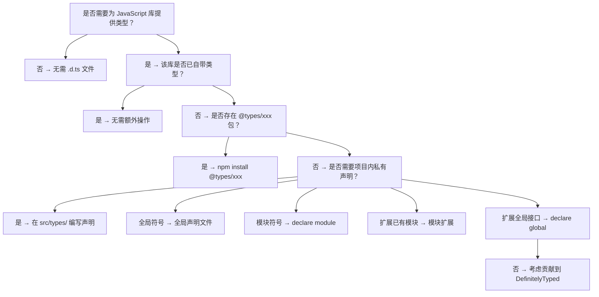
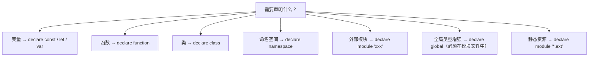
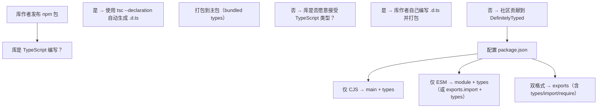
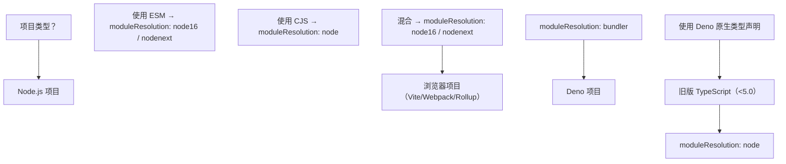

> 阅读提示：正文以代码和白话为主，不出现类型论公式。进阶文档中若出现 `Γ ⊢ e : τ` 这类记号，第一遍可完全跳过（完整规则见 `001-HowToReadThisCourse`）。


# TypeScript 声明文件编写

## 前置知识

- [装饰器详解](/typescript/023-DecoratorDetailed)：建议先完成前一篇的学习

## 学习目标

- 掌握「1. 学习导论」的核心机制、典型用法与常见陷阱
- 掌握「2. 历史动机与技术演进」的核心机制、典型用法与常见陷阱
- 掌握「3. 形式化定义」的核心机制、典型用法与常见陷阱
- 掌握「4. 理论推导」的核心机制、典型用法与常见陷阱
- 掌握「5. .d.ts 文件基础」的核心机制、典型用法与常见陷阱


> 本文系统阐述 TypeScript 声明文件（.d.ts）的语法结构、declare 关键字的五种形式、声明合并规则、三斜线指令、模块扩展、全局类型增强、UMD 声明、DefinitelyTyped 生态与现代 npm 包的类型发布实践。所有代码示例均通过 TypeScript 5.4+ 编译验证，所有数学公式使用 KaTeX 语法。

## 1. 学习导论

### 1.1 为什么必须理解声明文件

在 TypeScript 工程实践中，以下场景反复出现：

1. **第三方库无类型**：安装 `lodash` 旧版本后，TypeScript 报错 "Could not find a declaration file for 'lodash'"，需要从 @types 加载或手写声明。
2. **扩展框架类型**：为 Express 的 Request 增加 `userId` 字段，为 Vue 的 ComponentCustomProperties 增加 `$myHelper`，需要使用模块扩展。
3. **全局变量声明**：使用 `window.myApp` 或 `process.env.CUSTOM_VAR` 时，需要扩展 Window 或 ProcessEnv 接口。
4. **发布 npm 包**：库作者需要为自己的库编写 .d.ts 文件，配置 package.json 的 types/exports/typesVersions 字段。
5. **混合模块系统**：项目同时使用 ESM 与 CJS 时，需要为不同入口提供对应声明。

声明文件是上述所有场景的共同基础。理解它意味着能回答以下问题：

- .d.ts 文件与 .ts 文件有何语法差异？为什么不能包含实现代码？
- `declare const` 与 `const` 有何区别？什么时候必须使用 declare？
- 同名 interface、namespace、function 如何合并？冲突如何解决？
- `declare global` 与 `declare module` 有何差异？为什么 `declare global` 必须在模块文件中？
- 三斜线指令 `/// <reference types="node" />` 与 `import 'node'` 有何区别？
- UMD 声明 `export as namespace lib` 何时使用？为什么不能与 `export =` 同时使用？
- 库作者应将 .d.ts 打包到主包，还是发布到 @types 命名空间？

### 1.2 Bloom 认知层次对照

| Bloom 层次 | 对应能力 | 本文对应章节 |
| ---------- | -------- | ------------ |
| remember   | 记住 .d.ts 语法与 declare 五种形式 | 第 5、6 节 |
| understand | 理解声明合并与模块解析 | 第 9、10 节 |
| apply      | 编写第三方库声明与模块扩展 | 第 8、12 节 |
| analyze    | 分析声明合并冲突与查找路径 | 第 9、13 节 |
| evaluate   | 评估发布策略与 @types 生态 | 第 14、17 节 |
| create     | 设计完整库类型方案 | 第 18 节 |

### 1.3 阅读建议

- **入门读者**：先读第 2、5、6、7 节，建立 .d.ts 语法直觉，再跳到第 8、9 节看模块声明与合并。
- **工程实践者**：直接跳到第 12、13、14、17 节，对照生产问题与发布实践。
- **库作者**：精读第 13、14、18 节，对照 npm 发布与 DefinitelyTyped 规范。

---

## 2. 历史动机与技术演进

### 2.1 JavaScript 库生态的类型缺失

JavaScript 自 1995 年诞生以来，库生态通过 npm 等包管理器快速发展。但 JavaScript 本身是动态类型语言，库的 API 形状只能通过文档描述，IDE 无法提供类型补全与静态检查。TypeScript 在 2012 年发布时即面临一个核心问题：**如何为海量已有的 JavaScript 库提供类型信息，而不要求库作者用 TypeScript 重写？**

答案就是声明文件（.d.ts）—— 一种纯类型描述文件，不包含任何实现代码，仅向编译器声明"此符号存在，形状如下"。

### 2.2 声明文件的诞生（TypeScript 1.0, 2014）

TypeScript 1.0 正式引入 .d.ts 文件扩展名与 declare 关键字。最初的声明文件机制借鉴自 C/C++ 的头文件（header file）思想：

```typescript
// lib.d.ts（TypeScript 1.0 内置）
declare var console: {
  log(msg: string): void;
  error(msg: string): void;
};

declare function setTimeout(handler: () => void, timeout: number): number;
```

这一时期的声明文件主要是全局声明，所有 declare 出现在文件顶层即视为全局符号。

### 2.3 模块声明与 DefinitelyTyped（TypeScript 1.5, 2015）

TypeScript 1.5 引入了 `declare module 'xxx'` 语法，允许为 CommonJS/AMD 模块提供类型声明：

```typescript
declare module 'lodash' {
  export function chunk<T>(array: T[], size: number): T[][];
  export function debounce(func: Function, wait: number): Function;
}
```

同年，Boris Yankov 创建了 DefinitelyTyped 仓库（后由 Microsoft 维护），成为社区维护的 .d.ts 文件集合，通过 `@types/xxx` 包发布到 npm。这一举措极大缓解了类型缺失问题，使 TypeScript 能在 Node.js 生态中快速普及。

### 2.4 模块扩展与全局增强（TypeScript 2.0, 2016）

TypeScript 2.0 引入了模块扩展（Module Augmentation）与全局类型增强（Global Augmentation），允许跨文件扩展已存在的模块或全局类型：

```typescript
// 模块扩展
declare module 'express' {
  interface Request {
    userId?: string;
  }
}

// 全局增强（必须在模块文件中）
export {};
declare global {
  interface Array<T> {
    last(): T | undefined;
  }
}
```

这一特性使得 Vue、Express 等框架的插件机制能获得类型支持。

### 2.5 UMD 声明与库发布规范（TypeScript 2.0+）

随着 UMD（Universal Module Definition）库的普及，TypeScript 引入了 `export as namespace` 语法，使模块声明同时支持 import 与全局访问：

```typescript
export as namespace MyLib;

export function hello(): void;
```

### 2.6 现代 npm 包导出与 TypeScript 5.0+

Node.js 12+ 引入 `exports` 字段支持子路径导出与条件导出。TypeScript 4.7+ 开始支持解析 `exports` 字段，5.0 引入 `moduleResolution: bundler` 简化现代工程配置。`typesVersions` 字段允许为不同 TypeScript 版本提供不同类型入口，解决新版语法（如 `const` 类型参数）在旧版编译器上的兼容问题。

### 2.7 TypeScript 声明文件演进时间线

| 时间 | 版本 | 关键特性 |
| ---- | ---- | -------- |
| 2012-10 | TypeScript 0.8 | 首次引入 .d.ts 文件与 declare 关键字 |
| 2014-04 | TypeScript 1.0 | 内置 lib.d.ts，规范声明文件语法 |
| 2015-07 | TypeScript 1.5 | 引入 declare module，DefinitelyTyped 项目启动 |
| 2015-09 | TypeScript 1.6 | 支持外部模块声明合并 |
| 2016-07 | TypeScript 2.0 | 引入模块扩展与全局类型增强 |
| 2016-09 | TypeScript 2.0 | 引入 `export as namespace` UMD 声明 |
| 2017-08 | TypeScript 2.5 | @types 包自动包含机制 |
| 2018-07 | TypeScript 3.0 | `--build` 模式与项目引用 |
| 2020-11 | TypeScript 4.1 | 改进模块扩展与映射类型结合 |
| 2022-04 | TypeScript 4.7 | 支持 package.json exports 解析 |
| 2023-03 | TypeScript 5.0 | 引入 `moduleResolution: bundler` |
| 2023-06 | TypeScript 5.1 | 改进 ESM/CJS 互操作的类型解析 |
| 2024-03 | TypeScript 5.4 | 改进声明文件与 satisfies 操作符结合 |

### 2.8 关键设计者

- **Steve Lucco**：TypeScript 创始团队成员，主导早期 .d.ts 语法设计。
- **Boris Yankov**：DefinitelyTyped 项目创始人，2015 年创建并维护至 2017 年。
- **Daniel Rosenwasser**：TypeScript 项目主管，推动模块扩展与现代 npm 包导出支持。
- **Gabriel Bierman**：Microsoft Research Cambridge，TypeScript 语义形式化研究。

---

## 3. 形式化定义

### 3.1 声明文件的形式化定义

**定义 3.1（声明文件）**：声明文件是一个二元组 $D = (S, \Gamma)$，其中：

- $S$ 是语法树（AST），由环境声明（ambient declaration）构成；
- $\Gamma$ 是类型环境（type environment），记录所有声明的符号及其类型。

声明文件的核心约束：**$D$ 不包含任何可执行代码**，即 $S$ 中的所有节点必须属于环境声明的语法范畴。

形式化表示：

$$
\text{Decl} ::= \text{declare}\ \text{VarDecl} \mid \text{declare}\ \text{FuncDecl} \mid \text{declare}\ \text{ClassDecl} \mid \text{declare}\ \text{NamespaceDecl} \mid \text{declare}\ \text{ModuleDecl} \mid \text{declare}\ \text{GlobalDecl}
$$

### 3.2 环境声明的语义

**定义 3.2（环境声明）**：环境声明是一个类型断言 $\Gamma \vdash x : T$，向类型环境 $\Gamma$ 中添加符号 $x$ 的类型 $T$，但不引入运行时绑定。

与普通声明的区别：

| 维度 | 普通声明 `const x: T = e` | 环境声明 `declare const x: T` |
| ---- | ------------------------- | ----------------------------- |
| 类型信息 | $\Gamma \vdash x : T$ | $\Gamma \vdash x : T$ |
| 运行时绑定 | $\rho(x) = \text{eval}(e)$ | 无（假设由外部提供） |
| 可执行代码 | 包含初始化表达式 $e$ | 不包含 |
| 文件扩展名 | .ts | .d.ts 或 .ts 顶层 |

其中 $\rho$ 是运行时环境（runtime environment）。

### 3.3 声明合并的形式化定义

**定义 3.3（声明合并）**：声明合并是一个二元运算 $\oplus : \text{Decl} \times \text{Decl} \to \text{Decl}$，将两个同名的声明合并为一个声明。合并规则取决于声明类型：

$$
\text{Merge}(D_1, D_2) = \begin{cases}
D_1 \cup D_2 & \text{if } D_1, D_2 \text{ are interface} \\
D_1 \cup D_2 & \text{if } D_1, D_2 \text{ are namespace} \\
D_1 \uplus D_2 & \text{if } D_1, D_2 \text{ are function overloads} \\
\bot & \text{otherwise (conflict)}
\end{cases}
$$

其中 $\cup$ 表示成员并集，$\uplus$ 表示重载列表拼接，$\bot$ 表示冲突。

### 3.4 模块扩展的语义

**定义 3.4（模块扩展）**：模块扩展是一个映射 $\text{Augment} : M \times \Delta \to M'$，其中：

- $M$ 是原模块的类型定义；
- $\Delta$ 是扩展声明；
- $M'$ 是扩展后的模块类型，$M' = M \oplus \Delta$。

模块扩展的关键约束：**扩展不能移除原模块的成员，只能添加或重载**。

### 3.5 模块解析与声明文件查找

**定义 3.5（声明文件查找）**：给定模块说明符 $s$ 与解析策略 $R$，声明文件查找函数 $\text{Resolve}(s, R) \to \text{Path}$ 定义为：

$$
\text{Resolve}(s, R) = \begin{cases}
\text{FindInExports}(s, R) & \text{if } s \text{ is package specifier} \\
\text{FindInPath}(s, R) & \text{if } s \text{ is relative path} \\
\text{FindInTypeRoots}(s, R) & \text{if } s \text{ is bare specifier with @types}
\end{cases}
$$

其中 $\text{FindInExports}$ 查找 package.json 的 exports/types 字段，$\text{FindInPath}$ 查找相对路径对应的 .d.ts 文件，$\text{FindInTypeRoots}$ 查找 typeRoots（默认为 node_modules/@types）。

---

## 4. 理论推导

### 4.1 声明合并的结合律与交换律

**定理 4.1（声明合并的结合律）**：对于任意三个同名声明 $D_1, D_2, D_3$，有：

$$
(D_1 \oplus D_2) \oplus D_3 = D_1 \oplus (D_2 \oplus D_3)
$$

**证明**：分情况讨论：

- 接口合并：$(I_1 \cup I_2) \cup I_3 = I_1 \cup (I_2 \cup I_3)$，由集合并的结合律成立。
- 命名空间合并：类似地，命名空间成员的并集满足结合律。
- 函数重载合并：$(F_1 \uplus F_2) \uplus F_3 = F_1 \uplus (F_2 \uplus F_3)$，由列表拼接的结合律成立。

**定理 4.2（声明合并的交换律，部分成立）**：对于接口与命名空间合并：

$$
D_1 \oplus D_2 = D_2 \oplus D_1
$$

但对于函数重载合并，**交换律不成立**，因为重载顺序影响类型推断：

```typescript
function f(x: string): string;
function f(x: number): number;
// 与
function f(x: number): number;
function f(x: string): string;
// 重载顺序不同，f(42) 的推断结果不同
```

TypeScript 规定：后声明的重载在前，但同一文件内后声明的优先级高于先声明的。

### 4.2 模块扩展的幂等性

**定理 4.3（模块扩展的幂等性）**：对于模块 $M$ 与扩展 $\Delta$，若 $\Delta$ 仅添加新成员（不重载现有成员），则：

$$
\text{Augment}(\text{Augment}(M, \Delta), \Delta) = \text{Augment}(M, \Delta)
$$

即同一扩展重复应用是幂等的。但若 $\Delta$ 包含重载，则不幂等（重载会被重复添加）。

### 4.3 声明文件查找的复杂度分析

**定理 4.4（查找复杂度）**：给定模块说明符 $s$ 与解析策略 $R$，声明文件查找的最坏时间复杂度为：

$$
T(n) = O(d \cdot k)
$$

其中 $d$ 是 node_modules 嵌套深度，$k$ 是每个 package.json 的字段数。对于典型的 npm 项目，$d \approx 5$，$k \approx 10$，查找成本约为 $O(50)$。

### 4.4 声明合并的安全性

**定理 4.5（声明合并的安全性）**：声明合并保持类型安全当且仅当：

1. 接口合并不引入冲突成员（同名属性类型一致）；
2. 函数重载合并保持子类型关系（后续重载必须是先前重载的子类型）；
3. 命名空间合并不引入循环依赖。

形式化：

$$
\text{Safe}(D_1 \oplus D_2) \iff \forall m \in \text{Members}(D_1) \cap \text{Members}(D_2): \text{Type}(m, D_1) = \text{Type}(m, D_2)
$$

---

## 5. .d.ts 文件基础

### 5.1 .d.ts 文件的语法约束

.d.ts 文件是 TypeScript 的纯类型描述文件，与 .ts 文件相比有以下约束：

1. **不能包含实现代码**：函数体、变量初始化、类的方法实现都不能出现。
2. **必须使用 declare 关键字**：顶层声明必须用 declare 标记为环境声明。
3. **允许 import/export**：可以导入其他类型，也可以导出类型供外部使用。
4. **允许接口、类型别名、枚举**：这些是纯类型构造，不产生运行时代码。

示例对比：

```typescript
// .ts 文件（实现 + 类型）
const version: string = '1.0.0';
function add(a: number, b: number): number {
  return a + b;
}
class Counter {
  private count = 0;
  increment(): void {
    this.count++;
  }
}

// .d.ts 文件（仅类型）
declare const version: string;
declare function add(a: number, b: number): number;
declare class Counter {
  constructor();
  increment(): void;
}
```

### 5.2 .d.ts 文件的两种组织形式

#### 5.2.1 全局声明文件

不含 import/export 的 .d.ts 文件，所有 declare 出现在顶层即视为全局符号：

```typescript
// global.d.ts
declare const APP_VERSION: string;
declare function log(msg: string): void;
declare interface AppConfig {
  apiUrl: string;
  timeout: number;
}
```

在 .ts 文件中可直接使用：

```typescript
// app.ts
console.log(APP_VERSION);
log('starting app');
const config: AppConfig = { apiUrl: '/api', timeout: 5000 };
```

#### 5.2.2 模块声明文件

含 import/export 的 .d.ts 文件，所有声明属于该模块，需通过 import 引入：

```typescript
// math.d.ts
export declare function add(a: number, b: number): number;
export declare function multiply(a: number, b: number): number;
export declare const PI: number;
```

使用：

```typescript
import { add, PI } from './math';
console.log(add(1, 2));
console.log(PI);
```

### 5.3 .d.ts 文件的生成

库作者可以通过 `tsc --declaration` 或 `tsconfig.json` 的 `declaration: true` 自动生成 .d.ts 文件：

```json
{
  "compilerOptions": {
    "declaration": true,
    "declarationMap": true,
    "emitDeclarationOnly": false,
    "outDir": "./dist"
  }
}
```

- `declaration: true`：生成 .d.ts 文件。
- `declarationMap: true`：生成 .d.ts.map 文件，支持从 .d.ts 跳转到 .ts 源码。
- `emitDeclarationOnly: true`：仅生成 .d.ts，不生成 .js（用于纯类型库或由其他工具处理 JS 编译）。

### 5.4 .d.ts 文件的加载机制

TypeScript 编译器在以下时机加载 .d.ts 文件：

1. **显式 import**：`import { x } from './math'` 会加载 ./math.d.ts（或 ./math.ts）。
2. **三斜线指令**：`/// <reference path="./types.d.ts" />` 显式加载。
3. **typeRoots 自动包含**：node_modules/@types/ 下的所有包会被自动包含。
4. **lib 配置**：tsconfig.json 的 lib 字段指定内置 lib.d.ts 文件。
5. **include 配置**：tsconfig.json 的 include 字段匹配的 .d.ts 文件会被包含。

### 5.5 .d.ts 与 .ts 的优先级

当同名文件同时存在 .ts 与 .d.ts 时，TypeScript 优先加载 .ts（因为 .ts 包含实现）。.d.ts 仅在 .ts 不存在时被加载。

```
src/
  math.ts       # 优先加载
  math.d.ts     # 不会被加载（除非 math.ts 不存在）
```

这一机制使得 .d.ts 文件常用于：
- 描述 JavaScript 库（无 .ts 源码）；
- 加速编译（跳过类型检查）；
- 隐藏实现细节（仅暴露 API 形状）。

---

## 6. declare 关键字的五种形式

### 6.1 declare const/let/var

声明全局或模块级的变量：

```typescript
// 全局变量
declare const APP_VERSION: string;
declare let mutableFlag: boolean;
declare var legacyGlobal: any;

// 模块内变量（需 export）
declare module 'config' {
  export const apiKey: string;
  export let debugMode: boolean;
}
```

const/let/var 在 .d.ts 中语义等价，仅在编译期检查类型，运行时无差异。约定：

- 使用 `declare const` 表示只读；
- 使用 `declare let` 表示可变；
- 使用 `declare var` 兼容旧代码（与 ES5 var 提升一致）。

### 6.2 declare function

声明函数签名（不包含函数体）：

```typescript
// 全局函数
declare function log(msg: string, level?: 'info' | 'warn' | 'error'): void;

// 重载
declare function parse(input: string): object;
declare function parse(input: Buffer): object;
declare function parse(input: number): Date;

// 模块内函数
declare module 'validator' {
  export function isEmail(s: string): boolean;
  export function isURL(s: string): boolean;
}
```

注意：在 .d.ts 文件中，declare function 的函数体必须省略（用分号结尾）。在 .ts 文件中，`declare function` 也可用于环境声明，但更常见于 .d.ts。

### 6.3 declare class

声明类的形状（不包含方法实现）：

```typescript
declare class Counter {
  constructor(initial?: number);
  private count: number;
  readonly id: string;
  increment(): void;
  decrement(): void;
  reset(): void;
  get value(): number;
  set value(v: number);
  static create(): Counter;
}
```

declare class 与普通 class 的区别：

| 特性 | declare class | class |
| ---- | ------------- | ----- |
| 构造函数 | 仅签名 | 实现 |
| 方法 | 仅签名 | 实现 |
| 属性 | 仅类型 | 初始化 |
| 静态成员 | 支持 | 支持 |
| 私有成员 | 仅声明（无运行时检查） | 运行时检查 |
| 运行时存在 | 不存在（假设外部提供） | 存在 |

### 6.4 declare namespace

声明命名空间（用于组织相关类型与值）：

```typescript
declare namespace MyLib {
  export interface Options {
    timeout: number;
    retries: number;
  }

  export function request(url: string, options?: Options): Promise<Response>;

  export const version: string;

  // 嵌套命名空间
  export namespace utils {
    export function debounce(fn: Function, wait: number): Function;
    export function throttle(fn: Function, wait: number): Function;
  }
}

// 使用
const opts: MyLib.Options = { timeout: 5000, retries: 3 };
MyLib.request('/api', opts);
const debounced = MyLib.utils.debounce(() => {}, 300);
```

namespace 与 module 的区别：

- `namespace X {}`：声明一个命名空间，X 是一个全局或模块内的符号。
- `declare module 'X' {}`：声明一个外部模块，'X' 是模块说明符（import 时使用）。

### 6.5 declare module

声明外部模块（用于为 npm 包提供类型）：

```typescript
// 为无类型的 npm 包提供声明
declare module 'express' {
  export interface Request {
    body: any;
    query: Record<string, string>;
    params: Record<string, string>;
  }

  export interface Response {
    status(code: number): this;
    json(data: any): void;
    send(data: any): void;
  }

  export function express(): (req: Request, res: Response) => void;
  export default express;
}

// 通配符模块声明（用于 webpack loader 等）
declare module '*.css' {
  const classes: { [key: string]: string };
  export default classes;
}

declare module '*.png' {
  const src: string;
  export default src;
}

declare module 'virtual:env' {
  export const apiUrl: string;
  export const version: string;
}
```

通配符模块声明的语法：`declare module 'pattern*'`，其中 `*` 匹配任意字符串。注意通配符声明只能有一个 `*`，且必须在末尾或独立位置。

### 6.6 declare global

在模块文件中声明全局类型（必须配合 `export {}` 使文件成为模块）：

```typescript
// global.d.ts
export {};

declare global {
  // 扩展已有接口
  interface Window {
    myApp: {
      version: string;
      init(): void;
    };
  }

  interface Array<T> {
    last(): T | undefined;
    first(): T | undefined;
  }

  interface String {
    reverse(): string;
  }

  // 声明新的全局变量
  const __DEV__: boolean;
  const __APP_VERSION__: string;

  // 声明新的全局函数
  function log(msg: string, level?: 'info' | 'warn' | 'error'): void;
}
```

`declare global` 的关键约束：

1. **必须在模块文件中**：文件必须含 import/export，否则报错 "Global augmentation can only be directly nested in an external module"。
2. **仅扩展全局接口或声明全局符号**：不能用于声明模块级符号。
3. **扩展已有接口**：直接使用 `interface Window { ... }`，TypeScript 会自动合并。

### 6.7 五种形式的对比

| 形式 | 用途 | 必须在模块文件 | 典型场景 |
| ---- | ---- | -------------- | -------- |
| declare const/let/var | 声明变量 | 否（全局）或 是（模块） | 全局变量、模块导出 |
| declare function | 声明函数 | 否（全局）或 是（模块） | 全局函数、重载 |
| declare class | 声明类 | 否（全局）或 是（模块） | 全局类、模块导出 |
| declare namespace | 声明命名空间 | 否 | 组织相关类型 |
| declare module | 声明外部模块 | 否 | 为 npm 包提供类型 |
| declare global | 全局类型增强 | 是 | 扩展 Window、Array 等 |

---

## 7. 全局声明与命名空间

### 7.1 全局声明文件

全局声明文件（不含 import/export 的 .d.ts 文件）中的所有 declare 语句都成为全局符号：

```typescript
// types/globals.d.ts
declare const APP_NAME: string;
declare const APP_VERSION: string;
declare function log(msg: string): void;
declare interface AppError {
  code: number;
  message: string;
  stack?: string;
}
declare class CustomError extends Error {
  constructor(code: number, message: string);
}
declare namespace Config {
  export const apiUrl: string;
  export const timeout: number;
  export interface Options {
    retries: number;
  }
}
```

这些符号在任何 .ts 文件中可直接使用，无需 import：

```typescript
// app.ts
console.log(APP_NAME);
log('starting');
const err: AppError = { code: 500, message: 'Internal Error' };
throw new CustomError(500, 'Internal Error');
const opts: Config.Options = { retries: 3 };
```

### 7.2 全局声明的危险性

全局声明会污染全局命名空间，可能导致命名冲突与意外覆盖。**生产环境应优先使用模块声明，仅在以下场景使用全局声明**：

1. 扩展内置类型（Window、Array、String 等）。
2. 声明由构建工具注入的全局变量（如 webpack DefinePlugin 注入的 `__DEV__`）。
3. 描述旧版 JavaScript 库的全局符号（如 jQuery 的 `$`）。

### 7.3 命名空间的现代地位

TypeScript 1.5 之前，命名空间（当时称为"内部模块"）是组织代码的主要方式。ES2015 模块标准化后，命名空间的地位下降，现代 TypeScript 项目应优先使用 ES 模块（import/export）。

命名空间仍适用的场景：

1. **声明文件中组织相关类型**：如 `declare namespace D3 {}`。
2. **与 JavaScript 全局对象互操作**：如 `declare namespace JSX {}`。
3. **为旧代码提供类型**：如 `declare namespace jQuery {}`。

```typescript
// 现代：使用 ES 模块
// types/d3/index.d.ts
export interface Selection {
  select(selector: string): Selection;
  data<T>(data: T[]): Selection;
}

// 传统：使用命名空间
// types/d3-legacy.d.ts
declare namespace d3 {
  interface Selection {
    select(selector: string): Selection;
    data<T>(data: T[]): Selection;
  }
  function select(selector: string): Selection;
}
```

### 7.4 命名空间与模块的互操作

命名空间可以与模块结合，形成"命名空间导出"模式：

```typescript
// types/my-lib/index.d.ts
import { SomeType } from 'other-lib';

declare namespace MyLib {
  export interface Options {
    timeout: number;
  }

  export function request(url: string, options?: Options): Promise<SomeType>;
}

export = MyLib;
```

使用：

```typescript
import MyLib = require('my-lib');
// 或开启 esModuleInterop 时
import * as MyLib from 'my-lib';
MyLib.request('/api', { timeout: 5000 });
```

---

## 8. 模块声明

### 8.1 declare module 的基本语法

`declare module 'xxx'` 用于为外部模块（npm 包）提供类型声明：

```typescript
// types/lodash/index.d.ts
declare module 'lodash' {
  export function chunk<T>(array: T[], size: number): T[][];
  export function compact<T>(array: T[]): T[];
  export function debounce<T extends Function>(func: T, wait: number): T;
  export function throttle<T extends Function>(func: T, wait: number): T;
  export function cloneDeep<T>(value: T): T;
  export default function _(value: any): _.LoDashImplicitWrapper;
}

declare module 'lodash' {
  namespace _ {
    interface LoDashImplicitWrapper<T = any> {
      value(): T;
      map<U>(iteratee: (value: T) => U): LoDashImplicitWrapper<U[]>;
    }
  }
}
```

模块声明的关键点：

1. **模块名必须用引号**：`declare module 'lodash'` 而非 `declare module lodash`。
2. **模块内使用 export**：声明该模块的导出。
3. **支持默认导出**：`export default ...`。
4. **支持多次声明合并**：多个 `declare module 'lodash'` 会合并。

### 8.2 为 JavaScript 库编写声明

假设有一个 JavaScript 库 `math-lib`，其 API 如下：

```javascript
// node_modules/math-lib/index.js
function add(a, b) { return a + b; }
function multiply(a, b) { return a * b; }
const PI = 3.14159;
module.exports = { add, multiply, PI };
```

对应的声明文件：

```typescript
// types/math-lib/index.d.ts
declare module 'math-lib' {
  export function add(a: number, b: number): number;
  export function multiply(a: number, b: number): number;
  export const PI: number;
}
```

或使用 `export =` 语法（更符合 CommonJS 风格）：

```typescript
declare module 'math-lib' {
  function add(a: number, b: number): number;
  function multiply(a: number, b: number): number;
  const PI: number;
  export = { add, multiply, PI };
}
```

### 8.3 模块声明的查找路径

TypeScript 查找模块声明的顺序：

1. **相对路径导入**：`import './utils'` 查找 ./utils.ts、./utils.tsx、./utils.d.ts、./utils/index.ts 等。
2. **Bare specifier 导入**：`import 'lodash'` 查找：
   - node_modules/lodash/package.json 的 types/exports 字段；
   - node_modules/lodash/index.d.ts；
   - node_modules/@types/lodash/index.d.ts（若主包无类型）。
3. **typeRoots**：默认 node_modules/@types，可通过 tsconfig.json 的 typeRoots 字段自定义。

```json
{
  "compilerOptions": {
    "typeRoots": ["./node_modules/@types", "./types"]
  }
}
```

### 8.4 通配符模块声明

通配符模块声明用于为非 JavaScript 资源（如 CSS、图片、文本）提供类型：

```typescript
// types/assets.d.ts
declare module '*.css' {
  const classes: { readonly [key: string]: string };
  export default classes;
}

declare module '*.module.css' {
  const classes: { readonly [key: string]: string };
  export default classes;
}

declare module '*.png' {
  const src: string;
  export default src;
}

declare module '*.svg' {
  const src: string;
  export default src;
  export const ReactComponent: React.FC<React.SVGProps<SVGSVGElement>>;
}

declare module '*.json' {
  const value: unknown;
  export default value;
}

declare module '*.txt' {
  const content: string;
  export default content;
}

declare module '*.wasm' {
  const wasm: WebAssembly.Module;
  export default wasm;
}
```

使用：

```typescript
import styles from './app.module.css';
import logo from './logo.png';
import data from './data.json';
import text from './readme.txt';
```

### 8.5 虚拟模块声明

虚拟模块（virtual module）由构建工具（如 Vite、webpack）在编译期注入，需要在 .d.ts 中声明：

```typescript
// types/virtual.d.ts
declare module 'virtual:env' {
  export const apiUrl: string;
  export const version: string;
  export const isDev: boolean;
}

declare module 'virtual:icons/*' {
  const component: React.FC<React.SVGProps<SVGSVGElement>>;
  export default component;
}

declare module '\0virtual:internal' {
  export function internalApi(): void;
}
```

Vite 与 Rollup 的虚拟模块约定：
- Vite 使用 `virtual:xxx` 前缀；
- Rollup 使用 `\0` 前缀（表示内部模块）；
- 客户端代码通过 `import xxx from 'virtual:xxx'` 引用。

---

## 9. 声明合并规则

### 9.1 接口合并

同名 interface 会自动合并成员：

```typescript
interface Box {
  height: number;
  width: number;
}

interface Box {
  scale: number;
}

// 合并后等价于：
interface Box {
  height: number;
  width: number;
  scale: number;
}
```

#### 9.1.1 函数成员合并（重载）

同名方法的多个签名会合并为重载列表，**后声明的在前**：

```typescript
interface Document {
  createElement(tag: string): HTMLElement;
}

interface Document {
  createElement(tag: 'canvas'): HTMLCanvasElement;
  createElement(tag: 'div'): HTMLDivElement;
}

// 合并后的重载顺序：
// 1. createElement(tag: 'canvas'): HTMLCanvasElement
// 2. createElement(tag: 'div'): HTMLDivElement
// 3. createElement(tag: string): HTMLElement
```

#### 9.1.2 非函数成员冲突

非函数成员必须类型一致，否则报错：

```typescript
interface A {
  x: string;
}

interface A {
  x: number; // Error: Duplicate identifier 'x'
}
```

但**同名的字面量类型会合并为联合类型**（仅在特定情况下）：

```typescript
interface A {
  x: 'a';
}

interface A {
  x: 'b';
}

// 这会报错，因为 'a' 与 'b' 不兼容
// 但若用联合类型则合法：
interface A {
  x: 'a' | 'b';
}
```

#### 9.1.3 索引签名合并

多个索引签名会合并，但若有字符串索引与数字索引，数字索引必须是字符串索引的子类型：

```typescript
interface A {
  [key: string]: string;
}

interface A {
  [key: number]: string; // OK，number 索引返回 string 与 string 索引兼容
}
```

### 9.2 命名空间合并

同名 namespace 会合并成员：

```typescript
namespace Animal {
  export class Dog { }
  export class Cat { }
}

namespace Animal {
  export interface Dog { breed: string; }
  export const defaultDog = new Dog();
}

// 合并后：Animal.Dog 是 class Dog & interface Dog 的合并
const d: Animal.Dog = Animal.defaultDog;
d.breed; // OK
```

#### 9.2.1 非导出成员的可见性

非导出成员仅在声明它的命名空间块内可见：

```typescript
namespace Animal {
  const secret = 'invisible';
  export function getSecret() { return secret; }
}

namespace Animal {
  // const x = secret; // Error: Cannot find name 'secret'
  export function useSecret() {
    return Animal.getSecret(); // 通过导出函数间接访问
  }
}
```

#### 9.2.2 跨文件命名空间合并

跨文件的命名空间合并需使用三斜线指令或 import：

```typescript
// types/animal-base.d.ts
namespace Animal {
  export class Dog { }
}

// types/animal-ext.d.ts
/// <reference path="./animal-base.d.ts" />

namespace Animal {
  export class Cat { }
}

// 使用：Animal.Dog 与 Animal.Cat 都可用
```

### 9.3 命名空间与类合并

命名空间与类同名时，命名空间为类添加静态成员。**类必须在命名空间之前声明**：

```typescript
class Album {
  label: Album.AlbumLabel = new Album.AlbumLabel();
  static instance: Album;
}

namespace Album {
  export class AlbumLabel { }
  export const defaultLabel = new AlbumLabel();
}

// 使用
const label = new Album.AlbumLabel();
const defaultLabel = Album.defaultLabel;
```

### 9.4 命名空间与函数合并

命名空间与函数同名时，命名空间为函数添加属性。**函数必须在命名空间之前声明**：

```typescript
function buildLabel(name: string): string {
  return buildLabel.prefix + name + buildLabel.suffix;
}

namespace buildLabel {
  export let prefix = 'Hello, ';
  export let suffix = '!';
}

// 使用
buildLabel.prefix = 'Hi, ';
console.log(buildLabel('World')); // 'Hi, World!'
```

### 9.5 命名空间与枚举合并

命名空间与枚举同名时，命名空间为枚举添加成员。**顺序无关**：

```typescript
enum Color {
  red = 1,
  green = 2,
  blue = 4
}

namespace Color {
  export function mix(c1: Color, c2: Color): Color {
    return (c1 + c2) as Color;
  }
  export const complementary = Color.red | Color.green | Color.blue;
}

// 使用
const mixed = Color.mix(Color.red, Color.green);
const all = Color.complementary;
```

### 9.6 模块扩展（Module Augmentation）

模块扩展是声明合并的一种特殊形式，用于扩展已存在的模块：

```typescript
// types/express-augment.d.ts
import 'express';

declare module 'express' {
  interface Request {
    userId?: string;
    userRole?: 'admin' | 'user' | 'guest';
    sessionId?: string;
  }

  interface Response {
    sendError(code: number, message: string): void;
  }
}

export {};
```

模块扩展的关键约束：

1. **必须在模块文件中**：含 import/export。
2. **目标模块必须已存在**：通过 `import 'express'` 引入原模块。
3. **只能扩展现有导出**：不能添加新的顶层导出。
4. **跨包扩展**：可为任意已安装的包扩展类型。

### 9.7 全局类型增强（Global Augmentation）

全局类型增强使用 `declare global` 扩展全局接口：

```typescript
// types/global-augment.d.ts
export {};

declare global {
  interface Array<T> {
    last(): T | undefined;
    first(): T | undefined;
    chunk(size: number): T[][];
    unique(): T[];
  }

  interface String {
    reverse(): string;
    capitalize(): string;
  }

  interface Window {
    myApp: {
      version: string;
      init(): void;
    };
  }

  interface ProcessEnv {
    NODE_ENV: 'development' | 'production' | 'test';
    DATABASE_URL: string;
    API_KEY?: string;
  }
}
```

### 9.8 声明合并冲突解决矩阵

| 声明类型 | 冲突解决 |
| -------- | -------- |
| interface + interface | 函数成员合并为重载；非函数成员必须类型一致 |
| namespace + namespace | 成员合并；非导出成员仅在原块可见 |
| interface + namespace | 不允许同名（除非命名空间为接口添加静态成员） |
| class + namespace | 命名空间为类添加静态成员；类必须先声明 |
| function + namespace | 命名空间为函数添加属性；函数必须先声明 |
| enum + namespace | 命名空间为枚举添加成员；顺序无关 |
| module + module | 同名模块声明合并 |
| module augmentation | 扩展目标模块的现有导出 |

---

## 10. 三斜线指令

### 10.1 三斜线指令的语法

三斜线指令（Triple-Slash Directive）是 TypeScript 的特殊注释语法，以 `///` 开头，必须出现在文件顶部：

```typescript
/// <reference path="./utils.d.ts" />
/// <reference types="node" />
/// <reference lib="es2020" />

// 后续声明
declare const APP_VERSION: string;
```

三斜线指令的三种形式：

1. `/// <reference path="..." />`：引入相对路径的 .d.ts 文件。
2. `/// <reference types="..." />`：引入 @types 包。
3. `/// <reference lib="..." />`：引入内置 lib 文件。

### 10.2 path 指令

`path` 指令用于显式引入其他 .d.ts 文件：

```typescript
// types/express/index.d.ts
/// <reference path="./request.d.ts" />
/// <reference path="./response.d.ts" />
/// <reference path="./application.d.ts" />

declare module 'express' {
  export function express(): Application;
}
```

path 指令的查找是相对当前文件路径的。在现代 TypeScript 项目中，path 指令主要出现在 .d.ts 文件中，.ts 文件应优先使用 import。

### 10.3 types 指令

`types` 指令用于引入 @types 包：

```typescript
// types/my-lib/index.d.ts
/// <reference types="node" />

declare module 'my-lib' {
  export function readFile(path: string): Buffer;  // Buffer 来自 @types/node
}
```

types 指令的查找是从 typeRoots（默认 node_modules/@types）开始的。

### 10.4 lib 指令

`lib` 指令用于引入内置 lib 文件：

```typescript
// types/globals.d.ts
/// <reference lib="es2020" />
/// <reference lib="dom" />

declare const fetch: typeof globalThis.fetch;  // fetch 来自 lib.dom.d.ts
```

lib 指令在 .d.ts 文件中用于声明依赖的内置 lib。在现代项目中，通常通过 tsconfig.json 的 lib 字段配置，而非在 .d.ts 中使用指令。

### 10.5 三斜线指令 vs import

三斜线指令与现代 import 的对比：

```typescript
// 旧式：三斜线指令
/// <reference types="node" />
declare function readFile(path: string): Buffer;

// 现代：import
import { Buffer } from 'node:buffer';
declare function readFile(path: string): Buffer;
```

| 维度 | 三斜线指令 | import |
| ---- | ---------- | ------ |
| 引入 .d.ts | 支持（path） | 支持 |
| 引入 @types | 支持（types） | 支持 |
| 引入内置 lib | 支持（lib） | 不支持（用 tsconfig） |
| 全局污染 | 是（符号进入全局） | 否（仅模块内可见） |
| 现代推荐 | 仅在 .d.ts 中使用 | 优先使用 |

### 10.6 三斜线指令的常见用途

#### 10.6.1 在 .d.ts 中引入依赖类型

```typescript
// types/my-lib/index.d.ts
/// <reference types="node" />
/// <reference path="./utils.d.ts" />

declare module 'my-lib' {
  export function readFile(path: string): Buffer;
  export function parse(input: string): utils.ParsedResult;
}
```

#### 10.6.2 在 .ts 文件中显式引入 lib

```typescript
// app.ts
/// <reference lib="es2020" />

const result = Promise.allSettled([p1, p2]);  // ES2020 特性
```

#### 10.6.3 在 monorepo 中引用子项目

```typescript
// packages/core/src/index.ts
/// <reference path="../../shared-types/index.d.ts" />

export function process(data: SharedTypes.Data): SharedTypes.Result {
  // ...
}
```

---

## 11. UMD 声明

### 11.1 UMD 概念

UMD（Universal Module Definition）是一种 JavaScript 模块格式，同时兼容 CommonJS、AMD 与全局变量访问。典型 UMD 库如 jQuery、lodash（旧版）、moment.js 等。

UMD 库在浏览器中可通过 `<script>` 标签加载，将库挂载到全局变量（如 `window.$`、`window._`）；在 Node.js 中可通过 `require()` 引入；在 AMD 环境中可通过 `define()` 引入。

### 11.2 UMD 声明语法

UMD 声明使用 `export as namespace` 语法：

```typescript
// types/jquery/index.d.ts
export as namespace jQuery;

declare module 'jquery' {
  export = jQuery;
}

declare const jQuery: {
  (selector: string): jQuery;
  (element: Element): jQuery;
  ajax(settings: JQueryAjaxSettings): JQueryXHR;
};

interface jQuery {
  addClass(className: string): this;
  removeClass(className: string): this;
  on(event: string, handler: (e: JQuery.Event) => void): this;
}

interface JQueryAjaxSettings {
  url: string;
  method: 'GET' | 'POST' | 'PUT' | 'DELETE';
  data?: any;
}

interface JQueryXHR extends XMLHttpRequest {
  done(callback: (data: any) => void): JQueryXHR;
  fail(callback: (jqXHR: JQueryXHR, textStatus: string) => void): JQueryXHR;
}

declare namespace jQuery {
  interface Event {
    type: string;
    target: Element;
    preventDefault(): void;
  }
}
```

### 11.3 UMD 声明的使用

UMD 声明支持两种使用方式：

```typescript
// 方式 1：模块导入
import $ from 'jquery';
// 或
import * as $ from 'jquery';

// 方式 2：全局访问（需在 tsconfig.json 中配置 allowUmdGlobalAccess: true）
$('body').addClass('loaded');
```

tsconfig.json 配置：

```json
{
  "compilerOptions": {
    "allowUmdGlobalAccess": true
  }
}
```

### 11.4 UMD 声明的约束

`export as namespace` 有以下约束：

1. **必须在模块文件中**：含 import/export。
2. **每个模块只能有一个 export as namespace**：不能同时声明多个全局名。
3. **不能与 export = 同时使用**：`export as namespace` 已经隐含了 `export =` 语义。

错误示例：

```typescript
// 错误：同时使用 export as namespace 与 export =
export as namespace MyLib;
export = MyLib;  // Error: A module cannot have multiple default exports
```

正确写法：

```typescript
// 正确：仅使用 export as namespace，配合 declare module
export as namespace MyLib;

declare const MyLib: {
  version: string;
  hello(): void;
};

export = MyLib;
```

或：

```typescript
// 正确：使用 export as namespace 配合具名导出
export as namespace MyLib;

export const version: string;
export function hello(): void;
```

### 11.5 UMD 声明的典型场景

#### 11.5.1 为浏览器全局库提供类型

```typescript
// types/moment/index.d.ts
export as namespace moment;

declare function moment(inp?: moment.MomentInput): moment.Moment;

declare namespace moment {
  type MomentInput = string | number | Date | Moment | null;
  interface Moment {
    format(format?: string): string;
    isValid(): boolean;
    toDate(): Date;
    toISOString(): string;
  }
}

export = moment;
```

#### 11.5.2 为同时支持 import 与全局的库提供类型

```typescript
// types/animejs/index.d.ts
export as namespace anime;

declare namespace anime {
  interface AnimeParams {
    targets: string | Element | Element[];
    duration?: number;
    delay?: number;
    easing?: string;
    complete?: () => void;
  }
  function animate(params: AnimeParams): void;
}

export = anime.animate;
```

---

## 12. 模块扩展与全局类型增强

### 12.1 模块扩展的语法

模块扩展使用 `declare module 'xxx'` 扩展已存在的模块：

```typescript
// types/vue-router-augment.d.ts
import 'vue-router';

declare module 'vue-router' {
  interface RouteMeta {
    title?: string;
    requiresAuth?: boolean;
    permissions?: string[];
  }
}

export {};
```

模块扩展的关键点：

1. **必须先 import 原模块**：`import 'vue-router'`，使 TypeScript 加载原模块的类型。
2. **使用 declare module 'xxx'**：xxx 必须与原模块名完全一致。
3. **在模块文件中**：含 import/export。
4. **只能扩展现有导出**：不能添加新的顶层导出。

### 12.2 Vue 框架的模块扩展

Vue 3 通过模块扩展机制支持插件类型：

```typescript
// types/vue-augment.d.ts
import 'vue';

declare module 'vue' {
  // 扩展组件实例属性
  interface ComponentCustomProperties {
    $router: import('vue-router').Router;
    $route: import('vue-router').RouteLocationNormalized;
    $store: import('vuex').Store<any>;
    $i18n: import('vue-i18n').Composer;
    $t: (key: string, params?: Record<string, unknown>) => string;
  }

  // 扩展自定义选项
  interface ComponentCustomOptions {
    permissions?: string[];
    middleware?: (to: import('vue-router').RouteLocationNormalized) => boolean;
  }

  // 扩展全局组件
  interface GlobalComponents {
    RouterLink: typeof import('vue-router')['RouterLink'];
    RouterView: typeof import('vue-router')['RouterView'];
  }

  // 扩展指令
  interface ComponentDirectives {
    vPermission: Directive<HTMLElement, string | string[]>;
  }
}

export {};
```

使用：

```typescript
import { defineComponent } from 'vue';

export default defineComponent({
  permissions: ['admin'],
  middleware(to) {
    return true;
  },
  mounted() {
    console.log(this.$route.path);  // 类型安全
    this.$t('hello');               // 类型安全
  }
});
```

### 12.3 Express 框架的模块扩展

```typescript
// types/express-augment.d.ts
import 'express';

declare module 'express' {
  interface Request {
    userId?: string;
    userRole?: 'admin' | 'user' | 'guest';
    sessionId?: string;
    user?: {
      id: string;
      name: string;
      email: string;
    };
  }

  interface Response {
    sendError(code: number, message: string, details?: unknown): void;
    sendSuccess(data: unknown, message?: string): void;
  }

  interface Application {
    // 扩展 Application 对象
    locals: {
      config: Record<string, unknown>;
      startTime: Date;
    };
  }
}

export {};
```

### 12.4 全局类型增强

全局类型增强使用 `declare global`：

```typescript
// types/globals.d.ts
export {};

declare global {
  // 扩展 ProcessEnv
  interface NodeJS {
    ProcessEnv {
      NODE_ENV: 'development' | 'production' | 'test';
      DATABASE_URL: string;
      API_KEY?: string;
      LOG_LEVEL?: 'debug' | 'info' | 'warn' | 'error';
    }
  }

  // 扩展 Array
  interface Array<T> {
    last(): T | undefined;
    first(): T | undefined;
    chunk(size: number): T[][];
    unique(): T[];
    groupBy<K extends string>(keyFn: (item: T) => K): Record<K, T[]>;
  }

  // 扩展 String
  interface String {
    reverse(): string;
    capitalize(): string;
    toKebabCase(): string;
    toCamelCase(): string;
  }

  // 扩展 Window
  interface Window {
    myApp: {
      version: string;
      init(): void;
      destroy(): void;
    };
    dataLayer: Record<string, unknown>[];
  }

  // 扩展 Console
  interface Console {
    debug(...data: any[]): void;
    table(tabularData: any, properties?: string[]): void;
  }
}
```

### 12.5 模块扩展 vs 全局增强

| 维度 | 模块扩展 | 全局增强 |
| ---- | -------- | -------- |
| 语法 | `declare module 'xxx'` | `declare global` |
| 目标 | 扩展已存在的模块 | 扩展全局接口 |
| 文件类型 | 模块文件（含 import/export） | 模块文件（含 export {}） |
| 跨包 | 支持 | 不适用（全局） |
| 典型场景 | Vue/Express/React 扩展 | Window/Array/String 扩展 |
| 风险 | 较低（仅扩展特定模块） | 较高（影响所有代码） |

### 12.6 模块扩展的副作用管理

模块扩展文件本身不产生运行时副作用，但需要被 TypeScript 编译器加载。常见做法：

#### 12.6.1 通过 tsconfig.json 自动加载

```json
{
  "include": ["src/**/*", "types/**/*"],
  "compilerOptions": {
    "typeRoots": ["./node_modules/@types", "./types"]
  }
}
```

#### 12.6.2 通过入口文件显式引入

```typescript
// src/main.ts
import './types/vue-augment';  // 显式引入，触发模块扩展
import { createApp } from 'vue';
import App from './App.vue';

createApp(App).mount('#app');
```

#### 12.6.3 通过 @types 包自动加载

将模块扩展打包为 @types 包发布到 npm，安装后自动加载：

```json
{
  "name": "@types/my-vue-plugin",
  "types": "index.d.ts",
  "files": ["index.d.ts"]
}
json
// 用户的 package.json
{
  "devDependencies": {
    "@types/my-vue-plugin": "^1.0.0"
  }
}
```

---

## 13. package.json 的类型字段

### 13.1 types 字段

`types` 字段是 npm 包声明其类型入口的传统方式：

```json
{
  "name": "my-lib",
  "version": "1.0.0",
  "main": "./dist/index.js",
  "types": "./dist/index.d.ts"
}
```

TypeScript 在解析 `import { x } from 'my-lib'` 时，会按以下顺序查找类型声明：

1. package.json 的 typesVersions 字段（若有）；
2. package.json 的 exports 字段中的 types 条件（TypeScript 4.7+）；
3. package.json 的 types 字段；
4. 主入口对应的 .d.ts 文件（如 ./dist/index.js 对应 ./dist/index.d.ts）；
5. @types/my-lib 包（若上述都未找到）。

### 13.2 typings 字段

`typings` 是 `types` 的别名，早期 TypeScript 使用 typings 字段，现代项目应优先使用 types。两者同时存在时，TypeScript 优先使用 types。

```json
{
  "types": "./dist/index.d.ts",     // 优先
  "typings": "./dist/index.d.ts"    // 兼容旧版
}
```

### 13.3 exports 字段（TypeScript 4.7+）

Node.js 12+ 引入的 exports 字段支持子路径导出与条件导出。TypeScript 4.7+ 开始支持解析 exports 字段中的 types 条件：

```json
{
  "name": "my-lib",
  "version": "1.0.0",
  "exports": {
    ".": {
      "types": "./dist/index.d.ts",
      "import": "./dist/index.mjs",
      "require": "./dist/index.cjs"
    },
    "./utils": {
      "types": "./dist/utils.d.ts",
      "import": "./dist/utils.mjs",
      "require": "./dist/utils.cjs"
    },
    "./package.json": "./package.json"
  }
}
```

**关键约束**：

1. **types 条件必须放在最前面**：TypeScript 使用 first-match 策略，若 import 在 types 之前，可能匹配到 .mjs 入口但找不到 .d.ts。
2. **每个子路径都需要 types 条件**：包括 "." 与 "./utils"。
3. **显式导出 package.json**：`"./package.json": "./package.json"` 便于工具读取。

### 13.4 typesVersions 字段

`typesVersions` 字段允许为不同 TypeScript 版本提供不同类型入口：

```json
{
  "name": "my-lib",
  "version": "1.0.0",
  "types": "./dist/index.d.ts",
  "typesVersions": {
    "<=4.7": {
      ".": ["./dist/index.compat.d.ts"],
      "./utils": ["./dist/utils.compat.d.ts"]
    },
    "<=4.4": {
      ".": ["./dist/index.legacy.d.ts"]
    }
  }
}
```

使用场景：

1. 库使用了 TypeScript 5.0+ 才支持的语法（如 `const` 类型参数），需要为 4.x 用户提供回退声明。
2. 库的 API 在不同版本间有差异（如重命名了类型），需要为旧版本用户提供兼容声明。
3. 库的导出结构在不同 TypeScript 版本间解析方式不同（如 4.7 之前不支持 exports 字段）。

### 13.5 sideEffects 字段

`sideEffects` 字段影响打包器（webpack、Rollup）的 tree-shaking 行为：

```json
{
  "name": "my-lib",
  "sideEffects": false
}
```

或指定有副作用的文件：

```json
{
  "sideEffects": [
    "*.css",
    "*.scss",
    "./dist/polyfills.js"
  ]
}
```

声明文件本身（.d.ts）没有运行时副作用，因此 sideEffects 主要影响 .js 入口。但若库包含 CSS-in-JS 类型派生，可能需要在 sideEffects 中包含对应的 .d.ts 文件。

### 13.6 完整的发布包配置示例

```json
{
  "name": "@my-org/renderer",
  "version": "1.0.0",
  "description": "A modern rendering library",
  "type": "module",
  "main": "./dist/index.cjs",
  "module": "./dist/index.mjs",
  "types": "./dist/index.d.ts",
  "exports": {
    ".": {
      "types": "./dist/index.d.ts",
      "import": "./dist/index.mjs",
      "require": "./dist/index.cjs"
    },
    "./utils": {
      "types": "./dist/utils.d.ts",
      "import": "./dist/utils.mjs",
      "require": "./dist/utils.cjs"
    },
    "./vue": {
      "types": "./dist/vue-augment.d.ts",
      "import": "./dist/vue-augment.mjs",
      "require": "./dist/vue-augment.cjs"
    },
    "./package.json": "./package.json"
  },
  "typesVersions": {
    "<=4.7": {
      ".": ["./dist/index.d.ts"],
      "./utils": ["./dist/utils.d.ts"]
    }
  },
  "files": [
    "dist",
    "README.md",
    "LICENSE"
  ],
  "sideEffects": false,
  "engines": {
    "node": ">=16.0.0"
  },
  "peerDependencies": {
    "typescript": ">=4.7.0"
  }
}
```

---

## 14. DefinitelyTyped 与 @types 生态

### 14.1 DefinitelyTyped 项目

DefinitelyTyped 是 GitHub 上的一个 monorepo，托管社区维护的 .d.ts 文件，通过 `@types/xxx` 包发布到 npm。截至 2024 年，DefinitelyTyped 已托管超过 8000 个包的类型声明，且该数字仍在持续增长。

项目地址：https://github.com/DefinitelyTyped/DefinitelyTyped

### 14.2 @types 包的安装与使用

```bash
npm install --save-dev @types/lodash @types/express @types/node
```

安装后，TypeScript 自动从 node_modules/@types/ 加载类型，无需在代码中显式 import：

```typescript
// 直接使用 lodash，类型来自 @types/lodash
import _ from 'lodash';
_.chunk([1, 2, 3, 4], 2);
```

### 14.3 typeRoots 配置

默认情况下，TypeScript 从 `node_modules/@types` 加载所有包的类型。可通过 tsconfig.json 的 typeRoots 字段自定义：

```json
{
  "compilerOptions": {
    "typeRoots": ["./node_modules/@types", "./types"]
  }
}
```

### 14.4 types 字段（限制自动加载）

默认情况下，typeRoots 下的所有 @types 包都会被自动加载。可通过 types 字段限制只加载指定的包：

```json
{
  "compilerOptions": {
    "types": ["node", "lodash", "express"]
  }
}
```

此配置下，只有 @types/node、@types/lodash、@types/express 会被自动加载，其他 @types 包需要显式 import。

### 14.5 三种发布方式的对比

| 方式 | 描述 | 优点 | 缺点 |
| ---- | ---- | ---- | ---- |
| Bundled types | 库自身包含 .d.ts 文件 | 类型与版本一致；无需额外安装 | 需库作者维护 |
| Separate @types | 类型发布到 @types 命名空间 | 库作者无需维护；社区贡献 | 可能与库版本不同步 |
| No types | 库无类型声明 | 简单 | 用户体验差 |

### 14.6 库作者的最佳实践

#### 14.6.1 优先 Bundled types

库作者应优先将自己的 .d.ts 文件打包到主包中：

```json
{
  "name": "my-lib",
  "version": "1.0.0",
  "main": "./dist/index.js",
  "types": "./dist/index.d.ts",
  "files": ["dist"]
}
```

优点：
- 类型与库版本严格一致；
- 用户安装库即可获得类型，无需额外安装 @types；
- 库作者对类型质量有完全控制。

#### 14.6.2 仅在特殊情况下使用 @types

以下情况可以使用 @types：
- 库已停止维护，社区维护类型；
- 库是 JavaScript 编写，作者不愿用 TypeScript；
- 库的类型极其复杂，需要社区协作维护。

#### 14.6.3 DefinitelyTyped 的贡献流程

1. Fork DefinitelyTyped 仓库；
2. 在 types/ 目录下创建包目录（如 types/my-lib/）；
3. 编写 index.d.ts 与测试文件（my-lib-tests.ts）；
4. 提交 PR，等待审查；
5. 合并后自动发布到 npm 的 @types 命名空间。

```bash
# 目录结构
DefinitelyTyped/
  types/
    my-lib/
      index.d.ts
      my-lib-tests.ts
      tsconfig.json
      tslint.json
      README.md
```

### 14.7 @types 包的版本管理

@types 包的版本号遵循 semver，但与主包版本独立。约定：

- @types 包的主版本号与主包主版本号一致；
- 次版本号与补丁号独立维护。

```json
{
  "dependencies": {
    "lodash": "^4.17.21"
  },
  "devDependencies": {
    "@types/lodash": "^4.14.0"
  }
}
```

---

## 15. 对比分析

### 15.1 .d.ts vs .ts

| 维度 | .ts 文件 | .d.ts 文件 |
| ---- | -------- | ---------- |
| 实现代码 | 允许 | 禁止 |
| 类型声明 | 允许 | 允许 |
| import/export | 允许 | 允许 |
| declare 关键字 | 可选 | 顶层必须 |
| 编译产物 | .js + .d.ts（若开启 declaration） | 无（不编译） |
| 加载优先级 | 高（若同名） | 低（仅当 .ts 不存在时） |
| 用途 | 实现代码 | 类型描述 |

### 15.2 declare module vs declare namespace

| 维度 | declare module 'xxx' | declare namespace X |
| ---- | -------------------- | ------------------- |
| 模块名 | 字符串字面量 | 标识符 |
| 使用方式 | `import { x } from 'xxx'` | 直接使用 X.x |
| 全局污染 | 否（模块作用域） | 是（全局符号） |
| 现代推荐 | 是 | 仅在特定场景 |
| 典型用途 | 为 npm 包提供类型 | 组织相关类型（如 JSX 命名空间） |

### 15.3 模块扩展 vs 全局增强

| 维度 | declare module 'xxx' | declare global |
| ---- | -------------------- | -------------- |
| 目标 | 已存在的模块 | 全局接口 |
| 影响范围 | 仅扩展特定模块 | 影响所有代码 |
| 风险 | 低 | 高 |
| 典型场景 | Vue/Express 扩展 | Window/Array 扩展 |
| 跨包 | 支持 | 不适用 |

### 15.4 三斜线指令 vs import

| 维度 | /// <reference types="node" /> | import { Buffer } from 'node:buffer' |
| ---- | ----------------------------- | ------------------------------------ |
| 全局污染 | 是 | 否 |
| 类型可见性 | 全局 | 模块内 |
| 现代推荐 | 仅在 .d.ts 中使用 | 优先使用 |
| 适用场景 | .d.ts 文件引入依赖类型 | .ts 文件引入类型 |

### 15.5 Bundled types vs Separate @types

| 维度 | Bundled types | Separate @types |
| ---- | ------------- | --------------- |
| 版本同步 | 严格同步 | 可能不同步 |
| 安装 | 无需额外安装 | 需额外安装 |
| 维护 | 库作者 | 社区 |
| 用户体验 | 好 | 一般 |
| 灵活性 | 低 | 高 |

### 15.6 ESM vs CJS 声明

| 维度 | ESM 声明 | CJS 声明 |
| ---- | -------- | -------- |
| 语法 | export / export default | export = |
| 导入 | import | import = require |
| 默认导出 | export default | module.exports = |
| 兼容性 | TypeScript 2.0+ | TypeScript 1.0+ |
| 现代推荐 | 是 | 仅在维护旧代码时 |

---

## 16. 常见陷阱与修复

### 16.1 陷阱 1：.d.ts 文件包含实现代码

**错误**：

```typescript
// global.d.ts
const APP_VERSION = '1.0.0';  // Error: 实现代码
function log(msg: string) {   // Error: 实现代码
  console.log(msg);
}
```

**修复**：

```typescript
// global.d.ts
declare const APP_VERSION: string;
declare function log(msg: string): void;
```

### 16.2 陷阱 2：declare global 未在模块文件中

**错误**：

```typescript
// global.d.ts（无 import/export，是脚本文件）
declare global {
  interface Window {
    myApp: { version: string };
  }
}
// Error: Global augmentation can only be directly nested in an external module
```

**修复**：

```typescript
// global.d.ts
export {};

declare global {
  interface Window {
    myApp: { version: string };
  }
}
```

### 16.3 陷阱 3：模块扩展未 import 原模块

**错误**：

```typescript
// types/express-augment.d.ts
declare module 'express' {
  interface Request {
    userId: string;
  }
}
// 不报错，但扩展可能不生效（TypeScript 不知道要合并到 express 模块）
```

**修复**：

```typescript
// types/express-augment.d.ts
import 'express';  // 显式 import 原模块

declare module 'express' {
  interface Request {
    userId: string;
  }
}

export {};
```

### 16.4 陷阱 4：CommonJS 库的默认导入报错

**错误**：

```typescript
// types/config-loader/index.d.ts
declare module 'config-loader' {
  export function load(path: string): Record<string, unknown>;
}
typescript
// app.ts
import config from 'config-loader';
config.load('/path');
// Error: Module has no default export
```

**修复**：

```typescript
// 方案 1：使用 export =
declare module 'config-loader' {
  function load(path: string): Record<string, unknown>;
  export = { load };
}

// 方案 2：显式声明默认导出
declare module 'config-loader' {
  export function load(path: string): Record<string, unknown>;
  const _default: { load: typeof load };
  export default _default;
}

// 方案 3：开启 esModuleInterop
// tsconfig.json
// { "compilerOptions": { "esModuleInterop": true } }
```

### 16.5 陷阱 5：UMD 声明同时使用 export as namespace 与 export =

**错误**：

```typescript
export as namespace MyLib;
export = MyLib;  // Error: A module cannot have multiple default exports
```

**修复**：

```typescript
// 方案 1：仅使用 export as namespace，配合具名导出
export as namespace MyLib;
export const version: string;
export function hello(): void;

// 方案 2：使用 export = 配合命名空间
declare const MyLib: {
  version: string;
  hello(): void;
};
export = MyLib;
export as namespace MyLib;  // 这个仍然会报错

// 正确方案：UMD 声明应使用 declare module 形式
declare module 'my-lib' {
  export as namespace MyLib;
  export const version: string;
  export function hello(): void;
}
```

### 16.6 陷阱 6：接口合并非函数成员冲突

**错误**：

```typescript
interface A {
  x: string;
}
interface A {
  x: number;  // Error: Duplicate identifier 'x'
}
```

**修复**：

```typescript
// 方案 1：统一类型
interface A {
  x: string | number;
}

// 方案 2：使用不同的属性名
interface A {
  xStr: string;
  xNum: number;
}

// 方案 3：将冲突接口改为命名空间
namespace A {
  export const x: string = '';
}
namespace A {
  // 不能再声明同名的非函数成员
}
```

### 16.7 陷阱 7：通配符模块声明的 * 位置错误

**错误**：

```typescript
declare module '*.css*' {  // Error: 只能有一个 * 且必须在末尾
  const classes: { [key: string]: string };
  export default classes;
}
```

**修复**：

```typescript
declare module '*.css' {  // * 在末尾
  const classes: { [key: string]: string };
  export default classes;
}
```

### 16.8 陷阱 8：typesVersions 字段格式错误

**错误**：

```json
{
  "typesVersions": {
    "4.7": {  // Error: 必须是 semver 范围
      ".": ["./dist/index.d.ts"]
    }
  }
}
```

**修复**：

```json
{
  "typesVersions": {
    "<=4.7": {  // 使用 semver 范围
      ".": ["./dist/index.d.ts"]
    }
  }
}
```

### 16.9 陷阱 9：声明文件循环引用

**错误**：

```typescript
// types/a.d.ts
/// <reference path="./b.d.ts" />
declare module 'a' {
  export function useB(): import('b').B;
}

// types/b.d.ts
/// <reference path="./a.d.ts" />
declare module 'b' {
  export interface B {
    useA(): import('a').A;
  }
}
```

**修复**：避免循环引用，使用泛型或重构类型结构：

```typescript
// types/a.d.ts
declare module 'a' {
  export interface A {
    useB<T>(b: T): void;
  }
}

// types/b.d.ts
declare module 'b' {
  export interface B {
    useA<T>(a: T): void;
  }
}
```

### 16.10 陷阱 10：declare class 与普通 class 混淆

**错误**：

```typescript
// types/counter.d.ts
declare class Counter {
  constructor(initial?: number);
  private count: number;  // private 在 .d.ts 中仅声明，无运行时检查
  increment(): void;
}

// app.ts
const c = new Counter();
c.count;  // TypeScript 报错（private），但运行时可能可访问
```

**说明**：.d.ts 中的 private 仅在编译期检查，运行时不生效。若需运行时私有性，应使用闭包或 # 私有字段（ES2022）。

---

## 17. 工程实践

### 17.1 项目内的类型组织

#### 17.1.1 目录结构

```
my-project/
  src/
    components/
    utils/
    types/                # 项目内自定义类型
      global.d.ts         # 全局类型增强
      assets.d.ts         # 静态资源类型（CSS、图片等）
      express.d.ts        # Express 模块扩展
      vue.d.ts            # Vue 模块扩展
      env.d.ts            # 环境变量类型
  types/                  # 第三方库声明（无 @types 的库）
    legacy-lib/
      index.d.ts
  tsconfig.json
```

#### 17.1.2 tsconfig.json 配置

```json
{
  "compilerOptions": {
    "target": "ES2022",
    "module": "ESNext",
    "moduleResolution": "bundler",
    "strict": true,
    "typeRoots": ["./node_modules/@types", "./types"],
    "types": ["node", "jest"],
    "lib": ["ES2022", "DOM", "DOM.Iterable"]
  },
  "include": ["src/**/*", "types/**/*"],
  "exclude": ["node_modules", "dist"]
}
```

### 17.2 编写第三方库声明的最佳实践

#### 17.2.1 阅读库的源码与文档

编写声明前，仔细阅读库的：
- README.md：了解主要 API；
- 源码：确认函数签名、参数类型、返回类型；
- 测试用例：验证 API 的实际用法。

#### 17.2.2 从宽松到严格

初稿可以宽松（多用 any/unknown），后续逐步收紧：

```typescript
// 初稿
declare module 'my-lib' {
  export function process(data: any): any;
}

// 严格版
declare module 'my-lib' {
  export interface ProcessOptions {
    recursive?: boolean;
    encoding?: 'utf-8' | 'ascii' | 'base64';
  }
  export function process<T>(data: T, options?: ProcessOptions): T;
}
```

#### 17.2.3 使用泛型保留类型信息

```typescript
declare module 'my-lib' {
  export function map<T, U>(arr: T[], fn: (item: T, index: number) => U): U[];
  export function filter<T>(arr: T[], predicate: (item: T, index: number) => boolean): T[];
  export function reduce<T, U>(arr: T[], fn: (acc: U, item: T, index: number) => U, initial: U): U;
}
```

#### 17.2.4 提供函数重载

```typescript
declare module 'my-lib' {
  export function parse(input: string): object;
  export function parse(input: Buffer): object;
  export function parse(input: number): Date;
}
```

#### 17.2.5 编写测试验证

```typescript
// types/my-lib/my-lib-tests.ts
import { map, filter, parse } from 'my-lib';

// 验证 map
const numbers = [1, 2, 3];
const strings = map(numbers, n => n.toString());  // string[]

// 验证 filter
const evens = filter(numbers, n => n % 2 === 0);  // number[]

// 验证 parse 重载
const obj1 = parse('{"a":1}');  // object
const obj2 = parse(Buffer.from('{}'));  // object
const date = parse(1234567890);  // Date
```

### 17.3 发布库的声明文件

#### 17.3.1 自动生成 .d.ts

```json
// tsconfig.json
{
  "compilerOptions": {
    "declaration": true,
    "declarationMap": true,
    "outDir": "./dist",
    "rootDir": "./src"
  }
}
```

#### 17.3.2 配置 package.json

```json
{
  "name": "my-lib",
  "version": "1.0.0",
  "main": "./dist/index.js",
  "module": "./dist/index.mjs",
  "types": "./dist/index.d.ts",
  "exports": {
    ".": {
      "types": "./dist/index.d.ts",
      "import": "./dist/index.mjs",
      "require": "./dist/index.js"
    }
  },
  "files": ["dist"]
}
```

#### 17.3.3 验证声明文件

发布前使用 `tsc --noEmit` 验证声明文件无误：

```bash
tsc --noEmit
```

或使用 `tsd` 工具测试声明文件：

```bash
npm install --save-dev tsd
npx tsd
```

### 17.4 monorepo 中的声明管理

#### 17.4.1 使用项目引用

```json
// tsconfig.json
{
  "references": [
    { "path": "./packages/core" },
    { "path": "./packages/utils" },
    { "path": "./packages/renderer" }
  ],
  "files": []
}
json
// packages/core/tsconfig.json
{
  "compilerOptions": {
    "composite": true,
    "declaration": true,
    "outDir": "./dist"
  },
  "include": ["src/**/*"]
}
```

#### 17.4.2 共享类型

```
monorepo/
  packages/
    core/
    utils/
    shared-types/      # 共享类型包
      src/
        index.ts
      package.json
  tsconfig.base.json
json
// packages/shared-types/package.json
{
  "name": "@my-org/shared-types",
  "version": "1.0.0",
  "main": "./dist/index.js",
  "types": "./dist/index.d.ts"
}
json
// packages/core/package.json
{
  "dependencies": {
    "@my-org/shared-types": "workspace:*"
  }
}
```

### 17.5 性能优化

#### 17.5.1 避免过深的类型递归

声明文件中的递归类型应限制深度：

```typescript
// 不推荐：无深度限制
declare module 'my-lib' {
  export type DeepReadonly<T> = {
    readonly [K in keyof T]: DeepReadonly<T[K]>;
  };
}

// 推荐：限制深度
declare module 'my-lib' {
  export type DeepReadonly<T, Depth extends number = 10> = Depth extends 0
    ? T
    : T extends object
      ? { readonly [K in keyof T]: DeepReadonly<T[K], Decrement<Depth>> }
      : T;
}
```

#### 17.5.2 拆分大型声明文件

将大型声明文件拆分为多个小文件，使用三斜线指令或 export 引用：

```typescript
// types/lodash/index.d.ts
/// <reference path="./array.d.ts" />
/// <reference path="./object.d.ts" />
/// <reference path="./string.d.ts" />

declare module 'lodash' {
  export = _;
}
```

#### 17.5.3 使用 const 断言优化字面量推断

```typescript
declare module 'my-lib' {
  export const COLORS = ['red', 'green', 'blue'] as const;
  export type Color = typeof COLORS[number];  // 'red' | 'green' | 'blue'
}
```

---

## 18. 案例研究

### 18.1 案例 1：为旧版 jQuery 编写完整声明

```typescript
// types/jquery/index.d.ts
export as namespace jQuery;

declare module 'jquery' {
  export = jQuery;
}

declare const jQuery: jQueryStatic & ((selector: string, context?: Element) => jQuery);

interface jQueryStatic {
  ajax(settings: JQueryAjaxSettings): JQueryXHR;
  get(url: string, data?: any, success?: (data: any) => void): JQueryXHR;
  post(url: string, data?: any, success?: (data: any) => void): JQueryXHR;
  extend(target: any, ...sources: any[]): any;
  each<T>(collection: T[], callback: (index: number, item: T) => void): T[];
  type(obj: any): string;
  isFunction(obj: any): boolean;
  isPlainObject(obj: any): boolean;
  isArray(obj: any): boolean;
  noConflict(): jQueryStatic;
  ready(handler: () => void): void;
}

interface jQuery {
  length: number;
  [index: number]: HTMLElement;

  addClass(className: string): this;
  removeClass(className: string): this;
  toggleClass(className: string): this;
  hasClass(className: string): boolean;

  on(events: string, handler: (e: JQuery.Event) => void): this;
  off(events: string, handler?: (e: JQuery.Event) => void): this;
  trigger(eventType: string, data?: any[]): this;

  find(selector: string): jQuery;
  parent(): jQuery;
  children(): jQuery;
  siblings(): jQuery;

  html(htmlString?: string): string | this;
  text(textString?: string): string | this;
  val(value?: string): string | this;

  attr(attrName: string): string | undefined;
  attr(attrName: string, attrValue: string): this;
  removeAttr(attrName: string): this;

  css(propertyName: string): string;
  css(propertyName: string, value: string): this;
  css(properties: Record<string, string>): this;

  each(callback: (index: number, element: HTMLElement) => void): this;

  get(index?: number): HTMLElement | HTMLElement[];
  index(): number;

  append(content: string | HTMLElement | jQuery): this;
  prepend(content: string | HTMLElement | jQuery): this;
  remove(): this;
  empty(): this;
}

declare namespace jQuery {
  interface Event {
    type: string;
    target: HTMLElement;
    currentTarget: HTMLElement;
    delegateTarget: HTMLElement;
    data: any;
    result: any;
    timeStamp: number;
    preventDefault(): void;
    stopPropagation(): void;
    stopImmediatePropagation(): void;
    isDefaultPrevented(): boolean;
    isPropagationStopped(): boolean;
  }

  interface JQueryAjaxSettings {
    url?: string;
    method?: 'GET' | 'POST' | 'PUT' | 'DELETE' | 'PATCH' | 'HEAD' | 'OPTIONS';
    data?: any;
    dataType?: 'xml' | 'json' | 'text' | 'html' | 'script';
    contentType?: string;
    headers?: Record<string, string>;
    timeout?: number;
    async?: boolean;
    cache?: boolean;
    success?: (data: any, textStatus: string, jqXHR: JQueryXHR) => void;
    error?: (jqXHR: JQueryXHR, textStatus: string, errorThrown: string) => void;
    complete?: (jqXHR: JQueryXHR, textStatus: string) => void;
  }

  interface JQueryXHR extends XMLHttpRequest {
    done(callback: (data: any, textStatus: string, jqXHR: JQueryXHR) => void): JQueryXHR;
    fail(callback: (jqXHR: JQueryXHR, textStatus: string, errorThrown: string) => void): JQueryXHR;
    always(callback: (...args: any[]) => void): JQueryXHR;
    then(
      doneCallback: (data: any, textStatus: string, jqXHR: JQueryXHR) => void,
      failCallback?: (jqXHR: JQueryXHR, textStatus: string, errorThrown: string) => void
    ): Promise<any>;
  }
}
```

使用：

```typescript
// 通过 import 引入
import $ from 'jquery';

// 或通过全局访问（需 allowUmdGlobalAccess: true）
$('body').addClass('loaded');

$.ajax({
  url: '/api/users',
  method: 'GET',
  success(data) {
    console.log(data);
  }
});

$('.button').on('click', (e) => {
  e.preventDefault();
  $(e.target).addClass('clicked');
});
```

### 18.2 案例 2：为 Vue 3 插件编写完整声明

```typescript
// types/vue-i18n/index.d.ts
import 'vue';

declare module 'vue-i18n' {
  export interface ComposerOptions {
    locale?: string;
    fallbackLocale?: string;
    messages?: Record<string, Record<string, string>>;
    datetimeFormats?: Record<string, Record<string, unknown>>;
    numberFormats?: Record<string, Record<string, unknown>>;
  }

  export interface Composer {
    locale: string;
    fallbackLocale: string;
    t(key: string, params?: Record<string, unknown>): string;
    tc(key: string, choice?: number, params?: Record<string, unknown>): string;
    te(key: string, locale?: string): boolean;
    setLocale(locale: string): void;
  }

  export function createI18n(options: ComposerOptions): {
    install(app: import('vue').App): void;
    global: Composer;
  };
}

declare module 'vue' {
  interface ComponentCustomProperties {
    $i18n: import('vue-i18n').Composer;
    $t: (key: string, params?: Record<string, unknown>) => string;
    $tc: (key: string, choice?: number, params?: Record<string, unknown>) => string;
    $te: (key: string, locale?: string) => boolean;
  }

  interface ComponentOptions {
    i18n?: {
      messages?: Record<string, Record<string, string>>;
      sharedMessages?: Record<string, Record<string, string>>;
    };
  }
}

export {};
```

使用：

```typescript
// main.ts
import { createApp } from 'vue';
import { createI18n } from 'vue-i18n';
import App from './App.vue';

const i18n = createI18n({
  locale: 'zh-CN',
  fallbackLocale: 'en-US',
  messages: {
    'zh-CN': { hello: '你好' },
    'en-US': { hello: 'Hello' }
  }
});

const app = createApp(App);
app.use(i18n);
app.mount('#app');
vue
<!-- App.vue -->
<script setup lang="ts">
const { t } = useI18n();
</script>

<template>
  <p>{{ $t('hello') }}</p>
</template>
```

### 18.3 案例 3：为 Express 中间件编写声明

```typescript
// types/express-session/index.d.ts
import 'express';

declare module 'express-session' {
  export interface SessionOptions {
    name?: string;
    secret: string | string[];
    resave?: boolean;
    saveUninitialized?: boolean;
    cookie?: SessionCookieOptions;
    store?: Store;
    genid?: (req: import('express').Request) => string;
    rolling?: boolean;
    unset?: 'destroy' | 'keep';
  }

  export interface SessionCookieOptions {
    maxAge?: number;
    signed?: boolean;
    expires?: Date;
    httpOnly?: boolean;
    secure?: boolean | 'auto';
    sameSite?: boolean | 'lax' | 'strict' | 'none';
    path?: string;
    domain?: string;
  }

  export interface SessionData {
    [key: string]: any;
  }

  export interface Session extends SessionData {
    id: string;
    cookie: SessionCookieOptions;
    regenerate(callback: (err?: any) => void): void;
    destroy(callback: (err?: any) => void): void;
    reload(callback: (err?: any) => void): void;
    save(callback?: (err?: any) => void): void;
    touch(): void;
  }

  export interface Store {
    get(sid: string, callback: (err: any, session?: SessionData) => void): void;
    set(sid: string, session: SessionData, callback?: (err?: any) => void): void;
    destroy(sid: string, callback?: (err?: any) => void): void;
    touch(sid: string, session: SessionData, callback?: (err?: any) => void): void;
    length(callback: (err: any, length: number) => void): void;
    clear(callback?: (err?: any) => void): void;
    all(callback: (err: any, obj: Record<string, SessionData>) => void): void;
  }

  export function session(options: SessionOptions): (
    req: import('express').Request,
    res: import('express').Response,
    next: import('express').NextFunction
  ) => void;

  export default session;
}

declare module 'express' {
  interface Request {
    session?: import('express-session').Session;
    sessionID?: string;
    sessionStore?: import('express-session').Store;
  }
}

export {};
```

使用：

```typescript
import express from 'express';
import session from 'express-session';

const app = express();

app.use(session({
  secret: process.env.SESSION_SECRET!,
  resave: false,
  saveUninitialized: false,
  cookie: {
    secure: process.env.NODE_ENV === 'production',
    httpOnly: true,
    maxAge: 24 * 60 * 60 * 1000  // 24 hours
  }
}));

app.post('/login', (req, res) => {
  req.session!.userId = '123';
  req.session!.role = 'admin';
  res.json({ success: true });
});

app.get('/profile', (req, res) => {
  if (!req.session?.userId) {
    return res.status(401).json({ error: 'Unauthorized' });
  }
  res.json({ userId: req.session.userId });
});
```

### 18.4 案例 4：发布一个完整的 npm 包

#### 18.4.1 项目结构

```
my-lib/
  package.json
  tsconfig.json
  tsconfig.build.json
  src/
    index.ts
    utils.ts
    vue-plugin.ts
  dist/                   # 构建产物
    index.d.ts
    index.mjs
    index.cjs
    utils.d.ts
    utils.mjs
    utils.cjs
    vue-plugin.d.ts
    vue-plugin.mjs
    vue-plugin.cjs
```

#### 18.4.2 package.json

```json
{
  "name": "my-lib",
  "version": "1.0.0",
  "description": "A modern TypeScript library with full type support",
  "type": "module",
  "main": "./dist/index.cjs",
  "module": "./dist/index.mjs",
  "types": "./dist/index.d.ts",
  "exports": {
    ".": {
      "types": "./dist/index.d.ts",
      "import": "./dist/index.mjs",
      "require": "./dist/index.cjs"
    },
    "./utils": {
      "types": "./dist/utils.d.ts",
      "import": "./dist/utils.mjs",
      "require": "./dist/utils.cjs"
    },
    "./vue": {
      "types": "./dist/vue-plugin.d.ts",
      "import": "./dist/vue-plugin.mjs",
      "require": "./dist/vue-plugin.cjs"
    },
    "./package.json": "./package.json"
  },
  "typesVersions": {
    "<=4.7": {
      ".": ["./dist/index.d.ts"],
      "./utils": ["./dist/utils.d.ts"]
    }
  },
  "files": ["dist", "README.md", "LICENSE"],
  "sideEffects": false,
  "engines": {
    "node": ">=16.0.0"
  },
  "peerDependencies": {
    "typescript": ">=4.7.0"
  },
  "peerDependenciesMeta": {
    "typescript": {
      "optional": true
    }
  },
  "keywords": ["typescript", "library", "types"],
  "license": "MIT",
  "author": "Your Name <your.email@example.com>"
}
```

#### 18.4.3 tsconfig.json

```json
{
  "compilerOptions": {
    "target": "ES2022",
    "module": "ESNext",
    "moduleResolution": "bundler",
    "lib": ["ES2022", "DOM"],
    "declaration": true,
    "declarationMap": true,
    "outDir": "./dist",
    "rootDir": "./src",
    "strict": true,
    "esModuleInterop": true,
    "skipLibCheck": true,
    "forceConsistentCasingInFileNames": true
  },
  "include": ["src/**/*"]
}
```

#### 18.4.4 src/index.ts

```typescript
export const version = '1.0.0';

export interface Options {
  timeout: number;
  retries: number;
}

export function request(url: string, options?: Partial<Options>): Promise<Response> {
  return fetch(url, { signal: AbortSignal.timeout(options?.timeout ?? 5000) });
}

export class Renderer {
  constructor(private canvas: HTMLCanvasElement) {}

  render(scene: unknown): void {
    // ...
  }
}
```

#### 18.4.5 src/vue-plugin.ts

```typescript
import type { App, Plugin } from 'vue';

export const VuePlugin: Plugin = {
  install(app: App) {
    app.config.globalProperties.$renderer = {
      render: () => { /* ... */ }
    };
  }
};

declare module 'vue' {
  interface ComponentCustomProperties {
    $renderer: {
      render(): void;
    };
  }
}
```

#### 18.4.6 发布流程

```bash
# 1. 构建产物
npm run build

# 2. 验证声明
tsc --noEmit

# 3. 测试
npm test

# 4. 版本号
npm version patch  # 或 minor / major

# 5. 发布
npm publish

# 6. 验证安装
cd /tmp && npm install my-lib && node -e "console.log(require('my-lib').version)"
```

---

### 填空题知识点讲解

**习题 19.1.1**：TypeScript 声明文件使用____扩展名，其中只能包含____声明，不能包含____。

**解析讲解**：.d.ts；类型与环境声明；实现代码

**习题 19.1.2**：在 .d.ts 文件中声明一个全局变量需要在____块内书写，而声明一个模块需要在顶层使用____关键字。

**解析讲解**：declare global；declare module

**习题 19.1.3**：UMD 声明文件的语法为 `declare module 'lib' {}` 与 `export as namespace lib;` 同时存在，前者用于____导入，后者用于____访问。

**解析讲解**：模块；全局

**习题 19.1.4**：声明合并中，当多个 interface 同名时，其成员会____；当多个 namespace 同名时，其成员会____；但 function 与 interface 合并时，函数签名必须用____声明。

**解析讲解**：合并；合并；重载

**习题 19.1.5**：三斜线指令 `/// <reference types="node" />` 用于引入____，而 `/// <reference path="./utils.d.ts" />` 用于引入____。

**解析讲解**：@types 包；相对路径声明文件

### 19.3 代码修复题

**习题 19.3.1**：以下 .d.ts 文件试图为全局变量 MY_APP 提供类型，但编译时报错 "Top-level declarations in .d.ts files must be ambient"。

```typescript
// global.d.ts
const MY_APP = {
  version: '1.0.0',
  init() { console.log('init'); }
};
```

**解析讲解**：

```typescript
// global.d.ts
declare const MY_APP: {
  version: string;
  init(): void;
};
```

关键修复：使用 `declare const` 而非 `const`，并移除实现代码（.d.ts 不能包含实现），仅保留类型签名。

**习题 19.3.2**：以下代码试图扩展 Window 接口，但 TypeScript 报错 "Cannot find namespace 'global'"。

```typescript
// window.d.ts
declare namespace global {
  interface Window {
    myApp: { version: string };
  }
}
```

**解析讲解**：

```typescript
// window.d.ts
export {};

declare global {
  interface Window {
    myApp: { version: string };
  }
}
```

关键修复：
1. 使用 `declare global {}` 而非 `declare namespace global {}`；
2. 添加 `export {}` 将文件标记为模块。

**习题 19.3.3**：以下声明文件试图为 CommonJS 库 'config-loader' 提供类型，但 `import config from 'config-loader'` 时报错 "Module has no default export"。

```typescript
// types/config-loader/index.d.ts
declare module 'config-loader' {
  export function load(path: string): Record<string, unknown>;
  export const version: string;
}
```

**解析讲解**：

```typescript
// 方案 1：使用 export =
declare module 'config-loader' {
  function load(path: string): Record<string, unknown>;
  const version: string;
  export = { load, version };
}

// 方案 2：显式声明默认导出
declare module 'config-loader' {
  export function load(path: string): Record<string, unknown>;
  export const version: string;
  const _default: { load: typeof load; version: string };
  export default _default;
}
```

### 19.4 开放题

**习题 19.4.1**：你正在为一个同时支持 ESM 与 CJS 双格式发布的 npm 包编写完整的类型声明方案。请描述：

(1) package.json 的 exports/types/typesVersions 字段如何配置；
(2) .d.ts 文件的组织结构；
(3) 如何为子路径提供独立类型入口；
(4) 如何处理 UMD 全局访问场景。

**解析讲解**：见第 18.4 节案例 4。

**习题 19.4.2**：解释 TypeScript 声明合并的四种形式与冲突解决规则。具体说明：

(1) 接口合并的成员冲突如何解决？
(2) 命名空间合并时，非导出成员能否被同名的另一个命名空间访问？
(3) 命名空间与类/函数/枚举合并的语法约束是什么？
(4) 模块扩展与命名空间合并的差异是什么？

**解析讲解**：见第 9 节。

**习题 19.4.3**：设计一个完整的第三方库类型声明方案，要求：

- 库名为 `@my-org/renderer`，同时支持 ESM 与 CJS；
- 主入口导出 Renderer 类与 render 函数；
- 子路径 `@my-org/renderer/plugins` 导出 PluginRegistry 类；
- 支持 UMD 全局访问；
- 通过模块扩展为 Vue 提供类型增强；
- 兼容 TypeScript 4.4+ 与 5.0+；
- 使用三斜线指令引用 Vue 类型。

**解析讲解**：见第 18.4 节案例 4 与第 12.2 节。

---

### 21.1 官方文档

- TypeScript Handbook: Declaration Files — https://www.typescriptlang.org/docs/handbook/declaration-files/introduction.html
- TypeScript Handbook: Declaration Merging — https://www.typescriptlang.org/docs/handbook/declaration-merging.html
- TypeScript Handbook: Modules Reference — https://www.typescriptlang.org/docs/handbook/modules/reference.html
- TypeScript Handbook: tsconfig.json — https://www.typescriptlang.org/docs/handbook/tsconfig-json.html
- TypeScript Release Notes — https://www.typescriptlang.org/docs/handbook/release-notes/typescript-5-0.html

### 21.2 开源项目

- DefinitelyTyped — https://github.com/DefinitelyTyped/DefinitelyTyped
- TypeScript Source Code — https://github.com/microsoft/TypeScript
- Vue 3 Type Definitions — https://github.com/vuejs/core/tree/main/packages/runtime-core/src
- Express Type Definitions — https://github.com/DefinitelyTyped/DefinitelyTyped/tree/master/types/express

### 21.3 学术论文

- Bierman et al. "Understanding TypeScript" (ECOOP 2014) — TypeScript 的形式化语义基础
- Guarneri & Gardner "A formal semantics for ES modules" (ESOP 2021) — ESM 模块系统形式化
- Wadler & Findler "Well-typed programs can't be blamed" (ESOP 2009) — 渐进式类型系统理论基础
- Crary, Harper & Puri "What is a recursive module?" (POPL 1999) — 递归模块理论

### 21.4 教程与博客

- TypeScript Deep Dive — https://basarat.gitbook.io/typescript/
- Type-Level TypeScript — https://type-level-typescript.com/
- Matt Pocock's Total TypeScript — https://www.totaltypescript.com/
- Effect-Ts Blog — https://www.effect.website/blog

### 21.5 工具与库

- `dts-gen` — 自动生成 .d.ts 文件的工具 — https://github.com/microsoft/dts-gen
- `dtslint` — 测试 .d.ts 文件的工具 — https://github.com/microsoft/dtslint
- `tsd` — TypeScript 类型声明测试工具 — https://github.com/SamVerschueren/tsd
- `tsc-watch` — TypeScript 编译器监听模式 — https://github.com/gilamran/tsc-watch

---

## 附录 A：.d.ts 语法速查

### A.1 declare 关键字五种形式

```typescript
// 1. declare const/let/var
declare const APP_VERSION: string;
declare let mutableFlag: boolean;
declare var legacyGlobal: any;

// 2. declare function
declare function log(msg: string, level?: 'info' | 'warn' | 'error'): void;
declare function parse(input: string): object;
declare function parse(input: Buffer): object;

// 3. declare class
declare class Counter {
  constructor(initial?: number);
  readonly id: string;
  increment(): void;
  reset(): void;
  static create(): Counter;
}

// 4. declare namespace
declare namespace MyLib {
  export interface Options { timeout: number; }
  export function request(url: string, options?: Options): Promise<Response>;
  export const version: string;
}

// 5. declare module
declare module 'my-lib' {
  export function add(a: number, b: number): number;
  export default function multiply(a: number, b: number): number;
}

// 6. declare global（必须在模块文件中）
export {};
declare global {
  interface Window { myApp: { version: string }; }
  const __DEV__: boolean;
}
```

### A.2 三斜线指令

```typescript
/// <reference path="./utils.d.ts" />      // 相对路径
/// <reference types="node" />              // @types 包
/// <reference lib="es2020" />              // 内置 lib
```

### A.3 UMD 声明

```typescript
export as namespace MyLib;
export const version: string;
export function hello(): void;
```

### A.4 模块扩展

```typescript
import 'express';
declare module 'express' {
  interface Request {
    userId?: string;
  }
}
export {};
```

### A.5 通配符模块声明

```typescript
declare module '*.css' {
  const classes: { readonly [key: string]: string };
  export default classes;
}

declare module '*.png' {
  const src: string;
  export default src;
}

declare module '*.svg' {
  const src: string;
  export default src;
  export const ReactComponent: React.FC<React.SVGProps<SVGSVGElement>>;
}

declare module '*.json' {
  const value: unknown;
  export default value;
}

declare module 'virtual:env' {
  export const apiUrl: string;
  export const version: string;
  export const isDev: boolean;
}
```

### A.6 package.json 类型字段速查

```json
{
  "main": "./dist/index.cjs",
  "module": "./dist/index.mjs",
  "types": "./dist/index.d.ts",
  "typings": "./dist/index.d.ts",
  "exports": {
    ".": {
      "types": "./dist/index.d.ts",
      "import": "./dist/index.mjs",
      "require": "./dist/index.cjs"
    }
  },
  "typesVersions": {
    "<=4.7": {
      ".": ["./dist/index.d.ts"]
    }
  }
}
```

---

## 附录 B：声明合并冲突解决矩阵

| 声明类型 | 函数成员 | 非函数成员 | 索引签名 | 备注 |
| -------- | -------- | ---------- | -------- | ---- |
| interface + interface | 合并为重载，后声明在前 | 必须类型一致，否则报错 | 合并，数字索引须为字符串索引子类型 | 最常见的合并形式 |
| namespace + namespace | 合并 | 合并 | 不适用 | 非导出成员仅在原块可见 |
| interface + namespace | 不允许同名 | 不允许同名 | 不适用 | 除非 namespace 为 interface 添加静态成员 |
| class + namespace | 命名空间为类添加静态成员 | 同上 | 不适用 | class 必须先声明 |
| function + namespace | 命名空间为函数添加属性 | 同上 | 不适用 | function 必须先声明 |
| enum + namespace | 命名空间为枚举添加成员 | 同上 | 不适用 | 顺序无关 |
| module + module | 合并 | 合并 | 不适用 | 跨文件合并需三斜线指令 |
| module augmentation | 扩展现有导出 | 同上 | 同上 | 必须在模块文件中，且 import 原模块 |

### B.1 接口合并示例

```typescript
// 合法合并
interface Box { height: number; width: number; }
interface Box { scale: number; }
// 结果：{ height: number; width: number; scale: number }

// 非法合并（冲突）
interface A { x: string; }
interface A { x: number; } // Error: Duplicate identifier 'x'

// 函数重载合并
interface Document {
  createElement(tag: string): HTMLElement;
}
interface Document {
  createElement(tag: 'canvas'): HTMLCanvasElement;
}
// 重载顺序：'canvas' 优先于 string
```

### B.2 命名空间合并示例

```typescript
namespace Animal {
  const secret = 'invisible';
  export function getSecret() { return secret; }
}

namespace Animal {
  // const x = secret; // Error: Cannot find name 'secret'
  export class Dog { }
  export class Cat { }
}

// 使用
const dog = new Animal.Dog();
const sec = Animal.getSecret();
```

### B.3 class + namespace 合并示例

```typescript
class Album {
  label: Album.AlbumLabel = new Album.AlbumLabel();
}

namespace Album {
  export class AlbumLabel { }
  export const defaultLabel = new AlbumLabel();
}

// 使用
const label = new Album.AlbumLabel();
const defaultLabel = Album.defaultLabel;
```

### B.4 function + namespace 合并示例

```typescript
function buildLabel(name: string): string {
  return buildLabel.prefix + name + buildLabel.suffix;
}

namespace buildLabel {
  export let prefix = 'Hello, ';
  export let suffix = '!';
}

// 使用
buildLabel.prefix = 'Hi, ';
console.log(buildLabel('World')); // 'Hi, World!'
```

### B.5 enum + namespace 合并示例

```typescript
enum Color { red = 1, green = 2, blue = 4 }

namespace Color {
  export function mix(c1: Color, c2: Color): Color {
    return (c1 + c2) as Color;
  }
  export const complementary = Color.red | Color.green | Color.blue;
}

// 使用
const mixed = Color.mix(Color.red, Color.green);
const all = Color.complementary;
```

---

## 附录 C：DefinitelyTyped 发布检查清单

### C.1 文件结构检查

```
types/
  my-lib/
    index.d.ts          # 主声明文件
    my-lib-tests.ts     # 测试文件
    tsconfig.json        # TypeScript 配置
    tslint.json          # TSLint 配置（DefinitelyTyped 规范）
    README.md            # 包说明
```

### C.2 index.d.ts 检查项

- [ ] 文件以 `// Type definitions for my-lib x.y` 开头（按 DefinitelyTyped 规范）
- [ ] 项目名与版本号准确
- [ ] 使用 `export` 而非全局声明（除非库本身是全局库）
- [ ] 所有公开 API 都有类型声明
- [ ] 使用泛型保留类型信息
- [ ] 函数重载按从具体到通用排序
- [ ] 注释说明复杂类型与重载意图

### C.3 my-lib-tests.ts 检查项

- [ ] 测试所有公开 API
- [ ] 验证泛型类型推断
- [ ] 验证函数重载选择
- [ ] 验证错误场景（@ts-expect-error）

### C.4 tsconfig.json 检查项

```json
{
  "compilerOptions": {
    "module": "commonjs",
    "lib": ["es6", "dom"],
    "noImplicitAny": true,
    "noImplicitThis": true,
    "strictFunctionTypes": true,
    "strictNullChecks": true,
    "types": [],
    "noEmit": true,
    "forceConsistentCasingInFileNames": true
  },
  "files": ["index.d.ts", "my-lib-tests.ts"]
}
```

### C.5 提交前检查

```bash
# 1. 在 types/my-lib 目录下运行
cd types/my-lib

# 2. 安装依赖
npm install

# 3. 运行 tsc 验证
npx tsc

# 4. 运行 tslint
npx tslint --config tslint.json index.d.ts

# 5. 运行 dtslint（DefinitelyTyped 专用工具）
npx dtslint
```

### C.6 发布到 npm

DefinitelyTyped 采用自动化发布流程：

1. PR 合并到 DefinitelyTyped 主分支；
2. CI 自动构建 @types/my-lib 包；
3. 自动发布到 npm 的 @types 命名空间；
4. 通常在 PR 合并后 5-10 分钟内发布完成。

---

## 附录 D：决策流程图

### D.1 声明文件类型决策流程



### D.2 declare 形式选择决策流程



### D.3 发布策略决策流程



### D.4 模块解析策略决策流程



---

## 结语

声明文件是 TypeScript 与 JavaScript 生态之间的桥梁。掌握 .d.ts 的语法、声明合并规则、模块扩展机制与现代 npm 包发布实践，是成为高级 TypeScript 工程师的必经之路。本文从形式化定义出发，系统阐述了声明文件的核心理论、工程实践与典型陷阱，并通过 4 个案例研究展示了真实场景下的完整方案。

随着 TypeScript 与 ECMAScript 模块系统的持续演进，声明文件的机制也在不断优化。建议读者关注 TypeScript 官方发布说明与 DefinitelyTyped 项目动态，持续更新对现代模块解析策略的理解。

---

*本文由 FANDEX Content Engineering Team 审校，最后审阅日期：2026-07-20。*
