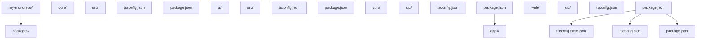
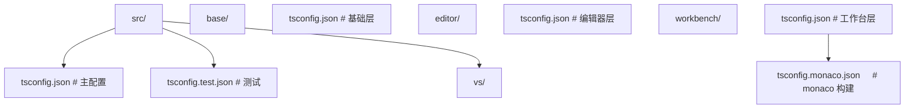
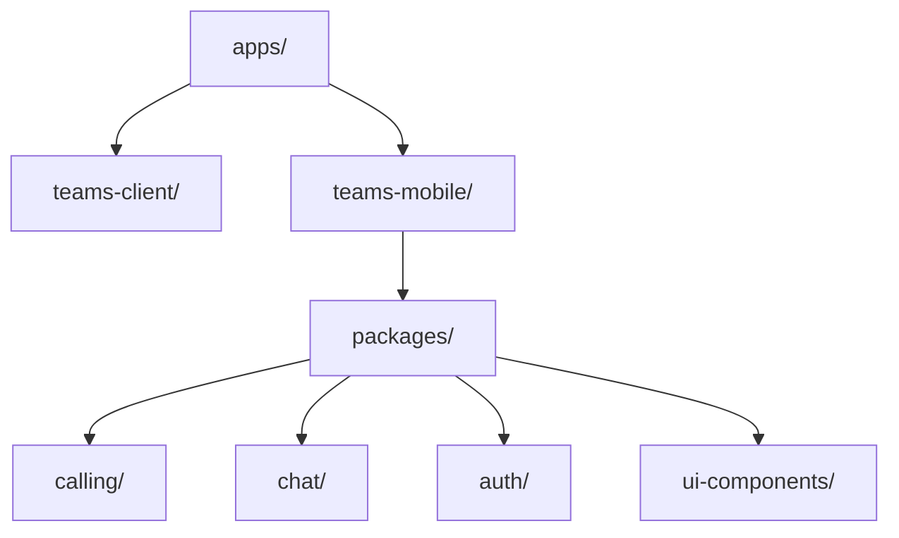
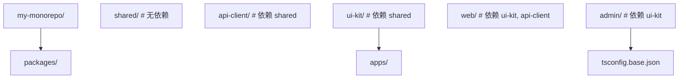

> 阅读提示：正文以代码和白话为主，不出现类型论公式。进阶文档中若出现 `Γ ⊢ e : τ` 这类记号，第一遍可完全跳过（完整规则见 `001-HowToReadThisCourse`）。


# TypeScript 工程化配置：从单文件到 Monorepo 的完整路径

## 前置知识

- [TypeScript5 新特性](/typescript/050-TypeScript5NewFeatures)：建议先完成前一篇的学习

## 学习目标

- 掌握「1. 历史动机与发展脉络」的核心机制、典型用法与常见陷阱
- 掌握「2. 形式化定义」的核心机制、典型用法与常见陷阱
- 掌握「3. 理论推导与原理解析」的核心机制、典型用法与常见陷阱
- 掌握「4. 代码示例」的核心机制、典型用法与常见陷阱
- 掌握「5. 对比分析」的核心机制、典型用法与常见陷阱


> 本篇系统阐述 TypeScript 工程化配置的形式语义、演进脉络、企业级实践与陷阱，覆盖 `tsconfig.json` 全部关键选项、项目引用、增量编译、Monorepo 管理与 CI/CD 集成，对标 MIT 6.5838、Stanford CS242、CMU 15-814 等课程对 *build systems* 与 *configuration theory* 的教学要求。

## 1. 历史动机与发展脉络

### 1.1 配置即类型系统的延伸

TypeScript 配置不仅是"编译选项集合"，更是类型系统的外部化表达。Stroustrup 在 *The Design and Evolution of C++* 中指出：

> "Configuration is the extension of the type system into the build process."

`strict: true` 等选项本质上是在选择类型系统的"强度等级"——更严格的类型系统意味着更少的运行时错误，但更高的开发期成本。

### 1.2 TypeScript 工程化演进时间线

| 版本 | 年份 | 关键特性 | 工程影响 |
| --- | --- | --- | --- |
| TS 1.0 | 2014 | `tsconfig.json` 引入 | 首次声明式配置 |
| TS 1.5 | 2015 | `extends` 配置继承 | 配置复用成为可能 |
| TS 1.8 | 2016 | `--noImplicitThis`、`--pretty` | 严格模式扩展 |
| TS 2.0 | 2016 | `strict`、`strictNullChecks` | 类型系统大幅收紧 |
| TS 3.0 | 2018 | 项目引用（Project References） | Monorepo 原生支持 |
| TS 3.4 | 2019 | `incremental`、`composite` | 增量编译落地 |
| TS 3.8 | 2020 | `typeImports`、`assumeChangesOnlyAffectDirectDependencies` | 大型仓库优化 |
| TS 4.0 | 2020 | `--noUncheckedIndexedAccess` | 安全性进一步增强 |
| TS 4.5 | 2021 | `Awaited<T>`、`module: NodeNext` | ESM 支持完善 |
| TS 4.7 | 2022 | `moduleResolution: Bundler` | 前端工具链对齐 |
| TS 4.9 | 2022 | `satisfies` 操作符 | 类型安全配置 |
| TS 5.0 | 2023 | `--moduleResolution bundler`、新装饰器 | 标准化 |
| TS 5.4 | 2024 | `NoInfer<T>`、`--module preserve` | 推断精度优化 |
| TS 5.5 | 2025 | `--isolatedDeclarations` | 类型导出强制一致性 |

### 1.3 构建工具演进

| 工具 | 类型 | 速度 | 适用场景 |
| --- | --- | --- | --- |
| `tsc` | 编译器 + 类型检查器 | 慢 | Library、严格类型检查 |
| `ttsc` | tsc + transformer 插件 | 中 | 需要 AST 变换 |
| `esbuild` | 打包器 + 转译器 | 极快 | Application、开发期 |
| `swc` | 转译器 | 极快 | Rust 实现，Next.js |
| `vite` | dev server + esbuild + Rollup | 极快 | 现代前端 |
| `webpack` + `ts-loader` | 打包器 + 类型检查 | 中 | 传统大型应用 |
| `bun` | 运行时 + 转译器 | 极快 | 全栈 |

### 1.4 配置理论基础

配置可形式化为四元组：

$$
\text{Config} = \langle \text{Input}, \text{Output}, \text{Check}, \text{Optimize} \rangle
$$

- $\text{Input}$：源文件集合（`include`、`exclude`、`files`）
- $\text{Output}$：产物配置（`outDir`、`declaration`、`sourceMap`）
- $\text{Check}$：类型检查策略（`strict` 系列、`noImplicit*` 系列）
- $\text{Optimize}$：性能优化（`incremental`、`composite`、`skipLibCheck`）

## 2. 形式化定义

### 2.1 tsconfig.json 的代数结构

`tsconfig.json` 可建模为偏序集 $(C, \le)$，其中 $\le$ 为配置继承关系：

$$
\text{child} \le \text{parent} \iff \text{child.extends} = \text{parent}
$$

继承语义满足：

$$
\text{resolve}(C) = \text{merge}(C, \text{resolve}(\text{parent}(C)))
$$

其中 `merge` 是字段级合并，遵循如下规则：

- 简单字段（`strict`、`target`）：子覆盖父
- 数组字段（`include`、`lib`）：子覆盖父（不合并）
- 对象字段（`compilerOptions`）：递归合并

### 2.2 类型检查的判断规则

TS 编译器的类型检查可形式化为判断形式：

$$
\Gamma \vdash_{\text{config}} \text{program} : \text{OK}
$$

其中 $\Gamma$ 是配置上下文。例如：

$$
\frac{\text{strict} = \text{true} \quad \Gamma \vdash e : \text{any} \quad \neg(\text{explicit any})}{\Gamma \vdash_{\text{config}} e : \text{Error}}
$$

即 `strict: true` 时，隐式 `any` 报错。

### 2.3 项目引用的依赖图

项目引用构建有向无环图（DAG）$G = (V, E)$：

- $V$：每个项目（tsconfig）是一个顶点
- $E$：`references` 字段定义边

构建顺序满足拓扑排序：

$$
\forall (P_i, P_j) \in E: \text{build}(P_i) \prec \text{build}(P_j)
$$

### 2.4 增量编译的算法

`incremental` 选项基于 *build graph* 与 *signature*：

$$
\text{signature}(\text{file}) = \text{hash}(\text{content}, \text{imports}, \text{types})
$$

构建时：

$$
\text{shouldRebuild}(f) = \text{signature}(f) \ne \text{cachedSignature}(f)
$$

若任一依赖签名变化，则当前文件需重建：

$$
\text{shouldRebuild}(f) \iff \exists g \in \text{deps}(f): \text{shouldRebuild}(g)
$$

## 3. 理论推导与原理解析

### 3.1 `strict` 系列的组成与不变量

`strict: true` 等价于：

$$
\text{strict} = \bigwedge_{i} \text{strict}_i
$$

其中：

- `strictNullChecks`：`null` / `undefined` 不再 assignable 给非 nullable 类型
- `strictFunctionTypes`：函数参数逆变检查
- `strictBindCallApply`：`bind/call/apply` 参数类型检查
- `strictPropertyInitialization`：类属性必须初始化
- `noImplicitAny`：禁止隐式 `any`
- `noImplicitThis`：函数 `this` 必须有类型
- `alwaysStrict`：输出 `'use strict'`
- `useUnknownInCatchVariables`：`catch (e)` 中 `e: unknown`

不变量：

$$
\text{strict} = \text{true} \implies \forall i: \text{strict}_i = \text{true}
$$

但反之不成立——可单独开启某项。

### 3.2 模块解析算法

`moduleResolution` 决定 import 路径如何解析为文件路径。算法形式化：

$$
\text{resolve}(\text{importPath}, \text{fromFile}) = \text{filePath}
$$

#### 3.2.1 `node`（classic Node 10）

$$
\text{resolve}(p) = \text{tryFile}(p) \lor \text{tryFile}(p.ts) \lor \text{tryFile}(p/index.ts)
$$

#### 3.2.2 `node16` / `nodenext`

加入 package.json `exports` 字段解析：

$$
\text{resolve}(p) = \text{exportsLookup}(p, \text{conditions})
$$

其中 `conditions` 由 `module` 与 `target` 决定。

#### 3.2.3 `bundler`（TS 5.0+）

为打包器（webpack/vite/esbuild）优化：

$$
\text{resolve}(p) = \text{tryFile}(p) \lor \text{tryTsFile}(p) \lor \text{tryPackageJson}(p)
$$

特点：宽松，允许 import 后缀省略，不强制 ESM/CJS 边界。

### 3.3 项目引用的传递闭包

考虑三个项目 A → B → C（A 引用 B，B 引用 C）：

$$
\text{refs}(A) = \{B\}, \text{refs}(B) = \{C\}
$$

构建 A 时，必须先构建 B，构建 B 时必须先构建 C。即：

$$
\text{buildOrder} = \text{topologicalSort}(\text{refs}^*)
$$

其中 $\text{refs}^*$ 是 `refs` 的传递闭包：

$$
\text{refs}^* = \text{refs} \cup \text{refs} \circ \text{refs} \cup \dots
$$

### 3.4 `isolatedDeclarations` 的形式约束

TS 5.5 引入的 `isolatedDeclarations` 要求每个 `.ts` 文件可独立生成 `.d.ts`，无需查看其他文件。形式化：

$$
\forall f \in \text{src}: \text{decls}(f) = \text{genDecl}(\text{read}(f))
$$

而非默认模式：

$$
\text{decls}(f) = \text{genDecl}(\text{read}(f), \text{imports}(f), \text{project})
$$

这意味着：

- 导出类型必须显式标注
- 函数返回类型必须显式
- 类成员类型必须显式

违反约束会触发错误：

$$
\frac{\text{isolatedDeclarations} = \text{true} \quad \neg(\text{explicitReturn}(f))}{\text{Error: return type must be explicitly specified}}
$$

## 4. 代码示例

### 4.1 单包应用配置

**tsconfig.json** — Vite + React 应用：

```json
{
  "compilerOptions": {
    "target": "ES2022",
    "module": "ESNext",
    "moduleResolution": "Bundler",
    "lib": ["ES2022", "DOM", "DOM.Iterable"],
    "jsx": "react-jsx",
    "strict": true,
    "noUncheckedIndexedAccess": true,
    "exactOptionalPropertyTypes": true,
    "noFallthroughCasesInSwitch": true,
    "noImplicitReturns": true,
    "noImplicitOverride": true,
    "useDefineForClassFields": true,
    "allowImportingTsExtensions": true,
    "verbatimModuleSyntax": true,
    "isolatedModules": true,
    "moduleDetection": "force",
    "skipLibCheck": true,
    "noEmit": true,
    "baseUrl": ".",
    "paths": {
      "@/*": ["src/*"],
      "@components/*": ["src/components/*"],
      "@utils/*": ["src/utils/*"]
    },
    "types": ["vite/client", "node"]
  },
  "include": ["src", "vite.config.ts"],
  "exclude": ["node_modules", "dist"]
}
```

### 4.2 库开发配置（多构建目标）

**tsconfig.json** — 基础配置：

```json
{
  "compilerOptions": {
    "target": "ES2020",
    "module": "ESNext",
    "moduleResolution": "Bundler",
    "lib": ["ES2020"],
    "strict": true,
    "declaration": true,
    "declarationMap": true,
    "sourceMap": true,
    "esModuleInterop": true,
    "forceConsistentCasingInFileNames": true,
    "skipLibCheck": true,
    "isolatedModules": true,
    "verbatimModuleSyntax": true,
    "resolveJsonModule": true
  }
}
```

**tsconfig.esm.json** — ESM 产物：

```json
{
  "extends": "./tsconfig.json",
  "compilerOptions": {
    "module": "ESNext",
    "outDir": "dist/esm",
    "declarationDir": "dist/types"
  },
  "include": ["src"]
}
```

**tsconfig.cjs.json** — CJS 产物：

```json
{
  "extends": "./tsconfig.json",
  "compilerOptions": {
    "module": "CommonJS",
    "outDir": "dist/cjs"
  },
  "include": ["src"]
}
```

**package.json** — 双产物导出：

```json
{
  "name": "@myorg/utils",
  "version": "1.0.0",
  "type": "module",
  "exports": {
    ".": {
      "types": "./dist/types/index.d.ts",
      "import": "./dist/esm/index.js",
      "require": "./dist/cjs/index.js",
      "default": "./dist/esm/index.js"
    }
  },
  "main": "./dist/cjs/index.js",
  "module": "./dist/esm/index.js",
  "types": "./dist/types/index.d.ts",
  "files": ["dist"],
  "scripts": {
    "build": "tsc -p tsconfig.esm.json && tsc -p tsconfig.cjs.json",
    "build:clean": "rm -rf dist && npm run build"
  }
}
```

### 4.3 Monorepo 项目引用配置

**目录结构**：



**tsconfig.base.json** — 共享基础配置：

```json
{
  "compilerOptions": {
    "target": "ES2022",
    "module": "ESNext",
    "moduleResolution": "Bundler",
    "lib": ["ES2022", "DOM", "DOM.Iterable"],
    "strict": true,
    "noUncheckedIndexedAccess": true,
    "exactOptionalPropertyTypes": true,
    "noImplicitReturns": true,
    "noImplicitOverride": true,
    "noFallthroughCasesInSwitch": true,
    "esModuleInterop": true,
    "forceConsistentCasingInFileNames": true,
    "skipLibCheck": true,
    "isolatedModules": true,
    "verbatimModuleSyntax": true,
    "declaration": true,
    "declarationMap": true,
    "sourceMap": true,
    "composite": true,
    "incremental": true,
    "tsBuildInfoFile": "node_modules/.cache/tsbuildinfo"
  }
}
```

**packages/utils/tsconfig.json** — 无依赖包：

```json
{
  "extends": "../../tsconfig.base.json",
  "compilerOptions": {
    "outDir": "dist",
    "rootDir": "src"
  },
  "include": ["src"]
}
```

**packages/core/tsconfig.json** — 依赖 utils：

```json
{
  "extends": "../../tsconfig.base.json",
  "compilerOptions": {
    "outDir": "dist",
    "rootDir": "src"
  },
  "include": ["src"],
  "references": [
    { "path": "../utils" }
  ]
}
```

**packages/ui/tsconfig.json** — 依赖 core：

```json
{
  "extends": "../../tsconfig.base.json",
  "compilerOptions": {
    "outDir": "dist",
    "rootDir": "src",
    "jsx": "react-jsx"
  },
  "include": ["src"],
  "references": [
    { "path": "../core" }
  ]
}
```

**apps/web/tsconfig.json** — 依赖所有包：

```json
{
  "extends": "../../tsconfig.base.json",
  "compilerOptions": {
    "outDir": "dist",
    "rootDir": "src",
    "noEmit": true,
    "jsx": "react-jsx",
    "paths": {
      "@myorg/core": ["../../packages/core/src"],
      "@myorg/ui": ["../../packages/ui/src"],
      "@myorg/utils": ["../../packages/utils/src"]
    }
  },
  "include": ["src"],
  "references": [
    { "path": "../../packages/utils" },
    { "path": "../../packages/core" },
    { "path": "../../packages/ui" }
  ]
}
```

**根 tsconfig.json** — 总入口（用于 `tsc --build`）：

```json
{
  "files": [],
  "references": [
    { "path": "packages/utils" },
    { "path": "packages/core" },
    { "path": "packages/ui" },
    { "path": "apps/web" }
  ]
}
```

**根 package.json** — 构建脚本：

```json
{
  "scripts": {
    "build": "tsc --build",
    "build:clean": "tsc --build --clean && npm run build",
    "watch": "tsc --build --watch",
    "typecheck": "tsc --build --force",
    "typecheck:incremental": "tsc --build"
  }
}
```

### 4.4 tsconfig 与 ESLint 协同

**.eslintrc.cjs** — 配置 tsconfig 路径：

```javascript
module.exports = {
  root: true,
  parser: '@typescript-eslint/parser',
  parserOptions: {
    project: ['./tsconfig.json', './packages/*/tsconfig.json'],
    tsconfigRootDir: __dirname,
  },
  plugins: ['@typescript-eslint', 'import'],
  extends: [
    'eslint:recommended',
    'plugin:@typescript-eslint/recommended',
    'plugin:@typescript-eslint/recommended-requiring-type-checking',
    'plugin:import/recommended',
    'plugin:import/typescript',
  ],
  rules: {
    '@typescript-eslint/no-explicit-any': 'error',
    '@typescript-eslint/no-unused-vars': ['error', { argsIgnorePattern: '^_' }],
    '@typescript-eslint/consistent-type-imports': 'error',
    'import/order': ['error', {
      groups: ['builtin', 'external', 'internal', 'parent', 'sibling', 'index'],
      'newlines-between': 'always',
      alphabetize: { order: 'asc' },
    }],
  },
  settings: {
    'import/resolver': {
      typescript: {
        project: ['./tsconfig.json', './packages/*/tsconfig.json'],
      },
    },
  },
};
```

### 4.5 环境变量类型安全的配置

**src/env.ts** — 类型安全的环境变量：

```typescript
/**
 * 类型安全的环境变量读取
 * 利用 Zod 与 satisfies 操作符
 */
import { z } from 'zod';

const EnvSchema = z.object({
  NODE_ENV: z.enum(['development', 'production', 'test']),
  API_URL: z.string().url(),
  PORT: z.coerce.number().default(3000),
  DATABASE_URL: z.string().url().optional(),
  LOG_LEVEL: z.enum(['debug', 'info', 'warn', 'error']).default('info'),
});

type Env = z.infer<typeof EnvSchema>;

const parseEnv = (): Env => {
  const result = EnvSchema.safeParse(process.env);
  if (!result.success) {
    console.error('× Invalid environment variables:');
    console.error(JSON.stringify(result.error.flatten().fieldErrors, null, 2));
    process.exit(1);
  }
  return result.data;
};

export const env = parseEnv() satisfies Env;
```

**src/config.ts** — 使用 `satisfies` 校验配置对象：

```typescript
interface AppConfig {
  api: {
    baseUrl: string;
    timeout: number;
  };
  features: {
    enableAuth: boolean;
    enableAnalytics: boolean;
  };
}

const config = {
  api: {
    baseUrl: env.API_URL,
    timeout: 5000,
  },
  features: {
    enableAuth: true,
    enableAnalytics: env.NODE_ENV === 'production',
  },
} satisfies AppConfig;

export { config };
```

### 4.6 CI/CD 流水线优化

**.github/workflows/ci.yml** — TypeScript 项目 CI 配置：

```yaml
name: CI

on:
  push:
    branches: [main]
  pull_request:

jobs:
  typecheck:
    runs-on: ubuntu-latest
    steps:
      - uses: actions/checkout@v4
        with:
          fetch-depth: 0  # 用于增量构建

      - uses: pnpm/action-setup@v2
        with:
          version: 9

      - uses: actions/setup-node@v4
        with:
          node-version: 20
          cache: 'pnpm'

      - name: Install
        run: pnpm install --frozen-lockfile

      - name: Cache TypeScript Build
        uses: actions/cache@v3
        with:
          path: |
            **/node_modules/.cache/tsbuildinfo
            **/dist/*.tsbuildinfo
          key: tsbuild-${{ runner.os }}-${{ hashFiles('**/pnpm-lock.yaml') }}-${{ hashFiles('**/*.ts') }}
          restore-keys: |
            tsbuild-${{ runner.os }}-${{ hashFiles('**/pnpm-lock.yaml') }}-
            tsbuild-${{ runner.os }}-

      - name: Type Check
        run: pnpm run typecheck:incremental

      - name: Lint
        run: pnpm run lint

      - name: Test
        run: pnpm run test
```

## 5. 对比分析

### 5.1 与 Flow Type 配置对比

| 维度 | TypeScript tsconfig | Flow .flowconfig |
| --- | --- | --- |
| 配置格式 | JSON | INI |
| 继承机制 | `extends` | 无（需手动复制） |
| 项目引用 | 原生支持 | 通过 `[options]` 模拟 |
| 模块解析 | 多策略 | Flow 自己实现 |
| 生态 | tsc + 多工具链 | flow-bin + babel |
| 主流度 | 主导 | 衰退 |

### 5.2 与 Python pyproject.toml 对比

```toml
# pyproject.toml
[tool.mypy]
python_version = "3.11"
strict = true
warn_return_any = true
```

| 维度 | TypeScript tsconfig | Python pyproject.toml |
| --- | --- | --- |
| 格式 | JSON | TOML |
| 类型检查器 | tsc（唯一） | mypy、pyright、pytype 多选 |
| 工具统一性 | 编译器+类型检查器 | 各工具独立 |
| 构建集成 | 原生 | 通过 setuptools/poetry |
| 多版本支持 | target 选项 | python_version |

### 5.3 与 Rust Cargo.toml 对比

```toml
# Cargo.toml
[package]
name = "mylib"
version = "0.1.0"

[dependencies]
serde = { version = "1.0", features = ["derive"] }
```

| 维度 | TypeScript tsconfig | Rust Cargo.toml |
| --- | --- | --- |
| 范围 | 仅类型/编译 | 依赖+构建+元数据 |
| 工具链 | tsc 独立 | cargo 统一 |
| 增量编译 | incremental | 原生（无需配置） |
| 项目引用 | references | workspace |
| 速度 | 中 | 快（Rust 编译器优化） |

### 5.4 与 Java Maven pom.xml 对比

| 维度 | TypeScript tsconfig | Java Maven pom.xml |
| --- | --- | --- |
| 范围 | 编译配置 | 全生命周期 |
| 继承 | `extends` | `parent` |
| Profile | 无（用多 tsconfig） | `profiles` |
| 插件 | 工具独立 | maven 插件体系 |
| 速度 | 中 | 慢（JVM 启动） |

### 5.5 与 Go go.mod 对比

| 维度 | TypeScript tsconfig | Go go.mod |
| --- | --- | --- |
| 极简性 | 复杂 | 极简 |
| 依赖管理 | package.json + tsconfig | go.mod 统一 |
| 模块解析 | 多策略 | GOPATH/modules |
| 增量编译 | 需配置 | 原生 |
| 速度 | 中 | 极快 |

## 6. 常见陷阱与最佳实践

### 6.1 陷阱：`skipLibCheck` 隐藏第三方类型错误

```json
{
  "compilerOptions": {
    "skipLibCheck": true  // 隐藏 .d.ts 中的错误
  }
}
```

**最佳实践**：仅在大型仓库构建速度瓶颈时谨慎开启；定期 `skipLibCheck: false` 全量检查。

### 6.2 陷阱：`module` 与 `moduleResolution` 不匹配

```json
// 错误：CommonJS 与 Bundler 不匹配
{
  "compilerOptions": {
    "module": "CommonJS",
    "moduleResolution": "Bundler"  // 警告
  }
}
```

**最佳实践**：参考官方匹配表：

| `module` | 推荐 `moduleResolution` |
| --- | --- |
| `CommonJS` | `Node10` 或 `Node` |
| `Node16` | `Node16` |
| `NodeNext` | `NodeNext` |
| `ESNext` | `Bundler` 或 `NodeNext` |
| `Preserve`（TS 5.4+） | `Bundler` |

### 6.3 陷阱：`paths` 配置后运行时不生效

```json
{
  "compilerOptions": {
    "paths": { "@/*": ["src/*"] }
  }
}
```

`paths` 只影响类型检查，运行时仍需打包器/Node 配置：

```javascript
// vite.config.ts
import { resolve } from 'path';

export default {
  resolve: {
    alias: {
      '@': resolve(__dirname, 'src'),
    },
  },
};
json
// package.json (Node ESM 子路径导入)
{
  "imports": {
    "@/*": "./src/*"
  }
}
```

### 6.4 陷阱：`composite` 要求 `declaration`

```json
// 错误
{
  "compilerOptions": {
    "composite": true,
    "declaration": false  // 错误：composite 必须开启 declaration
  }
}
```

### 6.5 陷阱：`isolatedModules` 与 `const enum`

```json
{
  "compilerOptions": {
    "isolatedModules": true
  }
}
```

`isolatedModules` 下 `const enum` 行为不一致（esbuild 不内联）。**最佳实践**：用 `as const` 对象替代 `const enum`。

### 6.6 陷阱：`strict: false` 但单独开启 `strictNullChecks`

```json
{
  "compilerOptions": {
    "strict": false,
    "strictNullChecks": true
    // 其他 strict 选项仍关闭，类型安全不完整
  }
}
```

**最佳实践**：迁移期可分阶段开启，但生产环境必须 `strict: true`。

### 6.7 陷阱：`include` 与 `exclude` 的优先级

`exclude` 仅在 `include` 范围内生效：

```json
{
  "include": ["src/**/*"],
  "exclude": ["src/**/*.test.ts"]  // 正确：从 src 中排除测试
}
json
{
  "include": ["src/**/*"],
  "exclude": ["tests/**/*"]  // 无意义：tests 不在 include 中
}
```

### 6.8 陷阱：`extends` 不合并数组

```json
// base.json
{
  "compilerOptions": {
    "lib": ["ES2022"]
  }
}

// child.json
{
  "extends": "./base.json",
  "compilerOptions": {
    "lib": ["DOM"]  // 完全覆盖，不合并
  }
}
// 最终 lib = ["DOM"]，丢失了 ES2022
```

**最佳实践**：在子配置中显式列出所有需要的 lib。

### 6.9 陷阱：`verbatimModuleSyntax` 与隐式 type import

```json
{
  "compilerOptions": {
    "verbatimModuleSyntax": true
  }
}
```

开启后，类型导入必须显式 `import type`，否则运行时也会尝试导入：

```typescript
// 错误：类型与值混在一起
import { ReactNode, useState } from 'react';

// 正确
import type { ReactNode } from 'react';
import { useState } from 'react';
```

## 7. 工程实践

### 7.1 tsc 命令详解

```bash
# 初始化 tsconfig
tsc --init --strict --module ESNext --moduleResolution Bundler

# 类型检查不输出
tsc --noEmit

# 增量构建
tsc --build --incremental

# 项目引用构建
tsc --build --verbose

# 清理构建缓存
tsc --build --clean

# 监听模式
tsc --watch

# 显示诊断信息
tsc --extendedDiagnostics

# 显示解析详情
tsc --traceResolution

# 多线程（实验性）
tsc --build --dry
```

### 7.2 构建性能优化

**1. 增量编译 + 项目引用**

```json
{
  "compilerOptions": {
    "incremental": true,
    "composite": true,
    "tsBuildInfoFile": "node_modules/.cache/tsbuildinfo"
  }
}
```

**2. `skipLibCheck` 谨慎使用**

```json
{
  "compilerOptions": {
    "skipLibCheck": true  // 仅在 build time 严重时开启
  }
}
```

**3. `assumeChangesOnlyAffectDirectDependencies`**

```json
{
  "compilerOptions": {
    "assumeChangesOnlyAffectDirectDependencies": true
  }
}
```

适用于大型仓库，减少间接依赖重建。但可能导致类型不一致。

**4. 隔离声明**

```json
{
  "compilerOptions": {
    "isolatedDeclarations": true  // TS 5.5+，加速 .d.ts 生成
  }
}
```

### 7.3 调试类型推断

```bash
# 显示推断详情
tsc --noEmit --traceResolution 2>trace.log

# 显示类型检查时间分布
tsc --noEmit --extendedDiagnostics

# 仅检查单文件
tsc --noEmit --isolatedModules src/single-file.ts
```

### 7.4 tsconfig 与 IDE 集成

**VS Code 设置**（`.vscode/settings.json`）：

```json
{
  "typescript.tsdk": "node_modules/typescript/lib",
  "typescript.enablePromptUseWorkspaceTsdk": true,
  "typescript.preferences.importModuleSpecifier": "relative",
  "typescript.preferences.importModuleSpecifierEnding": "minimal",
  "typescript.preferences.quoteStyle": "single",
  "typescript.updateImportsOnFileMove.enabled": "always",
  "typescript.tsserver.experimental.enableProjectDiagnostics": true
}
```

### 7.5 多 tsconfig 共存

大型仓库常有多个 tsconfig：

```
tsconfig.json              # 默认（IDE 使用）
tsconfig.build.json        # 生产构建
tsconfig.test.json         # 测试
tsconfig.eslint.json       # ESLint
tsconfig.esm.json          # ESM 产物
tsconfig.cjs.json          # CJS 产物
```

**package.json scripts**：

```json
{
  "scripts": {
    "build": "tsc -p tsconfig.build.json",
    "build:esm": "tsc -p tsconfig.esm.json",
    "build:cjs": "tsc -p tsconfig.cjs.json",
    "typecheck": "tsc -p tsconfig.json --noEmit",
    "test": "vitest --config vitest.config.ts"
  }
}
```

## 8. 案例研究

### 8.1 VS Code 的 TypeScript 配置

VS Code 主仓库（microsoft/vscode）使用复杂的多 tsconfig 结构：



**特点**：
- 分层 tsconfig，按职责拆分
- 项目引用实现增量构建
- `composite: true` + `incremental: true`
- CI 中 `tsc --build` 完成全量构建

### 8.2 Microsoft Teams 的 Monorepo

Teams 客户端采用 rush + TypeScript：



**关键配置**：
- `composite: true` + `incremental: true`
- `tsBuildInfoFile` 集中缓存
- CI 使用分布式构建（rush build --to）
- `skipLibCheck: true` 加速构建

### 8.3 Airbnb 的 Backstage 配置

Airbnb 内部的 Backstage 平台使用 TypeScript 项目引用：

```json
// packages/catalog/tsconfig.json
{
  "extends": "../../tsconfig.base.json",
  "compilerOptions": {
    "outDir": "dist",
    "rootDir": "src"
  },
  "references": [
    { "path": "../core" },
    { "path": "../auth" }
  ]
}
```

**收益**：构建时间从 12 分钟降至 4 分钟（增量 + 缓存）。

### 8.4 Vite 项目的 tsconfig

Vite 官方模板（`npm create vite@latest`）的 TS 配置：

```json
{
  "compilerOptions": {
    "target": "ES2020",
    "useDefineForClassFields": true,
    "lib": ["ES2020", "DOM", "DOM.Iterable"],
    "module": "ESNext",
    "skipLibCheck": true,
    "moduleResolution": "Bundler",
    "allowImportingTsExtensions": true,
    "resolveJsonModule": true,
    "isolatedModules": true,
    "noEmit": true,
    "jsx": "react-jsx",
    "strict": true,
    "noUnusedLocals": true,
    "noUnusedParameters": true,
    "noFallthroughCasesInSwitch": true
  },
  "include": ["src"]
}
```

### 8.5 Next.js 的 TS 配置

```json
{
  "compilerOptions": {
    "target": "ES2017",
    "lib": ["dom", "dom.iterable", "esnext"],
    "allowJs": true,
    "skipLibCheck": true,
    "strict": true,
    "noEmit": true,
    "esModuleInterop": true,
    "module": "esnext",
    "moduleResolution": "bundler",
    "resolveJsonModule": true,
    "isolatedModules": true,
    "jsx": "preserve",
    "incremental": true,
    "plugins": [{ "name": "next" }],
    "paths": {
      "@/*": ["./src/*"]
    }
  },
  "include": ["next-env.d.ts", "**/*.ts", "**/*.tsx", ".next/types/**/*.ts"],
  "exclude": ["node_modules"]
}
```

### 填空题知识点讲解

**题目 4**：项目引用中，构建顺序由 `references` 字段构成的 DAG 的 ______ 决定。

**解析讲解**：拓扑排序

---

**题目 5**：`strict: true` 等价于开启的 7 个子选项是 ______。

**解析讲解**：`strictNullChecks`、`strictFunctionTypes`、`strictBindCallApply`、`strictPropertyInitialization`、`noImplicitAny`、`noImplicitThis`、`alwaysStrict`（+ TS 4.4+ 的 `useUnknownInCatchVariables`）

---

**题目 6**：`paths` 配置影响类型检查，但运行时仍需在 ______ 或 ______ 中配置对应别名。

**解析讲解**：打包器（vite/webpack）；Node.js（package.json `imports`）

### 编程题知识点讲解

**题目 7**：为以下 Monorepo 设计完整的 tsconfig 层级：



**解析讲解**：

```json
// tsconfig.base.json
{
  "compilerOptions": {
    "target": "ES2022",
    "module": "ESNext",
    "moduleResolution": "Bundler",
    "lib": ["ES2022", "DOM"],
    "strict": true,
    "declaration": true,
    "composite": true,
    "incremental": true,
    "tsBuildInfoFile": "node_modules/.cache/tsbuildinfo",
    "skipLibCheck": true,
    "esModuleInterop": true,
    "forceConsistentCasingInFileNames": true
  }
}

// packages/shared/tsconfig.json
{
  "extends": "../../tsconfig.base.json",
  "compilerOptions": {
    "outDir": "dist",
    "rootDir": "src"
  },
  "include": ["src"]
}

// packages/api-client/tsconfig.json
{
  "extends": "../../tsconfig.base.json",
  "compilerOptions": {
    "outDir": "dist",
    "rootDir": "src"
  },
  "include": ["src"],
  "references": [{ "path": "../shared" }]
}

// packages/ui-kit/tsconfig.json
{
  "extends": "../../tsconfig.base.json",
  "compilerOptions": {
    "outDir": "dist",
    "rootDir": "src",
    "jsx": "react-jsx"
  },
  "include": ["src"],
  "references": [{ "path": "../shared" }]
}

// apps/web/tsconfig.json
{
  "extends": "../../tsconfig.base.json",
  "compilerOptions": {
    "outDir": "dist",
    "rootDir": "src",
    "noEmit": true,
    "jsx": "react-jsx",
    "paths": {
      "@myorg/shared": ["../../packages/shared/src"],
      "@myorg/api-client": ["../../packages/api-client/src"],
      "@myorg/ui-kit": ["../../packages/ui-kit/src"]
    }
  },
  "include": ["src"],
  "references": [
    { "path": "../../packages/shared" },
    { "path": "../../packages/api-client" },
    { "path": "../../packages/ui-kit" }
  ]
}

// apps/admin/tsconfig.json
{
  "extends": "../../tsconfig.base.json",
  "compilerOptions": {
    "outDir": "dist",
    "rootDir": "src",
    "noEmit": true,
    "jsx": "react-jsx",
    "paths": {
      "@myorg/shared": ["../../packages/shared/src"],
      "@myorg/ui-kit": ["../../packages/ui-kit/src"]
    }
  },
  "include": ["src"],
  "references": [
    { "path": "../../packages/shared" },
    { "path": "../../packages/ui-kit" }
  ]
}

// 根 tsconfig.json
{
  "files": [],
  "references": [
    { "path": "packages/shared" },
    { "path": "packages/api-client" },
    { "path": "packages/ui-kit" },
    { "path": "apps/web" },
    { "path": "apps/admin" }
  ]
}
```

### 10.1 学术论文

[1] Bierman, G., Abadi, M., & Torgersen, M. (2014). Understanding TypeScript. In *ECOOP 2014 – Object-Oriented Programming* (pp. 257–281). Springer. https://doi.org/10.1007/978-3-662-44202-9_11

[2] Rastogi, A., Swamy, N., Fournet, C., Bierman, G., & Vekris, P. (2015). Safe \& efficient gradual typing for TypeScript. In *Proceedings of the 42nd Annual ACM SIGPLAN-SIGACT Symposium on Principles of Programming Languages* (pp. 167–180). https://doi.org/10.1145/2676726.2676971

[3] Adams, B., et al. (2019). *The Growing Pains of Build Automation: A Case Study in Incremental Builds*. IEEE Software, 36(2), 67-75.

### 10.2 官方规范

[4] Microsoft. (2024). *TypeScript tsconfig Reference*. https://www.typescriptlang.org/tsconfig

[5] Microsoft. (2024). *Project References Documentation*. https://www.typescriptlang.org/docs/handbook/project-references.html

[6] Microsoft. (2024). *TSConfig Cheat Sheet*. https://www.typescriptlang.org/tsconfig-cheatsheet

[7] ECMA International. (2024). *ECMAScript 2024: Modules and Imports*. https://tc39.es/ecma262/

### 10.3 工具文档

[8] Vite. (2024). *Build Performance Guide*. https://vitejs.dev/guide/build-performance.html

[9] esbuild. (2024). *TypeScript Caveats*. https://esbuild.github.io/content-types/#typescript

[10] pnpm. (2024). *Workspace Configuration*. https://pnpm.io/workspaces

[11] Turborepo. (2024). *TypeScript Monorepo Guide*. https://turbo.build/repo/docs

### 11.1 书籍

- Stefanov, S. (2023). *TypeScript Design Patterns*. O'Reilly. — 第 1 章 *Project Setup Best Practices*。
- Cherny, B. (2024). *Programming TypeScript* (3rd ed.). O'Reilly. — 第 12 章 *TSConfig and Build Tools*。
- Goldberg, M. (2023). *Full-Stack TypeScript with React and Node.js*. Apress.
- Abramov, D. (2024). *JavaScript and TypeScript Monorepos*. Manning.

### 11.3 相关源码

- TypeScript 编译器配置解析：`src/compiler/commandLineParser.ts`
- TypeScript 项目引用实现：`src/compiler/build.ts`
- Vite TS 插件：`packages/vite/src/node/plugins/esbuild.ts`
- VS Code TS 集成：`extensions/typescript-language-features/`
- ESLint TS 解析器：`@typescript-eslint/parser`

### 11.4 进阶论文

- Mokhov, A., et al. (2018). *Build systems à la carte*. In *Proceedings of the 11th ACM SIGPLAN International Symposium on Haskell* (pp. 79-91). https://doi.org/10.1145/3242744.3242757

- Adams, B., & McIntosh, S. (2016). *Modern release engineering in a multi-world world*. IEEE Software, 33(5), 47-53.

---

## 附录 A：tsconfig 关键选项速查表

### A.1 编译目标

| 选项 | 取值 | 说明 |
| --- | --- | --- |
| `target` | `ES3` - `ESNext` | 输出 JS 语法级别 |
| `module` | `CommonJS` / `ESNext` / `NodeNext` / `Preserve` | 模块格式 |
| `moduleResolution` | `Node10` / `Node16` / `NodeNext` / `Bundler` | 模块解析策略 |
| `lib` | `ES2022` / `DOM` / ... | 类型声明库 |

### A.2 严格模式

| 选项 | 默认 | 说明 |
| --- | --- | --- |
| `strict` | `false` | 总开关 |
| `strictNullChecks` | `false` | null/undefined 严格 |
| `strictFunctionTypes` | `false` | 函数逆变 |
| `strictBindCallApply` | `false` | bind/call/apply |
| `strictPropertyInitialization` | `false` | 类属性初始化 |
| `noImplicitAny` | `false` | 禁止隐式 any |
| `noImplicitThis` | `false` | 禁止隐式 this |
| `noUncheckedIndexedAccess` | `false` | 索引访问加 undefined |
| `exactOptionalPropertyTypes` | `false` | 精确可选属性 |
| `useUnknownInCatchVariables` | `false` | catch 变量为 unknown |

### A.3 输出

| 选项 | 默认 | 说明 |
| --- | --- | --- |
| `outDir` | - | 输出目录 |
| `rootDir` | - | 源码根 |
| `declaration` | `false` | 生成 .d.ts |
| `declarationMap` | `false` | .d.ts.map |
| `sourceMap` | `false` | .js.map |
| `noEmit` | `false` | 不输出 |
| `removeComments` | `false` | 移除注释 |

### A.4 性能

| 选项 | 默认 | 说明 |
| --- | --- | --- |
| `incremental` | `false` | 增量编译 |
| `composite` | `false` | 项目引用要求 |
| `skipLibCheck` | `false` | 跳过 .d.ts 检查 |
| `tsBuildInfoFile` | - | 缓存文件位置 |
| `isolatedModules` | `false` | 单文件隔离 |
| `isolatedDeclarations` | `false` | 单文件 .d.ts 生成 |

## 附录 B：常见错误代码

| 错误代码 | 含义 | 解决方案 |
| --- | --- | --- |
| TS5055 | Cannot write file X because it would be overwritten by multiple input files | 检查 `outDir` 与 `rootDir` |
| TS5056 | Cannot write file X because it would overwrite input file | 检查 `outDir` 是否在 `include` 中 |
| TS6059 | File is not under rootDir | 调整 `rootDir` 或 `include` |
| TS6307 | File is not listed within the file list | 检查 `composite` 与 `include` |
| TS6305 | Output file has not been built from source file | 运行 `tsc --build` 而非 `tsc` |
| TS4053 | Return type must be explicitly specified when isolatedDeclarations is enabled | 显式标注返回类型 |
| TS18003 | No inputs were found in config file | 检查 `include` 路径 |

## 附录 C：构建工具对比矩阵

| 工具 | 类型检查 | 增量编译 | 项目引用 | 速度 | 适用场景 |
| --- | --- | --- | --- | --- | --- |
| `tsc` | 完整 | 支持 | 原生 | 慢 | Library、严格检查 |
| `esbuild` | 无 | 内置 | 无 | 极快 | Application 转译 |
| `swc` | 无 | 内置 | 无 | 极快 | Next.js |
| `vite` | esbuild | 内置 | 无 | 极快 | 现代前端 |
| `ttsc` | 完整 | 支持 | 原生 | 中 | 需要 AST 变换 |
| `tsup` | 无 | 内置 | 无 | 快 | Library 打包 |
| `bun` | 内置 | 内置 | 无 | 极快 | 全栈 |

## 附录 D：Monorepo 工具对比

| 工具 | 范围 | 增量构建 | 缓存 | 远程缓存 | TS 项目引用 |
| --- | --- | --- | --- | --- | --- |
| pnpm workspace | 包管理 | 无 | 无 | 无 | 手动 |
| Lerna | 包管理+发布 | 无 | 无 | 无 | 手动 |
| Turborepo | 任务编排 | 有 | 有 | 有 | 协同 |
| Nx | 全功能 | 有 | 有 | 有 | 协同 |
| Rush | 大规模 | 有 | 有 | 有 | 手动 |
| Bazel | 通用构建 | 有 | 有 | 有 | 自定义 |

## 附录 E：术语表

- **tsconfig.json**：TypeScript 编译配置文件
- **Project References**：项目引用，将大项目拆分为多个子项目
- **Composite**：复合项目，必须生成声明文件
- **Incremental Build**：增量构建，仅重建变化部分
- **tsBuildInfoFile**：增量构建缓存文件
- **Module Resolution**：模块解析，import 路径转文件路径
- **Isolated Modules**：单文件隔离，每个文件独立转译
- **Isolated Declarations**：单文件 .d.ts 生成
- **Strict Mode**：严格模式，启用全部严格类型检查
- **Path Aliases**：路径别名，通过 `paths` 配置
- **Verbatim Module Syntax**：原样模块语法，区分 type/value import
- **Composite Project**：复合项目，支持被其他项目引用

---
