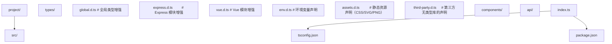

> 阅读提示：正文以代码和白话为主，不出现类型论公式。进阶文档中若出现 `Γ ⊢ e : τ` 这类记号，第一遍可完全跳过（完整规则见 `001-HowToReadThisCourse`）。


# 模块声明与全局类型增强

## 前置知识

- [类型体操](/typescript/058-TypeGymnastics)：建议先完成前一篇的学习

## 学习目标

- 掌握「1. 历史动机与演化」的核心机制、典型用法与常见陷阱
- 掌握「2. 形式化定义」的核心机制、典型用法与常见陷阱
- 掌握「3. 理论推导与证明」的核心机制、典型用法与常见陷阱
- 掌握「4. 代码示例」的核心机制、典型用法与常见陷阱
- 掌握「5. 对比分析」的核心机制、典型用法与常见陷阱


> 本文档对标 MIT 6.S192 与 Stanford CS142 课程标准，系统讲解 TypeScript 模块声明（Module Declaration）、声明合并（Declaration Merging）与全局类型增强（Global Augmentation）的形式语义、工程实践与生产级模式。文档面向零基础自学读者，从 JavaScript 模块系统的演化出发，逐步推导 `declare module`、`declare global`、三斜线指令与 `@types` 生态的设计动机，最终落地为可复用的工程模板。

---

## 1. 历史动机与演化

### 1.1 JavaScript 的"无类型"困境（1995-2010）

JavaScript 自 1995 年诞生起的十五年里，始终是一门"无类型"语言。这意味着：

1. **运行时才发现错误**：调用 `undefined.foo()` 在编辑器中无任何提示，只有用户点击按钮触发后才会抛出 `TypeError`。
2. **重构如同盲飞**：将 `user.name` 重命名为 `user.fullName` 时，IDE 无法确定哪些引用需要更新，开发者只能全局搜索字符串。
3. **第三方库文档即类型**：使用 jQuery 时，开发者必须翻阅 API 文档，无法获得自动补全与参数校验。

```javascript
// JavaScript 时代的典型痛点
function fetchUser(id) {
  return $.getJSON('/api/users/' + id); // 返回值类型？参数类型？错误处理？
}

const user = fetchUser(123);
console.log(user.nmae); // 拼写错误，运行时才是 undefined
```

### 1.2 TypeScript 1.0 的环境声明雏形（2014）

TypeScript 1.0（2014 年发布）引入了"环境声明"（Ambient Declaration）的概念，其核心思想是：**为已存在的 JavaScript 代码提供类型描述，而不需要重写这些代码**。这是 `.d.ts` 文件的诞生背景。

```typescript
// 早期 TypeScript 1.0 风格的环境声明
declare var jQuery: (selector: string) => any;
declare function alert(message: string): void;
```

这一设计的关键决策是**关注点分离**：

- **实现层**（`.js`）：浏览器或 Node.js 已有的代码，无需修改。
- **类型层**（`.d.ts`）：TypeScript 编译器消费的契约文件，描述实现的形状。

形式化地，这一关系可以表达为：

$$
\text{Program} = \text{Implementation} \oplus \text{Declaration}
$$

其中 $\oplus$ 表示"类型层面的叠加"，编译器仅消费 $\text{Declaration}$ 部分。

### 1.3 DefinitelyTyped 与 `@types` 生态（2015-2017）

2015 年，社区发起 **DefinitelyTyped** 项目（https://github.com/DefinitelyTyped/DefinitelyTyped ），目标是集中维护数千个 JavaScript 库的类型声明。2016 年 TypeScript 2.0 引入 `@types` 机制，使类型声明可以通过 npm 安装：

```bash
npm install --save-dev @types/lodash @types/node @types/express
```

这一机制的背后是 `typeRoots` 与 `types` 两个 tsconfig 选项的协同工作（详见第 8 节）。

### 1.4 模块增强能力的引入（TypeScript 2.1, 2016）

TypeScript 2.1 引入**模块增强**（Module Augmentation）能力，允许开发者在自己的文件中扩展已存在模块的类型：

```typescript
// express.d.ts — 扩展 Express 的 Request 接口
declare module 'express' {
  interface Request {
    user?: { id: string; role: 'admin' | 'user' };
  }
}
```

这一能力的出现解决了"框架核心类型不可变，但需要业务层扩展"的矛盾，成为 Express 中间件、Vue 插件、React 高阶组件等模式的基础。

### 1.5 全局增强与 `declare global`（TypeScript 2.1, 2016）

与模块增强同步引入的是 `declare global` 语法。在 ES Module 普及之前，TypeScript 使用 `declare var` / `declare function` 直接污染全局命名空间；ES Module 时代，文件被视为模块（顶层有 `import` 或 `export`），全局污染被禁止，必须显式使用 `declare global` 块：

```typescript
// global.d.ts
declare global {
  interface Window {
    __APP_CONFIG__?: { apiBaseUrl: string; version: string };
  }
}

export {}; // 关键：使文件成为模块，触发 declare global 块生效
```

### 1.6 现代 TypeScript 的声明生态（2020-至今）

随着 TypeScript 5.x 的发布，声明文件生态呈现以下趋势：

1. **`.d.ts` 与 `.d.mts` / `.d.cts` 并存**：ESM 与 CJS 双格式输出需要对应的声明文件后缀。
2. **`moduleResolution: "bundler"` 与 `"node16"`**：新的解析策略更精确地反映现代打包器与 Node.js 的行为。
3. **`verbatimModuleSyntax`**：强制 `import type` 与 `export type`，避免编译器自动剥离类型导入。
4. **类型插件市场**：Fastify、tRPC、Zod 等框架提供"类型插件"机制，通过 `declare module` 实现类型层面的依赖注入。

---

## 2. 形式化定义

### 2.1 声明文件的语法范畴

TypeScript 声明文件 `.d.ts` 的语法可形式化为以下文法（简化版 BNF）：

$$
\begin{aligned}
\text{DeclarationFile} &\to \text{AmbientStatement}^* \\
\text{AmbientStatement} &\to \text{DeclareVar} \mid \text{DeclareFunction} \mid \text{DeclareClass} \\
&\mid \text{DeclareModule} \mid \text{DeclareGlobal} \mid \text{DeclareNamespace} \\
&\mid \text{ImportExport} \mid \text{TripleSlashDirective} \\
\text{DeclareModule} &\to \texttt{declare module} \ \text{StringLiteral} \ \{ \text{ModuleBody} \} \\
\text{DeclareGlobal} &\to \texttt{declare global} \ \{ \text{GlobalBody} \} \\
\text{TripleSlashDirective} &\to \texttt{///} \ \texttt{<reference} \ (\texttt{path} \mid \texttt{types} \mid \texttt{lib}) \ \texttt{=} \ \text{StringLiteral} \ \texttt{/>}
\end{aligned}
$$

### 2.2 模块增强的形式语义

设 $M$ 为一个已存在的模块，其类型为 $\tau_M$。模块增强通过 `declare module 'M'` 引入一个增量 $\Delta$，编译器将增强后的类型记为：

$$
\tau_M' = \tau_M \sqcup \Delta
$$

其中 $\sqcup$ 表示**声明合并算子**（Declaration Merge Operator），其语义为：

- 对于接口（Interface）：取成员的并集，后声明者覆盖同名成员。
- 对于命名空间（Namespace）：取内部变量的并集，同名字面量合并。
- 对于函数（Function）：形成函数重载（Overload）序列。
- 对于枚举（Enum）：取枚举成员的并集。

### 2.3 全局增强的作用域规则

设 $\Gamma$ 为全局类型环境（Global Type Environment）。`declare global` 块将声明注入 $\Gamma$：

$$
\frac{\text{file } f \text{ is a module}}{\Gamma' = \Gamma \cup \text{decls}(\text{declare global block in } f)}
$$

注意前提条件"file $f$ is a module"——这是 `export {}` 必须存在的原因。若文件不是模块，`declare global` 块会触发编译错误：

```
Global augmentation can only be directly nested in an external module.
```

### 2.4 三斜线指令的依赖图

TypeScript 编译器维护一个依赖图 $G = (V, E)$，其中 $V$ 是所有 `.d.ts` 文件，$E$ 由三斜线指令决定：

$$
E = \{ (f_1, f_2) \mid f_1 \text{ contains } \texttt{/// <reference path="f_2" />} \}
$$

编译器按拓扑顺序处理 $G$，确保被引用文件的类型在引用文件之前被加载。这一机制是 `@types` 包内部依赖管理的基础。

---

## 3. 理论推导与证明

### 3.1 声明合并的合流性（Confluence）

**命题 4.1**：声明合并算子 $\sqcup$ 在接口合并场景下满足合流性，即无论合并顺序如何，最终结果相同。

**证明**：设接口 $I_1, I_2, I_3$ 分别声明成员集合 $S_1, S_2, S_3$。接口合并的语义为成员并集，且同名成员取最后一个声明：

- $(I_1 \sqcup I_2) \sqcup I_3$：先合并 $S_1 \cup S_2$（同名取 $S_2$），再合并 $(S_1 \cup S_2) \cup S_3$（同名取 $S_3$）。
- $I_1 \sqcup (I_2 \sqcup I_3)$：先合并 $S_2 \cup S_3$（同名取 $S_3$），再合并 $S_1 \cup (S_2 \cup S_3)$（同名取后者）。

两种顺序下，对于任意成员 $m$：
- 若 $m$ 仅在一个 $S_i$ 中出现，结果相同。
- 若 $m$ 在多个 $S_i$ 中出现，结果都取最后声明的版本（按 $I_1, I_2, I_3$ 的固定文件顺序）。

因此 $\sqcup$ 满足合流性。$\blacksquare$

**工程含义**：开发者可以按任意顺序编写多个 `declare module` 增强块，最终类型一致。但**同名成员的覆盖顺序由文件加载顺序决定**，这在 monorepo 中可能因 `tsconfig` 的 `include` 顺序而产生不可预期的行为（详见第 7 节陷阱）。

### 3.2 模块增强的可加性

**命题 4.2**：模块增强是可加的（Additive），即增强只能添加成员，不能删除或修改已有成员的类型。

**证明**：设模块 $M$ 的原始接口 $I$ 有成员 $m: T_1$。若增强声明 $m: T_2$，则合并后 $m$ 的类型为 $T_1 \sqcup T_2$（接口合并取后者），但 $T_2$ 必须**兼容** $T_1$，否则编译器报错。

形式化地，模块增强算子 $\Delta$ 满足：

$$
\text{Compatible}(\Delta, \tau_M) \iff \forall m \in \text{dom}(\Delta): \Delta(m) <: \tau_M(m)
$$

其中 $<:$ 是子类型关系。$\blacksquare$

**工程含义**：不能用模块增强把 `string` 改成 `number`，但可以把 `string` 收窄为 `'admin' | 'user'`。

### 3.3 全局增强的命名冲突不可判定性

**命题 4.3**：在多包依赖的场景下，全局增强的命名冲突在编译时是不可判定的（Undecidable）。

**证明草图**：考虑两个 npm 包 $P_1, P_2$ 都通过 `declare global` 添加 `Window.prototype.foo`，但类型不同。当 $P_1, P_2$ 同时被项目依赖时，类型环境 $\Gamma$ 中存在两个 `foo` 声明。TypeScript 编译器按文件加载顺序合并，最终类型取决于：

1. `node_modules` 的安装顺序（由 npm 决定，非确定性）。
2. `tsconfig.json` 的 `include` 模式匹配顺序。
3. `@types` 包的字母序。

由于这三者都可能在不同机器或不同时间产生不同结果，全局冲突的最终类型不可预测。$\blacksquare$

**工程含义**：**永远不要在库（library）中使用 `declare global`**。库应通过模块增强或显式注入的方式扩展类型，让宿主项目决定是否启用全局增强。

---

## 4. 代码示例

### 4.1 声明文件基础

#### 4.1.1 最简单的环境变量声明

```typescript
// env.d.ts — 描述编译时注入的全局常量
declare const __DEV__: boolean;
declare const __APP_VERSION__: string;
declare const __API_BASE_URL__: string;

// 使用
if (__DEV__) {
  console.log(`Running in dev mode, version: ${__APP_VERSION__}`);
}
```

#### 4.1.2 函数与类声明

```typescript
// legacy-lib.d.ts — 为 JavaScript 库编写声明
declare function formatDate(date: Date, format: string): string;
declare function parseDate(input: string, format?: string): Date | null;

declare class EventEmitter<TEvents extends Record<string, any[]> = Record<string, any[]>> {
  on<K extends keyof TEvents>(event: K, listener: (...args: TEvents[K]) => void): this;
  off<K extends keyof TEvents>(event: K, listener: (...args: TEvents[K]) => void): this;
  emit<K extends keyof TEvents>(event: K, ...args: TEvents[K]): boolean;
  once<K extends keyof TEvents>(event: K, listener: (...args: TEvents[K]) => void): this;
}

// 使用
const emitter = new EventEmitter<{
  click: [x: number, y: number];
  change: [value: string];
}>();

emitter.on('click', (x, y) => console.log(x, y));
```

#### 4.1.3 命名空间声明

```typescript
// jquery.d.ts — 模拟早期 jQuery 的命名空间风格
declare namespace $ {
  function ajax(settings: {
    url: string;
    method?: 'GET' | 'POST';
    data?: Record<string, unknown>;
    success?: (data: unknown) => void;
    error?: (xhr: XMLHttpRequest, status: number) => void;
  }): XMLHttpRequest;

  function get(url: string, success: (data: unknown) => void): XMLHttpRequest;

  interface AjaxSettings {
    url: string;
    method: string;
    headers: Record<string, string>;
  }
}

// 使用
$.ajax({ url: '/api/users', method: 'GET' });
const settings: $.AjaxSettings = { url: '/', method: 'GET', headers: {} };
```

### 4.2 `declare module` 详解

#### 4.2.1 为无类型模块添加类型

```typescript
// types/legacy-lib.d.ts
declare module 'legacy-lib' {
  export interface ClientOptions {
    baseUrl: string;
    timeout?: number;
    headers?: Record<string, string>;
  }

  export class Client {
    constructor(options: ClientOptions);
    request<T = unknown>(path: string, init?: RequestInit): Promise<T>;
    close(): void;
  }

  export function init(config: { apiKey: string }): void;
  export function getData(id: string): Promise<{ name: string; value: number }>;

  const version: string;
  export default version;
}
```

#### 4.2.2 模块增强：扩展 Express

```typescript
// types/express.d.ts
import 'express';

declare module 'express' {
  interface Request {
    user?: {
      id: string;
      email: string;
      role: 'admin' | 'editor' | 'viewer';
    };
    requestId: string;  // 由中间件注入的请求追踪 ID
    startTime: number;  // 请求开始时间戳，用于性能监控
  }

  interface Response {
    /**
     * 统一的成功响应格式
     */
    success<T>(data: T, message?: string): void;
    /**
     * 统一的失败响应格式
     */
    fail(code: string, message: string, status?: number): void;
  }
}
typescript
// 使用扩展后的 Express
import express from 'express';
const app = express();

app.use((req, res, next) => {
  req.requestId = crypto.randomUUID();
  req.startTime = Date.now();
  next();
});

app.get('/me', (req, res) => {
  if (!req.user) {
    return res.fail('UNAUTHORIZED', '请先登录', 401);
  }
  res.success({ user: req.user });
});
```

#### 4.2.3 模块增强：扩展 Vue 3

```typescript
// types/vue.d.ts
import 'vue';

declare module 'vue' {
  interface ComponentCustomProperties {
    $api: typeof import('@/api').default;
    $format: typeof import('@/utils/format');
    $t: (key: string, params?: Record<string, unknown>) => string;
  }

  interface ComponentCustomOptions {
    trackName?: string;
  }

  interface GlobalDirectives {
    vPermission: (el: HTMLElement, binding: { value: string[] }) => void;
  }
}
typescript
// main.ts
import { createApp } from 'vue';
import App from './App.vue';
import api from '@/api';
import * as format from '@/utils/format';
import { i18n } from '@/i18n';

const app = createApp(App);
app.config.globalProperties.$api = api;
app.config.globalProperties.$format = format;
app.config.globalProperties.$t = i18n.global.t;
app.mount('#app');
```

### 4.3 `declare global` 详解

#### 4.3.1 扩展 Window 对象

```typescript
// types/global.d.ts
export {};

declare global {
  interface Window {
    // 注入的全局配置（由 index.html 中的 <script> 标签设置）
    __APP_CONFIG__?: {
      apiBaseUrl: string;
      cdnUrl: string;
      version: string;
      environment: 'development' | 'staging' | 'production';
    };

    // 第三方脚本注入的全局变量
    gtag?: (...args: unknown[]) => void;
    dataLayer?: unknown[];

    // 自定义全局函数
    __trackEvent?(name: string, params?: Record<string, unknown>): void;
  }

  interface Array<T> {
    /**
     * 返回数组最后一个元素，若数组为空则返回 undefined
     */
    last(): T | undefined;
    /**
     * 返回数组第一个元素，若数组为空则返回 undefined
     */
    first(): T | undefined;
    /**
     * 将数组分块为指定大小的子数组
     */
    chunk(size: number): T[][];
  }

  interface String {
    /**
     * 将字符串截断到指定长度，并添加省略号
     */
    truncate(maxLength: number, suffix?: string): string;
  }
}
typescript
// 实现（在 .ts 文件中，而非 .d.ts）
if (!Array.prototype.last) {
  Array.prototype.last = function <T>(this: T[]): T | undefined {
    return this[this.length - 1];
  };
}

// 使用
const arr = [1, 2, 3];
console.log(arr.last()); // 3
```

#### 4.3.2 全局变量声明（无 `declare global` 块）

```typescript
// globals.d.ts — 文件不是模块（无 import/export），可直接声明
declare var __DEV__: boolean;
declare const __APP_VERSION__: string;
declare let __DEBUG_MODE__: boolean;

declare function ga(command: string, ...args: unknown[]): void;

declare namespace process {
  const env: {
    NODE_ENV: 'development' | 'production' | 'test';
    API_BASE_URL?: string;
  };
}
```

### 4.4 三斜线指令

#### 4.4.1 `/// <reference path />`：显式引用文件

```typescript
// types/base.d.ts
declare type UserID = string;
declare type Timestamp = number;

// types/user.d.ts
/// <reference path="./base.d.ts" />
declare interface User {
  id: UserID;
  createdAt: Timestamp;
  name: string;
}
```

#### 4.4.2 `/// <reference types />`：引用 `@types` 包

```typescript
// custom-node.d.ts
/// <reference types="node" />

declare function readFile(path: string): Promise<Buffer>;
```

#### 4.4.3 `/// <reference lib />`：引用内置 lib

```typescript
// es2020-features.d.ts
/// <reference lib="es2020" />
/// <reference lib="es2020.promise" />

declare function allSettled<T>(
  promises: Promise<T>[]
): Promise<{ status: 'fulfilled'; value: T } | { status: 'rejected'; reason: unknown }[]>;
```

### 4.5 声明合并的四种模式

#### 4.5.1 接口合并

```typescript
interface Box {
  width: number;
  height: number;
}

interface Box {
  depth: number;
  color?: string;
}

// 合并后等价于：
// interface Box {
//   width: number;
//   height: number;
//   depth: number;
//   color?: string;
// }

const box: Box = { width: 10, height: 20, depth: 5 };
```

#### 4.5.2 命名空间合并

```typescript
namespace App {
  export const version = '1.0.0';
  export interface Config { name: string; }
}

namespace App {
  export function init(config: Config): void {
    console.log(`Initializing ${config.name} v${version}`);
  }
}

// 合并后 App 同时有 version、Config、init
App.init({ name: 'MyApp' });
```

#### 4.5.3 命名空间与函数合并

```typescript
function getUser(id: string): { name: string };
function getUser(id: string, fields: string[]): { [k: string]: unknown };

namespace getUser {
  export const ADMIN_ID = '00000000-0000-0000-0000-000000000000';
  export function fromToken(token: string): { name: string } | null {
    return null; // 解析 token
  }
}

// 使用：getUser 既是函数，又有静态属性
getUser('123');
getUser.ADMIN_ID;
getUser.fromToken('xxx');
```

#### 4.5.4 命名空间与枚举合并

```typescript
enum Status {
  Pending = 'pending',
  Done = 'done',
}

namespace Status {
  export function isTerminal(s: Status): boolean {
    return s === Status.Done;
  }
  export const LABELS: Record<Status, string> = {
    [Status.Pending]: '待处理',
    [Status.Done]: '已完成',
  };
}

Status.isTerminal(Status.Done); // true
Status.LABELS[Status.Pending]; // '待处理'
```

---

## 5. 对比分析

### 5.1 与 Flow 的对比

| 维度 | TypeScript `declare module` | Flow `declare module` |
|------|-----------------------------|------------------------|
| 语法 | `declare module 'x' { ... }` | `declare module 'x' { ... }` |
| 模块增强 | 支持，可多次扩展同一模块 | 支持，但语义更严格 |
| 全局增强 | `declare global { ... }` | `declare global { ... }` |
| 声明合并 | 接口、命名空间、函数、枚举四种 | 仅接口合并 |
| 生态规模 | DefinitelyTyped：8000+ 包 | flow-typed：约 1500 包 |
| 编译速度 | 中等 | 较慢（需完整类型环境） |
| 工具链集成 | 与 VSCode、WebStorm 深度集成 | 与 Flow Language Service 集成 |

### 5.2 与纯 JavaScript + JSDoc 的对比

```javascript
// @ts-check
// 纯 JavaScript + JSDoc 方案

/**
 * @typedef {Object} User
 * @property {string} id
 * @property {string} name
 * @property {'admin' | 'user'} role
 */

/**
 * @param {string} id
 * @returns {Promise<User>}
 */
async function fetchUser(id) {
  return fetch(`/api/users/${id}`).then(r => r.json());
}
typescript
// TypeScript 方案
interface User {
  id: string;
  name: string;
  role: 'admin' | 'user';
}

async function fetchUser(id: string): Promise<User> {
  const res = await fetch(`/api/users/${id}`);
  return res.json();
}
```

**对比结论**：
- JSDoc 方案无需编译步骤，适合渐进式迁移，但类型表达能力弱（不支持条件类型、映射类型）。
- TypeScript 方案类型表达力强，但需要编译步骤与 `.d.ts` 维护成本。

### 5.3 与 Rust 类型系统的对比

Rust 不存在"声明文件"概念，因为 Rust 是从零设计的强类型语言，所有类型信息都内嵌于源码。但 Rust 的 `extern crate` 与 trait 扩展机制与 TypeScript 的模块增强有相似之处：

```rust
// Rust：通过 trait 扩展外部类型
trait PrintLen {
    fn print_len(&self);
}

impl PrintLen for Vec<i32> {
    fn print_len(&self) {
        println!("len = {}", self.len());
    }
}
typescript
// TypeScript：通过 declare module 扩展外部类型
declare module 'some-lib' {
  interface SomeClass {
    printLen(): void;
  }
}
```

**关键差异**：
- Rust 的 trait 扩展是**显式调用**（需 `use PrintLen`），避免命名冲突。
- TypeScript 的模块增强是**隐式生效**（一旦声明即全局合并），存在命名冲突风险。

---

## 6. 常见陷阱与反模式

### 6.1 陷阱：`declare global` 缺少 `export {}`

**错误代码**：

```typescript
// types/global.d.ts
declare global {
  interface Window {
    foo: string;
  }
}
```

**错误信息**：

```
Global augmentation can only be directly nested in an external module.
```

**原因**：文件中没有 `import` 或 `export`，TypeScript 将其视为"脚本"而非"模块"。`declare global` 只能出现在模块中。

**修复**：

```typescript
// types/global.d.ts
export {}; // 关键：使文件成为模块

declare global {
  interface Window {
    foo: string;
  }
}
```

### 6.2 陷阱：模块增强未导入原模块

**错误代码**：

```typescript
// types/express.d.ts
declare module 'express' {
  interface Request {
    user?: { id: string };
  }
}
```

**问题**：未通过 `import 'express'` 触发模块加载，模块增强可能不生效，尤其是在 `isolatedModules` 模式下。

**修复**：

```typescript
// types/express.d.ts
import 'express'; // 触发模块加载

declare module 'express' {
  interface Request {
    user?: { id: string };
  }
}
```

### 6.3 陷阱：在库（library）中使用 `declare global`

**反模式**：

```typescript
// my-ui-lib/src/types.d.ts
declare global {
  interface Window {
    myLib?: typeof import('./index');
  }
}
```

**问题**：当用户安装了 `my-ui-lib` 但未使用 `myLib` 时，全局 `Window` 仍被污染，违反"按需注入"原则。

**正确做法**：提供 `install` 函数，让宿主项目显式启用：

```typescript
// my-ui-lib/src/index.ts
export function install(global: Window) {
  global.myLib = api;
}

// 宿主项目
import { install } from 'my-ui-lib';
install(window);
```

### 6.4 陷阱：声明合并的顺序依赖

**反模式**：

```typescript
// a.d.ts
declare module 'lib' {
  interface Config { timeout: number; }  // number 类型
}

// b.d.ts
declare module 'lib' {
  interface Config { timeout: string; }  // 试图改为 string
}
```

**问题**：声明合并不会"覆盖"已有成员，而是产生冲突。TypeScript 会报错：

```
Subsequent variable declarations must have the same type.
```

**修复**：使用 `&` 交叉类型或在原模块中正确设计可扩展接口。

### 6.5 陷阱：`@types` 与库自带类型冲突

**场景**：项目同时安装了 `@types/lodash` 与 `lodash@4.17.x`（自带类型），导致类型冲突。

**诊断**：

```bash
npx tsc --traceResolution | grep lodash
```

**解决方案**：
1. 优先使用库自带的类型（现代版本通常自带）。
2. 若必须使用 `@types`，在 tsconfig 中显式指定：

```json
{
  "compilerOptions": {
    "paths": {
      "lodash": ["node_modules/@types/lodash"]
    }
  }
}
```

### 6.6 陷阱：三斜线指令在 ES Module 中失效

**问题**：在 `module: "esnext"` 模式下，三斜线指令的 `/// <reference path />` 可能被忽略，导致依赖类型未加载。

**原因**：现代打包器（Vite、esbuild）不解析三斜线指令，只依赖 `import` 语句。

**修复**：用显式 `import type` 替代三斜线指令：

```typescript
// 旧写法（可能在打包器中失效）
/// <reference path="./base.d.ts" />

// 新写法
import type { UserID, Timestamp } from './base';
```

### 6.7 陷阱：`declare module` 通配符的过度使用

**反模式**：

```typescript
declare module '*.css' {
  const content: Record<string, string>;
  export default content;
}

declare module '*.svg' {
  const content: string;
  export default content;
}

declare module '*' {  // 通配所有模块！
  const any: any;
  export default any;
}
```

**问题**：`declare module '*'` 会让所有未类型化的模块都返回 `any`，吞掉类型错误。

**修复**：仅对特定的文件扩展名或路径模式使用通配符，绝不使用 `'*'`。

### 6.8 陷阱：循环依赖导致声明合并失效

**场景**：包 A 增强包 B 的类型，包 B 又增强包 A 的类型，形成循环。

**诊断**：编译器报错"Module 'A' cannot be used in this context because it imports itself indirectly"。

**修复**：将共享类型提取到第三个包 C，A 和 B 都依赖 C 而非互相依赖。

---

## 7. 工程实践与最佳实践

### 7.1 tsconfig 配置

#### 7.1.1 `typeRoots` 与 `types`

```json
{
  "compilerOptions": {
    "typeRoots": [
      "./node_modules/@types",
      "./src/types"
    ],
    "types": [
      "node",
      "jest",
      "vite/client"
    ]
  }
}
```

- `typeRoots`：指定类型声明包的查找目录。
- `types`：仅加载列出的类型包，未列出则不自动加载（避免全局污染）。

#### 7.1.2 `paths` 与 `baseUrl`

```json
{
  "compilerOptions": {
    "baseUrl": ".",
    "paths": {
      "@/*": ["src/*"],
      "@components/*": ["src/components/*"],
      "@types/*": ["src/types/*"]
    }
  }
}
```

#### 7.1.3 完整推荐配置

```json
{
  "compilerOptions": {
    "target": "ES2022",
    "module": "ESNext",
    "moduleResolution": "bundler",
    "lib": ["ES2022", "DOM", "DOM.Iterable"],
    "jsx": "react-jsx",

    "strict": true,
    "noImplicitAny": true,
    "strictNullChecks": true,
    "noUncheckedIndexedAccess": true,
    "exactOptionalPropertyTypes": true,

    "isolatedModules": true,
    "verbatimModuleSyntax": true,
    "skipLibCheck": true,

    "typeRoots": ["./node_modules/@types", "./src/types"],
    "types": ["node", "vite/client"],
    "baseUrl": ".",
    "paths": {
      "@/*": ["src/*"]
    }
  },
  "include": ["src", "src/types/**/*.d.ts"],
  "exclude": ["node_modules", "dist"]
}
```

### 7.2 项目目录结构



### 7.3 为第三方库编写声明文件

#### 7.3.1 检查是否已有类型

```bash
# 检查 @types 是否存在
npm view @types/lodash

# 检查库是否自带类型
node -e "console.log(require('lodash/package.json').types || require('lodash/package.json').typings)"
```

#### 7.3.2 编写声明文件的标准流程

1. **阅读库的 README 与 API 文档**：列出所有公开 API。
2. **编写最小声明**：从最常用的 API 开始，逐步补全。
3. **使用 `dtslint` 校验**：确保声明文件符合 DefinitelyTyped 规范。
4. **编写测试类型**：用 `expectType` 与 `expectError` 验证类型正确性。

```typescript
// types/legacy-lib.d.ts
declare module 'legacy-lib' {
  export interface ClientOptions {
    baseUrl: string;
    timeout?: number;
    headers?: Record<string, string>;
  }

  export class Client {
    constructor(options: ClientOptions);
    request<T = unknown>(path: string): Promise<T>;
  }

  export function init(apiKey: string): void;
}

// types/legacy-lib.test-d.ts
import { init, Client } from 'legacy-lib';
import { expectType } from 'tsd';

init('key');
const client = new Client({ baseUrl: 'http://x' });
expectType<Promise<unknown>>(client.request('/users'));
```

### 7.4 monorepo 中的类型架构

```json
// packages/shared/tsconfig.json
{
  "compilerOptions": {
    "declaration": true,
    "declarationMap": true,
    "composite": true
  }
}
json
// apps/web/tsconfig.json
{
  "extends": "../../tsconfig.base.json",
  "references": [
    { "path": "../../packages/shared" },
    { "path": "../../packages/ui" }
  ],
  "compilerOptions": {
    "paths": {
      "@shared/*": ["../../packages/shared/src/*"],
      "@ui/*": ["../../packages/ui/src/*"]
    }
  }
}
```

### 7.5 类型安全的插件系统

```typescript
// host.ts — 宿主框架定义插件接口
export interface HostExtensions {
  // 插件可扩展的接口
}

export interface PluginApi<TExtension extends HostExtensions = HostExtensions> {
  extend: <K extends keyof TExtension>(
    key: K,
    value: TExtension[K]
  ) => void;
}

export function createHost<TExtensions extends HostExtensions>() {
  const extensions: Partial<TExtensions> = {};

  return {
    register(plugin: (api: PluginApi<TExtensions>) => void) {
      plugin({
        extend: (key, value) => {
          extensions[key] = value;
        },
      });
    },
    get<K extends keyof TExtensions>(key: K): TExtensions[K] | undefined {
      return extensions[key];
    },
  };
}
typescript
// plugin-user.ts — 业务插件
import { createHost } from './host';

interface UserExtensions {
  userPanel: React.FC;
  userMenu: { label: string; onClick: () => void }[];
}

const host = createHost<UserExtensions>();

host.register((api) => {
  api.extend('userPanel', () => null);
  api.extend('userMenu', [{ label: 'Profile', onClick: () => {} }]);
});
```

### 7.6 性能优化

1. **`skipLibCheck: true`**：跳过 `.d.ts` 文件的类型检查，显著提升编译速度。
2. **避免深层 `declare module`**：嵌套增强会拖慢类型解析。
3. **使用 `composite` 与项目引用**：将大型项目拆分，利用增量编译。
4. **定期清理 `@types`**：`npm ls @types/*` 列出所有类型包，删除未使用的。

---

## 8. 案例研究

### 8.1 案例：为 Electron 项目设计类型架构

**场景**：Electron 项目有主进程、渲染进程、preload 脚本三个上下文，每个上下文的全局变量不同。

**问题**：

```typescript
// 主进程使用 Node.js API
process.versions.electron; // 主进程中存在

// 渲染进程使用 DOM API
document.getElementById('root'); // 渲染进程中存在

// preload 脚本同时使用 Node.js 与部分 DOM
```

**解决方案**：分层声明

```mermaid
flowchart TD
    T0["src/"]
    T1["main/"]
    T2["types/"]
    T3["electron-main.d.ts    # 主进程全局声明"]
    T4["renderer/"]
    T5["types/"]
    T6["electron-renderer.d.ts"]
    T7["preload/"]
    T8["types/"]
    T9["electron-preload.d.ts"]
    T10["shared/"]
    T11["types/"]
    T12["ipc.d.ts              # 共享的 IPC 类型"]
    T0 --> T1
    T3 --> T4
    T6 --> T7
    T9 --> T10
    T10 --> T11
    T11 --> T12
json
// tsconfig.main.json
{
  "compilerOptions": {
    "types": ["node", "electron/main"],
    "lib": ["ES2022"]
  },
  "include": ["src/main/**/*", "src/shared/**/*"]
}

// tsconfig.renderer.json
{
  "compilerOptions": {
    "types": ["vite/client"],
    "lib": ["ES2022", "DOM", "DOM.Iterable"]
  },
  "include": ["src/renderer/**/*", "src/shared/**/*"]
}
```

### 8.2 案例：扩展 Fastify 的请求类型

**场景**：Fastify 是一个高性能 Node.js 框架，支持通过插件扩展请求与回复类型。

```typescript
// plugins/auth.ts
import fp from 'fastify-plugin';

export interface AuthUser {
  id: string;
  email: string;
  role: 'admin' | 'user';
}

declare module 'fastify' {
  interface FastifyRequest {
    user?: AuthUser;
  }
}

export default fp(async (fastify) => {
  fastify.addHook('onRequest', async (req, reply) => {
    const token = req.headers.authorization?.replace('Bearer ', '');
    if (!token) return;
    req.user = await verifyToken(token);
  });
});
typescript
// server.ts
import Fastify from 'fastify';
import authPlugin from './plugins/auth';

const app = Fastify();
app.register(authPlugin);

app.get('/me', async (req) => {
  // req.user 类型自动可用，因为 authPlugin 通过 declare module 扩展了 FastifyRequest
  if (!req.user) return { error: 'unauthorized' };
  return { user: req.user };
});
```

### 8.3 案例：Vue 3 的类型插件机制

**场景**：Vue 3 通过 `ComponentCustomProperties` 等接口提供扩展点，Pinia、Vue Router 等库都利用这一机制。

```typescript
// stores/user.ts
import { defineStore } from 'pinia';

export const useUserStore = defineStore('user', () => {
  const user = ref<{ id: string; name: string } | null>(null);
  return { user };
});

// Pinia 自动扩展 Vue 的 ComponentCustomProperties，使 store 可在组件中通过 this.userStore 访问
typescript
// 自定义 Vue 插件类型
import 'vue';

declare module 'vue' {
  interface ComponentCustomProperties {
    $analytics: {
      track(event: string, params?: Record<string, unknown>): void;
      identify(userId: string, traits?: Record<string, unknown>): void;
    };
  }
}
```

### 8.4 案例：tRPC 的类型推导链

**场景**：tRPC 利用 TypeScript 的类型推导与 `declare module` 实现端到端类型安全的 RPC。

```typescript
// server.ts
import { initTRPC } from '@trpc/server';
import { z } from 'zod';

const t = initTRPC.create();

export const appRouter = t.router({
  getUser: t.procedure
    .input(z.object({ id: z.string() }))
    .query(({ input }) => {
      return { id: input.id, name: 'Alice' };
    }),
});

export type AppRouter = typeof appRouter;

// client.ts
import { createTRPCProxyClient } from '@trpc/client';
import type { AppRouter } from './server';

const client = createTRPCProxyClient<AppRouter>({
  url: 'http://localhost:3000',
});

// 端到端类型安全：返回值类型自动推导为 { id: string; name: string }
const user = await client.getUser.query({ id: '1' });
console.log(user.name);
```

### 8.5 案例：迁移 JavaScript 项目到 TypeScript

**场景**：一个有 5 万行 JavaScript 代码的项目需要渐进式迁移到 TypeScript。

**迁移步骤**：

1. **第一阶段：搭建类型基础设施**
   ```typescript
   // types/global.d.ts — 声明所有现有全局变量
   export {};
   declare global {
     interface Window { /* ... */ }
   }
   ```

2. **第二阶段：为关键第三方库安装 `@types`**

3. **第三阶段：开启 `allowJs`，逐步将 `.js` 改为 `.ts`**

4. **第四阶段：开启 `strict` 模式**

5. **第五阶段：清理 `any`，开启 `noImplicitAny`**

```json
// tsconfig.json — 迁移中间状态
{
  "compilerOptions": {
    "allowJs": true,
    "checkJs": false,
    "noImplicitAny": false,
    "strictNullChecks": false
  }
}
```

---

### 9.1 基础题

**习题 10.1**：为以下 JavaScript 模块编写 `.d.ts` 声明文件：

```javascript
// math-utils.js
export function add(a, b) { return a + b; }
export function multiply(a, b) { return a * b; }
export const PI = 3.14159;
export default class Calculator {
  constructor(precision = 2) { this.precision = precision; }
  round(value) { return Number(value.toFixed(this.precision)); }
}
```

**解析讲解**：

```typescript
// math-utils.d.ts
declare module 'math-utils' {
  export function add(a: number, b: number): number;
  export function multiply(a: number, b: number): number;

  export const PI: number;

  export default class Calculator {
    constructor(precision?: number);
    round(value: number): number;
  }
}
```

**习题 10.2**：使用 `declare module` 为 Express 的 `Request` 接口添加 `tenantId` 属性（字符串类型）。

**解析讲解**：

```typescript
import 'express';

declare module 'express' {
  interface Request {
    tenantId?: string;
  }
}
```

**习题 10.3**：解释为什么以下代码报错，并给出修复方案：

```typescript
// types/global.d.ts
declare global {
  interface Window {
    myGlobal: string;
  }
}
```

**解析讲解**：报错"Global augmentation can only be directly nested in an external module"。原因是文件中没有 `import` 或 `export`，被视为脚本而非模块。修复方法是添加 `export {}`：

```typescript
export {};
declare global {
  interface Window {
    myGlobal: string;
  }
}
```

### 9.2 进阶题

**习题 10.4**：设计一个类型安全的主题系统，要求：
1. 主题配置对象包含 `colors`、`spacing`、`fontSize` 三类属性。
2. 每类属性是字符串键到具体值的映射。
3. 组件通过 `theme.colors.primary` 访问，且 `primary` 必须是已声明的键。
4. 未声明的键在编译时报错。

**解析讲解**：

```typescript
interface ThemeDefinition {
  colors: Record<string, string>;
  spacing: Record<string, number>;
  fontSize: Record<string, string>;
}

const theme = {
  colors: { primary: '#007bff', danger: '#dc3545' },
  spacing: { sm: 8, md: 16, lg: 24 },
  fontSize: { body: '14px', heading: '24px' },
} satisfies ThemeDefinition;

type Theme = typeof theme;

declare module 'vue' {
  interface ComponentCustomProperties {
    $theme: Theme;
  }
}

// 使用
this.$theme.colors.primary;  // '#007bff'
this.$theme.colors.danger;   // '#dc3545'
this.$theme.colors.secondary; // 编译错误
```

**习题 10.5**：实现一个类型安全的插件管理器，要求：
1. 插件可以注册命令到宿主。
2. 宿主可以查询已注册的命令。
3. 命令的参数与返回值类型在编译时已知。

**解析讲解**：

```typescript
interface CommandRegistry {
  // 由插件通过 declare module 扩展
}

interface CommandDef {
  params: unknown[];
  result: unknown;
}

declare module './host' {
  interface CommandRegistry {
    // 默认为空，由插件扩展
  }
}

class Host {
  private handlers: { [K in keyof CommandRegistry]: (params: CommandRegistry[K]['params']) => CommandRegistry[K]['result'] } =
    {} as any;

  register<K extends keyof CommandRegistry>(
    name: K,
    handler: (params: CommandRegistry[K]['params']) => CommandRegistry[K]['result']
  ): void {
    this.handlers[name] = handler;
  }

  execute<K extends keyof CommandRegistry>(
    name: K,
    ...params: CommandRegistry[K]['params']
  ): CommandRegistry[K]['result'] {
    return this.handlers[name](params);
  }
}
```

### 11.1 官方文档

- **TypeScript Handbook: Declaration Files** — https://www.typescriptlang.org/docs/handbook/declaration-files/introduction.html
  官方对 `.d.ts` 文件的系统讲解，涵盖所有声明语法。

- **TypeScript Handbook: Module Augmentation** — https://www.typescriptlang.org/docs/handbook/declaration-merging.html
  模块增强与声明合并的官方指南。

- **TypeScript Handbook: tsconfig Reference** — https://www.typescriptlang.org/tsconfig
  所有 tsconfig 选项的官方参考，包括 `typeRoots`、`types`、`paths` 等。

### 11.3 相关课程

- **MIT 6.S192: Intermediate Software Construction** — TypeScript 模块系统的学术视角。
- **Stanford CS142: Web Applications** — 现代 Web 框架中的类型系统集成。
- **CMU 17-437: Software Engineering for Web Applications** — 大型 Web 项目的类型架构设计。

### 11.4 进阶主题

- **Type-Level TypeScript** — https://type-level-typescript.com/
  从类型论角度深入讲解 TypeScript 类型系统的在线教程。

- **Total TypeScript: Module Declarations Workshop** — https://www.totaltypescript.com/
  Matt Pocock 的实战课程，包含大量 `declare module` 案例。

- **The TypeScript Compiler API** — https://github.com/microsoft/TypeScript/wiki/Using-the-Compiler-API
  通过编程方式操作 TypeScript 类型系统，理解声明合并的内部实现。

### 11.5 工具链

- **dtslint** — https://github.com/microsoft/dtslint
  Microsoft 出品的 `.d.ts` 文件校验工具，DefinitelyTyped 的标准工具。

- **tsd** — https://github.com/SamVerschueren/tsd
  类型断言测试工具，用于验证类型声明的正确性。

- **arethetypeswrong** — https://github.com/arethetypeswrong/arethetypeswrong.github.io
  检测 npm 包类型声明是否正确支持 ESM/CJS 双格式的工具。

---

## 附录 A：声明文件速查表

### A.1 环境声明

| 语法 | 用途 | 示例 |
|------|------|------|
| `declare var x: T` | 声明全局变量 | `declare var __DEV__: boolean` |
| `declare const x: T` | 声明全局常量 | `declare const VERSION: string` |
| `declare function f(): T` | 声明全局函数 | `declare function ga(cmd: string): void` |
| `declare class C {}` | 声明全局类 | `declare class EventEmitter {}` |
| `declare namespace NS {}` | 声明全局命名空间 | `declare namespace $ {}` |
| `declare module 'x' {}` | 声明模块 | `declare module 'lib' {}` |
| `declare module 'x' { interface I {} }` | 模块增强 | `declare module 'express' {}` |
| `declare global {}` | 全局增强 | 需在模块文件中使用 |

### A.2 三斜线指令

| 指令 | 用途 | 现代替代方案 |
|------|------|--------------|
| `/// <reference path="x.d.ts" />` | 引用本地声明文件 | `import type` |
| `/// <reference types="node" />` | 引用 `@types` 包 | `types` tsconfig 选项 |
| `/// <reference lib="es2020" />` | 引用内置 lib | `lib` tsconfig 选项 |

### A.3 声明合并规则

| 构造 | 合并方式 | 同名冲突处理 |
|------|----------|--------------|
| Interface | 取成员并集 | 后者覆盖前者 |
| Namespace | 取内部变量并集 | 后者覆盖前者 |
| Namespace + Function | 函数 + 静态属性 | 不冲突 |
| Namespace + Enum | 枚举成员 + 静态方法 | 不冲突 |
| Function（重载） | 形成重载序列 | 后声明者优先匹配 |

---

## 附录 B：常见错误诊断速查

### B.1 `Cannot find module 'xxx'`

**原因**：TypeScript 找不到模块的类型声明。

**排查步骤**：

1. 检查模块是否已安装：`npm ls xxx`
2. 检查是否有 `@types/xxx`：`npm view @types/xxx`
3. 检查 tsconfig 的 `paths` 与 `baseUrl` 配置
4. 检查 `moduleResolution` 是否匹配打包器（如 `bundler`、`node16`）

### B.2 `Could not find a declaration file for module 'xxx'`

**原因**：模块存在但无类型声明。

**解决方案**：

1. 安装 `@types/xxx`（若存在）
2. 自行编写 `declare module 'xxx'`
3. 创建 `// @ts-nocheck` 注释临时跳过（不推荐）

### B.3 `Global augmentation can only be directly nested in an external module`

**原因**：`declare global` 出现在非模块文件中。

**修复**：在文件顶部添加 `export {}`。

### B.4 `Subsequent variable declarations must have the same type`

**原因**：声明合并时同名成员类型不兼容。

**修复**：使后声明的类型兼容前者，或重命名成员。

### B.5 `An augmentation module can only be used to add to an existing module`

**原因**：使用 `declare module` 增强一个不存在的模块。

**修复**：确保被增强的模块已被 `import` 或安装。

---

## 附录 C：术语表

| 术语 | 英文 | 释义 |
|------|------|------|
| 声明文件 | Declaration File (`.d.ts`) | 仅包含类型声明、无实现的 TypeScript 文件 |
| 环境声明 | Ambient Declaration | 描述已存在 JavaScript 代码的类型声明 |
| 声明合并 | Declaration Merging | 多个同名声明被合并为一个的机制 |
| 模块增强 | Module Augmentation | 通过 `declare module` 扩展已存在模块的类型 |
| 全局增强 | Global Augmentation | 通过 `declare global` 扩展全局命名空间 |
| 三斜线指令 | Triple-Slash Directive | `///` 开头的特殊注释，向编译器传递依赖信息 |
| 裸类型参数 | Naked Type Parameter | 在条件类型 extends 左侧未被包裹的类型参数 |
| 类型根 | Type Root | TypeScript 查找类型声明包的目录（`typeRoots` 选项） |
| 模块解析 | Module Resolution | TypeScript 将模块说明符解析为实际文件的算法 |
| 项目引用 | Project Reference | 通过 `references` 字段将多个 tsconfig 关联的机制 |

## 模块基础

**基本写法：导出**
`export <声明>`
```typescript
// 导出变量函数类型等
export const name = "Tom"
export function greet() {}
export type User = { name: string }
```

---

**基本写法：默认导出**
`export default <声明>`
```typescript
// 每个模块只能有一个默认导出
export default class User {}
```

---

**基本写法：命名导入**
`import { <名称>, <名称> } from "<模块>"`
```typescript
// 按名导入多个
import { name, greet } from "./user"
```

---

**基本写法：默认导入**
`import <名称> from "<模块>"`
```typescript
// 导入默认导出
import User from "./User"
```

---

**基本写法：别名导入**
`import { <名称> as <别名> } from "<模块>"`
```typescript
// 重命名导入避免冲突
import { name as userName } from "./user"
```

---

**基本写法：命名空间导入**
`import * as <名称> from "<模块>"`
```typescript
// 整体导入为一个对象
import * as utils from "./utils"
utils.format()
```

---

## 模块声明

**基本写法：声明模块**
`declare module "<模块名>"`
```typescript
// 为 JS 模块补类型声明
declare module "my-lib" {
    export function greet(name: string): string
    export const version: string
}
```

---

**基本写法：通配符模块声明**
`declare module "*<后缀>"`
```typescript
// 处理非 JS 资源导入
declare module "*.css" {
    const content: string
    export default content
}
declare module "*.png" {
    const src: string
    export default src
}
```

---

**基本写法：声明全局变量**
`declare const <变量>: <类型>`
```typescript
// 声明全局变量类型
declare const VERSION: string
declare const __DEV__: boolean
```

---

**基本写法：声明全局函数**
`declare function <名称>(<参数>): <返回类型>`
```typescript
// 声明全局函数
declare function $(selector: string): HTMLElement
```

---

## namespace 命名空间

**基本写法：定义命名空间**
`namespace <名称> { }`
```typescript
// 命名空间组织相关类型
namespace App {
    export function init() {}
    export const version = "1.0"
}
App.init()
```

---

**基本写法：嵌套命名空间**
`namespace <外层>.<内层> { }`
```typescript
// 命名空间嵌套
namespace App.Config {
    export const port = 3000
}
App.Config.port
```

---

**基本写法：命名空间与模块结合**
`export namespace <名称> { }`
```typescript
// 模块中导出命名空间
export namespace Utils {
    export function format(s: string) { return s.trim() }
}
```

---

## 声明合并

**基本写法：同名接口合并**
`interface <名称> { }`
```typescript
// 同名接口自动合并
interface User { name: string }
interface User { age: number }
const u: User = { name: "T", age: 18 }
```

---

**基本写法：同名命名空间合并**
`namespace <名称> { }`
```typescript
// 命名空间自动合并
namespace App { export const a = 1 }
namespace App { export const b = 2 }
App.a; App.b
```

---

**基本写法：函数与接口合并**
`function <函数>(); interface <函数> { }`
```typescript
// 函数声明可与接口合并添加属性
function greet(name: string): string
namespace greet {
    export const version = "1.0"
}
greet.version
```

---

## 全局声明

**基本写法：global 声明**
`declare global { }`
```typescript
// 在模块中扩展全局
declare global {
    interface Window { myApp: any }
}
window.myApp = {}
```

---

**基本写法：扩展全局接口**
`declare global { interface <名称> { } }`
```typescript
// 扩展内置全局接口
declare global {
    interface Array<T> { last(): T | undefined }
}
Array.prototype.last = function () { return this[this.length - 1] }
```

---

## 模块扩展

**基本写法：扩展模块声明**
`declare module "<模块>" { interface <名称> { } }`
```typescript
// 扩展已存在模块的类型
declare module "express" {
    interface Request { user?: User }
}
```

---

**基本写法：扩展 Express 类型**
`declare module "express" { interface Request { } }`
```typescript
// 给 Express Request 添加属性
declare module "express-serve-static-core" {
    interface Request { userId: string }
}
```

---

## ambient 声明

**基本写法：声明文件**
`<文件>.d.ts`
```typescript
// 声明文件仅类型不产生代码
// types.d.ts
declare module "lib" {
    export function fn(): void
}
```

---

**基本写法：声明类型别名**
`declare type <名称> = <类型>`
```typescript
// 全局类型别名声明
declare type ID = string | number
```

---

**基本写法：声明枚举**
`declare enum <名称> { }`
```typescript
// 声明外部枚举
declare enum Color { Red, Green, Blue }
```

---

## 三斜线指令

**基本写法：引用类型声明**
`/// <reference types="<包>" />`
```typescript
// 引入 @types 包
/// <reference types="node" />
```

---

**基本写法：引用路径**
`/// <reference path="<文件>" />`
```typescript
// 引入指定声明文件
/// <reference path="./types.d.ts" />
```

---

**基本写法：引用库**
`/// <reference lib="<库>" />`
```typescript
// 引入内置 lib
/// <reference lib="es2017" />
```

---

## 类型与值导入

**基本写法：import type**
`import type { <类型> } from "<模块>"`
```typescript
// 仅导入类型编译时移除
import type { User } from "./types"
```

---

**基本写法：内联 type 限定**
`import { type <类型>, <值> } from "<模块>"`
```typescript
// 混合导入时标记类型
import { type User, getUser } from "./user"
```

---

**基本写法：export type**
`export type { <类型> }`
```typescript
// 仅导出类型
export type { User } from "./types"
```

---

## CommonJS 互操作

**基本写法：导入 CommonJS 模块**
`import <名称> = require("<模块>")`
```typescript
// CommonJS 模块导入
import fs = require("fs")
```

---

**基本写法：导出 CommonJS**
`export = <对象>`
```typescript
// CommonJS 风格导出
class User {}
export = User
```

---

**基本写法：esModuleInterop**
`import <名称> from "<CommonJS模块>"`
```typescript
// 开启 esModuleInterop 后默认导入
import fs from "fs"
```

---

## 动态导入

**基本写法：动态 import 类型**
`const <模块> = await import("<模块>")`
```typescript
// 动态导入类型为 Promise<typeof import>
const mod = await import("./user")
mod.greet()
```

---

**基本写法：动态导入类型**
`type <类型> = typeof import("<模块>")`
```typescript
// 推导模块类型
type UserModule = typeof import("./user")
```

---

## 实用模式

**基本写法：barrel 导出**
`export * from "<模块>"`
```typescript
// index.ts 汇总导出
export * from "./user"
export * from "./post"
export * from "./comment"
```

---

**基本写法：选择性 barrel**
`export { <名称>, <名称> } from "<模块>"`
```typescript
// 选择性重新导出
export { User, getUser } from "./user"
export type { UserProps } from "./user"
```

---

**基本写法：声明 JSON 模块**
`declare module "*.json"`
```typescript
// 允许 import JSON
declare module "*.json" {
    const value: any
    export default value
}
```

---

**基本写法：环境变量类型**
`interface ImportMetaEnv { }`
```typescript
// Vite 环境变量类型
interface ImportMetaEnv {
    readonly VITE_API: string
}
interface ImportMeta {
    readonly env: ImportMetaEnv
}
```

---

## 模块解析

**基本写法：bundler 解析策略（现代构建工具推荐）**
`"moduleResolution": "bundler"`
```typescript
// tsconfig 配置 bundler 解析
// 允许省略扩展名，支持 package.json exports
```

---

**基本写法：bundler 解析策略**
`"moduleResolution": "bundler"`
```typescript
// TS 5.0+ 适配打包工具的解析
// 支持 package.json exports 字段
```

---

**基本写法：paths 路径映射**
`"paths": { "<别名>": ["<路径>"] }`
```typescript
// tsconfig 配置路径别名
{
    "compilerOptions": {
        "baseUrl": ".",
        "paths": { "@/*": ["src/*"] }
    }
}
```

---

## 注意事项

**基本写法：模块与脚本区分**
`export <声明>` 或 `import <名称>`
```typescript
// 含 import export 的是模块
// 否则是脚本全局可见
```

---

**基本写法：isolatedModules**
`"isolatedModules": true`
```typescript
// 单文件转译模式约束
// 要求类型导入显式标注
export type { User }
```
