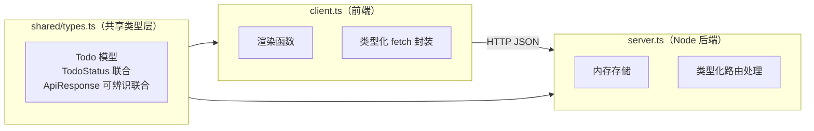
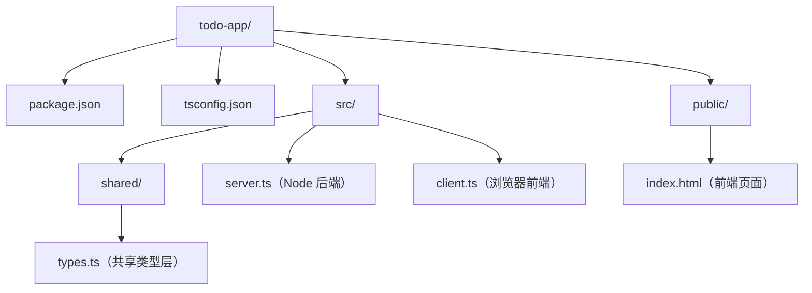

## 前置知识

- [TypeScript 项目示例：类型安全的 API 客户端](/typescript/062-TypeScriptProjectExampleTypeSafeAPIClient)：建议先完成前一篇的学习

## 学习目标

- 掌握「0. 学习目标（可验证）」的核心机制、典型用法与常见陷阱
- 掌握「1. 项目概览」的核心机制、典型用法与常见陷阱
- 掌握「2. 项目结构」的核心机制、典型用法与常见陷阱
- 掌握「3. 共享类型层（shared/types.ts）」的核心机制、典型用法与常见陷阱
- 掌握「4. 后端（server.ts）」的核心机制、典型用法与常见陷阱


## 0. 学习目标（可验证）

- [ ] 能独立搭建一个前后端共享类型的 TypeScript 项目结构
- [ ] 能用可辨识联合建模 API 响应，并在前后端复用它
- [ ] 能用类型守卫收窄未知输入，保证运行时安全
- [ ] 能用 never 做穷尽检查，防止状态处理漏分支
- [ ] 能解释"类型安全"在前后端边界上的真正含义

## 1. 项目概览

这是一个刻意"零依赖"的 TODO 应用：后端用 Node 内置 `http` 模块，前端用原生 DOM，全程 TypeScript 编译运行。它不依赖任何框架，目的只有一个——把前面学的类型知识串成一条完整链路。



**拆解化讲解：**

（1）共享类型层放在独立文件，前后端都从它导入，保证"接口契约"只有一份定义；

（2）后端用内存数组存储，不需要数据库，专注类型设计；

（3）前端用 fetch 与后端通信，用类型守卫处理"不可信的运行时数据"。

## 2. 项目结构



```json
// package.json（scripts 部分）
{
  "scripts": {
    "build": "tsc",
    "server": "node dist/server.js",
    "dev": "tsc --watch"
  }
}
```

```json
// tsconfig.json
{
  "compilerOptions": {
    "target": "ES2022",
    "module": "NodeNext",
    "moduleResolution": "NodeNext",
    "outDir": "dist",
    "rootDir": "src",
    "strict": true,
    "verbatimModuleSyntax": true,
    "skipLibCheck": true
  },
  "include": ["src"]
}
```

**拆解化讲解：**

（1）`strict` 开启全部严格检查，这是类型安全的底线；

（2）`verbatimModuleSyntax` 强制类型导入必须写 `import type`，见 `ImportTypeVerbatimModuleSyntax`；

（3）`NodeNext` 让 CommonJS/ESM 的模块解析符合 Node 实际行为。

## 3. 共享类型层（shared/types.ts）

```typescript
// 共享类型层：前后端唯一的事实来源

// 任务状态：用字符串字面量联合表达"有限状态"
export type TodoStatus = "pending" | "done";

// 任务模型：id 由后端生成，title 必填
export interface Todo {
  id: number;
  title: string;
  status: TodoStatus;
  createdAt: string;
}

// 新建任务的请求体
export interface CreateTodoInput {
  title: string;
}

// 更新任务状态的请求体
export interface UpdateTodoInput {
  status: TodoStatus;
}

// API 响应：可辨识联合，success 字段作为判别属性
export type ApiResponse<T> =
  | { success: true; data: T }
  | { success: false; error: string };
```

**拆解化讲解：**

（1）`TodoStatus` 用联合类型而不是字符串，编译期就能拦截非法状态值；

（2）`ApiResponse<T>` 是泛型可辨识联合：后端返回什么数据，前端就知道什么类型；

（3）共享层只有类型没有值，编译后不产生任何代码。

## 4. 后端（server.ts）

```typescript
import { createServer } from "node:http";
import { readFile } from "node:fs/promises";
import { join, normalize } from "node:path";
import type { IncomingMessage, ServerResponse } from "node:http";
import type {
  ApiResponse,
  CreateTodoInput,
  Todo,
  UpdateTodoInput,
} from "./shared/types.js";

// 内存存储：真实项目换成数据库
const todos: Todo[] = [];
let nextId = 1;

// 静态文件根目录：只允许 public 与 dist 两个目录
const STATIC_ROOTS = [join(process.cwd(), "public"), join(process.cwd(), "dist")];

// 根据扩展名返回 Content-Type
function contentType(path: string): string {
  if (path.endsWith(".html")) return "text/html; charset=utf-8";
  if (path.endsWith(".js")) return "text/javascript; charset=utf-8";
  if (path.endsWith(".css")) return "text/css; charset=utf-8";
  return "application/octet-stream";
}

// 静态文件服务：成功返回 true，失败返回 false 交给路由继续处理
async function serveStatic(
  req: IncomingMessage,
  res: ServerResponse,
  pathname: string
): Promise<boolean> {
  if (req.method !== "GET") return false;
  const relative = pathname === "/" ? "/index.html" : pathname;

  for (const root of STATIC_ROOTS) {
    const target = normalize(join(root, relative));
    // 防目录穿越：解析后的路径必须仍在根目录内
    if (!target.startsWith(root)) continue;
    try {
      const body = await readFile(target);
      res.writeHead(200, { "Content-Type": contentType(target) });
      res.end(body);
      return true;
    } catch {
      // 文件不存在，尝试下一个根目录
    }
  }
  return false;
}

// 工具函数：统一响应格式
function json<T>(res: ServerResponse, status: number, body: ApiResponse<T>): void {
  res.writeHead(status, { "Content-Type": "application/json" });
  res.end(JSON.stringify(body));
}

// 读取并解析请求体（返回 unknown，类型安全从边界开始）
function readBody(req: IncomingMessage): Promise<unknown> {
  return new Promise((resolve, reject) => {
    let raw = "";
    req.on("data", (chunk: Buffer) => {
      raw += chunk.toString();
    });
    req.on("end", () => {
      try {
        resolve(JSON.parse(raw));
      } catch {
        reject(new Error("JSON 解析失败"));
      }
    });
    req.on("error", reject);
  });
}

// 类型守卫：验证未知输入是否为合法的新建任务
function isCreateTodoInput(value: unknown): value is CreateTodoInput {
  if (typeof value !== "object" || value === null) return false;
  const v = value as Record<string, unknown>;
  return typeof v.title === "string" && v.title.trim().length > 0;
}

// 类型守卫：验证未知输入是否为合法的状态更新
function isUpdateTodoInput(value: unknown): value is UpdateTodoInput {
  if (typeof value !== "object" || value === null) return false;
  const v = value as Record<string, unknown>;
  return v.status === "pending" || v.status === "done";
}

const server = createServer(async (req, res) => {
  const url = new URL(req.url ?? "/", "http://localhost");

  try {
    // 静态资源：页面与编译产物
    if (await serveStatic(req, res, url.pathname)) return;

    // 路由：GET /api/todos
    if (req.method === "GET" && url.pathname === "/api/todos") {
      json(res, 200, { success: true, data: todos });
      return;
    }

    // 路由：POST /api/todos（新建任务）
    if (req.method === "POST" && url.pathname === "/api/todos") {
      const body = await readBody(req);
      if (!isCreateTodoInput(body)) {
        json(res, 400, { success: false, error: "title 必须是非空字符串" });
        return;
      }
      const todo: Todo = {
        id: nextId++,
        title: body.title.trim(),
        status: "pending",
        createdAt: new Date().toISOString(),
      };
      todos.push(todo);
      json(res, 201, { success: true, data: todo });
      return;
    }

    // 路由：PATCH /api/todos/:id（更新状态）
    const match = url.pathname.match(/^\/api\/todos\/(\d+)$/);
    if (req.method === "PATCH" && match) {
      const id = Number(match[1]);
      const body = await readBody(req);
      if (!isUpdateTodoInput(body)) {
        json(res, 400, { success: false, error: "status 必须是 pending 或 done" });
        return;
      }
      const todo = todos.find((t) => t.id === id);
      if (!todo) {
        json(res, 404, { success: false, error: "任务不存在" });
        return;
      }
      todo.status = body.status;
      json(res, 200, { success: true, data: todo });
      return;
    }

    // 未匹配的路由
    json(res, 404, { success: false, error: "接口不存在" });
  } catch (error) {
    const message = error instanceof Error ? error.message : "未知错误";
    json(res, 500, { success: false, error: message });
  }
});

server.listen(3000, () => {
  console.log("服务已启动: http://localhost:3000");
});
```

**拆解化讲解：**

（1）所有外部输入（请求体）先以 `unknown` 进入，再通过类型守卫收窄——**信任边界上的数据必须验证**；

（2）`isCreateTodoInput`、`isUpdateTodoInput` 是自定义类型守卫，验证通过后编译器自动获得精确类型；

（3）`ApiResponse<T>` 让所有响应走统一格式，前端可以安全区分成功与失败；

（4）`error instanceof Error` 是运行时收窄，避免把任意异常当字符串拼接。

（5）静态文件服务只允许 `public/` 与 `dist/` 两个根目录，并用 `normalize` 防止目录穿越；页面与编译产物由同一个端口提供，方便本地演示。

## 5. 前端（client.ts）

```typescript
import type { ApiResponse, Todo, TodoStatus } from "./shared/types.js";

// 类型化 fetch 封装：解析后先当 unknown，再收窄
async function request<T>(url: string, init?: RequestInit): Promise<ApiResponse<T>> {
  const response = await fetch(url, init);
  const data: unknown = await response.json();

  // 可辨识联合收窄：success 字段决定分支
  if (
    typeof data === "object" &&
    data !== null &&
    "success" in data &&
    typeof (data as { success: unknown }).success === "boolean"
  ) {
    return data as ApiResponse<T>;
  }
  return { success: false, error: "响应格式异常" };
}

// 渲染函数：把 Todo 列表画到页面上
function render(todos: Todo[]): void {
  const list = document.querySelector<HTMLUListElement>("#todo-list");
  if (!list) return;

  list.innerHTML = "";
  for (const todo of todos) {
    const item = document.createElement("li");
    const label = document.createElement("span");
    label.textContent = `${todo.id}. ${todo.title}（${todo.status}）`;

    const button = document.createElement("button");
    button.textContent = todo.status === "pending" ? "完成" : "恢复";
    button.addEventListener("click", () => toggle(todo));

    item.append(label, button);
    list.append(item);
  }
}

// 状态处理函数：穷尽检查保证每个状态都有对应行为
function statusText(status: TodoStatus): string {
  switch (status) {
    case "pending":
      return "待办";
    case "done":
      return "已完成";
    default: {
      // 未来新增状态时，这里会编译报错提醒补分支
      const exhaustive: never = status;
      return exhaustive;
    }
  }
}

// 加载任务列表
async function load(): Promise<void> {
  const result = await request<Todo[]>("/api/todos");
  if (result.success) {
    render(result.data);
  } else {
    alert(result.error);
  }
}

// 切换任务状态
async function toggle(todo: Todo): Promise<void> {
  const next: TodoStatus = todo.status === "pending" ? "done" : "pending";
  const result = await request<Todo>(`/api/todos/${todo.id}`, {
    method: "PATCH",
    headers: { "Content-Type": "application/json" },
    body: JSON.stringify({ status: next }),
  });
  if (result.success) {
    await load();
  } else {
    alert(result.error);
  }
}

// 新建任务
async function create(): Promise<void> {
  const input = document.querySelector<HTMLInputElement>("#todo-input");
  if (!input) return;
  const title = input.value.trim();
  if (title === "") return;

  const result = await request<Todo>("/api/todos", {
    method: "POST",
    headers: { "Content-Type": "application/json" },
    body: JSON.stringify({ title }),
  });
  if (result.success) {
    input.value = "";
    await load();
  } else {
    alert(result.error);
  }
}

// 初始化事件
document.querySelector("#add-btn")?.addEventListener("click", create);
void load();
```

**拆解化讲解：**

（1）`request<T>` 把后端响应解析成 `ApiResponse<T>`，成功后 `result.data` 自动是 `T`；

（2）`statusText` 用穷尽检查：未来给 `TodoStatus` 加状态却忘记处理时，default 分支会报错；

（3）`document.querySelector<HTMLUListElement>` 是泛型查询，返回带类型的元素引用；

（4）前端代码只依赖共享类型，后端改模型后编译期立即暴露所有需要同步的地方。

## 6. 前端页面（public/index.html）

```html
<!DOCTYPE html>
<html lang="zh-CN">
  <head>
    <meta charset="UTF-8" />
    <title>TypeScript TODO</title>
  </head>
  <body>
    <h1>TypeScript TODO</h1>
    <input id="todo-input" placeholder="输入新任务" />
    <button id="add-btn">添加</button>
    <ul id="todo-list"></ul>
    <script src="/client.js"></script>
  </body>
</html>
```

## 7. 运行与验证

1. 在项目根目录执行 `npm install -D typescript`（唯一依赖）；
2. `npm run build` 编译到 `dist/`；
3. 终端执行 `npm run server`，确认输出"服务已启动"；
4. 浏览器打开 `http://localhost:3000`，此时应能看到页面（静态路由会同时托管 `public/` 与 `dist/`）；
5. 添加任务、切换状态、刷新页面，验证数据不丢失（内存存储，进程重启后清空）。

**验证清单**：

- [ ] 空标题提交被后端 400 拒绝，前端提示错误信息
- [ ] 非法状态值（如 `status: "archived"`）在类型层无法通过编译
- [ ] 给 `TodoStatus` 增加新值后，`statusText` 立即编译报错
- [ ] 修改 `Todo` 模型后，前后端类型错误同时暴露

## 8. 类型安全设计复盘

| 边界 | 使用的类型技术 | 作用 |
| --- | --- | --- |
| 前后端契约 | 共享类型层 + 泛型 `ApiResponse<T>` | 一份定义，两端同步 |
| 后端入口 | `unknown` + 类型守卫 | 运行时数据验证后才可信 |
| 状态建模 | 字符串字面量联合 | 非法状态无法表示 |
| 分支处理 | never 穷尽检查 | 漏分支编译期报错 |
| 编译配置 | strict + verbatimModuleSyntax | 关闭一切隐式漏洞 |

## 9. 扩展任务（进阶）

1. 增加"删除任务"接口（DELETE /api/todos/:id），前端补对应按钮；
2. 用 `Readonly<Todo>` 或 `as const` 约束不可变数据；
3. 把内存存储换成 SQLite，保留共享类型层不变；
4. 增加过滤视图（全部/待办/已完成），用 `Exclude` 等工具类型派生过滤状态；
5. 为静态路由补充更完善的安全策略（如 MIME 白名单与缓存头）。

## 10. 自测（小测验）

**第 1 题（判断）**：后端把请求体解析为 `unknown` 后直接使用，是否类型安全？

**第 2 题（填空）**：`ApiResponse<T>` 的可辨识联合依赖哪个字段作为判别属性？

**第 3 题（单选）**：给 `TodoStatus` 增加 `"archived"` 后，哪个函数会在编译期报错？

<details>
<summary>点击查看答案</summary>

1. 不安全。unknown 必须先通过类型守卫验证才能信任。
2. `success` 字段（true 分支有 data，false 分支有 error）。
3. `statusText`（default 分支中 status 不再是 never，穷尽检查报错）。

</details>

## 11. 一句话记住

> 类型安全不是"代码里没有类型错误"，而是"边界数据经过验证、状态变化经过建模、漏分支在编译期暴露"。

## 扩展阅读

- `059-TypeScriptProjectExampleTypeSafeAPIClient`：类型安全 API 客户端的完整工程示例；
- `038-TypeSafeAPIClient`：请求层的类型设计模式；
- `048-TypeScriptEngineeringConfig`：tsconfig 工程化配置详解；
- `010-LocalTypeInference`：可辨识联合与收窄。
