# 异步组件与 Suspense | Async Components and Suspense in Vue 3

## 前置知识

- [KeepAlive 缓存与生命周期](/vue3/027-KeepAliveCacheLifecycle)：建议先完成前一篇的学习

## 学习目标

- 掌握「1. 历史动机与发展脉络 | Historical Motivation and Evolution」的核心机制、典型用法与常见陷阱
- 掌握「2. 形式化定义 | Formal Definitions」的核心机制、典型用法与常见陷阱
- 掌握「3. 理论推导与原理解析 | Theoretical Derivation」的核心机制、典型用法与常见陷阱
- 掌握「4. 代码示例 | Code Examples」的核心机制、典型用法与常见陷阱
- 掌握「5. 对比分析 | Comparative Analysis」的核心机制、典型用法与常见陷阱


> 本文档对标 MIT 6.170、Stanford CS142、CMU 17-437 软件工程课程水准，系统化阐述 Vue 3 异步组件（`defineAsyncComponent`）与 `Suspense` 机制的原理、形式化定义、企业级实践与对比分析。涵盖代码分割（Code Splitting）、动态导入（Dynamic Import）、异步依赖编排（Async Orchestration）、错误边界（Error Boundary）、加载状态管理、SSR 流式渲染等主题，并辅以数学建模、对比分析、案例研究与习题。

---

## 1. 历史动机与发展脉络 | Historical Motivation and Evolution

### 1.1 代码分割的起源

Web 应用的体积随功能增长而膨胀，首屏 JS 体积从 2010 年的几十 KB 增长到 2025 年的数 MB。代码分割（Code Splitting）是应对此问题的核心技术，其设计动机：

1. **首屏性能**：用户访问页面时只需加载首屏所需的 JS，减少 LCP（Largest Contentful Paint）时间。
2. **带宽节省**：移动用户按需加载，避免下载未访问页面的代码。
3. **缓存优化**：将稳定代码与频繁变化代码分离，提升缓存命中率。

**关键里程碑**：

| 时间 | 事件 |
|------|------|
| 2015 | Webpack 1 引入 `require.ensure` 实现代码分割 |
| 2017 | Webpack 2 支持 `import()` 动态导入语法 |
| 2017 | React 16 引入 `React.lazy` 与 `Suspense` |
| 2018 | Vue 2.5 支持异步组件工厂函数（`(resolve, reject) => ...` 形式） |
| 2020 | Vue 3 重构 `defineAsyncComponent`，引入 Composition API 风格 |
| 2020 | Vue 3 引入 `Suspense`（实验性） |
| 2022 | Vue 3.2 增强 `Suspense`，支持嵌套与 SSR（官方仍标记为实验性） |
| 2024 | Vite 5 优化动态导入，支持模块预加载 |

### 1.2 Vue 2 时代的异步组件

Vue 2 通过组件工厂函数（`() => Promise`）实现异步组件，支持基础代码分割；`defineAsyncComponent` 是 Vue 3 引入的正式 API：

```javascript
// Vue 2 异步组件
Vue.component('async-component', (resolve, reject) => {
  import('./AsyncComponent.vue').then(resolve).catch(reject);
});

// Vue 2.5+ 工厂函数形式
const AsyncComponent = () => import('./AsyncComponent.vue');
```

**Vue 2 异步组件的限制**：

- 无内置 loading/error 配置，需手动管理。
- 无超时机制，组件加载失败时无降级方案。
- 无 Suspense 协调，多个异步组件无法统一管理加载态。
- 无 `async setup()`，数据获取需在 `created` 或 `mounted` 中处理。

### 1.3 Vue 3 时代（2020-至今）：完整重构

Vue 3 对异步组件进行根本性重构，并引入 `Suspense`：

#### 1.3.1 defineAsyncComponent 完整配置（Vue 3.0）

```javascript
import { defineAsyncComponent } from 'vue';

const AsyncComp = defineAsyncComponent({
  loader: () => import('./HeavyComponent.vue'),
  loadingComponent: LoadingSpinner,
  errorComponent: ErrorDisplay,
  delay: 200,           // 延迟显示 loading（毫秒）
  timeout: 3000,        // 超时显示 error（毫秒）
  suspensible: true,    // 参与 Suspense 协调（默认 true）
  onError(error, retry, fail, attempts) {
    if (attempts <= 3) retry();
    else fail();
  },
});
```

#### 1.3.2 Suspense 组件（Vue 3.0，实验性）

```vue
<Suspense>
  <template #default>
    <AsyncComponent />
  </template>
  <template #fallback>
    <LoadingSpinner />
  </template>
</Suspense>
```

#### 1.3.3 async setup()（Vue 3.0）

Vue 3 允许 `setup` 为 async 函数，自动与 Suspense 集成：

```javascript
export default {
  async setup() {
    const data = await fetch('/api/data').then(r => r.json());
    return { data };
  },
};
```

#### 1.3.4 嵌套 Suspense（Vue 3.2+）

Vue 3.2+ 支持嵌套 Suspense，允许局部异步依赖独立管理加载态：

```vue
<Suspense>
  <template #default>
    <Header />
    <Suspense>
      <template #default>
        <MainContent />
      </template>
      <template #fallback>
        <MainSkeleton />
      </template>
    </Suspense>
  </template>
  <template #fallback>
    <PageSkeleton />
  </template>
</Suspense>
```

#### 1.3.5 SSR 流式渲染（Vue 3.3+）

Vue 3.3+ 优化了 SSR 中的 Suspense，支持流式渲染（`renderToNodeStream`），服务端在异步依赖完成时立即输出对应 HTML，提升首屏 TTFB（Time To First Byte）。

### 1.4 Evan You 的设计哲学

Evan You 对异步组件与 Suspense 的定位：

1. **声明式优于命令式**：通过 `Suspense` 组件声明加载占位，而非手动切换 v-if 状态。
2. **渐进式复杂度**：简单场景用 `defineAsyncComponent` 内置配置，复杂场景用 `Suspense` 协调多个异步依赖。
3. **与 React Suspense 互补**：借鉴 React 的概念，但实现基于 Vue 的响应式系统，重渲染粒度更细。
4. **实验性优先级**：`Suspense` 长期标记为实验性，API 可能调整，避免过早稳定化限制演进。

### 1.5 与 React.lazy/Suspense 的对比

React 16.6（2018）引入 `React.lazy` 与 `Suspense`，与 Vue 方案解决相似问题：

| 维度 | Vue 3 defineAsyncComponent | React.lazy |
|------|------------------------------|------------|
| API 形式 | `defineAsyncComponent(options)` | `React.lazy(loader)` |
| loading 配置 | 内置 `loadingComponent` | `Suspense` 的 `fallback` |
| error 配置 | 内置 `errorComponent` | ErrorBoundary 组件 |
| 超时 | 内置 `timeout` | 手动实现 |
| 重试 | 内置 `onError` | 手动实现 |
| async setup | 支持 `async setup()` | 无对应概念 |
| 嵌套 Suspense | 支持 | 支持 |
| 数据获取 | `async setup()` 集成 | React Query / SWR 等外部库 |
| SSR | 流式渲染 | 流式渲染 |

**关键差异**：

- Vue 的 `defineAsyncComponent` 内置 loading/error/timeout/重试，配置更完整。
- React 的 `lazy` 更精简，复杂场景需配合 ErrorBoundary 与外部数据获取库。
- Vue 的 `async setup()` 允许组件级数据获取与 Suspense 集成，React 需借助 React Query 等。

### 1.6 与 Solid.js、Svelte 的对比

| 框架 | 异步组件 API | Suspense 支持 | 数据获取集成 |
|------|--------------|---------------|--------------|
| Vue 3 | defineAsyncComponent + Suspense | 内置 | async setup() |
| React 18 | React.lazy + Suspense | 内置 | use() Hook（实验性） |
| Solid.js | lazy() + Suspense | 内置 | createResource() |
| Svelte | 动态 import | 无原生 Suspense | async module + await |
| Angular | loadChildren | Router 内置 | Resolve 守卫 |

Solid.js 的 `lazy` 与 Vue 最相似，但基于细粒度响应式，性能更优。Svelte 依赖编译时优化，运行时 Suspense 较弱。Angular 的 `loadChildren` 仅在路由层支持异步。

---

## 2. 形式化定义 | Formal Definitions

### 2.1 异步组件的形式化定义

**定义 3.1（异步组件）**：异步组件是一个返回 Promise 的工厂函数，记为 $A$：

$$
A: () \to \text{Promise<ComponentDefinition>
$$

Promise resolve 时返回组件定义对象，reject 时表示加载失败。

**定义 3.2（defineAsyncComponent）**：`defineAsyncComponent` 将异步工厂转换为同步可渲染的包装组件：

$$
\text{defineAsyncComponent}: \text{AsyncFactory} \to \text{WrappedComponent}
$$

包装组件内部维护状态机：

$$
\text{state} \in \{\text{idle}, \text{loading}, \text{loaded}, \text{error}\}
$$

### 2.2 异步组件配置的形式化

**定义 3.3（完整配置）**：`defineAsyncComponent` 的完整配置是一个七元组：

$$
\text{Config} = \langle \text{loader}, \text{loadingComponent}, \text{errorComponent}, \text{delay}, \text{timeout}, \text{suspensible}, \text{onError} \rangle
$$

其中：

- $\text{loader}: () \to \text{Promise<Component>}$：加载函数。
- $\text{loadingComponent}: \text{Component}$：加载占位组件。
- $\text{errorComponent}: \text{Component}$：错误降级组件。
- $\text{delay}: \mathbb{N} \text{ (ms)}$：延迟显示 loading，默认 200ms。
- $\text{timeout}: \mathbb{N} \text{ (ms)}$：超时阈值，默认 Infinity。
- $\text{suspensible}: \text{boolean}$：是否参与 Suspense 协调，默认 true。
- $\text{onError}: (\text{error}, \text{retry}, \text{fail}, \text{attempts}) \to \text{void}$：错误回调。

### 2.3 状态机的形式化

**定义 3.4（状态转换）**：异步组件包装器的状态转换：

$$
\text{state}(t+1) = \begin{cases}
\text{loading} & \text{if } \text{state}(t) = \text{idle} \land \text{mount}(t) \\
\text{loaded} & \text{if } \text{state}(t) = \text{loading} \land \text{loader.resolve} \\
\text{error} & \text{if } \text{state}(t) = \text{loading} \land (\text{loader.reject} \lor \text{timeout}) \\
\text{loading} & \text{if } \text{state}(t) = \text{error} \land \text{retry} \\
\text{loaded} & \text{if } \text{state}(t) = \text{loaded} \text{ (absorbing state)}
\end{cases}
$$

**关键性质**：

- `loaded` 是吸收态，组件加载成功后不再重新加载（除非组件被卸载并重新挂载）。
- `error` 可通过 `retry` 转回 `loading`，支持错误恢复。
- `timeout` 与 `loader.reject` 都会触发 `error`，但 `timeout` 不取消 loader。

### 2.4 Suspense 的形式化定义

**定义 3.5（Suspense 依赖）**：Suspense 维护一个异步依赖集合 $D$：

$$
D = \{d_1, d_2, \ldots, d_n\}
$$

每个 $d_i$ 是一个异步依赖（来自 `async setup()` 或 `suspensible: true` 的异步组件）。

**定义 3.6（Suspense 状态）**：Suspense 的状态由依赖集合决定：

$$
\text{Suspense.state} = \begin{cases}
\text{pending} & \text{if } \exists d \in D: d.\text{state} = \text{pending} \\
\text{resolved} & \text{if } \forall d \in D: d.\text{state} = \text{resolved} \\
\text{rejected} & \text{if } \exists d \in D: d.\text{state} = \text{rejected}
\end{cases}
$$

**渲染规则**：

- $\text{pending}$：渲染 `#fallback` 插槽。
- $\text{resolved}$：渲染 `#default` 插槽。
- $\text{rejected}$：向上抛出错误，由 ErrorBoundary 或上层 Suspense 处理。

### 2.5 async setup() 的形式化

**定义 3.7（async setup）**：`async setup()` 是返回 Promise 的 setup 函数：

$$
\text{asyncSetup}: () \to \text{Promise<Bindings>}
$$

其中 $\text{Bindings}$ 是模板可访问的响应式对象集合。

**Suspense 集成**：在 Suspense 内使用 `async setup` 时，Vue 自动将该 Promise 注册为依赖：

$$
\text{Suspense.register}(\text{asyncSetup}())
$$

Promise resolve 时递减依赖计数，归零时触发 Suspense resolve。

### 2.6 代码分割的形式化

**定义 3.8（chunk 分割）**：设应用总代码量为 $C$，分割为 $n$ 个 chunk：

$$
C = c_1 \cup c_2 \cup \ldots \cup c_n
$$

首屏加载量为 $c_{\text{initial}} \subseteq C$，按需加载量为 $c_{\text{lazy}} = C \setminus c_{\text{initial}}$。

**目标**：最小化首屏加载量 $|c_{\text{initial}}|$，同时控制总加载量 $|C|$。

**约束**：

- 用户访问路由 $r$ 时，必须加载 $c_r$（该路由的组件）。
- 共享依赖（如 Vue 运行时）应抽离为 vendor chunk，避免重复。

### 2.7 动态导入的形式化

**定义 3.9（动态导入）**：`import('./module')` 返回一个 Promise：

$$
\text{import}: \text{ModuleSpecifier} \to \text{Promise<Module>}
$$

Webpack/Vite 将其转换为：

1. **chunk 创建**：构建时将 `module` 拆分为独立文件。
2. **运行时加载**：通过 `<script>` 标签或 `fetch` 加载 chunk。
3. **模块缓存**：加载后缓存到全局，重复 `import()` 返回同一 Promise。

**复杂度**：

- 首次加载：$O(|c|)$，需下载并解析整个 chunk。
- 后续加载：$O(1)$，从缓存读取。

---

## 3. 理论推导与原理解析 | Theoretical Derivation

### 3.1 defineAsyncComponent 的内部实现

Vue 3 的 `defineAsyncComponent` 内部实现是一个包装组件，维护状态机：

```javascript
// Vue 3 内部实现（简化）
export function defineAsyncComponent(options) {
  if (typeof options === 'function') {
    options = { loader: options };
  }
  
  const { loader, loadingComponent, errorComponent, delay = 200, timeout, suspensible = true, onError } = options;
  
  let resolvedComponent = null;
  let loading = false;
  let error = null;
  let loaded = false;
  let retries = 0;
  
  return defineComponent({
    name: 'AsyncComponentWrapper',
    async setup() {
      // 如果已加载，直接返回
      if (loaded) {
        return { component: resolvedComponent };
      }
      
      // 加载组件
      const load = () => {
        if (loading) return;
        loading = true;
        error = null;
        
        const promise = loader()
          .then(c => {
            resolvedComponent = c.__esModule ? c.default : c;
            loaded = true;
          })
          .catch(err => {
            error = err;
            if (onError) {
              onError(err, () => {
                retries++;
                load();
              }, () => {}, retries);
            }
          });
        
        // 超时处理
        if (timeout) {
          setTimeout(() => {
            if (!loaded && !error) {
              error = new Error(`Async component timed out after ${timeout}ms`);
            }
          }, timeout);
        }
        
        return promise;
      };
      
      await load();
      
      return () => {
        if (loaded) return h(resolvedComponent);
        if (error && errorComponent) return h(errorComponent, { error });
        if (loading && loadingComponent) return h(loadingComponent);
        return null;
      };
    },
  });
}
```

**关键点**：

1. **缓存机制**：`loaded` 与 `resolvedComponent` 在模块作用域缓存，重复挂载不重新加载。
2. **重试支持**：`onError` 提供 `retry` 回调，递归调用 `load`。
3. **状态机**：`loading`/`loaded`/`error` 三态切换，驱动渲染。

### 3.2 Suspense 的依赖追踪机制

Suspense 内部维护一个 `deps` 集合与计数器：

```javascript
// Vue 3 内部实现（简化）
const Suspense = {
  name: 'Suspense',
  setup(props, { slots }) {
    const suspense = {
      deps: 0,            // 待解决的依赖数
      pending: false,
      fallback: false,
      effects: [],
      resolve() {
        this.deps--;
        if (this.deps === 0) {
          this.pending = false;
          this.fallback = false;
          // 触发渲染默认插槽
        }
      },
      reject() {
        this.pending = false;
        // 向上抛出错误
      },
      register(dep) {
        this.deps++;
        this.pending = true;
        this.fallback = true;
        dep.then(this.resolve.bind(this)).catch(this.reject.bind(this));
      },
    };
    
    return () => {
      if (suspense.fallback) {
        return slots.fallback?.();
      }
      return slots.default?.();
    };
  },
};
```

**依赖注册流程**：

1. **async setup 触发**：`async setup()` 返回 Promise，Vue 将其注册到最近的 Suspense。
2. **递增计数器**：`suspense.deps++`，`suspense.pending = true`。
3. **Promise 链接**：Promise resolve 时调用 `resolve()`，递减计数器。
4. **归零触发渲染**：`deps === 0` 时切换到默认插槽。

### 3.3 async setup() 的执行流程

`async setup()` 的执行流程：

1. **setup 调用**：Vue 调用 `setup()`，返回 Promise。
2. **Suspense 注册**：Vue 将 Promise 注册到当前 Suspense。
3. **fallback 渲染**：Suspense 渲染 `#fallback` 插槽。
4. **Promise resolve**：异步操作完成，setup 返回 bindings。
5. **Suspense resolve**：递减依赖计数，归零时切换到 `#default`。
6. **默认插槽渲染**：渲染组件，使用 setup 返回的 bindings。

**关键点**：

- `async setup()` 中抛出的错误会被 Suspense 捕获，向上传播。
- 多个 `async setup()` 嵌套时，Suspense 等待所有依赖完成。
- `async setup()` 中可以使用 `onMounted` 等生命周期钩子，但需在 Promise resolve 后执行。

### 3.4 代码分割的性能分析

**首屏加载量优化**：

设应用总代码量为 $C$，首屏路由代码量为 $c_r$，公共依赖为 $v$。

- **无代码分割**：首屏加载 $C$，包含所有路由代码。
- **有代码分割**：首屏加载 $v + c_r$，其余路由按需加载。

**收益**：

$$
\text{speedup} = \frac{C}{v + c_r}
$$

若 $C = 2\text{MB}$，$v = 200\text{KB}$，$c_r = 300\text{KB}$，则：

$$
\text{speedup} = \frac{2000}{500} = 4 \text{ 倍}
$$

**代价**：

- 路由切换时需加载新 chunk，增加延迟。
- HTTP 请求数增多，需 HTTP/2 或预加载优化。

### 3.5 chunk 预加载策略

Vite/Webpack 提供多种预加载策略：

1. **`<link rel="modulepreload">`**：Vite 默认为动态导入添加 modulepreload，并行加载 chunk。
2. **`webpackPrefetch`**：Webpack 4+ 支持在 import 注释中声明 prefetch。

```javascript
import(/* webpackPrefetch: true */ './module');
```

3. **手动预加载**：在用户 hover 链接时预加载对应 chunk。

```javascript
link.addEventListener('mouseenter', () => {
  import('./route-component');
});
```

**预加载的复杂度分析**：

- 带宽成本：$O(|c|)$，每个预加载消耗带宽。
- 性能收益：用户实际访问时 $O(1)$，从缓存读取。
- 权衡：仅预加载高概率访问的 chunk。

### 3.6 Suspense 嵌套的复杂度

嵌套 Suspense 允许局部依赖独立管理：

```
<Suspense> (外层)
  <Header />
  <Suspense> (内层)
    <MainContent />
  </Suspense>
</Suspense>
```

**渲染顺序**：

1. 外层 Suspense 等待所有依赖（包括 Header 与内层 Suspense）。
2. 内层 Suspense 独立等待 MainContent。
3. 内层 resolve 后，外层 deps 递减；外层 deps 归零时整体 resolve。

**复杂度**：

- 依赖追踪：$O(n)$，$n$ 为 Suspense 节点数。
- 错误传播：内层错误可被外层捕获，也可独立处理。

### 3.7 与 React Suspense 的原理对比

React 18 的 Suspense 基于 throw Promise 模式：

```javascript
// React 内部（简化）
function Suspense({ fallback, children }) {
  try {
    return children;
  } catch (promise) {
    if (promise instanceof Promise) {
      promise.then(() => rerender());
      return fallback;
    }
    throw promise;
  }
}

// 数据获取库使用 throw
function use(fetchPromise) {
  if (fetchPromise.pending) throw fetchPromise;
  return fetchPromise.result;
}
```

**Vue 的优势**：

- 显式依赖注册：`async setup()` 自动注册，无需 throw。
- 响应式追踪：Vue 的响应式系统天然支持依赖追踪。
- 性能更优：避免 throw 的栈展开开销。

**React 的优势**：

- 通用性：任意数据获取库（如 React Query）可通过 throw 集成。
- 并发渲染：React 18 的 Concurrent Rendering 与 Suspense 深度集成。

### 3.8 SSR 流式渲染的原理

Vue 3.3+ 的 SSR 支持 Suspense 流式渲染：

```javascript
import { renderToNodeStream } from 'vue/server-renderer';

const stream = renderToNodeStream(app);
stream.pipe(res);
```

**流程**：

1. **同步部分输出**：非异步依赖立即输出 HTML。
2. **异步依赖 pending**：输出占位注释 `<!-- suspense-pending -->`。
3. **异步依赖 resolve**：流式输出对应 HTML，替换占位。
4. **完成**：所有依赖 resolve，输出闭合标签。

**性能收益**：

- TTFB（Time To First Byte）显著降低：服务端无需等待所有数据即可响应。
- 用户感知性能提升：浏览器逐步渲染，无需等待完整 HTML。

### 3.9 错误传播与捕获

Suspense 的错误传播规则：

1. **async setup 抛出错误**：Promise reject，Suspense 进入 rejected 状态。
2. **向上传播**：错误向上冒泡，寻找 ErrorBoundary 或上层 Suspense 的 onError。
3. **未捕获错误**：若未捕获，Vue 在控制台警告并渲染空内容。

**ErrorBoundary 模式**：

Vue 3 没有官方 ErrorBoundary 组件，但可通过 `onErrorCaptured` 钩子实现：

```javascript
export default {
  setup(props, { slots }) {
    const error = ref(null);
    
    onErrorCaptured((err) => {
      error.value = err;
      return false; // 阻止错误继续传播
    });
    
    return () => {
      if (error.value) {
        return h(ErrorDisplay, { error: error.value, onRetry: () => error.value = null });
      }
      return slots.default?.();
    };
  },
};
```

---

## 4. 代码示例 | Code Examples

### 4.1 基础用法：路由懒加载

```javascript
// router/index.ts —— Vue 3.5+ + Vue Router 5
import { createRouter, createWebHistory } from 'vue-router';
import Home from '../views/Home.vue'; // 首屏直接 import

const routes = [
  {
    path: '/',
    component: Home,
  },
  {
    path: '/about',
    // 异步加载 About 组件
    component: () => import('../views/About.vue'),
  },
  {
    path: '/dashboard',
    // 命名 chunk，便于分析与缓存
    component: () => import(/* webpackChunkName: "dashboard" */ '../views/Dashboard.vue'),
  },
  {
    path: '/settings',
    // Vite 风格的注释
    component: () => import('../views/Settings.vue'),
  },
];

export const router = createRouter({
  history: createWebHistory(),
  routes,
});
```

### 4.2 完整配置：defineAsyncComponent

```vue
<!-- AsyncComponent.vue —— Vue 3.4+ -->
<script setup>
import { defineAsyncComponent } from 'vue';
import LoadingSpinner from './LoadingSpinner.vue';
import ErrorDisplay from './ErrorDisplay.vue';

// 完整配置的异步组件
const HeavyChart = defineAsyncComponent({
  loader: () => import('./HeavyChart.vue'),
  loadingComponent: LoadingSpinner,
  errorComponent: ErrorDisplay,
  delay: 200,           // 延迟 200ms 显示 loading，避免闪烁
  timeout: 10000,       // 10 秒超时
  suspensible: true,    // 参与 Suspense 协调
  onError(error, retry, fail, attempts) {
    // 最多重试 3 次
    if (attempts <= 3) {
      console.warn(`Loading failed, retrying (${attempts}/3)...`, error);
      retry();
    } else {
      console.error('Max retries reached, giving up.', error);
      fail();
    }
  },
});
</script>

<template>
  <div class="container">
    <h2>Dashboard</h2>
    <HeavyChart :data="chartData" />
  </div>
</template>
```

### 4.3 Suspense 基础用法

```vue
<!-- AsyncPage.vue -->
<script setup>
import { defineAsyncComponent } from 'vue';

const AsyncHeader = defineAsyncComponent(() => import('./Header.vue'));
const AsyncContent = defineAsyncComponent(() => import('./Content.vue'));
const AsyncFooter = defineAsyncComponent(() => import('./Footer.vue'));
</script>

<template>
  <Suspense>
    <template #default>
      <div class="page">
        <AsyncHeader />
        <AsyncContent />
        <AsyncFooter />
      </div>
    </template>
    <template #fallback>
      <div class="loading">
        <LoadingSpinner size="large" />
        <p>Loading page...</p>
      </div>
    </template>
  </Suspense>
</template>

<style scoped>
.loading {
  display: flex;
  flex-direction: column;
  align-items: center;
  justify-content: center;
  height: 100vh;
  gap: 16px;
}
</style>
```

### 4.4 async setup() 与数据获取

```vue
<!-- UserProfile.vue -->
<script setup>
import { ref } from 'vue';

// async setup：Suspense 等待此 Promise
const user = ref(null);
const posts = ref([]);

// 并行获取用户信息与文章
async function fetchData() {
  const [userResponse, postsResponse] = await Promise.all([
    fetch('/api/user/1').then(r => r.json()),
    fetch('/api/posts?userId=1').then(r => r.json()),
  ]);
  user.value = userResponse;
  posts.value = postsResponse;
}

// setup 是 async 的
await fetchData();
</script>

<template>
  <div class="user-profile">
    <h1>{{ user.name }}</h1>
    <p>{{ user.email }}</p>
    <h2>Posts</h2>
    <ul>
      <li v-for="post in posts" :key="post.id">{{ post.title }}</li>
    </ul>
  </div>
</template>
vue
<!-- App.vue —— 使用 Suspense 包裹 async setup 组件 -->
<script setup>
import UserProfile from './UserProfile.vue';
import LoadingSkeleton from './LoadingSkeleton.vue';
import { onErrorCaptured, ref } from 'vue';

const error = ref(null);

onErrorCaptured((err) => {
  error.value = err.message;
  return false; // 阻止错误继续传播
});
</script>

<template>
  <div v-if="error" class="error">
    <h2>Something went wrong</h2>
    <p>{{ error }}</p>
    <button @click="error = null">Retry</button>
  </div>
  
  <Suspense v-else>
    <template #default>
      <UserProfile />
    </template>
    <template #fallback>
      <LoadingSkeleton />
    </template>
  </Suspense>
</template>
```

### 4.5 嵌套 Suspense

```vue
<!-- NestedSuspense.vue -->
<script setup>
import { defineAsyncComponent } from 'vue';

const AsyncHeader = defineAsyncComponent(() => import('./Header.vue'));
const AsyncSidebar = defineAsyncComponent(() => import('./Sidebar.vue'));
const AsyncMain = defineAsyncComponent(() => import('./MainContent.vue'));
const AsyncComments = defineAsyncComponent(() => import('./Comments.vue'));
</script>

<template>
  <!-- 外层 Suspense：等待 Header 与 Sidebar -->
  <Suspense>
    <template #default>
      <div class="layout">
        <AsyncHeader />
        <div class="body">
          <AsyncSidebar />
          
          <!-- 内层 Suspense：等待 Main 与 Comments -->
          <main class="main">
            <Suspense>
              <template #default>
                <div>
                  <AsyncMain />
                  <AsyncComments />
                </div>
              </template>
              <template #fallback>
                <div class="main-skeleton">
                  <SkeletonLine />
                  <SkeletonLine />
                  <SkeletonLine />
                </div>
              </template>
            </Suspense>
          </main>
        </div>
      </div>
    </template>
    <template #fallback>
      <div class="page-skeleton">
        <SkeletonBlock height="60px" />
        <SkeletonBlock height="400px" />
      </div>
    </template>
  </Suspense>
</template>
```

### 4.6 Suspense 事件

```vue
<!-- SuspenseWithEvents.vue -->
<script setup>
import { ref, defineAsyncComponent } from 'vue';

const AsyncComp = defineAsyncComponent(() => import('./AsyncComp.vue'));

const status = ref('resolved');
const events = ref([]);

function onPending() {
  status.value = 'pending';
  events.value.push('pending at ' + new Date().toISOString());
  console.log('Suspense: pending');
}

function onResolve() {
  status.value = 'resolved';
  events.value.push('resolve at ' + new Date().toISOString());
  console.log('Suspense: resolved');
}

function onFallback() {
  status.value = 'fallback';
  events.value.push('fallback at ' + new Date().toISOString());
  console.log('Suspense: fallback');
}
</script>

<template>
  <div>
    <p>Status: {{ status }}</p>
    <Suspense @pending="onPending" @resolve="onResolve" @fallback="onFallback">
      <template #default>
        <AsyncComp />
      </template>
      <template #fallback>
        <LoadingSpinner />
      </template>
    </Suspense>
    
      <ul>
        <li v-for="event in events" :key="event">{{ event }}</li>
      </ul>
  </div>
</template>
```

### 4.7 错误处理与重试

```vue
<!-- AsyncWithErrorHandling.vue -->
<script setup>
import { defineAsyncComponent, ref, onErrorCaptured } from 'vue';

const retryCount = ref(0);
const maxRetries = 3;
const hasError = ref(false);

// 带重试机制的异步组件
const createAsyncComponent = () => defineAsyncComponent({
  loader: () => import('./UnstableComponent.vue'),
  loadingComponent: { template: '<div>Loading...</div>' },
  errorComponent: { template: '<div>Failed to load</div>' },
  delay: 200,
  timeout: 5000,
  onError(err, retry, fail, attempts) {
    retryCount.value = attempts;
    if (attempts <= maxRetries) {
      console.warn(`Attempt ${attempts} failed, retrying...`, err);
      setTimeout(retry, 1000 * attempts); // 指数退避
    } else {
      hasError.value = true;
      fail();
    }
  },
});

const AsyncComp = createAsyncComponent();

// 错误边界
onErrorCaptured((err, instance, info) => {
  console.error('Error captured:', err, info);
  hasError.value = true;
  return false; // 阻止错误传播
});

function reload() {
  hasError.value = false;
  retryCount.value = 0;
  // 强制重新加载组件
  location.reload();
}
</script>

<template>
  <div>
    <div v-if="hasError" class="error-boundary">
      <h2>Failed to load component</h2>
      <p>Retried {{ retryCount }} times.</p>
      <button @click="reload">Reload Page</button>
    </div>
    
    <Suspense v-else>
      <template #default>
        <AsyncComp />
      </template>
      <template #fallback>
        <div class="loading">
          <LoadingSpinner />
          <p v-if="retryCount > 0">Retrying... ({{ retryCount }}/{{ maxRetries }})</p>
        </div>
      </template>
    </Suspense>
  </div>
</template>

<style scoped>
.error-boundary {
  padding: 24px;
  background: #fee;
  border: 1px solid #f88;
  border-radius: 4px;
  text-align: center;
}
.error-boundary button {
  margin-top: 12px;
  padding: 8px 16px;
  background: #f66;
  color: white;
  border: none;
  border-radius: 4px;
  cursor: pointer;
}
</style>
```

### 4.8 Vite 批量异步加载

```javascript
// utils/loadComponents.js —— Vue 3.4+ + Vite
import { defineAsyncComponent } from 'vue';

/**
 * 批量异步加载组件
 * @param {string} glob - glob 模式，如 './components/*.vue'
 * @returns {Object} 组件映射表
 */
export function loadComponents(glob) {
  const modules = import.meta.glob(glob);
  const components = {};
  
  for (const [path, loader] of Object.entries(modules)) {
    // 从路径提取组件名：./components/UserCard.vue -> UserCard
    const name = path.match(/\/([^/]+)\.vue$/)[1];
    components[name] = defineAsyncComponent({
      loader,
      loadingComponent: () => import('./LoadingSpinner.vue'),
      errorComponent: () => import('./ErrorDisplay.vue'),
      delay: 200,
    });
  }
  
  return components;
}

// 使用
const components = loadComponents('./components/*.vue');
// 注册全局
for (const [name, component] of Object.entries(components)) {
  // app.component(name, component);
}
```

### 4.9 预加载策略

```javascript
// utils/preload.js
const preloaded = new Set();

/**
 * 预加载路由组件
 * @param {string} routeName - 路由名称
 */
export async function preloadRoute(routeName) {
  if (preloaded.has(routeName)) return;
  preloaded.add(routeName);
  
  const route = router.getRoutes().find(r => r.name === routeName);
  if (route && typeof route.component === 'function') {
    await route.component();
  }
}

// 在导航栏 hover 时预加载
document.querySelectorAll('a[href]').forEach(link => {
  link.addEventListener('mouseenter', () => {
    const route = link.getAttribute('href');
    const matched = router.resolve(route);
    if (matched.name) {
      preloadRoute(matched.name);
    }
  }, { once: true });
});

// 在空闲时预加载关键路由
if ('requestIdleCallback' in window) {
  requestIdleCallback(() => {
    preloadRoute('dashboard');
    preloadRoute('profile');
  });
} else {
  setTimeout(() => {
    preloadRoute('dashboard');
    preloadRoute('profile');
  }, 3000);
}
```

### 4.10 组件加载状态可视化

```vue
<!-- AsyncLoader.vue —— 可视化加载状态 -->
<script setup>
import { defineAsyncComponent, ref, computed } from 'vue';

const props = defineProps({
  loader: { type: Function, required: true },
  delay: { type: Number, default: 200 },
  timeout: { type: Number, default: 10000 },
});

const state = ref('idle'); // idle, loading, loaded, error
const loadingTime = ref(0);
const error = ref(null);
let timer = null;
let startTime = 0;

const AsyncComponent = defineAsyncComponent({
  loader: props.loader,
  loadingComponent: {
    setup() {
      return () => null; // 由外层控制 loading UI
    },
  },
  delay: props.delay,
  timeout: props.timeout,
  onError(err, retry, fail, attempts) {
    error.value = err;
    state.value = 'error';
  },
});

const progress = computed(() => {
  if (state.value === 'loaded') return 100;
  if (state.value === 'loading') {
    return Math.min(90, (loadingTime.value / props.timeout) * 100);
  }
  return 0;
});

function startLoading() {
  state.value = 'loading';
  startTime = Date.now();
  timer = setInterval(() => {
    loadingTime.value = Date.now() - startTime;
  }, 100);
}

function stopLoading() {
  clearInterval(timer);
  state.value = 'loaded';
}

// 监听加载完成
// 实际实现需更复杂，此处示意
</script>

<template>
  <div class="async-loader">
    <div v-if="state === 'loading'" class="loading">
      <div class="progress-bar">
        <div class="progress" :style="{ width: progress + '%' }"></div>
      </div>
      <p>Loading... {{ loadingTime }}ms</p>
    </div>
    
    <div v-else-if="state === 'error'" class="error">
      <p>Failed to load: {{ error?.message }}</p>
      <button @click="$emit('retry')">Retry</button>
    </div>
    
    <Suspense @pending="startLoading" @resolve="stopLoading">
      <template #default>
        <AsyncComponent />
      </template>
    </Suspense>
  </div>
</template>

<style scoped>
.async-loader {
  position: relative;
}
.progress-bar {
  width: 100%;
  height: 4px;
  background: #eee;
  border-radius: 2px;
  overflow: hidden;
}
.progress {
  height: 100%;
  background: #007bff;
  transition: width 0.1s;
}
</style>
```

### 4.11 企业级异步组件注册器

```typescript
// utils/asyncComponents.ts —— 企业级异步组件注册
import { defineAsyncComponent, type Component } from 'vue';
import LoadingSpinner from '@/components/LoadingSpinner.vue';
import ErrorDisplay from '@/components/ErrorDisplay.vue';

interface AsyncComponentOptions {
  loader: () => Promise<{ default: Component } | Component>;
  delay?: number;
  timeout?: number;
  retries?: number;
  retryDelay?: number;
}

const defaultLoading = LoadingSpinner;
const defaultError = ErrorDisplay;

export function createAsyncComponent(options: AsyncComponentOptions) {
  const {
    loader,
    delay = 200,
    timeout = 10000,
    retries = 3,
    retryDelay = 1000,
  } = options;
  
  let attempts = 0;
  
  return defineAsyncComponent({
    loader,
    loadingComponent: defaultLoading,
    errorComponent: defaultError,
    delay,
    timeout,
    onError(err, retry, fail) {
      attempts++;
      if (attempts <= retries) {
        console.warn(
          `[AsyncComponent] Loading failed (attempt ${attempts}/${retries})`,
          err
        );
        setTimeout(retry, retryDelay * attempts); // 指数退避
      } else {
        console.error('[AsyncComponent] Max retries reached', err);
        fail();
      }
    },
  });
}

// 集中注册所有异步组件
export function registerAsyncComponents(app) {
  const components = {
    'HeavyChart': () => import('@/components/HeavyChart.vue'),
    'MarkdownEditor': () => import('@/components/MarkdownEditor.vue'),
    'CodeBlock': () => import('@/components/CodeBlock.vue'),
    'DataGrid': () => import('@/components/DataGrid.vue'),
    'RichTextEditor': () => import('@/components/RichTextEditor.vue'),
  };
  
  for (const [name, loader] of Object.entries(components)) {
    app.component(name, createAsyncComponent({ loader }));
  }
}

// main.ts
import { createApp } from 'vue';
import App from './App.vue';
import { registerAsyncComponents } from './utils/asyncComponents';

const app = createApp(App);
registerAsyncComponents(app);
app.mount('#app');
```

### 4.12 SSR 流式渲染示例

```javascript
// server.js —— Vue 3.4+ SSR 流式渲染
import express from 'express';
import { createSSRApp, h } from 'vue';
import { renderToNodeStream } from 'vue/server-renderer';
import App from './App.vue';

const server = express();

server.get('*', async (req, res) => {
  const app = createSSRApp({
    render: () => h(App),
  });
  
  // 设置响应头
  res.setHeader('Content-Type', 'text/html');
  res.setHeader('Transfer-Encoding', 'chunked');
  
  // 输出 HTML 头部
  res.write(`
    <!DOCTYPE html>
    <html>
    <head>
      <title>Vue SSR Streaming</title>
    </head>
    <body>
    <div id="app">
  `);
  
  // 流式渲染
  const stream = renderToNodeStream(app);
  stream.pipe(res, { end: false });
  
  stream.on('end', () => {
    res.write(`
      </div>
      <script type="module" src="/client.js"></script>
      </body>
      </html>
    `);
    res.end();
  });
  
  stream.on('error', (err) => {
    console.error('SSR Error:', err);
    res.status(500).send('Server Error');
  });
});

server.listen(3000, () => {
  console.log('Server running at http://localhost:3000');
});
```

---

## 5. 对比分析 | Comparative Analysis

### 5.1 与 React.lazy/Suspense 的对比

| 维度 | Vue 3 defineAsyncComponent | React.lazy |
|------|------------------------------|------------|
| API 形式 | `defineAsyncComponent(options)` | `React.lazy(loader)` |
| loading 配置 | 内置 `loadingComponent` | Suspense 的 `fallback` |
| error 配置 | 内置 `errorComponent` | ErrorBoundary |
| 超时 | 内置 `timeout` | 手动实现 |
| 重试 | 内置 `onError` | 手动实现 |
| async setup | 支持 | 无对应概念 |
| 嵌套 Suspense | 支持 | 支持 |
| 数据获取 | `async setup()` 集成 | React Query / SWR |
| SSR | 流式渲染 | 流式渲染 |
| 并发渲染 | 不支持（响应式） | Concurrent Rendering |
| 包体积 | 较大 | 较小 |

**关键差异**：

1. **配置完整性**：Vue 内置 loading/error/timeout/重试，React 需配合 ErrorBoundary 与外部库。
2. **数据获取集成**：Vue 的 `async setup()` 原生支持组件级数据获取与 Suspense 集成，React 需借助 React Query 等。
3. **并发渲染**：React 18 的 Concurrent Rendering 支持中断与重试，Vue 基于响应式系统，无中断。

### 5.2 与 Solid.js lazy/Suspense 的对比

| 维度 | Vue 3 | Solid.js |
|------|-------|----------|
| 异步组件 | defineAsyncComponent | lazy() |
| Suspense | 内置 | 内置 |
| 数据获取 | async setup() | createResource() |
| 信号系统 | ref/reactive | Signal |
| 渲染粒度 | 组件级 | 节点级（细粒度） |
| 性能 | 优秀 | 极佳 |

**关键差异**：

- Solid.js 的细粒度响应式使其性能更优，但学习成本较高。
- Vue 的组件级渲染粒度更易理解，社区生态更成熟。

### 5.3 与 Svelte 异步组件的对比

| 维度 | Vue 3 | Svelte |
|------|-------|--------|
| 异步组件 | defineAsyncComponent | 动态 import + await |
| Suspense | 内置 | 无原生 Suspense |
| 数据获取 | async setup() | async module + await |
| 编译时优化 | 部分 | 深度优化 |
| 包体积 | 35KB | 5KB（编译后） |

**关键差异**：

- Svelte 无原生 Suspense，需手动管理加载态。
- Svelte 的编译时优化使其运行时极小，但灵活性受限。

### 5.4 与 Angular 异步路由的对比

| 维度 | Vue 3 | Angular |
|------|-------|---------|
| 异步路由 | () => import() | loadChildren |
| Suspense | 内置 | Router 内置 |
| 数据获取 | async setup() | Resolve 守卫 |
| 依赖注入 | provide/inject | 完整 DI 容器 |
| 学习成本 | 中 | 高 |

### 5.5 综合选型决策矩阵

| 场景 | 推荐方案 |
|------|----------|
| 路由懒加载 | `() => import()` |
| 组件懒加载 | `defineAsyncComponent` |
| 多组件统一加载态 | `Suspense` |
| 组件级数据获取 | `async setup()` + `Suspense` |
| 错误边界 | `onErrorCaptured` + 错误组件 |
| 重试机制 | `onError` 回调 |
| 预加载 | `import.meta.glob` + hover 监听 |
| SSR 流式 | `renderToNodeStream` + `Suspense` |

---

## 6. 常见陷阱与最佳实践 | Pitfalls and Best Practices

### 6.1 陷阱：async setup() 在 Suspense 外使用

**错误代码**：

```vue
<!-- Component.vue -->
<script setup>
// async setup 必须在 Suspense 内使用
const data = await fetch('/api/data').then(r => r.json());
</script>
vue
<!-- App.vue —— 未使用 Suspense -->
<template>
  <Component /> <!-- 警告：async setup() used without Suspense -->
</template>
```

**正确做法**：

```vue
<template>
  <Suspense>
    <template #default>
      <Component />
    </template>
    <template #fallback>
      <LoadingSpinner />
    </template>
  </Suspense>
</template>
```

### 6.2 陷阱：loading 闪烁

**错误代码**：

```javascript
const AsyncComp = defineAsyncComponent({
  loader: () => import('./Comp.vue'),
  loadingComponent: LoadingSpinner,
  delay: 0, // 立即显示 loading，快速加载时闪烁
});
```

**正确做法**：

```javascript
const AsyncComp = defineAsyncComponent({
  loader: () => import('./Comp.vue'),
  loadingComponent: LoadingSpinner,
  delay: 200, // 延迟 200ms，快速加载时不显示 loading
});
```

**原理**：`delay` 防止快速加载时 loading 闪烁，提升用户体验。200ms 是经验值，根据实际加载时间调整。

### 6.3 陷阱：未处理超时

**错误代码**：

```javascript
const AsyncComp = defineAsyncComponent({
  loader: () => import('./Comp.vue'),
  loadingComponent: LoadingSpinner,
  errorComponent: ErrorDisplay,
  // 无 timeout，加载失败时永远显示 loading
});
```

**正确做法**：

```javascript
const AsyncComp = defineAsyncComponent({
  loader: () => import('./Comp.vue'),
  loadingComponent: LoadingSpinner,
  errorComponent: ErrorDisplay,
  timeout: 10000, // 10 秒超时
});
```

### 6.4 陷阱：Suspense 未捕获错误

**错误代码**：

```vue
<Suspense>
  <template #default>
    <AsyncComponent />
  </template>
  <template #fallback>
    <LoadingSpinner />
  </template>
</Suspense>
<!-- 无 onErrorCaptured，错误向上传播导致整页崩溃 -->
```

**正确做法**：

```vue
<script setup>
import { ref, onErrorCaptured } from 'vue';

const error = ref(null);

onErrorCaptured((err) => {
  error.value = err;
  return false; // 阻止传播
});
</script>

<template>
  <div v-if="error">
    <ErrorDisplay :error="error" />
  </div>
  <Suspense v-else>
    <template #default>
      <AsyncComponent />
    </template>
    <template #fallback>
      <LoadingSpinner />
    </template>
  </Suspense>
</template>
```

### 6.5 陷阱：循环依赖导致加载失败

**错误代码**：

```javascript
// A.js
import B from './B.js'; // B 又 import A，循环依赖

// A.vue
export default {
  components: { B },
};
```

**说明**：循环依赖在异步加载时更易暴露，Webpack/Vite 可能返回 undefined。

**解决**：

- 重构代码，消除循环依赖。
- 使用动态 import 延迟加载：`const B = () => import('./B.vue')`。

### 6.6 陷阱：chunk 命名冲突

**错误代码**：

```javascript
// 多个异步组件未命名，Webpack 自动生成 0.js, 1.js...
const A = () => import('./A.vue');
const B = () => import('./B.vue');
```

**正确做法**：

```javascript
// 使用 webpackChunkName 注释命名
const A = () => import(/* webpackChunkName: "a" */ './A.vue');
const B = () => import(/* webpackChunkName: "b" */ './B.vue');
```

### 6.7 陷阱：Suspense 嵌套过深

**错误代码**：

```vue
<Suspense>
  <Suspense>
    <Suspense>
      <Suspense>
        <Component /> <!-- 4 层嵌套，调试困难 -->
      </Suspense>
    </Suspense>
  </Suspense>
</Suspense>
```

**建议**：限制 Suspense 嵌套层级，通常 2 层足够。深层嵌套应重构组件结构。

### 6.8 陷阱：async setup 中使用生命周期钩子

**错误代码**：

```javascript
export default {
  async setup() {
    // onMounted 在 await 之后注册，已晚于挂载
    const data = await fetchData();
    onMounted(() => {
      console.log('mounted', data); // 警告：onMounted called after await
    });
  },
};
```

**正确做法**：

```javascript
export default {
  async setup() {
    onMounted(() => {
      console.log('mounted'); // 在 await 之前注册
    });
    
    const data = await fetchData();
    return { data };
  },
};
```

**原理**：Vue 的生命周期钩子需在 setup 同步执行期间注册，await 之后的代码异步执行，钩子注册失败。

### 6.9 最佳实践：合理使用 delay

```javascript
// 根据 loader 平均加载时间调整 delay
const AsyncComp = defineAsyncComponent({
  loader: () => import('./Comp.vue'),
  loadingComponent: LoadingSpinner,
  delay: 200, // 若平均加载时间 < 200ms，loading 不显示
  timeout: 10000,
});
```

### 6.10 最佳实践：错误恢复

```javascript
const AsyncComp = defineAsyncComponent({
  loader: () => import('./Comp.vue'),
  errorComponent: {
    template: `
      <div class="error">
        <p>Failed to load component</p>
        <button @click="$emit('retry')">Retry</button>
      </div>
    `,
    emits: ['retry'],
  },
  onError(err, retry, fail, attempts) {
    if (attempts <= 3) {
      setTimeout(retry, 1000 * attempts);
    } else {
      fail();
    }
  },
});
```

### 6.11 最佳实践：预加载关键路由

```javascript
// router/index.ts
import { createRouter } from 'vue-router';

const routes = [
  { path: '/', component: () => import('./Home.vue') },
  { path: '/dashboard', component: () => import('./Dashboard.vue') },
  // 关键路由预加载
  { path: '/profile', component: () => import(/* webpackPrefetch: true */ './Profile.vue') },
];

const router = createRouter({ routes });

// 路由前置守卫中预加载下一页
router.beforeEach((to) => {
  if (to.meta.preloadNext) {
    const nextRoutes = findAdjacentRoutes(to);
    nextRoutes.forEach(route => route.component());
  }
});
```

### 6.12 最佳实践：chunk 分析与优化

```javascript
// vite.config.ts —— 分析 chunk 大小
import { defineConfig } from 'vite';
import { visualizer } from 'rollup-plugin-visualizer';

export default defineConfig({
  plugins: [
    vue(),
    visualizer({
      filename: 'dist/stats.html',
      gzipSize: true,
      brotliSize: true,
    }),
  ],
  build: {
    rollupOptions: {
      output: {
        manualChunks: {
          'vue-vendor': ['vue', 'vue-router', 'pinia'],
          'ui-vendor': ['element-plus'],
          'chart-vendor': ['echarts', 'vue-echarts'],
        },
      },
    },
  },
});
```

### 6.13 最佳实践：SSR 错误降级

```javascript
// SSR 中处理异步组件错误
async function render(url) {
  const app = createSSRApp(App);
  
  // 捕获 Suspense 错误，降级为客户端加载
  app.config.errorHandler = (err) => {
    console.error('SSR Error:', err);
  };
  
  try {
    const html = await renderToString(app, {
      onError(err) {
        console.warn('SSR async error, fallback to client:', err);
      },
    });
    return html;
  } catch (err) {
    // 降级为 CSR
    return renderCSR(url);
  }
}
```

---

## 7. 工程实践 | Engineering Practice

### 7.1 项目结构组织

```mermaid
flowchart TD
    T0["src/"]
    T1["components/"]
    T2["async/                # 异步组件目录"]
    T3["HeavyChart.vue"]
    T4["MarkdownEditor.vue"]
    T5["DataGrid.vue"]
    T6["common/               # 通用组件"]
    T7["LoadingSpinner.vue"]
    T8["ErrorDisplay.vue"]
    T9["Skeleton.vue"]
    T10["..."]
    T11["composables/"]
    T12["useAsyncComponent.ts  # 异步组件 Composable"]
    T13["usePreload.ts         # 预加载 Composable"]
    T14["utils/"]
    T15["asyncComponents.ts    # 异步组件注册器"]
    T16["chunkAnalyzer.ts      # chunk 分析工具"]
    T17["router/"]
    T18["index.ts              # 路由配置（含懒加载）"]
    T19["main.ts                   # 应用入口"]
    T0 --> T1
    T10 --> T11
    T13 --> T14
    T16 --> T17
    T18 --> T19
```



### 7.2 Vite 配置优化

```typescript
// vite.config.ts
import { defineConfig } from 'vite';
import vue from '@vitejs/plugin-vue';
import { visualizer } from 'rollup-plugin-visualizer';

export default defineConfig({
  plugins: [
    vue(),
    visualizer({ open: false, gzipSize: true }),
  ],
  build: {
    target: 'es2020',
    cssCodeSplit: true, // CSS 代码分割
    rollupOptions: {
      output: {
        // 手动 chunk 分割
        manualChunks(id) {
          if (id.includes('node_modules')) {
            if (id.includes('vue') || id.includes('pinia')) {
              return 'vue-vendor';
            }
            if (id.includes('element-plus')) {
              return 'ui-vendor';
            }
            if (id.includes('echarts')) {
              return 'chart-vendor';
            }
            return 'vendor';
          }
        },
        // chunk 文件名带 hash
        chunkFileNames: 'assets/[name]-[hash].js',
        entryFileNames: 'assets/[name]-[hash].js',
        assetFileNames: 'assets/[name]-[hash].[ext]',
      },
    },
    // chunk 大小警告阈值
    chunkSizeWarningLimit: 500,
  },
  experimental: {
    // Vite 5+ 的预加载优化
    renderBuiltUrl(filename, { hostType }) {
      if (hostType === 'js') {
        return { relative: filename };
      }
      return filename;
    },
  },
});
```

### 7.3 Vue Router 懒加载

```typescript
// router/index.ts
import { createRouter, createWebHistory, type RouteRecordRaw } from 'vue-router';

const routes: RouteRecordRaw[] = [
  {
    path: '/',
    name: 'home',
    // 首页直接加载，提升首屏速度
    component: () => import('@/views/Home.vue'),
  },
  {
    path: '/dashboard',
    name: 'dashboard',
    // 仪表盘懒加载
    component: () => import('@/views/Dashboard.vue'),
    meta: { requiresAuth: true },
  },
  {
    path: '/profile',
    name: 'profile',
    component: () => import('@/views/Profile.vue'),
    meta: { preload: true }, // 标记预加载
  },
  {
    path: '/:pathMatch(.*)*',
    name: 'not-found',
    component: () => import('@/views/NotFound.vue'),
  },
];

const router = createRouter({
  history: createWebHistory(),
  routes,
});

// 预加载标记的路由
router.beforeEach((to) => {
  if (to.meta.preload) {
    // 加载下一级路由
    router.getRoutes().forEach(route => {
      if (route.meta?.preload && route.name !== to.name) {
        route.component?.();
      }
    });
  }
});

export default router;
```

### 7.4 单元测试

```typescript
// tests/components/AsyncComponent.spec.ts
import { describe, it, expect, vi } from 'vitest';
import { mount, flushPromises } from '@vue/test-utils';
import { defineAsyncComponent, h, Suspense } from 'vue';
import AsyncComponent from '@/components/AsyncComponent.vue';

describe('AsyncComponent', () => {
  it('renders loading state initially', async () => {
    const wrapper = mount({
      components: { AsyncComponent },
      template: `
        <Suspense>
          <template #default>
            <AsyncComponent />
          </template>
          <template #fallback>
            <div class="loading">Loading...</div>
          </template>
        </Suspense>
      `,
    });
    
    expect(wrapper.find('.loading').exists()).toBe(true);
  });
  
  it('renders component after loading', async () => {
    const wrapper = mount(Suspense, {
      slots: {
        default: h(AsyncComponent),
        fallback: h('div', { class: 'loading' }, 'Loading...'),
      },
    });
    
    await flushPromises();
    expect(wrapper.find('.loading').exists()).toBe(false);
    expect(wrapper.text()).toContain('Async Component');
  });
  
  it('retries on loading failure', async () => {
    let attempts = 0;
    const loader = vi.fn(() => {
      attempts++;
      if (attempts < 3) {
        return Promise.reject(new Error('Network error'));
      }
      return Promise.resolve({ default: { template: '<div>Loaded</div>' } });
    });
    
    const AsyncComp = defineAsyncComponent({
      loader,
      onError(err, retry, fail, attemptCount) {
        if (attemptCount <= 3) retry();
        else fail();
      },
    });
    
    const wrapper = mount(Suspense, {
      slots: {
        default: h(AsyncComp),
        fallback: h('div', 'Loading'),
      },
    });
    
    await flushPromises();
    expect(attempts).toBe(3);
    expect(wrapper.text()).toContain('Loaded');
  });
});
```

### 7.5 集成测试

```typescript
// tests/integration/route.spec.ts
import { describe, it, expect } from 'vitest';
import { mount } from '@vue/test-utils';
import { createRouter, createMemoryHistory } from 'vue-router';
import App from '@/App.vue';

describe('Route lazy loading', () => {
  it('loads route component on navigation', async () => {
    const router = createRouter({
      history: createMemoryHistory(),
      routes: [
        { path: '/', component: { template: '<div>Home</div>' } },
        { path: '/about', component: () => import('@/views/About.vue') },
      ],
    });
    
    const wrapper = mount(App, {
      global: {
        plugins: [router],
      },
    });
    
    await router.push('/');
    await router.isReady();
    expect(wrapper.text()).toContain('Home');
    
    await router.push('/about');
    await new Promise(resolve => setTimeout(resolve, 100)); // 等待异步加载
    expect(wrapper.text()).toContain('About');
  });
});
```

### 7.6 性能监控

```typescript
// composables/useChunkPerformance.ts
import { onMounted, ref } from 'vue';

interface ChunkLoadMetric {
  name: string;
  loadTime: number;
  size: number;
  timestamp: number;
}

const metrics = ref<ChunkLoadMetric[]>([]);

export function useChunkPerformance() {
  onMounted(() => {
    // 监听 chunk 加载
    const observer = new PerformanceObserver((list) => {
      for (const entry of list.getEntries()) {
        if (entry.name.includes('.js')) {
          metrics.value.push({
            name: entry.name,
            loadTime: entry.duration,
            size: entry.transferSize || 0,
            timestamp: Date.now(),
          });
        }
      }
    });
    
    observer.observe({ entryTypes: ['resource'] });
  });
  
  return {
    metrics,
    getSlowChunks: (threshold = 1000) => metrics.value.filter(m => m.loadTime > threshold),
    getTotalSize: () => metrics.value.reduce((sum, m) => sum + m.size, 0),
  };
}
```

### 7.7 SSR 流式渲染实践

```typescript
// server/index.ts —— Nuxt 3 风格的 SSR
import express from 'express';
import { createSSRApp, h } from 'vue';
import { renderToNodeStream } from 'vue/server-renderer';
import { createRouter } from './router';
import App from './App.vue';

const server = express();

server.use(express.static('public'));

server.get('*', async (req, res) => {
  const app = createSSRApp({
    render: () => h(App),
  });
  
  const router = createRouter();
  app.use(router);
  await router.push(req.url);
  
  // 设置 HTML 头部
  res.writeHead(200, { 'Content-Type': 'text/html' });
  res.write('<!DOCTYPE html><html><head><title>SSR</title></head><body><div id="app">');
  
  // 流式渲染
  const stream = renderToNodeStream(app);
  
  stream.on('data', (chunk) => {
    res.write(chunk);
  });
  
  stream.on('end', () => {
    res.write('</div><script type="module" src="/client.js"></script></body></html>');
    res.end();
  });
  
  stream.on('error', (err) => {
    console.error('SSR stream error:', err);
    // 降级为客户端渲染
    res.write('</div><script>window.__SSR_FAILED__ = true;</script>');
    res.write('<script type="module" src="/client.js"></script></body></html>');
    res.end();
  });
});

server.listen(3000);
```

### 7.8 调试工具

```typescript
// devtools/asyncInspector.ts
import type { App } from 'vue';

export function setupAsyncInspector(app: App) {
  if (!import.meta.env.DEV) return;
  
  // 监听 chunk 加载
  const originalImport = window.__vite__loadDynamicImport;
  window.__vite__loadDynamicImport = async function (...args) {
    const start = performance.now();
    const result = await originalImport.apply(this, args);
    const duration = performance.now() - start;
    
    console.debug(
      `[async] Loaded ${args[0]} in ${duration.toFixed(2)}ms`,
      { size: result.__chunkSize || 'unknown' }
    );
    
    return result;
  };
  
  // Vue Devtools 自定义面板
  if (window.__VUE_DEVTOOLS_GLOBAL_HOOK__) {
    window.__VUE_DEVTOOLS_GLOBAL_HOOK__.emit('custom-inspector', {
      id: 'async-components',
      label: 'Async Components',
      icon: '\u{26A1}',
      tree: () => getAsyncComponentTree(app._instance),
    });
  }
}

function getAsyncComponentTree(instance: any): any {
  // 遍历组件树，收集异步组件信息
  return {
    name: instance.type.name || 'Anonymous',
    isAsync: !!instance.type.__asyncLoader,
    children: (instance.subTree?.children || []).map(getAsyncComponentTree),
  };
}
```

---

## 8. 案例研究 | Case Studies

### 8.1 案例一：Nuxt 3 的路由懒加载

Nuxt 3 默认将所有页面组件懒加载，无需手动配置：

```typescript
// nuxt.config.ts
export default defineNuxtConfig({
  // Nuxt 自动将 pages/*.vue 懒加载
  pages: true,
  
  experimental: {
    // 启用组件自动导入
    componentIslands: true,
  },
});

// pages/about.vue 自动懒加载
// 无需手动 import() 或 defineAsyncComponent
```

**设计要点**：

1. **零配置**：Nuxt 自动处理页面懒加载，开发者无需关心。
2. **预取策略**：Nuxt 默认预取所有可见链接对应的 chunk。
3. **Suspense 集成**：Nuxt 的 `<NuxtPage>` 内置 Suspense，管理加载态。

### 8.2 案例二：Element Plus 的按需加载

Element Plus 通过异步组件实现按需加载：

```typescript
// plugins/element-plus.ts
import { defineAsyncComponent } from 'vue';

// 按需加载 Element Plus 组件
const components = {
  ElButton: () => import('element-plus/es/components/button'),
  ElInput: () => import('element-plus/es/components/input'),
  ElSelect: () => import('element-plus/es/components/select'),
  ElTable: () => import('element-plus/es/components/table'),
};

export default defineNuxtPlugin((nuxtApp) => {
  for (const [name, loader] of Object.entries(components)) {
    nuxtApp.vueApp.component(name, defineAsyncComponent(loader));
  }
});
```

**设计要点**：

1. **ES Module 按需**：从 `element-plus/es/components/` 导入，避免打包整个库。
2. **异步注册**：组件首次使用时加载，未使用的组件不打包。
3. **Tree Shaking 配合**：与 Vite/Webpack 的 Tree Shaking 协同，进一步减小体积。

### 8.3 案例三：VitePress 的异步加载

VitePress 大量使用异步组件加载 Markdown 渲染器：

```typescript
// VitePress 源码（简化）
import { defineAsyncComponent } from 'vue';

const MarkdownRenderer = defineAsyncComponent({
  loader: () => import('./MarkdownRenderer.vue'),
  loadingComponent: { template: '<div>Loading content...</div>' },
  errorComponent: { template: '<div>Failed to load content</div>' },
  delay: 0, // 立即显示 loading
  timeout: 30000, // 30 秒超时
});

export default {
  components: { MarkdownRenderer },
};
```

### 8.4 案例四：Vue Router 的懒加载

Vue Router 推荐使用动态 import 实现懒加载：

```typescript
// router/index.ts
const routes = [
  {
    path: '/dashboard',
    component: () => import('@/views/Dashboard.vue'),
    // 路由独享的预加载
    meta: { 
      webpackPrefetch: true,
      webpackPreload: true,
    },
  },
];

const router = createRouter({ routes });

// 全局预加载策略
router.beforeEach(async (to) => {
  // 预加载目标路由的 chunk
  if (typeof to.matched[0]?.components?.default === 'function') {
    to.matched[0].components.default();
  }
});
```

### 8.5 案例五：企业级仪表盘的异步加载

```vue
<!-- Dashboard.vue —— 企业级仪表盘 -->
<script setup lang="ts">
import { defineAsyncComponent, ref, computed } from 'vue';

// 根据用户权限动态加载图表组件
const userPermissions = ref<string[]>([]);

const chartComponents = {
  sales: defineAsyncComponent(() => import('./charts/SalesChart.vue')),
  revenue: defineAsyncComponent(() => import('./charts/RevenueChart.vue')),
  users: defineAsyncComponent(() => import('./charts/UsersChart.vue')),
  performance: defineAsyncComponent(() => import('./charts/PerformanceChart.vue')),
};

// 权限过滤
const visibleCharts = computed(() => {
  return Object.entries(chartComponents)
    .filter(([key]) => userPermissions.value.includes(`view:${key}`))
    .reduce((acc, [key, component]) => ({ ...acc, [key]: component }), {});
});

// 加载状态
const loadingCharts = ref<Set<string>>(new Set());
const errorCharts = ref<Record<string, Error>>({});

function onChartLoading(name: string) {
  loadingCharts.value.add(name);
}

function onChartLoaded(name: string) {
  loadingCharts.value.delete(name);
}

function onChartError(name: string, error: Error) {
  errorCharts.value[name] = error;
  loadingCharts.value.delete(name);
}
</script>

<template>
  <div class="dashboard">
    <h1>Dashboard</h1>
    
    <div class="grid">
      <div
        v-for="(component, name) in visibleCharts"
        :key="name"
        class="chart-card"
      >
        <h2>{{ name }}</h2>
        
        <Suspense @pending="onChartLoading(name)" @resolve="onChartLoaded(name)">
          <template #default>
            <component :is="component" />
          </template>
          <template #fallback>
            <div class="chart-skeleton">
              <SkeletonBlock height="300px" />
            </div>
          </template>
        </Suspense>
        
        <div v-if="errorCharts[name]" class="chart-error">
          Failed to load: {{ errorCharts[name].message }}
        </div>
      </div>
    </div>
  </div>
</template>

<style scoped>
.grid {
  display: grid;
  grid-template-columns: repeat(auto-fill, minmax(400px, 1fr));
  gap: 24px;
}
.chart-card {
  background: white;
  border-radius: 8px;
  padding: 16px;
  box-shadow: 0 2px 4px rgba(0, 0, 0, 0.1);
}
.chart-skeleton {
  height: 300px;
  background: linear-gradient(90deg, #f0f0f0, #e0e0e0, #f0f0f0);
  background-size: 200% 100%;
  animation: shimmer 1.5s infinite;
  border-radius: 4px;
}
@keyframes shimmer {
  0% { background-position: -200% 0; }
  100% { background-position: 200% 0; }
}
</style>
```

### 8.6 案例六：电商商品详情页的异步加载

```vue
<!-- ProductDetail.vue -->
<script setup>
import { defineAsyncComponent, ref, watchEffect } from 'vue';

const props = defineProps<{ productId: string }>();

// 根据商品类型动态加载不同的详情组件
const product = ref(null);
const detailComponent = ref(null);

async function loadProduct() {
  product.value = await fetch(`/api/products/${props.productId}`).then(r => r.json());
  
  // 根据类型选择组件
  const componentMap = {
    physical: () => import('./PhysicalProductDetail.vue'),
    digital: () => import('./DigitalProductDetail.vue'),
    subscription: () => import('./SubscriptionDetail.vue'),
  };
  
  detailComponent.value = defineAsyncComponent(
    componentMap[product.value.type] || componentMap.physical
  );
}

watchEffect(() => {
  if (props.productId) {
    loadProduct();
  }
});
</script>

<template>
  <div class="product-detail">
    <Suspense>
      <template #default>
        <component :is="detailComponent" :product="product" />
      </template>
      <template #fallback>
        <ProductSkeleton />
      </template>
    </Suspense>
  </div>
</template>
```

---

### 填空题知识点讲解

**题目 1**：`defineAsyncComponent` 的内部状态机包含 `______`、`______`、`______`、`______` 四种状态。

**解析讲解**：`idle`，`loading`，`loaded`，`error`

**解析讲解**：异步组件包装器维护四态状态机：idle（初始）→ loading（加载中）→ loaded（加载成功）或 error（加载失败）。loaded 是吸收态，error 可通过 retry 回到 loading。

---

**题目 2**：`Suspense` 通过维护 `______` 计数器追踪异步依赖，归零时触发 `______`。

**解析讲解**：`deps`，`resolve`

**解析讲解**：Suspense 内部维护 `deps` 计数器，每个异步依赖注册时递增，完成时递减。归零时 Suspense 切换到 resolved 状态，渲染默认插槽。

---

**题目 3**：Vite 使用 `______` 函数实现批量动态导入，支持 glob 模式。

**解析讲解**：`import.meta.glob`

**解析讲解**：Vite 提供 `import.meta.glob('./dir/*.vue')` 实现 glob 模式的批量动态导入，返回路径到 loader 的映射表。

---

**题目 4**：`async setup()` 中使用 `onMounted` 等生命周期钩子时，必须在 `______` 之前注册。

**解析讲解**：`await`

**解析讲解**：Vue 的生命周期钩子需在 setup 同步执行期间注册，`await` 之后的代码异步执行，钩子注册失败。

---

**题目 5**：React 的 Suspense 基于 `______` Promise 模式，Vue 的 Suspense 基于 `______` 注册。

**解析讲解**：`throw`，显式依赖

**解析讲解**：React 18 的 Suspense 通过 throw Promise 实现，数据获取库需配合 throw。Vue 的 Suspense 通过 `async setup()` 自动注册依赖，无需 throw。

---

### 编程题知识点讲解

**题目 1**：实现一个带指数退避重试的异步组件加载器。

```typescript
// 参考答案
import { defineAsyncComponent, type Component } from 'vue';

interface RetryOptions {
  maxRetries: number;
  baseDelay: number;
  maxDelay: number;
}

export function createRetryableAsyncComponent(
  loader: () => Promise<{ default: Component } | Component>,
  loadingComponent: Component,
  errorComponent: Component,
  options: RetryOptions = { maxRetries: 3, baseDelay: 1000, maxDelay: 30000 }
) {
  let attempts = 0;
  
  return defineAsyncComponent({
    loader,
    loadingComponent,
    errorComponent,
    delay: 200,
    timeout: 10000,
    onError(err, retry, fail, attemptCount) {
      attempts = attemptCount;
      
      if (attemptCount <= options.maxRetries) {
        // 指数退避：baseDelay * 2^(attempts-1)，上限 maxDelay
        const delay = Math.min(
          options.baseDelay * Math.pow(2, attemptCount - 1),
          options.maxDelay
        );
        
        console.warn(
          `[RetryableAsync] Attempt ${attemptCount}/${options.maxRetries} failed, ` +
          `retrying in ${delay}ms...`,
          err
        );
        
        setTimeout(retry, delay);
      } else {
        console.error(
          `[RetryableAsync] Max retries (${options.maxRetries}) reached`,
          err
        );
        fail();
      }
    },
  });
}
```

---

**题目 2**：实现一个基于 Suspense 的数据获取 Composable `useResource`。

```typescript
// 参考答案
import { ref, type Ref } from 'vue';

interface Resource<T> {
  data: Ref<T | null>;
  error: Ref<Error | null>;
  loading: Ref<boolean>;
  reload: () => Promise<void>;
}

export function useResource<T>(
  fetcher: () => Promise<T>,
  options: { immediate?: boolean } = {}
): Resource<T> {
  const data = ref<T | null>(null) as Ref<T | null>;
  const error = ref<Error | null>(null);
  const loading = ref(false);
  
  async function load() {
    loading.value = true;
    error.value = null;
    try {
      data.value = await fetcher();
    } catch (err) {
      error.value = err as Error;
      throw err; // 重新抛出，让 Suspense 捕获
    } finally {
      loading.value = false;
    }
  }
  
  if (options.immediate !== false) {
    // 在 async setup 中直接 await
    load();
  }
  
  return {
    data,
    error,
    loading,
    reload: load,
  };
}

// 使用：在 async setup 中
// export default {
//   async setup() {
//     const user = useResource(() => fetch('/api/user').then(r => r.json()));
//     return { user };
//   },
// };
```

---

**题目 3**：实现一个路由预加载插件，根据用户行为预测并预加载下一页。

```typescript
// 参考答案
import type { Router } from 'vue-router';

interface PreloadOptions {
  // 鼠标 hover 链接时预加载
  hoverPreload: boolean;
  // 空闲时预加载高优先级路由
  idlePreload: boolean;
  // 高优先级路由列表
  priorityRoutes: string[];
}

export function createPreloadPlugin(router: Router, options: PreloadOptions) {
  const preloaded = new Set<string>();
  
  async function preloadRoute(name: string) {
    if (preloaded.has(name)) return;
    preloaded.add(name);
    
    const route = router.getRoutes().find(r => r.name === name);
    if (route && typeof route.components?.default === 'function') {
      try {
        await route.components.default();
        console.debug(`[preload] Route "${name}" loaded`);
      } catch (err) {
        console.warn(`[preload] Failed to load route "${name}"`, err);
        preloaded.delete(name); // 允许重试
      }
    }
  }
  
  function setupHoverPreload() {
    if (!options.hoverPreload) return;
    
    document.addEventListener('mouseover', (event) => {
      const link = (event.target as HTMLElement).closest('a[href]');
      if (!link) return;
      
      const href = link.getAttribute('href');
      if (!href) return;
      
      try {
        const resolved = router.resolve(href);
        if (resolved.name && typeof resolved.name === 'string') {
          preloadRoute(resolved.name);
        }
      } catch (err) {
        // 忽略无效路由
      }
    }, { passive: true });
  }
  
  function setupIdlePreload() {
    if (!options.idlePreload || !options.priorityRoutes.length) return;
    
    const preload = () => {
      options.priorityRoutes.forEach(name => preloadRoute(name));
    };
    
    if ('requestIdleCallback' in window) {
      requestIdleCallback(preload, { timeout: 5000 });
    } else {
      setTimeout(preload, 3000);
    }
  }
  
  return {
    install() {
      setupHoverPreload();
      setupIdlePreload();
    },
    preloadRoute,
  };
}

// 使用
// const preloadPlugin = createPreloadPlugin(router, {
//   hoverPreload: true,
//   idlePreload: true,
//   priorityRoutes: ['dashboard', 'profile'],
// });
// app.use(preloadPlugin);
```

---

### 10.1 官方文档

[1] Evan You and the Vue.js Team. 2024. Vue.js 3 Official Documentation: Components in Depth - Async Components. Retrieved July 20, 2026 from https://vuejs.org/guide/components/async.html

[2] Evan You and the Vue.js Team. 2024. Vue.js 3 Official Documentation: Built-in Components - Suspense. Retrieved July 20, 2026 from https://vuejs.org/guide/built-ins/suspense.html

[3] Evan You and the Vue.js Team. 2024. Vue.js 3 API Reference: defineAsyncComponent. Retrieved July 20, 2026 from https://vuejs.org/api/general.html#defineasynccomponent

[4] Evan You and the Vue.js Team. 2024. Vue.js 3 Guide: Server-Side Rendering. Retrieved July 20, 2026 from https://vuejs.org/guide/scaling-up/ssr.html

[5] Vue Router Team. Vue Router Documentation: Dynamic Route Matching. Retrieved July 20, 2026 from https://router.vuejs.org/guide/essentials/dynamic-matching.html

### 10.2 学术文献

[6] Addy Osmani. 2017. The Cost of JavaScript in 2017. Retrieved July 20, 2026 from https://medium.com/dev-channel/the-cost-of-javascript-in-2017-4446d428e434

[7] Addy Osmani. 2019. The Cost of JavaScript in 2019. Retrieved July 20, 2026 from https://v8.dev/blog/cost-of-javascript-2019

[8] Sebastian Markbåge. 2018. React 16.6 Release Notes: React.lazy and Suspense. Retrieved July 20, 2026 from https://react.dev/blog/2018/10/23/react-v-16-6

[9] Evan You. 2020. Vue 3.0 Released. Retrieved July 20, 2026 from https://blog.vuejs.org/posts/vue-3-one-piece

[10] Evan You. 2021. Vue 3.2 Released. Retrieved July 20, 2026 from https://blog.vuejs.org/posts/vue-3.2

### 10.3 相关框架文档

[11] Meta Platforms, Inc. 2024. React Documentation: Suspense. Retrieved July 20, 2026 from https://react.dev/reference/react/Suspense

[12] Meta Platforms, Inc. 2024. React Documentation: lazy. Retrieved July 20, 2026 from https://react.dev/reference/react/lazy

[13] Solid.js Team. 2024. Solid.js Documentation: Suspense and Lazy. Retrieved July 20, 2026 from https://www.solidjs.com/docs/latest#suspense

[14] Svelte Foundation. 2024. Svelte Documentation: Dynamic Components. Retrieved July 20, 2026 from https://svelte.dev/docs/svelte/svelte-component#dynamic-components

[15] Angular Team. 2024. Angular Documentation: Lazy Loading. Retrieved July 20, 2026 from https://angular.dev/guide/lazy-loading

### 10.4 技术专著

[16] Evan You. 2023. Vue.js 3 Design and Implementation (Vue.js 设计与实现). People's Posts and Telecommunications Press, Beijing, China.

[17] Thiago Delgado Pinto. 2022. Vue.js 3 By Example: Build eight real-world applications from the ground up. Packt Publishing, Birmingham, UK.

[18] Alex Kyriakidis, Pablo De Garcia, and Christian Pan. 2023. The Vue Handbook: A Comprehensive Guide to Vue.js. Vue School.

### 10.5 论文与技术报告

[19] Evan You. 2019. Vue 3.0 RFC: Suspense. Retrieved July 20, 2026 from https://github.com/vuejs/rfcs/blob/master/active-rfcs/0000-suspense.md

[20] Lin Clark. 2017. Code Splitting with React.lazy and Suspense. Retrieved July 20, 2026 from https://web.dev/code-splitting-suspense/

[21] Vite Team. 2024. Vite Documentation: Dynamic Import. Retrieved July 20, 2026 from https://vitejs.dev/guide/features.html#dynamic-import

### 11.1 书籍

1. **《Vue.js 设计与实现》**——霍春阳
   - 深入剖析 Vue 3 异步组件、Suspense 的实现原理。
   - 包含源码级解析与性能分析。

2. **《High Performance Browser Networking》**——Ilya Grigorik
   - 浏览器网络性能权威指南，理解 chunk 加载的网络层。

3. **《Web Performance in Action》**——Jeremy Wagner
   - Web 性能优化实践，包含代码分割、预加载等策略。

4. **《Vue.js 3 By Example》**——Thiago Delgado Pinto
   - 通过实战项目讲解 Vue 3，包含异步组件的应用。

### 11.2 论文与 RFC

1. **Vue 3 Suspense RFC**：https://github.com/vuejs/rfcs
   - Vue 官方的 RFC，包含 Suspense 的设计讨论。

2. **Vue 3 Source Code**：https://github.com/vuejs/core
   - Vue 3 源码，重点关注 `packages/runtime-core/src/components/Suspense.ts` 与 `packages/runtime-core/src/apiAsyncComponent.ts`。

3. **React Suspense RFC**：https://github.com/reactjs/rfcs
   - React Suspense 的设计讨论，对比 Vue 与 React 的实现差异。

### 11.5 社区与讨论

1. **Vue Discord**：https://discord.com/invite/vue
   - Vue 官方 Discord，讨论异步组件与 Suspense 实践。

2. **Vue Forum**：https://forum.vuejs.org/
   - Vue 官方论坛，搜索 Suspense 标签查找历史讨论。

3. **Vue RFC Discussions**：https://github.com/vuejs/rfcs/discussions
   - Vue RFC 讨论，参与 Suspense 的未来演进。

4. **Reddit r/vuejs**：https://www.reddit.com/r/vuejs/
   - Vue 社区，分享异步加载的使用经验。

5. **Stack Overflow**：https://stackoverflow.com/questions/tagged/vue.js
   - 技术问答，搜索 async-component、suspense 相关问题。

---

## 附录 A：异步组件 API 速查

### A.1 defineAsyncComponent

```typescript
// 简单形式
function defineAsyncComponent(
  loader: () => Promise<Component>
): Component

// 完整配置
function defineAsyncComponent(options: {
  loader: () => Promise<Component>;
  loadingComponent?: Component;
  errorComponent?: Component;
  delay?: number;
  timeout?: number;
  suspensible?: boolean;
  onError?: (error: Error, retry: () => void, fail: () => void, attempts: number) => void;
}): Component
```

### A.2 Suspense 组件

```vue
<Suspense
  @pending="onPending"
  @resolve="onResolve"
  @fallback="onFallback"
>
  <template #default>
    <!-- 异步内容 -->
  </template>
  <template #fallback>
    <!-- 加载占位 -->
  </template>
</Suspense>
```

### A.3 事件

- `@pending`：进入 pending 状态时触发。
- `@resolve`：所有依赖 resolve 时触发。
- `@fallback`：进入 fallback 状态时触发。

---

## 附录 B：常见错误信息

### B.1 async setup() received a promise but is not wrapped in Suspense

**原因**：`async setup()` 在 Suspense 外使用。

**解决**：将组件包裹在 `<Suspense>` 内。

### B.2 Async component timed out after XXXms

**原因**：异步组件加载超过 `timeout` 阈值。

**解决**：增加 `timeout`，或检查网络/服务器问题。

### B.3 Maximum call stack size exceeded

**原因**：异步组件循环依赖，无限重试。

**解决**：限制 `onError` 中的 `retry` 次数，或检查循环依赖。

### B.4 Hydration node mismatch

**原因**：SSR 与客户端渲染的加载状态不一致。

**解决**：确保服务端与客户端使用相同的初始数据，使用 `onServerPrefetch` 预取数据。

---

## 附录 C：版本兼容性

| Vue 版本 | 异步组件特性 |
|----------|--------------|
| 2.3 | 首次引入异步组件（工厂函数） |
| 2.5 | 支持 `import()` 语法 |
| 3.0 | 完整重构 defineAsyncComponent，引入 Suspense |
| 3.2 | Suspense 支持嵌套（官方仍标记为实验性） |
| 3.3 | SSR 流式渲染优化 |
| 3.4 | 性能优化，内部实现改进 |
| 3.5 | 懒水合与 data-allow-mismatch 等 SSR 增强 |

**升级建议**：

- Vue 2 项目升级：异步组件 API 变化较大，需重构。
- Vue 3 项目：建议使用 `defineAsyncComponent` 完整配置，配合 Suspense。
- SSR 项目：Vue 3.3+ 的流式渲染显著提升性能，推荐升级。

---

## 结语

异步组件与 Suspense 是 Vue 3 应对大型应用体积膨胀的核心机制，通过代码分割与声明式加载状态管理，显著提升首屏性能与用户体验。本章节从历史动机、形式化定义、原理推导、代码示例、对比分析、最佳实践、工程实践、案例研究、习题等维度，系统化阐述了异步组件与 Suspense 的设计哲学与工程应用。

**核心要点回顾**：

1. **代码分割**：`import()` 动态导入实现 chunk 分割，按需加载减少首屏体积。
2. **defineAsyncComponent**：内置 loading/error/timeout/重试配置，完整管理异步组件生命周期。
3. **Suspense 协调**：等待多个异步依赖完成，统一管理加载占位。
4. **async setup()**：组件级数据获取与 Suspense 集成，声明式异步流程。
5. **嵌套 Suspense**：局部依赖独立管理，提升灵活性。
6. **SSR 流式渲染**：服务端流式输出，提升 TTFB。
7. **最佳实践**：合理使用 delay 避免闪烁、错误边界捕获异常、预加载关键路由、chunk 分析优化。

掌握异步组件与 Suspense 的原理与最佳实践，是构建大型 Vue 应用的关键能力。在实际项目中，应根据场景灵活选择路由懒加载、组件懒加载、Suspense 协调等策略，平衡性能、用户体验与开发成本。
## defineAsyncComponent 基础

**简单异步组件**
`const <comp> = defineAsyncComponent(<loader>);`
```typescript
import { defineAsyncComponent } from 'vue';

const AsyncComp = defineAsyncComponent(() =>
  import('./AsyncComp.vue')
);
```

**完整选项异步组件**
`const <comp> = defineAsyncComponent(<options>);`
```typescript
import { defineAsyncComponent } from 'vue';

const AsyncComp = defineAsyncComponent({
  loader: () => import('./AsyncComp.vue'),
  loadingComponent: LoadingSpinner,
  errorComponent: ErrorDisplay,
  delay: 200,           // 显示 loading 前延迟 ms
  timeout: 3000,        // 超时 ms 后显示 error
  suspensible: true,    // 配合 Suspense
  onError(err, retry, fail, attempts) {
    if (attempts <= 3) {
      retry();
    } else {
      fail();
    }
  }
});
```

**loader 返回 Promise**
```typescript
const AsyncComp = defineAsyncComponent(() =>
  fetch('/api/component')
    .then(res => res.json())
    .then(comp => {
      // 返回组件定义对象
      return { template: comp.template };
    })
);
```

---

## 异步组件使用

**模板中使用**
```vue
<template>
  <AsyncComp />
</template>

<script setup>
import { defineAsyncComponent } from 'vue';
const AsyncComp = defineAsyncComponent(() => import('./AsyncComp.vue'));
</script>
```

**动态组件 is**
```vue
<template>
  <component :is="currentComp" />
</template>

<script setup>
import { shallowRef, defineAsyncComponent } from 'vue';

const currentComp = shallowRef(
  defineAsyncComponent(() => import('./DynamicComp.vue'))
);
</script>
```

**路由懒加载**
```typescript
import { createRouter, createWebHistory } from 'vue-router';

const router = createRouter({
  history: createWebHistory(),
  routes: [
    {
      path: '/',
      component: () => import('@/views/Home.vue')
    },
    {
      path: '/about',
      component: () => import('@/views/About.vue')
    }
  ]
});
```

---

## 配合 Suspense

**Suspense 包裹异步组件**
```vue
<template>
  <Suspense>
    <template #default>
      <AsyncComp />
    </template>
    <template #fallback>
      <div class="loading">Loading...</div>
    </template>
  </Suspense>
</template>

<script setup>
import { defineAsyncComponent } from 'vue';

const AsyncComp = defineAsyncComponent(() => import('./AsyncComp.vue'));
</script>
```

**async setup 组件**
```vue
<!-- AsyncData.vue -->
<script setup>
const data = await fetch('/api/data').then(r => r.json());
</script>

<template>
  <div>{{ data }}</div>
</template>

<!-- 父组件 -->
<template>
  <Suspense>
    <AsyncData />
    <template #fallback>
      <Spinner />
    </template>
  </Suspense>
</template>
```

**Suspense 事件**
```vue
<Suspense
  @resolve="onResolve"
  @pending="onPending"
  @fallback="onFallback"
>
  <AsyncComp />
  <template #fallback>
    <Loading />
  </template>
</Suspense>
```

---

## 异步组件配置选项

**loader 加载器**
```typescript
const AsyncComp = defineAsyncComponent({
  loader: () => import('./AsyncComp.vue')
});
```

**loadingComponent 加载占位**
```typescript
import LoadingSpinner from './LoadingSpinner.vue';

const AsyncComp = defineAsyncComponent({
  loader: () => import('./AsyncComp.vue'),
  loadingComponent: LoadingSpinner
});
```

**errorComponent 错误占位**
```typescript
import ErrorDisplay from './ErrorDisplay.vue';

const AsyncComp = defineAsyncComponent({
  loader: () => import('./AsyncComp.vue'),
  errorComponent: ErrorDisplay
});
```

**delay 延迟显示 loading**
```typescript
const AsyncComp = defineAsyncComponent({
  loader: () => import('./AsyncComp.vue'),
  loadingComponent: LoadingSpinner,
  delay: 200  // 200ms 内加载完不显示 loading
});
```

**timeout 超时**
```typescript
const AsyncComp = defineAsyncComponent({
  loader: () => import('./AsyncComp.vue'),
  errorComponent: ErrorDisplay,
  timeout: 3000  // 3 秒未加载完成显示 error
});
```

---

## 错误处理

**onError 重试机制**
```typescript
const AsyncComp = defineAsyncComponent({
  loader: () => import('./AsyncComp.vue'),
  errorComponent: ErrorDisplay,
  onError(err, retry, fail, attempts) {
    // err: 错误对象
    // retry: 重试函数
    // fail: 标记失败
    // attempts: 已尝试次数
    if (attempts <= 3) {
      setTimeout(retry, 1000 * attempts);
    } else {
      fail();
    }
  }
});
```

**onErrorCaptured 捕获错误**
```vue
<template>
  <Suspense>
    <template #default>
      <AsyncComp v-if="!error" />
      <ErrorComp v-else :error="error" />
    </template>
    <template #fallback>
      <Loading />
    </template>
  </Suspense>
</template>

<script setup>
import { ref, onErrorCaptured, defineAsyncComponent } from 'vue';

const error = ref(null);
const AsyncComp = defineAsyncComponent(() => import('./AsyncComp.vue'));

onErrorCaptured((err) => {
  error.value = err;
  return false;  // 阻止向上传递
});
</script>
```

---

## 高级用法

**工厂函数返回组件**
```typescript
function createAsyncComponent(name: string) {
  return defineAsyncComponent(() => import(`./components/${name}.vue`));
}

const Header = createAsyncComponent('Header');
const Footer = createAsyncComponent('Footer');
const Sidebar = createAsyncComponent('Sidebar');
```

**条件加载**
```typescript
const AsyncComp = defineAsyncComponent(() => {
  return condition.value
    ? import('./CompA.vue')
    : import('./CompB.vue');
});
```

**预加载**
```typescript
// 预先加载组件
const loader = () => import('./HeavyComp.vue');

// 在空闲时预加载
const preload = () => {
  if ('requestIdleCallback' in window) {
    requestIdleCallback(() => loader());
  }
};

const AsyncComp = defineAsyncComponent(loader);
</script>
```

---

## 异步组件 + 路由

**路由懒加载完整示例**
```typescript
import { createRouter, createWebHistory } from 'vue-router';
import { defineAsyncComponent } from 'vue';
import Layout from '@/views/Layout.vue';

const routes = [
  {
    path: '/',
    component: Layout,
    children: [
      {
        path: '',
        name: 'home',
        component: defineAsyncComponent({
          loader: () => import('@/views/Home.vue'),
          loadingComponent: () => import('@/components/Loading.vue'),
          delay: 200
        })
      },
      {
        path: 'about',
        name: 'about',
        component: () => import('@/views/About.vue')
      },
      {
        path: 'admin',
        name: 'admin',
        component: defineAsyncComponent({
          loader: () => import('@/views/Admin.vue'),
          loadingComponent: () => import('@/components/Loading.vue'),
          errorComponent: () => import('@/components/Error.vue'),
          timeout: 5000,
          onError(err, retry, fail, attempts) {
            if (attempts < 2) retry();
            else fail();
          }
        }),
        meta: { requiresAuth: true }
      }
    ]
  }
];

export default createRouter({
  history: createWebHistory(),
  routes
});
```

---

## 综合应用

**分组加载**
```vue
<template>
  <Suspense>
    <template #default>
      <Header />
      <main>
        <Sidebar />
        <Content />
      </main>
      <Footer />
    </template>
    <template #fallback>
      <PageSkeleton />
    </template>
  </Suspense>
</template>

<script setup>
import { defineAsyncComponent } from 'vue';
import PageSkeleton from '@/components/PageSkeleton.vue';

const Header = defineAsyncComponent(() => import('@/components/Header.vue'));
const Sidebar = defineAsyncComponent(() => import('@/components/Sidebar.vue'));
const Content = defineAsyncComponent(() => import('@/components/Content.vue'));
const Footer = defineAsyncComponent(() => import('@/components/Footer.vue'));
</script>
```

**按需加载组件库**
```typescript
// utils/async-component.ts
import { defineAsyncComponent, type Component } from 'vue';

export function loadAsync(path: string): Component {
  return defineAsyncComponent({
    loader: () => import(/* @vite-ignore */ path),
    loadingComponent: { template: '<div>加载中...</div>' },
    errorComponent: { template: '<div>加载失败</div>' },
    delay: 100,
    timeout: 10000
  });
}

// 使用
const Chart = loadAsync('@/components/Chart.vue');
const Editor = loadAsync('@/components/Editor.vue');
```
