学完本模块的 39 篇文档后，知识容易散落在各篇之中。本文以一个虚构的"虚拟歌手音乐平台"为线索，把 Vue3 的响应式原理、组合式 API、组件体系、路由与状态、性能与工程化串成一条完整的知识链路，帮助你定位薄弱环节并规划复习。

使用建议：先对照知识地图找到自己的薄弱分组，再进入对应小节回顾核心概念，最后用自检清单逐条验证。全文代码示例围绕同一批业务对象展开——P 主发布歌曲、歌姬开演唱会、粉丝团用应援色应援，所有示例都可以直接放入 create-vue 生成的项目中运行，便于把零散知识还原成完整业务。

## 前置知识

- [Vue3 概述与环境](/vue3/001-OverviewEnv)：了解 Vue3 的定位、渐进式框架理念与开发环境准备，知道 Vue CLI 已停止新功能开发。
- [Vue3 快速入门指南](/vue3/002-Vue3QuickStartGuide)：掌握 create-vue 脚手架的交互选项与标准项目结构，理解 src 目录各文件夹的职责。
- [Vue3 模板语法](/vue3/003-Vue3TemplateSyntax)：熟悉插值表达式与基础指令的书写方式，这是阅读后续所有组件示例的基础。

## 学习目标

1. 能说清 Proxy 响应式原理，准确区分 `ref`、`reactive`、`computed` 的适用边界，并能解释依赖收集与触发更新的时机。
2. 能用组合式 API 把"演唱会倒计时""粉丝团加入"等业务逻辑封装成可复用的 Composable，并在多个页面间共享。
3. 能在 props/emits、provide/inject、Pinia 之间为组件通信做出正确选型，并说出各自的层级边界。
4. 能用 Vue Router 与 Pinia 搭出歌姬主页、演唱会列表等页面骨架，并配好导航守卫与状态持久化。
5. 能对编译优化、KeepAlive 缓存、v-once 等性能手段建立索引，知道何时查阅 [性能优化](/vue3/032-PerformanceOptimization) 与 [服务端渲染](/vue3/011-Vue3SSR)。

## 知识地图

```mermaid
flowchart TB
    subgraph G1["入门与模板语法"]
        V001["001 概述与环境"]
        V002["002 快速入门指南"]
        V003["003 模板语法"]
        V004["004 指令系统"]
        V008["008 自定义指令进阶"]
    end
    subgraph G2["响应式与组合式 API"]
        V016["016 响应式系统"]
        V022["022 computed 缓存与 watch 时机"]
        V024["024 组合式 API 优势与场景"]
        V017["017 自定义 Hook"]
        V025["025 Composable 封装"]
        V012["012 生命周期"]
    end
    subgraph G3["组件体系与通信"]
        V018["018 组件系统"]
        V007["007 Provide 与 Inject"]
        V033["033 高级组件特性"]
        V006["006 内置 API"]
        V014["014 Web Components"]
        V038["038 组件库工程化"]
    end
    subgraph G4["内置组件与动效"]
        V005["005 Teleport 与 Suspense"]
        V026["026 Teleport 传送门应用"]
        V027["027 KeepAlive 缓存"]
        V028["028 异步组件与 Suspense"]
        V009["009 过渡与动画"]
    end
    subgraph G5["路由与状态管理"]
        V023["023 Vue Router 详解"]
        V030["030 路由导航守卫"]
        V020["020 Pinia 状态管理"]
        V029["029 Pinia 持久化插件"]
    end
    subgraph G6["性能与编译原理"]
        V010["010 编译优化"]
        V015["015 性能实践"]
        V031["031 性能详解"]
        V032["032 性能优化"]
        V035["035 理论知识"]
    end
    subgraph G7["SSR 与工程化"]
        V011["011 服务端渲染"]
        V036["036 Vite 构建配置"]
        V013["013 测试策略"]
        V019["019 TypeScript 集成"]
        V039["039 生态版本地图"]
    end
    subgraph G8["实战与新特性"]
        V034["034 项目实战博客"]
        V021["021 插件开发"]
        V037["037 3.4 与 3.5 新特性"]
    end
    G1 --> G2 --> G3 --> G4 --> G5 --> G6 --> G7 --> G8
```



从地图可以看到模块的三条主线：其一，响应式与组合式 API 是心智模型的地基，几乎贯穿其余所有分组，学不透这里后面处处卡壳；其二，组件体系与路由状态决定应用骨架，是业务开发的中枢，占日常工作的大头；其三，性能、SSR 与工程化属于进阶能力，决定项目的上限。入门阶段先吃透 G1 与 G2，动手做实战项目前建议把 G5、G6 至少通读一遍，再按需查阅 G3、G4 中的具体文档。

## 核心概念回顾

### 1. 响应式系统：Proxy 驱动的依赖追踪

Vue3 用 ES6 Proxy 重写了响应式底层，在读取属性时收集依赖、在写入时触发更新，天然支持新增属性、删除属性以及 Map、Set 等数据结构，这也是 Vue3 不再需要 Vue2 中 `Vue.set` 的原因。`ref` 负责把任意值包装成带 `.value` 的响应式引用，`reactive` 则直接代理对象本身。理解"读取时收集、写入时触发"这句话，就能解释为什么在组件外修改数据也能驱动视图更新。下面的播放计数示例展示了二者的分工。

```vue
<script setup lang="ts">
import { ref, reactive } from 'vue'

// ref 包装基本类型：歌曲播放量计数
const playCount = ref(1024)
// reactive 包装对象：一首歌曲的完整档案
const song = reactive({
  title: '星屑协奏曲',
  singer: '初霜',
  producer: '星尘P',
})

function like() {
  playCount.value++ // ref 在脚本中必须通过 .value 读写
  song.singer = '初霜 Ver.2' // reactive 直接改属性即可触发更新
}
</script>

<template>
  <button @click="like">《{{ song.title }}》已播放 {{ playCount }} 次</button>
</template>
```

### 2. 组合式 API 与 Composable 逻辑复用

组合式 API 的核心价值是"按功能组织代码"，把同一业务的响应式数据、计算属性与副作用放在一起，而不是被 data、methods、computed 拆散。判断一段逻辑是否值得抽离，可以用"换个页面还要不要重写"作标准：只要答案是要，就应抽成 `useXxx` 函数，让状态与行为一起打包复用。这也是 [自定义 Hook](/vue3/017-CustomHook) 与 [Composable 封装](/vue3/025-CustomComposableWrapper) 两篇的主线。

```ts
// composables/useFanClub.ts：粉丝团加入逻辑，任意歌姬主页可复用
import { ref, computed } from 'vue'

export function useFanClub(singerId: string) {
  const joined = ref(false) // 是否已加入粉丝团
  const fans = ref(8800) // 当前成员数

  // 派生状态：成员满一万前可解锁专属应援色
  const canUseThemeColor = computed(() => joined.value || fans.value < 10000)

  async function join() {
    joined.value = true
    fans.value++ // 实际项目中此处应先调用接口再更新本地状态
  }

  return { joined, fans, canUseThemeColor, join }
}
```

### 3. 组件通信：props 下行、emits 上行

组件系统是 Vue3 的骨架，单文件组件把模板、逻辑、样式封装在同一文件中。数据通过 props 自上而下流动，子组件通过 `defineEmits` 声明事件向上通知，配合 `defineProps` 的类型参数即可获得完整的 TypeScript 推导。父子通信始终保持"props 进、events 出"的单向流动，是组件可测试、可复用的前提；一旦 props 需要跨三层以上传递，就应换用 provide/inject 或 Pinia。

```vue
<!-- components/SongCard.vue：歌曲卡片，props 进、emits 出 -->
<script setup lang="ts">
interface Props {
  title: string // 歌曲名
  singer: string // 演唱歌姬
  themeColor: string // 应援色
}
const props = defineProps<Props>()
// 事件签名：向父组件上报"播放"动作并携带歌名
const emit = defineEmits<{ play: [title: string] }>()
</script>

<template>
  <article :style="{ borderLeft: `4px solid ${props.themeColor}` }">
    <h3>{{ props.title }}</h3>
    <p>演唱：{{ props.singer }}</p>
    <button @click="emit('play', props.title)">播放</button>
  </article>
</template>
```

### 4. computed 与 watch：派生值与副作用各司其职

`computed` 是"有缓存的派生值"，依赖不变就不会重算，模板中展示的值优先用它；`watch` 是"响应式副作用"，适合发请求、写埋点、同步 localStorage 等不产出数值的逻辑。一个简单的判断口诀：模板里要展示的值用 computed，模板外要做的事用 watch。演唱会搜索页是分辨二者的典型场景。

```vue
<script setup lang="ts">
import { ref, computed, watch } from 'vue'

const keyword = ref('')
const concerts = ref([
  { city: '上海', date: '2026-10-01' },
  { city: '北京', date: '2026-11-11' },
])

// computed：由搜索词派生过滤结果，依赖不变时直接复用缓存
const matched = computed(() =>
  concerts.value.filter((c) => c.city.includes(keyword.value))
)

// watch：关键词变化后上报埋点，属于副作用而非派生值
watch(keyword, (val, old) => {
  console.log(`演唱会搜索词从「${old}」变为「${val}」`)
})
</script>
```

### 5. Pinia 状态管理：跨组件的共享状态仓

当粉丝团状态需要被导航栏、歌姬主页、购票弹窗同时读写时，就该交给 Pinia。它以组合式风格定义 Store，state 是数据源、getters 是派生值、actions 承载同步与异步逻辑，没有 Vuex 的 mutation 概念，且对 SSR、热更新与持久化插件友好。组件中读取多个字段时务必配合 `storeToRefs`，否则解构出来的值会失去响应性。

```ts
// stores/fanClub.ts：粉丝团全局状态
import { defineStore } from 'pinia'

export const useFanClubStore = defineStore('fanClub', {
  state: () => ({
    clubName: '星尘后援会',
    members: 8800,
    themeColor: '#7C6BFF', // 粉丝团应援色
  }),
  getters: {
    // 派生状态：是否已达成员上限
    isFull: (state) => state.members >= 10000,
  },
  actions: {
    enroll() {
      this.members += 1 // actions 中可直接读写 this 上的状态
    },
  },
})
```

### 6. Vue Router：页面级骨架与动态路由

路由表把 URL 与页面组件对应起来，是单页应用的"页面目录"。歌姬主页这类详情页用 `:id` 动态段匹配，列表页用懒加载函数切分代码块，让首屏只加载当前页面需要的部分；配合 [导航守卫](/vue3/030-VueRouterNavigationGuard) 还能实现购票前的登录校验与权限控制。

```ts
// router/index.ts：虚拟歌手音乐平台的页面级路由
import { createRouter, createWebHistory } from 'vue-router'

const router = createRouter({
  history: createWebHistory(),
  routes: [
    { path: '/', name: 'home', component: () => import('../views/Home.vue') },
    // 动态路由：/singers/42 对应歌姬主页
    {
      path: '/singers/:id',
      name: 'singer',
      component: () => import('../views/SingerDetail.vue'),
    },
    {
      path: '/concerts',
      name: 'concerts',
      component: () => import('../views/ConcertList.vue'),
    },
  ],
})

export default router
```

### 7. 生命周期与副作用清理

生命周期钩子本质是"组件在不同阶段的通知回调"，日常业务最常用的是 `onMounted` 与 `onUnmounted` 这一对"开与关"的组合。副作用（定时器、事件订阅、WebSocket）必须在组件卸载前清理，否则在歌姬主页之间来回切换时会不断累积，表现为页面越用越卡。

```vue
<script setup lang="ts">
import { ref, onMounted, onUnmounted } from 'vue'

// 演唱会开场倒计时：挂载后启动定时器，卸载前必须清理
const secondsLeft = ref(600)
let timer: number | undefined

onMounted(() => {
  timer = window.setInterval(() => {
    secondsLeft.value -= 1
  }, 1000)
})

onUnmounted(() => {
  if (timer !== undefined) window.clearInterval(timer)
})
</script>

<template>
  <p>距离开唱还有 {{ Math.max(secondsLeft, 0) }} 秒</p>
</template>
```

## 易混淆概念对比

### ref 与 reactive

| 对比项 | ref | reactive |
| --- | --- | --- |
| 底层实现 | RefImpl 对象，经 `.value` 访问 | Proxy 直接代理原始对象 |
| 适用类型 | 任意类型，尤其基本类型 | 仅对象、数组、Map、Set |
| 模板中使用 | 自动解包，无需 `.value` | 直接访问属性 |
| 解构之后 | 响应性保留（仍是 ref） | 响应性丢失，需 `toRefs` 补救 |
| 整体替换 | 支持 `xxx.value = newObj` | 不支持整体替换，只能改属性 |
| 推荐场景 | 计数、开关、可整体替换的数据 | 一组固定字段的聚合状态 |

### computed 与 watch

| 对比项 | computed | watch |
| --- | --- | --- |
| 语义 | 派生值，必须有返回值 | 副作用，执行回调即可 |
| 缓存 | 依赖不变时复用上次结果 | 依赖一变立即执行 |
| 异步 | 不应包含异步逻辑 | 回调可以异步 |
| 旧值 | 拿不到上一次的值 | 回调提供新值与旧值 |
| 典型场景 | 过滤歌单、拼接展示文案 | 请求接口、埋点、localStorage 同步 |

## 常见误区与排查

### 误区 1：在模板中给 ref 加 `.value`

模板中 ref 会自动解包，加了 `.value` 反而渲染出 `undefined`。

```vue
<!-- 错误：模板已自动解包 -->
<p>{{ playCount.value }}</p>

<!-- 修正：直接使用变量名 -->
<p>{{ playCount }}</p>
```

### 误区 2：直接解构 reactive 对象导致响应性丢失

```ts
// 错误：解构后得到普通值，修改不再触发更新
const { title, singer } = song

// 修正一：用 toRefs 保持响应性
const { title, singer } = toRefs(song)
// 修正二：Pinia 场景使用 storeToRefs(store)
```

### 误区 3：v-for 用 index 作为 key

歌单支持收藏与排序时，index 作 key 会让 Vue 错误复用节点，输入框内容串行。

```vue
<!-- 错误：index 随列表变化而变化 -->
<SongCard v-for="(s, i) in songs" :key="i" :title="s.title" />

<!-- 修正：使用数据中稳定的唯一标识 -->
<SongCard v-for="s in songs" :key="s.id" :title="s.title" />
```

### 误区 4：watch 监听 reactive 对象整体时拿不到旧值

```ts
// 现象：传整个 reactive 对象时，newVal 与 oldVal 指向同一引用
watch(song, (nv, ov) => console.log(nv === ov)) // true

// 修正：改为监听具体属性 getter，或开启 deep 并按字段处理
watch(() => song.singer, (nv, ov) => console.log(ov, '->', nv))
```

### 误区 5：定时器与事件监听未在卸载时清理

```ts
// 错误：切页后定时器仍在跑，造成内存泄漏
onMounted(() => {
  window.setInterval(tick, 1000)
})

// 修正：保存句柄并在 onUnmounted 中清除
let timer: number
onMounted(() => {
  timer = window.setInterval(tick, 1000)
})
onUnmounted(() => window.clearInterval(timer))
```

### 误区 6：父组件直接修改子组件的 props

```ts
// 错误：单向数据流被破坏，Vue 会在开发期发出警告
function rename() {
  props.title = '新歌名'
}

// 修正：通过 emit 通知父组件，由数据持有方修改
const emit = defineEmits<{ rename: [title: string] }>()
function rename() {
  emit('rename', '新歌名')
}
```

### 误区 7：高频切换误用 v-if

`v-if` 会真实地创建与销毁组件树，切换成本高且状态被重置；演唱会主题面板、标签页这类高频切换应使用 `v-show`。

```vue
<!-- 错误：频繁切换导致组件反复挂载，内部状态也被重置 -->
<ThemePanel v-if="activeTab === 'theme'" />

<!-- 修正：高频切换用 v-show，只切换 display，组件保持挂载 -->
<ThemePanel v-show="activeTab === 'theme'" />
```

### 误区 8：直接解构 Pinia store

```ts
const fanClubStore = useFanClubStore()

// 错误：直接解构丢失响应性，界面不再随状态更新
const { members, themeColor } = fanClubStore

// 修正：用 storeToRefs 解包响应式字段，方法保持直接解构
const { members, themeColor } = storeToRefs(fanClubStore)
```

## 自检清单

- [ ] 能解释 Proxy 相比 `Object.defineProperty` 的优势，并说出依赖收集与触发更新的时机。
- [ ] 能为一个新状态判断该用 `ref` 还是 `reactive`，并说明解构后的响应性表现。
- [ ] 能把一段含状态与定时器的业务逻辑封装成 Composable，并在两个页面复用。
- [ ] 能说出 props/emits、provide/inject、Pinia 三种通信方式各自的适用层级。
- [ ] 能写出 `computed` 与 `watch` 各一个正确示例，并解释为什么埋点不该放进 computed。
- [ ] 能配置包含动态段与懒加载的路由表，并说出 `beforeEach` 守卫的两个典型用途。
- [ ] 能说出 KeepAlive 的 `include`/`max` 参数对演唱会列表页缓存的意义。
- [ ] 能列出至少三种 v-for 的性能优化手段（稳定 key、分页、虚拟列表）。
- [ ] 能说明 SSR 相比 CSR 在首屏与 SEO 上的差异，以及 hydration 不匹配的常见原因。
- [ ] 能在 Pinia 中完成 state、getters、actions 的定义并接入持久化插件。

## 后续学习路径

1. 复习 [组合式 API 优势与场景](/vue3/024-CompositionAPIAdvantageScene)，理解 Options API 与 Composition API 的迁移策略，明确什么规模的组件适合切换写法。
2. 进阶 [Composable 封装](/vue3/025-CustomComposableWrapper)，学习带泛型参数与卸载清理的工程化写法，让粉丝团、倒计时等逻辑成为团队资产。
3. 深入 [computed 缓存与 watch 时机](/vue3/022-ComputedCacheWatchTiming)，弄清 `flush: 'post'` 等执行时序问题，排查"数据变了视图还没变"一类疑难。
4. 攻克 [路由导航守卫](/vue3/030-VueRouterNavigationGuard)，为购票流程补上完整的鉴权链路，区分全局、路由级与组件内守卫的触发顺序。
5. 学习 [高级组件特性](/vue3/033-Vue3AdvancedComponentFeature) 与 [组件库工程化](/vue3/038-ComponentLibraryEngineering)，具备产出通用组件库并维护版本的能力。
6. 挑战 [服务端渲染](/vue3/011-Vue3SSR)，理解同构架构、数据预取、流式渲染与 Nuxt 集成，认清单例污染等 SSR 专属陷阱。
7. 跟进 [3.4 与 3.5 新特性](/vue3/037-Vue3NewFeatures3435)，保持对 `defineModel`、响应式解耦等演进的敏感度，并在升级前查阅 [生态版本地图](/vue3/039-VueEcosystemVersionMap)。
8. 以 [项目实战博客](/vue3/034-Vue3ProjectExampleBlog) 收尾，把本清单中的每个知识点落进真实工程，再用 [测试策略](/vue3/013-Vue3TestStrategy) 为核心组件补齐测试。
