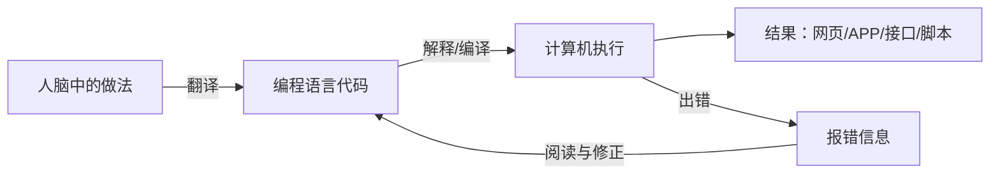
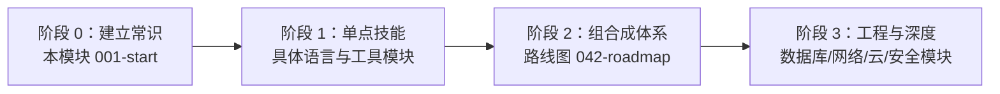

## 学习目标

读完并跟着做完这一篇，你不需要学会任何一门编程语言，但你会弄清楚三件事：

1. 编程到底是什么——它不是天赋型技能，而是一门可以拆解练习的手艺；
2. 软件开发者每天在做什么——帮你判断这条路是否值得投入；
3. 接下来 12 个月怎么走——本仓库为你准备了完整的路线，这一篇是地图的入口。

**前置知识：无。** 你只需要一台能正常使用的电脑（Windows、macOS 或 Linux 均可）和每天 1 到 2 小时的学习时间。

## 编程到底是什么

先破除一个误解：编程不是"和计算机说话的天赋"，而是**把你脑子里的做法，翻译成计算机能一步步执行的明确指令**。

考虑一个生活指令："把这份文件发给张三"。人能自动补全细节，计算机不能。你必须要说清楚：

- 文件在哪里（路径）；
- 用什么方式发（邮件？聊天工具？接口调用？）；
- 发给谁（准确地址）；
- 发失败怎么办（重试？报警？）。

把"张三能懂的话"翻译成"计算机能懂的话"，就是编程。翻译用的语言就是编程语言（Python、JavaScript、Java 等），它们之间的差异远小于中文和英文的差异——**你学会第一门语言后，第二门的学习成本会下降一半以上**。

注意流程图里的"出错"分支：**报错不是失败，而是日常工作的一部分**。职业开发者每天大部分时间在读报错、改代码、再运行。从第一行代码开始，你就要练习"读报错"这个核心技能。

## 软件开发者每天在做什么

一个典型的工作日大致是：

- **写代码约占 40%**：在已有项目上增加功能、修问题；
- **读代码约占 30%**：读懂同事写的代码，往往比写更重要；
- **调试约占 20%**：定位为什么程序行为和预期不一致；
- **沟通约占 10%**：评审别人的代码、写文档、对齐需求。

这意味着两件事：

1. **英语阅读量比想象中大**：报错信息、文档、变量名几乎都是英文。你不需要口语流利，但需要能读懂技术英语。从今天起，遇到报错不要直接复制翻译整句，先试着认出关键词（如 `not found`、`undefined`、`permission denied`）。
2. **"能跑起来"只是及格线**：代码还要让别人看得懂、改得动。好习惯从第一天养成本文后续篇章会反复强调。

关于 AI 的补充：2026 年的今天，AI 编程助手已经非常普及，但招聘市场对开发者的要求**反而更强调基础原理**——因为 AI 生成的代码需要人来判断对错、安全性和性能。零基础学编程，学的是"判断力"，这个 AI 替代不了。

## 为什么值得学：现实收益盘点

坦率地看 2026 年的就业市场（数据来自多家招聘趋势报告）：

- 软件开发岗位竞争比前几年激烈，初级岗位数量收缩，但**前端每 5 个职位中约有 1 个面向初级**，入门机会仍然存在；
- 企业最稳定的组合需求是 React + TypeScript + Node.js（全栈）与 Java/Go（后端）；
- 超过一半的技术岗位要求会使用 AI 工具协作开发。

对你的启示：**入行的关键是基础扎实加两三个拿得出手的项目**，而不是追逐最新框架。本仓库的路线图模块（[技术栈路线图](/roadmap/010-RoadmapOverview)）会把这句话展开成可执行的 12 个月计划。

即使不打算转行，编程也是强大的杠杆：

- 自动化重复劳动（批量改文件名、抓取数据、处理表格）；
- 理解数字世界的运行方式，不被"技术黑话"糊弄；
- 为转岗（产品、测试、运维、数据分析）提供技术底座。

## 学习的三个阶段：先知道整条路长什么样

零基础到能独立开发，通常经历三个阶段。本仓库的内容体系就是按这三个阶段组织的：

- **阶段 0（1 到 2 周）**：本模块。建立计算机常识、装好环境、学会用终端、写出前几行代码；
- **阶段 1（2 到 6 个月）**：选定一门主线语言深入。每个语言模块（如 JavaScript、Python、Java）内部都按"是什么 → 环境搭建 → 基础语法 → 进阶特性 → 工程实践"排序，文件名编号即学习顺序；
- **阶段 2（6 到 12 个月）**：按 [技术栈路线图](/roadmap/010-RoadmapOverview) 把多个模块串成就业方向，用项目把知识缝合成能力。

## 如何跟学本仓库

本仓库（FANDEX）有 Web、Android、桌面三端，内容同源。每个模块是一个文件夹，文件夹里的文档按文件名编号排序，**编号就是建议学习顺序**。

推荐的学习节奏：

1. **顺序读，不跳读**：模块内文档有前置依赖（页面上的"前置知识"字段），跳读容易断片；
2. **每篇文档至少动手一次**：文档中的"动手环节"是设计好的练习，跳过它们等于白读；
3. **报错自己先读 10 分钟**：实在解决不了再搜索或问 AI，把解决过程记下来；
4. **用进度系统跟学**：Web 端支持学习进度记录，学完一篇标记一篇，防止"感觉学了很多，其实没推进"。

遇到文档看不懂时，通常不是你的问题，而是缺前置。回退到该文档"前置知识"字段指向的内容补齐即可。

## 第一周行动清单

不要等到"准备好了"再开始。本周就做这五件事：

1. 读完本篇，然后阅读 [零基础计算机常识](/start/020-ComputerBasicsForBeginners)；
2. 跟着 [开发环境搭建](/start/030-DevEnvironmentSetup) 装好 VS Code 和命令行工具；
3. 跟着 [终端与命令行入门](/start/040-TerminalAndShellBasics) 完成 10 个基本命令练习；
4. 跟着 [第一门语言体验：JavaScript](/start/060-FirstProgramJavaScript) 在浏览器里写出你的前 20 行代码；
5. 读一遍 [全库学习路线总览](/start/080-LearningRouteOverview)，在心里给 12 个月画一张地图。

## 常见困惑

**"我数学不好，能学编程吗？"**——应用层开发需要的数学不超过初中水平（四则运算、取余、比较大小）。算法与数据结构模块需要一点逻辑思维，但那是逐步建立的，且大部分岗位面试只要求中等水平。需要数学的方向（图形学、机器学习）在路线图里有明确标注，你可以绕开它们入门。

**"我年纪大了 / 非科班 / 三十岁转行，来得及吗？"**——本仓库内容和路线不假设任何学历背景。诚实地说：转行者需要更强的项目作品来证明能力，时间投入通常比在校生多，但"逐个击破知识点"的学习方式和年龄无关。

**"先学哪门语言？"**——看目标方向，路线图里有逐方向的推荐。没有目标就先学 JavaScript（浏览器里就能跑，反馈最快）或 Python（语法最接近人类语言）。**语言只是工具，选一个开始比选"最好的"重要一百倍。**

**"教程看懂了，自己写就不会，怎么办？"**——这是必经阶段，说明你在"理解"和"输出"之间还差练习量。解法不是重看教程，而是：照着示例敲一遍（不看原文）→ 改一个小功能 → 从零重写。本模块后续文档的动手环节都按这个梯度设计。

## 检验清单

能回答以下问题，就可以进入下一篇：

- 编程的本质是什么？报错在开发流程中扮演什么角色？
- 开发者工作日里读代码和调试占多少比重？这对学习方法意味着什么？
- 三个学习阶段分别是什么？本仓库的模块编号如何对应学习顺序？
- 你打算每天投入多少时间？第一周的五件事是什么？

## 下一步

进入 [零基础计算机常识](/start/020-ComputerBasicsForBeginners)，把文件、路径、扩展名这些"开发者眼中的电脑"彻底搞清楚。
