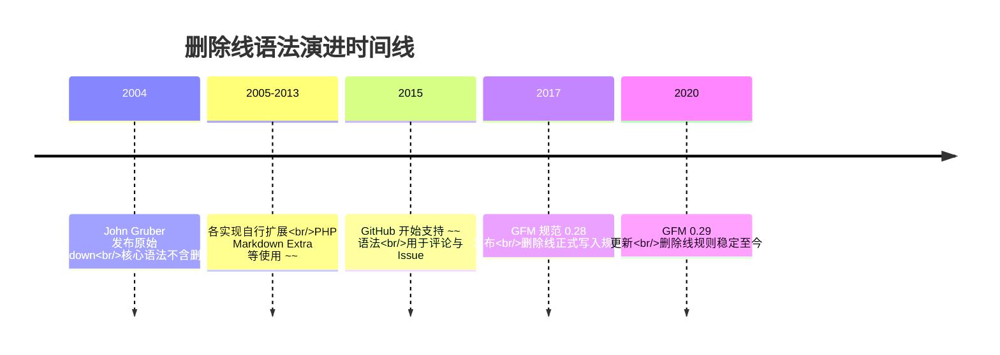

## 1. 历史动机与发展脉络

删除线的历史可以追溯到打字机时代。在还没有文档处理软件的年代，修订文本时人们用横线划过需要废弃的文字，同时保留这些文字以便审阅者看到原始内容。这种“保留原文并标记失效”的物理习惯，后来被 WYSIWYG 文字处理器中的删除线（strikethrough）字体样式继承。

在 HTML 规范演进中，删除线经历了两个关键阶段。HTML 4 提供了 `<s>` 和 `<strike>` 两个元素表示删除线，但语义含糊。HTML5 规范最终明确了分工：`<del>` 表示“已被删除的内容”（document changes 语义），`<s>` 表示“不再准确或不再相关的内容”（如商品原价），两者都默认渲染为删除线，但机器可读的语义不同。这一区分直接影响 Markdown 删除线的设计理念。

Markdown 最初由 John Gruber 于 2004 年发布，核心规范（Markdown.pl）并不包含删除线。2004 年后的十余年里，各个实现各自为政：PHP Markdown Extra 使用 `~~`，GitHub 的早期方言也曾支持 `==` 等变体。2017 年 GitHub 发布 GitHub Flavored Markdown 规范（GFM Spec 0.28 起步，当前 0.29），正式把 `~~text~~` 删除线语法纳入规范，并同时定义了 `<del>` 与 `<s>` 的解析优先级。此后，Typora、Obsidian、VS Code 内置 Markdown 预览、JetBrains IDE 的 Markdown 插件等主流工具普遍支持 `~~` 语法。

从标准化角度看，删除线至今不是 CommonMark 核心规范的一部分，而是 GFM 的扩展。这意味着在只实现 CommonMark 的渲染器中，`~~text~~` 会被原样输出为普通文本。理解这一历史脉络，可以帮助读者解释“为什么同样的 Markdown 文件在不同平台上渲染结果不同”这一高频问题。



上图的时间线说明：删除线从“编辑器私有扩展”走向“社区规范”用了十余年，这提醒文档作者在跨平台写作时，应当把删除线视为增强语法而不是基础语法。

## 2. 形式化定义

根据 GitHub Flavored Markdown 规范（GFM Spec 0.29，第 6.5 节），删除线的形式化规则如下。

语法形式：一个删除线扩展（strikethrough extension）由一个或多个波浪号字符 `~` 组成，两侧各有一个相同的定界符序列包裹被删除文本。GFM 规范要求定界符序列为两个波浪号 `~~`，即：

```
~~被删除的文本~~
```

解析规则：

第一，定界符必须紧贴内容。`~~text~~` 合法，而 `~~ text ~~` 中定界符与内容之间的空格可能导致解析结果不同——GFM 的实现（如 cmark-gfm）在定界符内侧存在空格时仍可能渲染，但为了兼容性，规范建议不在定界符内侧留空格。

第二，删除线内容可以是普通文本、行内代码、链接、强调等行内元素，但不能跨段落。也就是说，`~~a\n\nb~~` 不会形成一个跨两段的删除线，因为 Markdown 的块级结构优先于行内结构。

第三，定界符长度匹配。`~~` 必须成对出现；三个波浪号 `~~~` 在行首会被识别为围栏代码块标记，在行内则可能被解析为两个定界符与一个多余字符的组合。实践中最稳妥的做法是始终使用恰好两个波浪号。

第四，转义规则。在 GFM 中，反斜杠转义可以作用于波浪号：`\~~text~~` 会让第一个波浪号失去定界符作用，从而整个文本以字面形式输出。这一点与 CommonMark 的转义机制一致。

语义定义：删除线表达“该内容在时间线上曾经成立，但当前状态下已不成立或不再推荐”的语义。它不同于：

`<del>`：表示文档修订中物理删除的内容，配合 `<ins>` 使用形成修订对；

`<s>`：表示内容不再准确或不再相关，但并没有被删除（典型场景是电商页面的原价）；

普通文本：表示内容当前仍然有效。

用集合语言表达：设 D 为文档当前状态下的有效信息集合，S 为删除线标记的文本集合，则删除线文本表达的是“S 曾经属于 D 的历史事实，且当前 S 与 D 的隶属关系被显式否定”。这种“显式否定”正是删除线区别于直接删除的价值所在。


## 3. 理论推导与原理解析

### 3.1 为什么选择波浪号作为定界符

Markdown 的定界符设计遵循“与正文冲突最小”的原则。星号 `*` 与下划线 `_` 已被强调语法占用；反引号 `` ` `` 被行内代码占用；方括号被链接占用；而波浪号在英文文本中很少出现，只在少数词（如西班牙语 ñ 的替代写法、部分网络用语）中使用。选择 `~~` 作为删除线定界符，使得解析器在绝大多数正文中不会误触发。

### 3.2 解析优先级推导

cmark-gfm 的解析过程分为块级解析与行内解析两个阶段。在行内解析阶段，解析器按顺序扫描定界符：

第一步，扫描器遇到 `~` 字符时，检查其前后字符，判断它是否可能构成定界符运行（delimiter run）。连续的波浪号构成一个运行。

第二步，解析器根据左右侧是否紧跟空白判断定界符的“左翼/右翼”属性。左翼定界符可以开始一个删除线，右翼定界符可以结束一个删除线。

第三步，按照“内侧优先”的规则，匹配最近的一对定界符。这与强调语法共用同一套算法（CommonMark 的 delimiter stack），因此删除线与 `*`、`_` 可以嵌套解析。

第四步，输出节点。GFM 扩展将匹配的删除线节点输出为 `<del>` 元素（cmark-gfm 的默认行为），这也解释了为什么 GitHub 网页端渲染的 HTML 源码中使用 `<del>` 而不是 `<s>`。

### 3.3 嵌套与组合的解析结果

以下推导展示组合语法：

输入 `~~**重要内容**~~`：解析器先遇到删除线定界符，再遇到强调定界符。由于删除线定界符先入栈且内容包含强调，最终渲染为 `<del><strong>重要内容</strong></del>`，即带删除线的加粗文本。

输入 `` ~~`git checkout -- file`~~ ``：行内代码的解析优先级高于删除线，反引号先被消费为代码跨度，波浪号随后包裹整个代码跨度，渲染为 `<del><code>git checkout -- file</code></del>`。

输入 `~~[链接](https://example.com)~~`：链接解析发生在删除线内部，结果是一个被删除线包裹的可点击链接。

这些组合都遵循“先内层后外层”的解析直觉，与 HTML 的嵌套规则一致：`<del>` 可以包含 `<strong>`、`<code>`、`<a>` 等行内元素。

## 4. 代码示例（带详尽注释）

### 4.1 基础语法示例

下面的 Markdown 源码展示删除线的最基本用法：

```markdown
当前稳定版本为 v2.0.0，~~v1.9.0 已经停止维护~~。
```

渲染结果：当前稳定版本为 v2.0.0，~~v1.9.0 已经停止维护~~。

讲解：这段示例模拟发布说明中的典型场景——旧版本号仍然保留在文档中，但通过删除线明确告知读者该版本已停止维护。读者既能看到历史，又能立即判断现状。

### 4.2 与行内代码组合

```markdown
旧命令：~~`git checkout -- file`~~，新命令：`git restore file`。
```

讲解：`~~` 包裹反引号代码块时，删除线作用于代码内容。该示例同时完成两件事：一是告诉读者旧命令已被取代，二是给出新命令。这种“旧新对照”是变更文档的标准写法，GitHub 的迁移指南大量使用该模式。

### 4.3 与加粗和链接组合

```markdown
**重点：** 该接口~~已经废弃~~，请迁移到 [新接口文档](https://example.com/docs/v2)。
```

讲解：第一层 `**` 强调“重点”二字，第二层 `~~` 标记“已经废弃”，第三层链接指向迁移目标。三者互不干扰，说明删除线可以与行内元素自由组合。注意标记顺序：先写 `~~` 再写内容，内容中的链接使用完整 Markdown 链接语法。

### 4.4 任务清单中的删除线

GFM 任务清单与删除线的组合非常常见：

```markdown
- [x] 完成登录模块
- [x] ~~完成支付模块~~（需求变更，已取消）
- [ ] 完成退款模块
```

讲解：`[x]` 表示任务已完成，但第二个任务的需求被取消，因此用删除线标记任务文本，同时在括号中补充原因。这样看板既保留了历史记录，又不会被“已完成但实际取消”的任务误导。注意：删除线只作用于文本部分，复选框 `[x]` 本身不受影响。

### 4.5 表格中的删除线

```markdown
| 状态 | 版本 | 说明 |
| --- | --- | --- |
| 已废弃 | ~~v1.8.0~~ | 存在已知安全漏洞 |
| 当前 | v2.0.0 | 推荐使用 |
```

讲解：表格单元格内使用删除线完全合法，因为 GFM 表格的内容按行内语法解析。这种用法在依赖版本对比、软件兼容性矩阵中非常实用。

### 4.6 HTML 原生方案

当渲染器不支持 `~~` 时，可以直接使用 HTML 标签：

```html
<del>已删除的内容</del>
<s>不再准确的内容</s>
```

讲解：Markdown 允许内嵌 HTML，因此 `<del>` 与 `<s>` 是删除线的“保底方案”。两者的语义区别：`<del>` 表示文档修订中删除的内容，`<s>` 表示不再准确但保留的内容。GFM 渲染 `~~` 时默认输出 `<del>`。

### 4.7 JavaScript 动态标记删除线

在 Web 应用中，可能需要根据数据状态动态生成删除线。以 React 为例：

```jsx
function PriceTag({ original, current }) {
  // 当原价高于现价时，原价需要以删除线展示
  const showStrike = original > current;
  return (
    <span>
      {/* 条件渲染：满足条件才包裹 <s> 元素 */}
      {showStrike ? <s>{original} 元</s> : null}
      <strong> {current} 元</strong>
    </span>
  );
}
```

讲解：`<s>` 是 HTML 语义元素，适合表示“原价不再适用”；React 的条件渲染在布尔值为真时输出带删除线的原价。这种写法把数据状态映射为视觉状态，是电商前端的基础模式。

## 5. 对比分析

### 5.1 GFM 删除线与 HTML 标签对比

| 维度 | `~~text~~` | `<del>text</del>` | `<s>text</s>` |
| --- | --- | --- | --- |
| 语法类型 | Markdown 扩展 | HTML 元素 | HTML 元素 |
| 语义 | 通用删除/废弃 | 修订中删除的内容 | 不再准确的内容 |
| 可读性 | 高，源码简洁 | 中，标签冗长 | 中，标签冗长 |
| 兼容性 | 仅 GFM 系渲染器 | 所有 HTML 渲染器 | 所有 HTML 渲染器 |
| 典型场景 | 笔记、Issue、变更记录 | 版本 diff、修订对比 | 电商原价、过期信息 |

讲解：表格说明“语法简洁”与“兼容广泛”之间存在权衡。写作 Markdown 时优先用 `~~`；需要精确语义或跨渲染器兼容时用 HTML 标签。

### 5.2 与下划线/删除标记的对比

很多编辑器把删除线写作 `~~`，但也有少数平台使用其他标记（如 Wiki 语法中的 `--text--`、Confluence 的 `-text-`）。GFM 的 `~~` 之所以成为事实标准，是因为 GitHub 的体量带动了 cmark-gfm 的普及，后续 Typora、Obsidian、Notion 等产品跟随支持。

### 5.3 与直接删除文本的对比

直接删除文本丢失了历史信息，读者无法知道这里曾经存在过什么；删除线则保留原文并给出“失效”标记。在需要审计、追溯、对比的场景（变更记录、决策记录、迁移指南），删除线明显优于直接删除。在追求最终干净成品的场景（正式出版物），删除线则显得杂乱。

## 6. 常见陷阱与最佳实践

陷阱一：定界符两侧误加空格。`~~ 内容 ~~` 在部分渲染器中不会正确解析。最佳实践是让 `~~` 紧贴内容，即 `~~内容~~`。

陷阱二：使用单波浪号。`~text~` 在 GFM 中不是删除线（GFM 要求两个波浪号）。某些老式实现曾支持单波浪号，但不要依赖这一行为。

陷阱三：误把删除线用于正文强调。删除线表达“失效”，如果只是想弱化语气，应使用其他方式（如括号补充说明），否则读者会认为内容已废弃。

陷阱四：跨平台渲染不一致。在只实现 CommonMark 的渲染器中，`~~` 会原样显示。最佳实践是在团队内部约定 Markdown 引擎，或为关键文档提供渲染预览检查。

陷阱五：在标题中使用删除线。`## ~~旧标题~~` 虽然可以解析，但会造成目录与正文不一致、检索混乱，应避免。

陷阱六：与围栏代码块混淆。行首的三个波浪号 `~~~` 会被识别为代码块围栏。如果要在文档中讲解删除线语法本身，应使用四空格缩进代码块或转义波浪号。

最佳实践清单：

第一，删除线只用于表达“曾经成立、现在不成立”的语义，不用于表达语气；

第二，重要变更同时给出替代内容，避免只标记废弃不给方案；

第三，在多人协作仓库中，删除线配合提交记录使用，让 Git 历史与文档标记互为印证；

第四，自动化生成变更记录时，优先使用 `<del>` 标签以获得精确语义。

## 7. 工程实践

### 7.1 变更日志模板

把删除线嵌入 semver 风格的变更日志，可以让读者一眼看出版本的替代关系：

```markdown
## [2.0.0] - 2026-08-01

### 已废弃

- ~~CLI 参数 --old-flag~~，请使用 --new-flag
- ~~Node.js 16 支持~~，最低要求 Node.js 18

### 新增

- 支持增量构建
- 输出 JSON 报告
```

讲解：每个废弃项都附带替代方案，这是工程文档的黄金法则：告诉读者“旧的不行”的同时，必须告诉“新的怎么用”。

### 7.2 项目决策记录（ADR）中的应用

```markdown
# ADR-012：构建工具选型

## 状态

~~已接受~~ 已废弃（2026-07 更新）

## 背景

原决策基于 npm 7 的依赖解析行为……
```

讲解：ADR 的状态字段使用删除线表达决策生命周期，既保留决策历史，又明确当前状态。这一模式被许多开源项目采用，是“文档即历史”的典型实践。

### 7.3 与 Git 工作流的配合

GitHub 的 Pull Request 描述、Issue 评论天然支持 GFM 删除线。团队可以在任务模板中约定：任务被取消时在标题前加删除线，而不是关闭 Issue 后删除内容。例如：

```markdown
## 任务：~~实现旧版导出功能~~（已取消，改为 CSV 导出）
```

讲解：这保证任务历史完整，后续检索时也能通过删除线快速过滤失效任务。

## 8. 案例研究：修订型学习笔记的完整写法

场景：一名开发者维护个人学习笔记，记录 Python 版本特性的变更。

原始笔记：

```markdown
Python 3.9 的 dict 支持 `|` 合并运算符。
```

当 Python 3.10 发布后，笔记更新为：

```markdown
Python 3.9 的 dict 支持 `|` 合并运算符。
~~Python 3.9 是唯一支持该语法的版本。~~
Python 3.10 起 `match` 语句与 `|` 联合类型同时可用。
```

讲解：第一行保留为事实；第二行用删除线标记“唯一支持”这一过时结论；第三行补充新版本信息。整个笔记形成一条可读的时间线，读者不会误以为旧结论仍然成立。

扩展该模式到团队 Wiki：每个页面顶部维护“信息时效区”，过时内容不删除、不隐藏，而是用删除线标记并注明更新时间。配合自动化检查（如链接失效扫描），可以显著降低文档误导风险。

## 9. 知识要点总结与深入讲解

本节替代传统习题，以“提问—解释”的方式梳理核心知识点，但全部以讲解形式呈现，读者不需要答题，只需跟随解释建立认知。

关于语法形式：删除线的唯一标准写法是 `~~内容~~`，两个波浪号必须成对出现并紧贴内容。有人会问“为什么不是三个波浪号”，因为三波浪号在行首是代码块围栏，在行内解析也容易歧义。规范的保守选择是固定使用两个。

关于语义选择：`<del>` 与 `<s>` 的区别来自 HTML5 规范。`<del>` 表示内容被删除，通常与 `<ins>` 成对出现；`<s>` 表示内容不再准确但保留。GFM 把 `~~` 渲染为 `<del>`，因此在 GitHub 上看到删除线对应的 HTML 是 `<del>`。

关于嵌套：删除线可以与加粗、斜体、代码、链接自由嵌套，因为 cmark-gfm 使用统一的定界符栈解析所有行内标记。嵌套顺序决定最终 HTML 的层级，例如 `~~**文字**~~` 产生 `<del><strong>文字</strong></del>`。

关于兼容性：CommonMark 核心规范没有删除线，因此非 GFM 渲染器可能原样输出波浪号。跨平台写作时，要么确认目标平台支持 GFM，要么使用 `<del>`/`<s>` 标签兜底。

关于工程使用：删除线的价值在于保留历史、标记失效、支撑对比。滥用删除线（如用于语气强调）会破坏语义；正确的做法是让每个删除线文本都伴随替代信息或失效原因。

### 1. 历史动机与发展脉络

删除线的历史可以追溯到打字机时代。在还没有文档处理软件的年代，修订文本时人们用横线划过需要废弃的文字，同时保留这些文字以便审阅者看到原始内容。这种“保留原文并标记失效”的物理习惯，后来被 WYSIWYG 文字处理器中的删除线（strikethrough）字体样式继承。

在 HTML 规范演进中，删除线经历了两个关键阶段。HTML 4 提供了 `<s>` 和 `<strike>` 两个元素表示删除线，但语义含糊。HTML5 规范最终明确了分工：`<del>` 表示“已被删除的内容”（document changes 语义），`<s>` 表示“不再准确或不再相关的内容”（如商品原价），两者都默认渲染为删除线，但机器可读的语义不同。这一区分直接影响 Markdown 删除线的设计理念。

Markdown 最初由 John Gruber 于 2004 年发布，核心规范（Markdown.pl）并不包含删除线。2004 年后的十余年里，各个实现各自为政：PHP Markdown Extra 使用 `~~`，GitHub 的早期方言也曾支持 `==` 等变体。2017 年 GitHub 发布 GitHub Flavored Markdown 规范（GFM Spec 0.28 起步，当前 0.29），正式把 `~~text~~` 删除线语法纳入规范，并同时定义了 `<del>` 与 `<s>` 的解析优先级。此后，Typora、Obsidian、VS Code 内置 Markdown 预览、JetBrains IDE 的 Markdown 插件等主流工具普遍支持 `~~` 语法。

从标准化角度看，删除线至今不是 CommonMark 核心规范的一部分，而是 GFM 的扩展。这意味着在只实现 CommonMark 的渲染器中，`~~text~~` 会被原样输出为普通文本。理解这一历史脉络，可以帮助读者解释“为什么同样的 Markdown 文件在不同平台上渲染结果不同”这一高频问题。


上图的时间线说明：删除线从“编辑器私有扩展”走向“社区规范”用了十余年，这提醒文档作者在跨平台写作时，应当把删除线视为增强语法而不是基础语法。

### 2. 形式化定义

根据 GitHub Flavored Markdown 规范（GFM Spec 0.29，第 6.5 节），删除线的形式化规则如下。

语法形式：一个删除线扩展（strikethrough extension）由一个或多个波浪号字符 `~` 组成，两侧各有一个相同的定界符序列包裹被删除文本。GFM 规范要求定界符序列为两个波浪号 `~~`，即：

```
~~被删除的文本~~
```

解析规则：

第一，定界符必须紧贴内容。`~~text~~` 合法，而 `~~ text ~~` 中定界符与内容之间的空格可能导致解析结果不同——GFM 的实现（如 cmark-gfm）在定界符内侧存在空格时仍可能渲染，但为了兼容性，规范建议不在定界符内侧留空格。

第二，删除线内容可以是普通文本、行内代码、链接、强调等行内元素，但不能跨段落。也就是说，`~~a\n\nb~~` 不会形成一个跨两段的删除线，因为 Markdown 的块级结构优先于行内结构。

第三，定界符长度匹配。`~~` 必须成对出现；三个波浪号 `~~~` 在行首会被识别为围栏代码块标记，在行内则可能被解析为两个定界符与一个多余字符的组合。实践中最稳妥的做法是始终使用恰好两个波浪号。

第四，转义规则。在 GFM 中，反斜杠转义可以作用于波浪号：`\~~text~~` 会让第一个波浪号失去定界符作用，从而整个文本以字面形式输出。这一点与 CommonMark 的转义机制一致。

语义定义：删除线表达“该内容在时间线上曾经成立，但当前状态下已不成立或不再推荐”的语义。它不同于：

`<del>`：表示文档修订中物理删除的内容，配合 `<ins>` 使用形成修订对；

`<s>`：表示内容不再准确或不再相关，但并没有被删除（典型场景是电商页面的原价）；

普通文本：表示内容当前仍然有效。

用集合语言表达：设 D 为文档当前状态下的有效信息集合，S 为删除线标记的文本集合，则删除线文本表达的是“S 曾经属于 D 的历史事实，且当前 S 与 D 的隶属关系被显式否定”。这种“显式否定”正是删除线区别于直接删除的价值所在。


### 3. 理论推导与原理解析

#### 3.1 为什么选择波浪号作为定界符

Markdown 的定界符设计遵循“与正文冲突最小”的原则。星号 `*` 与下划线 `_` 已被强调语法占用；反引号 `` ` `` 被行内代码占用；方括号被链接占用；而波浪号在英文文本中很少出现，只在少数词（如西班牙语 ñ 的替代写法、部分网络用语）中使用。选择 `~~` 作为删除线定界符，使得解析器在绝大多数正文中不会误触发。

#### 3.2 解析优先级推导

cmark-gfm 的解析过程分为块级解析与行内解析两个阶段。在行内解析阶段，解析器按顺序扫描定界符：

第一步，扫描器遇到 `~` 字符时，检查其前后字符，判断它是否可能构成定界符运行（delimiter run）。连续的波浪号构成一个运行。

第二步，解析器根据左右侧是否紧跟空白判断定界符的“左翼/右翼”属性。左翼定界符可以开始一个删除线，右翼定界符可以结束一个删除线。

第三步，按照“内侧优先”的规则，匹配最近的一对定界符。这与强调语法共用同一套算法（CommonMark 的 delimiter stack），因此删除线与 `*`、`_` 可以嵌套解析。

第四步，输出节点。GFM 扩展将匹配的删除线节点输出为 `<del>` 元素（cmark-gfm 的默认行为），这也解释了为什么 GitHub 网页端渲染的 HTML 源码中使用 `<del>` 而不是 `<s>`。

#### 3.3 嵌套与组合的解析结果

以下推导展示组合语法：

输入 `~~**重要内容**~~`：解析器先遇到删除线定界符，再遇到强调定界符。由于删除线定界符先入栈且内容包含强调，最终渲染为 `<del><strong>重要内容</strong></del>`，即带删除线的加粗文本。

输入 `` ~~`git checkout -- file`~~ ``：行内代码的解析优先级高于删除线，反引号先被消费为代码跨度，波浪号随后包裹整个代码跨度，渲染为 `<del><code>git checkout -- file</code></del>`。

输入 `~~[链接](https://example.com)~~`：链接解析发生在删除线内部，结果是一个被删除线包裹的可点击链接。

这些组合都遵循“先内层后外层”的解析直觉，与 HTML 的嵌套规则一致：`<del>` 可以包含 `<strong>`、`<code>`、`<a>` 等行内元素。

### 4. 代码示例（带详尽注释）

#### 4.1 基础语法示例

下面的 Markdown 源码展示删除线的最基本用法：

```markdown
当前稳定版本为 v2.0.0，~~v1.9.0 已经停止维护~~。
```

渲染结果：当前稳定版本为 v2.0.0，~~v1.9.0 已经停止维护~~。

讲解：这段示例模拟发布说明中的典型场景——旧版本号仍然保留在文档中，但通过删除线明确告知读者该版本已停止维护。读者既能看到历史，又能立即判断现状。

#### 4.2 与行内代码组合

```markdown
旧命令：~~`git checkout -- file`~~，新命令：`git restore file`。
```

讲解：`~~` 包裹反引号代码块时，删除线作用于代码内容。该示例同时完成两件事：一是告诉读者旧命令已被取代，二是给出新命令。这种“旧新对照”是变更文档的标准写法，GitHub 的迁移指南大量使用该模式。

#### 4.3 与加粗和链接组合

```markdown
**重点：** 该接口~~已经废弃~~，请迁移到 [新接口文档](https://example.com/docs/v2)。
```

讲解：第一层 `**` 强调“重点”二字，第二层 `~~` 标记“已经废弃”，第三层链接指向迁移目标。三者互不干扰，说明删除线可以与行内元素自由组合。注意标记顺序：先写 `~~` 再写内容，内容中的链接使用完整 Markdown 链接语法。

#### 4.4 任务清单中的删除线

GFM 任务清单与删除线的组合非常常见：

```markdown
- [x] 完成登录模块
- [x] ~~完成支付模块~~（需求变更，已取消）
- [ ] 完成退款模块
```

讲解：`[x]` 表示任务已完成，但第二个任务的需求被取消，因此用删除线标记任务文本，同时在括号中补充原因。这样看板既保留了历史记录，又不会被“已完成但实际取消”的任务误导。注意：删除线只作用于文本部分，复选框 `[x]` 本身不受影响。

#### 4.5 表格中的删除线

```markdown
| 状态 | 版本 | 说明 |
| --- | --- | --- |
| 已废弃 | ~~v1.8.0~~ | 存在已知安全漏洞 |
| 当前 | v2.0.0 | 推荐使用 |
```

讲解：表格单元格内使用删除线完全合法，因为 GFM 表格的内容按行内语法解析。这种用法在依赖版本对比、软件兼容性矩阵中非常实用。

#### 4.6 HTML 原生方案

当渲染器不支持 `~~` 时，可以直接使用 HTML 标签：

```html
<del>已删除的内容</del>
<s>不再准确的内容</s>
```

讲解：Markdown 允许内嵌 HTML，因此 `<del>` 与 `<s>` 是删除线的“保底方案”。两者的语义区别：`<del>` 表示文档修订中删除的内容，`<s>` 表示不再准确但保留的内容。GFM 渲染 `~~` 时默认输出 `<del>`。

#### 4.7 JavaScript 动态标记删除线

在 Web 应用中，可能需要根据数据状态动态生成删除线。以 React 为例：

```jsx
function PriceTag({ original, current }) {
  // 当原价高于现价时，原价需要以删除线展示
  const showStrike = original > current;
  return (
    <span>
      {/* 条件渲染：满足条件才包裹 <s> 元素 */}
      {showStrike ? <s>{original} 元</s> : null}
      <strong> {current} 元</strong>
    </span>
  );
}
```

讲解：`<s>` 是 HTML 语义元素，适合表示“原价不再适用”；React 的条件渲染在布尔值为真时输出带删除线的原价。这种写法把数据状态映射为视觉状态，是电商前端的基础模式。

### 5. 对比分析

#### 5.1 GFM 删除线与 HTML 标签对比

| 维度 | `~~text~~` | `<del>text</del>` | `<s>text</s>` |
| --- | --- | --- | --- |
| 语法类型 | Markdown 扩展 | HTML 元素 | HTML 元素 |
| 语义 | 通用删除/废弃 | 修订中删除的内容 | 不再准确的内容 |
| 可读性 | 高，源码简洁 | 中，标签冗长 | 中，标签冗长 |
| 兼容性 | 仅 GFM 系渲染器 | 所有 HTML 渲染器 | 所有 HTML 渲染器 |
| 典型场景 | 笔记、Issue、变更记录 | 版本 diff、修订对比 | 电商原价、过期信息 |

讲解：表格说明“语法简洁”与“兼容广泛”之间存在权衡。写作 Markdown 时优先用 `~~`；需要精确语义或跨渲染器兼容时用 HTML 标签。

#### 5.2 与下划线/删除标记的对比

很多编辑器把删除线写作 `~~`，但也有少数平台使用其他标记（如 Wiki 语法中的 `--text--`、Confluence 的 `-text-`）。GFM 的 `~~` 之所以成为事实标准，是因为 GitHub 的体量带动了 cmark-gfm 的普及，后续 Typora、Obsidian、Notion 等产品跟随支持。

#### 5.3 与直接删除文本的对比

直接删除文本丢失了历史信息，读者无法知道这里曾经存在过什么；删除线则保留原文并给出“失效”标记。在需要审计、追溯、对比的场景（变更记录、决策记录、迁移指南），删除线明显优于直接删除。在追求最终干净成品的场景（正式出版物），删除线则显得杂乱。

### 6. 常见陷阱与最佳实践

陷阱一：定界符两侧误加空格。`~~ 内容 ~~` 在部分渲染器中不会正确解析。最佳实践是让 `~~` 紧贴内容，即 `~~内容~~`。

陷阱二：使用单波浪号。`~text~` 在 GFM 中不是删除线（GFM 要求两个波浪号）。某些老式实现曾支持单波浪号，但不要依赖这一行为。

陷阱三：误把删除线用于正文强调。删除线表达“失效”，如果只是想弱化语气，应使用其他方式（如括号补充说明），否则读者会认为内容已废弃。

陷阱四：跨平台渲染不一致。在只实现 CommonMark 的渲染器中，`~~` 会原样显示。最佳实践是在团队内部约定 Markdown 引擎，或为关键文档提供渲染预览检查。

陷阱五：在标题中使用删除线。`## ~~旧标题~~` 虽然可以解析，但会造成目录与正文不一致、检索混乱，应避免。

陷阱六：与围栏代码块混淆。行首的三个波浪号 `~~~` 会被识别为代码块围栏。如果要在文档中讲解删除线语法本身，应使用四空格缩进代码块或转义波浪号。

最佳实践清单：

第一，删除线只用于表达“曾经成立、现在不成立”的语义，不用于表达语气；

第二，重要变更同时给出替代内容，避免只标记废弃不给方案；

第三，在多人协作仓库中，删除线配合提交记录使用，让 Git 历史与文档标记互为印证；

第四，自动化生成变更记录时，优先使用 `<del>` 标签以获得精确语义。

### 7. 工程实践

#### 7.1 变更日志模板

把删除线嵌入 semver 风格的变更日志，可以让读者一眼看出版本的替代关系：

```markdown
### [2.0.0] - 2026-08-01

#### 已废弃

- ~~CLI 参数 --old-flag~~，请使用 --new-flag
- ~~Node.js 16 支持~~，最低要求 Node.js 18

#### 新增

- 支持增量构建
- 输出 JSON 报告
```

讲解：每个废弃项都附带替代方案，这是工程文档的黄金法则：告诉读者“旧的不行”的同时，必须告诉“新的怎么用”。

#### 7.2 项目决策记录（ADR）中的应用

```markdown
# ADR-012：构建工具选型

### 状态

~~已接受~~ 已废弃（2026-07 更新）

### 背景

原决策基于 npm 7 的依赖解析行为……
```

讲解：ADR 的状态字段使用删除线表达决策生命周期，既保留决策历史，又明确当前状态。这一模式被许多开源项目采用，是“文档即历史”的典型实践。

#### 7.3 与 Git 工作流的配合

GitHub 的 Pull Request 描述、Issue 评论天然支持 GFM 删除线。团队可以在任务模板中约定：任务被取消时在标题前加删除线，而不是关闭 Issue 后删除内容。例如：

```markdown
### 任务：~~实现旧版导出功能~~（已取消，改为 CSV 导出）
```

讲解：这保证任务历史完整，后续检索时也能通过删除线快速过滤失效任务。

### 8. 案例研究：修订型学习笔记的完整写法

场景：一名开发者维护个人学习笔记，记录 Python 版本特性的变更。

原始笔记：

```markdown
Python 3.9 的 dict 支持 `|` 合并运算符。
```

当 Python 3.10 发布后，笔记更新为：

```markdown
Python 3.9 的 dict 支持 `|` 合并运算符。
~~Python 3.9 是唯一支持该语法的版本。~~
Python 3.10 起 `match` 语句与 `|` 联合类型同时可用。
```

讲解：第一行保留为事实；第二行用删除线标记“唯一支持”这一过时结论；第三行补充新版本信息。整个笔记形成一条可读的时间线，读者不会误以为旧结论仍然成立。

扩展该模式到团队 Wiki：每个页面顶部维护“信息时效区”，过时内容不删除、不隐藏，而是用删除线标记并注明更新时间。配合自动化检查（如链接失效扫描），可以显著降低文档误导风险。

### 9. 知识要点总结与深入讲解

本节替代传统习题，以“提问—解释”的方式梳理核心知识点，但全部以讲解形式呈现，读者不需要答题，只需跟随解释建立认知。

关于语法形式：删除线的唯一标准写法是 `~~内容~~`，两个波浪号必须成对出现并紧贴内容。有人会问“为什么不是三个波浪号”，因为三波浪号在行首是代码块围栏，在行内解析也容易歧义。规范的保守选择是固定使用两个。

关于语义选择：`<del>` 与 `<s>` 的区别来自 HTML5 规范。`<del>` 表示内容被删除，通常与 `<ins>` 成对出现；`<s>` 表示内容不再准确但保留。GFM 把 `~~` 渲染为 `<del>`，因此在 GitHub 上看到删除线对应的 HTML 是 `<del>`。

关于嵌套：删除线可以与加粗、斜体、代码、链接自由嵌套，因为 cmark-gfm 使用统一的定界符栈解析所有行内标记。嵌套顺序决定最终 HTML 的层级，例如 `~~**文字**~~` 产生 `<del><strong>文字</strong></del>`。

关于兼容性：CommonMark 核心规范没有删除线，因此非 GFM 渲染器可能原样输出波浪号。跨平台写作时，要么确认目标平台支持 GFM，要么使用 `<del>`/`<s>` 标签兜底。

关于工程使用：删除线的价值在于保留历史、标记失效、支撑对比。滥用删除线（如用于语气强调）会破坏语义；正确的做法是让每个删除线文本都伴随替代信息或失效原因。

### 11. 延伸阅读
读者可以在以下资源中继续深入学习：
---
#### 1. 删除线语法

##### 1.1 基本语法

删除线使用两个波浪号 `~~` 包裹文本：

```markdown
~~这段文字会被加上删除线~~
```

渲染结果：~~这段文字会被加上删除线~~

##### 1.2 语法规则

| 规则       | 正确       | 错误                         |
| :--------- | :--------- | :--------------------------- |
| 两个波浪号 | `~~文本~~` | `~文本~`（单波浪号无效）     |
| 紧贴文本   | `~~文本~~` | `~~ 文本 ~~`（空格会被保留） |
| 成对出现   | `~~文本~~` | `~~文本`（未闭合）           |

##### 1.3 与强调组合

删除线可以与其他行内格式组合使用：

```markdown
~~_删除且斜体_~~
~~**删除且粗体**~~
~~**_删除且粗斜体_**~~
~~`删除的代码`~~
**~~粗体且删除~~**
```

#### 1. 使用场景

##### 2.1 价格标注

```markdown
限时优惠：~~¥299~~ ¥199
```

渲染：~~¥299~~ ¥199

##### 2.2 文档修订

```markdown
项目使用 ~~Webpack~~ Vite 作为构建工具。
```

渲染：项目使用 ~~Webpack~~ Vite 作为构建工具。

##### 2.3 废弃标记

```markdown
- ~~旧版 API 已废弃~~
- 新版 API 请参考 v3 文档
```

##### 2.4 任务列表

```markdown
- [x] ~~需求分析~~ 已完成
- [ ] 开发实现
```

##### 2.5 变更记录

```markdown
#### v2.0.0 变更

- ~~`oldMethod()`~~ → `newMethod()`
- ~~`Config.default`~~ → `Config.defaults`
```

#### 2. HTML 替代

当平台不支持 GFM 删除线时，可以使用 HTML 标签：

```markdown
<s>这段文字会被加上删除线</s>

<del>这段文字会被加上删除线</del>

<strike>这段文字会被加上删除线</strike>
```

三种标签的区别：

| 标签       | HTML 标准 | 语义               | 推荐度 |
| :--------- | :-------- | :----------------- | :----- |
| `<del>`    | HTML5     | 表示已删除的内容   | 高 |
| `<s>`      | HTML5     | 表示不再准确的内容 | 中   |
| `<strike>` | 已废弃    | 无语义             | 低     |

`<del>` 标签还可以添加属性：

```markdown
<del datetime="2026-06-14">已删除的内容</del>

<del cite="https://example.com/reason">删除原因见链接</del>
```

#### 3. 跨平台支持

| 平台           | `~~语法~~` | `<del>` | `<s>` |
| :------------- | :--------- | :------ | :---- |
| **GitHub**     |            |         |       |
| **GitLab**     |            |         |       |
| **CommonMark** |            |         |       |
| **Obsidian**   |            |         |       |
| **Typora**     |            |         |       |
| **Hugo**       | （需配置） |         |       |
| **Jekyll**     | （需插件） |         |       |

#### 4. 注意事项

##### 5.1 常见问题

- **中文间距**：`~~中文~~` 在某些渲染器中可能显示异常，建议测试
- **嵌套问题**：`~~**文本**~~` 可以工作，但 `**~~文本~~**` 在某些解析器中结果不同
- **行内代码**：`~~`代码``~~` 中删除线不会作用于代码内容

##### 5.2 可访问性

屏幕阅读器对删除线的处理方式不同：

- 部分阅读器会朗读"删除开始...删除结束"
- 部分阅读器直接跳过删除线内容
- 建议在重要场景使用文字说明替代纯删除线
#### 基本语法

**单行写法：使用双波浪号包裹删除线**
`~~<文本>~~`
```markdown
~~这段文字会被加上删除线~~
```

---

#### 语法规则

**单行写法：双波浪号必须成对出现**
`~~<文本>~~`
```markdown
~~正确写法~~
```

**错误写法：单波浪号无效**
`~<文本>~`
```markdown
~错误写法~（单波浪号无效）
```

**错误写法：未闭合标记**
`~~<文本>`
```markdown
~~ 未闭合（缺少结束标记）
```

**基本写法：波浪号与文本之间不能有空格**
`~~<文本>~~`
```markdown
~~正确~~
```

**错误写法：有空格时标记不生效**
`~~ <文本> ~~`
```markdown
~~ 错误 ~~（空格会被保留）
```

---

#### 与其他格式组合

**单行写法：删除线与斜体组合**
`~~_<文本>_~~`
```markdown
~~_删除且斜体_~~
```

**单行写法：删除线与粗体组合**
`~~**<文本>**~~`
```markdown
~~**删除且粗体**~~
```

**单行写法：删除线与粗斜体组合**
`~~**_<文本>_**~~`
```markdown
~~**_删除且粗斜体_**~~
```

**单行写法：删除线与行内代码组合**
`~~`<代码>`~~`
```markdown
~~`删除的代码`~~
```

---

#### HTML 替代

**单行写法：使用 del 标签**
`<del><文本></del>`
```markdown
<del>这段文字会被加上删除线</del>
```

**单行写法：使用 s 标签**
`<s><文本></s>`
```markdown
<s>这段文字会被加上删除线</s>
```

**单行写法：使用 strike 标签**
`<strike><文本></strike>`
```markdown
<strike>这段文字会被加上删除线</strike>
```

**单行写法：del 标签带日期属性**
`<del datetime="<日期>"><文本></del>`
```markdown
<del datetime="2026-06-14">已删除的内容</del>
```

**单行写法：del 标签带引用属性**
`<del cite="<引用URL>"><文本></del>`
```markdown
<del cite="https://example.com/reason">删除原因见链接</del>
```

---

#### 使用场景

**单行写法：价格标注**
`~~<原价>~~ <现价>`
```markdown
限时优惠：~~¥299~~ ¥199
```

**单行写法：文档修订**
`~~<旧内容>~~ <新内容>`
```markdown
项目使用 ~~Webpack~~ Vite 作为构建工具。
```

**换行写法：变更记录列表**
`- ~~<旧方法>~~ → <新方法>`
```markdown
- ~~`oldMethod()`~~ → `newMethod()`
- ~~`Config.default`~~ → `Config.defaults`
```
