> **Layer 2 专业层标注**：图表按需学习，先掌握基础语法再学绘图。

## 1. Mermaid 概述

### 1.1 什么是 Mermaid

Mermaid 是一种基于文本的图表描述语言，允许在 Markdown 中使用代码块创建图表。它将图表定义从图形编辑器转移到文本，使图表可以纳入版本控制。

### 1.2 基本语法

````markdown
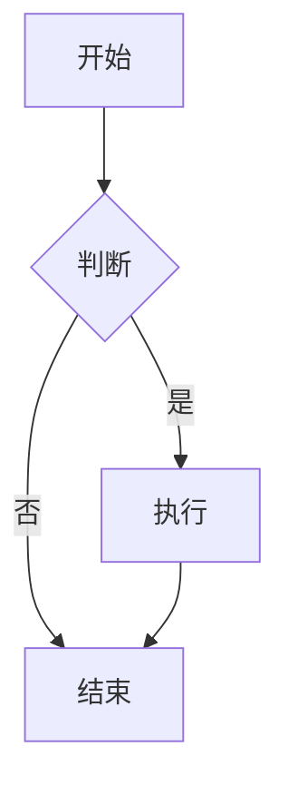
````

### 1.3 支持的图表类型

| 图表类型     | 关键字            | 用途               |
| :----------- | :---------------- | :----------------- |
| **流程图**   | `graph`           | 算法流程、业务流程 |
| **时序图**   | `sequenceDiagram` | 交互流程、API 调用 |
| **甘特图**   | `gantt`           | 项目进度、任务排期 |
| **类图**     | `classDiagram`    | 面向对象设计       |
| **状态图**   | `stateDiagram-v2` | 状态机、生命周期   |
| **ER 图**    | `erDiagram`       | 数据库设计         |
| **饼图**     | `pie`             | 数据占比           |
| **思维导图** | `mindmap`         | 知识结构           |
| **Git 图**   | `gitGraph`        | 分支策略           |

## 2. 流程图

### 2.1 方向

| 关键字      | 方向     |
| :---------- | :------- |
| `TB` / `TD` | 从上到下 |
| `BT`        | 从下到上 |
| `LR`        | 从左到右 |
| `RL`        | 从右到左 |

### 2.2 节点形状

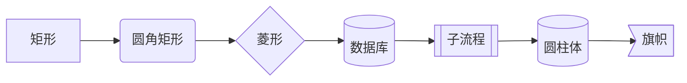

| 语法       | 形状     | 用途      |
| :--------- | :------- | :-------- |
| `[文本]`   | 矩形     | 普通步骤  |
| `(文本)`   | 圆角矩形 | 开始/结束 |
| `{文本}`   | 菱形     | 判断/条件 |
| `[(文本)]` | 圆柱体   | 数据库    |
| `[[文本]]` | 子流程   | 子过程    |
| `((文本))` | 圆形     | 连接点    |

### 2.3 连接线

| 语法 | 样式 | 说明 |
| :----- | :--------- | :-------- | ------ | -------- |
| `-->` | 实线箭头 | 默认连接 |
| `---` | 实线无箭头 | 无方向 |
| `-.->` | 虚线箭头 | 可选/条件 |
| `==>` | 粗线箭头 | 强调 |
| `-->   | 文本       | ` | 带标签 | 条件说明 |

### 2.4 完整示例

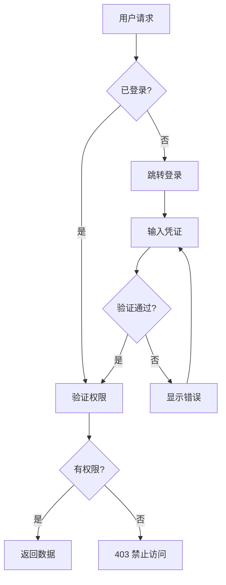

## 3. 时序图

### 3.1 基本语法

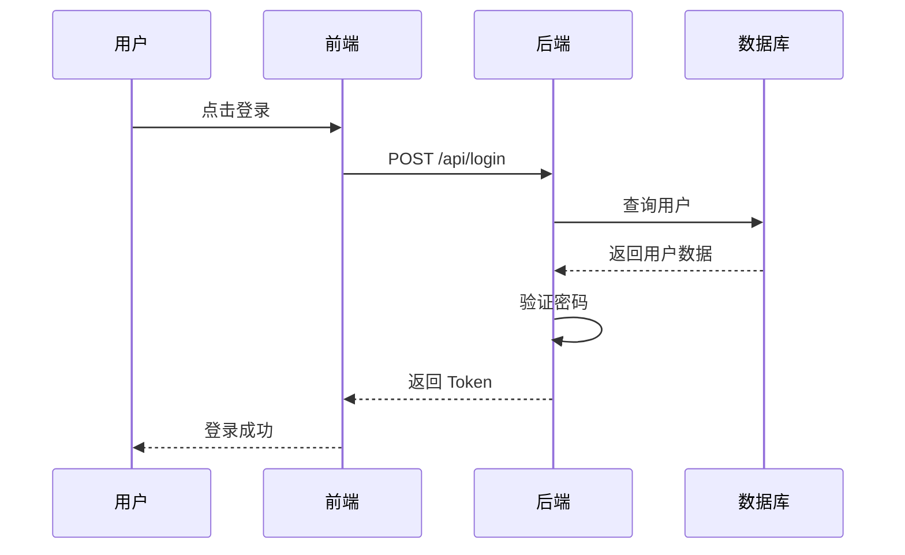

### 3.2 消息类型

| 语法   | 样式         | 说明      |
| :----- | :----------- | :-------- |
| `->>`  | 实线箭头     | 同步请求  |
| `-->>` | 虚线箭头     | 返回/响应 |
| `--)`  | 实线开放箭头 | 异步消息  |
| `--)`  | 虚线开放箭头 | 异步响应  |

### 3.3 高级特性

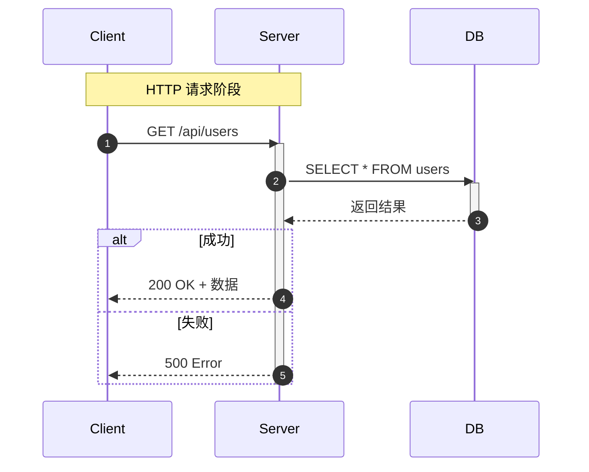

- `autonumber`：自动编号
- `Note over A,B`：跨参与者注释
- `activate`/`deactivate`：显示激活状态
- `alt`/`else`：条件分支
- `loop`：循环
- `opt`：可选

## 4. 甘特图

### 4.1 基本语法

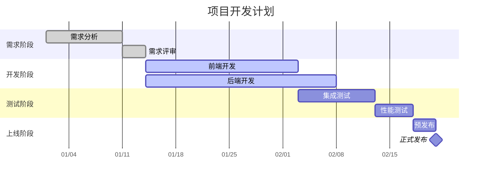

### 4.2 任务状态

| 关键字      | 样式             | 说明           |
| :---------- | :--------------- | :------------- |
| `done`      | 已完成（灰色）   | 已完成的任务   |
| `active`    | 进行中（蓝色）   | 当前执行的任务 |
| （默认）    | 未开始（浅色）   | 待执行的任务   |
| `milestone` | 里程碑（菱形）   | 关键节点       |
| `crit`      | 关键路径（红色） | 必须按时完成   |

## 5. 类图

### 5.1 基本语法

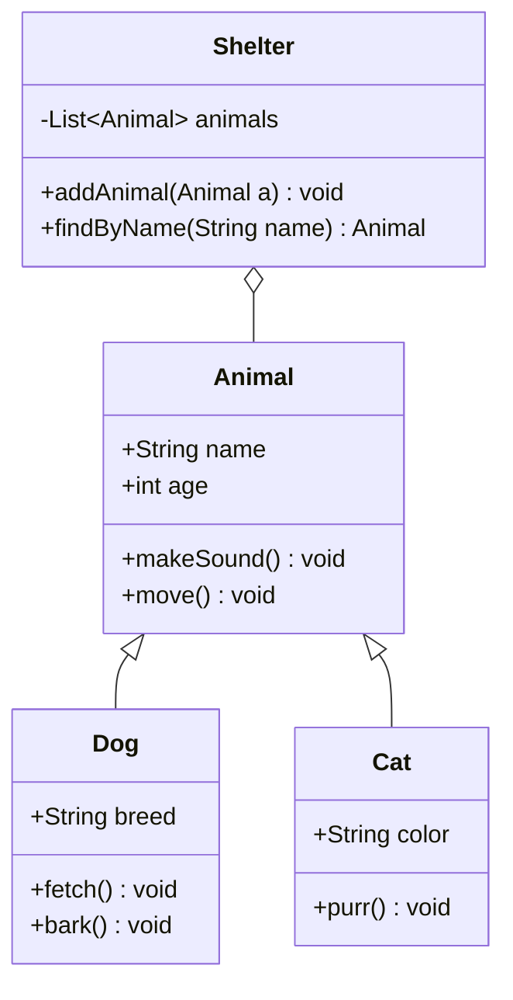

### 5.2 关系类型

| 语法    | 关系         | 说明                 |
| :------ | :----------- | :------------------- |
| `<\|--` | 继承         | 子类继承父类         |
| `*\--`  | 组合         | 强拥有，生命周期一致 |
| `o--`   | 聚合         | 弱拥有，可独立存在   |
| `-->`   | 关联         | 单向引用             |
| `--`    | 关联（双向） | 双向引用             |
| `..>`   | 依赖         | 使用关系             |
| `..\|>` | 实现         | 接口实现             |

## 6. 状态图

### 6.1 基本语法

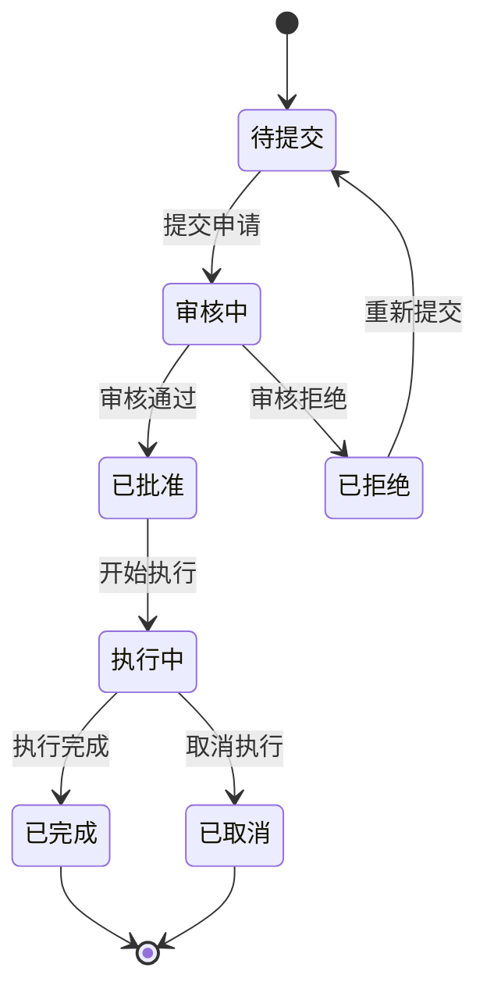

### 6.2 复合状态

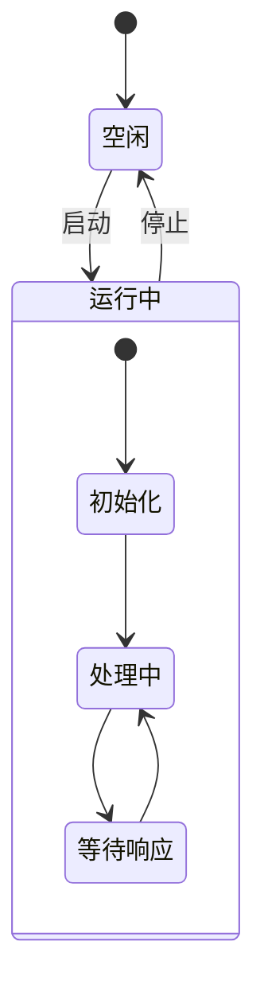

## 7. 平台支持

| 平台           | Mermaid 支持 | 说明                |
| :------------- | :----------- | :------------------ |
| **GitHub**     |              | 原生支持            |
| **GitLab**     |              | 原生支持            |
| **Obsidian**   |              | 原生支持            |
| **Typora**     |              | 原生支持            |
| **Hugo**       |              | 需 shortcode 或插件 |
| **Jekyll**     |              | 需插件              |
| **CommonMark** |              | 不支持              |

## 8. 调试技巧

- 使用 [Mermaid Live Editor](https://mermaid.live/) 在线编辑和预览
- 语法错误时图表不渲染，检查控制台错误信息
- 节点 ID 不能包含空格，使用文本标签代替
- 中文文本在某些渲染器中可能需要引号包裹
## 代码块基础

**基本写法：插入 Mermaid 图表**
` ```mermaid ` 与 ` ``` `
````markdown
# 用 mermaid 代码块标识图表

````
---

## 流程图（flowchart）

**基本写法：基础流程图**
`graph <方向>`
`    <节点A> --> <节点B>`
````markdown
# 自上而下的流程图
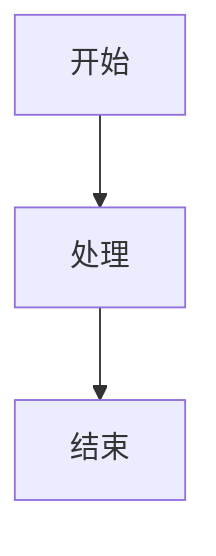
````

---

**基本写法：图表方向**
`graph <方向>`
````markdown
# TD/TB 自上而下，LR 从左到右，RL 从右到左，BT 自下而上
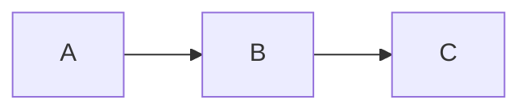
````

---

**基本写法：节点形状**
`<节点>[<文本>]`、`<节点>(<文本>)`、`<节点>{<文本>}`
````markdown
# 不同括号表示不同形状
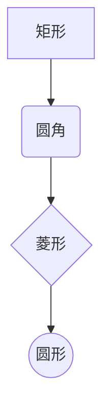
````

---

**基本写法：带文本的连线**
`<节点A> -- <文本> --> <节点B>`
````markdown
# 连线上标注说明文字
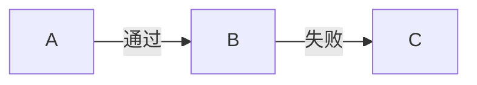
````

---

**基本写法：虚线与粗线**
`<节点A> -.-> <节点B>`、`<节点A> ==> <节点B>`
````markdown
# 虚线箭头与粗线箭头
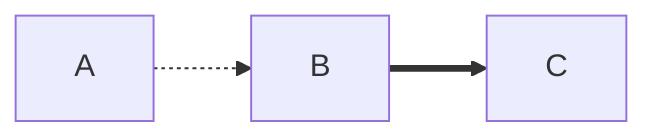
````

---

**基本写法：子图分组**
`subgraph <名称>` ... `end`
````markdown
# 用子图对节点分组
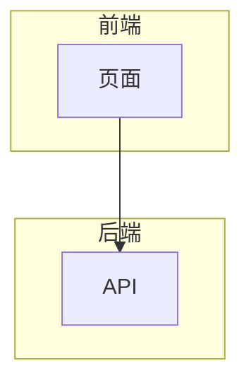
````

---

## 时序图（sequence）

**基本写法：基础时序图**
`sequenceDiagram`
`    <参与者A>->> <参与者B>: <消息>`
````markdown
# 参与者之间的消息交互
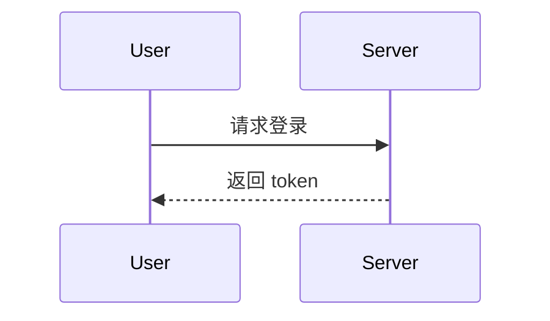
````

---

**基本写法：参与者别名**
`participant <别名> as <显示名>`
````markdown
# 为参与者设置显示别名
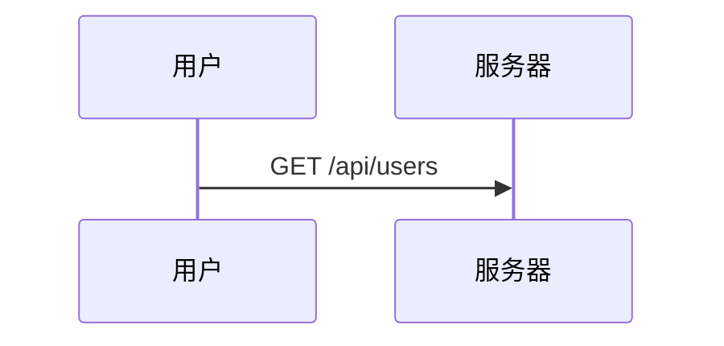
````

---

**基本写法：消息类型**
`->>` 实线箭头，`-->>` 虚线箭头，`--)` 异步实线
````markdown
# 不同箭头表示不同消息类型
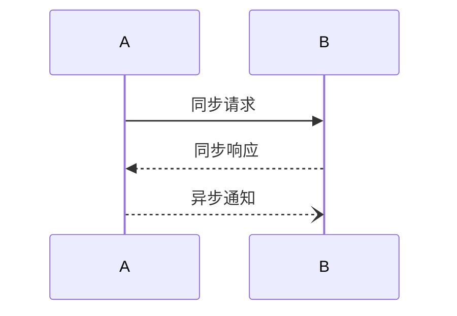
````

---

**基本写法：激活与停用**
`activate <参与者>` 与 `deactivate <参与者>`
````markdown
# 标记参与者激活时段
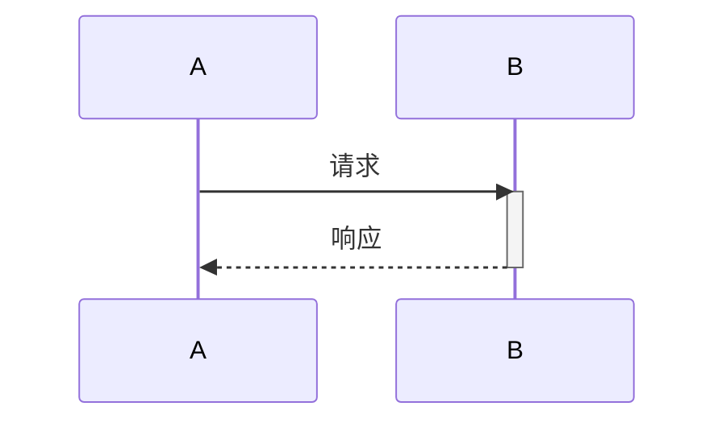
````

---

**基本写法：注释与分组**
`Note over <参与者>: <说明>`、`loop <描述>` ... `end`
````markdown
# 添加注释与循环块
```mermaid
sequenceDiagram
    participant A
    participant B
    loop 每分钟
        A->>B: 心跳
        Note over B: 处理心跳
    end
```
````

---

**基本写法：条件分支**
`alt <条件>` ... `else` ... `end`
````markdown
# 条件分支结构
```mermaid
sequenceDiagram
    A->>B: 请求
    alt 成功
        B-->>A: 数据
    else 失败
        B-->>A: 错误
    end
```
````

---

## 类图（class）

**基本写法：基础类图**
`classDiagram`
`    class <类名>`
````markdown
# 定义类与属性
```mermaid
classDiagram
    class User {
        +String name
        +Integer age
        +login() Boolean
    }
```
````

---

**基本写法：类关系**
`<类A> <关系> <类B>`
````markdown
# 不同箭头表示继承、组合、聚合等关系
```mermaid
classDiagram
    Animal <|-- Dog
    Animal <|-- Cat
    Car *-- Wheel
    School o-- Student
```
````

---

**基本写法：可见性修饰**
`+` 公有、`-` 私有、`#` 受保护、`~` 包内
````markdown
# 用符号标注成员可见性
```mermaid
classDiagram
    class Account {
        +String id
        -String password
        #Integer balance
        ~String nickname
    }
```
````

---

## 状态图（state）

**基本写法：基础状态图**
`stateDiagram-v2`
`    [*] --> <状态>`
````markdown
# 状态转换图
```mermaid
stateDiagram-v2
    [*] --> 待支付
    待支付 --> 已支付: 支付成功
    已支付 --> 已发货: 商家发货
    已发货 --> [*]: 确认收货
```
````

---

**基本写法：状态描述**
`<状态>: <说明>`
````markdown
# 状态下方写详细描述
```mermaid
stateDiagram-v2
    [*] --> Active
    Active: 活动状态
    Active: 正在处理请求
    Active --> Inactive: 暂停
```
````

---

**基本写法：复合状态**
`state <名称> {` ... `}`
````markdown
# 嵌套的复合状态
```mermaid
stateDiagram-v2
    [*] --> 运行中
    state 运行中 {
        [*] --> 加载
        加载 --> 就绪
    }
    运行中 --> [*]: 停止
```
````

---

**基本写法：分支状态**
`<<choice>>` 与条件分支
````markdown
# 用 choice 实现条件分支
```mermaid
stateDiagram-v2
    [*] --> 检查
    state 检查 <<choice>>
    检查 --> 通过: 成功
    检查 --> 拒绝: 失败
    通过 --> [*]
    拒绝 --> [*]
```
````

---

## 甘特图（gantt）

**基本写法：基础甘特图**
`gantt`
`    dateFormat <格式>`
````markdown
# 项目任务时间线
```mermaid
gantt
    title 项目计划
    dateFormat YYYY-MM-DD
    section 设计
    需求分析 :a1, 2024-01-01, 5d
    原型设计 :after a1, 3d
    section 开发
    编码 :2024-01-10, 10d
```
````

---

**基本写法：任务状态**
`done`、`active`、`crit`
````markdown
# 标记任务状态与关键路径
```mermaid
gantt
    dateFormat YYYY-MM-DD
    section 阶段一
    已完成 :done, a1, 2024-01-01, 3d
    进行中 :active, a2, after a1, 5d
    关键任务 :crit, a3, after a2, 4d
```
````

---

## 饼图（pie）

**基本写法：基础饼图**
`pie title <标题>`
`    "<标签>" : <数值>`
````markdown
# 用饼图展示占比
```mermaid
pie title 浏览器市场份额
    "Chrome" : 65
    "Safari" : 18
    "Edge" : 5
    "其他" : 12
```
````

---

## 用户旅程图（journey）

**基本写法：基础旅程图**
`journey`
`    title <标题>`
````markdown
# 描述用户体验旅程
```mermaid
journey
    title 用户购物流程
    section 浏览
      访问首页: 5: 用户
      搜索商品: 4: 用户
    section 下单
      加入购物车: 5: 用户
      提交订单: 3: 用户, 系统
```
````

---

## 主题与样式

**基本写法：自定义节点样式**
`style <节点> fill:<颜色>,stroke:<颜色>`
````markdown
# 修改节点颜色样式
```mermaid
graph TD
    A[开始] --> B[处理]
    style A fill:#f9f,stroke:#333
    style B fill:#bbf,stroke:#369
```
````

---

**基本写法：定义类样式**
`classDef <类名> fill:<颜色>,stroke:<颜色>`
`class <节点> <类名>`
````markdown
# 用 classDef 复用样式
```mermaid
graph LR
    A --> B --> C
    classDef highlight fill:#ff9,stroke:#333
    class B highlight
```
````

---

## 链接与交互

**基本写法：节点绑定链接**
`click <节点> "<URL>"`
````markdown
# 点击节点跳转链接
```mermaid
graph TD
    A[文档] --> B[官网]
    click A "https://example.com/docs"
    click B "https://example.com"
```
````

---

**基本写法：节点回调函数**
`click <节点> call <函数>`
````markdown
# 点击节点调用 JavaScript 函数
```mermaid
graph TD
    A[按钮] --> B[处理]
    click A call handleButtonClick()
```
````
