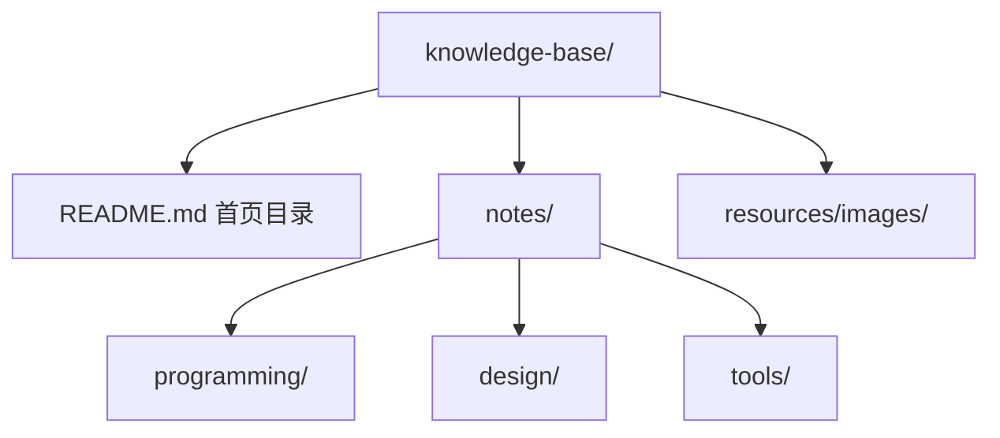

## 知识点地图

本篇属于 002-markdown 模块的「工程化」知识类别，讲的是**文档工程**：
当你手里的 Markdown 不再是单篇笔记，而是几十上百篇、多人协作、需要发布给
读者的一套文档时，靠手抄手排就会失控。

解决什么问题：

1. 一批 Markdown 文件如何聚合成带导航、搜索、主题的**文档站点**；
2. 站点发布前那些机械活（补元数据、查死链、查格式、生成 API 文档）如何交给
   **构建管线与质量门禁**自动完成；
3. 一份 Markdown 如何按需转换成 HTML、PDF、Word 等其他交付形态。

什么时候用到：

- 团队要搭一个内部文档站或开源项目官网；
- 仓库里的文档要在 CI 里做质量检查，防止有人提交坏链接和烂排版；
- 代码写了注释，希望文档跟着代码自动更新，而不是手抄一遍接口说明。

前置知识：基础语法（010）、frontmatter（260）、lint 工具（300）。本篇不再
重复任何语法知识——表格、脚注、公式、任务列表等语法各自有专篇，文中只给
指向。

## 1. 心智模型：从一份 Markdown 到一个站点

文档站点的本质是一条流水线：


几个关键认识：

1. **静态站点生成器（SSG）不改变你的源文件**。它在构建期读取 `.md`，
   渲染成 HTML 后写进 `dist/` 之类的产物目录；源文件永远是输入，产物
   永远会被下次构建覆盖，所以不要手改产物目录。
2. **元数据驱动的站点都有「同步」环节**。站点要按模块、分类、顺序组织
   页面，这些信息通常写在每篇的 frontmatter 里；同步脚本负责校验与补全
   这些字段，并生成全局索引。frontmatter 写错了，错误会在这一步暴露，
   而不是等到浏览器里发现页面排错位置。
3. **质量门禁放在部署之前**。死链、坏表格、格式漂移在本地一条命令就能
   查出，放进 CI 后每次 PR 都会自动把关。

FANDEX 这个仓库本身就是一条完整的真实管线，后面第 2.3 节以它为案例拆解。

## 2. 静态站点生成器：三款主流工具的取舍

### 2.1 MkDocs：Python 系的文档站首选

MkDocs 专为「项目文档」这一种场景设计：配置是一个 YAML 文件，主题生态里
最常用的是 Material for MkDocs（自带搜索、版本切换、深色模式）。

安装与最小站点：

```bash
pip install mkdocs            # 或 pip install mkdocs-material 一步到位
mkdocs new my-docs            # 生成 docs/ 目录与 mkdocs.yml 骨架
cd my-docs
```

导航与主题写在一个配置文件里：

```yaml
# mkdocs.yml
site_name: My Documentation
site_description: This is my documentation site
theme:
  name: material              # 换主题只改这一行
nav:                          # 导航顺序由这里显式决定
  - Home: index.md
  - Guide: guide.md
  - API: api.md
```

为什么导航要手写 `nav`：MkDocs 默认按文件名排序，中文文档一多顺序就会
乱；`nav` 显式声明后，想调整阅读顺序只改这一个文件，与文档正文解耦。
代价是新增页面容易忘记登记进 `nav`，部署后页面成了「孤儿」——这正好是
下面 2.3 节自动化脚本该管的事。

构建与预览：

```bash
mkdocs serve                  # 本地开发服务器，改文件热更新
mkdocs build                  # 产物输出到 site/ 目录
```

### 2.2 VuePress：Vue 生态的文档站

VuePress（及其后继 VitePress）适合前端团队：文档里可以直接嵌 Vue 组件，
配置就是一个 JS 文件。

```javascript
// .vuepress/config.js
module.exports = {
  title: 'My Documentation',
  description: 'This is my documentation site',
  themeConfig: {
    nav: [
      { text: 'Home', link: '/' },
      { text: 'Guide', link: '/guide/' },
      { text: 'API', link: '/api/' },
    ],
    sidebar: {
      '/guide/': [{ text: 'Getting Started', link: '/guide/' }],
      '/api/': [{ text: 'API Reference', link: '/api/' }],
    },
  },
};
```

逐项解释：`title`/`description` 会进页面标题与 SEO 元信息；`nav` 是顶部
导航；`sidebar` 按路径前缀分组——`'/guide/'` 前缀下的页面用第一组侧栏，
`'/api/'` 用第二组，这是「不同板块不同目录树」的标准写法。换成别的写法
（比如把所有页面塞进一个 sidebar 数组）在大站点会退化成一根几百项的长
列表，读者找东西全靠滚轮。

### 2.3 真实案例：FANDEX 的内容管线

本仓库（FANDEX）用 Astro 做站点，但管线思想与上面两款一致，多了一个
「内容同步」层。执行链路是：

```bash
node app-web/scripts/content-sync.mjs    # 同步：补 frontmatter、注册模块
node app-web/scripts/content-audit.mjs   # 审计：校验 frontmatter 可解析、引用不悬空
```

`content-sync.mjs` 做的事情，对应文档站点的通用需求：

1. **补全元数据**：作者只手写 `title`/`description`，其余 `order`、
   `module`、`updated` 等托管字段由脚本派生——文件名里的编号就是顺序，
   单一事实来源，避免两处维护互相打架；
2. **注册与回收**：新建模块文件夹自动登记进 `modules.json`，删除文档后
   索引与死链自动清理；
3. **学习路径骨架**：新模块自动生成学习路径地图骨架（`learning-path/`），
   已有人工编辑的地图不会被覆盖；
4. **语法速查**：`cnt-content/syntax/` 下的速查素材由独立脚本
   （`build-syntax.mjs`）取每个 H2 小节生成速查卡片，与教学文档分离，
   同一份内容服务两种阅读场景。

这层设计的教学要点：**站点功能越多，越要把「内容」与「组织信息」分离**。
作者只对内容负责；顺序、分类、索引这些结构性事实，要么从文件系统派生
（文件名编号），要么从极少量手写字段派生，绝不在多处手抄。

### 2.4 选型速查

| 场景 | 推荐 | 理由 |
| --- | --- | --- |
| 纯文档站、要搜索与版本切换 | MkDocs + Material | 配置最少，文档场景功能最全 |
| 前端团队、文档里要嵌组件 | VitePress / VuePress | 与 Vue 生态无缝 |
| 内容型站点（博客 + 文档 + 速查混排） | Astro | 内容集合与混合渲染能力强 |
| 只要几十篇内页、不想引工具链 | GitHub Wiki | 零构建，但样式与导航受限 |

## 3. 转换工具链：一份 Markdown，多种交付形态

### 3.1 Pandoc：格式转换的瑞士军刀

```bash
# Windows: 从官网下载安装包
# macOS: brew install pandoc
# Linux: sudo apt install pandoc

pandoc input.md -o output.html   # 转 HTML
pandoc input.md -o output.pdf    # 转 PDF（需要 LaTeX 引擎）
pandoc input.md -o output.docx   # 转 Word，走评审/归档流程时常用
```

易错点：转 PDF 依赖系统里装有 LaTeX 或 `wkhtmltopdf` 一类引擎，报错
`pdflatex not found` 时先装引擎再重试，而不是怀疑命令写错。另外 Pandoc
对 GFM 扩展（任务列表、删除线）需要显式开启：`pandoc -f gfm input.md`，
否则按严格 Markdown 解析，表格之外的扩展语法会原样漏出。

### 3.2 Node 脚本转换：把渲染嵌进自己的流程

需要程序化处理时，用 `markdown-it` 十几行就能完成一次转换：

```bash
npm install markdown-it
```

```javascript
// convert.js
const fs = require('fs');                    // 1) 引入文件系统模块
const md = require('markdown-it')();         // 2) 创建渲染器实例，默认 CommonMark 规则
const input = fs.readFileSync('input.md', 'utf8');  // 3) 同步读入源文件
const output = md.render(input);             // 4) 渲染成 HTML 字符串
fs.writeFileSync('output.html', output);     // 5) 写出结果
console.log('Conversion completed!');
```

```bash
node convert.js
```

逐行看关键处：第 2 步 `markdown-it()` 的括号是调用工厂函数返回实例；
不传配置时只有 CommonMark 内核，想支持表格、删除线要显式开
`require('markdown-it')({ html: true }).enable(['table', 'strikethrough'])`——
这是新手最常见的「为什么我的表格没渲染」根源。第 3 步用同步读法在小脚本
里没问题；放进服务要换成 `readFile` 异步版，避免阻塞事件循环。

### 3.3 从代码生成文档：JSDoc 与 TypeDoc

代码注释即文档，接口说明永远和实现同步——这是手写文档做不到的。

```javascript
/**
 * 计算两个数的和
 * @param {number} a - 第一个数
 * @param {number} b - 第二个数
 * @returns {number} 两个数的和
 */
function sum(a, b) {
  return a + b;
}
```

注释块要以 `/**` 开头（两个星号）JSDoc 才识别；写成 `/*` 会被当普通注释
忽略，这是最容易踩的静默失败。`@param` 的类型写在花括号里，描述跟在
参数名后。

```bash
npm install -g jsdoc
jsdoc input.js -d docs        # -d 指定输出目录
```

TypeScript 项目改用 TypeDoc，它能直接读类型定义，不用在注释里重复类型：

```bash
npm install -g typedoc
typedoc --out docs src        # 读取 src 下的 .ts，产出带类型签名的文档站
```

分工：JSDoc 管 JavaScript；TypeDoc 管 TypeScript。两者都不处理「怎么用」
的叙述性内容——教程、概念讲解仍然手写 Markdown，两者互补而非替代。

## 4. 质量门禁：让坏文档进不了主干

### 4.1 markdownlint：格式规范守门

```bash
npm install -g markdownlint-cli
markdownlint README.md        # 单文件
markdownlint .                # 整个目录
```

lint 报的错多是机械性问题：标题层级跳级（h1 直接跳 h3）、行尾多余空格、
列表缩进不一致。规范落进配置文件（`.markdownlint.json`）而不是口头约定，
团队才有一致标准——本仓库的对应篇目 300-LintFormatTooling 有完整的
规则与配置讲解。

### 4.2 markdown-link-check：死链守门

```bash
npm install -g markdown-link-check
markdown-link-check README.md
# 检查整个目录（配合 find）
find . -name "*.md" -exec markdown-link-check {} \;
```

死链是文档站最伤读者信任的问题：内部链接错一个路径，读者点进去就是 404。
把 link-check 与 lint 一起挂进 CI，PR 阶段就拦住。注意外链检查受网络
波动影响，CI 里对外链失败可设白名单或重试，内部链接则必须硬性通过。

## 5. 多版本与部署

### 5.1 用 Git 分支管理文档版本

```bash
git branch docs/v1.0          # 为旧版本开维护分支
git checkout docs/v1.0        # 需要修旧版 bug 时切过去
git checkout main
git merge docs/v1.0           # 修复合回主干
```

适用场景：文档跟随产品出多版本（如 v1 与 v2 的 API 不同）。日常写作
不要开一堆长期分支——分支漂移越久合并越痛，绝大多数文档只需要 main
一条线加短期分支。

### 5.2 站点层面的多版本

VuePress 类工具的版本切换靠目录前缀 + 配置：

```javascript
// .vuepress/config.js
module.exports = {
  themeConfig: {
    versions: {
      '1.0': '/1.0/',         // 旧版文档整目录挂到 /1.0/ 路径下
      '2.0': '/2.0/',
    },
  },
};
```

目录上旧版内容放在独立子目录，构建时分别产出，导航条挂版本切换器。
MkDocs 的 Material 主题用 `mike` 插件实现同样效果。核心认识：**多版本
是目录结构问题，不是 Markdown 语法问题**。

### 5.3 部署到 GitHub Pages

```bash
mkdocs build
# 把 site/ 目录推到 gh-pages 分支（MkDocs 有官方命令一条龙）
mkdocs gh-deploy
```

CI 部署则在工作流里跑构建再发布产物，本仓库的三端消费方式
（web / desktop 内嵌 web 产物 / Android assets）都由构建脚本统一派生，
见仓库 CONTENT-GUIDE 的管线总览图。

## 6. 个人知识库：轻量方案

不想搭站点时，双链笔记工具是最小成本方案：

- **Obsidian**：本地 vault 存纯 Markdown 文件，数据完全自持。Wiki 风格
  双链 `[页面 2](页面 2)` 与 `` 嵌入，插件生态做大纲、
  看板、发布。选它的核心理由：文件就是标准 `.md`，未来迁去任何站点
  生成器都不用转换。
- **Notion**：数据库视图、多人协作强，但内容锁在云端，导出的 Markdown
  会丢部分格式（嵌套数据库、callout 等）。适合协作密集、不打算自建
  站点的团队。

个人知识库的目录骨架参考（按主题分域，资源集中管理）：



要点：图片集中在一个资源目录而不是散在各笔记旁，迁移与备份时不易丢
引用；首页 README 只做目录与索引，正文下沉到各主题文件夹。

## 7. 常见问题与解决方案

- **图片本地正常、部署后 404**：路径大小写或相对层级错了，或资源没随
  构建发布。对策：统一相对当前文件的路径，并把静态资源放进生成器的
  `public/` 类目录；本地构建一遍，用产物目录实际验证。
- **构建失败或页面缺失**：多半是 frontmatter 解析失败、内部死链或依赖
  缺失。对策：先跑 lint 与 link-check 定位到具体文件，再查同步脚本的
  报错行号——同步脚本的报错通常精确指向有问题的那篇文档。
- **同一篇文档三端表现不一致**：检查是否手改了生成产物目录（`assets/`、
  `dist/`），它们下次构建会被覆盖；修改只应落在源 Markdown 上。

## 动手实践

任务：为一个 Markdown 目录搭一条「转换 + 检查」最小管线，不依赖任何
站点生成器。

1. 建目录 `demo-docs/`，放两篇 `.md`（其中一篇故意写一个指向不存在
   文件的内部链接）；
2. 用 `markdown-it` 写 `convert.js`，把每篇 `.md` 渲染成 `dist/*.html`；
3. 用 `markdown-link-check` 检查两篇文档，确认死链被报出来；
4. 修复死链，重跑检查与转换，全部通过。

提示：转换脚本要遍历目录的话，用 `fs.readdirSync` 加
`.endsWith('.md')` 过滤；`markdown-link-check` 需要一个 JSON 配置来
忽略外网链接，避免网络问题干扰。

遮代码自检——先自己写，再对照：

<details>
<summary>参考实现（点开前先自己完成）</summary>

```bash
mkdir demo-docs && cd demo-docs
npm init -y
npm install markdown-it markdown-link-check
printf '# Doc A\n\nSee [missing](nope.md)\n' > a.md
printf '# Doc B\n\nAll good.\n' > b.md
```

```javascript
// convert.js
const fs = require('fs');
const path = require('path');
const md = require('markdown-it')({ html: true });

for (const f of fs.readdirSync('.')) {
  if (!f.endsWith('.md')) continue;              // 只处理 md 源文件
  fs.mkdirSync('dist', { recursive: true });     // 幂等建产物目录
  const html = md.render(fs.readFileSync(f, 'utf8'));
  fs.writeFileSync(path.join('dist', f.replace(/\.md$/, '.html')), html);
  console.log('rendered:', f);
}
```

```bash
node convert.js
npx markdown-link-check a.md      # 应报 nope.md 为死链
printf '# Doc A\n\nSee [doc B](b.md)\n' > a.md   # 修复指向真实文件
node convert.js
npx markdown-link-check a.md && npx markdown-link-check b.md
```

</details>

自检问题：如果只写 `markdown-it()` 不加 `{ html: true }`，文档里的原生
`` 标签会怎样？（会被转义成文本——`html` 选项默认关闭，这正是很多
站点文档「标签露出来」的原因。）

## 与之前和之后的知识的关系

- 之前：260-FrontmatterYAML 讲了元数据怎么写；本篇讲元数据被管线怎么消费。
  300-LintFormatTooling 讲 lint 规则细节；本篇把 lint 放进站点流水线的位置。
- 之后：270-SpecDocumentWriting 讲文档内容本身怎么组织写好；工具链解决
  「怎么发布与守门」，写不写得清楚是另一件事，两者都要做。
- 平级：290-ConversionTool 详列各转换工具的参数矩阵，本篇只取工程视角
  的最小命令集。

## 官方文档与参考

- MkDocs 官方文档：https://www.mkdocs.org
- Material for MkDocs：https://squidfunk.github.io/mkdocs-material/
- VuePress 文档：https://v2.vuepress.vuejs.org/
- Pandoc 手册：https://pandoc.org/MANUAL.html
- markdown-it：https://github.com/markdown-it/markdown-it
- JSDoc：https://jsdoc.app/ ；TypeDoc：https://typedoc.org/
- markdownlint：https://github.com/DavidAnson/markdownlint
- markdown-link-check：https://github.com/tcort/markdown-link-check
- FANDEX 仓库 CONTENT-GUIDE.md：内容管线总览一节（描述 content-sync
  与三端消费方式）

## 参考与致谢

- 第 2.1 节 MkDocs、第 2.2 节 VuePress 的配置骨架，第 4 节
  markdownlint / markdown-link-check 用法，改写自各工具官方文档的公开
  内容（MkDocs 文档 BSD 许可，VuePress 文档 MIT 许可，markdownlint 与
  markdown-link-check 为 MIT 开源项目的 README 说明），并按教学需要
  重排与补注。
- JSDoc / TypeDoc 命令与注释约定来自两者官方文档（各自开源许可）。
- FANDEX 管线案例取自本仓库 CONTENT-GUIDE.md 与 app-web/scripts/ 下的
  实际脚本行为。
