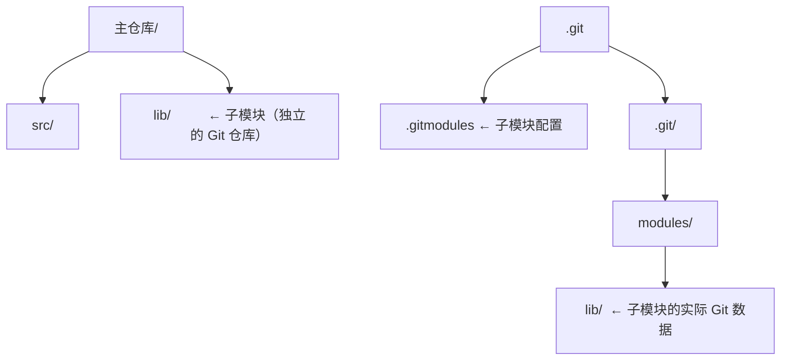

## 1. submodule 概述

### 1.1 什么是 submodule

子模块允许在一个 Git 仓库中**嵌入另一个 Git 仓库**作为子目录，保持独立的版本控制。



### 1.2 适用场景

| 场景             | 说明                     |
| :--------------- | :----------------------- |
| **共享库**       | 多个项目共用同一库       |
| **组件库**       | 前端项目引用 UI 组件库   |
| **第三方代码**   | 引入第三方仓库而非复制   |
| **大型项目拆分** | 将大仓库拆分为多个子仓库 |

## 2. 基本操作

### 2.1 添加子模块

```bash
git submodule add https://github.com/user/shared-lib.git lib/shared
# 1. 克隆子模块到指定路径
# 2. 创建 .gitmodules 文件
# 3. 将子模块添加到暂存区

git commit -m "feat: add shared-lib submodule"
```

### 2.2 克隆含子模块的仓库

```bash
# 方式一：递归克隆
git clone --recurse-submodules https://github.com/user/main-repo.git

# 方式二：先克隆再初始化
git clone https://github.com/user/main-repo.git
cd main-repo
git submodule init
git submodule update

# 方式三：一步到位
git submodule update --init --recursive
```

### 2.3 更新子模块

```bash
# 更新到子模块远程仓库的最新提交
git submodule update --remote

# 更新指定子模块
git submodule update --remote lib/shared

# 更新所有子模块到最新
git submodule update --remote --merge
```

### 2.4 删除子模块

```bash
# 1. 取消注册
git submodule deinit -f lib/shared

# 2. 删除文件
rm -rf .git/modules/lib/shared

# 3. 从 Git 中移除
git rm -f lib/shared

# 4. 提交
git commit -m "chore: remove shared-lib submodule"
```

## 3. .gitmodules 文件

```ini
[submodule "lib/shared"]
    path = lib/shared
    url = https://github.com/user/shared-lib.git
    branch = main          # 跟踪的分支（可选）
```

## 4. 常见问题

### 4.1 子模块处于分离 HEAD

子模块默认检出特定提交，处于**分离 HEAD 状态**：

```bash
cd lib/shared
git checkout main    # 切到分支
git pull             # 拉取更新
cd ../..
git add lib/shared
git commit -m "chore: update submodule"
```

### 4.2 子模块脏状态

```bash
# 忽略子模块的修改
git config submodule.lib/shared.ignore dirty

# 强制更新（丢弃子模块的修改）
git submodule update --force
```

### 4.3 子模块冲突

```bash
# 合并时子模块冲突
# 选择一方的版本
git checkout --ours lib/shared
# 或
git checkout --theirs lib/shared
git add lib/shared
```

## 5. 替代方案

| 方案          | 特点               | 适用场景         |
| :------------ | :----------------- | :--------------- |
| **submodule** | 独立仓库，精确版本 | 第三方库         |
| **subtree**   | 合并到主仓库       | 更简单的依赖管理 |
| **npm/pip**   | 包管理器           | 语言生态内的依赖 |
| **Monorepo**  | 单一仓库           | 紧密耦合的项目   |

### 5.1 git subtree

```bash
# 添加 subtree
git subtree add --prefix=lib/shared https://github.com/user/shared-lib.git main --squash

# 更新 subtree
git subtree pull --prefix=lib/shared https://github.com/user/shared-lib.git main --squash
```
## 添加子模块

**基本写法：添加子模块**
`git submodule add <仓库地址> <路径>`
```bash
# 添加 shared-lib 作为子模块到 lib/shared
git submodule add https://github.com/user/shared-lib.git lib/shared;
```

**基本写法：提交子模块添加**
`git commit -m "<消息>"`
```bash
# 提交子模块添加
git commit -m "feat: add shared-lib submodule";
```

---

## 克隆含子模块的仓库

**基本写法：递归克隆**
`git clone --recurse-submodules <仓库地址>`
```bash
# 克隆并递归初始化所有子模块
git clone --recurse-submodules https://github.com/user/main-repo.git;
```

**基本写法：克隆主仓库**
`git clone <仓库地址>`
```bash
# 克隆主仓库
git clone https://github.com/user/main-repo.git;
```

**基本写法：初始化子模块**
`git submodule init`
```bash
# 初始化子模块
git submodule init;
```

**基本写法：更新子模块**
`git submodule update`
```bash
# 更新子模块
git submodule update;
```

**基本写法：一步到位初始化**
`git submodule update --init --recursive`
```bash
# 初始化并递归更新所有子模块
git submodule update --init --recursive;
```

---

## 更新子模块

**基本写法：更新到最新提交**
`git submodule update --remote`
```bash
# 更新所有子模块到远程最新提交
git submodule update --remote;
```

**基本写法：更新指定子模块**
`git submodule update --remote <路径>`
```bash
# 仅更新 lib/shared 子模块
git submodule update --remote lib/shared;
```

**基本写法：更新并合并**
`git submodule update --remote --merge`
```bash
# 更新所有子模块并合并
git submodule update --remote --merge;
```

---

## 删除子模块

**基本写法：取消注册子模块**
`git submodule deinit -f <路径>`
```bash
# 取消注册 lib/shared 子模块
git submodule deinit -f lib/shared;
```

**基本写法：删除子模块 Git 数据**
`rm -rf .git/modules/<路径>`
```bash
# 删除子模块的 Git 数据
rm -rf .git/modules/lib/shared;
```

**基本写法：从 Git 中移除子模块**
`git rm -f <路径>`
```bash
# 从 Git 中移除子模块
git rm -f lib/shared;
```

**基本写法：提交删除**
`git commit -m "<消息>"`
```bash
# 提交子模块删除
git commit -m "chore: remove shared-lib submodule";
```

---

## .gitmodules 配置文件

**基本写法：配置文件格式**
`[submodule "<名称>"]`
```ini
# .gitmodules 文件格式
[submodule "lib/shared"]
    path = lib/shared
    url = https://github.com/user/shared-lib.git
    branch = main
```

---

## 子模块分离 HEAD 处理

**基本写法：进入子模块目录**
`cd <子模块路径>`
```bash
# 进入子模块目录
cd lib/shared;
```

**基本写法：切换到分支**
`git checkout <分支名>`
```bash
# 切换到 main 分支
git checkout main;
```

**基本写法：拉取更新**
`git pull`
```bash
# 拉取更新
git pull;
```

**基本写法：返回主仓库**
`cd ../..`
```bash
# 返回主仓库
cd ../..;
```

**基本写法：添加子模块更新**
`git add <子模块路径>`
```bash
# 添加子模块更新
git add lib/shared;
```

**基本写法：提交更新**
`git commit -m "<消息>"`
```bash
# 提交子模块更新
git commit -m "chore: update submodule";
```

---

## 子模块脏状态处理

**基本写法：忽略子模块修改**
`git config submodule.<路径>.ignore dirty`
```bash
# 忽略 lib/shared 子模块的修改
git config submodule.lib/shared.ignore dirty;
```

**基本写法：强制更新子模块**
`git submodule update --force`
```bash
# 强制更新所有子模块
git submodule update --force;
```

---

## 子模块冲突

**基本写法：采用当前分支的子模块版本**
`git checkout --ours <子模块路径>`
```bash
# 采用当前分支的子模块版本
git checkout --ours lib/shared;
```

**基本写法：采用合并分支的子模块版本**
`git checkout --theirs <子模块路径>`
```bash
# 采用合并分支的子模块版本
git checkout --theirs lib/shared;
```

**基本写法：添加解决后的子模块**
`git add <子模块路径>`
```bash
# 添加解决后的子模块
git add lib/shared;
```

---

## git subtree 替代方案

**基本写法：添加 subtree**
`git subtree add --prefix=<路径> <仓库地址> <分支> --squash`
```bash
# 添加 shared-lib 到 lib/shared
git subtree add --prefix=lib/shared https://github.com/user/shared-lib.git main --squash;
```

**基本写法：更新 subtree**
`git subtree pull --prefix=<路径> <仓库地址> <分支> --squash`
```bash
# 更新 lib/shared 的 subtree
git subtree pull --prefix=lib/shared https://github.com/user/shared-lib.git main --squash;
```
