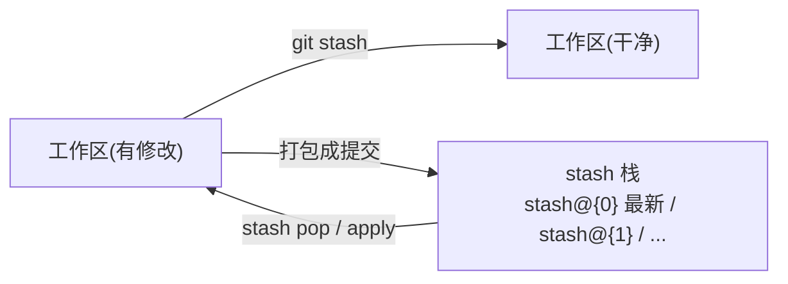

## 前置知识与学习目标

**前置知识**：理解工作区与暂存区的区别。

学完本文你应当能够：

1. 用 stash 在不提交的前提下把工作区「暂存入库、随手取回」；
2. 知道 stash 默认**不包含未跟踪文件**这一大坑及 `-u` 对策；
3. 处理 `pop` 冲突、多栈管理、以及「stash 里躺了半年的代码」的清理。

类比先行：stash 是工作台上方的**置物架**——手头零件（未完成的修改）还没组装好，但桌面必须腾出来干别的活，先把零件整盘端上架，写张便签，回头再端下来继续。它是临时寄存，不是归档柜（仓库）。

## 1. stash 是什么

`git stash` 把工作区与暂存区的当前修改打包保存到一个**栈**中，并把工作区恢复到干净状态。这个栈在 Git 内部由 `refs/stash` 引用加上它自己的 reflog 实现——每次 stash 都是一个真实的提交对象，因此**可以 diff、可以查看任意文件、甚至可以 cherry-pick**：

```bash
git stash
# Saved working directory and index state WIP on main: 8c9d0e1 feat: login

git status          # working tree clean —— 桌面已清空
```



`stash@{0}` 是最新条目，`stash@{1}` 次新，下标随新的入栈整体后移。

## 2. 基本用法

### 2.1 保存

```bash
git stash                       # 暂存已跟踪文件的修改（工作区+暂存区）
git stash push -m "WIP: 登录表单校验"    # 带说明，强烈推荐
git stash -u                    # 连未跟踪的新文件一起收（--include-untracked）
git stash -a                    # 连被忽略的文件一起收（--all，慎用会收走构建产物）
git stash push -p               # 交互式按代码块挑选
git stash push src/auth.js      # 只收指定路径
git stash --keep-index          # 收纳但把已暂存内容留在原地（配合提交前自检）
```

### 2.2 查看

```bash
git stash list
# stash@{0}: On main: WIP: 登录表单校验
# stash@{1}: WIP on main: 5e6f7a8 fix: token refresh

git stash show                  # 最新一条的文件级摘要
git stash show -p               # 最新一条的完整 diff
git stash show -p 'stash@{1}'   # 指定条目（shell 中给花括号加引号更稳）
git show 'stash@{0}:src/auth.js'    # 直接看 stash 里某个文件的内容
```

### 2.3 恢复与删除

```bash
git stash pop               # 取回最新并从栈中删除
git stash apply             # 取回但保留在栈中（想应用到多个分支时用）
git stash apply --index     # 连暂存区/工作区的划分状态一起还原
git stash drop 'stash@{1}'  # 丢弃指定条目
git stash clear             # 清空整个栈（不可逆，慎重）
```

`pop` 与 `apply` 的选择：确认这次恢复就是终点用 `pop`；还想「同一份改动贴到别的分支」用 `apply`（用完记得 drop）。

## 3. 典型场景

### 3.1 紧急插队修复

```bash
git stash push -m "WIP: 优惠券功能"        # 1) 手头工作上架
git switch main && git switch -c hotfix/price-error
# 2) 修复、提交、推送
git commit -m "fix: correct price rounding"
git switch feature/coupon                  # 3) 回到原任务
git stash pop                              # 4) 取回进度
```

### 3.2 拉取前先安顿脏工作区

```bash
git stash -u
git pull --rebase
git stash pop
# 快捷方式：git rebase/pull 配合 autostash
git pull --rebase --autostash     # 自动 stash + 恢复，一条命令
```

### 3.3 stash 与分支错位时：stash branch

stash 恢复要求改动能应用在当前分支；当初的基点已经走远导致冲突时，让它回到「出生地」：

```bash
git stash branch coupon-wip 'stash@{1}'
# 基于创建该 stash 时的提交新建分支，恢复改动并删除该 stash
```

## 4. pop 冲突与恢复失败

`pop` 时如果工作区与 stash 改动冲突，Git 会保留冲突标记，并且**不删除栈中条目**（防止你丢了原件）：

```bash
git stash pop
# Auto-merging src/auth.js
# CONFLICT (content): Merge conflict in src/auth.js
# The stash entry is kept in case you need it again.

# 处理方式一：解决冲突后手动清理
vim src/auth.js && git add src/auth.js
git stash drop 'stash@{0}'

# 处理方式二：放弃这次恢复
git checkout -- src/auth.js      # 丢弃工作区冲突现场
git stash pop                    # 再试
```

误 `drop` 或误 `clear` 后的救援：stash 是真实提交，`git fsck --lost-found` 或 `git reflog stash`（栈未 clear 时）都能找回，详见 [git reflog](git/260-GitReflog)。

## 5. 陷阱与调试

- **新文件没进 stash**：默认只收已跟踪文件，`-u` 才收未跟踪；忘了 `-u` 的话，切分支后「新文件不见了」其实是它们还留在原分支的工作区。
- **stash 不是存档点**：它没有消息版本管理、不共享、会被下标位移搞混；预计超过一两天的半成品请提交到 WIP 分支。
- **`stash@{n}` 在 shell 中被花括号展开**：报 `unknown switch` 类错误时给引用加引号。
- **`--keep-index` 不是「只 stash 一部分」**：它把全部修改都收进 stash，同时让已暂存内容继续留在工作区，常与 `git stash --keep-index` + 测试 + `stash pop` 的「提交前演练」模式搭配。
- **stash 长期堆积**：`stash list` 超过一屏就该清理，`clear` 前先 `git stash show -p` 巡检。

## 进阶观察：stash 的对象结构

stash 不是黑盒，它是一个**至少有两个父提交的提交对象**（工作区快照 + 暂存区快照；带 `-u` 时还有第三个父提交记录未跟踪文件），挂在 `refs/stash` 引用上。亲手解剖一次：

```bash
echo x >> app.js && git stash
git cat-file -p refs/stash
# tree ...
# parent 8c9d0e1...        ← stash 时的基点提交
# parent 5e6f7a8...        ← 暂存区状态的提交
# author ... committer ...
# WIP on main: 8c9d0e1 feat: login

git log --oneline --graph refs/stash -3    # 可见 stash 链
```

理解这一点后，stash 的全部能力都可推演：可以 `git diff stash@{0}^ stash@{0}` 看改动、可以 `git cherry-pick -n stash@{0}` 把暂存内容当作补丁应用、也可以在误 drop 后用 `git fsck` 按悬空提交找回——stash 的「栈」本质就是 `refs/stash` 的 reflog。

## 小结

**初学者要点**

- stash = 给未完成修改的临时置物架：`push` 上架、`pop` 取回、`list/show` 盘点。
- 新文件要 `-u` 才会被收走；带 `-m` 说明是最划算的好习惯。
- pop 冲突时 stash 不删，处理完冲突记得手动 drop。

**进阶注意**

- stash 底层是双父/三父提交 + `refs/stash` 的 reflog，可 diff、可 cherry-pick、可救援。
- 「拉取不脏手」优先 `pull --rebase --autostash` 一条命令。
- 多天以上的半成品改走 WIP 分支；stash 栈保持短小。
