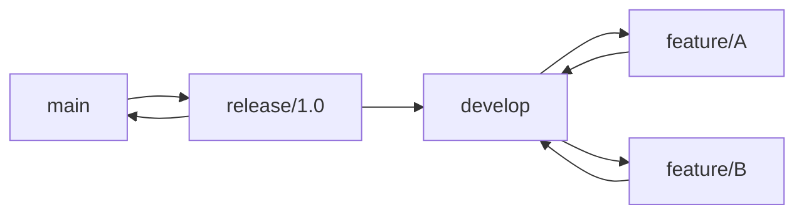
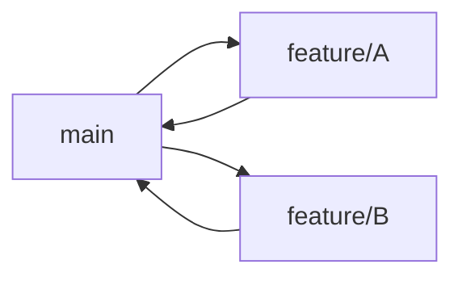
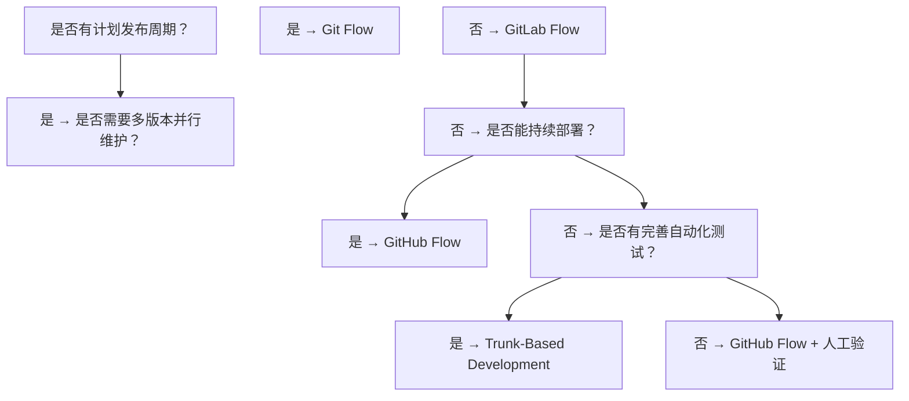

## 知识点地图

- **知识类别**：分支工作流模型（branching model）——团队如何用分支组织开发、发布与热修复的约定。分支操作本身见 100 篇，本篇讲「分支该怎么用」的策略层。
- **解决什么问题**：没有约定时，「谁在 main 上直接推、发布从哪拉、线上急修怎么走」全靠临场发挥。模型把这些决策固化：Git Flow 面向有计划发布与多版本维护的产品，GitHub Flow 面向持续部署的 Web 应用，GitLab Flow 用环境分支补上「部署顺序」，Trunk-Based 面向 CI/CD 成熟的大团队。
- **什么时候用到**：为新团队或新仓库定协作规范；讨论「要不要 develop 分支」；接手仓库识别它在用哪种模型；CI/CD 流水线按分支/标签触发时。

## 1. 分支模型概述

### 1.1 为什么需要分支模型

分支模型定义了团队如何使用分支进行协作，核心解决：

- 如何组织功能开发
- 如何管理发布
- 如何处理热修复
- 如何保持主分支稳定

模型没有优劣，只有与发布节奏、团队规模、运维能力的匹配度。下文四个模型按复杂度递进展开。

## 2. Git Flow

### 2.1 分支结构



| 分支        | 命名        | 生命周期 | 用途         |
| :---------- | :---------- | :------- | :----------- |
| **main**    | `main`      | 永久     | 生产版本，每次合并都打标签 |
| **develop** | `develop`   | 永久     | 开发集成分支，feature 从此切出 |
| **feature** | `feature/*` | 临时     | 功能开发，完成合并回 develop |
| **release** | `release/*` | 临时     | 发布准备，只修 bug 不加功能 |
| **hotfix**  | `hotfix/*`  | 临时     | 基于 main 的紧急修复 |

### 2.2 工作流程

```bash
# 1. 从 develop 创建功能分支
git checkout -b feature/auth develop

# 2. 开发并提交
git commit -m "feat: add login"

# 3. 完成后合并回 develop（--no-ff 保留合并提交，分支拓扑可追溯）
git checkout develop
git merge --no-ff feature/auth
git branch -d feature/auth

# 4. 准备发布
git checkout -b release/1.0 develop
# 修复 Bug、更新版本号
git commit -m "chore: bump version to 1.0"

# 5. 合并到 main 和 develop（两边都要，发布期修复不能只进其一）
git checkout main
git merge --no-ff release/1.0
git tag -a v1.0.0
git checkout develop
git merge --no-ff release/1.0
git branch -d release/1.0

# 6. 热修复：从 main 切出（线上问题等不及 develop 的集成节奏）
git checkout -b hotfix/bug-123 main
git commit -m "fix: resolve critical bug"
git checkout main
git merge --no-ff hotfix/bug-123
git tag -a v1.0.1
git checkout develop
git merge --no-ff hotfix/bug-123
git branch -d hotfix/bug-123
```

逐段看关键决策：第 3 步 `--no-ff` 强制产生合并提交——fast-forward 会让 feature 分支的提交混进 develop 线，功能边界消失，revert 整个功能时就抓瞎；第 5 步 release 分支合并回 main **和** develop 两个分支——只进 main 的话，发布期修的 bug 在下个开发周期会复发，这是 Git Flow 最经典的翻车点；第 6 步 hotfix 从 main 而非 develop 切出，且完成后同样双合并。

**换成别的写法会怎样**：用 `git merge` 默认策略（允许 fast-forward）省一个合并提交，代价是 `git log --graph` 里功能边界消失；团队约定「merge 必带 --no-ff」通常更划算。

### 2.3 场景：带版本发布的移动 App

移动 App 要向应用商店提交审核版、维护线上老版本、准备下一个大版本——发布是「计划事件」且多版本并行。Git Flow 的 release 分支正好承载「冻结当前版本只修 bug」的阶段，hotfix 支撑线上急修，main 上的版本标签与商店版本一一对应。这是「选 Git Flow 的典型画像」。

### 2.4 git-flow 工具

git-flow 扩展把上述手工命令封装成子命令：

```bash
# 安装 git-flow（macOS 用 brew install git-flow）
apt-get install git-flow

# 初始化：交互式配置各分支命名；-d 使用默认配置
git flow init
git flow init -d

# 功能开发
git flow feature start login        # 从 develop 切出 feature/login
git flow feature publish login      # 推送到远程供协作
git flow feature track login        # 跟踪同事推送的功能分支
git flow feature finish login       # 合并回 develop 并删除
git flow feature finish -k login    # -k 合并后保留本地分支

# 发布
git flow release start 1.2.0
git flow release publish 1.2.0
git flow release finish -m "release 1.2.0" 1.2.0
git flow release finish -p 1.2.0    # -p 完成后自动推送 main、develop 与标签

# 热修复（可指定基线标签）
git flow hotfix start 1.2.1
git flow hotfix finish -p 1.2.1
```

`start/finish` 是骨架，`publish/track` 解决「feature 分支多人协作」，`-p` 省去 finish 后的三连 push。不用扩展、纯手工实现同样的流程就是 2.2 的命令序列——两者等价，选一个团队统一的即可。

### 2.5 Git Flow 实践要点

1. **release 分支只做 bug 修复**：新功能必须走 feature -> develop 路径，否则发布冻结失效；
2. **打标签必须**：每次合并到 main 都打版本标签（`git tag -a v1.2.0 -m "Release 1.2.0"`），发布可追溯；
3. **定期清理已合并分支**：避免分支列表膨胀（清理方法见 100 篇练习 3）。

## 3. GitHub Flow

### 3.1 分支结构



| 分支        | 命名        | 生命周期 | 用途         |
| :---------- | :---------- | :------- | :----------- |
| **main**    | `main`      | 永久     | 始终可部署   |
| **feature** | `feature/*` | 临时     | 所有开发工作 |

### 3.2 工作流程

```bash
# 1. 从 main 创建分支
git checkout -b feature/auth main

# 2. 开发并提交
git commit -m "feat: add authentication"

# 3. 推送并创建 Pull Request
git push -u origin feature/auth
# 在 GitHub 上创建 PR

# 4. 代码审查（Code Review 见 230 篇）

# 5. 合并到 main：通过 GitHub 合并 PR，自动部署到生产环境

# 6. 删除分支
git branch -d feature/auth
git push origin --delete feature/auth
```

### 3.3 核心原则

- `main` 分支**始终可部署**
- 所有开发在功能分支进行
- 通过 Pull Request 进行代码审查
- 合并后立即部署

### 3.4 场景：Web 持续部署

SaaS 网站一天上线十几次，没有「版本」概念（浏览器里永远只有最新版）。Git Flow 的 release 冻结期对它是纯开销。GitHub Flow 把「合并即发布」变成默认节奏，出问题用 revert 或重新部署前一提交。这是「选 GitHub Flow 的典型画像」。

### 3.5 实践要点

1. **分支命名规范**：`feat/xxx`、`fix/xxx`、`chore/xxx`（与 095 篇提交类型呼应）；
2. **小步提交**：每个 PR 控制在 200-400 行变更以内，review 质量随体积骤降；
3. **PR 模板**：统一描述变更内容、测试方法、截图；
4. **CI 必须通过**：PR 合并前必须通过所有自动化检查。

## 4. 模型对比

### 4.1 维度对比表

| 特性         | Git Flow           | GitHub Flow      |
| :----------- | :----------------- | :--------------- |
| **复杂度**   | 高                 | 低               |
| **分支数量** | 5 种               | 2 种             |
| **发布节奏** | 计划发布           | 持续部署         |
| **适用团队** | 大团队、版本化产品 | 小团队、Web 应用 |
| **学习成本** | 较高               | 较低             |
| **热修复**   | 专用 hotfix 分支   | 从 main 创建分支 |
| **版本管理** | 明确的版本标签     | 持续交付         |
| **多版本维护** | 支持（release/hotfix） | 仅维护最新版 |
| **冲突频率** | 高（develop 与 main 双向合并） | 低（单向合并到 main） |

### 4.2 部署节奏对比

```text
Git Flow 部署节奏:
  开发 → 集成 → 冻结 → 测试 → 发布（周期性，如每 2 周）

GitHub Flow 部署节奏:
  开发 → Review → 合并 → 部署（持续，可能每天多次）
```

### 4.3 合并策略差异

Git Flow 推荐使用 `--no-ff` 保留分支拓扑（见 2.2）。GitHub Flow 通过 PR 合并，托管平台支持三种策略：

- **Merge commit**：保留完整分支历史；
- **Squash and merge**：压缩为单个提交，历史更整洁（功能内碎提交不外泄）；
- **Rebase and merge**：线性历史，无合并提交（rebase 语义见 270 篇）。

## 5. 其他模型

### 5.1 Trunk-Based Development


- 所有开发者在 main 上直接提交
- 使用功能开关（Feature Flag）控制未完成功能
- 极短的分支生命周期（<1 天）
- 适合 CI/CD 成熟的团队

**场景：大厂特性开关**。日提交量数百次的服务端团队，长命分支会让合并成本指数上升。Trunk-Based + 特性开关让「代码已上线、功能未开放」成为常态：新逻辑裹在 flag 后面合入 main，灰度放量、A/B 实验都由开关控制，分支生命周期压缩到小时级。前提是测试自动化必须可靠——没有守门 CI，主干会被半成品功能打穿。

### 5.2 GitLab Flow：环境分支

介于 Git Flow 与 GitHub Flow 之间，保留 GitHub Flow 的简洁，引入**环境分支**表达部署顺序：

```text
main ──→ staging ──→ production
```

- main 合并后自动部署到 staging；验证通过把代码 cherry-pick 或 merge 到 production 才进生产；
- 支持**环境部署顺序**：开发 → 预发布 → 生产，每条环境分支对应一个部署目标；
- 适合「持续集成但没有全自动发布、需要人工放行生产」的团队——例如有合规审计要求的金融系统，生产合并就是那次人工放行。

与 Git Flow 的本质区别：Git Flow 的 release 分支为「版本」服务，GitLab Flow 的环境分支为「部署目标」服务。如果你的问题是「这次发布什么时候发」，选 Git Flow；如果是「这批改动怎么逐环境推进」，选 GitLab Flow。

### 5.3 选型建议

| 场景              | 推荐模型                  |
| :---------------- | :------------------------ |
| **Web/SaaS 应用** | GitHub Flow               |
| **移动应用**      | Git Flow                  |
| **开源项目**      | GitHub Flow               |
| **嵌入式/固件**   | Git Flow                  |
| **微服务**        | GitHub Flow / Trunk-Based |
| **大型团队**      | Git Flow                  |
| **初创团队**      | GitHub Flow               |

### 5.4 选择决策树



用法：从顶部问题开始，沿答案下行到叶子即得推荐模型。第一个分叉「有无计划发布周期」直接由产品形态决定（移动 App 有、网页应用通常无），所以选型前先回答「我们的发布是什么节奏」。

## 6. 版本号与 CI/CD 协同

模型选定后，发布自动化的两个接口是版本号与分支/标签推送事件：

```text
语义化版本号格式：<主版本>.<次版本>.<修订号>（如 1.2.3）
发布标签命名规范：v<版本号>（git tag -a v1.2.0 -m "Release 1.2.0"）
```

```bash
# 基于标签触发部署：推送标签触发发布流水线
git push origin --tags

# 仅 main 触发生产部署（GitHub Flow）
git push origin main

# develop 触发测试环境部署（Git Flow）
git push origin develop
```

提交信息规范（095 篇的 Conventional Commits）可以进一步驱动版本号：`feat` 升次版本、`fix` 升修订号、`BREAKING CHANGE` 升主版本，语义化发版工具自动完成。

## 动手实践

**练习 1**：在测试仓库完整手工走一遍 Git Flow 的一个周期：main -> develop -> feature -> 合并 -> release -> main + develop 双合并 + 打标签 -> hotfix 周期。全程只用 checkout/merge/tag 基础命令。

**提示**：每步之后 `git log --graph --oneline --all` 观察拓扑；重点验证 release 修复同时进入 main 与 develop。

**练习 2**：对比合并策略：建 feature 分支做两个提交，分别用 `git merge --no-ff` 与 `git merge --ff-only` 合并到不同分支，用 `git log --graph` 对比两者的历史形态差异。

**提示**：`--ff-only` 在不能 fast-forward 时会直接失败——这也提示你它不适合本练习的分支形态时如何自检。

**练习 3**：按 5.4 决策树给你自己的团队（或熟悉的仓库）做一次选型推演：回答三个分叉问题，写出结论与理由；再检查该仓库现有分支布局是否与结论一致。

<details>
<summary>参考实现（先自己动手，再看这里）</summary>

```bash
# 练习 1：Git Flow 全周期手工实现
git init flow-lab && cd flow-lab
echo v0 > app.txt && git add . && git commit -m "init"
git branch develop
git checkout develop
git checkout -b feature/pay develop
echo pay > pay.txt && git add . && git commit -m "feat: pay"
git checkout develop && git merge --no-ff feature/pay -m "merge feature/pay"
git checkout -b release/1.0 develop
echo "bump 1.0" > version.txt && git add . && git commit -m "chore: bump 1.0"
git checkout main && git merge --no-ff release/1.0 -m "release 1.0"
git tag -a v1.0.0 -m "Release 1.0.0"
git checkout develop && git merge --no-ff release/1.0 -m "sync release to develop"
git checkout -b hotfix/crash main
echo fixed >> app.txt && git commit -am "fix: crash on start"
git checkout main && git merge --no-ff hotfix/crash -m "merge hotfix"
git tag -a v1.0.1 -m "Release 1.0.1"
git checkout develop && git merge --no-ff hotfix/crash -m "sync hotfix to develop"
git log --graph --oneline --all   # 可见完整的 Git Flow 拓扑

# 练习 2
git checkout -b demo-ff main
echo a > x.txt && git add . && git commit -m "a"
echo b >> x.txt && git commit -am "b"
git checkout main && git merge --ff-only demo-ff    # 线性：无合并提交
git checkout -b demo-noff main
echo c > y.txt && git add . && git commit -m "c"
echo d >> y.txt && git commit -am "d"
git checkout main && git merge --no-ff demo-noff -m "merge demo"  # 有合并提交
git log --graph --oneline | head -10
```

</details>

## 参考与致谢

- A successful Git branching model（nvie.com，Git Flow 原始提出文章）：参考其模型定义后用自己的话重写
- GitHub Flow 官方指南：<https://docs.github.com/en/get-started/using-github-flow>（CC-BY 4.0）
- GitLab Flow 官方文档：<https://about.gitlab.com/topics/version-control/what-is-gitlab-flow/>（CC-BY-NC-SA 4.0）
- trunkbaseddevelopment.com（Trunk-Based Development 社区文档）：参考后重写
- 本文原第二套速查系列（git-flow 工具参数、版本号、CI/CD 协同）与 220 篇 GitLab Flow、决策树小节为本仓库内部素材，已并入对应章节。
