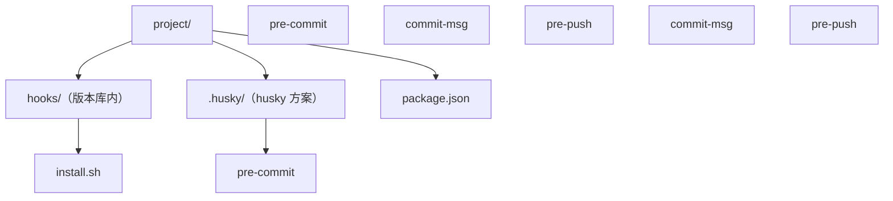

## 知识点地图

- **知识类别**：Git 生命周期钩子（hooks）——Git 在特定事件点自动执行的可定制脚本。
- **解决什么问题**：人都会忘——忘记跑 lint、忘记跑测试、提交信息随手写。钩子把这些检查钉在 Git 操作的关键节点上，不达标就直接拦截，让规范不依赖自觉。
- **什么时候用到**：团队统一代码风格（pre-commit 跑 lint/format）、校验提交信息格式（commit-msg，与 095-CommitMessageStandards 的 Conventional Commits 配套）、推送前跑测试（pre-push）、服务器端接收时把关（pre-receive/update）与自动部署（post-receive）。

## 1. Git 钩子概述

Git 钩子是 Git 仓库中的脚本，放在 `.git/hooks/` 目录下，在特定 Git 事件发生时自动执行。`git init` 时该目录会生成一批 `.sample` 后缀的示例脚本，去掉后缀并赋予可执行权限即生效。

### 钩子类型

- **客户端钩子**：在本地操作（commit、push）时触发，只约束执行者本人；
- **服务器端钩子**：在服务器端接收推送时触发，是唯一能约束所有人的强制点。

**关键认知**：客户端钩子可以被 `git commit --no-verify` 绕过，也不是 clone 带下来的（`.git/` 不进版本库）。所以客户端钩子负责「帮我省事」，真正的红线必须由服务器端钩子或 CI 兜底。

## 2. 客户端钩子

### 2.1 常见客户端钩子

| 钩子名称             | 触发时机         | 用途                   |
| :------------------- | :--------------- | :--------------------- |
| `pre-commit`         | 提交前           | 代码检查、格式化、测试 |
| `prepare-commit-msg` | 提交消息编辑器前 | 自动生成提交消息       |
| `commit-msg`         | 提交消息编辑后   | 验证提交消息格式       |
| `post-commit`        | 提交后           | 通知、触发构建         |
| `pre-push`           | 推送前           | 运行测试、检查         |

`pre-commit` 不接收参数；`commit-msg` 接收一个参数——存放提交信息的临时文件路径；`pre-push` 接收远端名与远端 URL。**易错点**：钩子脚本里用相对路径引用仓库文件时，当前目录是仓库根（大多数钩子）或临时目录（个别钩子），写脚本前先 `pwd` 确认。

### 2.2 创建 pre-commit 钩子

```bash
# 进入 Git 仓库
cd /path/to/repo
# 创建 pre-commit 钩子
cat > .git/hooks/pre-commit << 'EOF'
#!/bin/bash
# 运行代码检查
echo "Running code linting..."
npm run lint
# 运行测试
echo "Running tests..."
npm test
# 检查结果
if [ $? -ne 0 ]; then
  echo "Tests failed, commit aborted"
  exit 1
fi
echo "Pre-commit checks passed"
EOF
# 使钩子可执行
chmod +x .git/hooks/pre-commit
```

逐行看关键处：`#!/bin/bash` 声明解释器，缺了它某些平台会用 sh 执行导致语法报错；钩子的「拦截」机制就是**退出码**——非零退出码让 `git commit` 中止，这是整个钩子体系唯一的控制手段，所以脚本结尾必须显式 `exit 1`，漏写则检查失败也照常提交；`$?` 取上一条命令的退出码，但注意它在 `echo` 之后取到的是 echo 的（恒为 0），严谨写法是 `npm test || exit 1`。

**换一种写法会怎样**：把整套检查写成 `npm test && npm run lint` 一行，任一失败即非零退出，脚本更短也更不容易犯 `$?` 的时序错误——本例的 if 写法教学价值在于展示退出码语义，工程上推荐短路写法。

### 2.3 创建 commit-msg 钩子

```bash
# 创建 commit-msg 钩子
cat > .git/hooks/commit-msg << 'EOF'
#!/bin/bash
# 检查提交消息格式
commit_msg=$(cat "$1")
# 正则表达式检查提交消息格式
if ! echo "$commit_msg" | grep -qE '^(feat|fix|docs|style|refactor|test|chore): .+'; then
  echo "Error: Invalid commit message format"
  echo "Commit message should start with: feat|fix|docs|style|refactor|test|chore:"
  exit 1
fi
echo "Commit message format is valid"
EOF
# 使钩子可执行
chmod +x .git/hooks/commit-msg
```

逐段解释：`$1` 是 Git 传入的提交信息临时文件路径（如 `.git/COMMIT_EDITMSG`），`cat "$1"` 读出信息全文——注意必须读文件而不是猜参数，`commit --amend` 与 merge 提交传入的文件不同；`grep -qE` 静默匹配扩展正则，`^(feat|fix|...): .+` 要求「类型冒号空格正文」结构，`.+` 保证冒号后不为空，防住 `feat:` 这种空标题；`!` 取反配合 if 实现「不匹配即拒绝」。这条正则正是本仓库 CONTRIBUTING 采用的 Conventional Commits 约定的最小实现，完整规范见 095 篇。

**易错点**：Windows 下用 PowerShell 写文件时行尾会变 CRLF，bash 钩子第一行 `\r` 会导致 `bad interpreter` 报错。用编辑器保存为 LF，或跑 `dos2unix`。

## 3. 服务器端钩子

### 3.1 常见服务器端钩子

| 钩子名称       | 触发时机   | 用途                 |
| :------------- | :--------- | :------------------- |
| `pre-receive`  | 推送接收前 | 拒绝不符合规则的推送 |
| `update`       | 分支更新时 | 对特定分支进行检查   |
| `post-receive` | 推送接收后 | 部署、通知           |

三者区别：`pre-receive` 整次推送只跑一次，任何一个 ref 不合规就整体拒绝；`update` 每个 ref 各跑一次，可以做「main 禁止 force push、feature 分支放开」这类按分支策略；`post-receive` 在引用已更新后执行，此时拒绝已无意义，只适合通知与部署。

### 3.2 创建 post-receive 钩子

```bash
# 在服务器仓库中创建 post-receive 钩子
cat > /path/to/repo.git/hooks/post-receive << 'EOF'
#!/bin/bash
# 部署应用
echo "Deploying application..."
# 切换到部署目录
cd /path/to/deploy
# 拉取最新代码
git pull origin main
# 安装依赖
npm install
# 构建应用
npm run build
# 重启服务
echo "Restarting service..."
systemctl restart my-app
echo "Deployment completed successfully"
EOF
```

裸仓库（`repo.git`）里 `.git/hooks` 写作 `<repo>.git/hooks`。`git pull origin main` 在部署目录里执行时，部署目录自己是独立的工作仓库，从裸仓库拉取。**易错点**：钩子进程的环境变量很瘦（没有你的 PATH、没有 nvm 加载的 node），脚本里调 `node`/`npm` 失败十有八九是环境问题，脚本开头显式 `source ~/.nvm/nvm.sh` 或写绝对路径 `/usr/local/bin/npm`。另外 post-receive 跑在推 pushing 用户的会话里，长时间构建会卡住对方终端——重活交给 CI，钩子只触发 CI。

## 4. 钩子最佳实践

1. **版本控制钩子**：将钩子存储在仓库中，使用脚本安装；
2. **错误处理**：在钩子中添加适当的错误处理；
3. **性能考虑**：确保钩子执行时间不会过长；
4. **可配置性**：允许通过配置文件自定义钩子行为；
5. **文档**：为钩子添加注释和文档。

### 4.1 钩子管理脚本

`.git/hooks` 不随 clone 分发，团队共享钩子的经典做法是把脚本放仓库里的 `hooks/` 目录，用安装脚本复制过去：

```bash
#!/bin/bash
# hooks/install.sh
# 安装钩子
cp hooks/* .git/hooks/
chmod +x .git/hooks/*
echo "Hooks installed successfully"
```

每名成员 clone 后跑一次 `bash hooks/install.sh`。更现代的替代是 Git 2.9+ 的 `git config core.hooksPath hooks`——一行配置让 Git 直接去仓库目录找钩子，省去复制，也保证改钩子立即对所有人生效。

## 5. 高级钩子示例

### 5.1 自动更新版本号

```bash
# pre-commit 钩子
#!/bin/bash
# 自动更新版本号
if [ -f package.json ]; then
  current_version=$(jq -r '.version' package.json)
  # 简单的版本号递增逻辑
  new_version=$(echo $current_version | awk -F. '{print $1"."$2"."$3+1}')
  jq ".version = \"$new_version\"" package.json > package.json.tmp && mv package.json.tmp package.json
  git add package.json
  echo "Updated version to $new_version"
fi
```

`jq -r '.version'` 取出版本号，`awk -F. '{...$3+1}'` 把修订位加一，`jq` 写回时先落临时文件再 `mv`，避免读写同一文件截断自身。**易错点**：pre-commit 里 `git add package.json` 把文件重新暂存，但如果这个钩子对所有提交生效，任何提交都会捎带一次版本号变更——生产上应只在发布分支触发，且真正的发布流程推荐 `npm version patch` 这类专用命令。

### 5.2 自动生成 CHANGELOG

```bash
# post-commit 钩子
#!/bin/bash
# 自动生成 CHANGELOG
if [ ! -f CHANGELOG.md ]; then
  echo "# Changelog\n" > CHANGELOG.md
fi
# 获取最新提交信息
latest_commit=$(git log -1 --pretty=%B)
# 提取提交类型和信息
if echo "$latest_commit" | grep -qE '^(feat|fix|docs|style|refactor|test|chore):'; then
  commit_type=$(echo "$latest_commit" | cut -d: -f1)
  commit_msg=$(echo "$latest_commit" | cut -d: -f2 | sed 's/^ //')
  # 获取当前日期
  current_date=$(date +"%Y-%m-%d")
  # 添加到 CHANGELOG
  echo "## $current_date\n\n- **$commit_type**: $commit_msg\n" | cat - CHANGELOG.md > CHANGELOG.md.tmp && mv CHANGELOG.md.tmp CHANGELOG.md
  git add CHANGELOG.md
  git commit --amend --no-edit
  echo "Updated CHANGELOG.md"
fi
```

`git log -1 --pretty=%B` 取完整提交正文；`cut -d: -f1/-f2` 按冒号拆类型与正文；`cat - CHANGELOG.md` 把新条目插到文件头。**为什么这样写有问题（刻意示例）**：post-commit 里 `git commit --amend` 会改变刚创建的提交哈希，若 push 与 amend 竞态会造成分歧；且循环 amend 是常见翻车点。工程替代：改用 `conventional-changelog` 等工具在发布时生成，或把生成挪到 pre-push，避免改写已成形的历史。

## 6. 工具与集成

- **husky**：现代 Git 钩子管理工具，把钩子脚本纳入 npm 生命周期与版本控制；
- **lint-staged**：配合 husky 使用，只对暂存文件运行检查，把全量 lint 的秒级等待降到毫秒级。

### 6.1 项目实战：完整钩子配置



自管 `hooks/` 目录 + 安装脚本适合语言无关的项目；Node 项目推荐 husky 路线。

### 6.2 使用 husky 管理钩子

**安装 husky**

```bash
npm install husky --save-dev
npx husky install
npm set-script prepare "husky install"
```

`prepare` 脚本让 `npm install` 自动完成钩子接线——新成员装完依赖钩子就在位，这正是解决「.git/hooks 不随 clone 分发」的方案。

**添加钩子**

```bash
npx husky add .husky/pre-commit "npm run lint"
npx husky add .husky/commit-msg "npx commitlint --edit $1"
npx husky add .husky/pre-push "npm test"
```

三条命令分别把 lint 挂在提交前、把 commitlint（按 Conventional Commits 校验信息，见 095 篇）挂在信息编辑后、把测试挂在推送前。`commitlint --edit $1` 中的 `$1` 就是 Git 传给 commit-msg 钩子的信息文件路径。

## 7. 常见问题

**问：钩子写好了但完全不执行？**
按顺序查三件事：文件是否有可执行权限（`chmod +x`）；文件名是否正确且没有 `.sample` 后缀；Windows 下是否 CRLF 行尾导致解释器行失效。

**问：钩子执行时间过长，影响开发效率？**
把检查范围缩小到暂存文件（lint-staged），或把重检查挪到 pre-push / 服务器端 / CI。pre-commit 里跑全量测试套件是新手最常犯的性能错误。

## 动手实践

**练习 1**：在测试仓库写一个 pre-commit 钩子，拒绝暂存任何超过 1 MB 的文件（用 `git diff --cached --name-only` 列暂存文件，`stat -c %s` 或 `wc -c` 看大小）。

**提示**：遍历暂存文件列表时注意文件名带空格的情况；退出码非零即可拦截提交。

**练习 2**：写一个 commit-msg 钩子，在 2.3 的正则基础上支持带 scope 的写法 `feat(api): ...`，并拒绝正文超过 72 字符的 subject 首行。

**提示**：Conventional Commits 的完整正则是 `^(feat|fix|...)(\(.+\))?: .+`；首行可用 `head -n 1` 或 `sed -n 1p` 提取。

**练习 3**：用 `git commit --no-verify` 绕过练习 1 的钩子提交一个大文件，体会「客户端钩子只是提醒」；再用裸仓库 + update 钩子（拒绝往 main 推大文件）在本地模拟一遍服务器端强制（`git clone --bare` 起服务器，再从普通仓库 push）。

<details>
<summary>参考实现（先自己动手，再看这里）</summary>

```bash
# 练习 1：拦截超过 1 MB 的暂存文件
cat > .git/hooks/pre-commit << 'EOF'
#!/bin/bash
fail=0
while IFS= read -r f; do
  [ -f "$f" ] || continue
  size=$(wc -c < "$f")
  if [ "$size" -gt 1048576 ]; then
    echo "BLOCKED: $f is $size bytes (>1MB)"
    fail=1
  fi
done < <(git diff --cached --name-only --diff-filter=ACM)
exit $fail
EOF
chmod +x .git/hooks/pre-commit

# 练习 2：支持 scope 且限制首行长度
cat > .git/hooks/commit-msg << 'EOF'
#!/bin/bash
msg=$(cat "$1")
first_line=$(printf '%s\n' "$msg" | sed -n 1p)
if ! printf '%s' "$first_line" | grep -qE '^(feat|fix|docs|style|refactor|test|chore)(\(.+\))?: .+'; then
  echo "Invalid format: type(scope): subject"; exit 1
fi
len=$(printf '%s' "$first_line" | wc -m)
if [ "$len" -gt 72 ]; then
  echo "Subject line is $len chars (max 72)"; exit 1
fi
EOF
chmod +x .git/hooks/commit-msg

# 练习 3：服务器端强制
git clone --bare lab lab.git
cat > lab.git/hooks/update << 'EOF'
#!/bin/bash
ref="$1"
if [ "$ref" = "refs/heads/main" ]; then
  while read -r old new _; do
    for oid in $(git rev-list "$old..$new"); do
      size=$(git cat-file -s "$oid")
      [ "$size" -gt 1048576 ] && { echo "BLOCKED: $oid is $size bytes"; exit 1; }
    done
  done
fi
exit 0
EOF
chmod +x lab.git/hooks/update
git remote add origin ./lab.git
git push origin main   # 大文件提交会被服务器端拒绝，即使本地 --no-verify
```

</details>

## 参考与致谢

- Pro Git（第 2 版）第 8 章「Customizing Git - Git Hooks」，git-scm.com/book，CC BY-NC-SA 3.0
- Git 官方文档 githooks(5)：<https://git-scm.com/docs/githooks>（GPLv2 文档许可）
- husky 官方文档：<https://typicode.github.io/husky/>（MIT）
- 本文钩子脚本示例整理自本仓库原 340 篇既有内容（仓库内部素材）。
