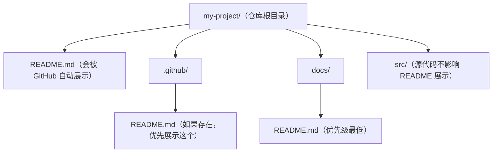

## 0. 从一家饭店说起：README 就是店铺的招牌和产品说明书

想象你住的小区门口开了两家新饭店，你下班路过想随便吃点：

- **第一家饭店**只在门口挂了一块木板，上面写着"饭店"两个字。没有店名、没有菜单、没有价格、没有营业时间。你走进去问："你们卖什么？"老板头也不抬："自己看。"你只好悻悻离开。
- **第二家饭店**挂出了招牌"老王川菜馆"，旁边立着一块菜单板：招牌菜、价格、营业时间、是否支持打包，甚至写着"新店开业，水煮鱼 8 折"。你在 30 秒内就决定了：今天吃它！

你的 GitHub 仓库就是这家"饭店"，而 **README 文件**就是它的招牌加产品说明书。任何一个访客（同学、未来的同事、潜在用户、招聘你的面试官）点进你的仓库，第一眼看到的就是 README。它决定了对方是"转身就走"还是"留下来看看"。

在正式讲解之前，先记住一个结论：**README 回答访客最关心的五个问题**——这个项目是做什么的？为什么有用？怎么开始用？遇到问题去哪求助？谁在维护和贡献它？（这五个问题来自 GitHub 官方文档对 README 的定义。）

## 1. 直观理解：没有 README 的仓库 vs 有 README 的仓库

### 1.1 两个仓库的对比

假设你负责的两个仓库放在一起，一个是空的，一个写好了 README：

| 对比维度 | 仓库 A：没有 README | 仓库 B：有 README |
| :--- | :--- | :--- |
| 访客第一印象 | 一堆陌生文件，不知道从哪看起 | 一段话讲清项目定位，30 秒进入状态 |
| 想试用的人 | 找不到安装方法，放弃 | 按"快速开始"三步跑起来 |
| 想贡献的人 | 不知道能不能改、怎么改 | 按"贡献指南"提交第一个 PR |
| 出了 Bug 的人 | 不知道去哪反馈 | 看到 Issue 链接和联系渠道 |
| 搜索可见性 | 仓库描述缺省，难以被发现 | 关键词丰富，更容易被搜索到 |
| 项目可信度 | 像"半成品"，不放心使用 | 像"成熟产品"，敢于依赖 |

### 1.2 一个真实的心理过程

GitHub 上有一个著名的规律：**访客点开仓库后，平均只停留几十秒**。在这几十秒里，访客会扫一眼文件列表，然后立刻去找 README。找不到的话，大多数新手会直接关闭页面；只有经验丰富的开发者才会去翻代码目录碰运气。

所以 README 的本质是"**降低理解成本**"：把"看懂这个项目"的成本从"读完所有源码"降到"读完一页文档"。这是性价比最高的一次投入。

## 2. 原理讲解：GitHub 如何识别和展示 README

### 2.1 先直观理解

你在 GitHub 上打开一个仓库主页，代码文件列表上方那块自动渲染出来的图文区域，就是 README 的"展示位"。你不需要点开任何文件，它就在那里。

### 2.2 再讲原理

GitHub 对 README 的识别有一套固定规则（官方文档明确说明）：

- README 文件名必须是 `README.md`（扩展名也可以是 `.txt`、`.markdown` 等，但 Markdown 最通用）。
- 文件放在**三个位置之一**会被自动识别展示：仓库根目录、`.github` 目录（隐藏目录）、`docs` 目录。
- 如果仓库里同时存在多个 README，展示优先级为：**`.github` 目录 > 根目录 > `docs` 目录**。
- README 渲染视图超过 **500 KiB** 的内容会被截断，所以不要把所有内容都塞进 README。
- GitHub 会根据 README 中的各级标题**自动生成目录**（网页右上角的"大纲"图标），所以善用标题层级就等于免费获得导航。
- 有一个彩蛋：如果你的用户名是 `zhangsan`，在一个公开仓库根目录放一个名为 `README.md` 且仓库名也叫 `zhangsan` 的文件，它会**自动显示在你的个人主页**上，这就是"个人主页 README"。

### 2.3 最后看示例

以本学习平台项目为例（示意）：



## 3. 操作示例：一份带注释的完整 README 模板

下面是一份工程实践中常见的 README 结构，每段都标注了"为什么这么写"。你可以直接复制修改。

```markdown
# 待办清单 Web 应用

<!-- 1. 徽章区：状态一览，通常用 shields.io 生成 -->


<!-- 2. 一句话简介：回答"这是什么、为什么有用" -->
一个使用 Vue 3 + TypeScript 开发的轻量待办清单应用，
支持本地存储、拖拽排序和深浅色主题，适合个人效率管理。

<!-- 3. 功能特性：让访客快速判断是否匹配需求 -->
## 功能特性

- 任务增删改查，支持截止日期与优先级标记
- 数据自动保存到浏览器 localStorage，无需后端
- 深色/浅色主题一键切换
- 响应式布局，移动端可用

<!-- 4. 快速开始：让新手 3 分钟跑起来，必须有完整前置条件 -->
## 快速开始

### 环境要求

- Node.js 18 及以上版本
- npm 9 及以上版本

### 安装与运行

```bash
git clone https://github.com/yourname/todo-app.git
cd todo-app
npm install          # 安装依赖
npm run dev          # 启动开发服务器，默认 http://localhost:5173
```

### 使用示例

```typescript
import { createTodoStore } from 'todo-app';

const store = createTodoStore();
store.add('学习 README 写作', { priority: 'high' });
console.log(store.list()); // 输出所有待办
```

<!-- 5. 文档与帮助：大型项目把详细文档放到 Wiki 或 docs 目录 -->
## 文档

- [完整 API 文档](docs/api.md)
- [常见问题 FAQ](docs/faq.md)

<!-- 6. 贡献指南：让想帮忙的人知道怎么加入 -->
## 贡献

欢迎贡献代码、文档或反馈 Bug。请先阅读 [贡献指南](CONTRIBUTING.md)，
提交 PR 前请运行 `npm run lint` 和 `npm test`。

<!-- 7. 许可证：开源项目的法律底线，不可省略 -->
## 许可证

本项目采用 [MIT](LICENSE) 许可证。
```

### 3.4 进阶格式技巧：让 README 更好读

基础模板之上，GitHub Flavored Markdown 还提供几个高频技巧，工程实践中几乎必用：

```markdown
<!-- 1. 表格：展示功能对比、版本信息、目录 -->
| 功能 | 免费版 | 专业版 |
| :--- | :---: | :---: |
| 本地存储 | 支持 | 支持 |
| 云同步 | 不支持 | 支持 |

<!-- 2. 任务列表：展示开发进度，可勾选 -->
## 开发进度

- [x] 完成登录模块
- [x] 完成待办列表
- [ ] 完成数据导出（开发中）

<!-- 3. 折叠区块：收起长截图、日志、多版本说明 -->
<details>
<summary>点击展开：v1.0 迁移说明</summary>

1. 备份 `config.json`
2. 运行 `npm run migrate`
3. 重启服务

</details>

<!-- 4. 告警块：突出注意事项（GitHub 原生支持） -->
> [!NOTE]
> 本工具依赖 Node.js 18+，旧版本无法运行。

> [!WARNING]
> 生产环境请务必先备份数据库再升级。
```

要点：表格用于结构化对比；任务列表让进度可视化；`<details>` 折叠长内容保持首屏清爽；`> [!NOTE]` 等告警语法让"重要提醒"不被淹没。

## 4. 常见错误与对策表

新手写 README 时最容易踩的坑，整理如下：

| 常见错误 | 现象/报错 | 原因 | 解决办法 |
| :--- | :--- | :--- | :--- |
| 忘记初始化 README | 新建仓库时没勾选"Add a README file"，主页光秃秃 | 创建仓库时默认未生成 README | 仓库首页点 Add file → Create new file，输入 `README.md` |
| 文件名写错 | README 不展示，显示为普通文本文件 | 写成 `readme.md`、`README.txt` 外的名字 | 使用 `README.md`，注意大小写 |
| 代码块没有标注语言 | 代码没有语法高亮 | 省略了 ` ```javascript ` 的标注 | 每个代码块第一行写明语言，如 ` ```python ` |
| 相对链接 404 | 图片、文档链接点开是 404 | 使用了绝对路径或错误的相对路径 | 使用 `docs/images/logo.png` 这类仓库内相对路径 |
| README 过短或过长 | 要么只有两行，要么 500 KiB 被截断 | 内容失衡 | 概览放 README，详细内容放 Wiki 或 docs 目录 |
| 忘写许可证 | 访客不敢使用你的代码 | 没有 LICENSE 文件 | README 引用 LICENSE 文件，并说明开源协议类型 |
| 代码示例不可运行 | 访客复制后直接报错 | 示例缺少上下文或依赖 | 写完后在干净环境实测一遍再发布 |

## 6. 一句话记忆

**README 就是仓库的招牌和产品说明书——用最少的文字回答"这是什么、为什么有用、怎么开始用、去哪求助、谁在维护"，让访客 30 秒内决定要不要继续了解你的项目。**

### 延伸阅读（站内文档）

- 开源许可证如何选择，见 004-github 模块《开源许可证选择》。
- 贡献指南与社区健康文件，见 004-github 模块《社区健康文件》。
- 详细文档如何组织，见 004-github 模块《Wikis》。
- 协作开发规范与分支保护，见 004-github 模块《协作开发规范》。
