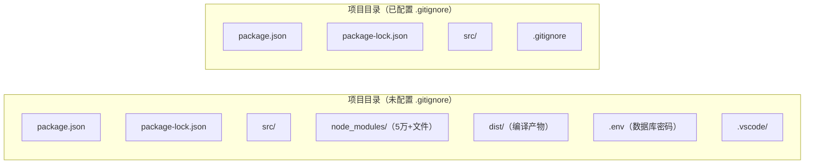
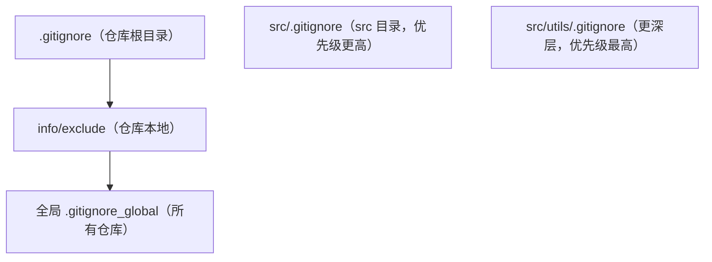

## 0. 先来一个生活场景：搬家打包清单

假设你要搬家。搬家师傅给你一个大箱子，让你把所有东西装进去。你会怎么做？

- 你不会把**垃圾桶里的果皮纸屑**装进去——那是垃圾，随时可以再产生。
- 你不会把**旧快递盒、旧报纸**装进去——它们占了大量空间却没有价值。
- 你更不会把**写了银行卡密码的纸条**装进去——万一箱子丢了，后果不堪设想。
- 但你一定会在箱子里放一份**搬家清单**，告诉师傅"哪些东西不要装箱"。

`.gitignore` 就是 Git 仓库的"搬家清单"。它是一份**排除清单**，明确告诉 Git："这个箱子（仓库）里，哪些文件不要追踪、不要提交、不要推到 GitHub 上"。

Git 默认会追踪目录里的所有文件。如果你不做任何声明，`node_modules`（几十万个依赖文件）、`__pycache__`（Python 缓存）、`.env`（含数据库密码的环境变量）都会被一股脑推送到 GitHub。这就好比把垃圾、旧报纸和密码纸条都装进了搬家箱。

本篇文章将按照"**清单**"的思路组织：先列出"什么东西不该装箱"（文件类型），再教你"怎么写清单"（语法），然后讲"多张清单谁说了算"（优先级），最后给出"现成的清单模板"。

## 1. 先列清单：应该忽略的文件类型

在动手写 `.gitignore` 之前，先搞清楚"什么文件不该进仓库"。下表是新手最常遇到的 7 大类：

| 类型 | 示例 | 为什么要忽略 |
| :--- | :--- | :--- |
| **构建产物** | `dist/`、`build/`、`*.class` | 由源代码编译生成，任何时刻都可以重新构建 |
| **依赖目录** | `node_modules/`、`vendor/`、`.venv/` | 体积巨大（可达几十万个文件），且可通过 `npm install` 等命令恢复 |
| **环境配置** | `.env`、`config.local.js`、`secrets.json` | 通常包含数据库密码、API 密钥等敏感信息 |
| **IDE 配置** | `.idea/`、`.vscode/`、`*.iml` | 属于个人编辑器偏好，不同开发者配置不同 |
| **系统文件** | `.DS_Store`、`Thumbs.db` | 操作系统自动生成的缩略图/元数据文件 |
| **日志文件** | `*.log`、`logs/` | 运行时产生，内容动态变化 |
| **临时文件** | `*.tmp`、`*.swp`、`*~` | 编辑器或程序崩溃留下的临时残留 |

### 1.1 一个记忆口诀

> **"能再生的、能重装的、不能给别人看的、别人不需要的——都不要装箱。"**

- 能再生：构建产物（dist/build）。
- 能重装：依赖目录（node_modules 一条命令就能装回来）。
- 不能给别人看：密钥、密码、Token。
- 别人不需要：你的 IDE 设置、操作系统缓存。

### 1.2 直观理解：一个 Node.js 项目装箱前 vs 装箱后



右侧才是"干净"的仓库：只有源代码、配置文件清单和 `.gitignore` 本身。任何协作者克隆后执行 `npm install` 即可恢复完整环境。

## 2. 怎么写清单：语法规则详解

`.gitignore` 是一个纯文本文件，每行一条规则。Git 官方手册（gitignore(5)）对语法有精确的定义，下面按"先直观、后原理、再示例"的方式讲解。

### 2.1 最基本的五条规则

```gitignore
# 注释以 # 开头（这是注释行）

# 规则1：忽略所有 .log 结尾的文件（匹配任意目录层级）
*.log

# 规则2：忽略 node_modules 目录（目录名后带斜杠，只匹配目录）
node_modules/

# 规则3：忽略根目录下的 .env 文件
/.env

# 规则4：忽略特定文件
config.local.json

# 规则5：取反——前面忽略了所有 .log，但 debug.log 例外，要保留
!debug.log
```

逐条拆解：

| 写法 | 含义 | 原理说明 |
| :--- | :--- | :--- |
| `*.log` | 忽略所有 `.log` 文件 | `*` 匹配任意多个字符（但不能跨目录层级） |
| `node_modules/` | 忽略所有名为 node_modules 的目录 | **结尾带斜杠**表示只匹配目录 |
| `/.env` | 只忽略仓库根目录的 `.env` | **开头带斜杠**表示锚定在 `.gitignore` 所在目录 |
| `!debug.log` | 例外保留 debug.log | `!` 开头表示取反（negation），必须放在对应忽略规则**之后** |
| `config.local.json` | 忽略任意层级的同名文件 | 不带斜杠的模式会匹配所有层级 |

### 2.2 进阶：Glob 通配符

`.gitignore` 的匹配规则与 Git 的 fnmatch 机制一致，支持以下通配符：

| 模式 | 含义 | 示例 | 匹配结果 |
| :--- | :--- | :--- | :--- |
| `*` | 匹配任意字符（不含 `/`） | `*.js` | `a.js`、`b/c.js`（后者在 `src/b/c.js` 这种场景下会匹配任意层级的 .js） |
| `**` | 匹配任意层级目录 | `**/temp/` | `temp/`、`src/temp/`、`src/a/b/temp/` |
| `?` | 匹配单个字符（不含 `/`） | `file?.txt` | `file1.txt`，不匹配 `file10.txt` |
| `[abc]` | 匹配括号内任一字符 | `file[123].txt` | `file1.txt`、`file2.txt` |
| `[0-9]` | 匹配字符范围 | `file[0-9].txt` | `file0.txt` ~ `file9.txt` |
| `\` | 转义特殊字符 | `\#important.txt` | 匹配字面的 `#important.txt` |

### 2.3 进阶：`**` 的三种位置

`**` 是新手最容易用错的通配符，Git 官方文档给出了精确语义：

```gitignore
# 场景1：开头 —— 匹配任意层级下的 foo 目录
**/foo

# 场景2：中间 —— 匹配 a 与 b 之间任意层级
a/**/b        # 匹配 a/b、a/x/b、a/x/y/b

# 场景3：结尾 —— 等价于普通星号，匹配该层全部内容
abc/**        # 等价于 abc/ 下的所有内容
```

### 2.4 最容易踩的坑：`!` 取反的"父目录陷阱"

Git 官方文档明确指出：**如果父目录被忽略，那么子目录的取反规则无效**。

```gitignore
# 错误示范：忽略了 build/ 目录，又想保留其中的 important.js
build/
!build/important.js    # 不会生效！

# 正确写法：不忽略目录本身，只忽略目录里的内容
build/*
!build/important.js    # 生效
```

原理：Git 出于性能考虑不会列出被忽略的目录，因此目录内部的规则根本不会被检查。要想保留子文件，必须让父目录"可见"。

## 3. 多张清单：优先级规则

你的仓库里可能同时存在多份规则来源。Git 检查忽略规则时按以下优先级从高到低排列（来源级别高的覆盖级别低的；**同一级别内，后写的规则覆盖先写的**）：

| 优先级 | 来源 | 说明 |
| :--- | :--- | :--- |
| 1（最高） | 命令行规则 | 如 `git ls-files --exclude` 传入的模式，仅本次命令生效 |
| 2 | 目录层级中的 `.gitignore` | **越深的目录优先级越高** |
| 3 | `$GIT_DIR/info/exclude` | 仓库本地规则，不随 clone 分发 |
| 4（最低） | `core.excludesFile` 全局文件 | 对所有仓库生效 |



### 3.1 深层 .gitignore 覆盖浅层的例子

```gitignore
# 仓库根目录 .gitignore：忽略所有 .md
*.md

# src/.gitignore：src 目录下保留 README.md
!README.md
```

效果：`根目录/README.md` 被忽略；`src/README.md` 由于 `src/.gitignore` 的取反规则生效，被正常追踪。同一目录内，规则按**自上而下**顺序判断，**后写的覆盖先写的**。

## 4. 直接抄作业：常用模板

GitHub 官方维护了一个模板仓库 [github/gitignore](https://github.com/github/gitignore)，收录了 100+ 种语言和工具的模板。以下三个模板是使用率最高的。

### 4.1 Node.js 项目模板

```gitignore
# 依赖
node_modules/

# 构建产物
dist/
build/

# 环境变量（绝对不要提交真实密钥！）
.env
.env.local
.env.*.local

# 日志
logs/
*.log
npm-debug.log*

# 测试覆盖率
coverage/
.nyc_output/

# 编辑器
.vscode/
.idea/
```

### 4.2 Python 项目模板

```gitignore
# 字节码缓存
__pycache__/
*.py[cod]

# 虚拟环境
.venv/
venv/
env/

# 打包产物
dist/
build/
*.egg-info/

# 环境变量
.env

# 测试与类型检查缓存
.pytest_cache/
.mypy_cache/
.ruff_cache/
```

### 4.3 Java 项目模板（Maven + IntelliJ IDEA）

```gitignore
# 编译产物
*.class
*.jar
*.war

# 构建目录
/target/
/build/

# IDE 配置
.idea/
*.iml
*.ipr
*.iws
.vscode/

# 系统文件
.DS_Store
Thumbs.db
```

### 4.4 下载官方模板的三种方式

```bash
# 方式1：GitHub 官方模板库（推荐）
curl -o .gitignore https://raw.githubusercontent.com/github/gitignore/main/Node.gitignore

# 方式2：GitHub 官方 API
curl -L https://api.github.com/gitignore/templates/Java

# 方式3：gitignore.io 组合生成器（多技术栈组合）
# 浏览器打开 https://www.toptal.com/developers/gitignore/api/java,maven,intellij
```

## 5. 亡羊补牢：已跟踪文件的处理

`.gitignore` 有一个新手必须知道的特性：**它只对"尚未被跟踪"的文件生效**。如果一个文件已经被 `git commit` 过，再把它写进 `.gitignore` 也不会让 Git 停止跟踪它。

### 5.1 停止跟踪但保留本地文件

```bash
# 从版本控制中移除（本地文件保留在磁盘上）
git rm --cached .env
git rm --cached -r node_modules/

# 提交这次移除
git commit -m "chore: 停止跟踪敏感与依赖文件"

# 之后正常推送
git push
```

### 5.2 临时忽略已跟踪文件的修改

某些场景（例如本地配置文件随环境变化）不需要从仓库移除文件，只想让 Git 忽略它的改动：

```bash
# 临时忽略 config.local.js 的修改
git update-index --assume-unchanged config.local.js

# 查看哪些文件被标记了
git ls-files -v | grep '^h'

# 恢复跟踪修改
git update-index --no-assume-unchanged config.local.js
```

### 5.3 验证忽略是否生效

```bash
# 查看哪些文件会被忽略（不真正删除）
git status --ignored

# 只查看被忽略的文件列表
git status --ignored --short

# 检查某个特定文件是否被忽略（0 表示会跟踪，1 表示被忽略）
git check-ignore -v .env
# 输出示例：.gitignore:2:/.env  .env
# 格式：来源文件:行号:规则  目标文件
```

`git check-ignore -v` 是排查"为什么这个文件被忽略了"的利器，它会告诉你命中了哪一行规则。

## 6. 全局配置：一份清单管所有仓库

操作系统文件（`.DS_Store`、`Thumbs.db`）和 IDE 配置（`.idea/`、`.vscode/`）几乎在每一个仓库都会被忽略。与其在每个仓库重复写，不如配置一份**全局忽略文件**。

### 6.1 Windows 配置全局忽略

```powershell
# 创建全局忽略文件（路径可自定义）
New-Item $env:USERPROFILE\.gitignore_global -ItemType File

# 配置 Git 使用它
git config --global core.excludesfile "$env:USERPROFILE\.gitignore_global"
```

### 6.2 macOS / Linux 配置全局忽略

```bash
touch ~/.gitignore_global
git config --global core.excludesfile ~/.gitignore_global
```

### 6.3 全局忽略文件推荐内容

```gitignore
# 操作系统生成文件
.DS_Store
Thumbs.db
desktop.ini

# 编辑器临时文件
.idea/
.vscode/
*.swp
*.swo
*~
```

## 7. 常见错误与对策

| 错误现象 | 报错/表现 | 原因 | 解决办法 |
| :--- | :--- | :--- | :--- |
| 明明写了 `node_modules/`，`git push` 还是把依赖推上去了 | 仓库里能看到 `node_modules` | 文件在添加 `.gitignore` **之前**已被提交跟踪 | 执行 `git rm --cached -r node_modules/` 再提交 |
| `!important.log` 写在 `*.log` 前面，取反不生效 | important.log 仍被忽略 | 取反规则必须写在对应的忽略规则**之后** | 调整顺序：先 `*.log` 后 `!important.log` |
| 忽略了 `build/` 又想保留 `build/hot.js`，取反无效 | 子文件仍被忽略 | 父目录被忽略后 Git 不会检查其内部规则 | 改用 `build/*` + `!build/hot.js` |
| 在 `.gitignore` 里写了 `/temp/`，其他目录的同名文件也被忽略了 | 表现不一致 | 对 `/temp/`（锚定根目录）与 `temp/`（匹配所有层级）的理解混淆 | 记住：**开头斜杠 = 锚定当前层级**，不带斜杠 = 匹配所有层级 |
| `.env` 里的密钥还是被推送了，事后才发现 | 安全事故 | 忽略了 `.env` 但密钥硬编码在 `src/config.js` 中 | 全局搜索密钥（`git grep "sk_live"`），轮换密钥，并使用环境变量 + GitHub Secrets |
| `git status` 不显示某文件，但 `git add` 报错 | `The following paths are ignored by one of your .gitignore files` | 想添加一个被忽略的文件 | 确认是否真的要添加；若要添加，用 `git add -f 文件名` 强制添加，或调整忽略规则 |

## 9. 一句话记忆

> **`.gitignore` 就是仓库的"搬家清单"——只列"不装什么"：能再生的构建产物、能重装的依赖、不能给别人看的密钥，以及别人不需要的 IDE 和系统文件。**

### 官方文档

- Git 官方手册 gitignore(5)：https://git-scm.com/docs/gitignore
- GitHub 官方模板库 github/gitignore：https://github.com/github/gitignore
- GitHub 文档（中文）：https://docs.github.com/zh
- gitignore.io 组合模板生成器：https://www.toptal.com/developers/gitignore

### 延伸阅读
- 分支模型与分支保护规则，见 004-github 模块 007 文档。
- 开源许可证选择（LICENSE 文件的管理思路与 .gitignore 类似），见 004-github 模块 009 文档。
- 依赖安全选项（锁定文件与 Dependabot 的配合使用），见 004-github 模块 010 文档。
- Git 协作基础（git add / commit / push 流程），见 003-git 模块。
