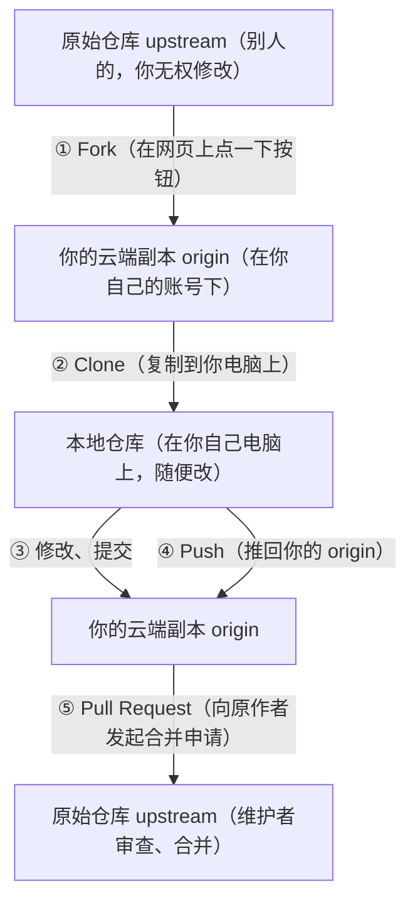

## 0. 从一道菜说起：Fork 就像"复刻菜谱"

你在一家很出名的川菜馆吃到一道招牌菜"水煮鱼"，想自己做，但厨师不可能把秘方给你，更不可能让你进他的后厨。

怎么办？你在网上找到一位美食博主的"复刻教程"——他把这道菜的食材、步骤、火候全部公开了，并且说："你可以照着做，也可以改进，如果你做出了更好的版本，欢迎提交给我，我把它收录进教程。"

于是你的操作过程是：

1. **把教程复制一份到自己手里**（相当于 Fork）；
2. **在自己家照着做**，自由发挥，不会影响博主原来的教程；
3. **做出改进后，向博主发起申请**："我改进了三步，你看能不能收录"（相当于 Pull Request）；
4. 博主审查后觉得不错，**把你的改进合并进原教程**。

这就是开源世界最核心的协作模式——**Fork 工作流**。本文按"fork → clone → 改 → PR → 合回"的完整流程逐步讲解。

## 1. 流程总览：先建立整体地图

在动手之前，先记住整条链路涉及"三个仓库、一个申请"：



术语速记：

| 术语 | 含义 | 类比 |
| :--- | :--- | :--- |
| **upstream** | 原始仓库（别人的项目） | 博主的原教程 |
| **origin** | 你 Fork 出来的副本 | 你复刻的教程副本 |
| **Fork** | 在 GitHub 云端复制仓库到你的账号 | 复制教程 |
| **Clone** | 把云端仓库下载到本地电脑 | 把教程打印成纸质版 |
| **PR（Pull Request）** | 请求原作者合并你的改动 | 申请把改进收录进原教程 |

### 1.1 Fork 和 Branch 有什么区别

很多新手会混淆这两个概念，一张表说清楚：

| 对比维度 | Fork | Branch（分支） |
| :--- | :--- | :--- |
| 位置 | 独立的新仓库（在你的账号下） | 同一个仓库内部 |
| 权限要求 | 无需原始仓库任何权限 | 需要该仓库的写权限 |
| 适用场景 | 开源贡献、无写权限的协作 | 团队内部开发 |
| 是否影响原仓库 | 不影响，完全隔离 | 分支合回前不影响默认分支 |
| CI/CD 配置 | 各自独立 | 共享仓库的配置 |

一句话：**没权限改别人的仓库时用 Fork，有权限时用 Branch**。

## 2. 流程第一步：Fork 仓库

### 2.1 网页操作

1. 打开目标仓库主页，例如 `https://github.com/torvalds/linux`；
2. 点击右上角 **Fork** 按钮；
3. 在弹出的页面选择归属（你的个人账号或组织），仓库名可以保持默认；
4. 点击 **Create fork**，几秒钟后你就拥有了一个一模一样的仓库副本，地址为 `https://github.com/你的用户名/linux`。

### 2.2 用 GitHub CLI 操作（可选）

```bash
# 安装 gh 后登录
gh auth login

# Fork 指定仓库到你的账号
gh repo fork torvalds/linux --clone
# 说明：--clone 表示 Fork 后自动克隆到本地
```

## 3. 流程第二步：克隆并配置两个远程仓库

### 3.1 操作示例

Fork 之后，你的云端副本是"静止的"——它不会自动跟随原仓库更新。要让它跟上进度，需要把**两个**远程地址都配置好：

```bash
# 1. 克隆你 Fork 的副本（origin）
git clone https://github.com/你的用户名/linux.git
cd linux

# 2. 把原始仓库添加为 upstream（"上游"）
git remote add upstream https://github.com/torvalds/linux.git

# 3. 查看配置结果：应该能看到两个 fetch/push 地址
git remote -v
# origin    https://github.com/你的用户名/linux.git (fetch)
# origin    https://github.com/你的用户名/linux.git (push)
# upstream  https://github.com/torvalds/linux.git (fetch)
# upstream  https://github.com/torvalds/linux.git (push)
```

### 3.2 为什么需要两个远程

- **origin** 指向你自己的副本，你推代码只能推到这里（原仓库没有你的写权限）；
- **upstream** 指向原仓库，用来**拉取**原仓库的最新代码，保证你的副本不落后。

可以这样记忆：origin 是"你能写字的草稿本"，upstream 是"别人的正稿，你只能读"。

## 4. 流程第三步：建分支、改代码、推上去

```bash
# 1. 确保 main 分支是最新的（第一次可以先跳过）
git fetch upstream
git checkout main
git merge upstream/main

# 2. 为这次改动创建功能分支（分支名要有意义）
git checkout -b fix/readme-typo

# 3. 修改文件，然后提交
git add README.md
git commit -m "docs: 修正 README 中的拼写错误"

# 4. 推送到你自己的副本（origin）的对应分支
git push origin fix/readme-typo
# 推送成功后，GitHub 会提示你点击 Compare & pull request
```

新手必记的三个分支纪律：

- **永远不要直接改 main 分支**，每个改动开一个分支；
- **分支名用"类型/描述"格式**，如 `feat/xxx`、`fix/xxx`、`docs/xxx`；
- **一次 PR 只做一个主题**，方便维护者审查和回滚。

## 5. 流程第四步：发起 Pull Request

1. 推完代码后，GitHub 会自动出现黄色横幅"Compare & pull request"，点击它；
2. 确认对比方向：**base 是原仓库的 main 分支，compare 是你副本的功能分支**；
3. 填写 PR 标题（一句话说清楚改动）和描述（为什么改、改了什么、如何验证）；
4. 如果改动是为了修复某个 Issue，在描述中写 `Fixes #123`，PR 合并时会自动关闭该 Issue；
5. 点击 **Create pull request**。

### 5.1 PR 描述模板参考

```markdown
## 改动内容

修复 README 中的三处拼写错误（installation → install 等）。

## 为什么改

拼写错误影响项目专业度，且容易被搜索工具误判。

## 验证方式

- 本地渲染 Markdown 无语法错误
- 链接均可正常访问

Fixes #102
```

### 5.2 PR 被审查后的常见反馈与应对

| 审查反馈 | 应对命令 |
| :--- | :--- |
| "请补充测试" | 加代码、提交、`git push`（PR 自动更新） |
| "代码风格不符" | 按项目规范修改后重新 push |
| "和 main 冲突了" | 见下文"同步与冲突解决" |
| "需要 rebase 到最新" | `git rebase upstream/main` 后 `git push --force-with-lease` |

## 6. 流程第五步：合回（Merge）与后续清理

PR 被维护者批准并合并后：

```bash
# 1. 把本地 main 同步到最新（含你被合并的改动）
git fetch upstream
git checkout main
git merge upstream/main

# 2. 删除已经没用的功能分支（本地 + 远程）
git branch -d fix/readme-typo
git push origin --delete fix/readme-typo
```

## 7. 保持 Fork 同步：三种方式对比

Fork 出来的副本不会自动同步，需要定期"跟上"上游，否则 PR 容易冲突。三种方式：

### 7.1 方式一：命令行（推荐，最可控）

```bash
git fetch upstream
git checkout main
git merge upstream/main
git push origin main    # 记得把同步结果推回你自己的云端副本
```

### 7.2 方式二：GitHub 网页按钮

打开你的 Fork 仓库主页 → 点击 **Sync fork**（同步分支）→ 点击 **Update branch**。适合不想记命令的场景，但只能同步 main 等分支，无法处理复杂冲突。

### 7.3 方式三：GitHub API / CLI

```bash
# 用 gh 触发 GitHub 服务端的同步
gh api repos/你的用户名/linux/merge-upstream -f branch=main
```

## 8. 冲突解决：PR 提示 "This branch has conflicts"

这是新手最怕、也最常遇到的场景。冲突的本质是：**你和别人改了同一段代码**。解决步骤：

```bash
# 1. 拉取上游最新代码到本地
git fetch upstream

# 2. 切到你的功能分支
git checkout fix/readme-typo

# 3. 把上游 main 合进来（或 rebase，二选一）
git rebase upstream/main
# 或：git merge upstream/main

# 4. 这时 Git 会提示冲突文件，逐个打开手动解决
#    冲突标记示例：
#    <<<<<<< HEAD
#    你写的内容
#    =======
#    上游的内容
#    >>>>>>> upstream/main

# 5. 解决完所有冲突后
git add 冲突文件
git rebase --continue   # 如果用 rebase
# 或
git commit -m "merge: 解决与 upstream 的冲突"   # 如果用 merge

# 6. 强制推送更新 PR（必须用 --force-with-lease，比 --force 安全）
git push origin fix/readme-typo --force-with-lease
```

**安全红线**：推送到自己 Fork 的分支时，优先用 `--force-with-lease` 而不是 `--force`。前者只在"远程分支没有被别人动过"时才覆盖，能避免误伤他人的改动。

## 9. 常见错误与对策表

| 常见错误 | 现象/报错信息 | 原因 | 解决办法 |
| :--- | :--- | :--- | :--- |
| 忘了配置 upstream | 提示 `fatal: 'upstream' does not appear to be a git repository` | 克隆后没执行 `git remote add upstream` | 按 3.1 节补上 upstream 配置 |
| 直接往原仓库推代码 | `Permission to owner/repo denied to 你的用户名` | 原仓库没有你的写权限 | 推送到自己的 Fork（origin），再发 PR |
| 往 main 分支开发 | PR 里混入大量无关历史 | 直接基于旧 main 建了改动 | 先同步 main，再 `checkout -b` 新功能分支 |
| 推送失败：分支落后 | `rejected ... non-fast-forward` | 远程分支和本地分叉了 | `git pull --rebase origin 分支名` 后再推 |
| 用了 `--force` 误伤他人 | 别人的提交被覆盖 | 强推覆盖了远程新提交 | 改用 `--force-with-lease`，除非确认独占分支 |
| PR 冲突不知道怎么办 | 网页提示 `This branch has conflicts` | 和上游改动同一段代码 | 按第 8 节 rebase + 手动解决 |
| PR 描述没关联 Issue | 合并后 Issue 还开着 | 描述里没写 `Fixes #编号` | PR 描述中加上 `Fixes #123` 格式 |

## 11. 一句话记忆

**Fork 工作流 = 把别人的仓库复制到自己账号（Fork）→ 克隆到本地（Clone）→ 在独立分支上修改 → 推送回自己的副本 → 向原作者发起合并申请（PR）→ 维护者审查合回，期间通过 upstream 持续同步保持不落后。**

### 延伸阅读（站内文档）

- 分支模型与分支保护规则，见 004-github 模块《分支模型与分支保护规则》。
- 从 Issue 到 PR 的完整协作流程，见 004-github 模块《PullRequest完整协作流程》。
- 冲突解决的更多细节，见 003-git 模块《Git冲突解决》。
- 开源许可证选择（Fork 公开仓库前必读），见 004-github 模块《开源许可证选择》。
