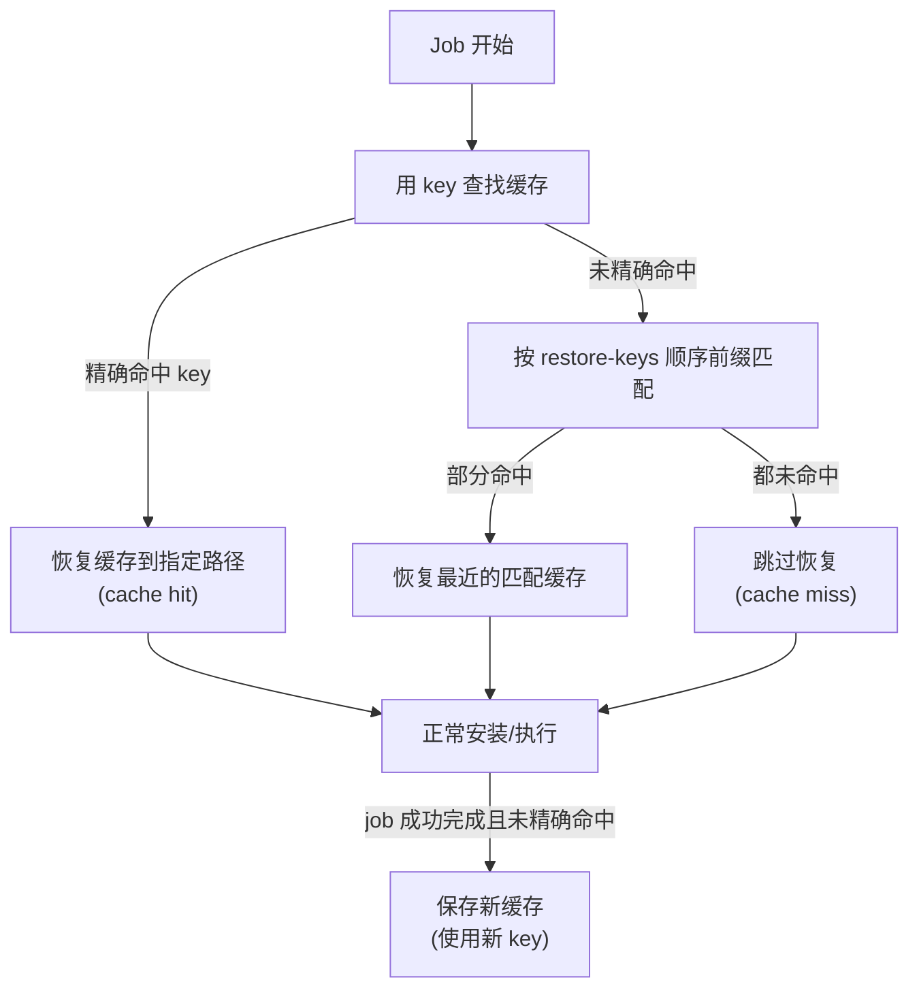

## 0. 开始之前：一个"厨房储物柜"的故事

想象你开了一家小餐馆，每天要做 50 道菜。没有储物柜的话，厨师每次做菜都要**从零开始**：去买菜、洗菜、切菜、备料，做完一道菜再全部重来一遍——哪怕今天和昨天的菜单一模一样。

后来你买了**厨房储物柜**：昨天买好的酱油、面粉、香料都存在柜子里，今天做菜直接"取用"，只有用完了或过期了才重新采购。做菜时间从 1 小时缩短到 10 分钟。你还在柜子上贴了标签（`key`），比如"酱油-大瓶-2026-07 批"，方便精准找到该用哪一瓶；万一指定的那瓶用完了，你还有备用的（`restore-keys`），凑合着先做，再补货。

GitHub Actions 的**依赖缓存**就是 CI 世界的"厨房储物柜"：把 npm/pip/go 下载好的依赖包存起来，下次构建直接复用，避免每次都从网络重新下载。本文从一个具体痛点出发，把缓存讲透。

## 1. 问题：每次 CI 都重新下载依赖，太慢了

### 1.1 痛点场景

一个典型的前端项目 CI 流水线是这样跑的：

```yaml
steps:
  - uses: actions/checkout@v4
  - uses: actions/setup-node@v4
    with:
      node-version: 20
  - run: npm ci          # 每次都从 npm 源下载几百 MB 依赖，耗时数分钟
  - run: npm test
```

每次提交、每个 PR 都会触发一次 `npm ci`，把几百 MB 的依赖从网络重新拉一遍。遇到网络波动还会更慢。对于一个几十上百人提交的仓库，这些"重复下载"浪费的分钟数和金钱非常可观。

### 1.2 缓存要解决的问题

缓存真正要解决的不是"让所有步骤都变快"，而是**减少重复下载和重复计算**：

- 依赖文件没变化时，就不要每次重新下载——直接复用缓存。
- 构建产物只用于本次交付，不要拿它当长期缓存（那是 Artifacts 的职责，见 035）。
- 把"依赖缓存"与"产物传递"的边界分清楚，优化才会清晰。

### 1.3 缓存的收益（官方实践数据）

GitHub 官方文档给出典型的收益预期：启用依赖缓存后，工作流运行时间可以从几分钟缩短到几十秒，尤其在依赖体积大的项目中效果显著。缓存对每个仓库最多可存 10 GB，超限后按"最久未访问"策略自动清理旧缓存。

## 2. 缓存原理：命中、未命中与匹配顺序

### 2.1 整体工作流程



### 2.2 命中与未命中的官方定义

根据 GitHub 官方文档（Dependency caching reference），恢复缓存时按以下顺序尝试：

1. **精确匹配 `key`**：如果找到了与 `key` 完全一致的缓存，视为 **cache hit**（缓存命中），直接恢复。
2. **按 `restore-keys` 顺序前缀匹配**：没有精确命中时，逐个用 `restore-keys` 做前缀匹配，取最近创建的匹配缓存。
3. **仍未命中**：视为 **cache miss**（缓存未命中），不恢复任何内容。

关键规则：**缓存未命中时，只要 job 最终成功完成，actions/cache 会自动用你提供的 `key` 保存一份新缓存**（内容为 `path` 指定的文件）。缓存保存后**不能原地修改**，只能通过新 key 生成新缓存——所以缓存策略有变时，改一下 key 里的版本号（如 `v2` → `v3`）就能自然切换到新缓存。

### 2.3 缓存范围与限制

| 限制项 | 值 | 说明 |
| --- | --- | --- |
| 单个缓存大小 | 最大 10 GB | 超大缓存会导致上传/下载变慢 |
| 仓库总缓存 | 最大 10 GB | 超限按最久未访问自动清理 |
| 缓存保留 | 7 天未访问自动删除 | 与 Artifacts 的保留策略不同 |
| 跨分支访问 | 当前分支 + 默认分支 | PR 还能访问 base 分支（目标分支）的缓存 |
| 缓存内容 | 禁止存放敏感信息 | 官方明确建议不要缓存 Token、凭据等 |

补充说明（官方文档）：PR 触发时创建的缓存会挂在 `refs/pull/.../merge` 下，通常只适合该 PR 自己重跑时使用；兄弟分支、不同 tag 之间不能随意互相读取缓存。

## 3. actions/cache 使用：从基础到各语言

### 3.1 基础用法

```yaml
steps:
  - uses: actions/cache@v4
    with:
      path: |                    # 要缓存/恢复的路径（支持多行、glob）
        ~/.npm
        node_modules
      key: npm-${{ runner.os }}-${{ hashFiles('package-lock.json') }}   # 精确键
      restore-keys: |            # 回退键（前缀匹配，按顺序尝试）
        npm-${{ runner.os }}-
```

参数详解：

| 参数 | 必填 | 说明 |
| --- | --- | --- |
| `path` | 是 | 缓存/恢复的路径，支持多路径和 glob；相对路径基于工作区目录解析 |
| `key` | 是 | 保存缓存时生成的键，也是查找缓存的键；最长 512 字符，超长会报错 |
| `restore-keys` | 否 | 回退键列表，每行一个，按顺序做前缀匹配 |
| `enableCrossOsArchive` | 否 | 设为 true 允许 Windows 运行器跨操作系统恢复缓存（默认 false） |

### 3.2 各语言缓存配置

**Node.js / npm**（缓存 npm 全局缓存目录，而非 node_modules）：

```yaml
- uses: actions/cache@v4
  with:
    path: ~/.npm
    key: npm-${{ runner.os }}-${{ hashFiles('**/package-lock.json') }}
    restore-keys: npm-${{ runner.os }}-

- run: npm ci     # 缓存命中时秒装，未命中时才全量下载
```

**Python / pip**：

```yaml
- uses: actions/cache@v4
  with:
    path: ~/.cache/pip
    key: pip-${{ runner.os }}-${{ hashFiles('requirements.txt') }}
    restore-keys: pip-${{ runner.os }}-

- run: pip install -r requirements.txt
```

**Go**：

```yaml
- uses: actions/cache@v4
  with:
    path: |
      ~/go/pkg/mod
      ~/.cache/go-build
    key: go-${{ runner.os }}-${{ hashFiles('go.sum') }}
    restore-keys: go-${{ runner.os }}-

- run: go mod download
```

**Java / Gradle**：

```yaml
- uses: actions/cache@v4
  with:
    path: |
      ~/.gradle/caches
      ~/.gradle/wrapper
    key: gradle-${{ runner.os }}-${{ hashFiles('**/*.gradle*', '**/gradle-wrapper.properties') }}
    restore-keys: gradle-${{ runner.os }}-
```

**Rust / Cargo**：

```yaml
- uses: actions/cache@v4
  with:
    path: |
      ~/.cargo/registry
      ~/.cargo/git
      target
    key: cargo-${{ runner.os }}-${{ hashFiles('**/Cargo.lock') }}
    restore-keys: cargo-${{ runner.os }}-
```

### 3.3 更省事的做法：setup-* 内置缓存

对主流语言，`setup-node`、`setup-python` 等官方 Action 已经内置缓存能力，**一行配置即可**，不必手写 actions/cache：

```yaml
- uses: actions/setup-node@v4
  with:
    node-version: 20
    cache: npm                     # 自动缓存 npm 全局缓存目录
    cache-dependency-path: package-lock.json   # monorepo 场景指定锁文件位置
```

注意：`setup-node` 的内置缓存**不缓存 node_modules**，而是缓存 npm 的全局包缓存目录，并根据 `package-lock.json` / `yarn.lock` 等锁文件自动生成缓存键。

## 4. 缓存策略设计：key 怎么设计才科学

### 4.1 key 的三层信息（官方推荐组合）

最常见的 key 写法是把"操作系统 + 语言版本 + 锁文件哈希"三要素放进去：

```yaml
key: ${{ runner.os }}-node-20-npm-v2-${{ hashFiles('**/package-lock.json') }}
```

- `runner.os`：区分 Linux/macOS/Windows。不同系统的依赖缓存不能混用（尤其带原生扩展的依赖）。
- `node-20`：区分运行时版本。Node/Python/Java 版本变了，缓存最好跟着变。
- `hashFiles(...)`：监听依赖变化。锁文件变了就生成新缓存，没变就尽量复用旧缓存。
- `v2`（可选）：手动版本号。未来调整缓存策略时，把 v2 改成 v3 即可自然切换到新缓存。

### 4.2 key 设计的两大误区

| 误区 | 后果 | 正确做法 |
| --- | --- | --- |
| key 太宽（如固定 `linux-node`） | 依赖换了还复用旧缓存，易污染、难排查 | key 至少包含 OS + 锁文件哈希 |
| key 太细（如把 `github.sha` 放进 key） | 每次提交 key 都不同，永远命中不了 | key 只放"会反映依赖变化"的信息，不要放提交 SHA |

### 4.3 多级回退：restore-keys 的正确打开方式

restore-keys 是"降级匹配"：精确 key 未命中时，按前缀尽量恢复一份**最近创建的**缓存，恢复后包管理器再补齐缺失依赖。注意：**restore-keys 命中的缓存不代表依赖完全一致，后续仍需执行安装命令**，不能因为恢复成功就跳过安装。

```yaml
key: npm-${{ runner.os }}-${{ hashFiles('package-lock.json') }}
restore-keys: |
  npm-${{ runner.os }}-    # 一级回退：同系统最近缓存
  npm-                     # 二级回退：跨系统兜底
```

### 4.4 缓存命中判断：cache-hit 输出

通过 `cache-hit` 输出可以精确控制后续步骤（比如命中时用离线安装，未命中时全量安装）：

```yaml
- uses: actions/cache@v4
  id: cache-npm
  with:
    path: ~/.npm
    key: npm-${{ runner.os }}-${{ hashFiles('package-lock.json') }}

- name: Install dependencies (cache miss)
  if: steps.cache-npm.outputs.cache-hit != 'true'
  run: npm ci

- name: Install dependencies (cache hit)
  if: steps.cache-npm.outputs.cache-hit == 'true'
  run: npm ci --prefer-offline
```

### 4.5 条件缓存：只在需要的分支保存

```yaml
- uses: actions/cache@v4
  if: github.ref == 'refs/heads/main'   # 仅 main 分支保存新缓存，PR 只恢复不保存
  with:
    path: ~/.npm
    key: npm-${{ runner.os }}-${{ hashFiles('package-lock.json') }}
```

## 5. 缓存管理：查看、清理与监控

### 5.1 用 gh 命令管理缓存

```bash
# 列出仓库所有缓存
gh cache list

# 按键前缀删除缓存
gh cache delete <key>

# 删除所有缓存
gh cache delete --all
```

### 5.2 通过 REST API 精确清理

```bash
# 获取所有缓存 ID 并逐个删除
gh api repos/OWNER/REPO/actions/caches \
  --jq '.actions_caches[].id' | \
  xargs -I {} gh api repos/OWNER/REPO/actions/caches/{} --method DELETE
```

### 5.3 缓存大小监控

```yaml
- name: Check cache size
  run: |
    du -sh ~/.npm || true
    du -sh ~/.cache/pip || true
    du -sh ~/go/pkg/mod || true
```

## 6. 常见错误与对策

| 常见错误 | 报错/现象 | 原因 | 解决办法 |
| --- | --- | --- | --- |
| 缓存永远不命中 | 每次构建都重新下载依赖 | key 中包含了每次提交都变化的变量（如 `github.sha`） | key 只保留 OS、语言版本、锁文件哈希等稳定信息 |
| 把 node_modules 塞进缓存 | 缓存巨大、跨平台冲突 | node_modules 含平台相关二进制，且体积大 | 只缓存包管理器缓存目录（如 `~/.npm`），不缓存 node_modules |
| 缓存命中后跳过安装导致依赖缺失 | 构建报找不到模块 | 误以为恢复缓存 = 依赖完整（restore-keys 部分命中时依赖可能不全） | 命中后仍执行安装命令，用 `npm ci --prefer-offline` 加速 |
| key 超过 512 字符 | actions/cache 执行失败 | key 太长 | 精简 key，去掉冗余变量 |
| 缓存里混入敏感文件 | 凭据泄露风险 | 把含 Token 的文件一起缓存了 | 官方明确建议：缓存中不要存放访问令牌、登录凭据等敏感信息 |
| 分支间互相读不到缓存 | 缓存命中率低 | 不了解缓存范围：兄弟分支、不同 tag 之间不能互读 | 依赖"当前分支 + 默认分支"的缓存规则设计 key 与恢复策略 |
| 缓存策略变更后旧缓存干扰 | 出现奇怪构建结果 | 新逻辑与旧缓存内容不兼容 | 在 key 中加手动版本号（v2 → v3），自然淘汰旧缓存 |

## 8. 一句话记忆

**缓存是 CI 的"厨房储物柜"：用 key 精确存取依赖包，锁文件不变就复用，变了就自动换新钥匙，restore-keys 兜底降级，让依赖安装从"重新买菜"变成"开柜取用"。**
