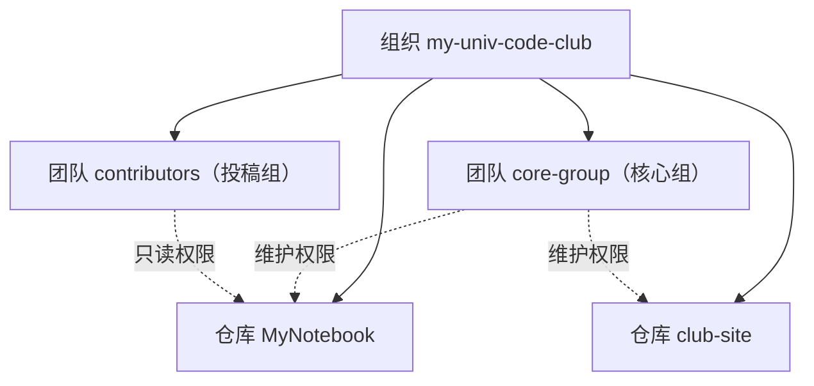

## 知识点地图

- **知识类别**：GitHub 组织（Organizations）、团队（Teams）与仓库权限角色（repository roles）——平台层面的「谁能对哪个仓库做什么」治理体系。
- **解决什么问题**：个人账户只有「协作者」一维，人多之后无法分组授权、无法统一回收权限、无法审计谁改了设置；组织把「人」与「仓库」解耦，用团队做中间层，让权限可按角色批量授予与撤销。
- **什么时候用到**：社团/班级仓库从「个人建仓库拉人」升级为正式组织；公司项目给外包、测试、运维分角色授权；任何需要「新成员入职即有正确权限、离职权限自动消失」的团队。分支保护（见[分支模型与分支保护规则](/github/170-BranchModelBranchRule)）决定「代码怎么进主干」，本文决定「谁有资格碰它」，两者配合才完整。

## 0. 场景：社团的笔记仓库要「转正」了

假设你是学校编程社的技术负责人。一开始仓库建在你个人账户下，叫 `MyNotebook`，谁想投稿就拉谁做协作者。一年后问题来了：

- 社里 40 个人，`Settings -> Collaborators` 列了一长串，谁该有推送权全靠记忆；
- 两位同学退社了，你忘了移除，他们还能往仓库推代码；
- 想让「核心组」管 Issue、「投稿组」只能看，个人仓库根本做不到这种分层。

答案是升级为**组织仓库**：建一个 Organization（比如 `my-univ-code-club`），把 `MyNotebook` 转移进去，然后所有人按角色进组织。从此权限跟着**团队**走，不跟着「你记得谁是谁」走。

这不是社团才有的需求——公司里叫「入职配权、离职回收」，本质是同一件事：**权限的授予与回收必须依附于可管理的结构，而不是人际记忆**。

## 1. 组织：把人和仓库装进同一栋楼

组织是一个共享账户，里面有两类东西：**成员（人）**与**仓库（资产）**。个人账户的仓库像「你家的书架」，组织仓库像「公司资料室」——存进去的东西属于组织，不随个人离开而消失。

三层结构一张图：



组织里有三种身份，权限天差地别：

| 身份 | 是什么 | 能做什么 |
| :--- | :--- | :--- |
| Owner（组织所有者） | 组织的「法人代表」 | 管理成员、建删仓库、改组织设置——几乎一切 |
| Member（成员） | 组织的正式成员 | 按组织基础权限与团队授权访问仓库，可被拉进团队 |
| Outside collaborator（外部协作者） | 只被授权了某些仓库的外人 | 只能看到/操作被明确授权的那几个仓库，**看不到组织其他仓库** |

为什么要分出「外部协作者」？因为把外包人员、外校合作者拉成组织成员，等于默认他能看见（至少是按基础权限摸到）整个组织的仓库清单；外部协作者身份把可见范围钉死在具体仓库上。这是最小权限原则在平台层的直接体现。

三个不同场景，体会「何时该用组织」：

1. **社团场景（本节主线）**：40 人共用仓库、投稿有层级——组织 + 两个团队，一条设置全解决。
2. **工程场景**：公司 20 个微服务仓库，前端/后端/测试三个职能团队；新人入职加进团队即拿到全套仓库权限，不需要逐仓库配置——这是组织存在的工程价值。
3. **反例：个人练手项目**。只有你一个人写的 `playground` 仓库，建组织纯属多余；个人账户 + 偶尔拉一个协作者就够了。工具升级要有规模动机。

## 2. 团队：权限的「发放单位」

团队是组织内的成员分组，是组织权限体系的核心构件。三个关键性质：

1. **可嵌套**：团队可以挂子团队，权限向下继承。比如核心组下面挂「评审小组」，评审小组自动继承核心组对仓库的权限。
2. **按团队授权仓库**：不是「把人拉进仓库」，而是「把团队授权到仓库」。成员的权限随团队变动自动增减——退社的人被移出团队，权限即刻消失。
3. **可 @ 提及**：在 Issue 或 PR 里 `@org/team-slug` 能通知整个团队，这也是团队在沟通层的用途。

用 `gh` 把第 1 节的场景落成命令（逐行解释，`gh` 的组织操作都走 `gh api`，因为团队管理没有专用子命令）：

```bash
# 建一个名为 Frontend 的团队，slug（团队短名）设为 frontend
gh api -X POST orgs/my-univ-code-club/teams \
  -f name='Frontend' -f slug=frontend
```

- `orgs/{org}/teams` 是 REST API 中「组织下的团队集合」这个资源；`-X POST` 表示创建；
- `-f name=...` 传表单字段（`-f` 是原始字符串，`-F` 会尝试解析数字与布尔，习惯上文本用 `-f`）；
- slug 是团队在 URL 与 `@` 提及中的短名，建好后改起来麻烦，一开始就定规范（全小写、连字符）。

```bash
# 给 frontend 团队授予 club-site 仓库的写权限
gh api -X PUT orgs/my-univ-code-club/teams/frontend/repos/my-univ-code-club/club-site \
  -f permission=push
```

- 注意这里 `permission=push` 而不是 `write`——API 层的角色名与网页界面叫法不同（对照见第 3 节），这是最容易踩的命名错位；
- `PUT` 语义是「设置/更新」，重复执行不会建出第二份授权，天然幂等。

```bash
# 把某成员加进团队
gh api -X PUT orgs/my-univ-code-club/teams/frontend/memberships/zhangsan
# 列出该团队当前成员
gh api orgs/my-univ-code-club/teams/frontend/members --jq '.[].login'
```

- 成员管理走 `memberships` 资源；`--jq` 用 jq 表达式只抽登录名，输出干净。

换成别的写法会发生什么：这些操作网页上点也能完成（`Teams` 页签 -> `Add team`），但网页适合一次性配置，命令行适合写进组织初始化脚本——新学期社团换届、新公司建部门时，一套脚本重建全套团队结构，不会漏配。

## 3. 仓库权限五级角色

组织仓库对成员开放五级标准角色，能力逐级叠加（对照 docs.github.com 的 Repository roles 主题）：

| 角色（界面） | API 值 | 一句话定位 | 关键能力与边界 |
| :--- | :--- | :--- | :--- |
| Read | `pull` | 能看 | 克隆/拉取、看代码、提 Issue 与 PR、评论；**不能推送** |
| Triage | `triage` | 能管 Issue | Read 全部能力 + 管理 Issue 与 PR：打标签、指派、关/重开、设里程碑、标记重复、请求评审；**仍不能推送代码** |
| Write | `push` | 能写代码 | Triage 全部能力 + 推送分支、合并 PR；**不能动仓库设置** |
| Maintain | `maintain` | 能管仓库 | Write 全部能力 + 管理仓库设置（分支保护、Webhook、仓库改名等）；**不做敏感破坏性操作：改访问权、删库、转移所有权** |
| Admin | `admin` | 全权 | 包括管理谁能访问仓库、删除/转移仓库、改一切设置 |

命名错位是这个表格里最大的坑：**界面叫 Read/Write，API 里叫 `pull`/`push`**——因为 API 角色名沿用自 Git 的两种基础操作。给 API 传 `permission=write` 会报错或静默不符合预期，传 `push` 才对。记住「界面是名词、API 是 Git 动词」。

逐场景体会「该给哪一级」：

1. **投稿组（社团场景）**：投稿只需要看规范、提 Issue、发 PR——给 `Read` 就够。PR 是他们递代码的唯一通道，天然接受审查。
2. **工程场景：外包协作者只给 triage**。公司把「Issue 分诊」外包给乙方测试团队：他们要把用户反馈归类、打标签、指派给内部工程师，但**绝不该有推送代码的能力**（代码出问题无法追溯外包）。方案：把乙方账号以**外部协作者**身份加到仓库，授 `Triage`——能看到且只看到这一个仓库，能管 Issue，推不动一行代码。
3. **CI 机器人**：自动打标签的机器人只需要 `Triage`；自动发 Release 的机器人需要 `Write`。给机器人权限同样按最小化原则，而不是图省事全给 Admin。

角色如何叠加：成员对某仓库的最终权限取**最高者**，来源有四处——组织基础权限（Base permissions，组织级默认，常设 `No permission`）、所在团队的授权、直接授权（direct collaborator）、以及该成员是否为组织 Owner（Owner 天生 Admin）。设计原则是**基础权限收得越紧越好，授权尽量走团队**，直接授权只留例外——否则半年后没人说得清「为什么小王对这个仓库有 Admin」。

## 4. 组织级设置与成员管理

组织 Owner 在 `Settings` 里能做的关键配置，按「新组织上线清单」顺序：

1. **Member privileges**：组织基础权限（建议保持 `No permission`，按需用团队授予）；是否允许成员创建仓库、建公开/私有 Pages 站点；是否允许改仓库可见性。
2. **Authentication security**：强制成员开启 2FA（Authentication security 页签勾选 require two-factor authentication）；不配合的成员会被标记并限期处理。
3. **Outside collaborators 可见性**：允许成员查看组织外部协作者清单与否（默认允许；安全敏感组织可关）。
4. **Audit log（审计日志）**：谁在何时改了分支保护、谁把谁拉进团队、谁的令牌被吊销——全部可查，支持按事件类型过滤与导出。这是组织相对个人账户在治理上的核心增值：**管理动作本身也被记录了**。

再补一条工程实践：把这套清单写成组织初始化脚本（上面第 2 节的 `gh api` 命令 + 设置项核对表），每次新组织/换届直接跑。治理配置最怕「凭记忆配置」，脚本化让配置可评审、可重放。

## 5. SSO/SAML：企业身份如何接入组织

个人账户阶段，你用「邮箱 + 密码 + 2FA」登录 GitHub。组织规模大了，公司不会接受「每个员工各自注册账号再各自设密码」——账号生命周期脱离了 IT 部门的管理。SAML SSO 解决的就是这个：

- **SAML**（Security Assertion Markup Language）是企业身份联邦的通用协议：公司的**身份提供方**（IdP，如 Okta、Azure AD/Entra ID）是唯一的登录入口，GitHub 组织作为**服务提供方**（SP）信任 IdP 的认证结论。
- **开启后的行为变化**：成员访问组织资源时，GitHub 不再直接验你的 GitHub 密码，而是跳转 IdP 登录；你的 PAT、SSH 密钥、OAuth 应用令牌还必须逐个**向该组织授权**（在个人设置 `Authorized tokens` 里操作），且授权有有效期，过期要重新点一次。
- **SCIM**（一句话概念版）：在 SSO 之上再加「自动开通/停用账号」——IdP 里给员工分配了应用，GitHub 侧自动建成员；员工离职在 IdP 里被停用，GitHub 侧成员资格自动回收。

概念理解到此即可，实操层面只需记住三件事：个人令牌要向组织授权、授权会过期（这常被误报为「权限突然没了」）、企业组织接 SSO 是 IT 部门而非开发者个人的事。SSO 与本文其他安全层的关系：2FA 防「你的账号被盗」，团队权限防「能做的事过大」，SSO 防「账号身份本身不受公司管控」。

## 6. 坑点与自检

| 坑 | 现象 | 对策 |
| :--- | :--- | :--- |
| 给 API 传 `permission=write` | 请求失败或权限与预期不符 | API 角色值用 `pull`/`triage`/`push`/`maintain`/`admin` |
| 把外包拉成组织成员 | 对方按基础权限能看到组织仓库列表 | 外包用 Outside collaborator 身份 + 按仓库授权 |
| 权限全靠直接授权 | 半年后无人能说清某人的权限来源 | 基础权限设 `No permission`，授权走团队，直接授权只作例外 |
| 忘了组织基础权限是 `No permission` | 新成员「什么仓库都看不到」而困惑 | 先查团队归属，再查基础权限，最后查直接授权 |
| SSO 组织里 PAT「突然失效」 | 令牌向组织的授权过期 | 个人设置里重新授权（Authorized tokens 页签） |
| 组织 Owner 太多 | 管理动作无法追责 | Owner 控制在 2 到 3 人，日常管理走团队 + Admin 角色 |

自检三问：

1. 我能不看表说出五级角色各差在哪一档能力吗（推送、Issue 管理、设置管理）？
2. 我们组织的新成员权限是通过「加进团队」配的，还是「逐个拉进仓库」配的？
3. 组织 Owner 名单现在有几人？其中有没有早已不参与管理的？

## 动手实践

**任务**：把你的学习仓库升级成一次组织化演练。假设你有一个 `playground` 仓库和一个朋友的账号，完成：建组织 -> 转移仓库 -> 建一个团队并授权 -> 用 `gh api` 验证权限链路。全程不要真的邀请朋友（演练目的），用 `gh api` 的查询接口验证结构即可。

提示：
- 组织名全局唯一，起名时带上你自己的标识；
- 转移仓库在网页 `Settings -> Danger Zone -> Transfer` 完成，转移后原 URL 会 301 重定向到新地址；
- 验证权限链路的思路：`gh api orgs/{org}/teams` 列团队、`gh api orgs/{org}/teams/{slug}/repos` 看团队绑定的仓库与权限；
- 完成后把组织删掉（演练不留垃圾），删除前注意组织的仓库要先后处理。

参考实现（先自己写，再对照）：

```bash
# 1. 建组织（网页完成：github.com/organizations/plan，免费档选 Free）
# 2. 网页转移 playground 仓库到组织

# 3. 建团队并授权
gh api -X POST orgs/your-name-lab/teams -f name='Learners' -f slug=learners
gh api -X PUT orgs/your-name-lab/teams/learners/repos/your-name-lab/playground \
  -f permission=push

# 4. 验证结构
gh api orgs/your-name-lab/teams --jq '.[].slug'          # 应输出 learners
gh api orgs/your-name-lab/teams/learners/repos \
  --jq '.[] | .full_name + " " + .role_name'             # 应输出 .../playground push
```

对照要点：参考实现的重点不在命令本身，而在**验证步骤被显式写进了流程**——每做一步授权就查一步回显。权限配置是典型的「配错不报错、出事才发现」的领域，配置脚本里每个写操作后跟一条读操作做确认，是把事故拦在配置时的习惯。

## 参考与致谢

- 本文五级角色的能力划分、组织身份（Owner/Member/Outside collaborator）与 SSO 概念依据 GitHub 官方文档 Organizations/Teams/Repository roles 主题整理重写，来源：https://docs.github.com/organizations 、https://docs.github.com/authentication （License: CC-BY 4.0）。
- 文中社团场景与「投稿组/核心组」授权案例为本仓库扫描素材（社团讲稿）演绎，未直接复用任何受限许可文本。
