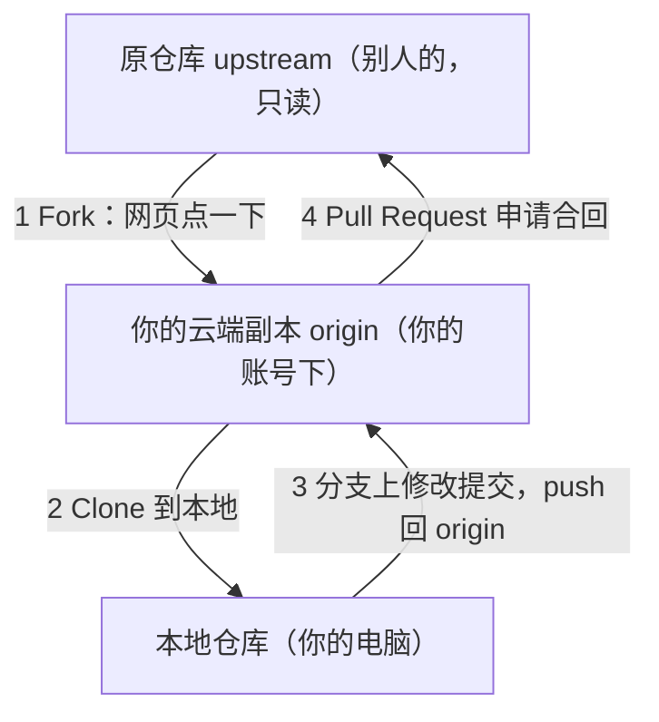

## 前置知识

- 本地 Git 基本操作：clone、branch、commit、push（见 [Git 基础操作](/git/050-GitBasicOperation)）；
- 见过 PR 长什么样（见 [Pull Request 完整协作流程](/github/180-PullRequestCompleteCollaborationFlow)）。

## 学习目标

读完全文你将能够：

1. 说出 Fork 和 Branch 的本质区别，判断一个协作场景该用哪个；
2. 配好 origin 与 upstream 双远程，让你的副本始终跟得上上游；
3. 走完「fork 到合并」全流程，给任意开源项目提交第一个 PR；
4. PR 提示 `This branch has conflicts` 时，知道该敲哪几条命令。

## 1. 问题：仓库不是你的，怎么改？

真实场景：你在用一个开源工具，发现 README 里有个明显的配置错误，顺手就能修。但这个仓库在别人账号下，你没有写权限——`git push` 会被直接拒绝：

```text
ERROR: Permission to someone/cool-tool.git denied to your-name.
```

解决思路不是「找管理员要权限」，而是 Fork 工作流：**在 GitHub 云端把仓库复制一份到你账号下**，这份副本你拥有全部权限，改完之后向原作者发起合并申请（PR）。整条链路涉及三个仓库、一个申请：



先分清两个常被混淆的概念：

| 对比维度 | Fork | Branch |
| :--- | :--- | :--- |
| 位置 | 独立的新仓库（你的账号下） | 同一个仓库内部 |
| 权限要求 | 无需原仓库任何权限 | 需要仓库写权限 |
| 适用场景 | 开源贡献、无写权限协作 | 团队内部开发 |

一句话：**没写权限用 Fork，有写权限用 Branch**。FANDEX 这类自己维护的仓库走分支 + PR（见 180 篇）；给别人的项目贡献代码，走本文的 Fork 流。

## 2. 动手：从 fork 到 PR 的完整六步

以下以给 `someone/cool-tool` 修文档为例，你自己的用户名替换 `your-name`。

### 第一步：Fork

网页上打开仓库，右上角点 **Fork**，确认归属后点 Create fork，几秒后你就有了 `github.com/your-name/cool-tool`。

命令行一条也行：

```bash
gh repo fork someone/cool-tool --clone   # fork 并自动克隆到本地
```

### 第二步：配置双远程

```bash
git clone https://github.com/your-name/cool-tool.git
cd cool-tool
git remote add upstream https://github.com/someone/cool-tool.git
git remote -v
# origin    https://github.com/your-name/cool-tool.git (fetch/push)
# upstream  https://github.com/someone/cool-tool.git (fetch/push)
```

分工：**origin 是你唯一能 push 的地方**；upstream 只用来 fetch，让副本跟上原仓库。Fork 出来的副本是静止的，不会自动同步上游。

### 第三步：同步 main，再开功能分支

```bash
git fetch upstream
git checkout main
git merge --ff-only upstream/main   # 副本落后时快进对齐
git push origin main                # 同步结果推回自己的副本

git checkout -b docs/fix-install-flag   # 基于最新 main 开分支
```

三条分支纪律：永远不在 main 上直接改；分支名用「类型/描述」格式；一次 PR 只做一个主题。基于过时 main 开分支，是后面 PR 冲突的最大来源。

### 第四步：改、提交、推送

```bash
# ……修正 README 的参数说明……
git add README.md
git commit -m "docs: 修正 install 命令的 --global 参数说明"
git push origin docs/fix-install-flag
```

### 第五步：发起 PR

推完代码，仓库页面会出现 Compare & pull request 横幅；或者直接：

```bash
gh pr create --repo someone/cool-tool --fill
```

注意方向：**base 是原仓库的 main，compare 是你副本的功能分支**。描述写清「改了什么、为什么、怎么验证」，修复了某个 Issue 就写 `Fixes #123`，合并时会自动关闭它：

```markdown
## 改动内容
修正 README 中 install 命令的参数说明。

## 验证方式
- 按新说明执行安装命令成功
- 本地渲染无 Markdown 语法错误

Fixes #102
```

### 第六步：合并后清理

```bash
git fetch upstream
git checkout main
git merge --ff-only upstream/main    # 拿回你被合并的改动
git branch -d docs/fix-install-flag
git push origin --delete docs/fix-install-flag
```

## 3. 讲原理：审查反馈来了怎么办，PR 怎么保持新鲜

PR 不是提交完就结束。维护者的常见反馈和应对：

| 审查反馈 | 应对 |
| :--- | :--- |
| 「请补充测试」 | 加代码、提交、`git push`（PR 自动更新，无需重开） |
| 「风格不符」 | 按项目 CONTRIBUTING 改完重新 push |
| 「和 main 冲突了」 | 见下一节 |
| 「请 rebase 到最新」 | `git rebase upstream/main` 后 `git push --force-with-lease` |

PR 的本质是「分支头指针的比较」：你往同一分支推新提交，PR 自动纳入。所以回应审查永远不需要重新创建 PR。

## 4. 冲突：This branch has conflicts 怎么解

冲突的本质是你和别人改了同一段代码，而上游先合并了。在本地解：

```bash
git fetch upstream
git checkout docs/fix-install-flag
git rebase upstream/main          # 或 merge，选团队惯例
# 逐个打开冲突文件，处理 <<<<<<< / ======= / >>>>>>> 标记
git add README.md
git rebase --continue
git push origin docs/fix-install-flag --force-with-lease
```

rebase 过的分支历史变了，必须强推。**安全红线：用 `--force-with-lease`，不用裸 `--force`**——前者只在远程分支没被别人动过时才覆盖，能避免误伤。目标是你自己 Fork 里的分支，影响面可控，但习惯要现在养成。

不想记命令的话，Fork 仓库主页有 **Sync fork → Update branch** 按钮，能处理简单同步；复杂冲突仍要回命令行。

## 5. 坑点与自检

| 现象 | 原因 | 处理 |
| :--- | :--- | :--- |
| `fatal: 'upstream' does not appear to be a git repository` | 克隆后没加 upstream | 补 `git remote add upstream` |
| 往原仓库 push 被拒 | 你没有写权限 | 推 origin，走 PR |
| PR 混入大量无关提交 | 基于过时 main 开的分支 | 先同步 main，重开干净分支 |
| `rejected ... non-fast-forward` | 远程分支与本地分叉 | `git pull --rebase origin 分支名` 再推 |
| 裸 `--force` 覆盖了别人提交 | 强推无保护 | 改用 `--force-with-lease` |
| 合并后 Issue 还开着 | 描述没写 `Fixes #123` | PR 描述补上关键字 |
| 用了别人的代码但项目要求不同许可证 | Fork 前没看许可 | 先读 LICENSE，见 [开源许可证选择](/github/260-OpenSourceLicense) |

自检三问：

1. 你的 `git remote -v` 里 upstream 指向哪？
2. 每次开工前，你的第一个命令是不是 `git fetch upstream`？
3. 强推时你的手指是落在 `--force-with-lease` 上吗？

## 6. 练习

1. 找一个你用过的开源项目里的小问题（文档错字即可），完整走一遍六步，直到 PR 被合并或关闭。
2. 故意在一个 fork 里落后上游 20 个提交，分别用命令行和 Sync fork 按钮同步一次，对比体验。
3. 制造一次冲突：改一个上游最近也改过的文件，触发 `This branch has conflicts`，按第四节流程解开。

## 下一步

- 有写权限的团队内协作流（FANDEX 模式）：[Pull Request 完整协作流程](/github/180-PullRequestCompleteCollaborationFlow)
- 冲突解决专篇：[GitHub 冲突解决](/github/100-GitConflictResolve)
- Fork 公开仓库前必须搞懂的许可问题：[开源许可证选择](/github/260-OpenSourceLicense)
