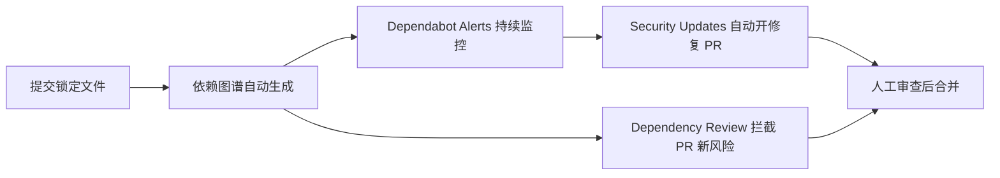

## 前置知识

- 已有一个推上 GitHub 的仓库，仓库里有 `package.json` 这类依赖清单（没有的话先看 [仓库创建与克隆](/github/030-RepositoryCreateCloneArchiveDelete)）。
- 知道 [GitHub Actions 工作流文件放哪](/github/370-GitHubActionsCICD)，本文会往 `.github/workflows/` 里加一个文件。

## 学习目标

读完全文你将能够：

1. 说清「直接依赖」和「传递依赖」的区别，以及为什么传递依赖才是风险大头；
2. 给自己的仓库启用依赖图谱、Dependabot 告警、自动安全更新三件套；
3. 用一个 Dependency Review 工作流，在 PR 合并前拦截带漏洞的新依赖；
4. 遇到「有告警但没 PR」「图谱里看不到依赖」这类问题知道从哪查。

预计 30 分钟，其中动手 10 分钟。

## 1. 问题：pnpm install 之后，风险就进来了

以本仓库 FANDEX 为例：根目录 `pnpm install` 一次，`pnpm-lock.yaml` 里锁定的包远不止 `package.json` 里手写的那十几行。随便一个 React 项目，`package.json` 里只有 21 个直接依赖，展开传递依赖后可能超过 1000 个包——你程序里 95% 以上的代码是别人写的。

这时你面对三种真实风险：

| 攻击路径 | 手法 | 后果 |
| :--- | :--- | :--- |
| 漏洞利用 | 依赖有已知漏洞（CVE），攻击者直接利用 | 数据泄露、服务器被控制 |
| 恶意包投毒 | 名称相近的仿冒包（typosquatting）诱导安装 | 密钥被窃取 |
| 维护者账号失守 | 正规包被注入后门，下游全中招 | 一次 install 即感染 |

2021 年底的 Log4Shell（CVE-2021-44228）是最典型的例子：无数 Java 应用根本没主动引入过 Log4j，它是「某个依赖的依赖的依赖」，照样全网中招。你不可能逐行审查上千个包，只能靠工具持续监控——这就是 GitHub 依赖安全这一套功能存在的原因。

## 2. 动手：十分钟装好依赖安全基线

下面四步做完，你的仓库就有了最低限度的依赖安全防线。以 FANDEX 这类 pnpm 项目为例。

### 第一步：确认锁定文件已提交

```bash
git ls-files pnpm-lock.yaml
# 有输出说明已提交；没有则：
git add pnpm-lock.yaml
git commit -m "chore: 提交 pnpm-lock.yaml 以启用精确依赖追踪"
```

锁定文件是后面一切功能的前提：依赖图谱靠它解析精确版本，告警才能定位到「哪个包的哪个版本」有问题。不提交锁定文件是这一步最常见的遗漏。

### 第二步：打开依赖图谱，看清家底

仓库页面 → Insights → Dependency graph。公开仓库默认开启；私有仓库去 Settings → Code security and analysis 里启用。

你会看到直接依赖、传递依赖、每个依赖的版本，以及已知漏洞的红色标记。

### 第三步：启用告警与自动修复

同一设置页（Settings → Code security and analysis）里勾选：

1. **Dependabot alerts**：发现漏洞时告警；
2. **Dependabot security updates**：告警之外自动创建升级 PR。

之后到仓库 Security → Dependabot 标签页看告警面板。每条告警会给出：受影响包与版本范围、CVSS 评分、漏洞进入你项目的路径（哪个直接依赖带进来的）、建议升级到哪个版本。

### 第四步：加一个 Dependency Review 工作流

在 `.github/workflows/dependency-review.yml` 新建：

```yaml
name: Dependency Review
on: [pull_request]

permissions:
  contents: read

jobs:
  dependency-review:
    runs-on: ubuntu-latest
    steps:
      - uses: actions/checkout@v6
      - uses: actions/dependency-review-action@v4
        with:
          fail-on-severity: moderate
          deny-licenses: GPL-3.0, AGPL-3.0
```

合并这个工作流后，任何 PR 只要改动了清单或锁定文件，都会先做一次依赖差异审查：新引入的依赖若带 moderate 以上漏洞、或许可证在黑名单里，这个检查直接失败，PR 合不了。`deny-licenses` 那行按你的项目许可策略调整，闭源商业项目通常禁 AGPL。

## 3. 为什么是这四道防线：它们的分工与依赖关系

| 功能 | 管什么 | 时机 |
| :--- | :--- | :--- |
| Dependency Graph | 看清全部直接/传递依赖 | 持续，推送清单变更即更新 |
| Dependabot Alerts | 发现存量依赖的漏洞 | 持续监控漏洞数据库 |
| Security Updates | 自动开升级 PR | 告警之后 |
| Dependency Review | 拦截新增依赖的风险 | PR 合并之前 |

关系是层层依赖的：图谱是地基，alerts 和 review 都靠图谱数据做交叉比对；alerts 负责「已有的隐患」，review 负责「别把新隐患带进门」。串起来是这样：



一个细节：Dependabot 安全更新开出的 PR 也是普通 PR，会走你的 CI。所以给这类 PR 配上测试（见 [Dependabot 深度配置](/github/280-Dependabot)），自动合并才敢开。

## 4. 坑点与自检

| 现象 | 原因 | 处理 |
| :--- | :--- | :--- |
| Insights 里 Dependency graph 是空的 | 清单/锁定文件没提交，或不在默认分支 | 提交 `pnpm-lock.yaml`，确认在 main 上 |
| 有漏洞但没收到告警 | alerts 未启用，或通知设置关了 | 设置页启用；Settings → Notifications 检查 |
| 有告警但一直没有修复 PR | security updates 未启用，或该漏洞没有可用安全版本 | 启用开关；没有安全版本就手动升级或换包 |
| PR 里看不到依赖差异 | 依赖图谱未启用 | 先做第二步 |
| 工作流报 `Dependabot couldn't parse the config file` | `dependabot.yml` 缩进或键名错误 | `version` 必须是 `2`，逐项对照官方配置参考 |
| 合并升级 PR 后线上崩了 | 大版本升级带破坏性变更 | Dependabot PR 必须过 CI 再合并；用 `ignore` 挡住跨大版本升级 |

自检三问：

1. `git ls-files` 能看到锁定文件吗？
2. Security 标签页能打开吗（而不是 404 或空白）？
3. 最近一个改动 `pnpm-lock.yaml` 的 PR，有没有跑 Dependency Review 检查？

## 5. 练习

1. 在自己的仓库跑一遍第二节四步，截图记录 Insights → Dependency graph 的依赖总数，和你 `package.json` 里手写的依赖数对比。
2. 故意在 `package.json` 里加一个带已知漏洞的旧版本依赖（比如 `lodash@4.17.15`），开 PR，观察 Dependency Review 检查是否失败。
3. 读一遍 FANDEX 这类真实项目 `.github/workflows/` 下的文件，找出哪个工作流承担了「PR 门禁」的角色。

## 下一步

- 告警和 PR 有了，怎么配置更新频率、分组、自动合并：[Dependabot 深度配置](/github/280-Dependabot)
- 依赖之外，密钥泄露是另一类供应链事故：[密钥扫描与推送保护](/github/290-SecretScanning)
- Dependency Review 工作流的载体，回看 [GitHub Actions 与 CI/CD](/github/370-GitHubActionsCICD)

### 官方文档

- 供应链安全总览：https://docs.github.com/zh/code-security/supply-chain-security
- 依赖图谱：https://docs.github.com/zh/code-security/supply-chain-security/understanding-your-software-supply-chain/about-the-dependency-graph
- Dependabot alerts：https://docs.github.com/zh/code-security/dependabot/dependabot-alerts/about-dependabot-alerts
