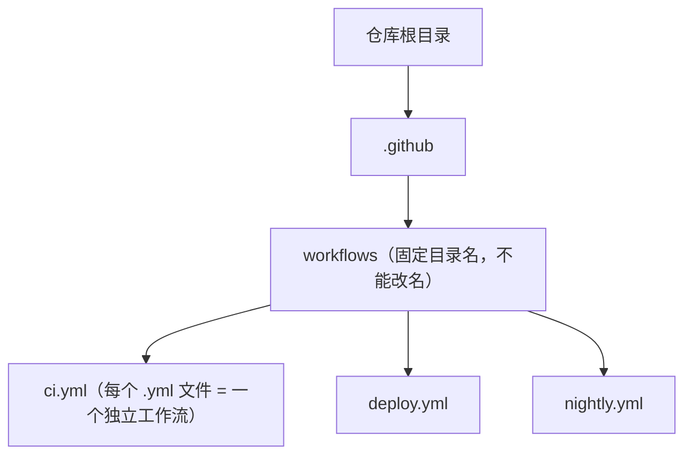

## 前置知识

建议先阅读以下内容再进入本文：

- [GitHub 概述](/github/010-GitHubOverview)

## 0. 开始之前：一座"智能工厂流水线"的故事

想象一座现代化工厂：原材料进厂（代码提交），传送带把零件送到各个工位——质检工位自动检查（lint）、测试工位自动试运行（test）、组装工位打包成品（build）、发货工位把货送到客户（deploy）。整条流水线由一套**中央控制系统**自动调度：原料一到，各工位按顺序自动开工；质量不合格，立刻亮红灯拦截；货品信息全部记录在案。

GitHub Actions 就是 GitHub 内置的这套"智能工厂流水线"——一套 **CI/CD（持续集成 / 持续交付）** 自动化平台。你只需要用 YAML 描述"工位清单"（workflow 工作流），GitHub 就会在云端"传送带"（runner 运行器）上自动完成：**构建、测试、打包、部署**，还能对仓库里的其他事件（开 Issue、发 Release）自动响应。

本文是 Actions 系列的**总纲**：先把 CI/CD 概念讲明白，再拆解 workflow 文件结构，最后给出 Actions 市场使用指南与最佳实践。后续各篇（触发器、矩阵、缓存、制品、环境）都是本篇某个环节的深入。

## 1. CI/CD 是什么：为什么每个仓库都需要

### 1.1 CI（持续集成，Continuous Integration）

**核心思想**：频繁地把代码**合并**到主干，并在每次合并前**自动构建和测试**，尽早发现集成问题。

- 开发者在 PR 里提交代码 → 自动跑一遍测试 → 通过才能合并。
- 好处：问题在几小时内暴露，而不是发布前一天才发现。

### 1.2 CD（持续交付/持续部署，Continuous Delivery/Deployment）

**持续交付**：代码合并后自动准备好"随时可发布"的产物（构建 + 测试 + 打包）。
**持续部署**：在持续交付基础上，把发布这一步也自动化——合并到 main 自动上生产。

```
CI：   代码提交 → 自动构建 → 自动测试 → 汇报结果
CD：   CI 通过 → 自动打包 → 部署 staging → （审批）→ 部署生产
```

### 1.3 为什么用 GitHub Actions

| 优势 | 说明 |
| --- | --- |
| 零配置接入 | 与 GitHub 仓库天然集成，不用单独搭服务器 |
| 生态丰富 | GitHub Marketplace 有大量现成 Action 可复用 |
| 免费用量 | 公开仓库免费，私有仓库有免费分钟额度 |
| 事件驱动 | push、PR、Release、定时、外部 API 都能触发 |
| 可观测 | Actions 页面可视化查看每次运行日志与状态 |

## 2. 核心组件总览：认识流水线的"零件"

GitHub 官方把 Actions 的组件划分为六个概念，层级从小到大依次是：

```
workflow（工作流）→ jobs（任务）→ steps（步骤）→ actions（动作）/ shell 命令
                                        ↕
                    runner（运行器：执行这些任务的机器）
                    event（事件：触发流水线开动的信号）
```

| 组件 | 中文 | 说明 |
| --- | --- | --- |
| Workflow | 工作流 | 一个 `.github/workflows/*.yml` 文件就是一个可配置的自动化流程 |
| Event | 事件 | 触发工作流的仓库活动（push、PR、schedule 等） |
| Job | 任务 | 一组在同一运行器上按顺序执行的步骤；不同 job 默认并行 |
| Step | 步骤 | job 内最小的执行单元：一条 shell 命令或一个 Action |
| Action | 动作 | 可复用的扩展单元，封装常用操作（检出代码、装环境等） |
| Runner | 运行器 | 执行 job 的虚拟机（GitHub 托管或自托管） |

**理解要点**：job 内的 steps 按顺序执行、可以共享数据（同一台机器）；job 之间互相独立、默认并行，用 `needs` 声明依赖。

## 3. workflow 文件结构：读懂流水线的"图纸"

### 3.1 文件位置与命名

工作流文件必须放在仓库根目录的固定文件夹中：



### 3.2 顶层结构总览

一个标准的 workflow 文件由三大部分组成：

```yaml
name: CI                    # 1. 工作流名称（显示在 Actions 页面）

on:                         # 2. 触发条件（什么时候跑）
  push:
    branches: [main]

permissions:                # （可选）最小权限声明
  contents: read

jobs:                       # 3. 任务集合（要干什么）
  build:                    #   job 标识
    runs-on: ubuntu-latest  #   在什么机器上跑
    steps:                  #   步骤列表（按顺序执行）
      - uses: actions/checkout@v6
      - run: npm ci
```

### 3.3 name 与 on

```yaml
name: CI                    # 页面展示名，建议起名清晰（如 "Build and Test"）
on: [push, pull_request]    # 简写：多个事件
```

`on` 的详细配置（分支过滤、路径过滤、定时、手动触发）见《Actions 触发器》（030），这里不展开。

### 3.4 jobs：任务编排

```yaml
jobs:
  lint:                      # job 1：静态检查
    runs-on: ubuntu-latest
    steps:
      - uses: actions/checkout@v6
      - run: npm run lint

  test:                      # job 2：测试（依赖 lint 完成）
    needs: lint              # 声明依赖：lint 成功后才跑 test
    runs-on: ubuntu-latest
    strategy:                # 矩阵：多版本并行测试
      matrix:
        node-version: [20, 22]   # 22 为当前活跃 LTS（18 已于 2025 年停止维护）
    steps:
      - uses: actions/checkout@v6
      - uses: actions/setup-node@v6
        with:
          node-version: ${{ matrix.node-version }}
      - run: npm ci && npm test

  deploy:                    # job 3：部署（依赖 test）
    needs: test
    if: github.ref == 'refs/heads/main'   # 仅 main 分支部署
    runs-on: ubuntu-latest
    steps:
      - run: ./deploy.sh
```

job 关键字段速查：

| 字段 | 作用 |
| --- | --- |
| `runs-on` | 指定运行器（`ubuntu-latest` / `[self-hosted, linux]`） |
| `needs` | 依赖其他 job，串行化 |
| `strategy.matrix` | 矩阵并行（见 032） |
| `if` | 条件执行 |
| `timeout-minutes` | 超时控制（默认 360 分钟） |
| `continue-on-error` | 失败不阻断（实验性任务常用） |
| `env` | job 级环境变量 |

### 3.5 steps：步骤详解

step 只有两种形态：**运行命令**（`run`）或 **调用 Action**（`uses`）。

```yaml
steps:
  # 形态一：调用市场 Action
  - name: Checkout code
    uses: actions/checkout@v6
    with:                    # 给 Action 传参
      fetch-depth: 0

  # 形态二：运行 shell 命令
  - name: Install dependencies
    run: |
      npm ci
      npm run build

  # 条件步骤
  - name: Deploy
    if: github.ref == 'refs/heads/main'
    run: ./deploy.sh

  # 环境变量（步骤级）
  - name: Print version
    run: echo "VERSION=$VERSION"
    env:
      VERSION: 1.0.0
```

## 4. Actions 市场：站在巨人肩膀上

### 4.1 在哪里找 Action

GitHub Marketplace（https://github.com/marketplace?type=actions）是官方 Action 市场，也可以在 `uses: owner/repo@版本` 中直接引用任意公开仓库的 Action。

### 4.2 高频 Action 清单（新手必备）

| Action | 用途 |
| --- | --- |
| `actions/checkout` | 检出仓库代码（几乎每个工作流第一步） |
| `actions/setup-node` | 配置 Node.js 环境 |
| `actions/setup-python` | 配置 Python 环境 |
| `actions/setup-java` | 配置 JDK（如 temurin） |
| `actions/cache` | 缓存依赖加速（见 033） |
| `actions/upload-artifact` | 上传构建产物（见 035） |
| `actions/download-artifact` | 下载构建产物（见 035） |
| `peaceiris/actions-gh-pages` | 部署静态站到 GitHub Pages |
| `docker/login-action` | 登录容器镜像仓库 |
| `docker/build-push-action` | 构建并推送 Docker 镜像 |

### 4.3 版本固定：安全第一

Action 用 `@版本` 引用，建议固定**主版本号**（`@v6`）甚至**提交 SHA**（`@a1b2c3d...`）：

```yaml
- uses: actions/checkout@v6          # 主版本：随 v6.x 自动更新（推荐）
# - uses: actions/checkout@<完整SHA> # 最高安全：完全锁定代码
```

固定到 SHA 是官方安全加固建议——第三方 Action 若被篡改，固定 SHA 可避免意外执行恶意版本。

引用版本时还要注意**运行时兼容性**：JS Action 跑在 runner 内置的 Node.js 运行时上。2025 年起官方 Action 陆续升级到 Node 24 运行时（要求较新的 runner 版本），2026 年中 Node 20 运行时已进入弃用流程。使用较旧的大版本（如 `checkout@v4`）会随官方运行时退役而逐步失去维护，升级示例：

| Action | v4/v5 时代 | 当前主线（2026-09） | 说明 |
| --- | --- | --- | --- |
| actions/checkout | @v4（Node 20） | @v6 / @v7 | v7 起 `pull_request_target` 默认禁止检出 fork PR 代码（安全加固），需要旧行为需显式声明 `allow-unsafe-pr-checkout` |
| actions/setup-node | @v4（Node 20） | @v6 / @v7 | v5 起自动读取 `packageManager` 字段启用缓存；v6 起自动缓存仅限 npm |
| actions/setup-python | @v5（Node 20） | @v6 / @v7 | v6 起基于 Node 24 运行时 |
| actions/cache | @v3/@v4 | @v5 | 语义不变，运行时升级 |
| actions/upload-artifact | @v3（已被移除） | @v4 / 更高 | v4 是大版本重构（见 035），v6+ 基于 Node 24 |

> 经验法则：新项目一律写当前主版本；维护老项目升级前看该 Action 的 Release Notes，尤其是标注 breaking 的变更。

## 5. 完整 CI/CD 示例：三种语言的流水线

### 5.1 Node.js 完整流水线（lint → test → build → deploy）

```yaml
name: Node.js CI/CD
on:
  push:
    branches: [main]
  pull_request:
    branches: [main]

jobs:
  lint:
    runs-on: ubuntu-latest
    steps:
      - uses: actions/checkout@v6
      - uses: actions/setup-node@v6
        with: { node-version: 22, cache: npm }
      - run: npm ci
      - run: npm run lint

  test:
    runs-on: ubuntu-latest
    strategy:
      matrix:
        node-version: [20, 22]        # 多版本测试
    steps:
      - uses: actions/checkout@v6
      - uses: actions/setup-node@v6
        with: { node-version: ${{ matrix.node-version }}, cache: npm }
      - run: npm ci
      - run: npm test

  build:
    needs: [lint, test]
    runs-on: ubuntu-latest
    steps:
      - uses: actions/checkout@v6
      - run: npm ci && npm run build
      - uses: actions/upload-artifact@v4   # 产物上传，供部署用
        with: { name: build, path: dist/ }

  deploy:
    needs: build
    if: github.ref == 'refs/heads/main'    # 仅 main 分支部署
    runs-on: ubuntu-latest
    steps:
      - uses: actions/download-artifact@v4
        with: { name: build, path: dist/ }
      - name: Deploy to GitHub Pages
        uses: peaceiris/actions-gh-pages@v4
        with:
          github_token: ${{ secrets.GITHUB_TOKEN }}
          publish_dir: ./dist
```

### 5.2 Java（Maven）流水线

```yaml
name: Java CI/CD
on:
  push:
    branches: [main]
jobs:
  build:
    runs-on: ubuntu-latest
    steps:
      - uses: actions/checkout@v6
      - uses: actions/setup-java@v4
        with:
          distribution: temurin
          java-version: '17'
          cache: maven                 # 内置 Maven 缓存
      - run: mvn -B package --file pom.xml
      - uses: actions/upload-artifact@v4
        with: { name: jar, path: target/*.jar }
```

### 5.3 Python 流水线

```yaml
name: Python CI/CD
on:
  push:
    branches: [main]
jobs:
  test:
    runs-on: ubuntu-latest
    steps:
      - uses: actions/checkout@v6
      - uses: actions/setup-python@v6
        with: { python-version: '3.11' }
      - run: |
          python -m pip install --upgrade pip
          pip install pytest
          pip install -r requirements.txt || true
      - run: pytest
```

## 6. 环境变量与密钥管理

### 6.1 环境变量（env）

支持工作流级、job 级、step 级三层：

```yaml
env:                          # 工作流级
  NODE_ENV: production

jobs:
  build:
    env:                      # job 级
      BUILD_VERSION: 1.0.0
    steps:
      - name: Print env
        run: |
          echo "$NODE_ENV / $BUILD_VERSION"
          echo "分支: ${{ github.ref }}"     # 上下文变量
```

### 6.2 密钥（Secrets）

- **仓库级 secrets**：Settings → Secrets and variables → Actions，所有工作流可用。
- **环境级 secrets**：环境设置里配置，更安全（见 036）。
- 使用方式：`${{ secrets.XXX }}`，日志中自动打码。

```yaml
steps:
  - name: Deploy
    run: ./deploy.sh
    env:
      API_KEY: ${{ secrets.API_KEY }}       # 不要硬编码密钥
```

## 7. 最佳实践清单

### 7.1 结构设计

- **一个仓库多个工作流**：CI、部署、定时任务拆开，互不影响。
- **needs 明确依赖**：能并行的 job 就并行，需要结果的用 `needs` 串行。
- **if 控制分支**：构建/测试全分支跑，部署只 main 跑。
- **路径过滤**：只改文档时不触发 CI（见 030 的 paths-ignore）。

### 7.2 安全

- **最小权限**：用 `permissions` 声明只读默认，按需放开：

```yaml
permissions:
  contents: read
  pull-requests: write
```

- **密钥入库**：所有密钥放 Secrets，代码里绝不硬编码。
- **固定版本**：Action 固定主版本或 SHA；优先使用官方 `actions/*` 与已验证作者（verified creator）发布的 Action。
- **开启 CodeQL**：集成代码扫描（见 019 篇）。
- **云部署用 OIDC 代替长期密钥**：工作流可向云厂商（AWS/Azure/GCP 等）申请短时身份令牌，免去把长期 Access Key 存进 Secrets——在 job 上声明 `permissions: { id-token: write }`，由各云厂商的官方登录 Action 完成互换。
- **公共工作流要防注入**：`github.event` 中来自外部的字段（PR 标题、分支名、Issue 正文等）直接拼进 `run:` 存在被注入执行的风险，先经环境变量中转或校验后再用。

### 7.2.1 复用：可重用工作流（reusable workflows）

同一套 CI 要在几十个仓库里复制粘贴？把工作流声明为**可重用**（`workflow_call` 触发器），其他仓库用 `uses: owner/repo/.github/workflows/ci.yml@v1` 直接调用：

```yaml
# 被调方：.github/workflows/ci.yml（声明 workflow_call，定义 inputs/secrets）
on:
  workflow_call:
    inputs:
      node-version:
        type: string
        default: '22'

# 调用方：任意仓库的工作流里当一个 job 来用
jobs:
  ci:
    uses: my-org/shared-workflows/.github/workflows/ci.yml@v1
    with:
      node-version: '22'
    secrets: inherit          # 透传调用方的 secrets
```

这是组织级"统一流水线"的标准做法：改一处、全仓库生效，配合分支保护实现流水线收敛治理。

### 7.3 性能

- **缓存依赖**：`setup-node` 内置 cache 或 `actions/cache`（见 033）。
- **矩阵并行**：多 OS / 多版本并行测试（见 032）。
- **产物按需**：制品设置合理保留期（见 035）。
- **超时兜底**：job 设 `timeout-minutes`，防止死循环烧分钟数。

### 7.4 可维护性

- 工作流文件**命名清晰**（`ci.yml`、`deploy.yml`、`nightly-security-scan.yml`）。
- 复杂逻辑加**中文注释**。
- 使用 `gh workflow list`、`gh run list` 查看状态与历史（见 gh CLI 篇）。

## 8. 常见错误与对策

| 常见错误 | 报错/现象 | 原因 | 解决办法 |
| --- | --- | --- | --- |
| 工作流不触发 | 推了代码没反应 | `on` 写错、文件名不在 `.github/workflows/`、默认分支问题 | 核对文件路径与 `on` 语法；确认已合入默认分支 |
| YAML 缩进错误 | `Invalid workflow file` | 缩进不一致（GitHub 报错红叉） | 用空格缩进（禁用 Tab），检查层级 |
| `uses: xxx` 找不到 | `Unable to resolve action` | 拼写/版本错误，或仓库不存在 | 核对 `owner/repo@版本`，去 Marketplace 复制 |
| 密钥为空 | secrets 取不到值 | 密钥名拼错、作用域不对（仓库级 vs 环境级） | 检查 Secrets 配置与 `${{ secrets.XXX }}` 拼写 |
| job 并行导致乱序 | 部署先于测试完成 | 未用 `needs` 声明依赖 | 下游 job 加 `needs: [lint, test]` |
| 私有仓库超分钟额度 | 任务排队/被拒 | 私有仓库有免费分钟限制 | 用缓存/矩阵并行优化；或自托管运行器 |
| 只改文档也跑 CI | 浪费分钟数 | 没做路径过滤 | 加 `paths-ignore: ['docs/**', '*.md']` |

## 10. 一句话记忆

**GitHub Actions 是仓库内置的"智能工厂"：用 `.github/workflows/*.yml` 描述 name/on/jobs/steps，事件一响，流水线自动跑完构建、测试、部署，全程可观测、可复用、可控制。**
