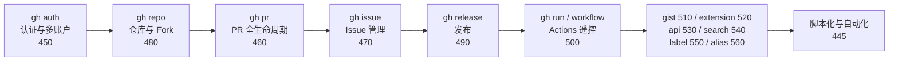

# GitHub CLI

## 知识点地图

- **知识类别**：平台工具链总览——GitHub CLI（命令 `gh`）的整体心智模型与命令族导航。
- **解决什么问题**：gh 有十几个命令族、上百个子命令，分别散在 450-560 的速查专篇里。新手的第一个问题不是「某条命令怎么写」，而是「gh 能干什么、该去哪篇找」——本篇就是那本目录。第二个问题是「什么时候用 gh 而不是网页/裸 git」——遥控器模型给出判据。
- **什么时候用到**：
  - 初次接触 gh：十分钟建立全景，再按需跳到专项篇；
  - 团队工具选型：评估「这一步该用 gh、git 还是 API」；
  - 查漏：知道自己日常只用了 gh 一半功能时，回来看命令族地图。
- **与相邻篇目的分工**：本篇是总览与导航，所有命令的完整参数都在 450-560 速查篇与官方手册；脚本化与自动化组合（--json+jq、CI 判定、批量治理）在 [gh CLI 脚本化与自动化](/github/445-GhCliScriptingAndAutomation)。

## 1. 从一个生活场景说起：GitHub 的「遥控器」

看电视时，你很少走到电视机前按物理按钮，而是用**遥控器（GitHub CLI）**懒洋洋地换台、调音量。GitHub CLI（命令 `gh`）就是 GitHub 网页版的「遥控器」：不用在浏览器里点来点去，在终端里敲一行命令，就能完成建仓库、提 PR、管 Issue、查 Actions 等几乎全部操作。

什么时候值得按遥控器而不是走到电视机前（网页）或直接接线（API）：

- **gh 优于网页**：操作已在终端流里（写完代码顺手 `gh pr create`）、要批量或重复（循环建 20 个 Issue）、要进脚本与 CI；
- **git 优于 gh**：纯版本控制操作（commit/rebase/log）——gh 管平台动作，git 管版本动作，两者互补不重叠；
- **gh 优于裸 API**：gh 帮你处理了认证、分页、默认仓库推断——`gh pr list` 一行等价于「构造请求 + 带上 Token + 翻页 + 渲染」。

## 2. 命令族地图



每个命令族一句话定位与专项篇入口：

| 命令族 | 干什么 | 专项篇 |
| :--- | :--- | :--- |
| `gh auth` | 登录、多账户切换、Token 管理 | [gh CLI 认证配置](/github/450-GhCliAuth) |
| `gh repo` | 建仓、克隆、Fork、归档 | [gh Repo 管理](/github/480-GhRepoManage) |
| `gh pr` | 创建/审查/合并 PR | [gh PR 管理](/github/460-GhPrManage) |
| `gh issue` | Issue 增删查、标签、指派 | [gh Issue 管理](/github/470-GhIssueManage) |
| `gh release` | 版本发布与产物上传 | [gh Release](/github/490-GhRelease) |
| `gh run` / `gh workflow` | 触发与观测 Actions | [gh Workflow](/github/500-GhWorkflow) |
| `gh gist` | 代码片段 | [gh Gist](/github/510-GhGist) |
| `gh extension` | 社区扩展（含 Copilot CLI） | [gh Extension](/github/520-GhExtension) |
| `gh api` | 直调 REST/GraphQL | [gh API](/github/530-GhApi) |
| `gh search` | 站内搜索（代码/仓库/Issue/PR） | [gh Search](/github/540-GhSearch) |
| `gh label` | 标签批量管理 | [gh Label](/github/550-GhLabel) |
| `gh alias` / `gh config` | 别名与全局配置、Shell 补全 | [gh 别名与配置](/github/560-GhAliasConfig) |

## 3. 三分钟上手路径

```bash
# 1) 安装（各平台安装细节与升级见 450 篇）
winget install --id GitHub.cli      # Windows；macOS 用 brew install gh
gh --version

# 2) 登录（浏览器流程；Token 方式与多账户见 450 篇）
gh auth login
gh auth status

# 3) 跑第一条命令：在任意仓库目录里看自己的工作台
gh status          # 汇总你创建的/被指派的 PR 与 Issue

# 4) 每条命令都有完善的帮助体系，不确定就先查
gh help            # 顶层：列出所有命令族
gh pr create --help
```

> 认证成功后（选择 HTTPS 协议时），gh 会自动接管 Git 凭据，`git push`/`git pull` 不再需要单独配置 PAT 或 SSH。

第四步是长期习惯：gh 的 `--help` 体系完整（官方手册见 https://cli.github.com/manual/ ），「先 `--help` 再搜索」的效率远高于背参数。

## 4. 高频场景速通

三个最常见的日常场景，命令细节在对应专项篇，这里给「最小可用形态」：

```bash
# 场景一：写完代码，一条龙开 PR（详细流程见 460 篇）
git switch -c feat/add-login
git push -u origin feat/add-login
gh pr create --fill                      # --fill 用提交信息自动填充

# 场景二：看看哪些 PR 卡在 checks（脚本化判定见 445 篇）
gh pr checks 123

# 场景三：在浏览器里接着刚才的上下文（--web 系列通用）
gh pr view 123 --web
gh repo view --web
```

`--fill` 与 `--web` 是两个「痛感立减」的参数：前者省掉标题描述的重复输入，后者在「命令行定位、网页里精修」的混合工作流里随时切换。

## 5. 常见错误速查

| 常见错误 | 报错/现象 | 原因 | 解决办法 |
| :--- | :--- | :--- | :--- |
| 未认证执行命令 | `To use GitHub CLI, run gh auth login` | 尚未登录 | 运行 `gh auth login` 完成浏览器或 Token 认证 |
| 权限不足 | `GraphQL: Resource not accessible` / 403 | 令牌 scope 不足（如未含 `repo`） | 用 `gh auth refresh -s repo,workflow` 重新授权所需 scope |
| 命令作用域不对 | 提示 `no GitHub repository found` | 不在仓库目录内执行仓库相关命令 | `cd` 进入仓库目录，或用 `--repo OWNER/REPO` 显式指定 |
| 推送需要 workflow 权限 | `gh auth status` 提示 scope 缺失 | 首次创建 workflow 文件推送被拒 | 重新登录时授权 `workflow` scope：`gh auth refresh -s workflow` |
| 别名冲突 | `alias` 设置失败 | 别名与现有命令同名 | 换一个别名，或用 `gh alias delete <名称>` 清理 |

（脚本与 CI 场景特有的错误——交互卡住、解析输出失败、限流——集中在 [gh CLI 脚本化与自动化](/github/445-GhCliScriptingAndAutomation) 第 5 节。）

## 6. 一句话记忆

**gh 是 GitHub 的「遥控器」：一条命令搞定仓库、PR、Issue、Actions，认证一次长期免密，别名与扩展让它越用越顺手；要进脚本，切到 [脚本化与自动化](/github/445-GhCliScriptingAndAutomation) 的机读模式。**

### 延伸阅读

- gh 认证与多账户详解，见 [GitHub CLI 认证配置](/github/450-GhCliAuth)。
- gh PR 管理速查，见 [GitHub CLI PR 管理](/github/460-GhPrManage)。
- gh Issue 管理速查，见 [GitHub CLI Issue 管理](/github/470-GhIssueManage)。
- gh 仓库/Release/Workflow/Gist/扩展/API/搜索/标签/别名命令，见 [GitHub CLI 仓库管理](/github/480-GhRepoManage) 起的各命令族速查（480-560 篇）。
- 脚本与自动化组合（jq、CI 判定、批量治理、token 最小权限），见 [gh CLI 脚本化与自动化](/github/445-GhCliScriptingAndAutomation)。
- 凭据与 PAT 的底层原理，见 [账户注册与双因素认证](/github/020-AccountRegister2FA) 与 [SSH 与 HTTPS](/github/040-SSHHTTPS)。

## 7. 自我检查

- 能用遥控器模型说出「什么时候用 gh、什么时候用网页、什么时候用裸 git」；
- 能不看资料列出 gh 的六个以上命令族及各自用途；
- 能说出 `gh status`、`gh pr create --fill`、`gh pr view --web` 三个高频命令的作用；
- 遇到 `Resource not accessible` 能说出第一排查动作（scope 检查）。

## 本章总结

gh 是 GitHub 的终端遥控器：本篇给它一幅地图——十来个命令族各有专项速查篇（450-560），脚本化与自动化单列一篇（445）；本篇负责三件事：遥控器与网页/裸 git 的分工判据、命令族导航表、三分钟上手路径与常见错误速查。记住工作流：装好（winget/brew）→ 登录（`gh auth login`）→ `gh status` 看工作台 → 不确定先 `--help`。具体命令写法，永远去对应专项篇或官方手册——总览篇的价值是让你知道去哪找。
