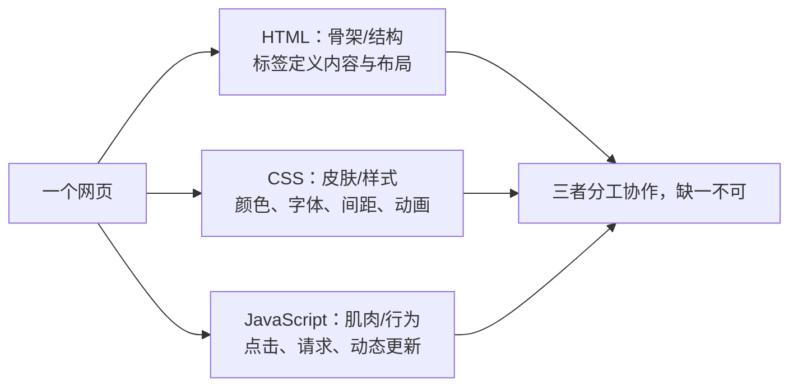

## 学习目标

本文是「HTML5」模块的第 2 篇，难度定位为入门。重点内容：零基础第一课：5 分钟写出第一个网页，理解 HTML5 结构、语义化标签与核心特性。

主要章节：

- 0. 快速上手：5 分钟写出你的第一个网页
- 1. HTML5 概述 (Overview)
- 2. 文档结构 (Document Structure)
- 3. 语义化标签 (Semantic Tags)
- 4. 优势与最佳实践
- 5. 常见问题与解决方案
- ……共 12 个章节

## 0. 快速上手：5 分钟写出你的第一个网页

> **学习目标**：不管懂不懂代码，先让浏览器显示“你好，世界！”。

HTML 是网页的骨架，就像人体的骨骼一样，决定了网页的结构与布局；CSS 是衣服，负责美化；JavaScript 是肌肉，让网页动起来。这节课我们先搭骨架。



**结构解析：** 一张网页由三种技术共同组成：HTML 决定"有什么"（标题、段落、按钮），CSS 决定"长什么样"（红色、居中、圆角），JavaScript 决定"能做什么"（点击弹窗、提交表单）。本模块只负责 HTML 这层骨架；CSS 与 JavaScript 分别在对应模块学习。

### 0.0 学完这一课，我能做到

学完这一课，我能做到：

- [ ] 说出 HTML 是网页的骨架
- [ ] 手写出最基本的 HTML 结构（`DOCTYPE`、`html`、`head`、`body`）
- [ ] 用 `header`、`main`、`footer` 搭建一个简单的博客布局

### 0.1 准备工作（2 分钟）

> 还没有创建过 `index.html`，或不知道如何用浏览器打开？先读 `030-HTML5EnvSetupFirstPage`（第 0 课：环境搭建），把"编辑器 → 文件 → 浏览器"的闭环打通再回来。

1. 在电脑桌面上新建一个文本文档（记事本），重命名为 `index.html`（如果看不到后缀，需先打开“显示文件扩展名”）；
2. 右键这个文件，选择“打开方式”里的“记事本”（先不要双击，现在双击会打开浏览器）。

### 0.2 敲下第一行代码（2 分钟）

把下面这几行字原封不动敲进记事本（建议手敲而不是复制粘贴，感受标签的写法）：

```html
<!DOCTYPE html>
<html>
  <head>
    <title>我的第一个网页</title>
  </head>
  <body>
    <h1>你好，世界！</h1>
    <p>我学会写网页了！</p>
  </body>
</html>
```

**讲解：**

- `<!DOCTYPE html>` 告诉浏览器“这是 HTML5 文档”，必须写在第一行；
- `<html>` 是整张网页的大盒子，`<head>` 放看不见的配置（标题、编码），`<body>` 放看得见的内容；
- `<h1>` 是网页主标题，`<p>` 是段落；它们都成对出现，`</h1>` 表示结束；
- 标签名两边的 `<` 和 `>` 是“标记”的边界，浏览器靠它们识别结构。

### 0.3 查看成果（1 分钟）

1. 保存文件（Ctrl+S），关闭记事本；
2. 双击 `index.html` 文件，浏览器里出现了大大的标题和一段文字；
3. 想修改内容？回到记事本改文字，保存后刷新浏览器即可。

> 你刚才已经完成了一个完整网页的制作。接下来，我们就来拆解这几行代码到底是什么意思。

### 0.4 动手试试

- 把 `<h1>` 里的文字改成你的名字，保存并刷新，看看发生了什么；
- 再复制一行 `<p>...</p>`，在浏览器里观察新段落的位置。


> 本节为增量补充，帮助零基础者理解"HTML 到底有没有版本号"。

- HTML 已不再按"大版本"发布：WHATWG 维护的 Living Standard（活标准）是唯一权威规范，浏览器持续自动更新。
- "HTML5" 现在泛指现代 Web 平台能力（语义化、表单、多媒体、存储、WebSocket 等），而不是一个需要升级的软件版本。
- 实际开发中不需要关注版本号，需要关注"Baseline 兼容性"：2023 年以来 Chrome/Edge/Firefox/Safari 对核心新特性的支持基本对齐，新特性可到 MDN 或 caniuse 查询。

## 1. HTML5 概述 (Overview)

HTML5 是超文本标记语言 (HyperText Markup Language) 的第五次重大修改，于 2014 年 10 月由 W3C 正式发布。它不仅是一种标记语言，更是一个完整的 Web 应用平台，为现代 Web 开发提供了强大的基础。

### 1.1 HTML5 能做什么（核心特性）

| 特性                | 描述                                                      | 优势                                       |
| ------------------- | --------------------------------------------------------- | ------------------------------------------ |
| **语义化标签**      | 提供更具描述性的标签，如 `<header>`, `<nav>`, `<main>` 等 | 增强代码可读性，改善 SEO，提高无障碍性     |
| **多媒体支持**      | 原生 `<video>` 和 `<audio>` 标签                          | 无需插件，跨浏览器支持，简化媒体嵌入       |
| **图形绘制**        | `<canvas>` 2D/3D 绘制和 SVG 矢量图形                      | 高性能图形渲染，适合游戏和数据可视化       |
| **离线与存储**      | LocalStorage, SessionStorage, IndexedDB                   | 离线数据存储，提高应用性能，减少服务器负载 |
| **设备访问**        | 地理定位、摄像头、传感器、触摸事件                        | 支持移动设备功能，增强用户体验             |
| **新表单控件**      | `date`, `color`, `range`, `email` 等                      | 改善用户输入体验，内置验证功能             |
| **Web Workers**     | 后台线程处理                                              | 提高性能，避免 UI 阻塞                     |
| **WebSocket**       | 实时双向通信                                              | 低延迟，适合实时应用如聊天、游戏           |
| **Canvas API**      | 2D 图形绘制                                               | 适合游戏、图表、图像处理                   |
| **Geolocation API** | 地理位置服务                                              | 基于位置的应用，如地图、本地服务           |

### 1.2 一句话了解历史

HTML5 是 HTML 的最新版本，从 2014 年正式发布到现在，所有主流浏览器都已完美支持它。你不需要记住年份，只需要知道：现在写 HTML5，开箱即用。

### 1.3 动手试试

- 打开你第 0 课写的 `index.html`，在 `<body>` 里再加一个 `<h2>` 标题，观察页面层级变化；
- 把核心特性表格里你感兴趣的 3 项圈出来，后续课程会逐一展开。

## 2. 文档结构 (Document Structure)

### 2.1 基本结构

```html
<!DOCTYPE html>
<!-- HTML5 文档声明 -->
<html lang="zh-CN">
  <!-- 语言属性 -->
  <head>
    <meta charset="UTF-8" />
    <!-- 字符编码 -->
    <meta name="viewport" content="width=device-width, initial-scale=1.0" />
    <!-- 响应式设置 -->
    <meta name="description" content="HTML5 页面示例" />
    <!-- 页面描述 -->
    <meta name="keywords" content="HTML5, 语义化, 教程" />
    <!-- 关键词 -->
    <title>HTML5 页面</title>
    <!-- 页面标题 -->
    <link rel="stylesheet" href="styles.css" />
    <!-- 外部样式 -->
    <script src="script.js" defer></script>
    <!-- 外部脚本 -->
  </head>
  <body>
    <!-- 内容区域 -->
  </body>
</html>
```

**讲解：**

- `<!DOCTYPE html>` 是 HTML5 文档类型声明，必须位于首行，用于让浏览器进入标准模式；
- `<html lang="zh-CN">` 通过 `lang` 声明文档语言，同时服务于 SEO 与无障碍阅读器；
- `<head>` 中的 `<meta charset>` 必须尽量靠前（前 1024 字节内），否则可能被浏览器误判编码；
- `<meta name="viewport">` 是移动端布局的开关，缺少它时移动浏览器会按桌面宽度渲染；
- `<script defer>` 让脚本在 HTML 解析完成后按顺序执行，避免阻塞首屏渲染。

### 2.2 语义化文档结构

```html
<!DOCTYPE html>
<html lang="zh-CN">
  <head>
    <meta charset="UTF-8" />
    <meta name="viewport" content="width=device-width, initial-scale=1.0" />
    <title>语义化 HTML5 页面</title>
  </head>
  <body>
    <header>
      <!-- 页面头部：Logo、标题、导航 -->
      <h1>网站标题</h1>
      <nav>
        <ul>
          <li><a href="#">首页</a></li>
          <li><a href="#">关于我们</a></li>
          <li><a href="#">联系我们</a></li>
        </ul>
      </nav>
    </header>
    <main>
      <!-- 主要内容区域 -->
      <section>
        <h2>新闻资讯</h2>
        <article>
          <h3>HTML5 新特性介绍</h3>
          <p>HTML5 带来了许多新特性，如语义化标签、多媒体支持等...</p>
        </article>
        <article>
          <h3>Web 开发趋势</h3>
          <p>现代 Web 开发正在向更高效、更安全的方向发展...</p>
        </article>
      </section>
      <aside>
        <!-- 侧边栏：相关链接、广告等 -->
        <h3>相关资源</h3>
        <ul>
          <li><a href="#">HTML5 教程</a></li>
          <li><a href="#">CSS3 指南</a></li>
          <li><a href="#">JavaScript 参考</a></li>
        </ul>
      </aside>
    </main>
    <footer>
      <!-- 页面底部：版权信息、联系方式等 -->
      <p>&copy; 2026 网站名称. 保留所有权利.</p>
    </footer>
  </body>
</html>
```

**讲解：**

- `<header>` 与 `<footer>` 表示页面（或区块）的头部和底部，可在一页中出现多次；
- `<main>` 每页只能有一个，用于包裹主要内容，供屏幕阅读器快速跳转；
- `<nav>` 标记导航链接集合，方便用户和搜索引擎识别站点导航；
- `<article>` 表示可独立分发的内容（如新闻、评论），`<section>` 表示主题相关的分组；
- `<aside>` 承载侧边栏等附属信息，与 `<main>` 形成主次分明的内容层级。

### 2.3 动手试试

- 把第 0 课网页的 `<body>` 改成“`header` + `main` + `footer`”三段结构；
- 删除 `<meta charset>` 后再刷新，观察浏览器如何猜测编码（看完记得加回来）。

## 3. 语义化标签 (Semantic Tags)

### 3.1 核心语义化标签

| 标签           | 描述                 | 使用场景               |
| -------------- | -------------------- | ---------------------- |
| `<header>`     | 页面或区块的头部     | 网站标题、Logo、导航栏 |
| `<nav>`        | 导航链接区域         | 主导航、面包屑导航     |
| `<main>`       | 页面的主要内容       | 唯一的主要内容区域     |
| `<article>`    | 独立的文章内容       | 博客文章、新闻、评论   |
| `<section>`    | 文档中的区块         | 主题相关的内容组       |
| `<aside>`      | 侧边栏或附属信息     | 相关链接、广告、引用   |
| `<footer>`     | 页面或区块的底部     | 版权信息、联系方式     |
| `<figure>`     | 独立的媒体内容       | 图片、图表、代码块     |
| `<figcaption>` | 媒体内容的标题或说明 | 图片 caption、图表说明 |
| `<mark>`       | 突出显示的文本       | 搜索结果高亮、重点内容 |
| `<time>`       | 日期或时间           | 发布日期、事件时间     |
| `<address>`    | 联系信息             | 作者地址、公司联系信息 |

### 3.2 语义化标签使用示例

#### 3.2.1 文章页面结构

```html
 <article>
  <header>
  <h1>HTML5 语义化标签的最佳实践</h1>
  <p>发布于 <time datetime="2026-04-05">2026年4月5日</time> by <address>张三</address></p>
  </header>
  <section>
  <h2>什么是语义化标签</h2>
  <p>语义化标签是指能够清晰描述其内容含义的 HTML 标签...</p>
  </section>
  <section>
  <h2>为什么使用语义化标签</h2>
  <p>语义化标签可以提高代码可读性、改善 SEO、增强无障碍性...</p>
  </section>
  <figure>
  
  <figcaption>HTML5 语义化标签结构示意图</figcaption>
  </figure>
 <footer>
  <p>本文由张三编写，版权所有 &copy; 2026</p>
  </footer>
 </article>
```

**讲解：**

- `<article>` 内部同样可以使用 `<header>`/`<footer>`，表示文章自身的头部与版权信息；
- `<time datetime="...">` 为机器提供可解析的时间值，便于搜索与日历类应用；
- `<figure>` 与 `<figcaption>` 把图片和说明文字绑定为一个整体；
- `<address>` 用于文章作者或联系信息，浏览器默认以斜体呈现。

#### 3.2.2 导航菜单

```html
<nav>
  <ul>
    <li><a href="#">首页</a></li>
    <li>
      <a href="#">产品</a>
      <ul>
        <li><a href="#">产品1</a></li>
        <li><a href="#">产品2</a></li>
        <li><a href="#">产品3</a></li>
      </ul>
    </li>
    <li><a href="#">关于我们</a></li>
    <li><a href="#">联系我们</a></li>
  </ul>
</nav>
```

**讲解：**

- 导航的主体是 `<ul>` + `<li>` 列表结构，语义上与“一组链接”一致；
- 通过 `<li>` 内再嵌套 `<ul>` 实现二级菜单，无需依赖 `div` 模拟层级；
- 若菜单项属于同一组，可用 `aria-current="page"` 标注当前页面，提升无障碍性。

#### 3.2.3 侧边栏

```html
<aside>
  <h3>相关文章</h3>
  <ul>
    <li><a href="#">CSS3 新特性介绍</a></li>
    <li><a href="#">JavaScript 异步编程</a></li>
    <li><a href="#">响应式设计最佳实践</a></li>
  </ul>
  <h3>订阅我们</h3>
  <form>
    <input type="email" placeholder="输入您的邮箱" />
    <button type="submit">订阅</button>
  </form>
</aside>
```

**讲解：**

- `<aside>` 中的内容与主内容相关但可独立存在，适合放置推荐文章、订阅表单；
- 表单中的 `<label>` 与输入框建立显式关联后，点击文字即可聚焦输入框；
- 订阅按钮使用 `type="submit"`，明确其提交表单的行为。

### 3.3 动手试试

- 用 `<article>` 包住你的一篇日记，用 `<time>` 标注日期，再用 `<figure>` 配一张说明图；
- 打开浏览器开发者工具，检查文章结构是否出现在可访问性树中。

## 4. 优势与最佳实践

### 4.1 优势

- **SEO 友好**: 搜索引擎能更好地理解页面结构，提高搜索排名
- **无障碍性 (Accessibility)**: 屏幕阅读器更容易解析，提高网站可访问性
- **开发效率**: 减少对 `div` 的滥用，代码结构更清晰
- **维护性**: 语义化代码更易于理解和维护
- **跨设备兼容性**: 更好地支持移动设备和不同屏幕尺寸

### 4.2 最佳实践

#### 4.2.1 语义化标签使用原则

1. **使用正确的标签**: 根据内容的实际含义选择合适的标签
2. **避免过度使用**: 不要为了语义化而滥用标签
3. **保持层次结构**: 合理嵌套标签，保持清晰的文档结构
4. **结合 ARIA 属性**: 对于复杂的 UI 组件，使用 ARIA 属性增强无障碍性
5. **考虑浏览器兼容性**: 对于旧浏览器，提供适当的降级方案

#### 4.2.2 文档结构最佳实践

1. **使用单一的 `<main>` 标签**: 每个页面应该只有一个主要内容区域
2. **合理使用 `<section>` 和 `<article>`**: `<article>` 用于独立的内容，`<section>` 用于主题相关的内容组
3. **使用 `<header>` 和 `<footer>`**: 为页面和区块提供清晰的头部和底部
4. **导航使用 `<nav>`**: 明确标识导航链接区域
5. **侧边栏使用 `<aside>`**: 区分主要内容和附属信息

#### 4.2.3 代码风格

1. **缩进一致**: 使用 2 或 4 个空格进行缩进
2. **标签小写**: HTML5 标签建议使用小写
3. **引号使用**: 属性值使用双引号
4. **自闭合标签**: 对于没有内容的标签，使用自闭合形式
5. **注释清晰**: 添加适当的注释，提高代码可读性

### 4.3 动手试试

- 把你写的页面交给同学或朋友，让对方不看代码说出页面分成了哪几块；
- 如果对方能说清楚，说明你的语义化结构已经合格。

## 5. 常见问题与解决方案

### 5.1 浏览器兼容性

在 2026 年，主流浏览器（Chrome、Edge、Firefox、Safari）均已完美支持 HTML5 语义化标签，你完全不需要担心兼容问题。

> 历史小贴士：10 多年前（IE6 至 IE8 时代），确实需要引入 `html5shiv.js` 补丁才能让新标签正常渲染。如今这些代码已退出历史舞台，了解一下即可，不必深究，详见 8.6 节；更多废弃标签（font/center/frameset 等）的考古清单见专项 `400-HTML5ObsoleteTags`。

### 5.2 语义化过度

**问题**: 为了语义化而滥用标签，导致代码结构混乱
**解决方案**:

1. 遵循 HTML 规范，只在合适的场景使用语义化标签
2. 对于简单的布局，使用 `div` 是合理的
3. 保持代码简洁，避免不必要的嵌套

### 5.3 无障碍性问题

**问题**: 语义化标签使用不当，影响屏幕阅读器的解析
**解决方案**:

1. 使用 `alt` 属性为图片提供替代文本
2. 使用 `aria-label` 和 `aria-labelledby` 为元素提供额外的描述
3. 确保表单元素有正确的标签关联
4. 测试屏幕阅读器的解析效果

### 5.4 动手试试

- 用浏览器打开你自己的 `index.html`，按 F12 打开控制台，确认没有红色报错；
- 把页面缩放到 50% 和 200%，观察内容是否仍然完整。

## 6. 实际应用示例

### 6.1 博客页面结构（纯 HTML 骨架）

```html
<!DOCTYPE html>
<html lang="zh-CN">
  <head>
    <meta charset="UTF-8" />
    <meta name="viewport" content="width=device-width, initial-scale=1.0" />
    <title>我的第一篇博客</title>
    <!-- 后续课程我们会用 CSS 美化它 -->
  </head>
  <body>
    <!-- 网站的头部（导航栏） -->
    <header>
      <h1>我的博客</h1>
      <nav>
        <ul>
          <li><a href="#">首页</a></li>
          <li><a href="#">文章</a></li>
          <li><a href="#">关于我</a></li>
        </ul>
      </nav>
    </header>

    <!-- 网站的主体内容（最重要的部分） -->
    <main>
      <!-- 文章列表 -->
      <section>
        <article>
          <h2>HTML5 真好玩</h2>
          <p>发布时间：<time datetime="2026-08-02">2026年8月2日</time></p>
          <p>今天我学会了 HTML5 的骨架结构，原来网页是用标签搭起来的积木！</p>
        </article>
        <article>
          <h2>明天开始学 CSS</h2>
          <p>发布时间：<time datetime="2026-08-01">2026年8月1日</time></p>
          <p>HTML 搭好了骨架，下一步就是给它穿上漂亮的衣服（CSS）了。</p>
        </article>
      </section>

      <!-- 侧边栏（补充信息） -->
      <aside>
        <h3>博主介绍</h3>
        <p>我是刚入门前端的小白，正在努力学习中！</p>
        <h3>友情链接</h3>
        <ul>
          <li><a href="#">MDN 教程</a></li>
          <li><a href="#">W3School</a></li>
        </ul>
      </aside>
    </main>

    <!-- 网站的底部（版权信息） -->
    <footer>
      <p>&copy; 2026 我的博客. 保留所有权利.</p>
    </footer>
  </body>
</html>
```

**讲解：**

- 这个页面没有写任何 CSS，浏览器会用默认样式显示，结构依然清晰；
- `header`/`main`/`footer` 把页面分成头部、主体、底部三段，一眼就能看懂；
- `main` 内部用 `section` 放文章列表、`aside` 放侧边栏，左右分区的美化交给后续 CSS 课程；
- 每篇文章是独立的 `article`，用 `time` 标注发布时间，语义化骨架已经完整。

### 6.2 产品展示页面（纯 HTML 骨架）

```html
<!DOCTYPE html>
<html lang="zh-CN">
  <head>
    <meta charset="UTF-8" />
    <meta name="viewport" content="width=device-width, initial-scale=1.0" />
    <title>产品展示</title>
    <!-- 后续课程我们会用 CSS 美化它 -->
  </head>
  <body>
    <header>
      <h1>产品展示</h1>
      <nav>
        <ul>
          <li><a href="#">首页</a></li>
          <li><a href="#">产品</a></li>
          <li><a href="#">关于我们</a></li>
          <li><a href="#">联系我们</a></li>
        </ul>
      </nav>
    </header>
    <main>
      <h2>热门产品</h2>
      <section>
        <article class="product" data-id="1" data-name="智能手机" data-price="2999">
          <h3>智能手机</h3>
          <p>6.5 英寸屏幕，128GB 存储，4800 万像素摄像头</p>
          <p>价格：2999 元</p>
        </article>
        <article class="product" data-id="2" data-name="笔记本电脑" data-price="5999">
          <h3>笔记本电脑</h3>
          <p>14 英寸屏幕，8GB 内存，512GB 固态硬盘</p>
          <p>价格：5999 元</p>
        </article>
        <article class="product" data-id="3" data-name="平板电脑" data-price="1999">
          <h3>平板电脑</h3>
          <p>10.5 英寸屏幕，64GB 存储，支持手写笔</p>
          <p>价格：1999 元</p>
        </article>
      </section>
    </main>
    <footer>
      <p>&copy; 2026 产品展示. 保留所有权利.</p>
    </footer>
  </body>
</html>
```

**讲解：**

- 每个产品是一个 `article`，内容独立、可复用，后续加样式或交互都不影响结构；
- `data-id`、`data-name`、`data-price` 是自定义数据属性，JavaScript 课程会用它做“点击查看详情”；
- 页面同样不包含 CSS，先保证结构正确，再谈美化。

### 6.3 动手试试

- 把 6.1 博客页面里的一篇 `article` 改成你自己的“学习日记”，保存后刷新浏览器；
- 给 6.2 的产品卡片补一个 `data-sold="true"` 属性，观察代码结构如何承载业务信息。
## 7. 总结

HTML5 是现代 Web 开发的基础，它的语义化标签和新特性为 Web 应用提供了强大的支持。通过使用语义化标签，我们可以创建结构清晰、易于理解和维护的网页，同时提高 SEO 和无障碍性。
在实际开发中，我们应该遵循 HTML5 的最佳实践，合理使用语义化标签，保持代码的清晰和简洁。同时，要考虑浏览器兼容性，为不同的浏览器提供适当的降级方案。
随着 Web 技术的不断发展，HTML5 也在不断演进，我们需要持续学习和关注最新的标准和实践，以创建更好的 Web 应用。

### 7.1 动手试试

- 对照第 6 章的两个示例，重新手写一份“个人主页”骨架，只允许使用学过的标签；
- 完成后大声说出每个标签为什么放在那里，讲得通就算过关。

## 8. 进阶知识点

### 8.1 事件处理属性

事件属性以内联方式把 JavaScript 行为挂到元素上，适合快速原型；正式项目更推荐通过 `addEventListener` 统一绑定。

| 事件属性 | 触发时机 | 常用元素 |
| --- | --- | --- |
| `onclick` | 单击 | 几乎所有元素 |
| `onchange` | 值改变且失焦 | input、select、textarea |
| `oninput` | 值实时改变 | input、textarea |
| `onsubmit` | 表单提交 | `<form>` |
| `onload` | 资源加载完成 | `<body>`、``、`<script>` |
| `onscroll` | 元素滚动 | 可滚动元素 |
| `onkeydown` | 键盘按下 | 可聚焦元素 |

**讲解：**

- `oninput` 与 `onchange` 的区别：前者每次输入都会触发，后者在失焦且值变化时才触发；
- 内联事件处理器存在 CSP（内容安全策略）限制，生产环境应优先使用事件监听器；
- `onload` 依赖资源下载完成，与之相对 `DOMContentLoaded` 只等待 DOM 解析完成。

### 8.2 字符编码与 viewport

```html
<meta charset="UTF-8" />
<meta
  name="viewport"
  content="width=device-width, initial-scale=1.0, viewport-fit=cover"
/>
```

**讲解：**

- `<meta charset>` 应放在 `<head>` 最前面，避免浏览器在编码未声明时按默认编码解析；
- `width=device-width` 让布局宽度跟随设备宽度，是移动端适配的基础；
- `viewport-fit=cover` 用于全面屏刘海区域适配，搭配 CSS `env(safe-area-inset-*)` 使用；
- 不建议同时设置 `maximum-scale` 与 `user-scalable=no`，这会损害可访问性。

### 8.3 资源预加载

```html
<link rel="preconnect" href="https://cdn.example.com" crossorigin />
<link rel="dns-prefetch" href="//cdn.example.com" />
<link rel="preload" href="critical.css" as="style" />
<link rel="prefetch" href="next-page.html" />
```

**讲解：**

- `preconnect` 提前建立与第三方源的连接（DNS、TCP、TLS），减少首字节等待；
- `dns-prefetch` 只做 DNS 解析，成本更低，是 `preconnect` 的轻量降级；
- `preload` 预加载当前页面立即需要的资源，`as` 属性必须与资源类型一致；
- `prefetch` 利用空闲带宽预取下一页资源，不应影响当前页面关键资源。

### 8.4 script 加载策略

```html
<script src="app.js" defer></script>
<script src="analytics.js" async></script>
```

**讲解：**

- 普通 `<script>` 会阻塞 HTML 解析：下载和执行期间页面停止解析；
- `defer` 不阻塞解析，下载完成后在 DOM 解析完毕时按文档顺序执行，适合依赖 DOM 的脚本；
- `async` 不阻塞解析，但下载完成后立即执行且不保证顺序，适合相互独立的第三方脚本。

### 8.5 HTML5 新增交互元素

```html
<dialog id="modal"> ... </dialog>
<button popovertarget="mypopover">打开弹出层</button>
<div id="mypopover" popover> ... </div>
<search> <form action="/search"> ... </form> </search>
<details><summary>更多详情</summary><p>详细内容</p></details>

```

**讲解：**

- `<dialog>` 提供原生模态框，配合 `showModal()` 可自动获得焦点与背景遮罩语义；
- `popover` 属性让任意元素成为轻量弹出层，`popovertarget` 声明触发按钮；
- `<search>` 是 HTML Living Standard 新增的搜索区域语义标签；
- `loading="lazy"` 让图片进入视口附近时才加载，可减少首屏流量。

### 8.6 历史遗留：html5shiv

```html
<!-- 仅 IE6-IE8 时代需要，2026 年无需使用 -->
<!--[if lt IE 9]>
  <script src="https://cdnjs.cloudflare.com/ajax/libs/html5shiv/3.7.3/html5shiv.min.js"></script>
<![endif]-->
```

**讲解：**

- 这段代码属于“考古知识”：IE8 及以下无法识别 `header`、`nav` 等新标签，需要补丁把它们变成可样式化元素；
- 2026 年所有主流浏览器均原生支持 HTML5，看到类似代码直接删除即可；
- 它体现的“渐进增强”思想仍然有价值，但不再需要为旧 IE 编写兼容代码。

## 9. 核心知识点

- HTML5 文档以 `<!DOCTYPE html>` 开头，`<head>` 内必须包含 `<meta charset>` 与 `<title>`；
- 语义化标签（`header`、`nav`、`main`、`article`、`section`、`aside`、`footer`）取代无意义的 `div` 嵌套，同时改善 SEO 与无障碍性；
- 移动端必须配置 viewport，桌面页面需要响应式设计配合媒体查询；
- 脚本加载按需选择 `defer` 或 `async`，避免阻塞首屏渲染；
- 资源预加载（`preconnect`、`preload`、`prefetch`）按资源优先级使用，不可滥用。

## 10. 注意事项与改进建议

| 问题点 | 说明 | 改进方案 |
| --- | --- | --- |
| DOCTYPE 缺失 | 页面进入怪异模式，盒模型与 CSS 渲染不一致 | 首行固定写 `<!DOCTYPE html>` |
| charset 位置靠后 | 浏览器可能先按默认编码解析，导致乱码 | 将 `<meta charset>` 放在 `<head>` 最前 |
| 移动端缺少 viewport | 页面按桌面宽度渲染，文字极小 | 添加 `width=device-width, initial-scale=1.0` |
| 滥用 `div` 布局 | 结构语义缺失，影响 SEO 与屏幕阅读器 | 优先选择语义化标签，`div` 仅用于纯样式容器 |
| 图片缺少 `alt` | 图片加载失败或屏幕阅读器无法理解内容 | 内容图片填写描述性 `alt`，装饰图片留空 |
| 脚本阻塞首屏 | 普通 `<script>` 下载执行期间页面空白 | 依赖 DOM 的脚本用 `defer`，独立脚本用 `async` |
| 过度预加载 | `preload`/`prefetch` 抢占带宽，拖慢关键资源 | 只预加载高优先级资源，用性能面板验证收益 |
| `user-scalable=no` | 禁止缩放违反 WCAG 可访问性要求 | 移除该设置或设置合理的缩放范围 |

## 11. 扩展学习

- 深入阅读 `app-web/src/content.config.ts` 之外的官方规范：WHATWG HTML Living Standard；
- 无障碍方向：学习 ARIA 角色与属性，配合屏幕阅读器（NVDA、VoiceOver）实测；
- 性能方向：结合 Critical Rendering Path 理解解析、布局与绘制的完整流程；
- 工程方向：了解 Web Components 与 `<template>` 插槽，掌握组件化封装能力；
- 关联文档：`html5/180-Accessibility`、`html5/360-ViewportConfigMobileFirst`、`html5/380-CriticalRenderingPathAndResourceLoading`。
