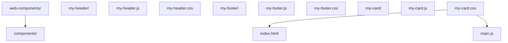
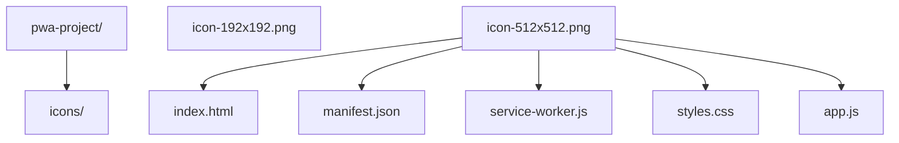

> 分段阅读指南（这篇内容量约等于 2-3 篇，建议**分两次读**，中间完成练习）：
>
> - **Part A（第 1-5 章）Web Components**：Custom Elements、Shadow DOM、Template、生命周期。前置要求：class、构造函数、DOM 与事件（`javascript/001`-`005`、`039`、`017`）。
> - **Part B（第 6-12 章）PWA**：Manifest、Service Worker、离线缓存、推送。前置要求：Promise 与 async/await（`javascript/027`、`023`）。
>
> 零基础第一遍只读 Part A，做完"动手试试"的入门版；Part B 等学过 JS 异步后再来。样式隔离的 `:host` / `::part` 完整速查在文末"CSS Scoping 样式隔离"。

> **警告：未学完 JavaScript 基础（`javascript/001`-`005`、`039`）之前，第一遍请直接跳过本篇**，先按 005 的路线图走完主线。本篇是组件级内容，硬啃会严重打击信心；学完 JS 再回来，收获完全不同。

## 1. Web Components 概述

Web Components 是一组 Web 平台 API，允许开发者创建可重用的自定义元素，这些元素可以在任何 HTML 页面中使用，无论使用什么框架。

### 核心技术

- **Custom Elements**：创建自定义 HTML 元素
- **Shadow DOM**：封装组件样式和结构
- **HTML Templates**：定义可重用的 HTML 结构
- **HTML Imports**：导入组件（已被 ES 模块取代）

## 2. Custom Elements

### 2.1 定义自定义元素

```javascript
class MyElement extends HTMLElement {
  constructor() {
    super();
    // 元素初始化
  }
  // 当元素被添加到 DOM 时调用
  connectedCallback() {
    this.innerHTML = `<p>Hello, Web Components!</p>`;
  }
  // 当元素从 DOM 中移除时调用
  disconnectedCallback() {
    // 清理资源
  }
  // 当属性变化时调用
  attributeChangedCallback(name, oldValue, newValue) {
    // 处理属性变化
  }
  // 定义需要观察的属性
  static get observedAttributes() {
    return ['title'];
  }
}
// 注册自定义元素
customElements.define('my-element', MyElement);
```

### 2.2 使用自定义元素

```html
<my-element title="Hello"></my-element>
```

## 3. Shadow DOM

### 3.1 创建 Shadow DOM

```javascript
class MyElement extends HTMLElement {
  constructor() {
    super();
    // 创建 Shadow DOM
    const shadow = this.attachShadow({ mode: 'open' });
    // 创建样式
    const style = document.createElement('style');
    style.textContent = `
  p {
  color: blue;
  font-size: 18px;
  }
  `;
    // 创建内容
    const p = document.createElement('p');
    p.textContent = 'Hello from Shadow DOM!';
    // 添加到 Shadow DOM
    shadow.appendChild(style);
    shadow.appendChild(p);
  }
}
customElements.define('my-shadow-element', MyElement);
```

## 4. HTML Templates

### 4.1 定义模板

```html
<template id="my-template">
  <style>
    .container {
      padding: 20px;
      background: #f0f0f0;
      border-radius: 8px;
    }
    h3 {
      color: #333;
    }
  </style>
  <div class="container">
    <h3></h3>
    <p></p>
  </div>
</template>
```

### 4.2 使用模板

```javascript
class MyTemplateElement extends HTMLElement {
  constructor() {
    super();
    const shadow = this.attachShadow({ mode: 'open' });
    // 获取模板
    const template = document.getElementById('my-template');
    const content = template.content.cloneNode(true);
    // 设置内容
    content.querySelector('h3').textContent = this.getAttribute('title') || 'Default Title';
    content.querySelector('p').textContent = this.getAttribute('message') || 'Default message';
    shadow.appendChild(content);
  }
}
customElements.define('my-template-element', MyTemplateElement);
```

## 5. 组件生命周期

### 5.1 生命周期回调

| 回调方法                                             | 触发时机             |
| :--------------------------------------------------- | :------------------- |
| `constructor()`                                      | 元素创建时           |
| `connectedCallback()`                                | 元素添加到 DOM 时    |
| `disconnectedCallback()`                             | 元素从 DOM 中移除时  |
| `attributeChangedCallback(name, oldValue, newValue)` | 属性变化时           |
| `adoptedCallback()`                                  | 元素被移动到新文档时 |

## 6. PWA (Progressive Web App) 概述

PWA 是一种结合了 Web 和原生应用优点的应用程序，具有安装到主屏幕、离线访问、推送通知等特性。

### 核心特性

- **可安装**：可以添加到主屏幕
- **离线工作**：使用 Service Worker 缓存资源
- **推送通知**：发送推送消息
- **后台同步**：在网络可用时同步数据
- **响应式**：适配不同屏幕尺寸

## 7. PWA 配置

### 7.1 Web App Manifest

```json
{
  "name": "My PWA",
  "short_name": "PWA",
  "description": "A progressive web app",
  "start_url": "/",
  "display": "standalone",
  "background_color": "#ffffff",
  "theme_color": "#4A90E2",
  "icons": [
    {
      "src": "/icons/icon-192x192.png",
      "sizes": "192x192",
      "type": "image/png"
    },
    {
      "src": "/icons/icon-512x512.png",
      "sizes": "512x512",
      "type": "image/png"
    }
  ]
}
```

### 7.2 注册 Manifest

```html
<link rel="manifest" href="/manifest.json" /> <meta name="theme-color" content="#4A90E2" />
```

## 8. Service Worker

### 8.1 注册 Service Worker

```javascript
if ('serviceWorker' in navigator) {
  window.addEventListener('load', () => {
    navigator.serviceWorker
      .register('/service-worker.js')
      .then((registration) => {
        console.log('Service Worker registered:', registration);
      })
      .catch((error) => {
        console.error('Service Worker registration failed:', error);
      });
  });
}
```

### 8.2 Service Worker 实现

```javascript
 // service-worker.js
 const CACHE_NAME = 'my-pwa-cache-v1';
 const ASSETS = [
  '/',
  '/index.html',
  '/styles.css',
  '/app.js',
  '/icons/icon-192x192.png'
 ]
 // 安装 Service Worker
 self.addEventListener('install', event => {
  event.waitUntil(
  caches.open(CACHE_NAME)
  .then(cache => {
  return cache.addAll(ASSETS);
  })
  .then(() => self.skipWaiting())
  );
 }
 // 激活 Service Worker
 self.addEventListener('activate', event => {
  event.waitUntil(
  caches.keys()
  .then(cacheNames => {
  return Promise.all(
  cacheNames
  .filter(name => name !== CACHE_NAME)
  .map(name => caches.delete(name))
  );
  })
  .then(() => self.clients.claim())
  );
 }
 // 拦截网络请求
 self.addEventListener('fetch', event => {
  event.respondWith(
  caches.match(event.request)
  .then(response => {
  // 如果在缓存中找到响应，则返回缓存的响应
  if (response) {
  return response;
  }
  // 否则，发送网络请求
  return fetch(event.request)
  .then(response => {
  // 如果响应有效，则将其添加到缓存
  if (response && response.status === 200 && response.type === 'basic') {
  const responseToCache = response.clone();
  caches.open(CACHE_NAME)
  .then(cache => {
  cache.put(event.request, responseToCache);
  });
  }
  return response;
  });
  })
  );
 }
```

## 9. 离线功能

### 9.1 缓存策略

- **Cache First**：优先使用缓存，缓存不存在时请求网络
- **Network First**：优先请求网络，网络失败时使用缓存
- **Stale While Revalidate**：使用缓存的同时请求网络更新缓存
- **Network Only**：只使用网络
- **Cache Only**：只使用缓存

## 10. 推送通知

### 10.1 请求通知权限

```javascript
if ('Notification' in window) {
  Notification.requestPermission().then((permission) => {
    if (permission === 'granted') {
      console.log('Notification permission granted');
    }
  });
}
```

### 10.2 发送推送通知

```javascript
function sendNotification() {
  if ('serviceWorker' in navigator && 'PushManager' in window) {
    navigator.serviceWorker.ready.then((registration) => {
      registration.showNotification('Hello PWA!', {
        body: 'This is a push notification from your PWA',
        icon: '/icons/icon-192x192.png',
        badge: '/icons/badge.png',
        vibrate: [100, 50, 100],
        data: {
          url: '/notifications',
        },
      });
    });
  }
}
```

## 11. 后台同步

### 11.1 注册后台同步

```javascript
if ('serviceWorker' in navigator && 'SyncManager' in window) {
  navigator.serviceWorker.ready
    .then((registration) => {
      return registration.sync.register('sync-data');
    })
    .then(() => {
      console.log('Background sync registered');
    })
    .catch((error) => {
      console.error('Background sync registration failed:', error);
    });
}
```

### 11.2 处理后台同步

```javascript
// service-worker.js
self.addEventListener('sync', (event) => {
  if (event.tag === 'sync-data') {
    event.waitUntil(syncData());
  }
});
async function syncData() {
  try {
    // 同步数据的逻辑
    const response = await fetch('/api/sync', {
      method: 'POST',
      body: JSON.stringify({ data: 'sync data' }),
    });
    console.log('Background sync completed:', await response.json());
  } catch (error) {
    console.error('Background sync failed:', error);
  }
}
```

## 12. PWA 最佳实践

1. **响应式设计**：确保在所有设备上都有良好的用户体验
2. **离线优先**：设计应用时考虑离线场景
3. **快速加载**：优化资源加载速度
4. **安全**：使用 HTTPS
5. **可安装**：提供清晰的安装提示
6. **推送通知**：合理使用推送通知，避免过度打扰用户
7. **后台同步**：使用后台同步确保数据一致性
8. **性能监控**：监控应用性能，持续优化

## 13. 项目实战

### 13.1 Web Components 项目结构



### 13.2 PWA 项目结构



## 14. 工具与库

### 14.1 Web Components 库

- **Lit**：Google 开发的轻量级 Web Components 库
- **Stencil**：Ionic 团队开发的 Web Components 编译器
- **Svelte**：可以编译为 Web Components 的前端框架

### 14.2 PWA 工具

- **Workbox**：Google 开发的 Service Worker 工具库
- **Lighthouse**：PWA 性能和质量评估工具
- **PWABuilder**：PWA 生成和打包工具

## 15. 浏览器支持

### 15.1 Web Components 支持

- Chrome：完全支持
- Firefox：完全支持
- Safari：支持（需要 polyfill 用于旧版本）
- Edge：完全支持

### 15.2 PWA 支持

- Chrome：完全支持
- Firefox：部分支持
- Safari：部分支持（推送通知有限制）
- Edge：完全支持

## 16. 常见问题与解决方案

### 16.1 Web Components 问题

**问题**：自定义元素在某些浏览器中不工作
**解决方案**：使用 Web Components polyfill
**问题**：样式隔离问题
**解决方案**：使用 Shadow DOM 确保样式隔离

### 16.2 PWA 问题

**问题**：Service Worker 缓存更新问题
**解决方案**：实现版本控制和缓存清理策略
**问题**：推送通知权限被拒绝
**解决方案**：在合适的时机请求权限，提供清晰的使用说明

## Custom Elements 自定义元素

**定义自定义元素**
`customElements.define(<名称>, <类>, [options])`
```javascript
class MyElement extends HTMLElement {
  constructor() {
    super();
    // 元素初始化
  }

  // 当元素被添加到 DOM 时调用
  connectedCallback() {
    this.innerHTML = `<p>Hello, Web Components!</p>`;
  }

  // 当元素从 DOM 中移除时调用
  disconnectedCallback() {
    // 清理资源
  }

  // 当属性变化时调用
  attributeChangedCallback(name, oldValue, newValue) {
    // 处理属性变化
  }

  // 定义需要观察的属性
  static get observedAttributes() {
    return ['title'];
  }

  // 元素被移动到新文档时调用
  adoptedCallback() {}
}

// 注册自定义元素(名称必须包含连字符)
customElements.define('my-element', MyElement);
```

**使用自定义元素**
```html
<my-element title="Hello"></my-element>
```

**生命周期回调**

| 回调方法                                             | 触发时机             |
| :--------------------------------------------------- | :------------------- |
| `constructor()`                                      | 元素创建时           |
| `connectedCallback()`                                | 元素添加到 DOM 时    |
| `disconnectedCallback()`                             | 元素从 DOM 中移除时  |
| `attributeChangedCallback(name, oldValue, newValue)` | 属性变化时           |
| `adoptedCallback()`                                  | 元素被移动到新文档时 |

**CustomizedElement 内置扩展**
```javascript
class FancyButton extends HTMLButtonElement {
  constructor() {
    super();
    this.addEventListener('click', () => console.log('点击'));
  }
}

// 扩展内置元素
customElements.define('fancy-button', FancyButton, { extends: 'button' });
```

```html
<!-- 使用 is 属性 -->
<button is="fancy-button">点击</button>
```

**元素查询与升级**
```javascript
// 获取自定义元素引用
const el = customElements.get('my-element');

// 强制升级未定义的元素
await customElements.whenDefined('my-element');
console.log('my-element 已定义');
```

---

## Shadow DOM 影子 DOM

**attachShadow 创建 Shadow DOM**
`element.attachShadow({ mode: 'open' | 'closed' })`
```javascript
class MyElement extends HTMLElement {
  constructor() {
    super();
    // 创建 Shadow DOM
    const shadow = this.attachShadow({ mode: 'open' });

    // 创建样式
    const style = document.createElement('style');
    style.textContent = `
      p {
        color: blue;
        font-size: 18px;
      }
    `;

    // 创建内容
    const p = document.createElement('p');
    p.textContent = 'Hello from Shadow DOM!';

    shadow.appendChild(style);
    shadow.appendChild(p);
  }
}
customElements.define('my-shadow-element', MyElement);
```

| mode 值   | 说明                                  |
| --------- | ------------------------------------- |
| `'open'`  | 外部可通过 `element.shadowRoot` 访问   |
| `'closed'`| 拒绝外部访问 `element.shadowRoot` 为 null |

**Shadow DOM 模板化**
```javascript
class MyTemplateElement extends HTMLElement {
  constructor() {
    super();
    const shadow = this.attachShadow({ mode: 'open' });
    const template = document.getElementById('my-template');
    const content = template.content.cloneNode(true);

    content.querySelector('h3').textContent = this.getAttribute('title') || '默认标题';
    content.querySelector('p').textContent = this.getAttribute('message') || '默认内容';
    shadow.appendChild(content);
  }
}
customElements.define('my-template-element', MyTemplateElement);
```

**shadowRoot 操作**
```javascript
// 获取 shadowRoot(open 模式)
const shadow = element.shadowRoot;

// 在 shadow 中查询元素
const innerEl = shadow.querySelector('.inner');

// 在 shadow 中添加元素
shadow.appendChild(document.createElement('div'));
```

**Declarative Shadow DOM(声明式 Shadow DOM)**
```html
<host-element>
  <template shadowrootmode="open">
    <style>p { color: red; }</style>
    <p>声明式 Shadow DOM 内容</p>
  </template>
</host-element>
```

---

## HTML Templates 模板

**template 元素**
```html
<template id="my-template">
  <style>
    .container {
      padding: 20px;
      background: #f0f0f0;
      border-radius: 8px;
    }
    h3 {
      color: #333;
    }
  </style>
  <div class="container">
    <h3></h3>
    <p></p>
  </div>
</template>
```

**使用模板**
```javascript
class MyTemplateElement extends HTMLElement {
  constructor() {
    super();
    const shadow = this.attachShadow({ mode: 'open' });

    // 获取模板
    const template = document.getElementById('my-template');
    // 克隆模板内容
    const content = template.content.cloneNode(true);

    // 填充内容
    content.querySelector('h3').textContent = this.getAttribute('title') || 'Default';
    content.querySelector('p').textContent = this.getAttribute('message') || 'Message';

    shadow.appendChild(content);
  }
}
customElements.define('my-template-element', MyTemplateElement);
```

**slot 插槽**
```html
<!-- 组件定义 -->
<template id="card-template">
  <div class="card">
    <slot name="header">默认头部</slot>
    <hr />
    <slot>默认内容</slot>
  </div>
</template>
```

```html
<!-- 使用插槽 -->
<my-card>
  <span slot="header">自定义头部</span>
  <p>自定义内容</p>
</my-card>
```

**slotchange 事件**
```javascript
const slot = shadow.querySelector('slot');
slot.addEventListener('slotchange', (e) => {
  const assigned = e.target.assignedNodes();
  console.log('插槽内容变化', assigned);
});
```

---

## CSS Scoping 样式隔离

**CSS 自定义属性穿透**
```css
/* 外部定义变量 */
:host {
  --primary-color: #1976d2;
}

/* shadow 内部使用 */
.button {
  background: var(--primary-color);
}
```

**host 选择器**
```css
/* 选中宿主元素 */
:host {
  display: block;
}

/* 选中具有特定类的宿主 */
:host(.active) {
  opacity: 1;
}

/* 选中特定宿主标签 */
:host(my-button) {
  border-radius: 4px;
}
```

**:host-context 上下文选择器**
```css
/* 当祖先元素具有 .dark-theme 时 */
:host-context(.dark-theme) {
  background: #333;
  color: #fff;
}
```

**::part() 伪元素**
```javascript
// 组件内
shadow.innerHTML = `
  <div part="container">
    <span part="label">标签</span>
  </div>
`;
```

```css
/* 外部样式表选中 part */
my-element::part(container) {
  background: red;
}
my-element::part(label) {
  color: white;
}
```

---

## PWA Web App Manifest

**manifest.json 完整字段**
```json
{
  "name": "My PWA",
  "short_name": "PWA",
  "description": "A progressive web app",
  "start_url": "/",
  "scope": "/",
  "display": "standalone",
  "display_override": ["window-controls-overlay", "standalone"],
  "background_color": "#ffffff",
  "theme_color": "#4A90E2",
  "orientation": "any",
  "lang": "zh-CN",
  "dir": "ltr",
  "categories": ["productivity", "utilities"],
  "icons": [
    {
      "src": "/icons/icon-192.png",
      "sizes": "192x192",
      "type": "image/png",
      "purpose": "any"
    },
    {
      "src": "/icons/icon-512.png",
      "sizes": "512x512",
      "type": "image/png",
      "purpose": "maskable"
    }
  ],
  "screenshots": [
    {
      "src": "/screenshots/home.png",
      "sizes": "1280x720",
      "type": "image/png",
      "form_factor": "wide"
    }
  ],
  "shortcuts": [
    {
      "name": "新消息",
      "short_name": "消息",
      "url": "/messages/new",
      "icons": [{ "src": "/icons/msg.png", "sizes": "96x96" }]
    }
  ],
  "file_handlers": [
    {
      "action": "/open-file",
      "accept": { "image/*": [".png", ".jpg"] }
    }
  ]
}
```

**HTML 中引用 manifest**
```html
<link rel="manifest" href="/manifest.json" />
<meta name="theme-color" content="#4A90E2" />
<meta name="apple-mobile-web-app-capable" content="yes" />
<meta name="apple-mobile-web-app-title" content="My PWA" />
<link rel="apple-touch-icon" href="/icons/apple-180.png" />
```

**display 显示模式**

| display 值      | 说明                              |
| --------------- | --------------------------------- |
| `fullscreen`    | 全屏(无 UI)                       |
| `standalone`    | 独立应用(无浏览器 UI)             |
| `minimal-ui`    | 最小 UI(部分浏览器控件)           |
| `browser`       | 标准浏览器(默认)                  |

---

## PWA 安装

**beforeinstallprompt 事件**
```javascript
let deferredPrompt;

window.addEventListener('beforeinstallprompt', (e) => {
  e.preventDefault();
  deferredPrompt = e;
  showInstallButton();
});

document.getElementById('installBtn').addEventListener('click', async () => {
  if (!deferredPrompt) return;
  deferredPrompt.prompt();
  const { outcome } = await deferredPrompt.userChoice;
  console.log(outcome); // 'accepted' | 'dismissed'
  deferredPrompt = null;
});

window.addEventListener('appinstalled', () => {
  console.log('应用已安装');
});
```

**Window Controls Overlay**
```javascript
// 检测支持
const supported = 'windowControlsOverlay' in navigator;

// 监听变化
navigator.windowControlsOverlay.addEventListener('geometrychange', (e) => {
  console.log('标题栏区域变化', e.titlebarAreaRect);
});
```

---

## Fetch 拦截(SW)

**fetch 事件处理**
`self.addEventListener('fetch', (event) => { event.respondWith(<Response>) })`
```javascript
// service-worker.js
const CACHE_NAME = 'my-pwa-cache-v1';
const ASSETS = ['/', '/index.html', '/styles.css', '/app.js'];

// 安装:预缓存
self.addEventListener('install', (event) => {
  event.waitUntil(
    caches.open(CACHE_NAME).then((cache) => cache.addAll(ASSETS))
      .then(() => self.skipWaiting())
  );
});

// 激活:清理旧缓存
self.addEventListener('activate', (event) => {
  event.waitUntil(
    caches.keys().then((names) =>
      Promise.all(names.filter((n) => n !== CACHE_NAME).map((n) => caches.delete(n)))
    ).then(() => self.clients.claim())
  );
});

// 拦截请求
self.addEventListener('fetch', (event) => {
  event.respondWith(
    caches.match(event.request).then((cached) => {
      if (cached) return cached;
      return fetch(event.request).then((response) => {
        if (response && response.status === 200 && response.type === 'basic') {
          const clone = response.clone();
          caches.open(CACHE_NAME).then((cache) => cache.put(event.request, clone));
        }
        return response;
      });
    })
  );
});
```

**缓存策略对比**

| 策略                       | 说明                   | 适用场景     |
| -------------------------- | ---------------------- | ------------ |
| **Cache First**            | 优先缓存,无则请求网络  | 静态资源     |
| **Network First**          | 优先网络,失败用缓存    | API 请求     |
| **Stale While Revalidate** | 缓存即时响应,后台更新  | 非关键 API   |
| **Network Only**           | 仅网络                 | 实时数据     |
| **Cache Only**             | 仅缓存                 | 离线资源     |

---

## 通知与推送

**请求通知权限**
```javascript
if ('Notification' in window) {
  Notification.requestPermission().then((permission) => {
    if (permission === 'granted') {
      console.log('通知权限已授予');
    }
  });
}
```

**显示通知**
```javascript
function sendNotification() {
  if ('serviceWorker' in navigator && 'PushManager' in window) {
    navigator.serviceWorker.ready.then((registration) => {
      registration.showNotification('Hello PWA!', {
        body: 'This is a push notification',
        icon: '/icons/icon-192.png',
        badge: '/icons/badge.png',
        vibrate: [100, 50, 100],
        data: { url: '/notifications' },
        actions: [
          { action: 'open', title: '打开' },
          { action: 'close', title: '关闭' },
        ],
      });
    });
  }
}
```

---

## 后台同步

**注册后台同步**
```javascript
if ('serviceWorker' in navigator && 'SyncManager' in window) {
  navigator.serviceWorker.ready
    .then((registration) => registration.sync.register('sync-data'))
    .then(() => console.log('已注册后台同步'))
    .catch((error) => console.error('注册失败:', error));
}
```

**Service Worker 处理同步**
```javascript
self.addEventListener('sync', (event) => {
  if (event.tag === 'sync-data') {
    event.waitUntil(syncData());
  }
});

async function syncData() {
  try {
    const response = await fetch('/api/sync', {
      method: 'POST',
      body: JSON.stringify({ data: 'sync data' }),
    });
    console.log('同步完成:', await response.json());
  } catch (error) {
    console.error('同步失败:', error);
    throw error;
  }
}
```

## 动手试试

### 入门版（必做）

1. 定义一个 `<my-card>` 自定义元素，包含标题和内容，注册后在页面中使用；
2. 给组件加 Shadow DOM，确认内部样式不影响页面其它元素；
3. 写一个 `manifest.json`，让页面可被安装到桌面。

### 进阶版（选做）

1. 用 `<template>` + `slot` 实现可插拔内容的卡片组件；
2. 注册 Service Worker，断网刷新页面仍然可用；
3. 用 `setCustomValidity` 或组件生命周期实现一个带校验的 `<my-input>`。

## 核心知识点

> 一句话记住 Web Components 与 PWA：组件三件套（Custom Elements、Shadow DOM、Template），离线三件套（Manifest、Service Worker、缓存）；组件管复用，PWA 管体验。

- Custom Elements：继承 `HTMLElement` + `customElements.define`，名称必须带连字符；
- Shadow DOM：`attachShadow` 隔离样式与结构，`:host` 定制宿主；
- HTML Templates：`<template>` 定义可复用结构，配合 `slot` 插槽分发内容；
- Manifest：`name`/`icons`/`start_url`/`display` 让网页可安装；
- Service Worker：注册 → install 预缓存 → fetch 拦截，实现离线；
- 推送与后台同步属于进阶能力，需要服务器配合。

## 注意事项与改进建议

| 问题点 | 说明 | 改进方案 |
| --- | --- | --- |
| 自定义元素名称无连字符 | 与原生标签冲突 | 名称必须包含连字符 |
| 忘记 `super()` | 构造器报错，元素无法初始化 | 第一行调用 `super()` |
| Shadow DOM 内样式写死 | 组件无法被外部定制 | 用 CSS 变量提供主题入口 |
| SW 缓存无版本管理 | 旧缓存长期占用，更新失效 | 版本化缓存名，activate 时清理 |
| SW 只在 HTTPS 生效 | 本地 http 测试失败 | 使用 localhost 或本地服务器工具 |
| 组件与框架混用不熟 | 生命周期与框架渲染冲突 | 先掌握原生生命周期，再对照框架集成 |

## 扩展学习

- 组件细节：`html5/022-EmbeddedContent` 对比 iframe 与 Web Components 的隔离方式；
- PWA 深化：`html5/028-ServiceWorkerPWA` 完整生命周期与缓存策略；
- 离线存储：`html5/014-HTML5OfflineStorageWebAPI` 本地存储与 Cache API；
- 推送通知：`html5/014-HTML5OfflineStorageWebAPI` 中 Notification API；
- 框架集成：Vue/React 中使用自定义元素的官方指南。
