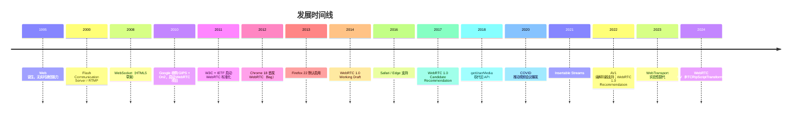

> 前置要求（本模块最高难度）：除 JavaScript 中级基础（Promise/async/class/事件，`javascript/001`-`005`、`039`、`023`）外，还需要基本网络概念：TCP/UDP、NAT、HTTP（`networking/001`）。信令流程（Offer/Answer/ICE）是本篇核心，建议先读 4.1 完整 demo 建立整体印象，再回头读第 2-3 章理论；调试时用 `chrome://webrtc-internals`（见 4.7）。

> **警告：这是本模块最高难度的一篇。未学完 JavaScript 基础（`javascript/001`-`005`、`039`、`023`）与基础网络概念（`networking/001`）之前，第一遍请直接跳过**，先按 005 的路线图走完主线；零基础硬读 WebRTC 是挫败感的最大来源。

## 1. 历史动机与发展脉络

### 1.1 前实时通信时代（1995—2010）

早期 Web 仅支持单向 HTTP 请求，实时通信依赖以下方案：

| 方案 | 原理 | 延迟 | 缺陷 |
| ---- | ---- | ---- | ---- |
| 短轮询（Short Polling） | 客户端定时发请求 | 1—10s | 流量浪费、电池消耗 |
| 长轮询（Long Polling） | 服务器挂起请求直到有数据 | 200ms—2s | 服务器连接占用 |
| HTTP Streaming | 单条响应持续推送 | 100ms—1s | 中间代理缓冲、不支持二进制 |
| Flash Socket | Flash 插件 + RTMP | 100ms | 依赖插件、2020 退役 |
| Java Applet + Socket | 浏览器内 TCP | 50ms | 依赖插件、安全风险 |
| WebSocket（2010） | 全双工 TCP | 50—100ms | 仅文本/二进制流，无媒体 |

### 1.2 WebRTC 诞生（2010—2011）

2010 年 Google 以约 1.33 亿美元收购 GIPS（Global IP Solutions）与 On2（VP8 编码器），将二者代码开源为 WebRTC 项目。设计目标：

1. **浏览器原生**：无需插件，API 标准化。
2. **端到端加密**：强制 DTLS-SRTP，明文永不离开浏览器。
3. **P2P 优先**：直接点对点，降低服务器中转成本。
4. **跨平台**：Chrome、Firefox、Safari、Edge 一致实现。
5. **媒体优化**：内置抖动缓冲、丢包恢复、回声消除。

2011 年 W3C 与 IETF 启动标准化：

- **W3C WebRTC WG**：定义浏览器 JavaScript API。
- **IETF RTCWeb WG**：定义底层协议（ICE、DTLS-SRTP、SDP扩展、编解码器）。

### 1.3 规范化与普及（2012—2018）

| 年份 | 里程碑 | 浏览器 |
| ---- | ------ | ------ |
| 2012 | Chrome 18 首次支持 WebRTC（flag） | Chrome |
| 2013 | Firefox 22 默认启用 WebRTC | Firefox |
| 2014 | Chrome 移除 flag，默认启用 | Chrome |
| 2015 | ORTC API 在 Edge 首发（WebRTC 1.0 早期替代） | Edge |
| 2016 | Safari iOS 11 支持 WebRTC | Safari |
| 2017 | WebRTC 1.0 进入 W3C Candidate Recommendation | 全部主流 |
| 2018 | `navigator.mediaDevices.getUserMedia` 取代旧 `navigator.getUserMedia` | 全部主流 |

### 1.4 现代化演进（2019—2024）

| 年份 | 特性 | 意义 |
| ---- | ---- | ---- |
| 2019 | `RTCRtpSender.setParameters()` 支持运行时调参 | 动态码率、分辨率 |
| 2020 | `getDisplayMedia()` 屏幕共享标准化 | 远程协作 |
| 2020 | COVID 推动视频会议爆发（Zoom、Meet、Teams） | 商业验证 |
| 2021 | Insertable Streams（编码器插入流） | 端到端加密、AI 处理 |
| 2022 | AV1 编解码器进入 Chrome WebRTC | 带宽节省 30%+ |
| 2022 | WebRTC 1.0 W3C Recommendation 正式发布 | 标准定稿 |
| 2023 | WebTransport（HTTP/3）作为 WebRTC 替代方案实验 | 极低延迟 |
| 2024 | WebRTC NV（Next Version）API：`RTCRtpScriptTransform` | 客户端转码、AI 增强 |

### 1.5 演进时间线



### 1.6 规范族谱

- **W3C WebRTC 1.0**（Recommendation, 2022）：JavaScript API 权威定义。
- **W3C Media Capture and Streams**：`getUserMedia` 与 `MediaStream` 定义。
- **W3C WebRTC Statistics**：`getStats()` API 与统计指标。
- **IETF RFC 8825**：WebRTC 架构概述。
- **IETF RFC 8827**：WebRTC 安全架构。
- **IETF RFC 8261**：SCTP over DTLS。
- **IETF RFC 8834**：WebRTC 媒体传输。
- **IETF RFC 8866**：SDP Offer/Answer。

---

## 2. 形式化定义

### 2.1 WebRTC API 概览

```webidl
[Exposed=Window, SecureContext]
interface MediaDevices : EventTarget {
  [SecureContext] Promise<MediaStream> getUserMedia(MediaStreamConstraints constraints);
  [SecureContext] Promise<MediaStream> getDisplayMedia(DisplayMediaStreamConstraints constraints);
  MediaTrackSupportedConstraints getSupportedConstraints();
  readonly attribute MediaDeviceInfoList enumeratedDevices;
  attribute EventHandler ondevicechange;
};

dictionary MediaStreamConstraints {
  (boolean or MediaTrackConstraints) video = false;
  (boolean or MediaTrackConstraints) audio = false;
};

[Exposed=Window]
interface RTCPeerConnection : EventTarget {
  constructor(optional RTCConfiguration configuration = {});
  Promise<RTCSessionDescriptionInit> createOffer(optional RTCOfferOptions options = {});
  Promise<RTCSessionDescriptionInit> createAnswer(optional RTCAnswerOptions options = {});
  Promise<undefined> setLocalDescription(optional RTCLocalSessionDescriptionInit description = {});
  Promise<undefined> setRemoteDescription(RTCSessionDescriptionInit description);
  Promise<undefined> addIceCandidate(RTCIceCandidateInit candidate);
  RTCRtpSender addTrack(MediaTrack track, MediaStream... streams);
  void removeTrack(RTCRtpSender sender);
  RTCRtpTransceiver addTransceiver((MediaStreamTrack or DOMString) trackOrKind, optional RTCRtpTransceiverInit init = {});
  RTCDataChannel createDataChannel(USVString label, optional RTCDataChannelInit dataChannelDict = {});
  readonly attribute RTCSessionDescription? localDescription;
  readonly attribute RTCSessionDescription? remoteDescription;
  readonly attribute RTCIceConnectionState iceConnectionState;
  readonly attribute RTCConnectionState connectionState;
  readonly attribute RTCSignalingState signalingState;
  attribute EventHandler onicecandidate;
  attribute EventHandler ontrack;
  attribute EventHandler ondatachannel;
  attribute EventHandler onconnectionstatechange;
  void close();
};

[Exposed=Window]
interface RTCDataChannel : EventTarget {
  readonly attribute USVString label;
  readonly attribute boolean ordered;
  readonly attribute unsigned short? maxPacketLifeTime;
  readonly attribute unsigned short? maxRetransmits;
  readonly attribute RTCDataChannelState readyState;
  readonly attribute unsigned long bufferedAmount;
  attribute unsigned long bufferedAmountLowThreshold;
  attribute EventHandler onopen;
  attribute EventHandler onmessage;
  attribute EventHandler onclose;
  attribute EventHandler onerror;
  void send(USVString data);
  void send(Blob data);
  void send(ArrayBuffer data);
  void send(ArrayBufferView data);
  void close();
};
```

### 2.2 ICE 候选类型形式化

设 ICE 候选 $c$ 由四元组定义：

$$
c = (\text{type}, \text{ip}, \text{port}, \text{protocol})
$$

其中 `type ∈ {host, srflx, prflx, relay}`：

- **host candidate**：本地网卡 IP，无 NAT 转换。
- **server reflexive (srflx)**：通过 STUN 服务器发现的公网映射 IP。
- **peer reflexive (prflx)**：通过对端 ICE 检查发现的 IP。
- **relay candidate**：通过 TURN 服务器中转的 IP。

**连通性优先级**：

$$
\text{priority}(host) > \text{priority}(prflx) > \text{priority}(srflx) > \text{priority}(relay)
$$

ICE 选择最高优先级的成功候选对作为数据通道。

### 2.3 SDP Offer/Answer 模型

SDP（Session Description Protocol, RFC 4566）是会话描述的文本格式。WebRTC 使用 SDP 描述媒体能力：

```
v=0
o=- 459892837129 2 IN IP4 127.0.0.1
s=-
t=0 0
m=audio 9 UDP/TLS/RTP/SAVPF 111
c=IN IP4 0.0.0.0
a=rtcp:9 IN IP4 0.0.0.0
a=ice-ufrag:9uB6
a=ice-pwd:WuJZ+...+8f4=
a=fingerprint:sha-256 19:E2:...
a=setup:actpass
a=mid:0
a=sendrecv
a=rtpmap:111 opus/48000/2
a=fmtp:111 minptime=10;useinbandfec=1
```

**Offer/Answer 流程**：

1. Caller 调用 `createOffer()` 生成 `offer` SDP。
2. Caller `setLocalDescription(offer)` 设置本地描述。
3. Caller 通过信令通道将 `offer` 发送到 Callee。
4. Callee `setRemoteDescription(offer)` 接收。
5. Callee `createAnswer()` 生成 `answer` SDP。
6. Callee `setLocalDescription(answer)` 设置。
7. Callee 通过信令通道将 `answer` 发回 Caller。
8. Caller `setRemoteDescription(answer)` 接收。

### 2.4 信令状态机形式化

`RTCPeerConnection.signalingState` 的有限状态机：

$$
\text{signalingState} \in \{\text{stable}, \text{have-local-offer}, \text{have-remote-offer}, \text{have-local-pranswer}, \text{have-remote-pranswer}, \text{closed}\}
$$

状态转换：

$$
\begin{aligned}
\text{stable} &\xrightarrow{\text{createOffer + setLocalDescription}} \text{have-local-offer} \\
\text{have-local-offer} &\xrightarrow{\text{setRemoteDescription(answer)}} \text{stable} \\
\text{stable} &\xrightarrow{\text{setRemoteDescription(offer)}} \text{have-remote-offer} \\
\text{have-remote-offer} &\xrightarrow{\text{createAnswer + setLocalDescription}} \text{stable} \\
\text{any} &\xrightarrow{\text{close()}} \text{closed}
\end{aligned}
$$

### 2.5 连接状态机

`RTCPeerConnection.connectionState`：

$$
\text{connectionState} \in \{\text{new}, \text{connecting}, \text{connected}, \text{disconnected}, \text{failed}, \text{closed}\}
$$

转换条件：

- `new` → `connecting`：开始 ICE 检查。
- `connecting` → `connected`：至少一个 ICE 候选对成功。
- `connecting` → `failed`：所有候选对失败或超时（默认 30s）。
- `connected` → `disconnected`：超过 30s 未收到响应。
- `disconnected` → `connected`：恢复通信。
- `disconnected` → `failed`：超过 30s 仍无响应。

### 2.6 RTCDataChannel 传输参数

`RTCDataChannel` 基于 SCTP over DTLS over UDP：

$$
\text{SCTP} \xrightarrow{\text{over}} \text{DTLS} \xrightarrow{\text{over}} \text{UDP}
$$

可配置参数：

| 参数 | 取值 | 语义 |
| ---- | ---- | ---- |
| `ordered` | `true/false` | 是否保序 |
| `maxPacketLifeTime` | ms | 最大重传时间（与 `maxRetransmits` 互斥） |
| `maxRetransmits` | int | 最大重传次数 |
| `protocol` | string | 子协议标识 |
| `negotiated` | `true/false` | 是否使用显式 ID 协商 |

**可靠性与有序性矩阵**：

| `ordered` | `maxPacketLifeTime`/`maxRetransmits` | 语义 | 类比 |
| ---------- | ----------------------------------- | ---- | ---- |
| `true` | `null` | TCP | TCP |
| `true` | 设定 | TCP with partial reliability | 部分可靠 TCP |
| `false` | `null` | UDP with message boundaries | SCTP |
| `false` | 设定 | UDP with partial reliability | 实时游戏 |

### 2.7 媒体编解码器约束

W3C WebRTC 规范要求实现：

| 类型 | 编解码器 | 必需/可选 | 典型码率 |
| ---- | -------- | --------- | -------- |
| 音频 | Opus | 必需 | 6—510 kbps |
| 音频 | G.711 | 可选 | 64 kbps |
| 视频 | VP8 | 必需 | 100—2000 kbps |
| 视频 | H.264 Baseline | 必需 | 100—2000 kbps |
| 视频 | VP9 | 可选 | 50—1500 kbps |
| 视频 | AV1 | 推荐（2024+） | 50—1200 kbps |

---

## 3. 理论推导与原理解析

### 3.1 NAT 穿透数学模型

NAT（Network Address Translator）将内网 IP 映射到公网 IP。设内网主机 $H_i$ 在内网 IP $IP_i^{\text{priv}}$ 与端口 $P_i^{\text{priv}}$ 上发送数据包，NAT 将其映射为公网 $IP^{\text{pub}}$ 与端口 $P^{\text{pub}}$：

$$
\text{NAT}(IP_i^{\text{priv}}, P_i^{\text{priv}}) \to (IP^{\text{pub}}, P^{\text{pub}})
$$

**NAT 类型**（RFC 3489，已废弃但概念保留）：

1. **Full Cone**：任意外部主机可通过 $(IP^{\text{pub}}, P^{\text{pub}})$ 访问内网。
2. **Restricted Cone**：仅允许内网主动联系过的外部 IP 访问。
3. **Port Restricted Cone**：仅允许内网主动联系过的外部 $(IP, P)$ 访问。
4. **Symmetric NAT**：根据目标 $(IP, P)$ 分配不同的 $(IP^{\text{pub}}, P^{\text{pub}})$。

**穿透成功率**（NAT 类型组合）：

| Caller NAT | Callee NAT | P2P 可行性 |
| ---------- | ---------- | ---------- |
| Full Cone | 任意 | 可（host/srflx） |
| Restricted | Restricted | 可（srflx） |
| Symmetric | Full Cone | 可（srflx） |
| Symmetric | Restricted | 不可（需 TURN） |
| Symmetric | Symmetric | 不可（需 TURN） |

### 3.2 STUN 协议工作原理

STUN 客户端向 STUN 服务器发送绑定请求：

```text
STUN Binding Request:
  XOR-MAPPED-ADDRESS: 客户端公网 IP + 端口

STUN Binding Response:
  XOR-MAPPED-ADDRESS: (IP^pub, P^pub)
```

客户端通过响应中的 `XOR-MAPPED-ADDRESS` 学习自己的公网映射，作为 `srflx` 候选加入 ICE。

**RTT 计算**：

$$
T_{\text{STUN-RTT}} = T_{\text{request}} + T_{\text{network-RTT}} + T_{\text{response}}
$$

典型值 20—100ms。

### 3.3 TURN 中继开销

当 P2P 失败，使用 TURN 中继：

$$
T_{\text{TURN}} = T_{\text{allocate}} + T_{\text{permission}} + T_{\text{send-indication}} + T_{\text{relay}}
$$

带宽开销：

$$
B_{\text{TURN}} = 2 \times B_{\text{media}} + B_{\text{overhead}}
$$

其中 `overhead` 包括 TURN 头部（4—36 字节/包）、DTLS 加密开销。

**TURN 服务器成本**：1 Mbps 媒体流 → 2 Mbps TURN 流量。10 人会议（每人 1 Mbps）→ 20 Mbps TURN 流量。

### 3.4 ICE 候选检查复杂度

设 Caller 有 $m$ 个候选，Callee 有 $n$ 个候选，则候选对数量：

$$
N_{\text{pairs}} = m \times n
$$

ICE 按优先级排序检查，成功即停止。最坏情况检查 $N_{\text{pairs}}$ 次，每次约 100ms，总耗时：

$$
T_{\text{ICE}} \leq N_{\text{pairs}} \times 100\text{ms}
$$

**优化**：Trickle ICE 在候选生成时立即发送，并行检查，将 $T_{\text{ICE}}$ 从串行 $O(mn)$ 降为并行 $O(\max(m, n))$。

### 3.5 DTLS-SRTP 加密链路

WebRTC 强制使用 DTLS-SRTP 加密媒体流：

$$
\text{RTP packet} \xrightarrow{\text{SRTP encrypt}} \text{SRTP packet} \xrightarrow{\text{DTLS handshake}} \text{keys}
$$

1. ICE 完成后，双方通过 DTLS 握手协商加密参数。
2. DTLS 握手使用 X.509 证书（自签名）。
3. 握手产物派生 SRTP 主密钥。
4. 后续 RTP 包使用 SRTP 加密。

**完美前向保密（PFS）**：DTLS 1.2 使用 ECDHE 密钥交换，即使长期密钥泄露，历史通信仍安全。

### 3.6 抖动缓冲与丢包恢复

设网络抖动方差 $\sigma_J$，缓冲深度 $B$：

$$
B = k \times \sigma_J + T_{\text{recovery}}
$$

其中 $k$ 为安全系数（典型 2—3），$T_{\text{recovery}}$ 为丢包重传时间。

**NACK 重传**：接收方检测到序号跳变时，发送 NACK 请求重传。

**FEC 前向纠错**：发送方额外发送冗余包，接收方可从冗余恢复少量丢包。

**带宽估计**：WebRTC 使用 GCC（Google Congestion Control）算法：

$$
R_{\text{est}}(t) = R_{\text{prev}} + \alpha \cdot \text{trend}(t) - \beta \cdot \text{loss}(t)
$$

### 3.7 Simulcast 带宽自适应

Simulcast 同时发送多档编码（如 180p/360p/720p），SFU 根据接收方带宽选择转发：

$$
S = \{s_1, s_2, \ldots, s_k\}, \quad R_i \to s_{j(i)}
$$

其中 $j(i)$ 根据接收方 $R_i$ 的带宽 $B_i$ 选择：

$$
j(i) = \arg\max_j \{s_j : \text{bitrate}(s_j) \leq B_i\}
$$

相比 SVC（单流多层），Simulcast 编码开销大但切换灵活。

### 3.8 端到端延迟分解

设端到端延迟 $T_{\text{e2e}}$：

$$
T_{\text{e2e}} = T_{\text{capture}} + T_{\text{encode}} + T_{\text{network}} + T_{\text{decode}} + T_{\text{render}}
$$

典型分解（720p/30fps，本地网络）：

| 阶段 | 延迟 |
| ---- | ---- |
| 采集 | 16ms |
| 编码 | 5—15ms |
| 网络传输 | 5—50ms |
| 抖动缓冲 | 20—100ms |
| 解码 | 5—15ms |
| 渲染 | 16ms |
| **合计** | **67—212ms** |

跨洲际网络（RTT 200ms）：300—500ms 端到端延迟。

---

## 4. 代码示例

### 4.1 完整 HTML5 视频通话 demo

```html
<!DOCTYPE html>
<html lang="zh-CN">
  <head>
    <meta charset="UTF-8" />
    <meta name="viewport" content="width=device-width, initial-scale=1.0" />
    <title>WebRTC 视频通话</title>
    <style>
      .container { display: grid; grid-template-columns: 1fr 1fr; gap: 16px; padding: 16px; }
      video { width: 100%; background: #000; border-radius: 8px; }
      .controls { margin-top: 16px; }
      button { padding: 8px 16px; margin-right: 8px; cursor: pointer; }
      .status { padding: 8px; background: #f0f0f0; border-radius: 4px; margin-top: 8px; }
    </style>
  </head>
  <body>
    <h1>WebRTC 视频通话</h1>
    <div class="container">
      <div>
        <h2>本地视频</h2>
        <video id="localVideo" autoplay muted playsinline></video>
      </div>
      <div>
        <h2>远端视频</h2>
        <video id="remoteVideo" autoplay playsinline></video>
      </div>
    </div>
    <div class="controls">
      <button id="startBtn">启动摄像头</button>
      <button id="callBtn" disabled>发起通话</button>
      <button id="hangupBtn" disabled>挂断</button>
    </div>
    <div id="status" class="status">状态：未启动</div>

    <script>
      const localVideo = document.getElementById('localVideo');
      const remoteVideo = document.getElementById('remoteVideo');
      const startBtn = document.getElementById('startBtn');
      const callBtn = document.getElementById('callBtn');
      const hangupBtn = document.getElementById('hangupBtn');
      const statusEl = document.getElementById('status');

      let localStream;
      let pc;  // RTCPeerConnection
      const signaling = new WebSocket('wss://signal.example.com');

      function setStatus(msg) {
        statusEl.textContent = '状态：' + msg;
        console.log('[status]', msg);
      }

      // 信令消息处理
      signaling.onmessage = async (event) => {
        const msg = JSON.parse(event.data);
        if (msg.type === 'offer') {
          await pc.setRemoteDescription(msg);
          const answer = await pc.createAnswer();
          await pc.setLocalDescription(answer);
          signaling.send(JSON.stringify(answer));
        } else if (msg.type === 'answer') {
          await pc.setRemoteDescription(msg);
        } else if (msg.type === 'candidate') {
          await pc.addIceCandidate(msg.candidate);
        }
      };

      // 1. 启动摄像头
      startBtn.onclick = async () => {
        try {
          localStream = await navigator.mediaDevices.getUserMedia({
            video: { width: { ideal: 1280 }, height: { ideal: 720 }, frameRate: { ideal: 30 } },
            audio: { echoCancellation: true, noiseSuppression: true },
          });
          localVideo.srcObject = localStream;
          startBtn.disabled = true;
          callBtn.disabled = false;
          setStatus('摄像头已启动');
        } catch (err) {
          setStatus('摄像头启动失败：' + err.message);
        }
      };

      // 2. 发起通话
      callBtn.onclick = async () => {
        pc = new RTCPeerConnection({
          iceServers: [
            { urls: 'stun:stun.l.google.com:19302' },
            { urls: 'turn:turn.example.com', username: 'user', credential: 'pass' },
          ],
        });

        // 添加本地轨道
        localStream.getTracks().forEach((track) => pc.addTrack(track, localStream));

        // 接收远端轨道
        pc.ontrack = (e) => {
          remoteVideo.srcObject = e.streams[0];
          setStatus('已接收远端流');
        };

        // ICE 候选
        pc.onicecandidate = (e) => {
          if (e.candidate) {
            signaling.send(JSON.stringify({ type: 'candidate', candidate: e.candidate }));
          }
        };

        // 状态监听
        pc.onconnectionstatechange = () => {
          setStatus('连接状态：' + pc.connectionState);
        };

        // 创建 Offer
        const offer = await pc.createOffer();
        await pc.setLocalDescription(offer);
        signaling.send(JSON.stringify(offer));
        callBtn.disabled = true;
        hangupBtn.disabled = false;
        setStatus('已发送 Offer');
      };

      // 3. 挂断
      hangupBtn.onclick = () => {
        if (pc) {
          pc.close();
          pc = null;
        }
        if (localStream) {
          localStream.getTracks().forEach((t) => t.stop());
          localStream = null;
        }
        localVideo.srcObject = null;
        remoteVideo.srcObject = null;
        startBtn.disabled = false;
        callBtn.disabled = true;
        hangupBtn.disabled = true;
        setStatus('已挂断');
      };
    </script>
  </body>
</html>
```

### 4.2 getUserMedia 约束详解

```javascript
// 基础约束
const stream1 = await navigator.mediaDevices.getUserMedia({
  video: true,
  audio: true,
});

// 精细约束（理想值）
const stream2 = await navigator.mediaDevices.getUserMedia({
  video: {
    width: { ideal: 1280 },
    height: { ideal: 720 },
    frameRate: { ideal: 30, max: 60 },
    facingMode: 'user',  // 'user' | 'environment'
  },
  audio: {
    echoCancellation: true,
    noiseSuppression: true,
    autoGainControl: true,
    sampleRate: 48000,
    channelCount: 2,
  },
});

// 强制约束（min/max）
const stream3 = await navigator.mediaDevices.getUserMedia({
  video: {
    width: { min: 640, max: 1920 },
    height: { min: 480, max: 1080 },
    frameRate: { min: 24, max: 60 },
  },
});

// 屏幕共享
const displayStream = await navigator.mediaDevices.getDisplayMedia({
  video: { frameRate: { ideal: 30 } },
  audio: true,  // 系统音频
});

// 同时使用摄像头与屏幕共享
const mixedStream = new MediaStream([
  ...displayStream.getVideoTracks(),
  ...stream1.getAudioTracks(),
]);

// 切换摄像头
const devices = await navigator.mediaDevices.enumerateDevices();
const videoDevices = devices.filter((d) => d.kind === 'videoinput');
const newStream = await navigator.mediaDevices.getUserMedia({
  video: { deviceId: { exact: videoDevices[1].deviceId } },
});

// 应用约束到已有轨道
const [videoTrack] = stream2.getVideoTracks();
await videoTrack.applyConstraints({
  width: 1920,
  height: 1080,
  frameRate: 60,
});

// 轨道停止
videoTrack.stop();
```

### 4.3 RTCDataChannel 实时聊天

```javascript
// Caller 端
const pc = new RTCPeerConnection(config);
const chatChannel = pc.createDataChannel('chat', {
  ordered: true,            // 保序
  maxRetransmits: 3,        // 最多重传 3 次
});

chatChannel.onopen = () => {
  console.log('DataChannel 已打开');
  chatChannel.send('Hello from caller!');
};

chatChannel.onmessage = (e) => {
  console.log('收到:', e.data);
};

// Callee 端
pc.ondatachannel = (event) => {
  const channel = event.channel;
  channel.onopen = () => channel.send('Hello from callee!');
  channel.onmessage = (e) => console.log('收到:', e.data);
};

// 文件传输（分块）
async function sendFile(channel, file) {
  const CHUNK_SIZE = 16 * 1024;  // 16KB
  const reader = new FileReader();
  let offset = 0;
  
  reader.onload = (e) => {
    channel.send(e.target.result);
    offset += e.target.result.byteLength;
    if (offset < file.size) {
      readSlice(offset);
    } else {
      channel.send(JSON.stringify({ type: 'done', name: file.name }));
    }
  };
  
  function readSlice(o) {
    const slice = file.slice(o, o + CHUNK_SIZE);
    reader.readAsArrayBuffer(slice);
  }
  
  readSlice(0);
}
```

### 4.4 Perfect Negotiation（完美协商）

```javascript
// 完美协商避免 glare（双方同时发起 offer）
class PerfectNegotiation {
  constructor(pc, signaling) {
    this.pc = pc;
    this.signaling = signaling;
    this.makingOffer = false;
    this.ignoreOffer = false;
    this.isPolite = false;  // 一方为 true，一方为 false
    
    pc.onnegotiationneeded = async () => {
      try {
        this.makingOffer = true;
        await pc.setLocalDescription();
        signaling.send(JSON.stringify({ type: 'offer', sdp: pc.localDescription }));
      } catch (err) {
        console.error(err);
      } finally {
        this.makingOffer = false;
      }
    };
    
    signaling.onmessage = async (msg) => {
      const { type, sdp, candidate } = JSON.parse(msg.data);
      
      try {
        if (type === 'offer') {
          this.ignoreOffer = !this.isPolite && (this.makingOffer || pc.signalingState !== 'stable');
          if (this.ignoreOffer) return;
          
          await pc.setRemoteDescription({ type, sdp });
          if (pc.signalingState === 'stable') {
            await pc.setLocalDescription();
            signaling.send(JSON.stringify({ type: 'answer', sdp: pc.localDescription }));
          }
        } else if (type === 'answer') {
          await pc.setRemoteDescription({ type, sdp });
        } else if (type === 'candidate') {
          try {
            await pc.addIceCandidate(candidate);
          } catch (err) {
            if (!this.ignoreOffer) throw err;
          }
        }
      } catch (err) {
        console.error(err);
      }
    };
  }
}
```

### 4.5 信令服务器（Node.js + ws）

```javascript
// signaling-server.js
const WebSocket = require('ws');
const wss = new WebSocket.Server({ port: 8080 });

const rooms = new Map();  // roomId → Set<WebSocket>

wss.on('connection', (ws) => {
  let currentRoom = null;
  
  ws.on('message', (data) => {
    const msg = JSON.parse(data);
    
    if (msg.type === 'join') {
      currentRoom = msg.room;
      if (!rooms.has(currentRoom)) rooms.set(currentRoom, new Set());
      rooms.get(currentRoom).add(ws);
      console.log(`Client joined room ${currentRoom}, total: ${rooms.get(currentRoom).size}`);
    } else {
      // 广播给同房间其他客户端
      const peers = rooms.get(currentRoom);
      if (peers) {
        for (const peer of peers) {
          if (peer !== ws && peer.readyState === WebSocket.OPEN) {
            peer.send(data);
          }
        }
      }
    }
  });
  
  ws.on('close', () => {
    if (currentRoom && rooms.has(currentRoom)) {
      rooms.get(currentRoom).delete(ws);
      if (rooms.get(currentRoom).size === 0) {
        rooms.delete(currentRoom);
      }
    }
  });
});

console.log('Signaling server running on ws://localhost:8080');
```

### 4.6 媒体统计（getStats）

```javascript
async function monitorStats(pc) {
  const stats = await pc.getStats();
  let videoStats = {};
  
  stats.forEach((report) => {
    if (report.type === 'outbound-rtp' && report.kind === 'video') {
      videoStats = {
        bitrate: report.bitrateMean || 0,
        packetsSent: report.packetsSent,
        bytesSent: report.bytesSent,
        framesEncoded: report.framesEncoded,
        frameRate: report.framesPerSecond,
      };
    }
    if (report.type === 'inbound-rtp' && report.kind === 'video') {
      videoStats.jitter = report.jitter;
      videoStats.packetsLost = report.packetsLost;
      videoStats.nackCount = report.nackCount;
    }
  });
  
  console.table(videoStats);
}

// 每 5 秒统计一次
setInterval(() => monitorStats(pc), 5000);
```

---

### 4.7 调试技巧：chrome://webrtc-internals

WebRTC 连接失败的调试难度极高，浏览器内置了专用调试页：地址栏输入 `chrome://webrtc-internals`（Edge 为 `edge://webrtc-internals`），打开后**先点"开始录制"，再打开你的通话页面**，所有 RTCPeerConnection 的 SDP、ICE 候选、连接状态、统计信息都会实时记录。新手排查顺序：

1. 看 **ICE Connection State**：卡在 `checking` 说明候选没有配对成功——先确认 STUN 服务器可访问；
2. 看 **ICE Candidate Pair**：是否出现 `srflx`（NAT 穿透成功）还是全部 `relay`（走了 TURN，延迟高但可用）；
3. 看 **inbound-rtp / outbound-rtp**：有没有收到/发出媒体包，区分"连接失败"与"媒体静音/黑屏"；
4. 看 **DataChannel**：数据通道状态是否为 open，用于定位信令或媒体之外的通信问题。

**讲解：**

1. 录制必须在建立连接之前开始，否则看不到完整过程。
2. `getStats()`（4.6）负责业务内监控，webrtc-internals 负责连接期排障，两者配合使用。
3. 常见假象：`connected` 状态但看不到画面，多半是 `addTrack/ontrack` 或 `<video>` 的 `srcObject` 没接上。

## 5. 对比分析

### 5.1 实时通信方案对比

| 方案 | 延迟 | 双向 | 媒体 | 浏览器原生 | 适用场景 |
| ---- | ---- | ---- | ---- | ---------- | -------- |
| WebRTC | 50—200ms | 是 | 音视频+数据 | 是 | 视频通话、会议 |
| WebSocket + MJPEG | 200—500ms | 是 | 视频（帧序列） | 是 | 监控、低帧率视频 |
| WebSocket + 编码流 | 100—300ms | 是 | 音视频 | 是 | 直播推流 |
| HLS（HTTP Live Streaming） | 2—10s | 否 | 音视频 | 是 | 大规模直播 |
| DASH | 2—10s | 否 | 音视频 | 是 | VOD、点播 |
| RTSP / RTMP | 100—500ms | 否 | 音视频 | 否（需插件） | 安防监控 |
| WebTransport | <50ms | 是 | 任意 | 部分（HTTP/3） | 实验性 |

### 5.2 ICE 服务器对比

| 类型 | 协议 | 部署难度 | 成本 | 延迟 | P2P 成功率 |
| ---- | ---- | -------- | ---- | ---- | ---------- |
| STUN（公共） | STUN | 无需 | 免费 | 低 | 80%（普通 NAT） |
| STUN（自建） | STUN | 低 | 低 | 低 | 80% |
| TURN（自建 coturn） | TURN | 中 | 中 | 中 | 99% |
| TURN（商业托管） | TURN | 无需 | 高 | 中 | 99.9% |
| TURN + TCP | TURN/TCP | 中 | 中 | 高 | 99.9%（防火墙） |
| TURN + TLS | TURN/TLS | 高 | 高 | 最高 | 99.99%（企业网） |

### 5.3 多人会议架构对比

| 架构 | 服务器算力 | 服务器带宽 | 客户端带宽 | 延迟 | 扩展性 |
| ---- | ---------- | ---------- | ---------- | ---- | ------ |
| P2P Mesh | 无 | 无 | $O(n)$ 上行 + $O(n-1)$ 下行 | 最低 | 差（≤6 人） |
| SFU | 低（仅转发） | $O(n)$ | 上行 $O(1)$，下行 $O(n-1)$ | 低 | 好（≤500 人） |
| MCU（混合） | 高（解码+合成） | $O(n)$ | 上行 $O(1)$，下行 $O(1)$ | 高（合成延迟） | 中（≤50 人） |
| SFU + Simulcast | 低 | $O(n)$ | 上行 $O(k)$，下行 $O(n-1)$ | 低 | 优秀（≤1000 人） |
| SFU + SVC | 低 | $O(n)$ | 上行 $O(1)$，下行 $O(n-1)$ | 低 | 优秀 |

### 5.4 编解码器对比

| 编解码器 | 类型 | 压缩率 | 复杂度 | 浏览器支持 | WebRTC 必需 |
| -------- | ---- | ------ | ------ | ---------- | ----------- |
| VP8 | 视频 | 中 | 低 | 全部 | 是 |
| VP9 | 视频 | 高 | 中 | Chrome/Edge | 否 |
| AV1 | 视频 | 极高 | 高 | Chrome 90+ | 推荐 |
| H.264 | 视频 | 中 | 中 | 全部 | 是（Baseline） |
| H.265/HEVC | 视频 | 高 | 高 | Safari | 否 |
| Opus | 音频 | 高 | 中 | 全部 | 是 |
| G.711 | 音频 | 低 | 低 | 全部 | 否 |

### 5.5 信令协议对比

| 方案 | 协议 | 优势 | 劣势 |
| ---- | ---- | ---- | ---- |
| WebSocket | TCP | 简单、广泛支持 | 需自定义消息格式 |
| Socket.IO | WebSocket | 自动重连、房间 | 依赖 Socket.IO 库 |
| Server-Sent Events | HTTP | 单向服务器推送 | 仅下行 |
| HTTP Polling | HTTP | 无需长连接 | 高延迟、高开销 |
| SIP over WebSocket | SIP | 标准化 | 复杂 |
| XMPP | XML | 标准化 | 重 XML 解析 |

---

## 6. 常见陷阱与反模式

### 6.1 安全陷阱

**陷阱 7.1.1**：getUserMedia 在非 HTTPS 环境调用。

```javascript
// 反模式：HTTP 环境调用
// 浏览器抛出 NotAllowedError 或 NotFoundError
const stream = await navigator.mediaDevices.getUserMedia({ video: true });
```

**修复**：必须 HTTPS 或 `localhost`。

**陷阱 7.1.2**：未处理 `MediaDevices` 不存在场景。

```javascript
// 反模式
const stream = await navigator.mediaDevices.getUserMedia({ video: true });

// 正确
if (!navigator.mediaDevices?.getUserMedia) {
  alert('您的浏览器不支持摄像头');
  return;
}
```

**陷阱 7.1.3**：未处理权限拒绝。

```javascript
// 反模式
const stream = await navigator.mediaDevices.getUserMedia({ video: true });

// 正确
try {
  const stream = await navigator.mediaDevices.getUserMedia({ video: true });
} catch (err) {
  if (err.name === 'NotAllowedError') {
    alert('用户拒绝了摄像头权限');
  } else if (err.name === 'NotFoundError') {
    alert('未找到摄像头设备');
  } else if (err.name === 'NotReadableError') {
    alert('摄像头被其他应用占用');
  }
}
```

### 6.2 信令陷阱

**陷阱 7.2.1**：未实现 Perfect Negotiation，导致 glare 死锁。

```javascript
// 反模式：直接 setLocalDescription(createOffer())
const offer = await pc.createOffer();
await pc.setLocalDescription(offer);
signaling.send(offer);
// 若对端同时发起 offer，双方都进入 have-local-offer 状态，无法继续
```

**修复**：使用 Perfect Negotiation 模式（见 5.4）。

**陷阱 7.2.2**：ICE 候选发送顺序错误。

```javascript
// 反模式：在 setLocalDescription 之前添加候选
await pc.addIceCandidate(candidate);  // 抛 InvalidStateError
await pc.setLocalDescription(offer);

// 正确
await pc.setLocalDescription(offer);
// 等待 setLocalDescription 完成后再 addIceCandidate
await pc.addIceCandidate(candidate);
```

**陷阱 7.2.3**：未处理 Trickle ICE 失败。

```javascript
// 反模式：假设所有候选都会及时到达
pc.onicecandidate = (e) => {
  if (e.candidate) signaling.send(e.candidate);
};

// 正确：等待 ICE 收集完成
pc.onicegatheringstatechange = () => {
  if (pc.iceGatheringState === 'complete') {
    // 所有候选已收集，发送 localDescription
    signaling.send(pc.localDescription);
  }
};
```

### 6.3 性能反模式

**反模式 7.3.1**：未在轨道停止后清理资源。

```javascript
// 反模式
const stream = await getUserMedia({ video: true });
videoEl.srcObject = stream;
// 用户离开页面但未停止轨道 → 摄像头指示灯常亮

// 正确
window.addEventListener('beforeunload', () => {
  stream.getTracks().forEach((t) => t.stop());
});
```

**反模式 7.3.2**：使用过高的分辨率与帧率。

```javascript
// 反模式：4K/60fps 视频通话
const stream = await getUserMedia({
  video: { width: 3840, height: 2160, frameRate: 60 },
});
// 带宽爆炸、CPU 过载、风扇狂转
```

**修复**：通话场景 720p/30fps 足够；演示场景 1080p/30fps。

**反模式 7.3.3**：在主线程做编解码。

```javascript
// 反模式：手动 createImageBitmap + WebCodecs 编码
const bitmap = await createImageBitmap(videoFrame);
// 在主线程占用大量 CPU
```

**修复**：使用 `RTCRtpScriptTransform` 或 Worker。

### 6.4 兼容性陷阱

**陷阱 7.4.1**：Safari 不支持 `addTrack` 的某些用法。

```javascript
// 反模式：连续 addTrack 在 Safari 可能不触发 negotiationneeded
stream.getTracks().forEach((t) => pc.addTrack(t, stream));

// 正确：使用 addTransceiver
stream.getTracks().forEach((t) => pc.addTransceiver(t, { streams: [stream] }));
```

**陷阱 7.4.2**：`replaceTrack` 未在所有浏览器支持。

```javascript
// 反模式
track.enabled = false;
newTrack.enabled = true;

// 正确
await sender.replaceTrack(newTrack);
```

### 6.5 SDP 陷阱

**陷阱 7.5.1**：手动修改 SDP。

```javascript
// 反模式：字符串拼接修改 SDP
let sdp = offer.sdp;
sdp = sdp.replace('a=fmtp:111', 'a=fmtp:111 minptime=20');
offer.sdp = sdp;
```

**修复**：使用 `RTCRtpTransceiver.setCodecPreferences()` 或 `RTCRtpSender.setParameters()`。

**陷阱 7.5.2**：未启用 Simulcast。

```javascript
// 反模式：单流传输，无法适应多接收方带宽
pc.addTrack(videoTrack);

// 正确：启用 Simulcast（Chrome）
const sender = pc.addTrack(videoTrack);
const params = sender.getParameters();
params.encodings = [
  { rid: 'low', maxBitrate: 150000, scaleResolutionDownBy: 4 },
  { rid: 'mid', maxBitrate: 500000, scaleResolutionDownBy: 2 },
  { rid: 'high', maxBitrate: 1500000, scaleResolutionDownBy: 1 },
];
await sender.setParameters(params);
```

---

## 7. 工程实践

### 7.1 TypeScript 类型封装

```typescript
// webrtc-client.ts
interface MediaConstraints {
  video?: {
    width?: { ideal?: number; min?: number; max?: number };
    height?: { ideal?: number; min?: number; max?: number };
    frameRate?: { ideal?: number; min?: number; max?: number };
    facingMode?: 'user' | 'environment';
    deviceId?: { exact?: string };
  };
  audio?: {
    echoCancellation?: boolean;
    noiseSuppression?: boolean;
    autoGainControl?: boolean;
    sampleRate?: number;
    channelCount?: number;
  };
}

interface RTCConfig {
  iceServers: RTCIceServer[];
  iceTransportPolicy?: 'all' | 'relay';
  bundlePolicy?: 'balanced' | 'max-compat' | 'max-bundle';
  rtcpMuxPolicy?: 'require' | 'negotiate';
}

class WebRTCClient {
  private pc: RTCPeerConnection | null = null;
  private localStream: MediaStream | null = null;
  private signaling: WebSocket;
  private polite: boolean;

  constructor(config: RTCConfig, signalingUrl: string, polite = false) {
    this.signaling = new WebSocket(signalingUrl);
    this.polite = polite;
    this.pc = new RTCPeerConnection(config);
    this.setupSignaling();
  }

  async startMedia(constraints: MediaConstraints): Promise<MediaStream> {
    this.localStream = await navigator.mediaDevices.getUserMedia(constraints);
    this.localStream.getTracks().forEach((track) => {
      this.pc!.addTrack(track, this.localStream!);
    });
    return this.localStream;
  }

  async startScreenShare(): Promise<MediaStream> {
    return navigator.mediaDevices.getDisplayMedia({
      video: { frameRate: { ideal: 30 } },
      audio: true,
    });
  }

  onRemoteStream(callback: (stream: MediaStream) => void): void {
    this.pc!.ontrack = (e) => callback(e.streams[0]);
  }

  private setupSignaling(): void {
    let makingOffer = false;
    let ignoreOffer = false;

    this.pc!.onnegotiationneeded = async () => {
      try {
        makingOffer = true;
        await this.pc!.setLocalDescription();
        this.signaling.send(JSON.stringify({ type: 'offer', sdp: this.pc!.localDescription }));
      } catch (err) {
        console.error('[WebRTC] Negotiation error:', err);
      } finally {
        makingOffer = false;
      }
    };

    this.pc!.onicecandidate = (e) => {
      if (e.candidate) {
        this.signaling.send(JSON.stringify({ type: 'candidate', candidate: e.candidate }));
      }
    };

    this.signaling.onmessage = async (event) => {
      const msg = JSON.parse(event.data);
      try {
        if (msg.type === 'offer') {
          ignoreOffer = !this.polite && (makingOffer || this.pc!.signalingState !== 'stable');
          if (ignoreOffer) return;
          await this.pc!.setRemoteDescription(msg);
          if (this.pc!.signalingState === 'stable') {
            await this.pc!.setLocalDescription();
            this.signaling.send(JSON.stringify({ type: 'answer', sdp: this.pc!.localDescription }));
          }
        } else if (msg.type === 'answer') {
          await this.pc!.setRemoteDescription(msg);
        } else if (msg.type === 'candidate') {
          try {
            await this.pc!.addIceCandidate(msg.candidate);
          } catch (err) {
            if (!ignoreOffer) throw err;
          }
        }
      } catch (err) {
        console.error('[WebRTC] Signaling error:', err);
      }
    };
  }

  createDataChannel(label: string, options?: RTCDataChannelInit): RTCDataChannel {
    return this.pc!.createDataChannel(label, options);
  }

  async getStats(): Promise<RTCStatsReport> {
    return this.pc!.getStats();
  }

  close(): void {
    if (this.localStream) {
      this.localStream.getTracks().forEach((t) => t.stop());
    }
    this.pc?.close();
    this.signaling.close();
  }
}

// 使用
const client = new WebRTCClient(
  {
    iceServers: [
      { urls: 'stun:stun.l.google.com:19302' },
      { urls: 'turn:turn.example.com', username: 'user', credential: 'pass' },
    ],
  },
  'wss://signal.example.com',
  true
);

await client.startMedia({
  video: { width: { ideal: 1280 }, height: { ideal: 720 } },
  audio: { echoCancellation: true },
});

client.onRemoteStream((stream) => {
  document.querySelector('#remoteVideo').srcObject = stream;
});
```

### 7.2 React 视频通话组件

```tsx
// VideoCall.tsx
import React, { useEffect, useRef, useState } from 'react';

export const VideoCall: React.FC<{ roomId: string }> = ({ roomId }) => {
  const localVideoRef = useRef<HTMLVideoElement>(null);
  const remoteVideoRef = useRef<HTMLVideoElement>(null);
  const pcRef = useRef<RTCPeerConnection>();
  const [status, setStatus] = useState('idle');
  
  useEffect(() => {
    const init = async () => {
      const stream = await navigator.mediaDevices.getUserMedia({
        video: { width: { ideal: 1280 }, height: { ideal: 720 } },
        audio: true,
      });
      if (localVideoRef.current) localVideoRef.current.srcObject = stream;
      
      const pc = new RTCPeerConnection({
        iceServers: [{ urls: 'stun:stun.l.google.com:19302' }],
      });
      pcRef.current = pc;
      
      stream.getTracks().forEach((track) => pc.addTrack(track, stream));
      
      pc.ontrack = (e) => {
        if (remoteVideoRef.current) remoteVideoRef.current.srcObject = e.streams[0];
      };
      
      pc.onconnectionstatechange = () => setStatus(pc.connectionState);
      
      // 信令 WebSocket
      const ws = new WebSocket(`wss://signal.example.com/${roomId}`);
      ws.onmessage = async (event) => {
        const msg = JSON.parse(event.data);
        if (msg.type === 'offer') {
          await pc.setRemoteDescription(msg);
          const answer = await pc.createAnswer();
          await pc.setLocalDescription(answer);
          ws.send(JSON.stringify(answer));
        } else if (msg.type === 'answer') {
          await pc.setRemoteDescription(msg);
        } else if (msg.type === 'candidate') {
          await pc.addIceCandidate(msg.candidate);
        }
      };
      
      pc.onicecandidate = (e) => {
        if (e.candidate) ws.send(JSON.stringify({ type: 'candidate', candidate: e.candidate }));
      };
      
      pc.onnegotiationneeded = async () => {
        const offer = await pc.createOffer();
        await pc.setLocalDescription(offer);
        ws.send(JSON.stringify(offer));
      };
    };
    
    init();
    
    return () => {
      pcRef.current?.close();
    };
  }, [roomId]);
  
  return (
    <div>
      <video ref={localVideoRef} autoPlay muted playsInline />
      <video ref={remoteVideoRef} autoPlay playsInline />
      <p>状态：{status}</p>
    </div>
  );
};
```

### 7.3 coturn TURN 服务器部署

```bash
# 安装 coturn
sudo apt install coturn

# 配置 /etc/turnserver.conf
cat > /etc/turnserver.conf << 'EOF'
listening-port=3478
tls-listening-port=5349
listening-ip=YOUR_SERVER_IP
external-ip=YOUR_PUBLIC_IP
min-port=49152
max-port=65535
fingerprint
lt-cred-mech
realm=example.com
user=myuser:mypassword
total-quota=100
bps-capacity=0
stale-nonce=600
no-loopback-peers
no-multicast-peers
no-tcp-relay
cert=/etc/letsencrypt/live/example.com/cert.pem
pkey=/etc/letsencrypt/live/example.com/privkey.pem
cipher-list="HIGH"
log-file=/var/log/turnserver.log
simple-log
EOF

# 启动
sudo systemctl enable coturn
sudo systemctl start coturn

# 防火墙
sudo ufw allow 3478/udp
sudo ufw allow 3478/tcp
sudo ufw allow 5349/tcp
sudo ufw allow 49152:65535/udp
```

### 7.4 SFU 集成（mediasoup）

```javascript
// mediasoup-client.ts
import mediasoupClient from 'mediasoup-client';

const device = new mediasoupClient.Device();

async function connect() {
  const rtpCapabilities = await fetch('/api/mediasoup/rtp-capabilities').then((r) => r.json());
  await device.load({ routerRtpCapabilities: rtpCapabilities });
  
  // 上行传输
  const transport = await device.createSendTransport(await fetch('/api/mediasoup/create-transport').then((r) => r.json()));
  
  transport.on('connect', ({ dtlsParameters }, callback, errback) => {
    fetch('/api/mediasoup/connect-transport', {
      method: 'POST',
      body: JSON.stringify({ dtlsParameters }),
    }).then(callback).catch(errback);
  });
  
  transport.on('produce', ({ kind, rtpParameters }, callback, errback) => {
    fetch('/api/mediasoup/produce', {
      method: 'POST',
      body: JSON.stringify({ kind, rtpParameters }),
    })
      .then((r) => r.json())
      .then(({ id }) => callback({ id }))
      .catch(errback);
  });
  
  // 推送摄像头
  const stream = await navigator.mediaDevices.getUserMedia({ video: true, audio: true });
  const videoTrack = stream.getVideoTracks()[0];
  const producer = await transport.produce({ track: videoTrack });
  
  return producer;
}
```

### 7.5 自动化测试（Playwright）

```typescript
// webrtc.test.ts
import { test, expect } from '@playwright/test';

test('getUserMedia 权限', async ({ page, context }) => {
  await context.grantPermissions(['camera', 'microphone']);
  await page.goto('/webrtc-demo');
  
  await page.click('#startBtn');
  await expect(page.locator('#localVideo')).toHaveJSProperty('srcObject', expect.any(Object));
  await expect(page.locator('#status')).toContainText('摄像头已启动');
});

test('端到端通话建立', async ({ browser }) => {
  const callerCtx = await browser.newContext({ permissions: ['camera', 'microphone'] });
  const calleeCtx = await browser.newContext({ permissions: ['camera', 'microphone'] });
  
  const callerPage = await callerCtx.newPage();
  const calleePage = await calleeCtx.newPage();
  
  await callerPage.goto('/webrtc-demo?room=test');
  await calleePage.goto('/webrtc-demo?room=test');
  
  await callerPage.click('#startBtn');
  await calleePage.click('#startBtn');
  
  await callerPage.click('#callBtn');
  
  // 等待连接建立
  await expect(callerPage.locator('#status')).toContainText('connected', { timeout: 10000 });
  await expect(calleePage.locator('#status')).toContainText('connected', { timeout: 10000 });
  
  // 验证远端视频流
  await expect(callerPage.locator('#remoteVideo')).toHaveJSProperty('srcObject', expect.any(Object));
});
```

---

## 8. 案例研究

### 8.1 Google Meet

Google Meet 是 WebRTC 视频会议的标杆产品：

1. **架构**：基于 SFU（自研 Onest），客户端使用 WebRTC。
2. **Simulcast**：客户端同时发送 180p/360p/720p，SFU 按接收方带宽选择。
3. **AV1 编码**：2022 年起 Chrome 桌面端使用 AV1，带宽节省 30%。
4. **端到端加密**：2023 年所有会议启用 E2EE，基于 Insertable Streams。
5. **AI 增强**：实时字幕（Web Speech API）、噪声消除（RNN 模型）、人像居中（MediaPipe）。
6. **降级策略**：网络恶化时优先保证音频，视频降帧/降分辨率。

### 8.2 Discord Voice

Discord 语音通话基于 WebRTC：

1. **架构**：SFU + 自适应比特率。
2. **音频处理**：服务端 Opus 编码，客户端 WebAudio 处理（噪声门限、压缩）。
3. **视频**：可选屏幕共享与摄像头。
4. **降级**：UDP 失败时回退到 TCP TURN。
5. **隐私**：所有通话端到端加密（DTLS-SRTP）。

### 8.3 WhatsApp Web

WhatsApp Web 视频通话基于 WebRTC：

1. **信令**：通过 WhatsApp 自有协议（基于 WebSocket）。
2. **P2P 优先**：单人通话 P2P，群组通话 SFU。
3. **加密**：Signal Protocol（端到端加密），WebRTC 仅作为传输载体。
4. **跨平台**：移动端原生 WebRTC，Web 端浏览器 WebRTC，通过 WhatsApp 服务器桥接。

### 8.4 WebTorrent

WebTorrent 基于 WebRTC 实现 P2P 文件共享：

1. **数据通道**：`RTCDataChannel` 用于分片传输。
2. **Pex**：Peer Exchange 通过 DHT（基于 WebRTC datachannel）。
3. **同时支持 Web 与桌面**：Web 端 WebRTC，桌面端同时支持 uTP。
4. **典型用途**：P2P 视频流（WebTorrent 站点）、即时文件分享。

### 8.5 Cloudflare Stream RTC

Cloudflare 商业 WebRTC 服务：

1. **全球 TURN**：边缘节点提供低延迟 TURN。
2. **SFU 即服务**：开发者无需自建，按使用量计费。
3. **AI 转码**：服务端实时转码（VP8/VP9/H.264/AV1）。
4. **录制**：可选服务端录制为 MP4。

### 8.6 Twitch Live Producer

Twitch 主播推流使用 WebRTC：

1. **浏览器推流**：`getUserMedia` + `RTCPeerConnection` 推送到 Twitch 入口。
2. **超低延迟模式**：WebRTC 路径延迟 < 2s，HLS 路径 5—10s。
3. **回声消除**：主播听自己声音时使用 WebRTC AEC。
4. **降级**：网络不稳时回退到 RTMP。

### 8.7 1Password 远程协助

1Password 远程协助功能基于 WebRTC：

1. **屏幕共享**：`getDisplayMedia`。
2. **控制权限**：通过 `RTCDataChannel` 传输鼠标/键盘事件。
3. **端到端加密**：DTLS-SRTP + 应用层额外加密。
4. **零信任**：会话密钥仅在两个客户端之间，1Password 服务器不可见。

### 8.8 Excalidraw 实时协作

Excalidraw 在线白板使用 WebRTC：

1. **Yjs CRDT**：通过 `RTCDataChannel` 同步 CRDT 文档。
2. **P2P 优先**：少人数时纯 P2P，无服务器。
3. **Y-WebRTC**：Yjs 官方 WebRTC provider。
4. **降级**：网络失败时回退到 WebSocket。

---

## 11. 扩展阅读

### 11.1 官方规范

- W3C WebRTC 1.0: https://www.w3.org/TR/webrtc/
- W3C Media Capture and Streams: https://www.w3.org/TR/mediacapture-streams/
- W3C WebRTC Statistics: https://www.w3.org/TR/webrtc-stats/
- IETF RTCWeb WG: https://datatracker.ietf.org/wg/rtcweb/documents/

### 11.2 浏览器实现

- Chromium WebRTC: https://webrtc.googlesource.com/src/
- Firefox WebRTC: https://wiki.mozilla.org/Media/WebRTC
- Safari WebRTC: https://developer.apple.com/documentation/webkit/delivering_video_content_for_safari

### 11.3 SFU 与开源项目

- mediasoup: https://mediasoup.org/
- Janus: https://janus.conf.meetecho.com/
- LiveKit: https://livekit.io/
- Jitsi Videobridge: https://jitsi.org/jitsi-videobridge/
- Pion (Go WebRTC): https://github.com/pion/webrtc

### 11.4 TURN 服务

- coturn: https://github.com/coturn/coturn
- Twilio NTS: https://www.twilio.com/stun-turn
- Cloudflare Calls: https://developers.cloudflare.com/calls/

### 11.6 浏览器兼容性矩阵

| 特性 | Chrome | Firefox | Safari | Edge |
| ---- | ------ | ------- | ------ | ---- |
| `getUserMedia` | 全版本 | 全版本 | 11+ | 全版本 |
| `RTCPeerConnection` | 23+ | 22+ | 11+ | 15+ |
| `RTCDataChannel` | 25+ | 22+ | 11+ | 15+ |
| `getDisplayMedia` | 72+ | 66+ | 13+ | 79+ |
| AV1 编解码 | 90+ | 未支持 | 未支持 | 90+ |
| VP9 编解码 | 55+ | 未支持 | 未支持 | 55+ |
| Simulcast | 60+ | 未支持 | 14.1+ | 60+ |
| Insertable Streams | 86+ | 未支持 | 未支持 | 86+ |
| `RTCRtpScriptTransform` | 111+ | 未支持 | 未支持 | 111+ |
| Perfect Negotiation | 80+ | 80+ | 14.1+ | 80+ |

### 11.7 术语表

| 术语 | 全称 | 说明 |
| ---- | ---- | ---- |
| WebRTC | Web Real-Time Communication | Web 实时通信 |
| ICE | Interactive Connectivity Establishment | 交互式连接建立 |
| STUN | Session Traversal Utilities for NAT | NAT 会话穿透工具 |
| TURN | Traversal Using Relays around NAT | NAT 中继穿透 |
| SDP | Session Description Protocol | 会话描述协议 |
| DTLS | Datagram Transport Layer Security | 数据报 TLS |
| SRTP | Secure Real-time Transport Protocol | 安全实时传输协议 |
| RTP | Real-time Transport Protocol | 实时传输协议 |
| RTCP | RTP Control Protocol | RTP 控制协议 |
| NAT | Network Address Translator | 网络地址转换 |
| SFU | Selective Forwarding Unit | 选择性转发单元 |
| MCU | Multipoint Control Unit | 多点控制单元 |
| SVC | Scalable Video Coding | 可伸缩视频编码 |
| PFS | Perfect Forward Secrecy | 完美前向保密 |
| DSCP | Differentiated Services Code Point | 差分服务代码点 |
| GCC | Google Congestion Control | Google 拥塞控制 |
| NACK | Negative Acknowledgement | 否定应答 |
| FEC | Forward Error Correction | 前向纠错 |
| JID | Jabber ID | XMPP 标识 |
| P2P | Peer-to-Peer | 点对点 |

### 11.8 学习路径

**入门（1 周）**：

1. 阅读 W3C WebRTC 1.0 规范前 5 节。
2. 完成 web.dev "WebRTC Fundamentals" codelab。
3. 运行 WebRTC Samples 中的基础 demo（getUserMedia、点对点连接）。

**进阶（2 周）**：

1. 阅读 WebRTC for the Curious 全书。
2. 要点： Perfect Negotiation 模式。
3. 部署 coturn TURN 服务器并测试。
4. 使用 `getStats()` 监控媒体质量。

**高级（1 月）**：

1. 集成 mediasoup 或 LiveKit SFU，构建多人会议。
2. 要点： Simulcast 与带宽自适应。
3. 研究 Insertable Streams 端到端加密。
4. 调试 WebRTC 网络问题（Wireshark、chrome://webrtc-internals）。

**研究（持续）**：

1. 跟踪 W3C WebRTC NV（Next Version）规范。
2. 研究 AV1 在 WebRTC 中的落地。
3. 探索 WebTransport 替代 WebRTC 的可能性。
4. 阅读 Chromium WebRTC 源码（pc/、api/、media/）。
## WebRTC 核心组件

**WebRTC 三大组件表**

| 组件                      | 作用                       | 主要对象/方法                |
| ------------------------- | -------------------------- | ---------------------------- |
| **getUserMedia**          | 获取本地媒体流(摄像头/麦克风) | `navigator.mediaDevices.getUserMedia()` |
| **RTCPeerConnection**     | 建立点对点连接             | `new RTCPeerConnection()`    |
| **RTCDataChannel**        | 传输任意数据               | `pc.createDataChannel()`     |

---

## getUserMedia 媒体捕获

**获取本地媒体流**
`const stream = await navigator.mediaDevices.getUserMedia(<constraints>)`

```javascript
// 获取摄像头和麦克风媒体流
const stream = await navigator.mediaDevices.getUserMedia({
  video: true,   // 启用视频
  audio: true    // 启用音频
});

// 将媒体流绑定到 video 元素
const video = document.querySelector('#localVideo');
video.srcObject = stream;
await video.play();
```

**媒体约束条件**
`{ video: { width, height, facingMode }, audio: { echoCancellation, noiseSuppression } }`

```javascript
// 精细化约束视频和音频参数
const stream = await navigator.mediaDevices.getUserMedia({
  video: {
    width: { ideal: 1280 },      // 理想宽度
    height: { ideal: 720 },      // 理想高度
    frameRate: { ideal: 30 },    // 理想帧率
    facingMode: 'user'           // 前置摄像头(user | environment)
  },
  audio: {
    echoCancellation: true,      // 回声消除
    noiseSuppression: true,      // 降噪
    autoGainControl: true        // 自动增益
  }
});
```

**屏幕共享**
`const stream = await navigator.mediaDevices.getDisplayMedia(<constraints>)`

```javascript
// 捕获屏幕、窗口或浏览器标签页(需用户选择)
const stream = await navigator.mediaDevices.getDisplayMedia({
  video: { cursor: 'always' },  // 始终显示鼠标
  audio: false                   // 是否捕获系统音频
});
```

---

## 媒体轨道操作

**MediaStreamTrack 方法表**

| 方法                       | 说明                       |
| -------------------------- | -------------------------- |
| `track.stop()`             | 停止轨道                   |
| `track.enabled = false`    | 静音/禁用轨道              |
| `track.getSettings()`      | 获取当前轨道配置           |
| `track.getCapabilities()`  | 获取设备支持的配置范围     |
| `track.applyConstraints()` | 动态修改约束               |

```javascript
// 遍历并操作媒体轨道
stream.getTracks().forEach((track) => {
  console.log(`轨道类型: ${track.kind}, 状态: ${track.readyState}`);
  // track.stop();        // 停止
  // track.enabled = false; // 禁用
});

// 动态切换摄像头
async function switchCamera() {
  const videoTrack = stream.getVideoTracks()[0];
  const newConstraints = { facingMode: 'environment' };
  await videoTrack.applyConstraints(newConstraints);
}
```

---

## RTCPeerConnection 点对点连接

**创建 PeerConnection**
`const pc = new RTCPeerConnection(<configuration>)`

```javascript
// 创建点对点连接,配置 ICE 服务器(STUN/TURN)
const pc = new RTCPeerConnection({
  iceServers: [
    { urls: 'stun:stun.l.google.com:19302' },                        // STUN 服务器
    { urls: 'turn:turn.example.com', username: 'user', credential: 'pass' } // TURN 服务器
  ],
  iceTransportPolicy: 'all' // all | relay
});
```

**添加本地媒体流**
`stream.getTracks().forEach(track => pc.addTrack(track, stream))`

```javascript
// 将本地媒体轨道添加到连接中
const stream = await navigator.mediaDevices.getUserMedia({ video: true, audio: true });
stream.getTracks().forEach((track) => {
  pc.addTrack(track, stream);
});
```

**接收远端媒体流**
`pc.ontrack = (event) => { event.streams[0] }`

```javascript
// 监听远端媒体流到达
pc.ontrack = (event) => {
  console.log('收到远端轨道:', event.track.kind);
  const remoteVideo = document.getElementById('remote');
  remoteVideo.srcObject = event.streams[0];
};
```

---

## ICE 候选交换

**监听 ICE 候选**
`pc.onicecandidate = (event) => { event.candidate }`

```javascript
// 监听本地 ICE 候选,通过信令服务器发送给对端
pc.onicecandidate = (event) => {
  if (event.candidate) {
    // 将候选发送给对端
    sendSignal({ type: 'candidate', candidate: event.candidate });
  } else {
    console.log('ICE 候选收集完成');
  }
};

// 接收对端 ICE 候选
function handleRemoteCandidate(candidate) {
  pc.addIceCandidate(new RTCIceCandidate(candidate));
}
```

**ICE 连接状态**
`pc.oniceconnectionstatechange = () => { pc.iceConnectionState }`

```javascript
// 监听 ICE 连接状态变化
pc.oniceconnectionstatechange = () => {
  const state = pc.iceConnectionState;
  console.log('ICE 状态:', state);
  // checking | connected | completed | disconnected | failed | closed
};
```

---

## SDP 信令交换

**创建并设置 Offer**
`const offer = await pc.createOffer([options])`

```javascript
// 主叫方创建 Offer
const offer = await pc.createOffer({
  offerToReceiveAudio: true,
  offerToReceiveVideo: true
});
await pc.setLocalDescription(offer);
// 通过信令服务器发送 offer 给被叫方
sendSignal({ type: 'offer', sdp: offer });
```

**接收并应答 Offer**
`const answer = await pc.createAnswer()`

```javascript
// 被叫方处理 Offer 并创建 Answer
async function handleOffer(offer) {
  await pc.setRemoteDescription(offer);
  const answer = await pc.createAnswer();
  await pc.setLocalDescription(answer);
  sendSignal({ type: 'answer', sdp: answer });
}

// 主叫方接收 Answer
async function handleAnswer(answer) {
  await pc.setRemoteDescription(answer);
}
```

---

## RTCDataChannel 数据通道

**创建数据通道**
`const channel = pc.createDataChannel(<label>, [options])`

```javascript
// 创建有序数据通道
const channel = pc.createDataChannel('chat', {
  ordered: true,           // 保证送达顺序
  maxRetransmits: 3,       // 最大重传次数
  // maxPacketLifeTime: 3000  // 最大生存时间(毫秒,与 maxRetransmits 二选一)
});

channel.onopen = () => {
  console.log('通道已打开');
  channel.send('Hello!');
};

channel.onmessage = (event) => {
  console.log('收到:', event.data);
};

channel.onclose = () => console.log('通道已关闭');
channel.onerror = (err) => console.error('通道错误:', err);
```

**接收对端数据通道**
`pc.ondatachannel = (event) => { event.channel }`

```javascript
// 被叫方监听对端创建的数据通道
pc.ondatachannel = (event) => {
  const channel = event.channel;
  channel.onmessage = (e) => console.log('收到:', e.data);
  channel.onopen = () => channel.send('已连接');
};
```

---

## 连接关闭与状态

**关闭连接**
`pc.close()`

```javascript
// 关闭点对点连接,释放资源
pc.close();
```

**RTCPeerConnection 状态表**

| 属性                    | 值                                                  |
| ----------------------- | --------------------------------------------------- |
| `connectionState`       | new \| connecting \| connected \| disconnected \| failed \| closed |
| `iceConnectionState`    | new \| checking \| connected \| completed \| disconnected \| failed \| closed |
| `iceGatheringState`     | new \| gathering \| complete                        |
| `signalingState`        | stable \| have-local-offer \| have-remote-offer \| have-local-pranswer \| have-remote-pranswer \| closed |

---

## 安全与权限

- **HTTPS 要求**:WebRTC API 仅在安全上下文(HTTPS 或 localhost)中可用
- **用户授权**:`getUserMedia` 首次调用会弹出权限请求
- **权限查询**:`navigator.permissions.query({ name: 'camera' })` 或 `'microphone'`
- **加密传输**:WebRTC 所有的媒体流和数据通道均强制使用 SRTP/DTLS 加密
- **隐私保护**:摄像头/麦克风指示灯会亮起,提醒用户媒体正在被捕获

## 动手试试（高级）

1. 用手机和电脑打开同一个页面，验证 4.1 demo 的本地摄像头画面；
2. 在浏览器控制台分别打印 `localDescription` 与 `remoteDescription`，对比 Offer/Answer 的 SDP；
3. 打开 `chrome://webrtc-internals`，观察 ICE 候选与连接状态的变化；
4. 进阶挑战：用 RTCDataChannel 实现一个纯 P2P 的聊天窗口。

## 核心知识点

> 一句话记住 WebRTC：`getUserMedia` 取流，`RTCPeerConnection` 建连，SDP 管协商，ICE 穿 NAT；数据走 `RTCDataChannel`，全程 DTLS-SRTP 加密。

- 三件套：媒体捕获（getUserMedia）、点对点连接（RTCPeerConnection）、数据通道（RTCDataChannel）；
- 信令（Offer/Answer）必须经服务器转发，WebRTC 本身不定义信令协议；
- ICE 负责 NAT 穿透：STUN 探路，TURN 兜底中继；
- 媒体默认 DTLS-SRTP 端到端加密；
- `getStats` 可获取丢包、延迟等质量指标；
- 多人会议需要 SFU/MCU 架构，纯 P2P 只适合少量参与者。

## 注意事项与改进建议

| 问题点 | 说明 | 改进方案 |
| --- | --- | --- |
| 必须 HTTPS | 非安全上下文禁止 getUserMedia | 部署 HTTPS 或 localhost 调试 |
| 无信令服务器 | 双方无法交换 SDP/ICE | 自建 ws 信令或使用第三方服务 |
| 不处理 ICE 失败 | 部分网络无法直连 | 配置 TURN 服务器兜底 |
| 媒体轨道不清理 | 摄像头指示灯常亮 | 挂断时 `track.stop()` |
| 忽略权限拒绝 | 用户拒绝后无提示 | 捕获错误并引导开启权限 |
| 生产裸用 P2P | 大规模会议质量差 | 使用 SFU（如 mediasoup、LiveKit） |

## 扩展学习

- 前置基础：`html5/031-WebSocket` 信令传输；`javascript/025-AsyncProgramming` 异步流程；
- 服务端：Node.js `ws` 信令服务器与 STUN/TURN（coturn）部署；
- 开源方案：LiveKit、mediasoup、Janus 的架构对比；
- 性能：`javascript/051-CoreWebVitalsAndPerformanceMetrics` 与实时媒体质量监控。
