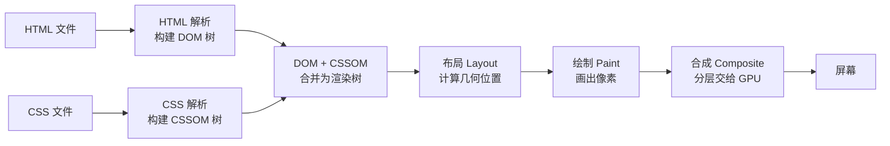

> 直觉引入：你按下回车到看到画面，浏览器走了一条"出菜流水线"——解析 HTML 像备菜、解析 CSS 像摆盘、绘制像上桌，任何一环卡住，你就要多等一秒。本篇就是把这条流水线讲清楚，并学会让关键资源"插队"。
>
> 本节导航：先学流水线五步（含回流/重绘/合成）→ 再学脚本加载与资源提示 → 最后用性能指标验证优化效果。
>
> 前置要求：本篇是 005"性能优化"小节的深化版。需要先理解资源加载与响应式图片（`html5/018`）、CSS 盒模型（`css/004-CSS3BoxModelDetailed`）、浏览器事件循环（`javascript/027`）；移动端性能关联 `html5/034`。建议学完 CSS 性能优化（`css/043-CSSPerformanceOptimizationDetailed`）后再做完整实践。

## 一句话理解

关键渲染路径 = 浏览器把 HTML/CSS 变成首屏像素的必经流水线；
资源加载策略就是"决定哪些资源在这条流水线上排队、哪些走旁路"。

## 流水线五步

1. **HTML 解析**：构建 DOM 树。
2. **CSS 解析**：构建 CSSOM 树（CSS 默认是渲染阻塞资源）。
3. **合并**：DOM + CSSOM 生成渲染树。
4. **布局**：计算每个节点的几何位置。
5. **绘制**：把像素画到屏幕上。

其中任何一步被阻塞，首屏就晚一点。普通 `<script>` 会阻塞第 1 步，
未内联的 CSS 会阻塞第 2 步。

### 图示：渲染流水线



**结构解析：** 前五步是"关键渲染路径"的经典流程，第六步"合成"是现代浏览器新增的：页面被切成图层，最后由 GPU 合成显示。理解第六步是理解"为什么 transform/opacity 动画便宜"的前提。

### 先补两个概念：DOM 树与 CSSOM 树

"DOM 树"就是标签嵌套关系的树形结构。例如下面的 HTML：

```html
<div>
  <h1>标题</h1>
  <p>段落</p>
</div>
```

对应一棵树：`div` 是根，`h1` 与 `p` 是它的两个子节点。浏览器**边读边建**这棵树（增量解析），遇到普通 `<script>` 会暂停——因为脚本可能修改 DOM，必须先执行完再继续。

CSSOM 是"样式树"：每个节点挂着它适用的样式规则。**CSS 默认阻塞渲染**的原因是：浏览器必须等 CSSOM 建好，才知道渲染树里每个节点"长什么样"；在拿到 CSSOM 之前，它不敢画任何像素，否则画完又要重画。

**讲解：**

1. DOM 树回答"页面上有什么"，CSSOM 树回答"它们长什么样"，两者合并才能生成渲染树。
2. "阻塞"不是"不能下载"，而是"解析/渲染流程必须停下来等它"。
3. 这就是为什么业务脚本用 `defer`、首屏 CSS 尽量内联——都是为了减少流水线停等。

## 回流（Reflow）与重绘（Repaint）

页面加载完之后，改动样式会触发三种代价不同的更新：

| 更新类型 | 触发条件 | 代价 |
| --- | --- | --- |
| 回流（Reflow） | 布局变化：改宽高、增删节点、改 margin/padding | 最大：重算几何位置 |
| 重绘（Repaint） | 样式变化但布局不变：改 color、background | 中：重新画像素 |
| 合成（Composite） | 只动图层：transform、opacity | 最小：交给 GPU |

容易触发回流的操作：

- 修改 `width/height/margin/padding` 等布局属性；
- 增删或移动 DOM 节点；
- 读取布局属性（`offsetWidth`、`scrollTop`、`getBoundingClientRect`）——浏览器可能被迫先同步回流；
- 改变字体、窗口尺寸、滚动。

```javascript
// 反模式：循环里逐次插入，每次插入都可能触发回流
const list = document.getElementById('list');
for (const item of items) {
  list.appendChild(createItem(item));
}

// 正解：先在内存里拼好，一次性插入
const fragment = document.createDocumentFragment();
for (const item of items) {
  fragment.appendChild(createItem(item));
}
list.appendChild(fragment);
```

**讲解：**

1. `DocumentFragment` 不在文档树里，往它上面加节点不会触发回流；最后一次插入才让浏览器算一次布局。
2. 虚拟 DOM 的核心思想与此一致：先批量算出差异，再一次提交给真实 DOM。
3. 另一个高频误区是"读写交替"：循环里先读 `offsetWidth` 又写样式，浏览器每次读都可能被迫回流；应把读操作集中在前、写操作集中在后。

## 合成层与 GPU 加速

现代浏览器把页面切成若干图层，最后一帧由 GPU 合成。**动画只要走合成层，主线程就不参与每帧的布局与绘制**，所以"便宜"：

```css
/* 推荐：transform 动画只走合成层 */
.box {
  transition: transform 0.3s;
}
.box:hover {
  transform: translateX(20px);
}

/* 避免：每帧改 left，触发回流 */
/* .box { transition: left 0.3s; } */
```

**讲解：**

1. `transform` 与 `opacity` 动画不会触发回流/重绘，是动画性能的首选。
2. `will-change: transform` 可以提前告诉浏览器"这个元素要动"，为它单独建图层；但图层会占 GPU 内存，**滥用反而更慢**，只在确有动画时使用。
3. 主线程与合成线程的分工：JavaScript 在主线程执行，长任务会卡住渲染（表现为动画掉帧）；把耗时计算放进 Web Worker（`html5/026`），把动画交给 CSS，是两条最重要的减负手段。

## 脚本加载：async 与 defer

| 属性 | 下载时机 | 执行时机 | 适用 |
| --- | --- | --- | --- |
| 无 | 遇到即下载 | 下载完立即执行，阻塞解析 | 极少使用 |
| `async` | 异步下载 | 下载完立即执行（不保证顺序） | 独立统计/广告脚本 |
| `defer` | 异步下载 | HTML 解析完成后按顺序执行 | 大多数业务脚本 |

```html
<script defer src="/js/main.js"></script>
<script async src="/js/analytics.js"></script>
```

**讲解：**

- 普通 `<script>` 遇到即下载并立即执行，HTML 解析被暂停；
- `async` 下载不阻塞，但执行时机不可控，适合相互独立的脚本；
- `defer` 下载不阻塞，HTML 解析完成后按文档顺序执行，是业务脚本的首选。

## 资源提示：preload / prefetch / preconnect

```html
<!-- 首屏关键资源：提前下载，不改变优先级 -->
<link rel="preload" href="/fonts/body.woff2" as="font" type="font/woff2" crossorigin>

<!-- 下一屏可能用到的资源：空闲时下载 -->
<link rel="prefetch" href="/page-next.html">

<!-- 提前建立跨域连接：节省 DNS/TCP/TLS 时间 -->
<link rel="preconnect" href="https://api.example.com">

<!-- 只做 DNS 解析（比 preconnect 更轻量） -->
<link rel="dns-prefetch" href="https://api.example.com">
```

**讲解：**

- `preload` 提前下载首屏确定要用的资源，`as` 必须与资源类型一致；
- `prefetch` 在空闲时下载“未来可能用”的资源，优先级低；
- `preconnect` 提前完成 DNS/TCP/TLS 握手，节省第三方接口的首字节时间。
- `dns-prefetch` 只做 DNS 解析，比 preconnect 更轻量：不确定是否会请求的第三方域名用它即可，确定要请求的再用 preconnect。
- ES Module 场景用 `<link rel="modulepreload">` 预载模块，等价于 preload 但只针对模块资源。

| 提示 | 时机 | 注意 |
| --- | --- | --- |
| preload | 立即、高优先级 | 只用于首屏确定会用到的资源，滥用会挤占带宽 |
| prefetch | 空闲时、低优先级 | 用于用户下一步可能访问的页面 |
| preconnect | 立即建连 | 只对确实要请求的域名使用 |
| dns-prefetch | 空闲时解析 DNS | 轻量，用于"可能用到"的第三方域名 |

## HTTP 缓存与资源加载

资源加载策略离不开 HTTP 缓存：缓存命中时，资源根本不会进入渲染路径，比任何 preload 都"快"。

| 类型 | 机制 | 表现 |
| --- | --- | --- |
| 强缓存 | 响应头 `Cache-Control: max-age=31536000` | 过期前直接用本地副本，不发请求 |
| 协商缓存 | 资源带 `ETag`，每次请求带 `If-None-Match` | 服务器比对后返回 `304`，用缓存 |

**讲解：**

1. 带内容指纹的静态资源（如 `bundle.a1b2c3.js`）用长 `max-age`：文件名变了浏览器自然请求新文件。
2. 入口 HTML 用 `Cache-Control: no-cache`：每次都向服务器校验，保证拿到最新版本。
3. 理解缓存后，preload/prefetch 才不会被"其实已经缓存"的资源浪费优先级。
4. 完整的缓存与 HTTP 语义见 `networking/001-NetworkBasicsAndProtocol` 与后端模块的响应头配置。

## 性能指标速查

| 指标 | 全称 | 含义 | 良好阈值 |
| --- | --- | --- | --- |
| FCP | First Contentful Paint | 首屏出现第一个内容 | ≤ 1.8s |
| LCP | Largest Contentful Paint | 最大内容绘制完成 | ≤ 2.5s |
| CLS | Cumulative Layout Shift | 布局偏移累计分 | ≤ 0.1 |
| TTFB | Time To First Byte | 服务器首字节到达 | ≤ 800ms |
| TBT | Total Blocking Time | 主线程长任务阻塞总时长 | ≤ 200ms |

测量方式：Lighthouse（F12 → Lighthouse → Generate report）一键生成；详细教程见 `javascript/051-CoreWebVitalsAndPerformanceMetrics`。本文的每一条优化都可以映射到指标：内联 CSS 优化 FCP/LCP，图片宽高优化 CLS，脚本 defer 优化 TBT。

## 优化清单

- 关键 CSS 尽量内联或少量拆分，首屏样式不依赖额外请求。
- 业务脚本全部 `defer`，把 HTML 解析让给首屏。
- 字体用 `preload` + `font-display: swap`，避免不可见文字期。
- 图片给宽高或 `aspect-ratio`，防止布局抖动。
- 首屏外组件用懒加载，配合 `prefetch` 预取下一步。

## 常见误区

| 误区 | 真相 |
| --- | --- |
| 所有资源都 preload | preload 会抬高请求优先级，滥用反而拖慢关键资源 |
| async 比 defer 快 | async 执行时机不可控，业务脚本顺序敏感时必须用 defer |
| prefetch 会加速当前页 | prefetch 针对"未来页面"，对当前页没有帮助 |
| CSS 只影响样式不影响性能 | CSSOM 阻塞渲染，大 CSS 会直接推迟首屏 |

## 动手试试

先复制下面这个最小示例到本地 `load.html`，用来做加载实验：

```html
<!DOCTYPE html>
<html lang="zh-CN">
  <head>
    <meta charset="UTF-8" />
    <title>资源加载实验</title>
    <script src="slow.js"></script>
  </head>
  <body>
    <h1>首屏内容</h1>
  </body>
</html>
```

另建一个 `slow.js`，内容随意（如 `console.log('loaded')`），把上面 `<script>` 依次改成 `<script defer>` 与 `<script async>` 对比。

1. 打开任意网站，按 F12 进入 Network 面板，勾选“禁用缓存”后刷新；
2. 观察瀑布图：找出阻塞首屏的脚本（普通 `<script>` 会让后续资源排队）；
3. 把脚本改成 `defer` 或 `async` 再对比，确认首屏时间变化；
4. Performance 面板操作指引：DevTools → Performance 面板 → 点左上角 ● 录制 → 刷新页面 → 等加载完成点 ■ 停止 → 看 Main 时间轴的火焰图：黄色长条是任务，找到阻塞解析的脚本与布局/绘制阶段；
5. 用 Lighthouse 生成报告（F12 → Lighthouse → Generate report），对照"性能指标速查"表看 FCP/LCP/CLS 是否达标；
6. 进阶挑战：给字体加 `preload` + `font-display: swap`，对比文字渲染时间。

> 回到你写的第一个页面（001 的 `index.html`），试着把其中的 `<script>` 标签加上 `defer`，对比加与不加的加载速度差异。

## 核心知识点

> 一句话记住关键渲染路径：HTML 建 DOM，CSS 建 CSSOM，合并成渲染树再布局绘制；脚本用 `defer`，关键资源用 `preload`，未来资源用 `prefetch`。

- 关键渲染路径五步：解析 HTML → 解析 CSS → 生成渲染树 → 布局 → 绘制；
- 普通脚本阻塞解析，业务脚本一律 `defer`；
- CSS 是渲染阻塞资源，首屏 CSS 应内联或精简；
- `preload` 抢首屏、`prefetch` 备未来、`preconnect` 省握手；
- 优化效果用 Performance 面板与 Lighthouse 验证。

## 注意事项与改进建议

| 问题点 | 说明 | 改进方案 |
| --- | --- | --- |
| 滥用 preload | 抬高优先级挤占带宽 | 只 preload 首屏确定资源 |
| 业务脚本用 async | 执行顺序不可控 | 顺序敏感用 defer |
| 大 CSS 外链 | CSSOM 延迟首屏 | 关键样式内联、非关键异步加载 |
| 忽略字体加载 | FOIT 不可见文字 | preload + font-display: swap |
| 图片无尺寸 | 布局抖动（CLS） | 设置宽高或 aspect-ratio |
| 沿用旧优化手段 | HTTP/2 多路复用下，域名分片、雪碧图可能反效果 | 单域多请求即可，按实际性能数据取舍 |

## 扩展学习

- CSS 侧：`css/043-CSSPerformanceOptimizationDetailed` 的渲染路径优化清单；
- 概念基础：`css/004-CSS3BoxModelDetailed`（盒模型）、`javascript/029-EventLoop`（事件循环与主线程）；
- 指标验证：`javascript/051-CoreWebVitalsAndPerformanceMetrics` 中 LCP/CLS/TBT 的测量；
- 资源加载：`html5/020-ImageResponsiveImage` 中图片的优先级与懒加载；
- 移动性能：`html5/036-ViewportConfigMobileFirst` 中移动优先与视口策略；
- 工程实践：构建工具的资源拆分与预加载清单生成。

## 小结

把资源分三类：**首屏必须的**（内联/高优先级）、**当前页次要的**（defer/lazy）、
**未来可能用的**（prefetch/preconnect）。配合
`css/043-CSSPerformanceOptimizationDetailed` 与 `javascript/051-CoreWebVitalsAndPerformanceMetrics` 形成闭环验证。
